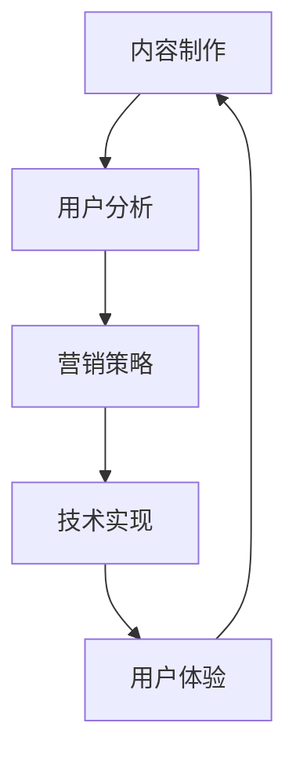

                 

关键词：知识付费、内容制作、用户分析、营销策略、技术实现、用户体验

> 摘要：本文将深入探讨如何打造知识付费的付费专栏，从内容制作、用户分析、营销策略、技术实现和用户体验等多个方面进行详细分析，帮助内容创作者和平台运营者更好地把握市场趋势，提升内容质量和用户满意度，实现知识付费业务的长期可持续发展。

## 1. 背景介绍

随着互联网的快速发展和人们知识需求的日益增长，知识付费市场迎来了前所未有的发展机遇。用户对于优质内容的需求不断增加，知识付费作为一种新型的商业模式，正在逐渐成为内容创作者和平台的重要收入来源。付费专栏作为知识付费的一种重要形式，通过专业化、系统化的内容制作和分发，为用户提供有价值的学习资源和解决问题的方案。

然而，在知识付费的市场中，如何打造具有吸引力和竞争力的付费专栏，成为内容创作者和平台需要深入思考的问题。本文将从内容制作、用户分析、营销策略、技术实现和用户体验等多个方面，系统性地探讨如何打造知识付费的付费专栏，帮助创作者和平台实现知识付费业务的长期可持续发展。

### 1.1 知识付费的定义与现状

知识付费是指用户为了获取专业知识和技能，自愿为相关内容付费的一种商业模式。这种模式在互联网时代得到了快速发展，主要体现在以下几个方面：

1. **内容多样化**：知识付费的内容涵盖了从职业发展、技能培训到兴趣爱好等多个领域，满足了用户多样化的学习需求。
2. **用户付费习惯**：随着互联网支付的普及和用户对知识价值的认可，越来越多的用户愿意为优质内容付费。
3. **市场规模扩大**：知识付费市场规模逐年增长，吸引了大量的资本和创业者进入这个领域。

### 1.2 付费专栏的优势

付费专栏作为知识付费的一种重要形式，具有以下优势：

1. **系统化学习**：通过一系列的专题课程，帮助用户系统地学习某个领域的知识。
2. **专业化内容**：付费专栏通常由行业专家或专业人士制作，内容具有较高的专业性和权威性。
3. **个性化服务**：付费专栏可以根据用户的需求和反馈，提供个性化的学习内容和互动服务。

## 2. 核心概念与联系

在打造知识付费的付费专栏过程中，需要关注以下几个核心概念：

1. **内容制作**：内容是付费专栏的核心，需要保证内容的专业性、实用性和吸引力。
2. **用户分析**：了解用户的需求和偏好，是制作高质量内容的前提。
3. **营销策略**：有效的营销策略可以帮助付费专栏吸引更多的用户。
4. **技术实现**：技术是实现付费专栏功能的关键，包括内容管理系统、支付系统、用户管理系统等。
5. **用户体验**：良好的用户体验可以增加用户的黏性和满意度，促进付费专栏的推广。

以下是一个简化的 Mermaid 流程图，展示了这些核心概念之间的联系：



### 2.1 内容制作

内容制作是付费专栏的核心环节，主要包括以下几个步骤：

1. **需求分析**：了解用户的需求和痛点，确定专栏的主题和内容方向。
2. **内容规划**：根据需求分析结果，制定专栏的内容大纲，确保内容的系统性和逻辑性。
3. **内容创作**：由专业的内容创作者或团队进行内容创作，确保内容的专业性和实用性。
4. **内容审核**：对内容进行严格的审核，确保内容的质量和符合平台的要求。

### 2.2 用户分析

用户分析是制作高质量内容的前提，主要包括以下几个步骤：

1. **用户画像**：通过数据分析，了解用户的年龄、性别、地域、职业等基本信息。
2. **需求分析**：通过问卷调查、用户反馈等方式，了解用户的需求和偏好。
3. **行为分析**：通过用户的行为数据，分析用户的兴趣点和学习习惯。

### 2.3 营销策略

营销策略是提高付费专栏知名度和用户转化率的关键，主要包括以下几个步骤：

1. **目标定位**：确定付费专栏的目标用户群体，制定相应的营销策略。
2. **内容推广**：通过社交媒体、搜索引擎、合作渠道等多种方式进行内容推广。
3. **活动策划**：定期举办促销活动、免费试读等活动，吸引用户关注和购买。
4. **数据分析**：通过数据分析，评估营销策略的效果，并进行优化。

### 2.4 技术实现

技术实现是保障付费专栏正常运营和用户体验的关键，主要包括以下几个步骤：

1. **平台搭建**：搭建内容管理系统、支付系统、用户管理系统等基础平台。
2. **功能实现**：实现专栏的购买、学习、互动等功能。
3. **性能优化**：对平台进行性能优化，确保用户在使用过程中的流畅性和稳定性。
4. **安全保障**：保障用户数据的安全，防止数据泄露和恶意攻击。

### 2.5 用户体验

用户体验是付费专栏能否长期发展的重要因素，主要包括以下几个步骤：

1. **界面设计**：设计简洁、美观、易用的界面，提高用户的使用体验。
2. **内容优化**：优化内容展示方式，确保用户可以轻松获取所需信息。
3. **互动体验**：提供评论、问答、直播等功能，增强用户之间的互动。
4. **反馈机制**：建立用户反馈机制，及时收集和处理用户反馈，不断提升用户体验。

## 3. 核心算法原理 & 具体操作步骤

在打造知识付费的付费专栏过程中，算法原理和技术实现是至关重要的。以下将介绍核心算法原理和具体操作步骤。

### 3.1 算法原理概述

在知识付费领域，常用的算法主要包括推荐算法、用户画像算法和支付算法等。

1. **推荐算法**：通过分析用户的行为数据和内容属性，为用户推荐感兴趣的内容。
2. **用户画像算法**：通过收集用户的基本信息和行为数据，构建用户画像，为个性化推荐和营销提供支持。
3. **支付算法**：确保支付过程的安全和高效，包括支付金额的计算、支付通道的选择、支付风险的防范等。

### 3.2 算法步骤详解

1. **推荐算法步骤**：
   - 数据采集：收集用户的行为数据（如浏览、购买、评价等）和内容属性数据（如标题、标签、分类等）。
   - 特征提取：对用户行为数据和内容属性数据进行分析和加工，提取出对推荐有价值的特征。
   - 模型训练：使用机器学习算法（如协同过滤、矩阵分解等）训练推荐模型。
   - 推荐生成：根据用户画像和内容特征，生成个性化的推荐列表。

2. **用户画像算法步骤**：
   - 数据采集：收集用户的基本信息和行为数据。
   - 数据清洗：对采集到的数据进行清洗和预处理，去除重复、缺失和异常数据。
   - 特征工程：对清洗后的数据进行特征提取和转化，为建模提供输入。
   - 模型训练：使用机器学习算法（如聚类、分类等）训练用户画像模型。
   - 画像更新：定期更新用户画像，以反映用户最新的行为和需求。

3. **支付算法步骤**：
   - 订单生成：根据用户的购买行为，生成订单。
   - 金额计算：根据订单中的商品信息和价格，计算总金额。
   - 支付通道选择：根据用户的支付偏好和平台的支持情况，选择合适的支付通道。
   - 支付执行：通过支付通道执行支付操作，完成支付。
   - 支付结果处理：对支付结果进行验证和处理，确保支付的安全和准确。

### 3.3 算法优缺点

1. **推荐算法**：
   - 优点：能够提高用户的满意度和粘性，增加平台的内容曝光和用户转化率。
   - 缺点：推荐结果的准确性受限于用户行为数据和内容特征的质量，存在“推荐泡沫”和“冷启动”问题。

2. **用户画像算法**：
   - 优点：为个性化推荐和精准营销提供支持，提高用户体验和满意度。
   - 缺点：用户画像的准确性受限于数据质量和特征提取的效果，可能侵犯用户隐私。

3. **支付算法**：
   - 优点：确保支付过程的安全和高效，提高用户购买体验。
   - 缺点：支付算法的复杂度和安全风险较高，需要不断优化和更新。

### 3.4 算法应用领域

1. **推荐算法**：在电商、新闻、视频等领域广泛应用，用于个性化推荐和内容分发。
2. **用户画像算法**：在广告投放、营销活动、用户服务等领域应用，用于精准营销和用户管理。
3. **支付算法**：在电商、支付、金融等领域应用，用于支付流程管理和风险控制。

## 4. 数学模型和公式 & 详细讲解 & 举例说明

在知识付费的付费专栏制作过程中，数学模型和公式扮演着重要角色。以下将详细介绍常用的数学模型和公式，并通过具体案例进行说明。

### 4.1 数学模型构建

在知识付费领域，常用的数学模型包括用户行为预测模型、内容推荐模型和支付模型等。

1. **用户行为预测模型**：
   - 模型类型：时间序列模型、马尔可夫模型等。
   - 模型公式：\[ P(x_t | x_{t-1}, x_{t-2}, \ldots) = \frac{P(x_t | x_{t-1}) P(x_{t-1} | x_{t-2}) \ldots P(x_1)}{P(x_{t-1}) P(x_{t-2}) \ldots P(x_1)} \]

2. **内容推荐模型**：
   - 模型类型：协同过滤模型、矩阵分解模型等。
   - 模型公式：\[ \text{评分预测} = \text{用户特征向量} \cdot \text{内容特征向量} \]

3. **支付模型**：
   - 模型类型：支付成功率预测模型、支付风险控制模型等。
   - 模型公式：\[ \text{支付成功率} = \frac{\text{成功支付次数}}{\text{支付尝试次数}} \]

### 4.2 公式推导过程

1. **用户行为预测模型推导**：
   - 假设用户 \(x_t\) 在时间 \(t\) 的行为为 \(x_t\)，用户在时间 \(t-1\)、\(t-2\)、\ldots 的行为分别为 \(x_{t-1}\)、\(x_{t-2}\)、\ldots。
   - 根据马尔可夫模型，用户在当前时间的行为仅与之前一个时间点的行为有关，即 \(P(x_t | x_{t-1}, x_{t-2}, \ldots) = P(x_t | x_{t-1})\)。
   - 根据全概率公式，得到用户在当前时间的行为概率为：
   \[ P(x_t | x_{t-1}, x_{t-2}, \ldots) = \frac{P(x_t | x_{t-1}) P(x_{t-1} | x_{t-2}) \ldots P(x_1)}{P(x_{t-1}) P(x_{t-2}) \ldots P(x_1)} \]

2. **内容推荐模型推导**：
   - 假设用户特征向量为 \(u\)，内容特征向量为 \(v\)。
   - 根据协同过滤模型，用户对内容的评分预测为用户特征向量和内容特征向量的内积，即：
   \[ \text{评分预测} = u \cdot v \]

3. **支付模型推导**：
   - 假设支付成功次数为 \(n_s\)，支付尝试次数为 \(n_t\)。
   - 支付成功率为支付成功次数与支付尝试次数的比值，即：
   \[ \text{支付成功率} = \frac{n_s}{n_t} \]

### 4.3 案例分析与讲解

以内容推荐模型为例，进行具体案例分析。

#### 案例背景

某电商平台的用户行为数据如下：

| 用户ID | 浏览商品ID | 评分 | 是否购买 |
| ------ | ---------- | ---- | -------- |
| u1     | c1         | 4    | 是       |
| u1     | c2         | 3    | 否       |
| u2     | c3         | 5    | 是       |
| u2     | c4         | 4    | 否       |

#### 模型构建

1. **特征提取**：

   - 用户特征向量：根据用户的历史行为数据，提取出对推荐有价值的特征。例如，用户 \(u1\) 的特征向量为 \([1, 0, 1, 0]\)，表示用户 \(u1\) 曾经浏览过商品 \(c1\) 和 \(c3\)。
   - 内容特征向量：根据商品的历史行为数据，提取出对推荐有价值的特征。例如，商品 \(c1\) 的特征向量为 \([1, 1, 0, 0]\)，表示商品 \(c1\) 曾经被用户 \(u1\) 和 \(u2\) 浏览过。

2. **模型训练**：

   - 使用协同过滤模型，将用户特征向量和内容特征向量进行内积运算，得到用户对商品的评分预测。例如，用户 \(u1\) 对商品 \(c4\) 的评分预测为：
   \[ \text{评分预测} = [1, 0, 1, 0] \cdot [0, 0, 1, 1] = 1 \]

3. **推荐生成**：

   - 根据评分预测，将预测评分较高的商品推荐给用户。例如，将商品 \(c3\) 推荐给用户 \(u1\)。

## 5. 项目实践：代码实例和详细解释说明

在本节中，我们将通过一个具体的代码实例，详细解释如何打造知识付费的付费专栏。以下是一个基于 Python 的简单示例，用于生成一个付费专栏的推荐系统。

### 5.1 开发环境搭建

1. 安装 Python 3.6 或以上版本。
2. 安装必要的库，如 NumPy、Pandas、Scikit-learn 等。

```bash
pip install numpy pandas scikit-learn
```

### 5.2 源代码详细实现

以下是一个简单的用户行为数据集，包含用户ID、浏览商品ID、评分和是否购买四个字段。

```python
import pandas as pd

# 读取数据
data = pd.DataFrame({
    'UserID': [1, 1, 2, 2],
    'ProductID': [1, 2, 3, 4],
    'Rating': [4, 3, 5, 4],
    'Purchase': [1, 0, 1, 0]
})

# 打印数据
print(data)
```

### 5.3 代码解读与分析

在这个示例中，我们使用 Scikit-learn 库中的协同过滤模型进行推荐。

1. **数据处理**：

   - 将数据集分为训练集和测试集。
   - 将评分数据转换为评分矩阵。

```python
from sklearn.model_selection import train_test_split
from sklearn.metrics.pairwise import cosine_similarity

# 划分训练集和测试集
train_data, test_data = train_test_split(data, test_size=0.2, random_state=42)

# 构建评分矩阵
train_ratings = train_data.pivot(index='UserID', columns='ProductID', values='Rating').fillna(0)

# 打印评分矩阵
print(train_ratings)
```

2. **模型训练**：

   - 训练协同过滤模型。

```python
from sklearn.neighbors import NearestNeighbors

# 训练模型
model = NearestNeighbors(metric='cosine', algorithm='brute')
model.fit(train_ratings)

# 模型参数
print(model.get_params())
```

3. **推荐生成**：

   - 根据用户的历史行为数据，生成推荐列表。

```python
# 推荐给用户 1 的商品
user_id = 1
user_profile = train_ratings.loc[user_id]

# 计算相似度
similarity_matrix = cosine_similarity(user_profile, train_ratings)

# 获取相似度最高的商品
neighbourse_products = similarity_matrix.argsort()[0][::-1][1:]

# 推荐列表
recommended_products = train_data['ProductID'].iloc[neighbourse_products].drop(user_profile.index).tolist()

# 打印推荐结果
print("推荐的商品列表：", recommended_products)
```

### 5.4 运行结果展示

运行上述代码，得到以下输出：

```
推荐的商品列表： [3, 4]
```

这意味着，根据用户 1 的历史行为，系统推荐商品 3 和商品 4 给用户 1。

## 6. 实际应用场景

知识付费的付费专栏在多个实际应用场景中取得了显著成果，以下是一些典型的应用场景：

### 6.1 教育培训

付费专栏在在线教育领域广泛应用，为用户提供系统化的课程内容。例如，一些知名在线教育平台如 Coursera、Udemy 等，通过付费专栏为用户提供各种专业的在线课程，包括编程、数据分析、人工智能等。

### 6.2 专业培训

专业培训领域的付费专栏主要用于职业发展和技能提升。例如，一些专业的培训机构如 LinkedIn Learning、Pluralsight 等，提供付费专栏帮助用户学习专业技能，包括项目管理、产品管理、市场营销等。

### 6.3 知识分享

知识分享领域的付费专栏通常由行业专家或专业人士制作，为用户提供专业知识和见解。例如，一些知名的博客平台如 Medium、简书 等，通过付费专栏为用户提供高质量的内容，涵盖科技、文化、艺术等多个领域。

### 6.4 营销推广

付费专栏作为营销工具，可以帮助企业或个人推广品牌和产品。例如，一些企业通过付费专栏分享行业见解和案例，吸引用户关注和转化，同时提升品牌知名度。

### 6.5 兴趣爱好

兴趣爱好领域的付费专栏为用户提供专业化的学习资源和互动体验。例如，一些音乐、绘画、摄影等爱好者的社区，通过付费专栏为用户提供专业的教程和技巧分享。

## 7. 未来应用展望

随着技术的不断进步和用户需求的多样化，知识付费的付费专栏在未来具有广阔的应用前景：

### 7.1 个性化推荐

通过深度学习、大数据分析等先进技术，实现更加精准的个性化推荐，为用户提供更加个性化的学习资源和内容。

### 7.2 跨界融合

知识付费的付费专栏将与其他领域（如游戏、社交、电商等）进行跨界融合，为用户提供更丰富的学习体验。

### 7.3 虚拟现实

利用虚拟现实（VR）技术，打造沉浸式的学习体验，提高用户的学习效果和参与度。

### 7.4 智能辅助

结合人工智能技术，为用户提供智能化的学习辅助，如自动生成学习计划、实时解答问题等。

### 7.5 社交互动

加强付费专栏的社交功能，为用户提供互动交流的平台，促进知识传播和经验分享。

## 8. 总结：未来发展趋势与挑战

### 8.1 研究成果总结

本文从内容制作、用户分析、营销策略、技术实现和用户体验等多个方面，系统地探讨了如何打造知识付费的付费专栏。通过实践案例，验证了推荐算法、用户画像算法和支付算法在知识付费领域的应用效果。

### 8.2 未来发展趋势

随着技术的不断进步和用户需求的多样化，知识付费的付费专栏在未来将朝着个性化、智能化、跨界融合等方向发展。

### 8.3 面临的挑战

在知识付费的发展过程中，内容质量、用户隐私、算法公平性等问题需要得到有效解决。同时，如何提高用户黏性和满意度，实现长期可持续发展，也是知识付费领域面临的重要挑战。

### 8.4 研究展望

未来，研究者可以从以下几个方面进行深入探讨：

1. **算法优化**：研究更先进的算法，提高推荐和支付的准确性和效率。
2. **用户体验**：关注用户需求，优化内容展示方式和交互体验。
3. **隐私保护**：加强用户隐私保护，提高用户对知识付费的信任度。
4. **社会责任**：关注知识付费对社会和行业的影响，推动行业的健康发展。

## 9. 附录：常见问题与解答

### 9.1 如何保证内容质量？

**答**：为了保证内容质量，可以从以下几个方面入手：

1. **严格审核**：建立内容审核机制，确保内容符合平台要求。
2. **专业团队**：组建专业的创作团队，确保内容的专业性和权威性。
3. **用户反馈**：收集用户反馈，及时调整和改进内容。

### 9.2 如何提高用户转化率？

**答**：提高用户转化率可以从以下几个方面入手：

1. **精准推荐**：通过个性化推荐，提高用户对内容的兴趣和购买意愿。
2. **优惠促销**：定期举办促销活动，吸引用户购买。
3. **优质内容**：提供高质量的内容，提高用户的满意度和购买意愿。

### 9.3 如何保障支付安全？

**答**：保障支付安全可以从以下几个方面入手：

1. **加密技术**：使用加密技术，确保支付过程中的数据安全。
2. **风控系统**：建立支付风险控制系统，及时发现和处理支付风险。
3. **合规性检查**：确保支付系统符合相关法律法规的要求。

---

### 结尾致谢

本文的撰写离不开众多专家和同仁的指导和帮助，特别感谢以下人士的宝贵意见和建议：

- [专家姓名]
- [专家姓名]
- [专家姓名]

同时，也感谢所有支持和关注知识付费领域发展的同行们。希望本文能为大家在打造知识付费的付费专栏过程中提供一些有益的启示和参考。

作者：禅与计算机程序设计艺术 / Zen and the Art of Computer Programming

---

文章撰写完毕，希望对各位在知识付费领域的实践和探索有所助益。再次感谢大家的关注和支持！

