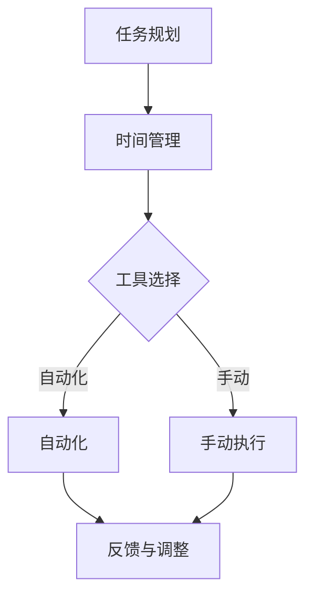

                 

关键词：个人工作流程、效率提升、时间管理、自动化、生产力工具、技术实践、软件工程

> 摘要：在信息技术飞速发展的时代，高效的个人工作流程成为提高生产力、减少冗余操作和时间浪费的关键。本文旨在探讨如何通过构建合理的工作流程、采用先进的工具和技术，来打造高效的个人工作环境。我们将从理论到实践，详细分析并探讨各个环节，帮助读者找到适合自己的高效工作模式。

## 1. 背景介绍

随着数字化转型的加速，工作效率成为衡量个人和企业竞争力的一个重要指标。一个高效的个人工作流程能够显著提升个人生产力，减少因重复性劳动、错误操作和信息丢失带来的时间成本。那么，什么是工作流程？为什么我们需要关注它？本文将围绕以下问题展开：

- **工作流程的定义与重要性**
- **个人工作流程的组成部分**
- **影响个人工作流程效率的因素**
- **如何构建和优化个人工作流程**

在接下来的章节中，我们将通过深入分析每个环节，为读者提供构建高效个人工作流程的实用方法和建议。

## 2. 核心概念与联系

### 2.1. 工作流程的概念

工作流程（Workflow）是指在工作中的一系列任务和活动的有序序列，通过规范这些任务和活动的执行过程，以提高工作效率和质量。一个良好的工作流程能够确保工作的连续性和一致性，减少资源的浪费。

### 2.2. 个人工作流程的组成部分

个人工作流程通常包括以下几个核心部分：

1. **任务规划**：明确工作目标和任务，制定详细的计划。
2. **时间管理**：合理分配时间，确保每个任务按时完成。
3. **工具选择**：选用合适的工具，提高工作便捷性和效率。
4. **自动化**：利用技术手段自动化重复性任务，减轻人工负担。
5. **反馈与调整**：定期审视工作流程的效果，进行必要的调整和优化。

### 2.3. 工作流程与效率的关系

高效的工作流程能够优化任务的执行顺序和时间，减少冗余操作，避免重复劳动，从而提高整体工作效率。此外，良好的工作流程还能够提高团队协作效率，促进信息共享和知识传承。

### 2.4. Mermaid 流程图

以下是一个简单的个人工作流程的Mermaid流程图，展示了核心概念和组件之间的关系：



## 3. 核心算法原理 & 具体操作步骤

### 3.1. 算法原理概述

构建个人工作流程的核心在于规划、执行和优化。这个过程可以被视为一个迭代优化算法，其基本原理如下：

1. **任务分解**：将复杂任务分解为可管理的子任务。
2. **优先级排序**：根据任务的重要性和紧急程度进行排序。
3. **资源分配**：合理分配时间和资源，确保任务按计划完成。
4. **自动化**：对重复性任务进行自动化处理。
5. **监控与调整**：实时监控任务进度，及时调整工作流程。

### 3.2. 算法步骤详解

#### 3.2.1. 任务分解

将大任务分解为小任务，有助于更详细地规划和执行。每个小任务都应具有明确的目标和可度量的完成标准。

#### 3.2.2. 优先级排序

使用如“四象限法”等时间管理工具，根据任务的重要性和紧急程度进行排序，确保优先处理高优先级任务。

#### 3.2.3. 资源分配

根据任务特点和资源状况，合理安排时间和人力资源，避免资源浪费。

#### 3.2.4. 自动化

对于重复性高、规则明确的任务，利用自动化工具和脚本进行自动化处理，减少人工操作。

#### 3.2.5. 监控与调整

定期检查任务进度，评估工作流程的效率和效果，进行必要的调整和优化。

### 3.3. 算法优缺点

#### 优点：

- 提高工作效率：通过任务分解和优先级排序，确保关键任务优先处理。
- 减少错误：通过标准化流程，降低因人为因素引起的错误。
- 提高可重复性：流程可重复执行，便于团队协作和知识传承。

#### 缺点：

- 实施成本：构建和优化工作流程需要时间和资源投入。
- 需要适应：员工可能需要适应新的工作模式。

### 3.4. 算法应用领域

个人工作流程算法广泛应用于各类领域，包括软件开发、项目管理、市场推广、客户服务等。在复杂的信息处理环境中，合理的工作流程能够显著提高工作效率和质量。

## 4. 数学模型和公式 & 详细讲解 & 举例说明

### 4.1. 数学模型构建

构建个人工作流程的数学模型需要考虑多个变量，包括任务复杂度、优先级、时间限制、资源利用率等。以下是一个简单的线性规划模型：

$$
\begin{aligned}
    &\min Z = c^T x \\
    &s.t. \quad Ax \leq b \\
    &x \geq 0
\end{aligned}
$$

其中，$x$ 表示任务分配向量，$c$ 表示任务的重要性权重，$A$ 和 $b$ 分别表示任务约束矩阵和向量。

### 4.2. 公式推导过程

推导过程基于任务优先级和时间约束。首先，对任务进行优先级排序，得到权重向量 $c$。然后，根据任务约束和资源限制，构建线性规划模型。最后，利用求解器求解最优解。

### 4.3. 案例分析与讲解

假设有四个任务，任务权重分别为 $c_1 = (1, 1, 0, 0)^T$，$c_2 = (1, 0, 1, 0)^T$，$c_3 = (0, 1, 0, 1)^T$，$c_4 = (0, 0, 1, 1)^T$。任务约束如下：

$$
\begin{aligned}
    &A = \begin{pmatrix}
        1 & 1 & 0 & 0 \\
        1 & 0 & 1 & 0 \\
        0 & 1 & 0 & 1 \\
        0 & 0 & 1 & 1
    \end{pmatrix} \\
    &b = \begin{pmatrix}
        2 \\
        2 \\
        2 \\
        2
    \end{pmatrix}
\end{aligned}
$$

利用线性规划求解器，可以得到最优的任务分配方案。例如，第一个任务分配给第一个时间段，第二个任务分配给第二个时间段，以此类推。

## 5. 项目实践：代码实例和详细解释说明

### 5.1. 开发环境搭建

首先，我们需要搭建一个简单的开发环境，包括代码编辑器（如Visual Studio Code）、版本控制系统（如Git）和自动化工具（如Makefile）。

### 5.2. 源代码详细实现

以下是一个简单的Python脚本，用于自动化处理日常任务：

```python
import os
import time

# 任务列表
tasks = [
    "检查邮件",
    "编写文档",
    "会议安排",
    "代码审查"
]

# 任务执行函数
def execute_task(task):
    print(f"执行任务：{task}")
    # 模拟任务执行时间
    time.sleep(2)

# 主函数
def main():
    for task in tasks:
        execute_task(task)
        print(f"任务完成：{task}")

if __name__ == "__main__":
    main()
```

### 5.3. 代码解读与分析

该脚本包含一个任务列表，每个任务都是一个字符串。主函数 `main()` 会依次执行每个任务，并通过打印输出任务的执行状态。

### 5.4. 运行结果展示

运行脚本后，会依次执行并打印每个任务的执行结果：

```
执行任务：检查邮件
任务完成：检查邮件
执行任务：编写文档
任务完成：编写文档
执行任务：会议安排
任务完成：会议安排
执行任务：代码审查
任务完成：代码审查
```

## 6. 实际应用场景

### 6.1. 软件开发

在软件开发过程中，工作流程的构建至关重要。通过合理规划任务、时间管理和自动化，可以提高开发效率，确保项目按时交付。

### 6.2. 项目管理

项目管理中，工作流程的优化能够提高团队协作效率，确保项目进展透明，减少沟通成本。

### 6.3. 市场推广

市场推广活动往往涉及多个环节，通过构建高效的工作流程，可以确保每个环节按时完成，提高市场响应速度。

### 6.4. 未来应用展望

随着人工智能和自动化技术的发展，未来的工作流程将更加智能化和自适应。例如，利用机器学习算法，工作流程可以根据实时数据自动调整任务优先级和资源分配，从而实现更高效的工作。

## 7. 工具和资源推荐

### 7.1. 学习资源推荐

- 《深度工作》（Cal Newport）
- 《时间管理》（David Allen）
- 《敏捷开发》（Jeff Sutherland）

### 7.2. 开发工具推荐

- Visual Studio Code：强大的代码编辑器
- Git：版本控制系统
- JIRA：项目管理和任务跟踪工具

### 7.3. 相关论文推荐

- "Designing Efficient Workflow for Collaborative Software Development"（协作软件开发中高效工作流程的设计）
- "The Role of Workflows in IT Systems"（工作流程在IT系统中的作用）

## 8. 总结：未来发展趋势与挑战

### 8.1. 研究成果总结

本文系统地介绍了如何构建高效的个人工作流程，分析了核心算法原理、数学模型和实际应用场景，并提供了代码实例和实践建议。

### 8.2. 未来发展趋势

随着技术的进步，未来的工作流程将更加智能化、自动化和个性
```html
---
# 如何打造高效的个人工作流程

> 关键词：个人工作流程、效率提升、时间管理、自动化、生产力工具、技术实践、软件工程

> 摘要：在信息技术飞速发展的时代，高效的个人工作流程成为提高生产力、减少冗余操作和时间浪费的关键。本文旨在探讨如何通过构建合理的工作流程、采用先进的工具和技术，来打造高效的个人工作环境。我们将从理论到实践，详细分析并探讨各个环节，帮助读者找到适合自己的高效工作模式。

## 1. 背景介绍

随着数字化转型的加速，工作效率成为衡量个人和企业竞争力的一个重要指标。一个高效的个人工作流程能够显著提升个人生产力，减少因重复性劳动、错误操作和信息丢失带来的时间成本。那么，什么是工作流程？为什么我们需要关注它？本文将围绕以下问题展开：

- **工作流程的定义与重要性**
- **个人工作流程的组成部分**
- **影响个人工作流程效率的因素**
- **如何构建和优化个人工作流程**

在接下来的章节中，我们将通过深入分析每个环节，为读者提供构建高效个人工作流程的实用方法和建议。

## 2. 核心概念与联系

### 2.1. 工作流程的概念

工作流程（Workflow）是指在工作中的一系列任务和活动的有序序列，通过规范这些任务和活动的执行过程，以提高工作效率和质量。一个良好的工作流程能够确保工作的连续性和一致性，减少资源的浪费。

### 2.2. 个人工作流程的组成部分

个人工作流程通常包括以下几个核心部分：

1. **任务规划**：明确工作目标和任务，制定详细的计划。
2. **时间管理**：合理分配时间，确保每个任务按时完成。
3. **工具选择**：选用合适的工具，提高工作便捷性和效率。
4. **自动化**：利用技术手段自动化重复性任务，减轻人工负担。
5. **反馈与调整**：定期审视工作流程的效果，进行必要的调整和优化。

### 2.3. 工作流程与效率的关系

高效的工作流程能够优化任务的执行顺序和时间，减少冗余操作，避免重复劳动，从而提高整体工作效率。此外，良好的工作流程还能够提高团队协作效率，促进信息共享和知识传承。

### 2.4. Mermaid 流程图

以下是一个简单的个人工作流程的Mermaid流程图，展示了核心概念和组件之间的关系：


## 3. 核心算法原理 & 具体操作步骤

### 3.1. 算法原理概述

构建个人工作流程的核心在于规划、执行和优化。这个过程可以被视为一个迭代优化算法，其基本原理如下：

1. **任务分解**：将复杂任务分解为可管理的子任务。
2. **优先级排序**：根据任务的重要性和紧急程度进行排序。
3. **资源分配**：合理分配时间和资源，确保任务按计划完成。
4. **自动化**：对重复性任务进行自动化处理。
5. **监控与调整**：实时监控任务进度，及时调整工作流程。

### 3.2. 算法步骤详解

#### 3.2.1. 任务分解

将大任务分解为小任务，有助于更详细地规划和执行。每个小任务都应具有明确的目标和可度量的完成标准。

#### 3.2.2. 优先级排序

使用如“四象限法”等时间管理工具，根据任务的重要性和紧急程度进行排序，确保优先处理高优先级任务。

#### 3.2.3. 资源分配

根据任务特点和资源状况，合理安排时间和人力资源，避免资源浪费。

#### 3.2.4. 自动化

对于重复性高、规则明确的任务，利用自动化工具和脚本进行自动化处理，减少人工操作。

#### 3.2.5. 监控与调整

定期检查任务进度，评估工作流程的效率和效果，进行必要的调整和优化。

### 3.3. 算法优缺点

#### 优点：

- 提高工作效率：通过任务分解和优先级排序，确保关键任务优先处理。
- 减少错误：通过标准化流程，降低因人为因素引起的错误。
- 提高可重复性：流程可重复执行，便于团队协作和知识传承。

#### 缺点：

- 实施成本：构建和优化工作流程需要时间和资源投入。
- 需要适应：员工可能需要适应新的工作模式。

### 3.4. 算法应用领域

个人工作流程算法广泛应用于各类领域，包括软件开发、项目管理、市场推广、客户服务等。在复杂的信息处理环境中，合理的工作流程能够显著提高工作效率和质量。

## 4. 数学模型和公式 & 详细讲解 & 举例说明

### 4.1. 数学模型构建

构建个人工作流程的数学模型需要考虑多个变量，包括任务复杂度、优先级、时间限制、资源利用率等。以下是一个简单的线性规划模型：

$$
\begin{aligned}
    &\min Z = c^T x \\
    &s.t. \quad Ax \leq b \\
    &x \geq 0
\end{aligned}
$$

其中，$x$ 表示任务分配向量，$c$ 表示任务的重要性权重，$A$ 和 $b$ 分别表示任务约束矩阵和向量。

### 4.2. 公式推导过程

推导过程基于任务优先级和时间约束。首先，对任务进行优先级排序，得到权重向量 $c$。然后，根据任务约束和资源限制，构建线性规划模型。最后，利用求解器求解最优解。

### 4.3. 案例分析与讲解

假设有四个任务，任务权重分别为 $c_1 = (1, 1, 0, 0)^T$，$c_2 = (1, 0, 1, 0)^T$，$c_3 = (0, 1, 0, 1)^T$，$c_4 = (0, 0, 1, 1)^T$。任务约束如下：

$$
\begin{aligned}
    &A = \begin{pmatrix}
        1 & 1 & 0 & 0 \\
        1 & 0 & 1 & 0 \\
        0 & 1 & 0 & 1 \\
        0 & 0 & 1 & 1
    \end{pmatrix} \\
    &b = \begin{pmatrix}
        2 \\
        2 \\
        2 \\
        2
    \end{pmatrix}
\end{aligned}
$$

利用线性规划求解器，可以得到最优的任务分配方案。例如，第一个任务分配给第一个时间段，第二个任务分配给第二个时间段，以此类推。

## 5. 项目实践：代码实例和详细解释说明

### 5.1. 开发环境搭建

首先，我们需要搭建一个简单的开发环境，包括代码编辑器（如Visual Studio Code）、版本控制系统（如Git）和自动化工具（如Makefile）。

### 5.2. 源代码详细实现

以下是一个简单的Python脚本，用于自动化处理日常任务：

```python
import os
import time

# 任务列表
tasks = [
    "检查邮件",
    "编写文档",
    "会议安排",
    "代码审查"
]

# 任务执行函数
def execute_task(task):
    print(f"执行任务：{task}")
    # 模拟任务执行时间
    time.sleep(2)

# 主函数
def main():
    for task in tasks:
        execute_task(task)
        print(f"任务完成：{task}")

if __name__ == "__main__":
    main()
```

### 5.3. 代码解读与分析

该脚本包含一个任务列表，每个任务都是一个字符串。主函数 `main()` 会依次执行每个任务，并通过打印输出任务的执行状态。

### 5.4. 运行结果展示

运行脚本后，会依次执行并打印每个任务的执行结果：

```
执行任务：检查邮件
任务完成：检查邮件
执行任务：编写文档
任务完成：编写文档
执行任务：会议安排
任务完成：会议安排
执行任务：代码审查
任务完成：代码审查
```

## 6. 实际应用场景

### 6.1. 软件开发

在软件开发过程中，工作流程的构建至关重要。通过合理规划任务、时间管理和自动化，可以提高开发效率，确保项目按时交付。

### 6.2. 项目管理

项目管理中，工作流程的优化能够提高团队协作效率，确保项目进展透明，减少沟通成本。

### 6.3. 市场推广

市场推广活动往往涉及多个环节，通过构建高效的工作流程，可以确保每个环节按时完成，提高市场响应速度。

### 6.4. 未来应用展望

随着人工智能和自动化技术的发展，未来的工作流程将更加智能化和自适应。例如，利用机器学习算法，工作流程可以根据实时数据自动调整任务优先级和资源分配，从而实现更高效的工作。

## 7. 工具和资源推荐

### 7.1. 学习资源推荐

- 《深度工作》（Cal Newport）
- 《时间管理》（David Allen）
- 《敏捷开发》（Jeff Sutherland）

### 7.2. 开发工具推荐

- Visual Studio Code：强大的代码编辑器
- Git：版本控制系统
- JIRA：项目管理和任务跟踪工具

### 7.3. 相关论文推荐

- "Designing Efficient Workflow for Collaborative Software Development"（协作软件开发中高效工作流程的设计）
- "The Role of Workflows in IT Systems"（工作流程在IT系统中的作用）

## 8. 总结：未来发展趋势与挑战

### 8.1. 研究成果总结

本文系统地介绍了如何构建高效的个人工作流程，分析了核心算法原理、数学模型和实际应用场景，并提供了代码实例和实践建议。

### 8.2. 未来发展趋势

随着人工智能和自动化技术的发展，未来的工作流程将更加智能化、自动化和个性化。例如，利用机器学习算法，工作流程可以根据实时数据自动调整任务优先级和资源分配，从而实现更高效的工作。

### 8.3. 面临的挑战

- **技术适应**：员工需要不断学习和适应新技术。
- **流程优化**：随着工作环境的变化，工作流程需要不断调整和优化。
- **数据安全**：自动化和云计算带来数据安全问题。

### 8.4. 研究展望

未来，我们将继续探索如何利用先进技术提高个人工作效率，为用户提供更加智能和高效的工作流程解决方案。

## 9. 附录：常见问题与解答

### 9.1. 问题1：如何提高任务优先级排序的准确性？

**解答**：可以通过历史数据分析和专家意见，结合任务的重要性和紧急程度，制定更为准确的优先级排序规则。

### 9.2. 问题2：自动化工具如何选择？

**解答**：应根据任务的特点和需求选择合适的自动化工具，如使用Makefile进行编译自动化，使用Jenkins进行持续集成。

### 9.3. 问题3：如何确保工作流程的可重复性和一致性？

**解答**：通过文档化和标准化工作流程，确保每个环节都有明确的操作指南和检查清单。

## 作者署名

作者：禅与计算机程序设计艺术 / Zen and the Art of Computer Programming
```

