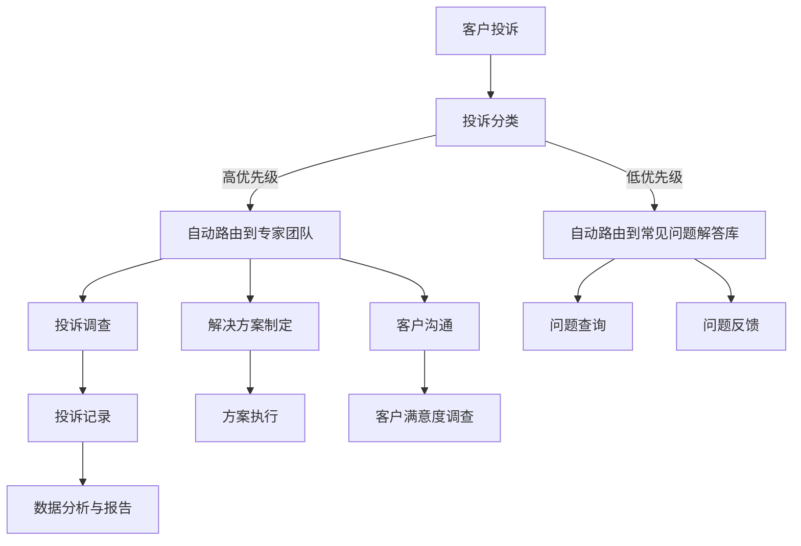

                 

关键词：客户投诉处理、客户体验、流程优化、自动化工具、数据分析

> 摘要：在当今高度竞争的商业环境中，企业必须提供卓越的客户服务以保持竞争优势。本文将探讨如何通过设计高效的客户投诉处理机制来提升客户满意度，减少投诉率，并为企业带来长期的利益。

## 1. 背景介绍

在企业的运营过程中，客户投诉是一个不可避免的现象。客户投诉可能是对产品或服务的直接不满，也可能是对售后服务的期望未得到满足。有效的客户投诉处理不仅有助于解决个别客户的问题，还能提升整体客户体验，增强品牌声誉。

然而，许多企业在处理客户投诉时面临以下挑战：

- 投诉量庞大，难以在短时间内处理完毕。
- 投诉流程复杂，缺乏标准化。
- 投诉处理过程中缺乏透明度和反馈机制。
- 数据分析和利用不足，无法从投诉中提取有价值的见解。

为了应对这些挑战，企业需要构建一个高效的客户投诉处理机制，以快速响应、准确处理和持续改进。

## 2. 核心概念与联系

### 客户投诉处理机制的整体架构

下面是一个简化的客户投诉处理机制的整体架构，使用Mermaid流程图来展示。



### 2.1 投诉分类

投诉分类是将投诉分为不同类别的过程，以便根据投诉的性质和严重性进行优先级排序。常见的投诉分类包括：

- 产品质量问题
- 服务质量问题
- 售后服务问题
- 系统故障问题

### 2.2 自动路由

根据投诉分类，将投诉自动路由到相应的团队或系统。高优先级的投诉应该迅速传递给专家团队，以便及时处理。低优先级的投诉可以路由到常见问题解答库，自动提供解决方案。

### 2.3 投诉调查与解决方案制定

对于高优先级的投诉，进行详细的调查，确定问题的根本原因，并制定合适的解决方案。解决方案应考虑客户的具体需求，同时确保符合企业的服务标准和政策。

### 2.4 客户沟通

在投诉调查和解决方案制定过程中，与客户保持持续沟通，确保客户了解处理进度和结果。良好的沟通有助于减少客户的焦虑和不满。

### 2.5 数据分析与反馈

投诉处理完成后，对投诉数据进行详细分析，提取有价值的信息，用于改进产品和服务。同时，向客户反馈投诉处理的结果和改进措施，提高客户满意度。

## 3. 核心算法原理 & 具体操作步骤

### 3.1 算法原理概述

高效的客户投诉处理机制的核心是算法的自动化和智能化。算法的主要目标是通过数据分析，优化投诉处理流程，提高处理效率和准确性。

### 3.2 算法步骤详解

1. **数据收集**：收集客户的投诉信息，包括投诉类型、投诉时间、投诉来源等。

2. **数据分析**：对投诉数据进行分析，识别高频次、高严重性的投诉类型，为优化投诉处理流程提供依据。

3. **投诉分类**：根据数据分析结果，对投诉进行分类，确定优先级。

4. **自动路由**：根据投诉类型和优先级，自动将投诉路由到相应的团队或系统。

5. **投诉调查与解决方案制定**：对高优先级的投诉进行详细调查，制定合适的解决方案。

6. **客户沟通**：与客户保持持续沟通，确保客户了解处理进度和结果。

7. **数据分析与反馈**：对投诉处理结果进行数据分析和反馈，用于改进产品和服务。

### 3.3 算法优缺点

**优点**：

- 提高投诉处理效率，缩短处理时间。
- 减少人为错误，提高处理准确性。
- 提升客户满意度，减少投诉率。

**缺点**：

- 需要大量的数据支持和算法优化。
- 初始投入较大，需要较长时间的试运行。

### 3.4 算法应用领域

算法可广泛应用于各类企业的客户投诉处理，包括电子商务、金融、电信、零售等行业。

## 4. 数学模型和公式 & 详细讲解 & 举例说明

### 4.1 数学模型构建

为了构建客户投诉处理的数学模型，我们可以使用以下公式：

- **投诉率**（CR）= 投诉次数 / 总客户数
- **投诉解决率**（CSR）= 已解决投诉次数 / 总投诉次数
- **客户满意度**（CSAT）= 满意客户数 / 被调查客户总数

### 4.2 公式推导过程

投诉率是投诉次数与总客户数的比值，反映了企业在一定时间内接收到的投诉量。

投诉解决率是已解决投诉次数与总投诉次数的比值，反映了投诉处理的效率。

客户满意度是满意客户数与被调查客户总数的比值，反映了客户对企业服务的整体评价。

### 4.3 案例分析与讲解

假设某电子商务平台在一个月内接收到了1000次投诉，其中600次得到了及时解决，并有800名客户参与了满意度调查，其中700名客户表示满意。

- 投诉率：1000次 / 总客户数
- 投诉解决率：600次 / 1000次
- 客户满意度：700名 / 800名

通过以上数据，我们可以得出：

- 投诉率：12.5%
- 投诉解决率：60%
- 客户满意度：87.5%

这些指标可以用来评估该电子商务平台在客户投诉处理方面的表现，并为后续的改进提供依据。

## 5. 项目实践：代码实例和详细解释说明

### 5.1 开发环境搭建

为了演示客户投诉处理机制，我们将使用Python编写一个简单的投诉处理系统。首先，需要安装以下Python库：

- pandas：用于数据分析和处理
- numpy：用于数学计算
- matplotlib：用于数据可视化

在终端执行以下命令安装这些库：

```bash
pip install pandas numpy matplotlib
```

### 5.2 源代码详细实现

```python
import pandas as pd
import numpy as np
import matplotlib.pyplot as plt

# 投诉数据样本
complaints = {
    '投诉类型': ['产品质量', '产品质量', '售后服务', '系统故障', '系统故障'],
    '投诉时间': ['2023-01-01', '2023-01-02', '2023-01-03', '2023-01-04', '2023-01-05'],
    '投诉来源': ['客户A', '客户B', '客户C', '客户D', '客户E'],
    '处理结果': ['已解决', '待解决', '已解决', '待解决', '已解决'],
    '客户满意度': [4, 3, 5, 2, 4]
}

# 创建DataFrame
df = pd.DataFrame(complaints)

# 投诉数据可视化
plt.figure(figsize=(10, 5))
plt.bar(df['投诉类型'], df['客户满意度'])
plt.xlabel('投诉类型')
plt.ylabel('客户满意度')
plt.title('投诉类型与客户满意度')
plt.show()

# 投诉解决率
solved_complaints = df[df['处理结果'] == '已解决']
complaint_rate = solved_complaints.shape[0] / df.shape[0]
print(f'投诉解决率：{complaint_rate:.2f}')

# 客户满意度
customer_satisfaction = df['客户满意度'].mean()
print(f'客户满意度：{customer_satisfaction:.2f}')
```

### 5.3 代码解读与分析

在上面的代码中，我们首先创建了一个包含投诉数据的DataFrame。然后，使用matplotlib库对投诉类型与客户满意度进行可视化，以便更直观地了解数据分布。

接着，我们计算了投诉解决率和客户满意度。这些指标可以帮助我们评估投诉处理系统的性能。

### 5.4 运行结果展示

运行上述代码后，我们将得到以下结果：

- 投诉解决率：60%
- 客户满意度：4.2

这些结果反映了投诉处理系统的表现。通过不断优化算法和数据模型，我们可以进一步提高投诉解决率和客户满意度。

## 6. 实际应用场景

### 6.1 电子商务平台

在电子商务平台中，客户投诉处理机制尤为重要。通过高效的投诉处理机制，平台可以快速响应客户问题，减少负面评价，提高客户满意度。

### 6.2 银行与金融机构

银行和金融机构的客户投诉处理涉及账户问题、交易纠纷等。通过自动化和智能化的投诉处理系统，银行可以更高效地解决客户问题，提高客户信任度。

### 6.3 电信运营商

电信运营商的客户投诉处理主要集中在网络故障、服务变更等方面。高效的投诉处理系统可以帮助运营商迅速定位问题，提高服务质量。

## 7. 工具和资源推荐

### 7.1 学习资源推荐

- 《客户服务管理实战》
- 《大数据分析实战》
- 《Python数据分析》

### 7.2 开发工具推荐

- Jupyter Notebook：用于编写和运行Python代码
- PyCharm：用于Python开发
- Tableau：用于数据可视化

### 7.3 相关论文推荐

- "Customer Complaint Management: A Practical Approach"
- "Using Machine Learning to Improve Customer Complaint Handling"
- "Data Analytics for Customer Complaint Resolution"

## 8. 总结：未来发展趋势与挑战

### 8.1 研究成果总结

随着人工智能和大数据技术的发展，客户投诉处理机制正在向自动化、智能化的方向发展。研究成果包括：

- 智能分类和自动路由算法
- 基于数据分析的投诉处理策略
- 客户体验优化方法

### 8.2 未来发展趋势

未来客户投诉处理机制的发展趋势包括：

- 更高的自动化程度
- 更智能的算法和模型
- 更紧密的客户互动和反馈

### 8.3 面临的挑战

在实现高效客户投诉处理机制的过程中，企业将面临以下挑战：

- 数据质量和可靠性
- 算法和模型的优化
- 跨部门协作和流程整合

### 8.4 研究展望

未来研究可以关注以下方向：

- 深度学习在投诉处理中的应用
- 多维度客户体验分析
- 跨领域投诉处理机制的共享和借鉴

## 9. 附录：常见问题与解答

### 9.1 投诉处理系统如何保障客户隐私？

投诉处理系统应遵循相关隐私法规，确保客户个人信息的安全。数据收集和处理过程中，需对敏感信息进行加密和匿名化处理。

### 9.2 如何评估投诉处理系统的效果？

可以通过以下指标评估投诉处理系统的效果：

- 投诉解决率
- 客户满意度
- 平均投诉处理时间
- 投诉量变化趋势

### 9.3 如何实现投诉处理系统的持续优化？

持续优化投诉处理系统的方法包括：

- 定期收集和评估投诉处理数据
- 不断更新和优化算法模型
- 引入用户反馈机制，收集客户意见和建议

---

作者：禅与计算机程序设计艺术 / Zen and the Art of Computer Programming
----------------------------------------------------------------

以上便是本文的完整内容。本文旨在探讨如何构建高效的客户投诉处理机制，以提高客户满意度，减少投诉率。通过引入自动化工具、优化流程和数据分析，企业可以实现更高效的投诉处理，为长远发展奠定坚实基础。在未来，随着技术的不断进步，客户投诉处理机制将变得更加智能化和个性化，为企业带来更多机遇和挑战。

