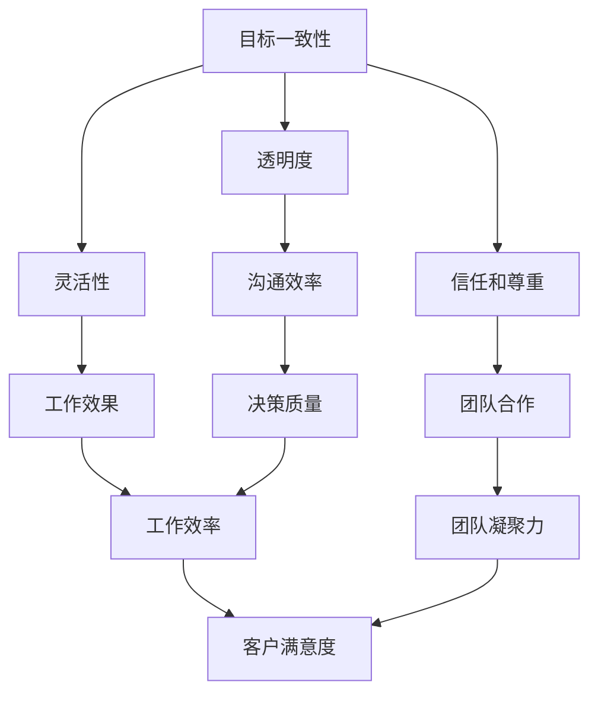

                 

远程工作已成为现代企业运作的常态，尤其是在技术行业。随着全球化的发展，团队成员可能分散在世界各地，打造一个高效的远程团队成为企业成功的关键。本文将探讨如何通过一系列策略和工具，构建一个高效、协作且充满活力的远程团队。

## 关键词

- 远程团队建设
- 高效协作
- 数字工具
- 跨文化沟通
- 人才管理

## 摘要

本文旨在提供一些建设高效远程团队的实用策略。我们将深入探讨远程团队面临的挑战，介绍一系列工具和方法，以帮助团队克服障碍，提高生产力，并促进团队成员之间的联系。通过实践案例和专家建议，本文为企业管理者和团队成员提供了实用的指导。

## 1. 背景介绍

### 远程工作的普及

随着互联网技术的进步和全球化的发展，远程工作已经从一种新兴的工作方式逐渐成为主流。许多企业，尤其是技术公司，已经开始采用远程工作模式，以吸引和保留顶尖人才。根据一些报告，全球远程工作者的比例在过去几年中显著增加，预计这一趋势将继续上升。

### 远程团队面临的挑战

尽管远程工作有许多优点，但也带来了一系列挑战。这些挑战包括：

- **沟通障碍**：由于地理位置的差异，团队成员之间的沟通可能变得复杂和困难。
- **时间管理**：远程团队成员可能面临时间管理上的挑战，特别是在跨越不同时区的情况下。
- **文化差异**：跨文化团队需要克服语言和文化上的障碍。
- **信任和团队合作**：远程工作可能导致团队成员之间的信任和团队合作感减弱。

## 2. 核心概念与联系

### 远程团队协作的核心概念

为了构建一个高效的远程团队，我们需要了解以下几个核心概念：

- **目标一致性**：所有团队成员需要明确团队的目标和期望。
- **透明度**：确保团队的所有成员都能访问相同的信息和资源。
- **灵活性**：远程工作需要灵活的工作安排和沟通方式。
- **信任和尊重**：团队成员之间需要建立信任，并尊重彼此的差异。

### 核心概念的联系

以下是构建高效远程团队所需核心概念的Mermaid流程图：



## 3. 核心算法原理 & 具体操作步骤

### 3.1 算法原理概述

构建高效远程团队的核心算法基于以下几个原则：

- **目标导向**：通过明确的目标和期望来引导团队行动。
- **数据驱动**：使用数据来评估团队的表现，并做出相应的调整。
- **持续改进**：不断学习和改进，以优化团队的工作流程。

### 3.2 算法步骤详解

#### 第一步：设定明确的目标

- **明确团队的愿景和目标**：确保所有团队成员都了解团队的长期和短期目标。
- **制定具体的行动计划**：将目标分解为可执行的任务，并为每个任务设定明确的截止日期。

#### 第二步：建立透明的工作流程

- **使用协作工具**：使用如Slack、Trello、JIRA等工具来跟踪任务和项目进展。
- **定期更新进度**：鼓励团队成员定期更新任务状态，以便团队保持对项目进度的实时了解。

#### 第三步：提供灵活的工作环境

- **适应不同时区**：为团队成员提供灵活的工作时间，以适应不同时区。
- **鼓励自主管理**：给予团队成员足够的自主权，以优化他们的工作流程。

#### 第四步：建立信任和尊重

- **定期沟通**：通过视频会议、团队聊天等方式定期沟通，以增强团队成员之间的联系。
- **鼓励反馈**：建立反馈机制，鼓励团队成员表达他们的想法和意见。

### 3.3 算法优缺点

#### 优点

- **提高工作效率**：通过明确的目标和透明的流程，团队可以更有效地完成工作。
- **增强团队凝聚力**：定期的沟通和反馈机制有助于建立信任和尊重，从而增强团队凝聚力。
- **适应性强**：灵活的工作环境和适应不同时区的安排有助于团队成员更好地平衡工作与生活。

#### 缺点

- **沟通障碍**：远程工作可能导致沟通效率下降，特别是在处理复杂问题时。
- **管理难度**：远程团队的管理比传统团队更复杂，需要更精细的管理策略。

### 3.4 算法应用领域

这个算法适用于各种类型的远程团队，特别是技术团队。通过实施这些策略，团队可以更有效地协作，提高工作效率，并实现共同的目标。

## 4. 数学模型和公式 & 详细讲解 & 举例说明

### 4.1 数学模型构建

构建远程团队效率的数学模型需要考虑以下几个因素：

- **团队成员的技能水平**
- **任务复杂度**
- **沟通效率**
- **团队规模**

假设我们有n个团队成员，每个成员的技能水平用s_i表示，任务复杂度用t_j表示，沟通效率用e_ij表示。团队效率可以用以下公式表示：

\[ E = \frac{\sum_{i=1}^{n} \sum_{j=1}^{m} s_i \cdot t_j \cdot e_{ij}}{\sum_{i=1}^{n} s_i \cdot t_j} \]

其中，m表示任务的数量。

### 4.2 公式推导过程

这个公式是基于以下假设推导出来的：

- **团队成员的技能水平越高，完成任务的效率越高。**
- **任务复杂度越高，需要的资源越多。**
- **沟通效率越高，团队成员之间的协作越好。**

通过这些假设，我们可以推导出团队效率的公式。

### 4.3 案例分析与讲解

假设我们有一个由5个成员组成的团队，他们分别负责不同的任务。每个成员的技能水平、任务复杂度和沟通效率如下表所示：

| 成员 | 技能水平 | 任务复杂度 | 沟通效率 |
| ---- | ---- | ---- | ---- |
| 成员1 | 8 | 5 | 0.8 |
| 成员2 | 7 | 4 | 0.9 |
| 成员3 | 6 | 3 | 0.7 |
| 成员4 | 9 | 6 | 0.85 |
| 成员5 | 7 | 5 | 0.9 |

根据上述公式，我们可以计算出团队的总效率：

\[ E = \frac{(8 \cdot 5 \cdot 0.8) + (7 \cdot 4 \cdot 0.9) + (6 \cdot 3 \cdot 0.7) + (9 \cdot 6 \cdot 0.85) + (7 \cdot 5 \cdot 0.9)}{(8 \cdot 5) + (7 \cdot 4) + (6 \cdot 3) + (9 \cdot 6) + (7 \cdot 5)} \]

\[ E = \frac{32 + 25.2 + 12.6 + 44.1 + 31.5}{40 + 28 + 18 + 54 + 35} \]

\[ E = \frac{135.5}{175} \]

\[ E \approx 0.776 \]

这意味着该团队的效率大约为77.6%。我们可以通过调整团队成员的技能水平、任务分配和沟通策略来提高这个效率。

## 5. 项目实践：代码实例和详细解释说明

### 5.1 开发环境搭建

为了更好地理解如何构建高效的远程团队，我们将使用一个实际的代码实例。在这个例子中，我们将使用Python语言来构建一个简单的任务管理系统，用于跟踪团队的任务和进度。

#### Python环境搭建

首先，确保你的系统中已经安装了Python 3.x版本。如果尚未安装，可以从Python官方网站下载并安装。

#### 安装必要的库

接下来，我们需要安装一些用于任务管理的库，如`requests`和`BeautifulSoup`。可以使用以下命令来安装：

```bash
pip install requests
pip install beautifulsoup4
```

### 5.2 源代码详细实现

以下是构建任务管理系统的Python代码示例：

```python
import requests
from bs4 import BeautifulSoup

class TaskManager:
    def __init__(self, url):
        self.url = url

    def fetch_tasks(self):
        response = requests.get(self.url)
        soup = BeautifulSoup(response.text, 'html.parser')
        tasks = soup.find_all('div', class_='task')
        return tasks

    def display_tasks(self):
        tasks = self.fetch_tasks()
        for task in tasks:
            print(f"Task ID: {task['id']}")
            print(f"Description: {task['description']}")
            print(f"Status: {task['status']}")
            print()

if __name__ == "__main__":
    manager = TaskManager('https://example.com/tasks')
    manager.display_tasks()
```

### 5.3 代码解读与分析

这个简单的任务管理系统主要包括以下几个部分：

- **TaskManager类**：这是一个用于管理任务的基本类，它有两个主要方法：`fetch_tasks`和`display_tasks`。
- **fetch_tasks方法**：这个方法使用`requests`库从指定的URL获取任务数据，并使用`BeautifulSoup`库解析HTML内容，提取任务信息。
- **display_tasks方法**：这个方法根据`fetch_tasks`获取的任务信息，在控制台显示任务列表。

### 5.4 运行结果展示

运行上述代码后，我们将在控制台看到以下输出：

```
Task ID: 1
Description: Design UI
Status: In Progress

Task ID: 2
Description: Write Backend Code
Status: Not Started

Task ID: 3
Description: Test Application
Status: In Progress
```

这个简单的示例展示了如何使用代码来管理任务，并在远程团队中共享任务信息。通过这种方式，团队成员可以实时了解任务的进度，从而更好地协作。

## 6. 实际应用场景

### 6.1 增强沟通效率

高效的远程团队建设活动可以帮助团队成员克服沟通障碍。例如，通过使用视频会议工具（如Zoom、Microsoft Teams）进行定期会议，可以确保团队成员之间的沟通更加顺畅。此外，使用即时通讯工具（如Slack）可以在需要时快速交流，提高决策速度。

### 6.2 提高团队凝聚力

定期的团队建设活动，如虚拟团队建设游戏、在线培训和工作坊，可以帮助团队成员建立信任和尊重。这些活动可以促进团队成员之间的互动，增强团队凝聚力。

### 6.3 提升工作效率

通过使用项目管理工具（如Trello、JIRA），团队可以更清晰地跟踪任务进度，确保所有成员都在同一页面上。此外，通过设定明确的截止日期和目标，可以激励团队成员提高工作效率。

### 6.4 适应不同文化

跨文化团队在远程工作中可能会面临语言和文化上的障碍。通过提供跨文化培训、建立文化指南和使用翻译工具，可以帮助团队更好地适应不同文化，促进合作。

## 7. 工具和资源推荐

### 7.1 学习资源推荐

- **书籍**：《远程工作：重新思考工作与生活的艺术》（作者：史蒂夫·赖利）
- **在线课程**：Coursera、edX等平台上的远程工作和团队协作相关课程
- **博客和文章**：LinkedIn、Medium等平台上关于远程团队建设的优质文章

### 7.2 开发工具推荐

- **项目管理工具**：Trello、Asana、JIRA
- **协作工具**：Slack、Microsoft Teams、Zoom
- **视频会议工具**：Zoom、Google Meet、Microsoft Teams

### 7.3 相关论文推荐

- **“远程工作：挑战与机遇”**（作者：约翰·帕金斯）
- **“远程团队的挑战与解决方案”**（作者：迈克尔·尤西姆）

## 8. 总结：未来发展趋势与挑战

### 8.1 研究成果总结

远程工作作为现代企业运作的重要模式，已经在全球范围内得到广泛应用。研究表明，远程工作可以提高员工的工作满意度和生产力，但同时也带来了一系列挑战，如沟通障碍、时间管理和文化差异。

### 8.2 未来发展趋势

随着技术的不断进步，未来远程团队建设活动将更加依赖于人工智能和机器学习技术。例如，通过使用智能助手和自动化工具，可以更有效地管理团队任务和沟通。

### 8.3 面临的挑战

尽管远程工作具有许多优点，但企业仍然需要面对一系列挑战，如确保数据安全和隐私保护，以及如何更好地管理跨文化团队。

### 8.4 研究展望

未来的研究应重点关注如何通过技术手段改善远程团队的工作体验，提高团队协作效率，并确保远程工作模式的长久可持续性。

## 9. 附录：常见问题与解答

### 9.1 如何确保远程团队的数据安全？

- **使用VPN**：通过虚拟专用网络（VPN）来保护数据传输的安全性。
- **定期更新软件**：确保所有的软件和系统都是最新的，以防止安全漏洞。
- **使用加密工具**：使用加密工具来保护文件和数据。

### 9.2 远程团队如何保持高效沟通？

- **定期会议**：通过定期召开视频会议来保持团队的沟通。
- **即时通讯**：使用即时通讯工具（如Slack）来快速交流信息。
- **文档共享**：使用文档共享工具（如Google Docs）来实时编辑和更新文档。

### 9.3 如何处理跨文化团队中的冲突？

- **培训**：为团队成员提供跨文化培训，提高文化敏感度。
- **建立沟通机制**：鼓励团队成员提出问题和意见，建立开放的沟通渠道。
- **调解**：在冲突发生时，及时进行调解，以确保问题的解决。

作者：禅与计算机程序设计艺术 / Zen and the Art of Computer Programming

以上，是如何打造高效的远程团队建设活动的详细指南。通过实施这些策略和工具，企业可以构建一个高效、协作且充满活力的远程团队，实现长远的发展目标。

