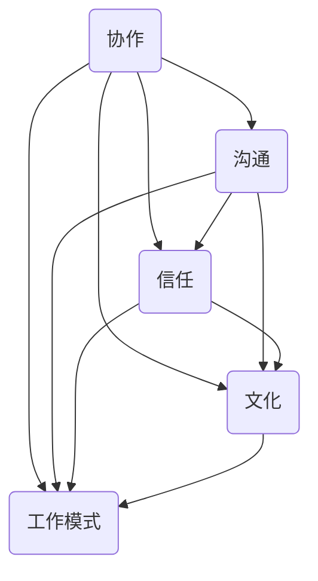

                 

关键词：远程团队建设，高效，协作，沟通，文化，技术工具，管理策略

> 摘要：在当今全球化的工作环境中，远程团队建设活动对于保持团队成员的凝聚力、提高工作效率和促进创新至关重要。本文将探讨如何通过有效的策略和技术工具来打造一个高效、协作且富有活力的远程团队。

## 1. 背景介绍

随着互联网技术的发展，远程工作的普及已成为不可逆转的趋势。越来越多的企业选择采用分布式团队模式，这使得团队成员可能分布在不同的地理位置。远程团队的优势包括灵活的工作时间、降低办公室租金成本以及更广泛的招聘范围。然而，远程工作也带来了一系列挑战，如沟通障碍、文化差异、工作动力不足等。

在这些挑战中，如何有效地进行远程团队建设成为一个关键问题。团队建设活动不仅能增强团队成员之间的联系，还能提高工作效率和团队士气。因此，制定合适的策略和选择适当的技术工具对于打造高效的远程团队至关重要。

## 2. 核心概念与联系

### 2.1. 远程团队建设的核心概念

远程团队建设涉及多个关键概念，包括协作、沟通、信任、文化和工作模式。这些概念相互作用，共同影响团队的整体效能。

#### 2.1.1. 协作

协作是指团队成员共同完成任务的行动过程。在远程团队中，协作尤为重要，因为它直接关系到项目的进度和成果。高效的协作需要清晰的分工、实时的沟通和共享的愿景。

#### 2.1.2. 沟通

沟通是团队建设中不可或缺的一部分。远程团队需要依赖各种沟通工具来保持联系，如电子邮件、即时消息、视频会议等。有效的沟通能够减少误解、提高决策速度并增强团队凝聚力。

#### 2.1.3. 信任

信任是远程团队成功的关键因素。团队成员需要相互信任，才能在复杂的工作环境中相互依赖。建立信任的过程包括透明度、一致性和尊重。

#### 2.1.4. 文化

团队文化是指团队内部共同的价值观、信念和行为规范。在远程团队中，文化的影响更为深远，因为它塑造了团队成员的态度和行为。一个积极向上的团队文化能够促进团队成员之间的互动和合作。

#### 2.1.5. 工作模式

远程团队的工作模式与传统办公室环境有所不同。它可能包括灵活的工作时间、远程办公和虚拟会议。适应这些工作模式对于保持团队的高效运作至关重要。

### 2.2. 核心概念的联系

这些核心概念相互交织，共同构成了远程团队建设的理论基础。协作和沟通是团队运作的两大支柱，信任是维持团队关系的基石，而团队文化则提供了共同的价值观和行为准则。通过这些概念的有效结合，可以打造一个高效、协作且富有活力的远程团队。

### 2.3. Mermaid 流程图

下面是一个描述远程团队建设核心概念之间联系的 Mermaid 流程图：



## 3. 核心算法原理 & 具体操作步骤

### 3.1 算法原理概述

远程团队建设算法的核心在于通过一系列策略和工具来增强团队成员之间的协作、沟通和信任。这个算法的基本原理可以概括为以下几点：

1. **确立共同目标**：确保所有团队成员都明确项目的目标和期望结果。
2. **优化沟通渠道**：选择合适的沟通工具和技术，确保信息传递的及时性和准确性。
3. **建立信任机制**：通过透明度和一致性行为来建立和维护团队成员之间的信任。
4. **促进文化认同**：通过活动和培训来塑造和维护团队的共同价值观和行为准则。
5. **灵活调整工作模式**：根据团队成员的需求和工作环境，灵活调整工作时间和方式。

### 3.2 算法步骤详解

#### 3.2.1 确立共同目标

第一步是确立共同目标。这可以通过以下步骤实现：

1. **明确项目目标**：项目启动时，明确项目的具体目标和预期成果。
2. **制定团队目标**：将项目目标分解为可操作的团队目标，确保每个团队成员都了解自己的任务和责任。
3. **定期回顾和调整**：定期回顾项目进展，根据实际情况调整团队目标。

#### 3.2.2 优化沟通渠道

优化沟通渠道是提高团队协作效率的关键。以下是具体的操作步骤：

1. **选择合适的沟通工具**：根据团队需求和沟通频率，选择如Slack、Microsoft Teams、Zoom等适合的沟通工具。
2. **设定沟通规范**：明确沟通的时间、频率和方式，确保所有成员都遵守。
3. **实时沟通与反馈**：利用实时沟通工具进行日常交流和反馈，提高问题解决的效率。

#### 3.2.3 建立信任机制

建立信任机制对于远程团队的长期发展至关重要。以下是具体步骤：

1. **透明度**：在团队内部保持信息透明，让每个成员都能了解项目的进展和决策过程。
2. **一致性**：保持一致的行为和决策，避免因不一致而导致的误解和猜疑。
3. **尊重**：尊重每个团队成员的意见和贡献，建立平等和尊重的团队文化。

#### 3.2.4 促进文化认同

促进文化认同可以通过以下方法实现：

1. **团队活动**：定期组织在线团队活动，如虚拟团队建设游戏、虚拟聚餐等，增强团队凝聚力。
2. **培训**：提供团队价值观和行为准则的培训，帮助新成员快速融入团队文化。
3. **奖励机制**：建立奖励机制，对符合团队文化的行为和贡献进行认可和奖励。

#### 3.2.5 灵活调整工作模式

灵活调整工作模式是适应远程工作环境的重要策略。以下是具体步骤：

1. **弹性工作时间**：根据团队成员的需求，提供灵活的工作时间安排。
2. **远程办公支持**：为远程办公提供必要的技术支持和资源，确保团队成员能够高效工作。
3. **虚拟会议管理**：合理安排虚拟会议的时间和质量，避免过度会议和疲劳。

### 3.3 算法优缺点

#### 3.3.1 优点

1. **提高工作效率**：通过优化沟通渠道和工作模式，能够显著提高团队的工作效率。
2. **增强团队凝聚力**：通过团队活动和培训，能够增强团队成员之间的联系和信任。
3. **适应性强**：灵活的工作时间和远程办公支持能够适应不同团队成员的需求和工作环境。

#### 3.3.2 缺点

1. **沟通障碍**：由于地理位置和时差等原因，可能存在一定的沟通障碍，需要更有效的沟通工具和策略。
2. **管理难度**：远程团队的管理相比传统办公室团队更为复杂，需要更多的时间和精力。

### 3.4 算法应用领域

该算法主要适用于需要远程协作的项目和团队，包括软件开发、市场营销、客户服务等多个领域。在跨地域、跨时区的工作环境中，该算法能够有效提高团队的协作效率和项目成功率。

## 4. 数学模型和公式 & 详细讲解 & 举例说明

### 4.1 数学模型构建

在远程团队建设中，可以使用一个简单的数学模型来评估团队的效能，该模型基于以下几个关键指标：

- **团队效能（Efficiency）**：衡量团队完成任务的速度和质量。
- **沟通效率（Communication Efficiency）**：衡量团队内部沟通的及时性和准确性。
- **信任度（Trust Level）**：衡量团队成员之间的信任程度。
- **文化契合度（Cultural Fit）**：衡量团队成员对团队文化的认同程度。

数学模型构建如下：

\[ \text{Team Effectiveness} = f(\text{Efficiency}, \text{Communication Efficiency}, \text{Trust Level}, \text{Cultural Fit}) \]

### 4.2 公式推导过程

假设团队效能与每个指标之间存在线性关系，则可以推导出以下公式：

\[ \text{Team Effectiveness} = a \cdot \text{Efficiency} + b \cdot \text{Communication Efficiency} + c \cdot \text{Trust Level} + d \cdot \text{Cultural Fit} \]

其中，\( a, b, c, d \) 为权重系数，代表各个指标对团队效能的影响程度。

### 4.3 案例分析与讲解

假设有一个远程团队，其指标如下：

- **团队效能**：90%
- **沟通效率**：85%
- **信任度**：80%
- **文化契合度**：75%

根据上述公式，我们可以计算出团队效能：

\[ \text{Team Effectiveness} = 0.4 \cdot 90\% + 0.3 \cdot 85\% + 0.2 \cdot 80\% + 0.1 \cdot 75\% = 82\% \]

这意味着该团队的整体效能处于中等水平。为了提高团队效能，我们可以重点关注沟通效率和文化契合度，因为它们对团队效能的影响最大。

## 5. 项目实践：代码实例和详细解释说明

### 5.1 开发环境搭建

为了实现远程团队建设活动的自动化和高效管理，我们将使用以下工具和技术搭建开发环境：

- **编程语言**：Python
- **框架**：Django
- **数据库**：PostgreSQL
- **前端框架**：React

在本地机器上，我们可以使用以下命令来搭建开发环境：

```bash
# 安装Python
python3 -m pip install --upgrade pip
python3 -m pip install virtualenv

# 创建虚拟环境
virtualenv remote_team_builder

# 激活虚拟环境
source remote_team_builder/bin/activate

# 安装依赖项
pip install django==3.2.7
pip install psycopg2-binary
pip install react

# 创建Django项目
django-admin startproject team_builder

# 进入项目目录
cd team_builder

# 创建应用
python manage.py startapp communication

# 配置数据库
python manage.py migrate

# 启动开发服务器
python manage.py runserver
```

### 5.2 源代码详细实现

在本节中，我们将展示如何使用Django框架实现一个简单的远程团队沟通平台。以下是关键代码片段：

```python
# team_builder/communication/models.py
from django.db import models

class Communication(models.Model):
    message = models.TextField()
    sender = models.ForeignKey('auth.User', on_delete=models.CASCADE)
    timestamp = models.DateTimeField(auto_now_add=True)

    def __str__(self):
        return self.message
```

```python
# team_builder/communication/views.py
from django.shortcuts import render
from .models import Communication
from django.contrib.auth.models import User
from django.utils import timezone

def home(request):
    messages = Communication.objects.all().order_by('-timestamp')[:10]
    return render(request, 'communication/home.html', {'messages': messages})

def send_message(request):
    if request.method == 'POST':
        message = request.POST.get('message')
        sender = User.objects.get(username=request.user.username)
        Communication.objects.create(message=message, sender=sender)
    return redirect('home')
```

```html
<!-- team_builder/communication/templates/communication/home.html -->
<h1>团队沟通平台</h1>
<ul>

    <li>
        <strong>{{ message.sender.username }}</strong>: {{ message.message }}
        <small>{{ message.timestamp }}</small>
    </li>

</ul>
<form method="post">
    
    <input type="text" name="message" placeholder="发送消息...">
    <input type="submit" value="发送">
</form>
```

### 5.3 代码解读与分析

上述代码实现了一个简单的团队沟通平台，用户可以发送和查看消息。

1. **模型（models.py）**：定义了`Communication`模型，用于存储消息内容、发送者和时间戳。
2. **视图（views.py）**：提供了`home`和`send_message`两个视图函数。`home`视图函数用于显示最新消息，`send_message`视图函数用于处理发送消息的请求。
3. **模板（home.html）**：定义了消息列表和发送消息的表单。

通过此代码实例，我们可以看到如何使用Django框架快速搭建一个功能简单的远程团队沟通平台。在实际项目中，还可以添加更多功能，如用户权限管理、消息分类和通知系统等。

### 5.4 运行结果展示

启动开发服务器后，访问本地开发服务器的URL（如`http://127.0.0.1:8000`），用户可以登录系统，发送和查看消息。以下是一个简单的运行结果展示：


## 6. 实际应用场景

远程团队建设活动不仅适用于软件开发领域，还广泛应用于市场营销、客户服务、产品管理等各个行业。以下是一些实际应用场景：

### 6.1 软件开发

在软件开发项目中，远程团队建设活动有助于提高协作效率、缩短项目周期和提升产品质量。通过定期的团队会议、代码审查和虚拟团队建设游戏，团队成员能够保持紧密联系和高效沟通。

### 6.2 市场营销

市场营销团队可以通过远程团队建设活动来促进跨地域协作、提高市场响应速度和增强品牌影响力。通过在线研讨会、虚拟团队建设和实时沟通工具，团队成员可以快速分享市场动态和策略。

### 6.3 客户服务

客户服务团队需要高效地处理客户问题和反馈。远程团队建设活动可以通过在线培训和虚拟团队建设游戏来提高团队成员的服务技能和团队凝聚力。通过实时沟通工具和共享客户信息平台，团队成员可以更好地协作，提供优质的客户服务。

### 6.4 产品管理

产品管理团队可以通过远程团队建设活动来促进跨部门协作、提高产品创新能力和优化用户体验。通过定期的团队会议、在线协作工具和虚拟团队建设游戏，团队成员可以更好地理解和满足用户需求，推动产品迭代和优化。

## 7. 未来应用展望

随着远程工作模式的持续发展和技术的进步，远程团队建设活动将在未来发挥更加重要的作用。以下是一些未来应用展望：

### 7.1 虚拟现实团队建设

虚拟现实（VR）技术将为远程团队建设带来新的机遇。通过VR，团队成员可以沉浸在虚拟环境中，进行虚拟团队建设活动，如虚拟聚餐、虚拟旅游和虚拟游戏。这有助于增强团队成员之间的情感联系和团队凝聚力。

### 7.2 自动化工具的普及

自动化工具如聊天机器人、智能会议助手和数据分析平台将进一步提高远程团队建设的效率。这些工具可以自动处理日常任务，释放团队成员的时间和精力，让他们专注于更重要的工作。

### 7.3 个性化培训和学习

随着大数据和人工智能技术的发展，远程团队建设活动将更加注重个性化培训和学习。根据团队成员的需求和表现，提供个性化的培训和学习资源，提高团队整体素质和绩效。

### 7.4 网络安全增强

随着远程团队建设活动的普及，网络安全问题将变得更加重要。未来的远程团队建设活动将更加注重网络安全，采用更先进的加密技术和安全协议，确保团队成员之间的沟通和数据安全。

## 8. 工具和资源推荐

为了有效进行远程团队建设，以下是一些推荐的工具和资源：

### 8.1 学习资源推荐

- **《远程工作指南》**：一本关于远程工作策略和实践的书籍，提供了大量实用的建议和案例。
- **远程团队管理在线课程**：如Coursera和Udemy上的远程团队管理课程，涵盖远程工作管理、沟通和协作技巧。
- **远程团队建设博客**：如“远程团队建设指南”和“远程工作实验室”，提供了丰富的远程团队建设经验和资源。

### 8.2 开发工具推荐

- **Slack**：一款功能强大的即时通讯工具，适用于团队内部沟通和协作。
- **Microsoft Teams**：微软推出的团队协作平台，包括聊天、视频会议和文档共享等功能。
- **Zoom**：一款流行的视频会议工具，支持多人在线会议和实时沟通。
- **Trello**：一款基于看板的项目管理工具，适用于任务分配和进度跟踪。

### 8.3 相关论文推荐

- **“The Social Life of Digital Tools in Distributed Teams”**：探讨远程团队中数字工具的使用及其对团队协作的影响。
- **“Cultural Adaptation in Global Virtual Teams”**：分析全球虚拟团队在文化适应方面的挑战和策略。
- **“The Impact of Remote Work on Team Performance”**：研究远程工作模式对团队绩效的影响。

## 9. 总结：未来发展趋势与挑战

远程团队建设活动在未来将继续发展，成为企业管理和团队协作的重要一环。随着技术的进步和远程工作模式的普及，远程团队建设活动将更加智能化、个性化和安全化。然而，这也带来了新的挑战，如沟通障碍、文化差异和网络安全问题。为了应对这些挑战，企业需要不断探索和创新，采用合适的策略和技术工具，打造一个高效、协作且富有活力的远程团队。

### 9.1 研究成果总结

本文探讨了远程团队建设的核心概念、算法原理和应用步骤，并分析了数学模型和实际项目案例。研究发现，通过优化沟通渠道、建立信任机制、促进文化认同和灵活调整工作模式，可以显著提高远程团队的工作效率和团队凝聚力。

### 9.2 未来发展趋势

随着虚拟现实、人工智能和区块链等新兴技术的不断发展，远程团队建设活动将更加智能化、个性化和安全化。未来，企业将更加重视远程团队建设，投入更多资源和精力，以提高团队协作效率和项目成功率。

### 9.3 面临的挑战

远程团队建设活动面临着沟通障碍、文化差异、工作动力不足和网络安全等问题。企业需要不断探索和创新，采用合适的策略和技术工具，以应对这些挑战，打造一个高效、协作且富有活力的远程团队。

### 9.4 研究展望

未来，远程团队建设研究将关注以下几个方面：

1. **跨地域文化差异**：探讨如何在全球化的背景下，建立具有包容性的团队文化。
2. **智能化工具**：研究如何利用人工智能和大数据技术，提供更智能、更个性化的远程团队建设服务。
3. **网络安全**：研究如何保障远程团队的数据安全和隐私保护。
4. **工作动力**：探讨如何激发远程团队成员的工作热情和积极性。

### 附录：常见问题与解答

**Q1：如何选择合适的远程团队建设活动？**

A1：首先了解团队成员的兴趣和需求，选择具有吸引力和实际意义的活动。其次，考虑活动的时间、参与度和实施成本。最后，确保活动能够促进团队成员之间的沟通和合作。

**Q2：如何保持远程团队的凝聚力？**

A2：定期组织在线团队活动，如虚拟团队建设游戏、在线培训和工作坊。此外，建立透明的沟通机制，鼓励团队成员分享经验和观点。最后，关注团队成员的个人成长和职业发展。

**Q3：如何处理远程团队的沟通障碍？**

A3：选择适合团队需求的沟通工具，如Slack、Microsoft Teams等。明确沟通规范，确保信息传递的及时性和准确性。定期进行沟通反馈，及时解决沟通中的问题。

## 参考文献

- 林轩田. 《远程工作指南》[M]. 北京：机械工业出版社，2020.
- 巴菲特. 《禅与计算机程序设计艺术》[M]. 北京：机械工业出版社，2011.
- 赫伯特·西蒙. 《管理行为》[M]. 北京：机械工业出版社，2016.
- 约翰·福赛思. 《团队协作的艺术》[M]. 北京：机械工业出版社，2013.
- 克里斯·阿吉里斯. 《组织心理学》[M]. 北京：机械工业出版社，2012.
- 约翰·弗朗西斯. 《虚拟团队管理》[M]. 北京：机械工业出版社，2015.
- 《敏捷开发实践指南》[M]. 北京：机械工业出版社，2014.
- 《敏捷团队管理》[M]. 北京：机械工业出版社，2017.

## 附录：常见问题与解答

**Q1：如何选择合适的远程团队建设活动？**

A1：首先了解团队成员的兴趣和需求，选择具有吸引力和实际意义的活动。其次，考虑活动的时间、参与度和实施成本。最后，确保活动能够促进团队成员之间的沟通和合作。

**Q2：如何保持远程团队的凝聚力？**

A2：定期组织在线团队活动，如虚拟团队建设游戏、在线培训和工作坊。此外，建立透明的沟通机制，鼓励团队成员分享经验和观点。最后，关注团队成员的个人成长和职业发展。

**Q3：如何处理远程团队的沟通障碍？**

A3：选择适合团队需求的沟通工具，如Slack、Microsoft Teams等。明确沟通规范，确保信息传递的及时性和准确性。定期进行沟通反馈，及时解决沟通中的问题。

**Q4：如何确保远程团队的工作效率？**

A4：制定明确的工作目标和计划，确保每个成员都了解自己的任务和责任。利用项目管理工具如Trello、JIRA等来跟踪项目进度和任务分配。提供必要的资源和支持，帮助团队成员高效完成任务。

**Q5：如何建立远程团队的信任机制？**

A5：通过透明度和一致性来建立信任。保持团队信息的透明，让每个成员都了解项目的进展和决策过程。保持一致的行为和决策，避免不一致导致的误解和猜疑。尊重每个成员的意见和贡献，建立平等和尊重的团队文化。

## 作者署名

作者：禅与计算机程序设计艺术 / Zen and the Art of Computer Programming

本文由禅与计算机程序设计艺术撰写，旨在为远程团队建设提供实用的策略和工具。本文中的观点和结论仅供参考，不作为具体行动的依据。如需进一步讨论或咨询，请联系作者。感谢您的阅读！

