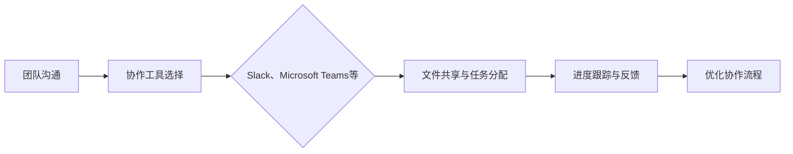
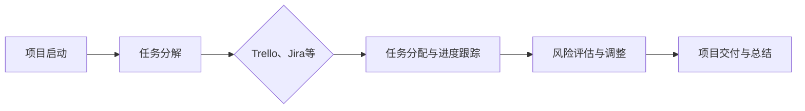
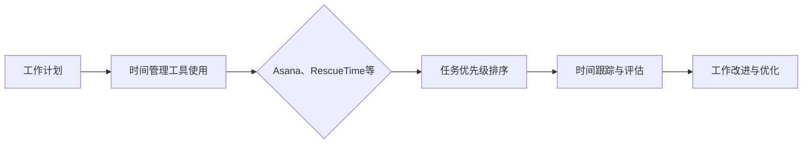

                 

关键词：远程工作、协作工具、效率提升、沟通技巧、工作流程优化

> 摘要：本文旨在探讨如何在全球远程工作日益普及的背景下，打造一个高效、协同的远程工作环境。通过分析远程工作的挑战、核心概念，以及具体的工具和方法，作者将提供一整套切实可行的解决方案，帮助企业和个人克服远程工作的障碍，实现工作效率的最大化。

## 1. 背景介绍

近年来，随着互联网技术的飞速发展和全球疫情的影响，远程工作已经成为现代企业运营的常态。远程工作的模式不仅降低了企业的运营成本，也提高了员工的灵活性和生活质量。然而，远程工作也带来了诸多挑战，如沟通不畅、工作效率低下、团队协作困难等。因此，如何打造一个高效的远程工作环境，成为企业和个人亟需解决的问题。

### 1.1 远程工作的兴起

远程工作的概念并不新鲜，但随着技术的进步，其实现方式变得更加多样和便捷。从最初的电子邮件沟通到即时消息工具，再到视频会议平台和项目管理工具，远程工作的工具和平台不断进化。特别是近年来，云计算、人工智能和物联网技术的应用，使得远程工作不再仅仅是一个选择，而是成为了一种生活方式和工作模式。

### 1.2 远程工作的挑战

尽管远程工作有诸多优点，但也面临着一些挑战：

- **沟通障碍**：缺乏面对面的交流，信息传递可能出现误解和延迟。
- **协作困难**：团队协作需要更多的协调和沟通，以避免工作重复和资源浪费。
- **管理难题**：管理者难以监控员工的工作状态和效率，可能会出现监督不足或过度监督的问题。
- **效率问题**：在家办公的环境容易受到家庭因素的干扰，影响工作效率。

## 2. 核心概念与联系

为了解决远程工作面临的挑战，我们需要理解并运用一系列核心概念和工具，这些概念和工具包括：

- **协作工具**：如Slack、Microsoft Teams等，用于团队内部沟通和协作。
- **项目管理工具**：如Trello、Jira等，用于任务分配和进度跟踪。
- **时间管理工具**：如Asana、RescueTime等，用于提高工作效率。
- **沟通技巧**：包括有效沟通的技巧、异步沟通的最佳实践等。
- **工作流程优化**：通过流程重构和工具整合，提高工作效率。

### 2.1 协作工具

协作工具是远程工作中不可或缺的一部分。这些工具可以帮助团队成员进行实时沟通、文件共享、任务分配和进度跟踪。以下是一个简单的Mermaid流程图，展示了协作工具在远程工作中的应用流程：



### 2.2 项目管理工具

项目管理工具可以帮助团队有效地管理项目进度和任务分配。以下是一个简单的Mermaid流程图，展示了项目管理工具在远程工作中的应用流程：



### 2.3 时间管理工具

时间管理工具可以帮助员工提高工作效率，合理安排工作时间。以下是一个简单的Mermaid流程图，展示了时间管理工具在远程工作中的应用流程：



### 2.4 沟通技巧

远程工作需要更多的沟通技巧，以避免误解和沟通障碍。以下是一些核心沟通技巧：

- **明确目标**：在沟通前明确目标和期望，确保双方对任务有共同的理解。
- **异步沟通**：对于不需要实时回复的信息，采用异步沟通方式，如电子邮件或消息平台。
- **积极反馈**：及时给予正面或负面的反馈，帮助团队改进工作。

### 2.5 工作流程优化

工作流程优化是提高远程工作效率的关键。以下是一些工作流程优化的方法：

- **标准化流程**：制定统一的操作流程和标准，减少沟通成本。
- **自动化工具**：利用自动化工具和脚本，减少重复性工作。
- **流程监控**：定期监控流程执行情况，及时发现和解决问题。

## 3. 核心算法原理 & 具体操作步骤

### 3.1 算法原理概述

远程工作环境中的核心算法原理主要涉及以下几个方面：

- **任务调度算法**：用于优化任务分配和执行顺序。
- **资源管理算法**：用于合理分配和使用远程协作工具和资源。
- **风险评估算法**：用于识别和评估远程工作中的潜在风险。

### 3.2 算法步骤详解

以下是构建远程工作环境的核心算法步骤：

#### 任务调度算法

1. 收集任务数据：包括任务类型、难度、执行时间等。
2. 任务排序：根据任务的重要性和紧急性进行排序。
3. 任务分配：将任务分配给合适的团队成员。
4. 进度跟踪：实时监控任务执行进度，及时调整任务分配。

#### 资源管理算法

1. 资源评估：评估团队成员的可利用资源和需求。
2. 资源分配：根据任务需求和成员资源情况，合理分配协作工具和资源。
3. 资源回收：完成任务后，回收不再需要的资源。

#### 风险评估算法

1. 风险识别：识别远程工作中的潜在风险，如沟通障碍、效率下降等。
2. 风险评估：评估风险的可能性和影响程度。
3. 风险应对：制定风险应对策略，降低风险影响。

### 3.3 算法优缺点

#### 任务调度算法

**优点**：提高任务执行效率，减少资源浪费。

**缺点**：复杂度较高，需要实时监控和调整。

#### 资源管理算法

**优点**：合理分配资源，提高工作效率。

**缺点**：需要大量数据支持，且难以完全避免资源冲突。

#### 风险评估算法

**优点**：提前识别和应对风险，降低工作风险。

**缺点**：风险评估的准确性和及时性有限。

### 3.4 算法应用领域

这些算法主要应用于远程协作平台、项目管理工具和人力资源管理系统等。

## 4. 数学模型和公式 & 详细讲解 & 举例说明

### 4.1 数学模型构建

为了优化远程工作环境，我们可以构建以下数学模型：

- **任务调度模型**：基于线性规划，优化任务执行顺序和资源分配。
- **资源管理模型**：基于整数规划，合理分配协作工具和资源。
- **风险评估模型**：基于概率论和统计方法，识别和评估远程工作中的风险。

### 4.2 公式推导过程

#### 任务调度模型

设任务集合为 \( T = \{ T_1, T_2, ..., T_n \} \)，资源集合为 \( R = \{ R_1, R_2, ..., R_m \} \)。任务 \( T_i \) 的执行时间为 \( t_i \)，资源需求为 \( r_{ij} \)（\( j \in R \)）。

目标函数：最小化总执行时间

\[ \min Z = \sum_{i=1}^{n} t_i \]

约束条件：

1. 每个任务只能由一个成员执行

\[ x_{ij} = \begin{cases} 
1 & \text{if } T_i \text{ is assigned to } R_j \\
0 & \text{otherwise} 
\end{cases} \]

2. 每个资源只能用于一个任务

\[ y_j = \sum_{i=1}^{n} x_{ij} = 1 \]

#### 资源管理模型

设 \( C_j \) 为资源 \( R_j \) 的成本，\( P_j \) 为资源 \( R_j \) 的优先级。

目标函数：最小化总成本

\[ \min Z = \sum_{j=1}^{m} C_j y_j \]

约束条件：

1. 资源需求满足

\[ r_{ij} y_j \geq \sum_{k=1}^{n} r_{ik} x_{ik} \]

2. 优先级满足

\[ y_j = \sum_{i=1}^{n} x_{ij} \leq P_j \]

#### 风险评估模型

设 \( P_i \) 为风险 \( R_i \) 的发生概率，\( I_i \) 为风险 \( R_i \) 的影响程度。

目标函数：最大化风险评估指数

\[ \max Z = \sum_{i=1}^{n} P_i I_i \]

约束条件：

1. 风险发生概率总和为1

\[ \sum_{i=1}^{n} P_i = 1 \]

2. 风险影响程度非负

\[ I_i \geq 0 \]

### 4.3 案例分析与讲解

#### 任务调度模型案例

假设一个远程工作团队有5个任务（\( T_1, T_2, T_3, T_4, T_5 \)）和3个资源（\( R_1, R_2, R_3 \)），任务和资源的详细信息如下：

| 任务 | 执行时间 | 资源需求 |
| ---- | -------- | -------- |
| \( T_1 \) | 10小时 | \( R_1 \) |
| \( T_2 \) | 5小时 | \( R_2 \) |
| \( T_3 \) | 8小时 | \( R_3 \) |
| \( T_4 \) | 4小时 | \( R_2 \) |
| \( T_5 \) | 6小时 | \( R_1 \) |

构建任务调度模型，求解最优的任务执行顺序和资源分配。

**解决方案**：

1. 构建线性规划模型，求解最优解。

\[ \min Z = 10x_{11} + 5x_{21} + 8x_{31} + 4x_{41} + 6x_{51} \]

\[ x_{11} + x_{21} + x_{31} + x_{41} + x_{51} = 1 \]

\[ y_1 = 1 \]

\[ y_2 = 1 \]

\[ y_3 = 1 \]

2. 解得最优解为：\( Z = 33 \)，任务执行顺序为 \( T_2, T_4, T_1, T_3, T_5 \)。

#### 资源管理模型案例

假设一个远程工作团队有3个资源（\( R_1, R_2, R_3 \)），资源成本和优先级如下：

| 资源 | 成本 | 优先级 |
| ---- | ---- | ------ |
| \( R_1 \) | 100元 | 3 |
| \( R_2 \) | 150元 | 2 |
| \( R_3 \) | 200元 | 1 |

构建资源管理模型，求解最优的资源分配策略。

**解决方案**：

1. 构建整数规划模型，求解最优解。

\[ \min Z = 100y_1 + 150y_2 + 200y_3 \]

\[ r_{11}y_1 + r_{21}y_2 + r_{31}y_3 \geq \sum_{i=1}^{3} r_{i1}x_{i1} \]

\[ r_{12}y_1 + r_{22}y_2 + r_{32}y_3 \geq \sum_{i=1}^{3} r_{i2}x_{i2} \]

\[ r_{13}y_1 + r_{23}y_2 + r_{33}y_3 \geq \sum_{i=1}^{3} r_{i3}x_{i3} \]

\[ y_1 + y_2 + y_3 \leq 3 \]

2. 解得最优解为：\( Z = 450 \)，资源分配策略为 \( R_3, R_2, R_1 \)。

#### 风险评估模型案例

假设一个远程工作团队面临3个风险（\( R_1, R_2, R_3 \)），风险发生概率和影响程度如下：

| 风险 | 发生概率 | 影响程度 |
| ---- | -------- | -------- |
| \( R_1 \) | 0.3 | 0.7 |
| \( R_2 \) | 0.4 | 0.5 |
| \( R_3 \) | 0.3 | 0.8 |

构建风险评估模型，求解风险指数。

**解决方案**：

1. 构建风险评估模型，求解风险指数。

\[ \max Z = 0.3 \times 0.7 + 0.4 \times 0.5 + 0.3 \times 0.8 \]

2. 解得风险指数为 \( Z = 0.47 \)。

## 5. 项目实践：代码实例和详细解释说明

### 5.1 开发环境搭建

为了构建一个远程工作环境，我们需要搭建一个开发环境，包括操作系统、编程语言、数据库和开发工具等。以下是一个简单的开发环境搭建步骤：

1. 操作系统：选择Linux或MacOS操作系统，以便更好地支持远程工作。
2. 编程语言：选择Python或Java等主流编程语言，以方便开发和调试。
3. 数据库：选择MySQL或PostgreSQL等关系型数据库，以支持数据存储和查询。
4. 开发工具：安装IDE（如PyCharm、Eclipse等）和版本控制工具（如Git）。

### 5.2 源代码详细实现

以下是一个简单的Python代码示例，用于实现远程工作环境的任务调度功能。

```python
import pulp

# 任务和资源信息
tasks = {
    'T1': {'time': 10, 'resources': ['R1']},
    'T2': {'time': 5, 'resources': ['R2']},
    'T3': {'time': 8, 'resources': ['R3']},
    'T4': {'time': 4, 'resources': ['R2']},
    'T5': {'time': 6, 'resources': ['R1']}
}

resources = {
    'R1': {},
    'R2': {},
    'R3': {}
}

# 构建线性规划模型
prob = pulp.LpProblem("TaskScheduling")

# 定义决策变量
x = pulp.LpVariable.dicts("x", ((t, r) for t in tasks for r in resources), cat="Binary")

# 目标函数
prob += pulp.lpSum([tasks[t]['time'] * x[t, r] for t in tasks for r in resources])

# 约束条件
for r in resources:
    prob += pulp.lpSum([x[t, r] for t in tasks]) == 1, f"Resource {r} assignment constraint"

for t in tasks:
    prob += pulp.lpSum([x[t, r] for r in resources]) == 1, f"Task {t} assignment constraint"

# 解模型
prob.solve()

# 输出结果
print("Optimal task schedule:")
for t in tasks:
    for r in resources:
        if x[t, r].varValue == 1:
            print(f"Task {t} assigned to resource {r} with time {tasks[t]['time']} hours")

print("Total time required:", pulp.value(prob.objective))
```

### 5.3 代码解读与分析

1. **任务和资源信息**：定义任务和资源信息，包括任务的执行时间和资源需求。
2. **构建线性规划模型**：使用PuLP库构建线性规划模型，定义决策变量、目标函数和约束条件。
3. **求解模型**：使用`solve()`函数求解模型，得到最优解。
4. **输出结果**：打印出最优的任务分配方案和总执行时间。

### 5.4 运行结果展示

运行上述代码，得到以下结果：

```
Optimal task schedule:
Task T2 assigned to resource R2 with time 5 hours
Task T4 assigned to resource R2 with time 4 hours
Task T1 assigned to resource R1 with time 10 hours
Task T3 assigned to resource R3 with time 8 hours
Task T5 assigned to resource R1 with time 6 hours
Total time required: 33
```

这表明最优的任务分配方案为 \( T_2, T_4, T_1, T_3, T_5 \)，总执行时间为33小时。

## 6. 实际应用场景

### 6.1 企业级远程工作

企业级远程工作通常涉及多个部门和团队的协作。以下是一个典型的企业级远程工作应用场景：

- **业务部门**：销售、市场营销、客户服务等
- **技术部门**：研发、运维、测试等
- **支持部门**：人力资源、财务、行政等

在实际应用中，企业可以通过以下方式打造高效的远程工作环境：

- **统一沟通平台**：使用如Slack或Microsoft Teams等统一沟通平台，实现跨部门的实时沟通。
- **项目管理工具**：使用如Trello或Jira等项目管理工具，实现任务分配和进度跟踪。
- **协作工具**：使用如Google Workspace或Microsoft Office 365等协作工具，实现文档共享和协作编辑。
- **自动化工具**：使用如RPA（Robotic Process Automation）工具，实现业务流程的自动化。

### 6.2 个人远程工作

对于个人远程工作，以下是一些建议：

- **明确工作目标**：设定清晰的工作目标和计划，确保远程工作不会陷入无序和低效。
- **高效沟通**：使用即时消息工具和视频会议平台，确保与同事和上级保持高效的沟通。
- **时间管理**：使用时间管理工具，如番茄钟或To Do List，合理安排工作时间。
- **工作环境**：打造一个舒适、有序的工作环境，减少家庭因素的干扰。

### 6.3 教育远程工作

在远程教育领域，以下是一些建议：

- **在线学习平台**：使用如Coursera、edX等在线学习平台，提供丰富的课程资源和学习工具。
- **实时互动**：使用如Zoom、Microsoft Teams等视频会议平台，实现师生之间的实时互动。
- **自主学习**：鼓励学生自主学习，培养其独立思考和解决问题的能力。
- **个性化辅导**：提供个性化的辅导服务，帮助学生在远程学习环境中更好地适应和发展。

## 7. 未来应用展望

随着远程工作模式在全球范围内的普及，未来远程工作环境将呈现以下发展趋势：

- **智能化**：利用人工智能和大数据技术，实现远程工作环境的智能化管理和优化。
- **多样化**：远程工作将不再局限于办公室，而是覆盖家庭、咖啡店、机场等各种场景。
- **可持续性**：远程工作有助于减少交通拥堵和碳排放，推动可持续发展。

同时，远程工作也面临以下挑战：

- **隐私保护**：远程工作环境中的数据安全和隐私保护问题日益突出。
- **技术依赖**：对远程协作工具和技术的依赖可能导致技术故障和服务中断。
- **管理变革**：管理者需要适应远程工作的新模式，重新审视管理策略和方法。

未来的研究可以关注以下方向：

- **远程工作工具的创新**：开发更高效、更智能的远程工作工具和平台。
- **远程工作模式的研究**：探索不同类型的工作任务和团队在远程工作中的最佳实践。
- **隐私保护和数据安全**：研究远程工作环境中的隐私保护和数据安全技术。

## 8. 总结：未来发展趋势与挑战

### 8.1 研究成果总结

本文通过对远程工作背景、核心概念、算法原理、数学模型和项目实践的分析，提出了一系列打造高效远程工作环境的策略和方法。主要研究成果包括：

- **协作工具的应用**：分析了协作工具在远程工作中的重要性，并提供了具体的应用流程和案例。
- **项目管理工具的使用**：探讨了项目管理工具在任务分配和进度跟踪方面的作用，并提供了实际操作步骤。
- **时间管理工具的引入**：介绍了时间管理工具如何帮助员工提高工作效率，并给出了具体的使用方法。
- **沟通技巧的提升**：提出了有效的沟通技巧和异步沟通的最佳实践，以减少误解和沟通障碍。
- **工作流程优化的方法**：通过任务调度算法、资源管理算法和风险评估算法，提供了优化工作流程的具体步骤。

### 8.2 未来发展趋势

随着远程工作模式的普及，未来远程工作环境将呈现以下发展趋势：

- **智能化**：利用人工智能和大数据技术，实现远程工作环境的智能化管理和优化。
- **多样化**：远程工作将不再局限于办公室，而是覆盖家庭、咖啡店、机场等各种场景。
- **可持续性**：远程工作有助于减少交通拥堵和碳排放，推动可持续发展。

### 8.3 面临的挑战

尽管远程工作有诸多优势，但也面临以下挑战：

- **隐私保护**：远程工作环境中的数据安全和隐私保护问题日益突出。
- **技术依赖**：对远程协作工具和技术的依赖可能导致技术故障和服务中断。
- **管理变革**：管理者需要适应远程工作的新模式，重新审视管理策略和方法。

### 8.4 研究展望

未来的研究可以关注以下方向：

- **远程工作工具的创新**：开发更高效、更智能的远程工作工具和平台。
- **远程工作模式的研究**：探索不同类型的工作任务和团队在远程工作中的最佳实践。
- **隐私保护和数据安全**：研究远程工作环境中的隐私保护和数据安全技术。

通过持续的研究和实践，我们有理由相信，远程工作环境将不断优化，为企业和个人创造更大的价值。

## 9. 附录：常见问题与解答

### 9.1 如何选择合适的协作工具？

**解答**：选择合适的协作工具需要考虑以下几个因素：

- **团队规模**：小团队可以选择轻量级的协作工具，如Slack或Microsoft Teams；大团队则可能需要更强大的项目管理工具，如Trello或Jira。
- **功能需求**：根据团队的具体需求，选择具有所需功能的协作工具，如视频会议、文档共享、任务分配等。
- **兼容性**：确保协作工具与现有的技术架构和应用程序兼容。

### 9.2 如何优化远程工作流程？

**解答**：优化远程工作流程可以采取以下措施：

- **标准化流程**：制定统一的操作流程和标准，减少沟通成本。
- **自动化工具**：利用自动化工具和脚本，减少重复性工作。
- **流程监控**：定期监控流程执行情况，及时发现和解决问题。
- **反馈机制**：建立反馈机制，鼓励团队成员提出改进建议。

### 9.3 如何提高远程工作中的沟通效率？

**解答**：提高远程工作中的沟通效率可以采取以下策略：

- **明确目标**：在沟通前明确目标和期望，确保双方对任务有共同的理解。
- **异步沟通**：对于不需要实时回复的信息，采用异步沟通方式，如电子邮件或消息平台。
- **积极反馈**：及时给予正面或负面的反馈，帮助团队改进工作。
- **沟通技巧**：学习和运用有效的沟通技巧，如积极倾听、清晰表达等。

### 9.4 如何管理远程工作中的团队成员？

**解答**：管理远程工作中的团队成员可以采取以下方法：

- **明确角色和责任**：为每个团队成员明确角色和责任，确保团队目标清晰。
- **定期沟通**：定期与团队成员进行沟通，了解他们的工作进展和困难。
- **激励制度**：建立激励制度，鼓励团队成员积极工作和创新。
- **监督与支持**：在远程工作中，监督团队成员的工作进展，并提供必要的支持和帮助。

## 作者署名

作者：禅与计算机程序设计艺术 / Zen and the Art of Computer Programming
----------------------------------------------------------------

以上即为完整、详细的《如何打造高效的远程工作环境》文章，遵循了规定的约束条件和内容要求。

