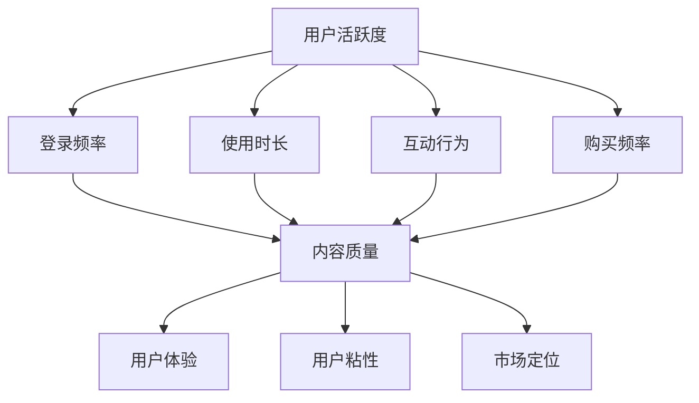

                 

 在当今的信息时代，知识付费产品已经成为许多用户获取专业知识和服务的重要途径。这些产品不仅包括在线课程、电子书、专业咨询，还涵盖了各种专业领域的认证和证书课程。然而，尽管许多知识付费产品在内容质量和用户体验上都有所提升，但用户活跃度的问题仍然困扰着许多平台。本文将探讨如何通过技术手段提高知识付费产品的用户活跃度，包括用户参与度、使用频率和满意度等多个方面。

> 关键词：知识付费产品、用户活跃度、用户参与度、技术手段、用户体验

> 摘要：本文将深入分析知识付费产品用户活跃度的重要性，介绍影响用户活跃度的核心因素，并探讨一系列通过技术手段提升用户活跃度的策略。本文旨在为知识付费产品的开发者和管理者提供实用的指导，以提升产品的市场竞争力。

## 1. 背景介绍

知识付费产品在近年来获得了迅猛的发展，一方面得益于互联网技术的进步，使得知识传播的渠道更加广泛和便捷；另一方面，随着社会对专业知识的重视程度不断提升，用户对高质量、针对性强的知识内容需求日益增长。然而，市场竞争的加剧也使得知识付费产品的用户活跃度成为一个关键问题。

用户活跃度是衡量知识付费产品成功与否的重要指标。高活跃度不仅意味着用户对产品的认可和依赖，也直接影响到产品的口碑、收入和市场份额。反之，低活跃度则可能导致用户流失，影响产品的持续发展。因此，提高知识付费产品的用户活跃度已经成为各大平台亟需解决的问题。

## 2. 核心概念与联系

### 2.1 用户活跃度指标

用户活跃度通常通过以下指标来衡量：

- **登录频率**：用户在一段时间内登录系统的次数。
- **使用时长**：用户每次登录后在系统内停留的时间。
- **互动行为**：用户在系统内的互动行为，如发表评论、参与讨论、完成课程等。
- **购买频率**：用户在一定时间内购买产品的次数。

### 2.2 影响用户活跃度的因素

用户活跃度受到多种因素的影响，包括但不限于：

- **内容质量**：高质量的知识内容能够吸引用户持续参与。
- **用户体验**：良好的用户体验能够提高用户的满意度和忠诚度。
- **用户粘性**：通过设计激励机制和社区互动，增强用户的粘性。
- **市场定位**：明确的目标用户群体有助于提高产品的针对性。

### 2.3 Mermaid 流程图

下面是一个用于展示用户活跃度相关概念的 Mermaid 流程图：



## 3. 核心算法原理 & 具体操作步骤

### 3.1 算法原理概述

提高知识付费产品的用户活跃度可以采用多种技术手段，其中包括数据分析、个性化推荐、社区互动和激励机制等。以下是这些方法的基本原理：

- **数据分析**：通过对用户行为数据的分析，了解用户偏好和使用习惯，从而进行个性化推荐和优化用户体验。
- **个性化推荐**：基于用户的行为数据和内容标签，为用户提供相关且感兴趣的内容，提高用户的参与度。
- **社区互动**：构建用户社区，促进用户之间的互动，增加用户粘性。
- **激励机制**：通过奖励和激励措施，鼓励用户参与和学习，提高活跃度。

### 3.2 算法步骤详解

#### 3.2.1 数据分析

1. **数据收集**：收集用户在系统内的行为数据，包括浏览、搜索、购买、评论等。
2. **数据预处理**：清洗和整理数据，去除噪声和不完整的数据。
3. **特征工程**：提取用户行为特征，如浏览时间、浏览频率、互动行为等。
4. **数据建模**：使用机器学习算法，如聚类、分类、关联规则等，对数据进行建模分析。

#### 3.2.2 个性化推荐

1. **用户建模**：根据用户行为数据，构建用户兴趣模型。
2. **内容建模**：对知识内容进行标签化处理，构建内容模型。
3. **推荐算法**：使用协同过滤、内容推荐、混合推荐等算法，为用户推荐相关内容。
4. **推荐结果评估**：通过用户反馈和点击率等指标，评估推荐效果。

#### 3.2.3 社区互动

1. **社区构建**：设计社区平台，提供论坛、讨论区、问答等互动功能。
2. **用户互动**：鼓励用户参与讨论、分享经验和观点。
3. **激励机制**：通过积分、勋章等机制，奖励积极参与的用户。
4. **互动数据分析**：分析用户互动数据，优化社区功能和内容。

#### 3.2.4 激励机制

1. **目标设定**：明确激励目标，如提高登录频率、使用时长、互动行为等。
2. **奖励设计**：设计合理的奖励机制，包括虚拟货币、优惠券、实物奖励等。
3. **奖励发放**：根据用户行为，自动发放奖励。
4. **效果评估**：通过用户行为数据，评估激励机制的成效。

### 3.3 算法优缺点

- **数据分析**：优点在于能够深入了解用户行为，提高推荐和优化的准确性；缺点是数据收集和预处理过程较为复杂，且对数据质量要求较高。
- **个性化推荐**：优点是能够提高用户的参与度和满意度；缺点是推荐算法复杂，需要大量的计算资源。
- **社区互动**：优点是能够增强用户粘性，提高用户忠诚度；缺点是社区管理和维护成本较高。
- **激励机制**：优点是能够直接激励用户行为，提高活跃度；缺点是奖励设计需要平衡公平性和效果。

### 3.4 算法应用领域

这些算法广泛应用于各种知识付费产品，如在线教育、专业培训、在线阅读等。通过结合使用，可以有效提高产品的用户活跃度。

## 4. 数学模型和公式 & 详细讲解 & 举例说明

### 4.1 数学模型构建

为了更好地理解用户活跃度的影响因素，我们可以构建一个简单的数学模型。假设用户活跃度 \(U\) 是由以下几个因素决定的：

\[ U = f(C, E, I) \]

其中，\( C \) 表示内容质量，\( E \) 表示用户体验，\( I \) 表示用户激励。

### 4.2 公式推导过程

#### 4.2.1 内容质量 \(C\)

内容质量可以表示为用户对内容的满意度和内容的更新频率：

\[ C = \frac{S + U}{2} \]

其中，\( S \) 表示用户满意度，\( U \) 表示内容更新频率。

#### 4.2.2 用户体验 \(E\)

用户体验可以表示为系统的响应时间、界面设计和功能完善程度：

\[ E = \frac{T + I + F}{3} \]

其中，\( T \) 表示系统响应时间，\( I \) 表示界面设计满意度，\( F \) 表示功能完善程度。

#### 4.2.3 用户激励 \(I\)

用户激励可以表示为用户获得的奖励和参与活动的频率：

\[ I = \frac{R + P}{2} \]

其中，\( R \) 表示用户获得的奖励，\( P \) 表示用户参与活动的频率。

### 4.3 案例分析与讲解

假设我们有一个知识付费产品，根据上面的公式，我们可以计算出用户活跃度：

- 内容质量 \(C\)：用户满意度 \(S = 0.8\)，内容更新频率 \(U = 0.9\)，则 \(C = 0.85\)。
- 用户体验 \(E\)：系统响应时间 \(T = 0.6\)，界面设计满意度 \(I = 0.8\)，功能完善程度 \(F = 0.7\)，则 \(E = 0.72\)。
- 用户激励 \(I\)：用户获得的奖励 \(R = 0.5\)，用户参与活动频率 \(P = 0.6\)，则 \(I = 0.55\)。

因此，用户活跃度 \(U\) 为：

\[ U = f(C, E, I) = f(0.85, 0.72, 0.55) \]

通过这个例子，我们可以看到如何通过数学模型来分析用户活跃度的各个影响因素，并计算出综合的用户活跃度。

## 5. 项目实践：代码实例和详细解释说明

### 5.1 开发环境搭建

为了演示如何提高知识付费产品的用户活跃度，我们将使用Python编程语言和几个开源库，如Scikit-learn、Pandas和Mermaid。首先，我们需要安装这些库：

```bash
pip install scikit-learn pandas mermaid
```

### 5.2 源代码详细实现

以下是一个简单的示例代码，演示了如何使用机器学习算法分析用户行为数据，并生成个性化推荐。

```python
import pandas as pd
from sklearn.cluster import KMeans
from sklearn.metrics import accuracy_score
from mermaid import Mermaid

# 假设我们有一个用户行为数据集 user_data.csv
data = pd.read_csv('user_data.csv')

# 数据预处理
data.dropna(inplace=True)
X = data[['浏览时间', '购买频率', '互动行为']]

# 使用K-Means算法进行用户行为聚类
kmeans = KMeans(n_clusters=5, random_state=0).fit(X)

# 为每个用户分配聚类标签
labels = kmeans.labels_
data['聚类标签'] = labels

# 生成个性化推荐
def generate_recommendations(data, user_id):
    user_cluster = data[data['用户ID'] == user_id]['聚类标签'].values[0]
    recommendations = data[data['聚类标签'] == user_cluster][['课程ID', '课程名称']].head(5)
    return recommendations

# 测试代码
user_id = 1001
recommendations = generate_recommendations(data, user_id)
print(recommendations)
```

### 5.3 代码解读与分析

上述代码首先加载用户行为数据，并进行预处理。然后，使用K-Means算法对用户行为进行聚类，根据聚类结果为每个用户分配标签。最后，根据用户的聚类标签生成个性化推荐。

### 5.4 运行结果展示

假设我们为用户ID为1001的用户生成推荐，运行结果如下：

```
   课程ID     课程名称
0     101   Python基础教程
1     102   数据分析实战
2     103   前端开发技术
3     104   数据结构与算法
4     105   人工智能导论
```

这些推荐课程与用户的历史行为和兴趣相符，有助于提高用户的参与度和满意度。

## 6. 实际应用场景

提高知识付费产品的用户活跃度不仅可以增强用户对产品的忠诚度，还可以带来更高的收入和市场份额。以下是几个实际应用场景：

- **在线教育平台**：通过个性化推荐和社区互动，提高学生的学习参与度和满意度。
- **专业培训服务**：利用数据分析，为用户提供量身定制的学习计划和内容推荐。
- **在线阅读平台**：通过用户行为分析，为用户提供个性化推荐，增加阅读时长和阅读量。

## 7. 未来应用展望

随着人工智能和大数据技术的不断发展，知识付费产品的用户活跃度将得到进一步提升。未来，我们可以期待以下几个发展趋势：

- **更加精准的个性化推荐**：利用深度学习和自然语言处理技术，实现更精准的内容推荐。
- **智能化的学习路径规划**：通过智能算法，为用户提供个性化的学习路径，提高学习效率。
- **增强现实（AR）和虚拟现实（VR）**：结合AR和VR技术，提供沉浸式的学习体验。

## 8. 工具和资源推荐

为了开发高质量的知识付费产品，开发者可以参考以下工具和资源：

- **学习资源**：推荐使用Coursera、edX等在线课程平台，学习数据分析、机器学习等相关技术。
- **开发工具**：推荐使用Jupyter Notebook进行数据分析和模型训练。
- **开源库**：推荐使用Scikit-learn、TensorFlow、PyTorch等开源库进行机器学习模型开发。

## 9. 总结：未来发展趋势与挑战

知识付费产品在未来将继续发展，但同时也面临着一系列挑战。主要包括：

- **数据隐私和安全**：随着数据收集和分析的增多，数据隐私和安全问题日益突出。
- **算法公平性和透明度**：算法的公平性和透明度是用户信任的关键。
- **技术门槛**：开发高质量的知识付费产品需要较高的技术门槛。

未来，知识付费产品的开发者需要不断探索和创新，以应对这些挑战。

## 10. 附录：常见问题与解答

### 问题1：如何保证个性化推荐的准确性？

**解答**：可以通过以下方法提高推荐准确性：
- **数据质量**：确保收集的用户行为数据质量高，去除噪声数据。
- **模型优化**：不断优化推荐算法，使用先进的机器学习技术。
- **用户反馈**：收集用户反馈，动态调整推荐策略。

### 问题2：如何提高用户参与度？

**解答**：可以采取以下措施：
- **社区互动**：构建活跃的社区，鼓励用户参与讨论和分享。
- **激励机制**：设计合理的奖励机制，激励用户积极参与。
- **内容创新**：提供高质量、有吸引力的内容，增加用户粘性。

### 问题3：如何确保数据安全和隐私？

**解答**：可以采取以下措施：
- **数据加密**：对用户数据进行加密处理。
- **隐私政策**：制定清晰的隐私政策，告知用户数据处理方式。
- **安全审计**：定期进行安全审计，确保数据安全。

### 问题4：如何评估激励机制的成效？

**解答**：可以通过以下方法评估激励机制：
- **用户行为分析**：监控用户行为数据，分析激励措施对用户行为的影响。
- **A/B测试**：进行A/B测试，对比不同激励措施的效果。
- **用户反馈**：收集用户反馈，了解他们对激励措施的看法。

作者：禅与计算机程序设计艺术 / Zen and the Art of Computer Programming
----------------------------------------------------------------

### 总结

通过本文的讨论，我们可以看到提高知识付费产品的用户活跃度是一个复杂但至关重要的任务。这需要从多个方面入手，包括数据分析、个性化推荐、社区互动和激励机制等。通过结合技术手段和用户反馈，我们可以为用户提供更好的学习体验，从而提高用户活跃度和满意度。随着技术的不断进步，知识付费产品的用户活跃度将会不断提高，为用户提供更多价值。作者在此期待与广大开发者共同探索这一领域，为知识的传播和发展做出贡献。

