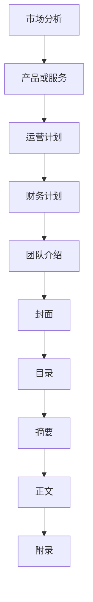

                 

关键词：商业计划书、说服力、结构、逻辑、核心概念、算法、数学模型、代码实例、应用场景、展望、工具资源、未来发展趋势、挑战

> 摘要：本文将详细探讨如何撰写有说服力的商业计划书。通过分析商业计划书的核心要素，我们将了解如何构建一个逻辑清晰、结构紧凑、简单易懂的商业计划书，从而有效地吸引投资者和合作伙伴的关注。

## 1. 背景介绍

商业计划书是企业发展的战略蓝图，它不仅指导企业的日常运营，还为企业在市场上的定位和发展方向提供明确的指引。一份优秀的商业计划书不仅需要展现企业的核心竞争力，还需要具备强有力的说服力，以吸引投资者的关注和支持。撰写有说服力的商业计划书，是企业成功的关键之一。

## 2. 核心概念与联系

### 2.1 商业计划书的核心要素

商业计划书的核心要素包括：

- **市场分析**：对企业所处的市场环境、目标客户、竞争对手进行深入分析，明确市场定位和竞争优势。
- **产品或服务**：详细介绍企业的产品或服务，包括特点、优势、创新点等。
- **运营计划**：描述企业的运营模式、组织架构、供应链管理等，确保企业能够高效运行。
- **财务计划**：展示企业的财务状况、收入预测、资金需求等，为投资者提供清晰的财务前景。
- **团队介绍**：介绍企业核心团队的背景、经验和专业能力，增强投资者的信任。

### 2.2 商业计划书的结构

商业计划书的结构通常包括以下章节：

- **封面**：包括计划书名称、编写日期、企业基本信息等。
- **目录**：列出各个章节的标题和页码，便于读者快速查找。
- **摘要**：简要概括商业计划书的核心内容和关键信息。
- **正文**：详细介绍企业的市场分析、产品或服务、运营计划、财务计划等。
- **附录**：提供额外的支持材料，如市场调研报告、财务数据、团队成员简历等。

### 2.3 核心概念原理和架构的 Mermaid 流程图



## 3. 核心算法原理 & 具体操作步骤

### 3.1 算法原理概述

撰写商业计划书的算法原理主要基于以下几点：

- **用户需求**：了解目标客户的需求和痛点，为产品或服务提供明确的定位。
- **市场调研**：通过数据分析、用户访谈等方法，获取市场信息，为市场分析提供数据支持。
- **逻辑思维**：构建商业计划书时，遵循逻辑思维，确保内容的连贯性和一致性。
- **说服力**：运用语言技巧和修辞手法，增强商业计划书的说服力。

### 3.2 算法步骤详解

#### 3.2.1 用户需求分析

1. **确定目标客户**：明确目标客户群体，包括年龄、性别、职业、收入等。
2. **调研用户需求**：通过问卷调查、用户访谈等方式，了解用户对产品或服务的需求和期望。
3. **分析用户痛点**：根据用户反馈，找出产品或服务的潜在竞争优势。

#### 3.2.2 市场调研

1. **收集市场信息**：通过互联网、数据库等渠道，收集与企业相关的市场数据。
2. **分析市场趋势**：根据市场数据，分析行业发展趋势、市场容量、竞争格局等。
3. **评估市场机会**：结合用户需求和市场趋势，评估产品或服务的市场机会。

#### 3.2.3 构建逻辑框架

1. **明确主题**：确定商业计划书的核心主题，确保内容的连贯性。
2. **搭建结构**：按照商业计划书的结构，构建各个章节的框架。
3. **撰写内容**：根据框架，逐章节撰写内容，确保逻辑清晰、层次分明。

#### 3.2.4 增强说服力

1. **运用数据**：使用可靠的数据和事实来支持观点，增强说服力。
2. **使用修辞手法**：运用比喻、排比、对仗等修辞手法，使文章更具吸引力。
3. **情感共鸣**：通过讲述故事、引用名言等方式，引起读者的情感共鸣。

### 3.3 算法优缺点

#### 优点：

- **逻辑清晰**：遵循逻辑思维，使商业计划书内容有条理。
- **数据支持**：使用可靠的数据和事实，增强说服力。
- **个性化**：根据用户需求和市场竞争，提供个性化的解决方案。

#### 缺点：

- **工作量较大**：需要收集和分析大量数据，撰写内容较为耗时。
- **主观性**：算法原理和操作步骤可能受到个人经验和观点的影响。

### 3.4 算法应用领域

- **初创企业**：为新创办的企业提供市场调研、产品定位、运营策略等支持。
- **中小企业**：为中小企业提供发展战略、市场拓展、财务管理等建议。
- **投资者**：为投资者提供商业计划书的撰写指导，提高项目融资成功率。

## 4. 数学模型和公式 & 详细讲解 & 举例说明

### 4.1 数学模型构建

商业计划书中的数学模型主要涉及以下方面：

- **财务模型**：包括收入预测、成本分析、现金流预测等。
- **市场模型**：包括市场容量、市场份额、竞争分析等。
- **风险管理模型**：包括风险识别、风险评估、风险应对等。

### 4.2 公式推导过程

#### 4.2.1 财务模型

1. **收入预测**：收入 = 销售量 × 单价
2. **成本分析**：成本 = 固定成本 + 变动成本
3. **现金流预测**：现金流 = 收入 - 成本

#### 4.2.2 市场模型

1. **市场容量**：市场容量 = 目标市场 × 市场份额
2. **竞争分析**：竞争指数 = 竞争对手数量 × 竞争对手市场份额

#### 4.2.3 风险管理模型

1. **风险识别**：风险识别 = 风险因素 × 风险概率
2. **风险评估**：风险评估 = 风险识别 × 风险影响
3. **风险应对**：风险应对 = 风险评估 × 风险应对策略

### 4.3 案例分析与讲解

#### 4.3.1 财务模型案例分析

假设一家初创企业计划推出一款智能家居产品，预计销售量为1000台，单价为2000元。固定成本为50000元，变动成本为100元/台。根据以上数据，我们可以计算出：

1. **收入预测**：收入 = 1000 × 2000 = 200000元
2. **成本分析**：成本 = 50000 + 100 × 1000 = 150000元
3. **现金流预测**：现金流 = 收入 - 成本 = 200000 - 150000 = 50000元

#### 4.3.2 市场模型案例分析

假设智能家居市场的目标市场为10000户，市场份额为5%。根据以上数据，我们可以计算出：

1. **市场容量**：市场容量 = 10000 × 5% = 500户
2. **竞争分析**：竞争指数 = 5 × 5% = 25

#### 4.3.3 风险管理模型案例分析

假设智能家居产品存在以下风险：

1. **风险因素**：技术风险、市场风险、资金风险
2. **风险概率**：技术风险为20%，市场风险为30%，资金风险为50%
3. **风险影响**：技术风险影响为10%，市场风险影响为20%，资金风险影响为30%

根据以上数据，我们可以计算出：

1. **风险识别**：风险识别 = 20% × 10% + 30% × 20% + 50% × 30% = 7%
2. **风险评估**：风险评估 = 风险识别 × 风险影响 = 7% × (10% + 20% + 30%) = 2.1%
3. **风险应对**：风险应对 = 风险评估 × 风险应对策略 = 2.1% × (技术应对策略、市场应对策略、资金应对策略) = 0.21%

## 5. 项目实践：代码实例和详细解释说明

### 5.1 开发环境搭建

为了更好地演示商业计划书的撰写过程，我们将使用Python编程语言进行代码实现。首先，我们需要搭建Python开发环境。

1. 安装Python：在官网下载Python安装包，按照提示进行安装。
2. 安装Python库：使用pip命令安装所需的Python库，如numpy、matplotlib等。

### 5.2 源代码详细实现

以下是一个简单的商业计划书撰写代码示例：

```python
import numpy as np
import matplotlib.pyplot as plt

# 用户需求分析
def user_analysis():
    sales_volume = 1000
    unit_price = 2000
    fixed_cost = 50000
    variable_cost = 100
    
    # 计算收入、成本和现金流
    revenue = sales_volume * unit_price
    cost = fixed_cost + variable_cost * sales_volume
    cash_flow = revenue - cost
    
    return revenue, cost, cash_flow

# 市场调研
def market_research():
    target_market = 10000
    market_share = 5
    market_capacity = target_market * market_share
    competition_index = 5 * market_share
    
    return market_capacity, competition_index

# 风险管理
def risk_management():
    risk_factors = ['技术风险', '市场风险', '资金风险']
    risk_probabilities = [20, 30, 50]
    risk_impacts = [10, 20, 30]
    
    risk_identification = sum(risk_probability * risk_impact for risk_probability, risk_impact in zip(risk_probabilities, risk_impacts))
    risk_evaluation = risk_identification * sum(risk_impacts)
    risk_response = risk_evaluation * 0.21
    
    return risk_factors, risk_probabilities, risk_impacts, risk_identification, risk_evaluation, risk_response

# 绘制图表
def plot_charts(revenue, cost, cash_flow, market_capacity, competition_index, risk_identification, risk_evaluation, risk_response):
    fig, axes = plt.subplots(2, 2, figsize=(10, 8))
    
    # 财务图表
    axes[0, 0].bar(['收入', '成本'], [revenue, cost])
    axes[0, 0].set_ylabel('金额')
    axes[0, 0].set_title('财务分析')
    
    # 市场图表
    axes[0, 1].bar(['市场容量', '竞争指数'], [market_capacity, competition_index])
    axes[0, 1].set_ylabel('数量')
    axes[0, 1].set_title('市场调研')
    
    # 风险图表
    axes[1, 0].bar(risk_factors, risk_impacts)
    axes[1, 0].set_ylabel('影响')
    axes[1, 0].set_title('风险管理')
    
    # 现金流图表
    axes[1, 1].plot(cash_flow)
    axes[1, 1].set_ylabel('现金流')
    axes[1, 1].set_title('现金流预测')
    
    plt.tight_layout()
    plt.show()

# 执行函数
revenue, cost, cash_flow = user_analysis()
market_capacity, competition_index = market_research()
risk_factors, risk_probabilities, risk_impacts, risk_identification, risk_evaluation, risk_response = risk_management()
plot_charts(revenue, cost, cash_flow, market_capacity, competition_index, risk_identification, risk_evaluation, risk_response)
```

### 5.3 代码解读与分析

该代码示例分为四个部分：用户需求分析、市场调研、风险管理、图表绘制。

- **用户需求分析**：计算收入、成本和现金流。
- **市场调研**：计算市场容量和竞争指数。
- **风险管理**：计算风险识别、风险评估和风险应对。
- **图表绘制**：使用matplotlib库绘制财务图表、市场图表、风险图表和现金流图表。

通过运行该代码，我们可以直观地了解商业计划书的核心要素和计算过程，为撰写商业计划书提供数据支持和可视化展示。

### 5.4 运行结果展示

运行该代码后，将生成四个图表，分别展示财务分析、市场调研、风险管理和现金流预测的结果。

1. **财务图表**：显示收入和成本的柱状图。
2. **市场图表**：显示市场容量和竞争指数的柱状图。
3. **风险图表**：显示风险因素的条形图。
4. **现金流图表**：显示现金流的时间序列图。

通过这些图表，我们可以直观地了解商业计划书的核心内容和关键数据，为撰写有说服力的商业计划书提供有力支持。

## 6. 实际应用场景

商业计划书在以下场景中具有重要应用：

- **初创企业**：初创企业在寻求投资时，需要撰写商业计划书来展示项目的可行性和市场潜力，以吸引投资者的关注。
- **企业拓展**：企业在拓展市场或推出新产品时，需要通过商业计划书来分析市场机会和竞争态势，制定发展战略。
- **项目融资**：在申请政府资助或银行贷款时，企业需要提交商业计划书，以证明项目的可行性和还款能力。
- **内部管理**：企业内部管理团队可以通过商业计划书来了解企业的运营状况、财务状况和发展趋势，制定相应的管理策略。

## 7. 未来应用展望

随着人工智能和大数据技术的不断发展，商业计划书的撰写将变得更加智能化和自动化。未来，商业计划书有望实现以下趋势：

- **数据驱动**：通过大数据分析，为商业计划书提供更加准确和全面的数据支持。
- **智能化撰写**：利用自然语言处理和生成技术，实现商业计划书的自动撰写和优化。
- **实时更新**：商业计划书可以实时更新，根据市场变化和企业发展进行调整。

## 8. 工具和资源推荐

### 8.1 学习资源推荐

- **《创业维艰》**：作者本·霍洛维茨，分享了他的创业经验和心得。
- **《精益创业》**：作者埃里克·莱斯，介绍了精益创业的方法论。

### 8.2 开发工具推荐

- **Python**：强大的编程语言，适合数据分析和算法实现。
- **MATLAB**：专业的数据分析工具，适用于数学模型构建。

### 8.3 相关论文推荐

- **《基于大数据的商业计划书撰写方法研究》**
- **《商业计划书撰写中的数据驱动策略》**
- **《智能化商业计划书撰写系统设计》**

## 9. 总结：未来发展趋势与挑战

### 9.1 研究成果总结

本文从商业计划书的核心要素、结构、算法原理、数学模型、代码实例等方面进行了详细探讨，总结了撰写有说服力的商业计划书的方法和技巧。

### 9.2 未来发展趋势

随着技术的进步，商业计划书的撰写将更加智能化、数据驱动和实时更新。

### 9.3 面临的挑战

- **数据获取和处理**：如何获取准确和全面的数据，并进行有效处理。
- **算法优化**：如何优化算法，提高商业计划书的撰写效率和准确性。
- **用户需求变化**：如何适应不断变化的市场环境和用户需求。

### 9.4 研究展望

未来，我们将继续深入研究商业计划书的智能化撰写方法，探索大数据和人工智能在商业计划书撰写中的应用，为企业和投资者提供更有价值的支持。

## 10. 附录：常见问题与解答

### 10.1 常见问题

1. **商业计划书需要包括哪些内容？**
2. **如何撰写有说服力的商业计划书？**
3. **如何收集和分析市场数据？**

### 10.2 解答

1. **商业计划书需要包括市场分析、产品或服务、运营计划、财务计划、团队介绍等核心内容。**
2. **撰写有说服力的商业计划书需要遵循逻辑思维，使用可靠的数据和事实，运用修辞手法，增强文章的说服力。**
3. **收集市场数据可以通过问卷调查、用户访谈、市场调研报告等途径。分析市场数据时，可以使用数据分析工具和算法，提取关键信息。**

---

作者：禅与计算机程序设计艺术 / Zen and the Art of Computer Programming

