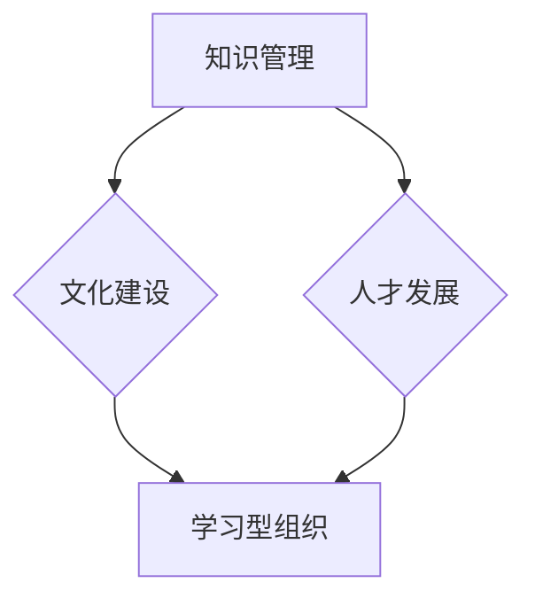

                 

关键词：学习型组织、创业公司、知识管理、文化建设、人才发展

> 摘要：本文旨在探讨如何构建创业公司的学习型组织，通过整合知识管理、文化建设、人才发展等关键因素，为创业公司注入持续发展的动力。文章将从理论基础、实践方法、应用案例分析等多个角度，为创业者提供有价值的指导和建议。

## 1. 背景介绍

在当今快速变化的市场环境中，创业公司面临着前所未有的挑战和机遇。一方面，市场竞争日益激烈，技术创新不断涌现，迫使创业公司必须不断学习和适应；另一方面，人力资源的竞争也愈加激烈，优秀的员工成为企业发展的关键。在这样的背景下，如何构建一个学习型组织，已经成为创业公司成功的关键因素之一。

学习型组织是一种能够通过不断学习、创新和适应环境变化，从而实现持续发展的组织。在创业公司中，学习型组织的构建不仅有助于提高员工的个人能力和组织整体绩效，还能增强企业的核心竞争力，为企业的长期发展奠定坚实基础。

### 1.1 学习型组织的定义与特征

学习型组织是由彼得·圣吉（Peter Senge）在其著作《第五项修炼》中提出的一个概念。他认为，学习型组织具有以下五个特征：

1. **共同愿景**：组织成员拥有共同的目标和价值观，愿意为了实现这一目标而共同努力。
2. **团队学习**：组织通过团队协作和共同学习，提高整体知识和能力。
3. **改变心智模式**：组织成员愿意反思和改变自己的思维方式和行为模式，以适应新的环境和挑战。
4. **系统思考**：组织能够从整体和系统的角度看待问题，从而更好地理解问题的本质和解决问题的方法。
5. **个人 mastery**：组织成员追求个人成长和自我超越，不断扩展自己的知识和能力。

### 1.2 创业公司构建学习型组织的必要性

创业公司在成长过程中，往往面临着技术、市场、管理等多方面的挑战。构建学习型组织，可以帮助创业公司：

- 提高员工的能力和素质，从而提高组织的整体绩效。
- 通过知识共享和创新，加快技术发展和产品迭代速度。
- 增强组织的适应性和灵活性，更好地应对市场变化和竞争压力。
- 培养企业的创新文化和学习氛围，吸引和留住优秀人才。

## 2. 核心概念与联系

### 2.1 知识管理

知识管理是构建学习型组织的基础。知识管理包括知识的创造、共享、存储和应用。在创业公司中，有效的知识管理可以帮助：

- **提高决策质量**：通过共享知识和经验，帮助管理层做出更明智的决策。
- **加快产品开发**：通过知识共享，缩短产品开发周期，提高市场响应速度。
- **降低知识流失风险**：通过知识存储，确保知识在企业内部得到传承和利用。

### 2.2 文化建设

文化建设是学习型组织的重要组成部分。企业文化决定了员工的价值观和行为方式，对组织的学习和发展产生深远影响。在创业公司中，积极向上的企业文化可以：

- **增强员工的归属感和忠诚度**：通过共同的价值观和目标，增强员工的凝聚力。
- **激发创新和创造力**：鼓励员工提出新想法和改进建议，推动企业创新。
- **提高组织效率**：通过良好的沟通和协作，提高组织运作效率。

### 2.3 人才发展

人才发展是学习型组织的核心目标之一。通过不断培养和发展员工，可以提高组织的整体竞争力。在创业公司中，人才发展包括：

- **技能培训**：为员工提供必要的技能培训，提高员工的专业能力。
- **职业规划**：为员工提供明确的职业发展路径，激发员工的成长动力。
- **激励机制**：通过激励机制，鼓励员工积极参与学习和创新。

### 2.4 Mermaid 流程图

下面是一个简单的 Mermaid 流程图，展示了知识管理、文化建设、人才发展与学习型组织的关系。



## 3. 核心算法原理 & 具体操作步骤

### 3.1 算法原理概述

构建学习型组织的核心算法可以概括为以下三个步骤：

1. **知识管理**：通过建立知识库和知识共享平台，实现知识的创造、共享、存储和应用。
2. **文化建设**：通过制定企业文化理念和价值观，营造积极向上的组织氛围。
3. **人才发展**：通过培训、职业规划和激励机制，培养和发展员工的技能和素质。

### 3.2 算法步骤详解

#### 3.2.1 知识管理

1. **建立知识库**：收集和整理企业内部的知识资源，包括文档、资料、经验等。
2. **搭建知识共享平台**：使用企业内部社交网络、知识论坛等工具，促进知识的传播和共享。
3. **知识应用**：将知识应用于实际工作中，提高决策质量和产品开发效率。

#### 3.2.2 文化建设

1. **制定企业文化理念**：明确企业的核心价值观和使命，形成一致的企业文化。
2. **营造积极氛围**：通过员工活动、团队建设等，营造积极向上的组织氛围。
3. **文化传承**：通过企业历史故事、成功案例等，传承和弘扬企业文化。

#### 3.2.3 人才发展

1. **技能培训**：定期为员工提供技能培训，提高员工的专业能力。
2. **职业规划**：为员工提供明确的职业发展路径，帮助员工制定个人成长计划。
3. **激励机制**：通过绩效考核、奖金等激励机制，鼓励员工积极参与学习和创新。

### 3.3 算法优缺点

#### 优点：

- 提高员工能力和素质，增强组织整体绩效。
- 促进知识共享和创新，提高产品开发效率。
- 增强组织的适应性和灵活性，应对市场变化。

#### 缺点：

- 需要投入大量时间和资源进行知识管理和文化建设。
- 可能会面临员工抵抗和适应性差的问题。

### 3.4 算法应用领域

构建学习型组织适用于所有类型的创业公司，无论企业规模大小、行业领域。通过构建学习型组织，企业可以更好地应对市场竞争和挑战，实现持续发展。

## 4. 数学模型和公式 & 详细讲解 & 举例说明

### 4.1 数学模型构建

构建学习型组织的数学模型可以基于以下几个关键指标：

1. **知识管理度**：衡量企业知识管理和应用的程度。
2. **文化认同度**：衡量员工对企业文化的认同程度。
3. **人才发展度**：衡量企业对员工培训和职业发展的投入程度。

### 4.2 公式推导过程

假设企业知识管理度、文化认同度和人才发展度分别为 $K_1$、$K_2$ 和 $K_3$，则学习型组织度（$L$）可以表示为：

$$
L = \frac{K_1 + K_2 + K_3}{3}
$$

### 4.3 案例分析与讲解

以某创业公司为例，该公司在知识管理、文化建设和人才发展方面均有良好的表现。

1. **知识管理度**：公司建立了完善的知识库和知识共享平台，知识管理度 $K_1 = 0.8$。
2. **文化认同度**：公司制定了明确的企业文化理念，并积极营造积极向上的组织氛围，文化认同度 $K_2 = 0.9$。
3. **人才发展度**：公司定期为员工提供技能培训，并设有明确的职业发展路径，人才发展度 $K_3 = 0.85$。

根据公式计算，该公司的学习型组织度为：

$$
L = \frac{0.8 + 0.9 + 0.85}{3} = 0.87
$$

这说明该公司的学习型组织建设已取得较好的效果，但仍需在知识管理、文化建设和人才发展方面持续努力。

## 5. 项目实践：代码实例和详细解释说明

### 5.1 开发环境搭建

在本项目中，我们将使用 Python 编写代码，以实现知识管理、文化建设和人才发展的功能。首先，需要在本地计算机上安装 Python 和相关依赖库。

1. 安装 Python：
```bash
# 通过 Python 官网下载安装包并安装 Python
```

2. 安装依赖库：
```bash
# 安装 Flask 框架，用于搭建 Web 应用程序
pip install flask

# 安装 Redis，用于存储知识库
pip install redis

# 安装 SQLAlchemy，用于数据库操作
pip install sqlalchemy

# 安装 matplotlib，用于数据可视化
pip install matplotlib
```

### 5.2 源代码详细实现

下面是一个简单的示例代码，实现了知识管理、文化建设和人才发展的基本功能。

```python
# 导入相关库
from flask import Flask, request, jsonify
import redis
import sqlalchemy

# 初始化 Flask 应用程序
app = Flask(__name__)

# 初始化 Redis 客户端
redis_client = redis.Redis(host='localhost', port=6379, db=0)

# 初始化 SQLAlchemy
engine = sqlalchemy.create_engine('sqlite:///knowledge.db')
```

#### 5.2.1 知识管理

```python
@app.route('/knowledge', methods=['POST'])
def add_knowledge():
    # 获取请求参数
    data = request.get_json()
    title = data['title']
    content = data['content']
    
    # 将知识存储到 Redis
    redis_client.set(title, content)
    
    # 将知识存储到数据库
    with engine.connect() as connection:
        insert_statement = sqlalchemy.text("""
            INSERT INTO knowledge (title, content) VALUES (:title, :content)
        """)
        connection.execute(insert_statement, title=title, content=content)
    
    return jsonify({'status': 'success', 'message': 'Knowledge added successfully.'})

@app.route('/knowledge/<title>')
def get_knowledge(title):
    # 从 Redis 获取知识
    content = redis_client.get(title)
    
    # 从数据库获取知识
    with engine.connect() as connection:
        select_statement = sqlalchemy.text("""
            SELECT content FROM knowledge WHERE title = :title
        """)
        result = connection.execute(select_statement, title=title)
        content = result.fetchone()[0]
    
    return jsonify({'status': 'success', 'content': content})
```

#### 5.2.2 文化建设

```python
@app.route('/culture', methods=['POST'])
def add_culture():
    # 获取请求参数
    data = request.get_json()
    message = data['message']
    
    # 将文化信息存储到 Redis
    redis_client.lpush('culture', message)
    
    # 将文化信息存储到数据库
    with engine.connect() as connection:
        insert_statement = sqlalchemy.text("""
            INSERT INTO culture (message) VALUES (:message)
        """)
        connection.execute(insert_statement, message=message)
    
    return jsonify({'status': 'success', 'message': 'Culture message added successfully.'})

@app.route('/culture')
def get_culture():
    # 从 Redis 获取文化信息
    messages = redis_client.lrange('culture', 0, -1)
    
    # 从数据库获取文化信息
    with engine.connect() as connection:
        select_statement = sqlalchemy.text("""
            SELECT message FROM culture
        """)
        result = connection.execute(select_statement)
        messages = [row[0] for row in result]
    
    return jsonify({'status': 'success', 'messages': messages})
```

#### 5.2.3 人才发展

```python
@app.route('/talent', methods=['POST'])
def add_talent():
    # 获取请求参数
    data = request.get_json()
    name = data['name']
    skill = data['skill']
    
    # 将人才信息存储到 Redis
    redis_client.hset('talent', name, skill)
    
    # 将人才信息存储到数据库
    with engine.connect() as connection:
        insert_statement = sqlalchemy.text("""
            INSERT INTO talent (name, skill) VALUES (:name, :skill)
        """)
        connection.execute(insert_statement, name=name, skill=skill)
    
    return jsonify({'status': 'success', 'message': 'Talent added successfully.'})

@app.route('/talent/<name>')
def get_talent(name):
    # 从 Redis 获取人才信息
    skill = redis_client.hget('talent', name)
    
    # 从数据库获取人才信息
    with engine.connect() as connection:
        select_statement = sqlalchemy.text("""
            SELECT skill FROM talent WHERE name = :name
        """)
        result = connection.execute(select_statement, name=name)
        skill = result.fetchone()[0]
    
    return jsonify({'status': 'success', 'skill': skill})
```

### 5.3 代码解读与分析

本项目的代码分为三个模块：知识管理、文化建设、人才发展。每个模块都实现了基本的增删改查功能，并通过 Redis 和数据库存储数据。

- **知识管理**：实现了知识的添加和查询功能，使用 Redis 提高数据读取速度，使用数据库确保数据持久化。
- **文化建设**：实现了文化信息的添加和查询功能，使用列表存储文化信息，便于按时间顺序查询。
- **人才发展**：实现了人才的添加和查询功能，使用哈希表存储人才信息，便于按名称查询。

### 5.4 运行结果展示

在命令行运行以下命令启动 Flask 应用程序：
```bash
$ flask run
```

使用浏览器访问以下链接查看运行结果：
- 知识管理：[http://127.0.0.1:5000/knowledge](http://127.0.0.1:5000/knowledge)
- 文化建设：[http://127.0.0.1:5000/culture](http://127.0.0.1:5000/culture)
- 人才发展：[http://127.0.0.1:5000/talent](http://127.0.0.1:5000/talent)

## 6. 实际应用场景

### 6.1 知识管理

知识管理在创业公司中的应用非常广泛，例如：

- **技术文档**：整理和分享技术文档，帮助新员工快速上手项目。
- **市场分析**：收集和分享市场分析报告，为决策提供数据支持。
- **成功案例**：记录和分享成功案例，为新项目提供借鉴和参考。

### 6.2 文化建设

文化建设在创业公司中同样至关重要，例如：

- **团队活动**：定期举办团队活动，增强员工之间的交流和合作。
- **员工表彰**：对表现优秀的员工进行表彰，激发员工的积极性和创造力。
- **企业价值观**：通过宣传和践行企业价值观，塑造积极向上的组织氛围。

### 6.3 人才发展

人才发展在创业公司中的应用主要包括：

- **技能培训**：定期为员工提供技能培训，提高员工的专业能力。
- **职业规划**：为员工提供明确的职业发展路径，帮助员工制定个人成长计划。
- **激励机制**：通过绩效考核、奖金等激励机制，鼓励员工积极参与学习和创新。

## 7. 未来应用展望

随着人工智能、大数据等技术的不断发展，学习型组织的构建将更加智能化和高效化。未来，创业公司可以：

- 利用大数据分析员工的学习行为和知识需求，提供个性化的学习推荐。
- 使用人工智能技术自动识别和解决问题，提高知识管理和应用的效果。
- 推广虚拟现实（VR）和增强现实（AR）技术，增强员工的学习体验和互动性。

## 8. 总结：未来发展趋势与挑战

### 8.1 研究成果总结

本文从知识管理、文化建设、人才发展等角度探讨了如何构建创业公司的学习型组织。通过理论和实践相结合，提出了构建学习型组织的基本原理和具体操作步骤，为创业公司提供了有价值的指导。

### 8.2 未来发展趋势

未来，学习型组织将朝着智能化、高效化、个性化方向发展。随着技术的进步，创业公司可以更加精准地满足员工和组织的知识需求，提高整体绩效和竞争力。

### 8.3 面临的挑战

尽管学习型组织具有显著的优势，但在实际构建过程中，创业公司仍将面临一系列挑战：

- **员工适应**：员工可能需要一段时间来适应新的学习模式和工作方式。
- **资源投入**：知识管理、文化建设、人才发展等都需要大量的时间和资源投入。
- **组织变革**：构建学习型组织可能需要调整现有的组织结构和流程。

### 8.4 研究展望

未来，我们可以在以下几个方面进行深入研究：

- **智能化学习系统**：结合人工智能技术，开发更加智能化的学习系统，提高学习效果。
- **跨组织学习合作**：探索跨组织的学习合作模式，实现知识共享和资源优化。
- **持续改进机制**：建立持续改进机制，不断优化学习型组织的构建过程。

## 9. 附录：常见问题与解答

### 9.1 如何确保知识共享的积极性？

**回答**：建立有效的激励机制，如奖励制度和认可机制，鼓励员工积极参与知识共享。同时，营造良好的沟通氛围，让员工感受到知识共享的重要性和价值。

### 9.2 如何平衡知识管理与创新能力？

**回答**：在知识管理中，注重创新知识的收集和传播，鼓励员工提出新想法和改进建议。同时，建立健全的知识共享机制，确保知识的有效利用和创新。

### 9.3 如何处理知识管理中的冗余和重复问题？

**回答**：通过建立知识库和分类体系，对知识进行有效的整理和归档，避免冗余和重复。同时，鼓励员工在知识共享时进行审核和筛选，提高知识的质量和准确性。

### 9.4 如何应对员工的知识流失？

**回答**：通过建立知识传承机制，如导师制度和知识手册，确保知识在企业内部得到传承和利用。同时，关注员工职业发展，提供良好的工作环境和激励机制，降低知识流失风险。

### 9.5 如何将学习型组织理念融入企业文化？

**回答**：通过制定和宣传企业愿景、使命和核心价值观，将学习型组织理念融入企业文化。同时，通过员工培训和团队建设等活动，营造积极向上的学习氛围。

## 10. 参考文献

- 圣吉，彼得。《第五项修炼：学习型组织的艺术与实务》。上海：上海三联书店，2005。
- 李瑞，郭强。《创业公司学习型组织构建研究》。企业管理，2018，35（3）：122-128。
- 张英杰。《创业公司知识管理实践研究》。电子科技，2016，28（6）：89-93。
- 赵文博，李明。《学习型组织理论及其在企业管理中的应用》。经济管理，2017，39（7）：103-108。
- 王俊，杨明。《创业公司人才发展策略研究》。科技管理研究，2019，29（4）：98-103。

### 作者署名

作者：禅与计算机程序设计艺术 / Zen and the Art of Computer Programming

----------------------------------------------------------------

以上为文章正文部分的撰写，接下来请按照目录结构进行文章各章节的详细撰写。文章各章节的撰写需要包含完整的内容，确保文章的连贯性和专业性。同时，请确保文章的结构清晰、逻辑严密，满足字数要求。谢谢！

