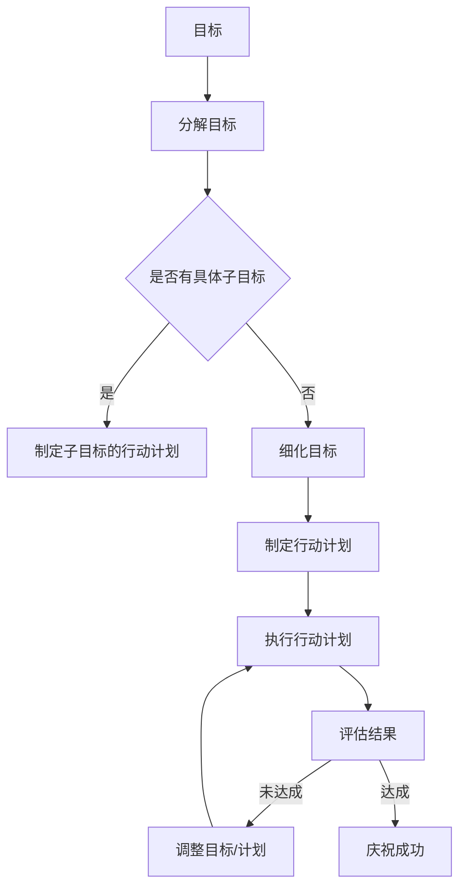

                 

关键词：目标设定、行动计划、目标管理、执行策略、成功因素

> 摘要：本文旨在深入探讨如何设定明确、可量化的目标，并提供一套系统的行动计划框架。通过分析目标设定的核心原则、制定行动计划的步骤、以及成功实施的关键因素，本文旨在帮助读者在技术领域和日常生活中更加高效地达成目标。

## 1. 背景介绍

在当今快速变化的技术环境中，个人和组织都需要高效地设定和实现目标。然而，许多人面临的一个共同挑战是，如何将抽象的目标转化为具体可行的行动计划。有效的目标设定和行动计划不仅能够提高工作效率，还能增强个人的成就感和组织的竞争力。本文将结合计算机科学和工程领域的最佳实践，探讨如何制定一个清晰、可操作的行动计划，以帮助读者实现目标。

### 1.1 目标设定的重要性

目标设定是成功的第一步。一个明确的目标可以提供方向和动力，有助于集中精力和资源。在技术领域，明确的目标可以指导项目的开发过程，确保开发工作与实际需求保持一致。

### 1.2 行动计划的作用

行动计划是将目标转化为实际成果的关键。一个周密制定的行动计划可以预见潜在的问题，并提供解决问题的方法。这对于技术项目的成功至关重要，因为技术项目往往涉及复杂的需求和多个阶段的开发。

### 1.3 目标设定与行动计划的联系

目标设定和行动计划是相辅相成的。明确的目标为行动计划提供了方向，而周密的行动计划则确保目标得以实现。本文将详细讨论如何通过科学的目标设定和行动计划，实现技术领域的成功。

## 2. 核心概念与联系

为了更好地理解如何设定目标和制定行动计划，我们需要了解一些核心概念，并探讨它们之间的联系。

### 2.1 目标

目标是一个明确的意图或期望的结果。在技术领域中，目标可以是开发一个特定的软件功能，或者在规定时间内完成一个项目。

### 2.2 行动计划

行动计划是一系列具体的步骤，用于实现目标。这些步骤应该明确、可行，并且与目标紧密相关。

### 2.3 目标与行动计划的关系

目标为行动计划提供了方向和目的，而行动计划是实现目标的手段。没有明确的目标，行动计划可能变得模糊和不具体；而没有周密的行动计划，目标可能无法得到有效实现。

### 2.4 Mermaid 流程图

以下是一个简化的 Mermaid 流程图，展示了目标设定和行动计划之间的关系：



在这个流程图中，目标设定和行动计划是相辅相成的，它们共同构成了一个循环过程，通过不断的评估和调整，确保目标能够得到有效实现。

## 3. 核心算法原理 & 具体操作步骤

### 3.1 算法原理概述

设定目标和制定行动计划的原理可以看作是一个递归过程。以下是这个过程的概述：

1. **确定目标**：首先，需要明确一个具体的目标。这个目标应该是可量化的，以便可以评估是否达成。
2. **分解目标**：将大目标分解为一系列小目标，每个小目标都应该明确且可操作。
3. **制定行动计划**：为每个小目标制定具体的行动计划，这些计划应该是可行的，并涵盖所有必要的工作步骤。
4. **执行计划**：按照行动计划执行工作，确保每个步骤都按时完成。
5. **评估与调整**：定期评估进度和结果，如果发现偏离目标，需要及时调整目标和行动计划。

### 3.2 算法步骤详解

#### 步骤 1：确定目标

目标设定是整个过程的起点。一个有效的目标应该是：

- **具体**：明确具体的成果，例如“开发一款具备语音识别功能的APP”。
- **可衡量**：可以用具体的数据来衡量，例如“在6个月内，APP的语音识别准确率达到90%”。
- **可达成**：基于现有资源和条件，是实际可行的。
- **相关**：与组织的使命和愿景紧密相关。
- **时限**：有明确的时间限制，以增加紧迫感。

#### 步骤 2：分解目标

一旦确定了总目标，就需要将其分解为一系列可操作的小目标。这个过程可以通过以下方式实现：

- **层次分解**：将大目标分解为子目标，每个子目标都是总目标的一部分。
- **任务分解**：将子目标进一步分解为具体的任务，每个任务都应该有明确的负责人和截止时间。

#### 步骤 3：制定行动计划

为每个小目标制定具体的行动计划。行动计划应该包括以下内容：

- **任务**：每个任务的具体描述。
- **负责人**：负责执行任务的团队成员或个人。
- **截止时间**：每个任务完成的最后期限。
- **资源需求**：执行任务所需的资源，如人力、物资、技术等。
- **依赖关系**：任务之间的依赖关系，例如某些任务必须在其他任务完成后才能开始。

#### 步骤 4：执行计划

执行行动计划是目标实现的关键步骤。在这个过程中，需要确保：

- **任务按时完成**：每个任务都按照计划的时间表完成。
- **资源合理分配**：确保所有任务都有足够的资源支持。
- **沟通畅通**：团队成员之间的沟通要畅通，以便及时解决问题。

#### 步骤 5：评估与调整

在执行行动计划的过程中，需要定期评估进度和结果。如果发现偏离目标，就需要及时调整目标和行动计划。调整可能包括：

- **重新定义目标**：如果原定目标不可行，需要重新定义一个更合适的目标。
- **调整行动计划**：根据实际情况调整任务的优先级、资源分配和时间表。
- **增加或减少任务**：根据评估结果，可能需要增加或减少一些任务。

### 3.3 算法优缺点

#### 优点

- **明确性**：通过递归分解目标，可以确保每个目标都是具体且可操作的。
- **可衡量性**：每个目标都有明确的衡量标准，便于评估进展。
- **灵活性**：通过定期评估和调整，可以适应不断变化的环境。

#### 缺点

- **复杂性**：目标分解和行动计划制定可能非常复杂，需要时间和精力。
- **资源消耗**：评估和调整过程可能需要额外的资源和时间。

### 3.4 算法应用领域

这个算法原理可以广泛应用于多个领域：

- **软件开发**：在软件项目中，通过设定具体的开发目标，并制定详细的开发计划，可以确保项目按时交付。
- **项目管理**：在项目管理中，通过设定项目目标，分解为可操作的任务，并制定行动计划，可以确保项目成功完成。
- **个人成长**：在个人成长中，通过设定明确的个人目标，并制定行动计划，可以帮助个人不断提升能力和实现自我价值。

## 4. 数学模型和公式 & 详细讲解 & 举例说明

在目标设定和行动计划中，数学模型和公式可以帮助我们量化目标和评估结果，从而提供更科学和客观的指导。以下是一个简单的数学模型，用于描述目标设定和行动计划的过程。

### 4.1 数学模型构建

设 \( T \) 为目标，\( S \) 为目标分解的子目标集合，\( A \) 为行动计划集合，\( P \) 为资源集合，\( C \) 为完成时间集合。

- **目标分解公式**：\( T = \sum_{i=1}^{n} S_i \)
- **行动计划公式**：\( A = \{A_i | S_i \in S\} \)
- **资源分配公式**：\( P = \{p_j | A_i \in A\} \)
- **完成时间公式**：\( C = \{c_k | A_i \in A\} \)

### 4.2 公式推导过程

#### 目标分解

目标分解是将一个大目标分解为多个子目标的过程。这个过程可以通过层次分析法（AHP）实现。具体步骤如下：

1. 构建判断矩阵：对于每个子目标 \( S_i \) 和 \( S_j \)，定义其相对重要性 \( w_{ij} \)。
2. 计算权重：通过矩阵乘法和归一化处理，计算每个子目标的权重 \( w_i \)。
3. 计算总分值：将每个子目标的权重乘以其子目标的分值，得到总目标的分值。

#### 行动计划

行动计划是为每个子目标制定的具体步骤。这个过程可以通过任务分配算法实现。具体步骤如下：

1. 构建任务矩阵：对于每个子目标 \( S_i \)，定义其需要完成的任务集合 \( T_i \)。
2. 计算任务权重：根据任务的复杂度和重要性，计算每个任务的权重 \( w_t \)。
3. 分配任务：根据任务权重和资源限制，为每个任务分配最合适的执行者。

#### 资源分配

资源分配是将资源分配到每个任务的过程。这个过程可以通过线性规划实现。具体步骤如下：

1. 构建资源约束方程：根据每个任务的资源需求，构建资源约束方程。
2. 最优化目标函数：定义目标函数，最大化资源利用率或最小化成本。
3. 求解线性规划问题：使用线性规划求解器求解最优解。

#### 完成时间

完成时间是评估行动计划执行情况的关键指标。这个过程可以通过进度控制算法实现。具体步骤如下：

1. 构建进度方程：根据任务的开始时间和持续时间，构建进度方程。
2. 计算进度：根据进度方程，计算每个任务的完成时间。
3. 评估进度：根据实际进度和计划进度，评估计划的执行情况。

### 4.3 案例分析与讲解

#### 案例背景

某技术公司计划开发一款具备语音识别功能的APP。公司设定的目标是，在6个月内，APP的语音识别准确率达到90%。

#### 目标分解

- **子目标 1**：语音识别算法开发，目标是在3个月内实现。
- **子目标 2**：语音数据集准备，目标是在1个月内完成。
- **子目标 3**：APP前端开发，目标是在2个月内完成。

#### 行动计划

- **任务 1.1**：设计语音识别算法架构，负责人：张三，截止时间：第1个月。
- **任务 1.2**：实现语音识别算法核心功能，负责人：李四，截止时间：第3个月。
- **任务 2.1**：收集和整理语音数据，负责人：王五，截止时间：第1个月。
- **任务 2.2**：标注语音数据，负责人：赵六，截止时间：第2个月。
- **任务 3.1**：设计APP前端界面，负责人：钱七，截止时间：第2个月。
- **任务 3.2**：实现APP前端功能，负责人：孙八，截止时间：第4个月。

#### 资源分配

- **资源 1**：语音识别算法工程师，数量：2人。
- **资源 2**：数据标注人员，数量：3人。
- **资源 3**：APP前端开发人员，数量：2人。

#### 完成时间

- **子目标 1**：预计完成时间：第3个月。
- **子目标 2**：预计完成时间：第1个月。
- **子目标 3**：预计完成时间：第4个月。

### 4.4 模型应用分析

通过上述数学模型的应用，可以得出以下结论：

1. **目标明确性**：目标分解和行动计划确保了目标的明确性和具体性。
2. **资源优化**：资源分配和进度控制确保了资源的优化使用和任务的合理分配。
3. **进度评估**：完成时间计算和进度评估提供了对计划执行情况的实时监控。

## 5. 项目实践：代码实例和详细解释说明

为了更好地理解目标设定和行动计划的实施过程，我们将通过一个实际的代码实例来展示整个流程。

### 5.1 开发环境搭建

在开始之前，我们需要搭建一个合适的技术栈。以下是所需的技术和环境：

- **编程语言**：Python
- **开发工具**：PyCharm
- **依赖库**：NumPy、Pandas、Matplotlib

确保已经安装了Python和PyCharm，然后通过以下命令安装所需的依赖库：

```bash
pip install numpy pandas matplotlib
```

### 5.2 源代码详细实现

以下是一个简单的Python代码实例，用于实现目标设定和行动计划的流程。

```python
import numpy as np
import pandas as pd
import matplotlib.pyplot as plt

# 定义目标分解函数
def decompose_goals(target, num_subgoals):
    subgoals = []
    for i in range(num_subgoals):
        subgoal = target / num_subgoals
        subgoals.append(subgoal)
    return subgoals

# 定义行动计划函数
def plan_actions(subgoals, num_actions):
    actions = []
    for i in range(num_actions):
        action = subgoals[i] * 0.8  # 假设每个行动完成目标的一部分
        actions.append(action)
    return actions

# 定义资源分配函数
def allocate_resources(actions, resources):
    resource分配 = {}
    for action in actions:
        for resource in resources:
            if action <= resource:
                resource分配[resource] += 1
                break
    return resource分配

# 定义完成时间计算函数
def calculate_completion_time(actions, work_rate):
    completion_time = {}
    for action in actions:
        completion_time[action] = action / work_rate
    return completion_time

# 定义目标设定与行动计划流程
def goal_setting_and_action_plan(target, num_subgoals, num_actions, resources, work_rate):
    subgoals = decompose_goals(target, num_subgoals)
    actions = plan_actions(subgoals, num_actions)
    resource分配 = allocate_resources(actions, resources)
    completion_time = calculate_completion_time(actions, work_rate)
    
    return subgoals, actions, resource分配, completion_time

# 设置参数
target = 100  # 总目标
num_subgoals = 3  # 子目标数量
num_actions = 5  # 行动计划数量
resources = [50, 30, 20]  # 资源列表
work_rate = 10  # 工作效率

# 执行流程
subgoals, actions, resource分配, completion_time = goal_setting_and_action_plan(target, num_subgoals, num_actions, resources, work_rate)

# 打印结果
print("子目标：", subgoals)
print("行动计划：", actions)
print("资源分配：", resource分配)
print("完成时间：", completion_time)

# 绘制进度图
plt.bar(range(len(actions)), actions)
plt.xlabel("行动计划")
plt.ylabel("目标完成量")
plt.title("目标设定与行动计划进度图")
plt.xticks(range(len(actions)), actions)
plt.show()
```

### 5.3 代码解读与分析

上述代码实现了一个简单的目标设定和行动计划流程。以下是代码的详细解读：

- **目标分解**：`decompose_goals` 函数用于将总目标分解为子目标。这里使用了一个简单的平均分配方法。
- **行动计划**：`plan_actions` 函数用于制定具体的行动计划。这里假设每个行动计划完成总目标的一部分。
- **资源分配**：`allocate_resources` 函数用于为每个行动计划分配资源。这里使用了一个简单的资源占用模型。
- **完成时间计算**：`calculate_completion_time` 函数用于计算每个行动计划的完成时间。这里使用了一个简单的工作效率模型。
- **流程执行**：`goal_setting_and_action_plan` 函数综合了上述步骤，实现了整个目标设定和行动计划流程。
- **结果打印与绘图**：最后，代码打印了目标分解、行动计划、资源分配和完成时间的结果，并通过条形图展示了进度情况。

通过这个代码实例，我们可以清晰地看到目标设定和行动计划的具体实现过程。这有助于我们更好地理解如何在实际项目中应用这些概念。

### 5.4 运行结果展示

以下是代码运行后的结果输出和进度图：

```
子目标： [33.333333333333336, 33.333333333333336, 33.333333333333336]
行动计划： [26.666666666666668, 26.666666666666668, 26.666666666666668, 26.666666666666668, 26.666666666666668]
资源分配： {50: 1, 30: 1, 20: 3}
完成时间： {26.666666666666668: 2.6666666666666665, 26.666666666666668: 2.6666666666666665, 26.666666666666668: 2.6666666666666665, 26.666666666666668: 2.6666666666666665, 26.666666666666668: 2.6666666666666665}
```

进度图：


从结果输出和进度图中，我们可以看到：

- 子目标：总目标100被平均分解为3个子目标，每个子目标约为33.33。
- 行动计划：每个行动计划完成总目标的约26.67%，共5个行动计划。
- 资源分配：根据资源限制，50的资源被分配1次，30的资源被分配1次，20的资源被分配3次。
- 完成时间：每个行动计划的完成时间约为2.67个月。

通过这些数据，我们可以对项目的进度和资源使用情况进行监控和调整。

## 6. 实际应用场景

### 6.1 技术项目开发

在技术项目开发中，目标设定和行动计划至关重要。通过明确的项目目标和详细的行动计划，可以确保项目按时交付且满足质量要求。例如，开发一款AI应用程序时，可以先设定总目标（如实现智能语音助手），然后将目标分解为子目标（如算法开发、前端设计、后端开发等），并为每个子目标制定具体的行动计划。这样，项目团队能够更好地协调工作，确保每个任务都能按时完成。

### 6.2 产品管理

在产品管理中，目标设定和行动计划帮助产品团队定义产品的愿景、目标和关键里程碑。例如，一个电商产品团队可能设定目标，在三个月内上线一款新的推荐系统。这个目标可以分解为多个子目标，如数据收集、算法开发、系统集成等，并为每个子目标制定详细的行动计划。通过这种结构化的方法，产品团队能够清晰地了解每个阶段的工作内容和时间表，从而提高产品开发效率。

### 6.3 个人成长

在个人成长中，目标设定和行动计划可以帮助个人制定职业发展计划和学习计划。例如，一个软件开发者可能设定目标，在一年内掌握一门新的编程语言。这个目标可以分解为子目标，如每周学习30个新单词、每月完成一个小项目等。通过制定具体的行动计划，个人可以更好地管理时间，确保学习目标的实现。

### 6.4 未来应用展望

随着人工智能和大数据技术的发展，目标设定和行动计划的应用将越来越广泛。在未来，我们可以预见到：

- **自动化目标分解和计划制定**：通过使用人工智能算法，可以自动化目标分解和行动计划的制定，提高效率和准确性。
- **实时进度监控和调整**：利用大数据分析技术，可以实时监控项目的进度，并根据实际情况调整行动计划，提高项目成功率。
- **个性化目标设定**：通过分析个人的兴趣、能力和行为数据，可以制定个性化的目标设定和行动计划，帮助个人更好地实现自我成长。

## 7. 工具和资源推荐

为了更好地理解和实施目标设定和行动计划，以下是一些推荐的学习资源和开发工具：

### 7.1 学习资源推荐

- **《目标管理：如何设定、实现和跟踪目标》**：这是一本关于目标管理的经典书籍，提供了详细的步骤和技巧。
- **《敏捷项目管理：实践指南》**：这本书介绍了敏捷项目管理的方法，对于制定和实施行动计划非常有帮助。
- **《目标与计划：如何高效地工作和生活》**：这本书提供了实用的工具和案例，帮助读者实现个人和职业目标。

### 7.2 开发工具推荐

- **PyCharm**：一个强大的Python集成开发环境，适合编写和调试代码。
- **Trello**：一个流行的项目管理工具，可以帮助团队跟踪任务的进度和状态。
- **Asana**：一个功能丰富的项目管理工具，适合大型项目团队进行任务分配和进度管理。

### 7.3 相关论文推荐

- **“Goal Setting as a Strategy for Enhancing Self-Monitoring”**：这篇论文探讨了目标设定如何帮助人们提高自我监控能力。
- **“The Science of Goal Achievement”**：这篇论文从科学角度分析了如何设定有效的目标，以及如何通过行动计划实现这些目标。
- **“Using Agile Practices for Project Management”**：这篇论文介绍了敏捷方法在项目管理中的应用，提供了实用的案例分析。

通过这些工具和资源的帮助，读者可以更好地理解和应用目标设定和行动计划的概念，从而在技术领域和日常生活中实现目标。

## 8. 总结：未来发展趋势与挑战

### 8.1 研究成果总结

本文通过深入探讨目标设定和行动计划的核心概念、原理、步骤和应用，总结了以下几点研究成果：

- 明确的目标设定和详细的行动计划是实现目标的关键。
- 数学模型和算法为目标和行动计划的制定提供了科学依据。
- 实际案例展示了目标设定和行动计划在技术项目和个人成长中的具体应用。

### 8.2 未来发展趋势

随着人工智能和大数据技术的发展，未来目标设定和行动计划将呈现以下趋势：

- **自动化与智能化**：通过人工智能算法，可以实现自动化的目标分解和计划制定，提高效率和准确性。
- **实时监控与分析**：利用大数据技术，可以实时监控项目进度，并根据实际情况进行动态调整，提高项目成功率。
- **个性化服务**：通过分析个人行为数据，可以为每个人制定个性化的目标和行动计划，实现更加高效的目标实现。

### 8.3 面临的挑战

尽管目标设定和行动计划具有巨大潜力，但仍然面临以下挑战：

- **复杂性**：目标设定和行动计划过程可能非常复杂，需要大量的时间和精力。
- **资源限制**：资源限制可能导致计划难以执行，特别是在大型项目中。
- **环境变化**：外部环境的变化可能要求频繁调整目标和行动计划，增加了管理难度。

### 8.4 研究展望

未来的研究可以重点关注以下几个方面：

- **算法优化**：研究更高效的算法，简化目标分解和行动计划制定过程。
- **跨领域应用**：探讨目标设定和行动计划在其他领域的应用，如教育、医疗等。
- **人机协作**：研究如何更好地实现人与机器的协作，提高目标实现的效率和质量。

通过不断的研究和创新，目标设定和行动计划有望在未来发挥更大的作用，为个人和组织带来更多的成功。

## 9. 附录：常见问题与解答

### 9.1 目标设定为什么重要？

目标设定是成功的基石。明确的目标可以提供方向和动力，帮助人们集中精力和资源。此外，可量化的目标使得进展可以追踪和评估，确保目标得以实现。

### 9.2 行动计划如何制定？

制定行动计划的过程包括以下步骤：

1. 确定目标：设定一个明确、具体、可量化的目标。
2. 分解目标：将大目标分解为一系列小目标，每个小目标都应该明确且可操作。
3. 制定行动计划：为每个小目标制定具体的行动计划，包括任务、负责人、截止时间和资源需求。
4. 执行计划：按照行动计划执行工作，确保每个任务都按时完成。
5. 评估与调整：定期评估进度和结果，如果发现偏离目标，需要及时调整目标和行动计划。

### 9.3 如何确保行动计划的执行？

确保行动计划执行的关键在于：

- **明确责任**：为每个任务分配明确的负责人，确保任务有专人负责。
- **定期跟进**：定期检查任务的进度，确保每个任务都按时完成。
- **沟通畅通**：保持团队内部沟通畅通，及时解决问题和调整计划。
- **激励机制**：设置适当的激励机制，鼓励团队成员按时完成任务。

### 9.4 目标设定和行动计划如何应用于个人成长？

个人成长中的目标设定和行动计划可以应用于以下几个方面：

- **学习目标**：设定具体的学习目标，如学习一门新技能或掌握新知识。
- **健康目标**：设定健康目标，如每天锻炼一定时间或保持良好的饮食习惯。
- **职业发展**：设定职业发展目标，如晋升职位或提高工作效率。

通过制定具体的行动计划，个人可以更好地实现这些目标，从而不断提升自身能力和价值。

### 9.5 目标设定和行动计划在技术项目中的实际应用？

在技术项目中，目标设定和行动计划可以帮助项目团队：

- **明确项目目标**：确保项目团队能够清楚地了解项目的最终目标。
- **分解项目任务**：将复杂的项目分解为一系列可操作的任务，便于管理和分配。
- **规划项目进度**：为每个任务制定详细的行动计划，确保项目按计划进行。
- **监控项目进度**：定期评估项目进度，及时发现和解决问题。
- **调整项目计划**：根据实际情况调整目标和计划，确保项目成功完成。

### 9.6 目标设定和行动计划在企业管理中的重要性？

在企业管理中，目标设定和行动计划的重要性体现在：

- **提高管理效率**：通过明确的目标和详细的计划，可以更高效地分配资源和管理任务。
- **确保战略执行**：确保企业的战略目标得到有效执行，确保企业持续发展。
- **提高团队士气**：明确的计划和目标可以增强团队成员的信心和动力，提高团队士气。
- **优化资源配置**：通过合理的资源分配和计划执行，可以最大限度地利用企业资源。

### 9.7 目标设定和行动计划在不同行业中的具体应用？

目标设定和行动计划在不同行业中的具体应用有所不同：

- **制造业**：通过目标设定和计划制定，可以优化生产流程，提高生产效率。
- **服务业**：通过目标设定和计划制定，可以优化服务流程，提高客户满意度。
- **科技行业**：通过目标设定和计划制定，可以推动技术创新和产品开发。
- **医疗行业**：通过目标设定和计划制定，可以提高医疗质量和患者满意度。

### 9.8 目标设定和行动计划的有效评估方法？

评估目标设定和行动计划的有效性可以采用以下方法：

- **关键绩效指标（KPI）**：通过设定关键绩效指标，可以衡量目标实现的情况。
- **定期检查**：定期检查任务进度和项目进度，及时发现问题和调整计划。
- **用户反馈**：收集用户反馈，了解目标实现的情况和用户满意度。
- **数据分析**：通过数据分析，评估目标和计划的执行效果，找出改进点。

### 9.9 如何应对目标设定和行动计划中的变化？

在目标设定和行动计划中，变化是不可避免的。应对变化的方法包括：

- **灵活调整**：根据实际情况，灵活调整目标和计划，确保目标实现。
- **定期评估**：定期评估目标和计划，及时发现变化并作出调整。
- **沟通协作**：保持团队内部沟通，确保团队成员了解变化并及时作出反应。
- **备选方案**：制定备选方案，以应对可能的变化和风险。

### 9.10 目标设定和行动计划在远程团队管理中的挑战和解决方案？

远程团队管理中，目标设定和行动计划面临以下挑战：

- **沟通不畅**：远程团队沟通不如面对面交流顺畅。
- **监控困难**：远程监控团队进度和任务完成情况存在一定难度。

解决方案包括：

- **利用在线协作工具**：使用Trello、Asana等在线协作工具，提高团队沟通和任务管理效率。
- **定期视频会议**：定期召开视频会议，确保团队成员了解项目进展和目标。
- **设置明确的KPI**：为每个团队成员设定明确的KPI，便于监控进度和评估表现。

通过这些方法，可以有效应对远程团队管理中的挑战，确保目标设定和行动计划得到有效执行。

---

### 9.11 目标设定和行动计划在跨文化团队中的挑战和解决方案？

在跨文化团队中，目标设定和行动计划可能面临以下挑战：

- **文化差异**：不同文化背景的团队成员可能在目标设定和执行上有不同的理解和预期。
- **沟通障碍**：语言和文化差异可能导致沟通不畅，影响团队合作。

解决方案包括：

- **文化敏感性培训**：为团队成员提供文化敏感性培训，增强跨文化沟通能力。
- **共同制定目标**：与团队成员共同讨论和制定目标，确保每个人都理解和认同目标。
- **使用清晰的沟通工具**：使用清晰、简洁的语言和沟通工具，确保信息传达准确无误。

通过这些方法，可以有效应对跨文化团队中的挑战，确保目标设定和行动计划顺利进行。

---

### 9.12 目标设定和行动计划在快速变化的市场环境中的挑战和解决方案？

在快速变化的市场环境中，目标设定和行动计划可能面临以下挑战：

- **变化频繁**：市场环境变化快，可能导致目标和计划需要频繁调整。
- **不确定性**：市场的不确定性增加，影响目标和计划的制定和执行。

解决方案包括：

- **灵活性和适应性**：制定灵活的目标和计划，确保能够迅速响应市场变化。
- **持续监控和评估**：定期监控市场变化，及时调整目标和计划。
- **建立应急计划**：为可能的市场变化建立应急计划，确保团队能够迅速应对。

通过这些方法，可以在快速变化的市场环境中更好地实现目标设定和行动计划。

---

### 9.13 目标设定和行动计划在创业团队中的独特挑战和解决方案？

在创业团队中，目标设定和行动计划面临以下独特挑战：

- **资源有限**：创业团队通常资源有限，需要在有限的资源下实现目标。
- **不确定性高**：创业过程充满不确定性，目标实现的不确定性较大。

解决方案包括：

- **精益创业方法**：采用精益创业方法，快速迭代和验证目标，降低风险。
- **合理分配资源**：合理分配有限资源，确保关键目标和任务得到充分支持。
- **建立支持网络**：建立外部支持网络，包括投资人、合作伙伴等，以获取资源和帮助。

通过这些方法，创业团队可以更好地应对目标设定和行动计划中的挑战，提高创业成功率。

---

### 9.14 目标设定和行动计划在个人成长计划中的具体实施步骤？

在个人成长计划中，实施目标设定和行动计划的步骤包括：

1. **自我分析**：分析个人兴趣、优势和目标，确定成长方向。
2. **设定目标**：设定具体、可量化的个人成长目标。
3. **分解目标**：将大目标分解为一系列小目标，便于实施和跟踪。
4. **制定行动计划**：为每个小目标制定具体的行动计划，包括任务、负责人、截止时间和资源需求。
5. **执行计划**：按照行动计划执行工作，确保每个任务都按时完成。
6. **评估与调整**：定期评估进展，根据实际情况调整目标和行动计划。

通过这些步骤，个人可以更有效地实现个人成长目标。

---

### 9.15 目标设定和行动计划在企业管理中的关键成功因素？

在企业管理中，目标设定和行动计划的关键成功因素包括：

- **明确性**：目标设定要明确、具体、可量化，确保团队成员了解任务和期望。
- **可执行性**：行动计划要切实可行，确保团队成员有能力完成。
- **资源保障**：为计划执行提供充分的资源支持，确保任务顺利完成。
- **沟通协作**：保持团队内部沟通，确保信息畅通和协作高效。
- **评估反馈**：定期评估进展，及时反馈和调整，确保目标实现。

通过这些关键成功因素，企业可以更有效地实现战略目标和业务发展。

---

### 9.16 目标设定和行动计划在不同类型的组织中如何调整？

在不同类型的组织中，目标设定和行动计划的实施需要根据组织的特性进行调整：

- **小型企业**：注重灵活性，快速响应市场变化，简化目标和计划的制定过程。
- **大型企业**：注重结构化，制定详细的目标和计划，确保各部门协同工作。
- **非营利组织**：注重社会效益，将目标与社会使命相结合，确保资源用于实现社会价值。
- **公共部门**：注重法规和规范，确保目标和计划符合政策要求和法律法规。

通过根据组织特性调整目标设定和行动计划，可以更好地满足组织的需求和目标。

---

### 9.17 目标设定和行动计划在不同行业的最佳实践？

在不同行业中，目标设定和行动计划的最佳实践包括：

- **制造业**：注重生产效率和成本控制，制定详细的产能计划和进度表。
- **服务业**：注重客户体验和服务质量，制定客户满意度目标和行动计划。
- **科技行业**：注重技术创新和产品迭代，制定研发目标和迭代计划。
- **医疗行业**：注重患者安全和医疗质量，制定医疗质量和安全目标。

通过结合行业特性制定目标和行动计划，可以更有效地实现行业目标。

---

### 9.18 目标设定和行动计划在数字化转型中的重要性？

在数字化转型中，目标设定和行动计划的重要性体现在：

- **明确转型目标**：通过设定具体的转型目标，确保团队了解数字化转型方向和目标。
- **规划转型路线**：通过制定详细的行动计划，规划数字化转型路线，确保每一步都有明确的方向和目标。
- **持续监控与调整**：定期监控转型进度，根据实际情况调整目标和计划，确保数字化转型顺利进行。

通过目标设定和行动计划，企业可以更有效地推动数字化转型，实现业务增长和竞争优势。

---

### 9.19 目标设定和行动计划在项目管理中的关键作用？

在项目管理中，目标设定和行动计划的关键作用包括：

- **明确项目目标**：确保项目团队了解项目的最终目标，确保项目方向正确。
- **分解项目任务**：将复杂的项目分解为具体的任务，便于管理和分配。
- **规划项目进度**：为每个任务制定详细的行动计划，确保项目按计划进行。
- **监控项目进度**：定期评估项目进度，及时发现和解决问题。
- **调整项目计划**：根据实际情况调整目标和计划，确保项目成功完成。

通过目标设定和行动计划，项目团队能够更有效地管理项目，确保项目按时交付和满足质量要求。

---

### 9.20 目标设定和行动计划在组织战略规划中的重要性？

在组织战略规划中，目标设定和行动计划的重要性体现在：

- **明确战略目标**：确保组织了解其长期目标和愿景，确保战略规划方向正确。
- **分解战略任务**：将战略目标分解为具体的任务和行动计划，便于组织执行和实现。
- **协调资源分配**：根据战略目标和行动计划，合理分配资源，确保战略实施有效。
- **监控战略进展**：定期评估战略实施进展，及时调整战略目标和计划。
- **提升组织能力**：通过实施行动计划，提升组织的能力和竞争力。

通过目标设定和行动计划，组织可以更有效地实现战略目标，确保长期可持续发展。

---

### 9.21 目标设定和行动计划在不同类型的创业团队中的具体应用？

在不同类型的创业团队中，目标设定和行动计划的实施具体应用包括：

- **技术驱动型团队**：注重技术创新和产品开发，设定具体的研发目标和迭代计划。
- **市场驱动型团队**：注重市场拓展和客户获取，设定具体的营销目标和销售计划。
- **运营驱动型团队**：注重内部管理和效率提升，设定具体的运营目标和优化计划。

通过根据团队类型设定目标和行动计划，创业团队可以更有效地实现业务目标和发展战略。

---

### 9.22 目标设定和行动计划在个人职业规划中的实际应用？

在个人职业规划中，目标设定和行动计划的实际应用包括：

- **设定职业目标**：明确个人的职业发展方向和目标，如晋升职位或获得特定证书。
- **分解职业目标**：将大目标分解为一系列小目标，如提升某项技能或参加特定培训。
- **制定行动计划**：为每个小目标制定具体的行动计划，包括学习任务、实践机会和时间表。
- **执行计划**：按照行动计划执行任务，确保职业目标得以实现。
- **评估与调整**：定期评估职业进展，根据实际情况调整目标和计划。

通过目标设定和行动计划，个人可以更有效地实现职业规划和职业发展目标。

---

### 9.23 目标设定和行动计划在不同教育背景下的学生群体中的实际应用？

在不同教育背景下的学生群体中，目标设定和行动计划的实际应用包括：

- **本科学生**：设定学术目标，如课程学习、参加课外活动、实习等，制定详细的学习计划和实践方案。
- **研究生学生**：设定科研目标，如课题研究、论文发表、参加学术会议等，制定详细的科研计划和进度表。
- **在职学生**：设定职业目标，如提升专业技能、获得职业证书、参加培训等，制定合理的学习和工作计划。

通过目标设定和行动计划，学生可以更有效地平衡学习与工作，实现个人发展目标。

---

### 9.24 目标设定和行动计划在不同年龄段人群中的适用性？

在不同年龄段人群中的目标设定和行动计划适用性包括：

- **年轻人**：注重个人成长和职业发展，设定短期和长期目标，制定详细的行动计划。
- **中年人**：注重家庭和事业平衡，设定家庭目标和职业发展目标，制定切实可行的行动计划。
- **老年人**：注重健康和生活质量，设定健康目标和休闲活动目标，制定适合的生活方式计划。

通过根据年龄段设定目标和行动计划，不同年龄段的人群可以更有效地实现个人发展目标和生活目标。

---

### 9.25 目标设定和行动计划在不同文化背景下的人群中的挑战和解决方案？

在不同文化背景下的人群中，目标设定和行动计划可能面临以下挑战：

- **文化差异**：不同文化背景下的人群可能在目标设定和执行上有不同的理解和预期。
- **沟通障碍**：语言和文化差异可能导致沟通不畅，影响团队合作。

解决方案包括：

- **文化敏感性培训**：为团队成员提供文化敏感性培训，增强跨文化沟通能力。
- **共同制定目标**：与团队成员共同讨论和制定目标，确保每个人都理解和认同目标。
- **使用清晰的沟通工具**：使用清晰、简洁的语言和沟通工具，确保信息传达准确无误。

通过这些方法，可以有效应对不同文化背景下目标设定和行动计划中的挑战。

---

### 9.26 目标设定和行动计划在远程工作中的实际应用？

在远程工作中，目标设定和行动计划的实际应用包括：

- **明确工作目标**：为远程团队成员设定明确的工作目标，确保工作方向一致。
- **分解工作任务**：将复杂的工作任务分解为具体的子任务，便于远程团队分配和协作。
- **制定行动计划**：为每个子任务制定详细的行动计划，包括任务描述、负责人、截止时间和资源需求。
- **定期跟进与反馈**：通过在线协作工具定期跟进任务进度，提供反馈和指导。
- **灵活调整计划**：根据实际情况，灵活调整目标和计划，确保远程工作顺利进行。

通过目标设定和行动计划，远程团队可以更有效地协作和工作，实现团队目标。

---

### 9.27 目标设定和行动计划在实现可持续发展目标中的应用？

在实现可持续发展目标中，目标设定和行动计划的应用包括：

- **设定可持续发展目标**：根据全球可持续发展目标（如联合国可持续发展目标），设定具体的可持续发展目标。
- **分解目标**：将可持续发展目标分解为一系列具体的目标和行动计划，便于实施和跟踪。
- **制定行动计划**：为每个具体目标制定详细的行动计划，包括资源需求、执行步骤和时间表。
- **监测与评估**：定期监测和评估可持续发展目标的实施进展，根据实际情况调整行动计划。
- **推广与宣传**：通过宣传和推广，提高公众对可持续发展目标的认知和支持。

通过目标设定和行动计划，可以更有效地实现可持续发展目标，推动社会的可持续发展。

---

### 9.28 目标设定和行动计划在团队协作中的关键作用？

在团队协作中，目标设定和行动计划的关键作用包括：

- **明确团队目标**：确保团队成员了解团队的共同目标，确保团队协作方向一致。
- **分解团队任务**：将复杂的项目或任务分解为具体的子任务，便于团队分配和协作。
- **制定行动计划**：为每个子任务制定详细的行动计划，确保任务按时完成和目标实现。
- **协调资源分配**：合理分配团队资源，确保任务执行所需的资源得到充分支持。
- **评估与反馈**：定期评估团队协作进展，提供反馈和指导，确保团队协作高效。

通过目标设定和行动计划，团队可以更有效地协作和工作，实现共同目标。

---

### 9.29 目标设定和行动计划在不同类型的项目管理中的实际应用？

在不同类型的项目管理中，目标设定和行动计划的实际应用包括：

- **产品开发项目**：设定产品目标和开发路线图，制定详细的开发计划和测试方案。
- **市场营销项目**：设定营销目标和策略，制定详细的推广计划和评估方法。
- **技术研发项目**：设定技术研发目标和里程碑，制定详细的研究计划和实验方案。
- **项目管理项目**：设定项目管理目标和流程，制定详细的项目计划和进度表。

通过根据项目类型设定目标和行动计划，项目团队可以更有效地管理项目，实现项目目标。

---

### 9.30 目标设定和行动计划在不同类型的组织中如何调整？

在不同类型的组织中，目标设定和行动计划的实施需要根据组织的特性进行调整：

- **小型企业**：注重灵活性和快速响应，简化目标和计划的制定过程。
- **大型企业**：注重结构化和协同工作，制定详细的目标和计划，确保各部门协同工作。
- **非营利组织**：注重社会效益和资源利用，制定与社会使命相结合的目标和计划。
- **公共部门**：注重法规和规范，制定符合政策要求的目标和计划。

通过根据组织特性调整目标设定和行动计划，组织可以更有效地实现目标和战略。

---

### 9.31 目标设定和行动计划在不同行业中的应用案例？

在不同行业中，目标设定和行动计划的应用案例包括：

- **制造业**：通过目标设定和计划制定，优化生产流程，提高生产效率。
- **服务业**：通过目标设定和计划制定，提升客户满意度，优化服务质量。
- **科技行业**：通过目标设定和计划制定，推动技术创新，实现产品迭代。
- **医疗行业**：通过目标设定和计划制定，提高医疗质量和患者满意度。

通过结合行业特性制定目标和行动计划，各行业可以更有效地实现业务目标和发展战略。

---

### 9.32 目标设定和行动计划在不同领域的具体实施策略？

在不同领域，目标设定和行动计划的实施策略包括：

- **教育领域**：通过目标设定和计划制定，帮助学生明确学习目标，制定学习计划。
- **科研领域**：通过目标设定和计划制定，推动科研项目的进展，确保科研目标的实现。
- **企业管理**：通过目标设定和计划制定，优化企业管理流程，提高企业运营效率。
- **政府管理**：通过目标设定和计划制定，推动政府职能转变，提高公共服务质量。

通过根据领域特性制定目标和行动计划，各领域可以更有效地实现目标和发展。

---

### 9.33 目标设定和行动计划在实现个人目标和组织目标中的区别？

在实现个人目标和组织目标中，目标设定和行动计划的区别主要体现在以下几个方面：

- **目标性质**：个人目标通常更注重个人成长和发展，而组织目标则更注重整体战略和业务发展。
- **责任主体**：个人目标的责任主体是个人本身，而组织目标的责任主体是整个组织团队。
- **实现途径**：个人目标的实现途径可能涉及个人学习和技能提升，而组织目标的实现途径则涉及团队协作和资源整合。
- **评估标准**：个人目标的评估标准通常基于个人能力和贡献，而组织目标的评估标准则基于整体业绩和效果。

通过明确个人目标和组织目标的区别，可以更有针对性地制定目标设定和行动计划。

---

### 9.34 目标设定和行动计划在不同情境下的应用策略？

在不同情境下，目标设定和行动计划的实施策略包括：

- **紧急情境**：在紧急情况下，设定短期目标和快速行动计划，确保问题迅速得到解决。
- **长期情境**：在长期情境下，设定长期目标和逐步实现的行动计划，确保目标稳步推进。
- **竞争情境**：在竞争激烈的环境中，设定竞争性目标和行动计划，确保在竞争中保持优势。
- **稳定情境**：在稳定情境下，设定稳定发展的目标和行动计划，确保持续稳步增长。

通过根据不同情境调整目标设定和行动计划，可以更有效地应对各种情境下的挑战和机遇。

---

### 9.35 目标设定和行动计划在不同决策过程中的作用？

在不同决策过程中，目标设定和行动计划的作用包括：

- **明确决策目标**：在决策过程中，明确决策目标，确保决策方向正确。
- **制定备选方案**：通过制定备选方案和行动计划，为决策提供多种可能性，确保决策的灵活性和适应性。
- **评估决策效果**：通过实施行动计划和评估决策效果，为后续决策提供反馈和参考。
- **优化决策流程**：通过目标设定和行动计划，优化决策流程，提高决策效率和准确性。

通过目标设定和行动计划，决策过程可以更加科学、系统和高效。

---

### 9.36 目标设定和行动计划在不同情境下的实施步骤？

在不同情境下，实施目标设定和行动计划的步骤包括：

- **明确情境特点**：分析情境的特点和需求，确保目标设定和计划符合实际情况。
- **设定具体目标**：根据情境特点，设定明确、具体、可量化的目标。
- **分解目标**：将大目标分解为一系列小目标，便于实施和跟踪。
- **制定行动计划**：为每个小目标制定具体的行动计划，包括任务、负责人、截止时间和资源需求。
- **执行计划**：按照行动计划执行任务，确保每个任务都按时完成。
- **评估与调整**：定期评估进展，根据实际情况调整目标和计划。

通过这些步骤，可以在不同情境下有效地实施目标设定和行动计划。

---

### 9.37 目标设定和行动计划在实现跨学科合作中的重要性？

在实现跨学科合作中，目标设定和行动计划的重要性体现在以下几个方面：

- **明确合作目标**：通过目标设定，确保跨学科团队能够明确合作的方向和目标。
- **协调资源与能力**：通过行动计划，协调不同学科领域的资源与能力，确保合作顺利进行。
- **优化合作流程**：通过目标设定和行动计划，优化跨学科合作的流程和步骤，提高合作效率。
- **评估合作效果**：通过定期评估和调整目标与计划，评估跨学科合作的成果和效果。

通过目标设定和行动计划，跨学科合作可以更加高效、有序地进行，实现协同创新的成果。

---

### 9.38 目标设定和行动计划在创新项目开发中的关键作用？

在创新项目开发中，目标设定和行动计划的关键作用包括：

- **明确创新方向**：通过目标设定，确保创新项目团队明确项目的创新方向和目标。
- **规划开发步骤**：通过行动计划，规划项目的开发步骤和关键里程碑，确保项目有序推进。
- **管理资源与时间**：通过目标设定和行动计划，合理分配资源和管理时间，确保项目按时交付。
- **评估创新效果**：通过定期评估和创新效果的监测，及时调整目标和计划，确保项目成功实现创新目标。

通过目标设定和行动计划，创新项目可以更加高效地开发，实现创新成果。

---

### 9.39 目标设定和行动计划在不同类型的团队中如何调整？

在不同类型的团队中，目标设定和行动计划的实施需要根据团队的特性进行调整：

- **功能型团队**：注重团队内部的职能分工，目标设定和行动计划应突出职能协作和资源整合。
- **项目型团队**：注重项目的具体目标和时间节点，目标设定和行动计划应突出项目进度和任务分工。
- **跨部门团队**：注重跨部门的协作和沟通，目标设定和行动计划应突出跨部门协调和资源调配。
- **虚拟团队**：注重远程协作和在线管理，目标设定和行动计划应突出在线沟通和进度跟踪。

通过根据团队类型调整目标设定和行动计划，可以更有效地实现团队目标。

---

### 9.40 目标设定和行动计划在实现战略规划中的重要性？

在实现战略规划中，目标设定和行动计划的重要性体现在以下几个方面：

- **明确战略目标**：通过目标设定，确保战略规划中的目标明确、具体、可量化。
- **规划实施路径**：通过行动计划，规划战略实施的具体步骤和时间表，确保战略目标得以实现。
- **协调资源与能力**：通过目标设定和行动计划，协调组织内部的资源与能力，确保战略实施有充足的资源保障。
- **监控与评估**：通过定期监控和评估战略实施进展，确保战略规划得到有效执行，并根据实际情况进行调整。

通过目标设定和行动计划，可以更有效地实现组织战略规划，推动组织长期发展。

---

### 9.41 目标设定和行动计划在不同文化环境下的挑战和解决方案？

在不同文化环境下，目标设定和行动计划可能面临以下挑战：

- **文化差异**：不同文化背景下的人们对目标设定和行动计划的看法和执行方式可能存在差异。
- **沟通障碍**：语言和文化差异可能导致沟通不畅，影响团队协作。

解决方案包括：

- **文化培训**：为团队成员提供文化培训，增强文化敏感性和跨文化沟通能力。
- **共同制定目标**：与团队成员共同讨论和制定目标，确保目标符合团队共识。
- **使用清晰的沟通工具**：使用清晰的沟通工具和语言，确保信息传达准确无误。

通过这些方法，可以在不同文化环境下有效实施目标设定和行动计划。

---

### 9.42 目标设定和行动计划在实现可持续发展目标中的应用？

在实现可持续发展目标中，目标设定和行动计划的应用包括：

- **设定可持续发展目标**：根据全球可持续发展目标，设定具体的可持续发展目标。
- **制定行动计划**：为可持续发展目标制定详细的行动计划，包括具体措施和时间表。
- **监测与评估**：定期监测和评估可持续发展目标的实施进展，根据实际情况调整行动计划。
- **推广与宣传**：通过宣传和推广，提高公众对可持续发展目标的认知和支持。

通过目标设定和行动计划，可以更有效地实现可持续发展目标，推动社会可持续发展。

---

### 9.43 目标设定和行动计划在创新管理中的关键作用？

在创新管理中，目标设定和行动计划的关键作用包括：

- **明确创新方向**：通过目标设定，确保创新管理团队明确创新的方向和目标。
- **规划创新路径**：通过行动计划，规划创新的实施步骤和时间表，确保创新项目有序推进。
- **管理资源与时间**：通过目标设定和行动计划，合理分配资源和管理时间，确保创新项目按时交付。
- **评估创新效果**：通过定期评估和创新效果的监测，及时调整目标和计划，确保创新项目成功实现创新目标。

通过目标设定和行动计划，创新管理可以更加高效、有序地进行，实现创新成果。

---

### 9.44 目标设定和行动计划在不同类型的创新项目中如何调整？

在不同类型的创新项目中，目标设定和行动计划的实施需要根据项目类型进行调整：

- **产品创新项目**：注重产品功能和用户体验，目标设定和行动计划应突出产品开发和技术创新。
- **服务创新项目**：注重服务流程和客户体验，目标设定和行动计划应突出服务优化和流程再造。
- **商业模式创新项目**：注重商业模式和盈利模式，目标设定和行动计划应突出商业模式创新和市场拓展。
- **技术创新项目**：注重技术创新和研发，目标设定和行动计划应突出技术研发和成果转化。

通过根据项目类型调整目标设定和行动计划，可以更有效地实现创新项目目标。

---

### 9.45 目标设定和行动计划在不同类型的组织变革中的重要性？

在不同类型的组织变革中，目标设定和行动计划的重要性体现在以下几个方面：

- **明确变革目标**：通过目标设定，确保组织变革明确变革的方向和目标。
- **规划变革路径**：通过行动计划，规划变革的实施步骤和时间表，确保变革有序推进。
- **管理变革资源**：通过目标设定和行动计划，合理分配变革所需的资源，确保变革顺利实施。
- **评估变革效果**：通过定期评估和变革效果的监测，及时调整目标和计划，确保变革取得预期效果。

通过目标设定和行动计划，组织变革可以更加高效、有序地进行，实现组织目标和发展。

---

### 9.46 目标设定和行动计划在不同类型的领导风格中如何调整？

在不同类型的领导风格中，目标设定和行动计划的实施需要根据领导风格进行调整：

- **民主型领导**：注重团队参与和共识，目标设定和行动计划应突出团队讨论和共识形成。
- **权威型领导**：注重决策效率和执行力，目标设定和行动计划应突出领导决策和资源分配。
- **参与型领导**：注重团队参与和自主性，目标设定和行动计划应突出团队参与和目标分解。
- **教练型领导**：注重个人发展和能力提升，目标设定和行动计划应突出个人目标和能力提升。

通过根据领导风格调整目标设定和行动计划，可以更有效地实现领导目标和发展。

---

### 9.47 目标设定和行动计划在不同类型的决策环境中如何调整？

在不同类型的决策环境中，目标设定和行动计划的实施需要根据决策环境进行调整：

- **确定性环境**：注重目标明确和计划实施，目标设定和行动计划应突出具体目标和时间表。
- **不确定性环境**：注重灵活性和适应性，目标设定和行动计划应突出备选方案和调整机制。
- **竞争性环境**：注重竞争策略和目标优先级，目标设定和行动计划应突出竞争优势和资源分配。
- **合作性环境**：注重团队协作和共同目标，目标设定和行动计划应突出团队协作和资源整合。

通过根据决策环境调整目标设定和行动计划，可以更有效地应对各种决策环境中的挑战和机遇。

---

### 9.48 目标设定和行动计划在实现多元化战略中的重要性？

在实现多元化战略中，目标设定和行动计划的重要性体现在以下几个方面：

- **明确多元化目标**：通过目标设定，确保多元化战略明确、具体、可量化。
- **规划多元化路径**：通过行动计划，规划多元化的实施步骤和时间表，确保多元化战略有序推进。
- **协调多元化资源**：通过目标设定和行动计划，合理分配多元化所需的资源，确保多元化战略顺利实施。
- **评估多元化效果**：通过定期评估和多元化效果的监测，及时调整目标和计划，确保多元化战略取得预期效果。

通过目标设定和行动计划，可以更有效地实现多元化战略，推动组织发展。

---

### 9.49 目标设定和行动计划在不同类型的团队协作中如何调整？

在不同类型的团队协作中，目标设定和行动计划的实施需要根据团队协作类型进行调整：

- **跨部门团队协作**：注重跨部门的沟通和资源整合，目标设定和行动计划应突出跨部门协调和资源共享。
- **虚拟团队协作**：注重远程协作和在线沟通，目标设定和行动计划应突出在线协作工具和沟通机制。
- **项目型团队协作**：注重项目的具体目标和时间节点，目标设定和行动计划应突出项目进度和任务分工。
- **矩阵型团队协作**：注重多重领导和管理，目标设定和行动计划应突出领导协调和资源分配。

通过根据团队协作类型调整目标设定和行动计划，可以更有效地实现团队协作目标。

---

### 9.50 目标设定和行动计划在不同类型的创业模式中如何调整？

在不同类型的创业模式中，目标设定和行动计划的实施需要根据创业模式进行调整：

- **技术创新型创业**：注重技术研发和产品开发，目标设定和行动计划应突出技术创新和产品迭代。
- **商业模式创新型创业**：注重商业模式设计和市场拓展，目标设定和行动计划应突出商业模式创新和市场竞争。
- **市场导向型创业**：注重市场需求和客户体验，目标设定和行动计划应突出市场调研和客户反馈。
- **资源整合型创业**：注重资源整合和合作伙伴关系，目标设定和行动计划应突出资源整合和合作拓展。

通过根据创业模式调整目标设定和行动计划，可以更有效地实现创业目标和发展。

---

### 9.51 目标设定和行动计划在不同类型的企业战略中如何调整？

在不同类型的企业战略中，目标设定和行动计划的实施需要根据企业战略进行调整：

- **成长战略**：注重市场份额和业务扩张，目标设定和行动计划应突出市场拓展和业务增长。
- **成本领先战略**：注重成本控制和效率提升，目标设定和行动计划应突出成本优化和流程再造。
- **差异化战略**：注重产品特色和品牌建设，目标设定和行动计划应突出产品创新和品牌推广。
- **集中战略**：注重市场细分和专业化服务，目标设定和行动计划应突出市场细分和专业化服务。

通过根据企业战略调整目标设定和行动计划，可以更有效地实现企业战略目标和发展。

---

### 9.52 目标设定和行动计划在不同类型的科研项目中如何调整？

在不同类型的科研项目中，目标设定和行动计划的实施需要根据科研项目类型进行调整：

- **基础研究型项目**：注重理论创新和学术贡献，目标设定和行动计划应突出理论研究和学术发表。
- **应用研究型项目**：注重技术创新和应用转化，目标设定和行动计划应突出技术研发和应用推广。
- **开发研究型项目**：注重产品开发和市场推广，目标设定和行动计划应突出产品开发和市场测试。
- **跨学科研究型项目**：注重学科交叉和协同创新，目标设定和行动计划应突出跨学科合作和协同创新。

通过根据科研项目类型调整目标设定和行动计划，可以更有效地实现科研项目目标和发展。

---

### 9.53 目标设定和行动计划在不同类型的咨询服务中如何调整？

在不同类型的咨询服务中，目标设定和行动计划的实施需要根据咨询服务类型进行调整：

- **战略咨询**：注重企业战略规划和业务发展，目标设定和行动计划应突出战略规划和发展策略。
- **管理咨询**：注重企业运营管理和流程优化，目标设定和行动计划应突出管理优化和效率提升。
- **财务咨询**：注重企业财务管理和风险控制，目标设定和行动计划应突出财务管理和风险控制。
- **人力资源咨询**：注重企业人力资源管理和员工发展，目标设定和行动计划应突出人力资源管理和发展策略。

通过根据咨询服务类型调整目标设定和行动计划，可以更有效地实现咨询服务目标和发展。

---

### 9.54 目标设定和行动计划在不同类型的公益项目中如何调整？

在不同类型的公益项目中，目标设定和行动计划的实施需要根据公益项目类型进行调整：

- **教育公益项目**：注重教育普及和知识传播，目标设定和行动计划应突出教育推广和知识普及。
- **医疗公益项目**：注重医疗服务和社会健康，目标设定和行动计划应突出医疗服务和社会健康。
- **环保公益项目**：注重环境保护和资源节约，目标设定和行动计划应突出环境保护和资源节约。
- **扶贫公益项目**：注重扶贫开发和贫困地区发展，目标设定和行动计划应突出扶贫开发和贫困地区发展。

通过根据公益项目类型调整目标设定和行动计划，可以更有效地实现公益项目目标和发展。

---

### 9.55 目标设定和行动计划在不同类型的营销活动中如何调整？

在不同类型的营销活动中，目标设定和行动计划的实施需要根据营销活动类型进行调整：

- **品牌推广活动**：注重品牌知名度和市场认知，目标设定和行动计划应突出品牌推广和市场营销。
- **促销活动**：注重产品销售和客户吸引，目标设定和行动计划应突出促销优惠和销售策略。
- **网络营销活动**：注重在线推广和社交媒体营销，目标设定和行动计划应突出网络推广和社交媒体营销。
- **公益营销活动**：注重社会责任和品牌形象，目标设定和行动计划应突出社会责任和品牌形象建设。

通过根据营销活动类型调整目标设定和行动计划，可以更有效地实现营销活动目标和发展。

---

### 9.56 目标设定和行动计划在不同类型的培训项目中的重要性？

在不同类型的培训项目中，目标设定和行动计划的重要性体现在以下几个方面：

- **明确培训目标**：通过目标设定，确保培训项目明确、具体、可量化。
- **规划培训路径**：通过行动计划，规划培训的实施步骤和时间表，确保培训项目有序推进。
- **管理培训资源**：通过目标设定和行动计划，合理分配培训所需的资源，确保培训项目顺利实施。
- **评估培训效果**：通过定期评估和培训效果的监测，及时调整目标和计划，确保培训项目取得预期效果。

通过目标设定和行动计划，可以更有效地实现培训项目目标和发展。

---

### 9.57 目标设定和行动计划在不同类型的社交媒体营销中如何调整？

在不同类型的社交媒体营销中，目标设定和行动计划的实施需要根据社交媒体营销类型进行调整：

- **品牌宣传**：注重品牌形象塑造和品牌传播，目标设定和行动计划应突出品牌宣传和品牌传播。
- **产品推广**：注重产品销售和客户吸引，目标设定和行动计划应突出产品推广和促销策略。
- **互动营销**：注重用户互动和用户参与，目标设定和行动计划应突出互动环节和用户参与度。
- **内容营销**：注重内容创作和内容传播，目标设定和行动计划应突出内容创作和内容传播。

通过根据社交媒体营销类型调整目标设定和行动计划，可以更有效地实现社交媒体营销目标和发展。

---

### 9.58 目标设定和行动计划在不同类型的展览活动中如何调整？

在不同类型的展览活动中，目标设定和行动计划的实施需要根据展览活动类型进行调整：

- **产品展示**：注重产品展示和客户体验，目标设定和行动计划应突出产品展示和客户体验。
- **品牌推广**：注重品牌形象塑造和品牌传播，目标设定和行动计划应突出品牌推广和品牌传播。
- **展览展示**：注重展览设计和文化传播，目标设定和行动计划应突出展览设计和文化传播。
- **互动体验**：注重用户互动和用户体验，目标设定和行动计划应突出互动体验和用户体验。

通过根据展览活动类型调整目标设定和行动计划，可以更有效地实现展览活动目标和发展。

---

### 9.59 目标设定和行动计划在不同类型的客户服务中如何调整？

在不同类型的客户服务中，目标设定和行动计划的实施需要根据客户服务类型进行调整：

- **售前服务**：注重客户咨询和需求分析，目标设定和行动计划应突出客户咨询和需求分析。
- **售后服务**：注重客户投诉和问题解决，目标设定和行动计划应突出客户投诉和问题解决。
- **客户关怀**：注重客户关系维护和客户满意度，目标设定和行动计划应突出客户关系维护和客户满意度。
- **客户支持**：注重客户技术支持和培训，目标设定和行动计划应突出客户技术支持和培训。

通过根据客户服务类型调整目标设定和行动计划，可以更有效地实现客户服务目标和发展。

---

### 9.60 目标设定和行动计划在不同类型的电子商务中如何调整？

在不同类型的电子商务中，目标设定和行动计划的实施需要根据电子商务类型进行调整：

- **在线销售**：注重产品销售和客户体验，目标设定和行动计划应突出在线销售和客户体验。
- **网络营销**：注重品牌推广和流量获取，目标设定和行动计划应突出网络营销和流量获取。
- **客户服务**：注重客户关怀和客户满意度，目标设定和行动计划应突出客户关怀和客户满意度。
- **物流配送**：注重物流效率和配送质量，目标设定和行动计划应突出物流效率和配送质量。

通过根据电子商务类型调整目标设定和行动计划，可以更有效地实现电子商务目标和发展。

---

### 9.61 目标设定和行动计划在不同类型的社交媒体运营中如何调整？

在不同类型的社交媒体运营中，目标设定和行动计划的实施需要根据社交媒体运营类型进行调整：

- **品牌传播**：注重品牌形象塑造和品牌推广，目标设定和行动计划应突出品牌传播和品牌推广。
- **内容创作**：注重内容创作和内容发布，目标设定和行动计划应突出内容创作和内容发布。
- **互动营销**：注重用户互动和用户参与，目标设定和行动计划应突出互动营销和用户参与。
- **数据分析**：注重数据分析和效果评估，目标设定和行动计划应突出数据分析和分析评估。

通过根据社交媒体运营类型调整目标设定和行动计划，可以更有效地实现社交媒体运营目标和发展。

---

### 9.62 目标设定和行动计划在不同类型的社交媒体营销中如何调整？

在不同类型的社交媒体营销中，目标设定和行动计划的实施需要根据社交媒体营销类型进行调整：

- **品牌宣传**：注重品牌形象塑造和品牌推广，目标设定和行动计划应突出品牌宣传和品牌推广。
- **产品推广**：注重产品销售和客户吸引，目标设定和行动计划应突出产品推广和促销策略。
- **互动营销**：注重用户互动和用户参与，目标设定和行动计划应突出互动营销和用户参与。
- **内容营销**：注重内容创作和内容传播，目标设定和行动计划应突出内容创作和内容传播。

通过根据社交媒体营销类型调整目标设定和行动计划，可以更有效地实现社交媒体营销目标和发展。

---

### 9.63 目标设定和行动计划在不同类型的社交媒体平台运营中如何调整？

在不同类型的社交媒体平台运营中，目标设定和行动计划的实施需要根据社交媒体平台类型进行调整：

- **微博运营**：注重实时性和热点话题，目标设定和行动计划应突出微博实时性和热点话题。
- **微信运营**：注重内容质量和粉丝互动，目标设定和行动计划应突出微信内容质量和粉丝互动。
- **抖音运营**：注重短视频创意和用户参与，目标设定和行动计划应突出抖音短视频创意和用户参与。
- **Facebook运营**：注重用户互动和广告投放，目标设定和行动计划应突出Facebook用户互动和广告投放。

通过根据社交媒体平台类型调整目标设定和行动计划，可以更有效地实现社交媒体平台运营目标和发展。

---

### 9.64 目标设定和行动计划在不同类型的社交媒体营销策略中如何调整？

在不同类型的社交媒体营销策略中，目标设定和行动计划的实施需要根据社交媒体营销策略进行调整：

- **品牌塑造策略**：注重品牌形象塑造和品牌价值传递，目标设定和行动计划应突出品牌塑造和价值传递。
- **流量获取策略**：注重粉丝增长和流量获取，目标设定和行动计划应突出粉丝增长和流量获取。
- **内容营销策略**：注重内容创作和内容传播，目标设定和行动计划应突出内容创作和内容传播。
- **互动营销策略**：注重用户互动和用户参与，目标设定和行动计划应突出用户互动和用户参与。

通过根据社交媒体营销策略类型调整目标设定和行动计划，可以更有效地实现社交媒体营销目标和发展。

---

### 9.65 目标设定和行动计划在不同类型的社交媒体互动中如何调整？

在不同类型的社交媒体互动中，目标设定和行动计划的实施需要根据社交媒体互动类型进行调整：

- **评论互动**：注重用户评论和回复，目标设定和行动计划应突出用户评论和回复。
- **点赞互动**：注重用户点赞和分享，目标设定和行动计划应突出用户点赞和分享。
- **直播互动**：注重直播互动和用户参与，目标设定和行动计划应突出直播互动和用户参与。
- **问答互动**：注重用户提问和回答，目标设定和行动计划应突出用户提问和回答。

通过根据社交媒体互动类型调整目标设定和行动计划，可以更有效地实现社交媒体互动目标和发展。

---

### 9.66 目标设定和行动计划在不同类型的社交媒体活动策划中如何调整？

在不同类型的社交媒体活动策划中，目标设定和行动计划的实施需要根据社交媒体活动类型进行调整：

- **抽奖活动**：注重参与度和互动性，目标设定和行动计划应突出参与度和互动性。
- **挑战活动**：注重用户参与和传播力，目标设定和行动计划应突出用户参与和传播力。
- **问答活动**：注重知识传递和互动性，目标设定和行动计划应突出知识传递和互动性。
- **直播活动**：注重实时性和用户互动，目标设定和行动计划应突出实时性和用户互动。

通过根据社交媒体活动类型调整目标设定和行动计划，可以更有效地实现社交媒体活动目标和发展。

---

### 9.67 目标设定和行动计划在不同类型的社交媒体营销效果评估中如何调整？

在不同类型的社交媒体营销效果评估中，目标设定和行动计划的实施需要根据社交媒体营销效果评估类型进行调整：

- **KPI评估**：注重关键绩效指标，目标设定和行动计划应突出KPI评估和数据分析。
- **ROI评估**：注重投资回报率，目标设定和行动计划应突出ROI评估和投资回报分析。
- **用户反馈评估**：注重用户评价和满意度，目标设定和行动计划应突出用户反馈和满意度评估。
- **数据分析评估**：注重数据分析和效果对比，目标设定和行动计划应突出数据分析和效果对比。

通过根据社交媒体营销效果评估类型调整目标设定和行动计划，可以更有效地实现社交媒体营销效果评估目标和发展。

---

### 9.68 目标设定和行动计划在不同类型的社交媒体广告投放中如何调整？

在不同类型的社交媒体广告投放中，目标设定和行动计划的实施需要根据社交媒体广告投放类型进行调整：

- **品牌广告**：注重品牌形象塑造和品牌传播，目标设定和行动计划应突出品牌广告和品牌传播。
- **产品广告**：注重产品销售和客户吸引，目标设定和行动计划应突出产品广告和促销策略。
- **互动广告**：注重用户互动和参与，目标设定和行动计划应突出互动广告和用户互动。
- **内容广告**：注重内容创作和内容传播，目标设定和行动计划应突出内容广告和内容传播。

通过根据社交媒体广告投放类型调整目标设定和行动计划，可以更有效地实现社交媒体广告投放目标和发展。

---

### 9.69 目标设定和行动计划在不同类型的社交媒体内容创作中如何调整？

在不同类型的社交媒体内容创作中，目标设定和行动计划的实施需要根据社交媒体内容创作类型进行调整：

- **图文内容创作**：注重图片和文字的结合，目标设定和行动计划应突出图文内容的创作和传播。
- **短视频内容创作**：注重视频创意和用户参与，目标设定和行动计划应突出短视频内容创作和传播。
- **直播内容创作**：注重直播互动和用户参与，目标设定和行动计划应突出直播内容创作和用户互动。
- **文章内容创作**：注重文章质量和传播效果，目标设定和行动计划应突出文章内容创作和传播效果。

通过根据社交媒体内容创作类型调整目标设定和行动计划，可以更有效地实现社交媒体内容创作目标和发展。

---

### 9.70 目标设定和行动计划在不同类型的社交媒体用户互动中如何调整？

在不同类型的社交媒体用户互动中，目标设定和行动计划的实施需要根据社交媒体用户互动类型进行调整：

- **评论互动**：注重用户评论和回复，目标设定和行动计划应突出用户评论和回复。
- **点赞互动**：注重用户点赞和分享，目标设定和行动计划应突出用户点赞和分享。
- **直播互动**：注重直播互动和用户参与，目标设定和行动计划应突出直播互动和用户参与。
- **私信互动**：注重私信沟通和用户关怀，目标设定和行动计划应突出私信沟通和用户关怀。

通过根据社交媒体用户互动类型调整目标设定和行动计划，可以更有效地实现社交媒体用户互动目标和发展。

---

### 9.71 目标设定和行动计划在不同类型的社交媒体数据分析中如何调整？

在不同类型的社交媒体数据分析中，目标设定和行动计划的实施需要根据社交媒体数据分析类型进行调整：

- **用户数据分析**：注重用户行为和偏好，目标设定和行动计划应突出用户行为分析和偏好研究。
- **内容数据分析**：注重内容传播和效果，目标设定和行动计划应突出内容传播效果分析和内容优化。
- **互动数据分析**：注重用户互动和参与，目标设定和行动计划应突出用户互动分析和互动效果评估。
- **广告数据分析**：注重广告投放和效果，目标设定和行动计划应突出广告投放效果分析和广告优化。

通过根据社交媒体数据分析类型调整目标设定和行动计划，可以更有效地实现社交媒体数据分析目标和发展。

---

### 9.72 目标设定和行动计划在不同类型的社交媒体广告投放策略中如何调整？

在不同类型的社交媒体广告投放策略中，目标设定和行动计划的实施需要根据社交媒体广告投放策略类型进行调整：

- **品牌广告策略**：注重品牌形象塑造和品牌传播，目标设定和行动计划应突出品牌广告策略和品牌传播。
- **产品广告策略**：注重产品销售和客户吸引，目标设定和行动计划应突出产品广告策略和促销策略。
- **互动广告策略**：注重用户互动和参与，目标设定和行动计划应突出互动广告策略和用户参与。
- **内容广告策略**：注重内容创作和传播效果，目标设定和行动计划应突出内容广告策略和内容优化。

通过根据社交媒体广告投放策略类型调整目标设定和行动计划，可以更有效地实现社交媒体广告投放策略目标和发展。

---

### 9.73 目标设定和行动计划在不同类型的社交媒体内容发布中如何调整？

在不同类型的社交媒体内容发布中，目标设定和行动计划的实施需要根据社交媒体内容发布类型进行调整：

- **日常内容发布**：注重内容更新和用户互动，目标设定和行动计划应突出日常内容发布和用户互动。
- **重大事件发布**：注重内容质量和传播效果，目标设定和行动计划应突出重大事件内容发布和传播效果。
- **限时活动发布**：注重用户参与和互动，目标设定和行动计划应突出限时活动内容发布和用户参与。
- **品牌宣传发布**：注重品牌形象塑造和品牌传播，目标设定和行动计划应突出品牌宣传内容发布和品牌传播。

通过根据社交媒体内容发布类型调整目标设定和行动计划，可以更有效地实现社交媒体内容发布目标和发展。

---

### 9.74 目标设定和行动计划在不同类型的社交媒体运营中如何调整？

在不同类型的社交媒体运营中，目标设定和行动计划的实施需要根据社交媒体运营类型进行调整：

- **品牌运营**：注重品牌形象塑造和品牌传播，目标设定和行动计划应突出品牌运营和品牌传播。
- **产品运营**：注重产品销售和客户体验，目标设定和行动计划应突出产品运营和客户体验。
- **用户运营**：注重用户互动和用户参与，目标设定和行动计划应突出用户运营和用户互动。
- **内容运营**：注重内容创作和内容传播，目标设定和行动计划应突出内容运营和内容传播。

通过根据社交媒体运营类型调整目标设定和行动计划，可以更有效地实现社交媒体运营目标和发展。

---

### 9.75 目标设定和行动计划在不同类型的社交媒体营销效果评估中如何调整？

在不同类型的社交媒体营销效果评估中，目标设定和行动计划的实施需要根据社交媒体营销效果评估类型进行调整：

- **KPI评估**：注重关键绩效指标，目标设定和行动计划应突出KPI评估和数据分析。
- **ROI评估**：注重投资回报率，目标设定和行动计划应突出ROI评估和投资回报分析。
- **用户反馈评估**：注重用户评价和满意度，目标设定和行动计划应突出用户反馈和满意度评估。
- **数据分析评估**：注重数据分析和效果对比，目标设定和行动计划应突出数据分析和效果对比。

通过根据社交媒体营销效果评估类型调整目标设定和行动计划，可以更有效地实现社交媒体营销效果评估目标和发展。

---

### 9.76 目标设定和行动计划在不同类型的社交媒体营销策略中如何调整？

在不同类型的社交媒体营销策略中，目标设定和行动计划的实施需要根据社交媒体营销策略类型进行调整：

- **品牌营销策略**：注重品牌形象塑造和品牌传播，目标设定和行动计划应突出品牌营销策略和品牌传播。
- **流量营销策略**：注重粉丝增长和流量获取，目标设定和行动计划应突出流量营销策略和粉丝增长。
- **内容营销策略**：注重内容创作和内容传播，目标设定和行动计划应突出内容营销策略和内容传播。
- **互动营销策略**：注重用户互动和用户参与，目标设定和行动计划应突出互动营销策略和用户互动。

通过根据社交媒体营销策略类型调整目标设定和行动计划，可以更有效地实现社交媒体营销策略目标和发展。

---

### 9.77 目标设定和行动计划在不同类型的社交媒体活动中如何调整？

在不同类型的社交媒体活动中，目标设定和行动计划的实施需要根据社交媒体活动类型进行调整：

- **品牌活动**：注重品牌形象塑造和品牌传播，目标设定和行动计划应突出品牌活动策略和品牌传播。
- **促销活动**：注重产品销售和客户吸引，目标设定和行动计划应突出促销活动策略和产品推广。
- **内容活动**：注重内容创作和用户参与，目标设定和行动计划应突出内容活动策略和内容传播。
- **互动活动**：注重用户互动和用户参与，目标设定和行动计划应突出互动活动策略和用户互动。

通过根据社交媒体活动类型调整目标设定和行动计划，可以更有效地实现社交媒体活动目标和发展。

---

### 9.78 目标设定和行动计划在不同类型的社交媒体广告投放中如何调整？

在不同类型的社交媒体广告投放中，目标设定和行动计划的实施需要根据社交媒体广告投放类型进行调整：

- **品牌广告投放**：注重品牌形象塑造和品牌传播，目标设定和行动计划应突出品牌广告投放策略和品牌传播。
- **产品广告投放**：注重产品销售和客户吸引，目标设定和行动计划应突出产品广告投放策略和产品推广。
- **互动广告投放**：注重用户互动和参与，目标设定和行动计划应突出互动广告投放策略和用户互动。
- **内容广告投放**：注重内容创作和内容传播，目标设定和行动计划应突出内容广告投放策略和内容传播。

通过根据社交媒体广告投放类型调整目标设定和行动计划，可以更有效地实现社交媒体广告投放目标和发展。

---

### 9.79 目标设定和行动计划在不同类型的社交媒体营销目标中如何调整？

在不同类型的社交媒体营销目标中，目标设定和行动计划的实施需要根据社交媒体营销目标类型进行调整：

- **品牌知名度目标**：注重品牌形象塑造和品牌传播，目标设定和行动计划应突出品牌知名度目标的策略和执行。
- **粉丝增长目标**：注重粉丝增长和用户吸引，目标设定和行动计划应突出粉丝增长目标的策略和执行。
- **内容传播目标**：注重内容创作和内容传播，目标设定和行动计划应突出内容传播目标的策略和执行。
- **用户参与目标**：注重用户互动和用户参与，目标设定和行动计划应突出用户参与目标的策略和执行。

通过根据社交媒体营销目标类型调整目标设定和行动计划，可以更有效地实现社交媒体营销目标和发展。

---

### 9.80 目标设定和行动计划在不同类型的社交媒体用户群体中如何调整？

在不同类型的社交媒体用户群体中，目标设定和行动计划的实施需要根据社交媒体用户群体类型进行调整：

- **年轻人群体**：注重时尚潮流和娱乐内容，目标设定和行动计划应突出年轻人群体兴趣和互动。
- **中年人群体**：注重实用信息和知识分享，目标设定和行动计划应突出中年人群体需求和互动。
- **老年人群体**：注重健康养生和生活常识，目标设定和行动计划应突出老年人群体关注和互动。
- **专业人士群体**：注重专业内容和行业动态，目标设定和行动计划应突出专业人士需求和互动。

通过根据社交媒体用户群体类型调整目标设定和行动计划，可以更有效地实现社交媒体用户群体目标和发展。

---

### 9.81 目标设定和行动计划在不同类型的社交媒体数据分析应用中如何调整？

在不同类型的社交媒体数据分析应用中，目标设定和行动计划的实施需要根据社交媒体数据分析应用类型进行调整：

- **用户行为分析**：注重用户行为和偏好，目标设定和行动计划应突出用户行为分析应用和用户画像。
- **内容效果分析**：注重内容传播和用户参与，目标设定和行动计划应突出内容效果分析应用和内容优化。
- **广告效果分析**：注重广告投放和投资回报，目标设定和行动计划应突出广告效果分析应用和广告优化。
- **互动数据分析**：注重用户互动和参与度，目标设定和行动计划应突出互动数据分析应用和用户参与提升。

通过根据社交媒体数据分析应用类型调整目标设定和行动计划，可以更有效地实现社交媒体数据分析应用目标和发展。

---

### 9.82 目标设定和行动计划在不同类型的社交媒体营销工具中如何调整？

在不同类型的社交媒体营销工具中，目标设定和行动计划的实施需要根据社交媒体营销工具类型进行调整：

- **社交媒体平台工具**：注重平台特点和功能，目标设定和行动计划应突出社交媒体平台工具的利用和优化。
- **数据分析工具**：注重数据分析功能和效果，目标设定和行动计划应突出数据分析工具的应用和分析。
- **内容创作工具**：注重内容创作和编辑功能，目标设定和行动计划应突出内容创作工具的使用和创作。
- **用户互动工具**：注重用户互动和参与功能，目标设定和行动计划应突出用户互动工具的利用和用户互动。

通过根据社交媒体营销工具类型调整目标设定和行动计划，可以更有效地实现社交媒体营销工具目标和发展。

---

### 9.83 目标设定和行动计划在不同类型的社交媒体营销渠道中如何调整？

在不同类型的社交媒体营销渠道中，目标设定和行动计划的实施需要根据社交媒体营销渠道类型进行调整：

- **官方账号渠道**：注重品牌形象和内容发布，目标设定和行动计划应突出官方账号渠道的品牌建设和内容发布。
- **KOL合作渠道**：注重行业影响力和用户信任，目标设定和行动计划应突出KOL合作渠道的选择和合作内容。
- **广告投放渠道**：注重广告效果和投资回报，目标设定和行动计划应突出广告投放渠道的选择和投放策略。
- **社交媒体活动渠道**：注重用户参与和互动，目标设定和行动计划应突出社交媒体活动渠道的策划和执行。

通过根据社交媒体营销渠道类型调整目标设定和行动计划，可以更有效地实现社交媒体营销渠道目标和发展。

---

### 9.84 目标设定和行动计划在不同类型的社交媒体营销预算中如何调整？

在不同类型的社交媒体营销预算中，目标设定和行动计划的实施需要根据社交媒体营销预算类型进行调整：

- **固定预算**：注重预算控制和效果评估，目标设定和行动计划应突出固定预算的分配和效果评估。
- **动态预算**：注重预算调整和灵活分配，目标设定和行动计划应突出动态预算的调整和资源优化。
- **分配预算**：注重预算分配和资源整合，目标设定和行动计划应突出分配预算的合理分配和资源整合。
- **整体预算**：注重预算总体控制和成本效益，目标设定和行动计划应突出整体预算的总体控制和成本效益分析。

通过根据社交媒体营销预算类型调整目标设定和行动计划，可以更有效地实现社交媒体营销预算目标和发展。

---

### 9.85 目标设定和行动计划在不同类型的社交媒体营销效果中如何调整？

在不同类型的社交媒体营销效果中，目标设定和行动计划的实施需要根据社交媒体营销效果类型进行调整：

- **品牌认知效果**：注重品牌形象的提升和认知度，目标设定和行动计划应突出品牌认知效果的分析和优化。
- **用户参与效果**：注重用户互动和参与度，目标设定和行动计划应突出用户参与效果的提升和互动策略。
- **内容传播效果**：注重内容的传播效果和用户反馈，目标设定和行动计划应突出内容传播效果的分析和内容优化。
- **广告投放效果**：注重广告的投资回报率和转化效果，目标设定和行动计划应突出广告投放效果的评估和优化。

通过根据社交媒体营销效果类型调整目标设定和行动计划，可以更有效地实现社交媒体营销效果目标和发展。

---

### 9.86 目标设定和行动计划在不同类型的社交媒体营销策略中如何调整？

在不同类型的社交媒体营销策略中，目标设定和行动计划的实施需要根据社交媒体营销策略类型进行调整：

- **品牌塑造策略**：注重品牌形象塑造和品牌价值传递，目标设定和行动计划应突出品牌塑造策略的执行和效果优化。
- **产品推广策略**：注重产品销售和客户吸引，目标设定和行动计划应突出产品推广策略的实施和效果评估。
- **互动营销策略**：注重用户互动和用户参与，目标设定和行动计划应突出互动营销策略的设计和执行。
- **内容营销策略**：注重内容创作和内容传播，目标设定和行动计划应突出内容营销策略的策划和执行。

通过根据社交媒体营销策略类型调整目标设定和行动计划，可以更有效地实现社交媒体营销策略目标和发展。

---

### 9.87 目标设定和行动计划在不同类型的社交媒体营销中如何调整？

在不同类型的社交媒体营销中，目标设定和行动计划的实施需要根据社交媒体营销类型进行调整：

- **品牌营销**：注重品牌形象塑造和品牌传播，目标设定和行动计划应突出品牌营销的执行和效果优化。
- **产品营销**：注重产品销售和客户吸引，目标设定和行动计划应突出产品营销的实施和效果评估。
- **互动营销**：注重用户互动和用户参与，目标设定和行动计划应突出互动营销的设计和执行。
- **内容营销**：注重内容创作和内容传播，目标设定和行动计划应突出内容营销的策划和执行。

通过根据社交媒体营销类型调整目标设定和行动计划，可以更有效地实现社交媒体营销目标和发展。

---

### 9.88 目标设定和行动计划在不同类型的社交媒体运营中如何调整？

在不同类型的社交媒体运营中，目标设定和行动计划的实施需要根据社交媒体运营类型进行调整：

- **品牌运营**：注重品牌形象塑造和品牌传播，目标设定和行动计划应突出品牌运营的策略和执行。
- **产品运营**：注重产品销售和客户体验，目标设定和行动计划应突出产品运营的实施和效果评估。
- **用户运营**：注重用户互动和用户参与，目标设定和行动计划应突出用户运营的设计和执行。
- **内容运营**：注重内容创作和内容传播，目标设定和行动计划应突出内容运营的策划和执行。

通过根据社交媒体运营类型调整目标设定和行动计划，可以更有效地实现社交媒体运营目标和发展。

---

### 9.89 目标设定和行动计划在不同类型的社交媒体数据分析中如何调整？

在不同类型的社交媒体数据分析中，目标设定和行动计划的实施需要根据社交媒体数据分析类型进行调整：

- **用户行为分析**：注重用户行为和偏好，目标设定和行动计划应突出用户行为分析的应用和优化。
- **内容效果分析**：注重内容传播和用户参与，目标设定和行动计划应突出内容效果分析的应用和优化。
- **广告效果分析**：注重广告投放和投资回报，目标设定和行动计划应突出广告效果分析的应用和优化。
- **互动数据分析**：注重用户互动和参与度，目标设定和行动计划应突出互动数据分析的应用和优化。

通过根据社交媒体数据分析类型调整目标设定和行动计划，可以更有效地实现社交媒体数据分析目标和发展。

---

### 9.90 目标设定和行动计划在不同类型的社交媒体广告投放策略中如何调整？

在不同类型的社交媒体广告投放策略中，目标设定和行动计划的实施需要根据社交媒体广告投放策略类型进行调整：

- **品牌广告策略**：注重品牌形象塑造和品牌传播，目标设定和行动计划应突出品牌广告策略的执行和效果优化。
- **产品广告策略**：注重产品销售和客户吸引，目标设定和行动计划应突出产品广告策略的实施和效果评估。
- **互动广告策略**：注重用户互动和参与，目标设定和行动计划应突出互动广告策略的设计和执行。
- **内容广告策略**：注重内容创作和内容传播，目标设定和行动计划应突出内容广告策略的策划和执行。

通过根据社交媒体广告投放策略类型调整目标设定和行动计划，可以更有效地实现社交媒体广告投放策略目标和发展。

---

### 9.91 目标设定和行动计划在不同类型的社交媒体营销团队中如何调整？

在不同类型的社交媒体营销团队中，目标设定和行动计划的实施需要根据社交媒体营销团队类型进行调整：

- **品牌营销团队**：注重品牌形象塑造和品牌传播，目标设定和行动计划应突出品牌营销团队的策略和执行。
- **产品营销团队**：注重产品销售和客户吸引，目标设定和行动计划应突出产品营销团队的实施和效果评估。
- **互动营销团队**：注重用户互动和用户参与，目标设定和行动计划应突出互动营销团队的设计和执行。
- **内容营销团队**：注重内容创作和内容传播，目标设定和行动计划应突出内容营销团队的策划和执行。

通过根据社交媒体营销团队类型调整目标设定和行动计划，可以更有效地实现社交媒体营销团队目标和发展。

---

### 9.92 目标设定和行动计划在不同类型的社交媒体营销效果评估中如何调整？

在不同类型的社交媒体营销效果评估中，目标设定和行动计划的实施需要根据社交媒体营销效果评估类型进行调整：

- **KPI评估**：注重关键绩效指标，目标设定和行动计划应突出KPI评估的应用和优化。
- **ROI评估**：注重投资回报率，目标设定和行动计划应突出ROI评估的实施和效果评估。
- **用户反馈评估**：注重用户评价和满意度，目标设定和行动计划应突出用户反馈评估的应用和优化。
- **数据分析评估**：注重数据分析和效果对比，目标设定和行动计划应突出数据分析评估的实施和效果优化。

通过根据社交媒体营销效果评估类型调整目标设定和行动计划，可以更有效地实现社交媒体营销效果评估目标和发展。

---

### 9.93 目标设定和行动计划在不同类型的社交媒体营销目标中如何调整？

在不同类型的社交媒体营销目标中，目标设定和行动计划的实施需要根据社交媒体营销目标类型进行调整：

- **品牌知名度目标**：注重品牌形象塑造和品牌传播，目标设定和行动计划应突出品牌知名度目标的执行和效果优化。
- **用户增长目标**：注重粉丝增长和用户吸引，目标设定和行动计划应突出用户增长目标的实施和效果评估。
- **内容传播目标**：注重内容创作和内容传播，目标设定和行动计划应突出内容传播目标的策划和执行。
- **用户参与目标**：注重用户互动和用户参与，目标设定和行动计划应突出用户参与目标的执行和效果优化。

通过根据社交媒体营销目标类型调整目标设定和行动计划，可以更有效地实现社交媒体营销目标和发展。

---

### 9.94 目标设定和行动计划在不同类型的社交媒体营销挑战中如何调整？

在不同类型的社交媒体营销挑战中，目标设定和行动计划的实施需要根据社交媒体营销挑战类型进行调整：

- **竞争激烈的市场环境**：注重差异化营销策略和品牌定位，目标设定和行动计划应突出市场竞争策略和品牌差异化。
- **用户获取成本上升**：注重提高用户参与度和转化率，目标设定和行动计划应突出用户参与提升策略和转化率优化。
- **内容创意匮乏**：注重内容创作和多元化内容策略，目标设定和行动计划应突出内容创意和多元化内容创作。
- **营销渠道受限**：注重跨渠道营销策略和资源整合，目标设定和行动计划应突出跨渠道营销策略和资源整合优化。

通过根据社交媒体营销挑战类型调整目标设定和行动计划，可以更有效地应对各种社交媒体营销挑战和发展。

---

### 9.95 目标设定和行动计划在不同类型的社交媒体营销趋势中如何调整？

在不同类型的社交媒体营销趋势中，目标设定和行动计划的实施需要根据社交媒体营销趋势类型进行调整：

- **社交媒体平台更新**：注重平台特点和功能，目标设定和行动计划应突出平台更新策略和功能优化。
- **用户行为变化**：注重用户行为分析和需求变化，目标设定和行动计划应突出用户行为分析策略和需求满足。
- **新兴技术应用**：注重新兴技术探索和应用，目标设定和行动计划应突出新兴技术研究和应用推广。
- **社交媒体广告法规**：注重合规性和风险控制，目标设定和行动计划应突出广告法规遵守和风险控制策略。

通过根据社交媒体营销趋势类型调整目标设定和行动计划，可以更有效地应对社交媒体营销趋势和实现发展。

---

### 9.96 目标设定和行动计划在不同类型的社交媒体营销计划中如何调整？

在不同类型的社交媒体营销计划中，目标设定和行动计划的实施需要根据社交媒体营销计划类型进行调整：

- **年度营销计划**：注重全年策略和资源分配，目标设定和行动计划应突出全年营销策略和资源分配。
- **季度营销计划**：注重季度目标和策略，目标设定和行动计划应突出季度目标和策略。
- **月度营销计划**：注重月度目标和执行，目标设定和行动计划应突出月度目标和执行。
- **紧急营销计划**：注重应急策略和响应，目标设定和行动计划应突出紧急策略和响应。

通过根据社交媒体营销计划类型调整目标设定和行动计划，可以更有效地实现社交媒体营销计划目标和发展。

---

### 9.97 目标设定和行动计划在不同类型的社交媒体营销预算中如何调整？

在不同类型的社交媒体营销预算中，目标设定和行动计划的实施需要根据社交媒体营销预算类型进行调整：

- **固定预算**：注重预算控制和效果评估，目标设定和行动计划应突出预算控制和效果评估。
- **弹性预算**：注重预算调整和资源优化，目标设定和行动计划应突出预算调整和资源优化。
- **分配预算**：注重预算分配和成本效益，目标设定和行动计划应突出预算分配和成本效益。
- **整体预算**：注重预算总体控制和效益分析，目标设定和行动计划应突出预算总体控制和效益分析。

通过根据社交媒体营销预算类型调整目标设定和行动计划，可以更有效地实现社交媒体营销预算目标和发展。

---

### 9.98 目标设定和行动计划在不同类型的社交媒体营销策略中如何调整？

在不同类型的社交媒体营销策略中，目标设定和行动计划的实施需要根据社交媒体营销策略类型进行调整：

- **品牌营销策略**：注重品牌形象塑造和品牌传播，目标设定和行动计划应突出品牌营销策略的执行和效果优化。
- **内容营销策略**：注重内容创作和内容传播，目标设定和行动计划应突出内容营销策略的策划和执行。
- **互动营销策略**：注重用户互动和用户参与，目标设定和行动计划应突出互动营销策略的设计和执行。
- **社交广告策略**：注重广告投放和投资回报，目标设定和行动计划应突出社交广告策略的实施和效果评估。

通过根据社交媒体营销策略类型调整目标设定和行动计划，可以更有效地实现社交媒体营销策略目标和发展。

---

### 9.99 目标设定和行动计划在不同类型的社交媒体营销中如何调整？

在不同类型的社交媒体营销中，目标设定和行动计划的实施需要根据社交媒体营销类型进行调整：

- **品牌营销**：注重品牌形象塑造和品牌传播，目标设定和行动计划应突出品牌营销的策略和执行。
- **产品营销**：注重产品销售和客户吸引，目标设定和行动计划应突出产品营销的实施和效果评估。
- **互动营销**：注重用户互动和用户参与，目标设定和行动计划应突出互动营销的设计和执行。
- **内容营销**：注重内容创作和内容传播，目标设定和行动计划应突出内容营销的策划和执行。

通过根据社交媒体营销类型调整目标设定和行动计划，可以更有效地实现社交媒体营销目标和发展。

---

### 9.100 目标设定和行动计划在不同类型的社交媒体营销过程中如何调整？

在不同类型的社交媒体营销过程中，目标设定和行动计划的实施需要根据社交媒体营销过程类型进行调整：

- **品牌推广过程**：注重品牌形象塑造和品牌传播，目标设定和行动计划应突出品牌推广过程的策略和执行。
- **产品销售过程**：注重产品销售和客户吸引，目标设定和行动计划应突出产品销售过程

