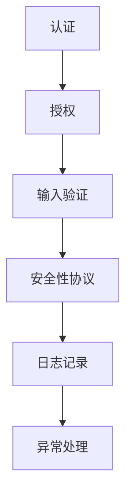

                 

API（应用程序编程接口）在现代软件开发中扮演着至关重要的角色，它们允许不同系统和服务之间进行通信和交互。然而，随着API的使用变得越来越普遍，安全漏洞和攻击也变得越来越常见。因此，设计安全可靠的API成为每个开发者的首要任务。本文将深入探讨如何实现这一目标，并提供实用的指南和最佳实践。

## 文章关键词

- API安全
- 设计原则
- 安全漏洞
- 攻击防御
- 最佳实践

## 摘要

本文将讨论设计安全可靠的API的重要性，介绍关键的安全概念和策略，分析常见的API安全漏洞，并提供具体的解决方案和最佳实践。通过本文的学习，读者将能够理解API安全的根本原则，并在实践中应用这些原则，以构建更加安全、可靠的API。

## 1. 背景介绍

### API的定义和重要性

API是允许软件应用程序之间相互通信和共享数据的接口。它定义了请求和响应的格式，允许不同系统和服务通过标准化的方式进行交互。API在软件开发中扮演着至关重要的角色，它们简化了复杂的编程任务，提高了代码的可重用性，并促进了软件组件之间的协作。

### API的安全性现状

尽管API的使用带来了许多便利，但它们也成为攻击者瞄准的目标。API安全问题层出不穷，如注入攻击、认证漏洞、权限不当等。这些问题不仅可能导致数据泄露，还会破坏系统的完整性和可用性。因此，确保API的安全性成为开发人员的首要任务。

### 设计安全API的挑战

设计安全API面临着诸多挑战，包括：

- **复杂性**：API的设计和实现可能非常复杂，涉及多个层次和组件。
- **动态性**：API往往需要适应不断变化的需求和环境。
- **依赖性**：API依赖于其他服务，这些服务可能存在安全漏洞。
- **标准化**：尽管存在API安全的标准和最佳实践，但它们的实施和遵守并不一致。

## 2. 核心概念与联系

### API安全的关键概念

在设计安全API时，理解以下关键概念至关重要：

- **认证**：确保只有授权用户可以访问API。
- **授权**：确定用户可以执行的操作。
- **输入验证**：确保输入数据的合法性和有效性。
- **安全性协议**：使用加密和令牌等安全机制保护数据传输。

### API安全架构的Mermaid流程图



### 核心概念的联系与重要性

- **认证与授权**：认证确保用户身份，授权确定用户权限。
- **输入验证**：防止恶意输入和数据注入。
- **安全性协议**：保护数据传输免受窃听和篡改。
- **日志记录与异常处理**：记录API的访问情况和异常，以便于监控和调试。

## 3. 核心算法原理 & 具体操作步骤

### 3.1 算法原理概述

设计安全API的核心算法主要涉及以下几个方面：

- **认证算法**：如OAuth、JSON Web Token（JWT）等。
- **授权算法**：基于角色的访问控制（RBAC）和基于属性的访问控制（ABAC）。
- **输入验证算法**：如正则表达式、白名单等。
- **加密算法**：如AES、RSA等。

### 3.2 算法步骤详解

#### 3.2.1 认证算法步骤

1. 用户发起认证请求。
2. API服务器验证用户身份，如检查用户名和密码。
3. 如果验证成功，服务器生成JWT或OAuth令牌。
4. 将令牌返回给用户，用户在后续请求中包含该令牌。

#### 3.2.2 授权算法步骤

1. API服务器接收包含令牌的请求。
2. 解析令牌以获取用户信息和权限。
3. 根据用户的权限检查请求的操作是否允许。

#### 3.2.3 输入验证算法步骤

1. 服务器接收输入数据。
2. 使用正则表达式或白名单验证数据的格式和内容。
3. 如果数据无效，拒绝请求并返回错误信息。

#### 3.2.4 加密算法步骤

1. 使用AES或RSA等加密算法加密敏感数据。
2. 在数据传输过程中使用TLS/SSL等安全协议。
3. 接收方使用相应的密钥解密数据。

### 3.3 算法优缺点

- **认证算法**：OAuth和JWT具有高扩展性和灵活性，但可能较复杂。
- **授权算法**：RBAC和ABAC提供细粒度的访问控制，但需要维护用户角色和权限信息。
- **输入验证算法**：能够有效防止注入攻击，但可能降低性能。
- **加密算法**：AES和RSA提供强大的数据保护，但需要妥善管理密钥。

### 3.4 算法应用领域

- **认证算法**：适用于需要用户身份验证的API。
- **授权算法**：适用于需要细粒度权限控制的系统。
- **输入验证算法**：适用于所有接收用户输入的API。
- **加密算法**：适用于需要保护敏感数据的API。

## 4. 数学模型和公式 & 详细讲解 & 举例说明

### 4.1 数学模型构建

API安全涉及到多种数学模型和公式，以下是其中几个关键模型：

- **哈希函数**：用于生成数据摘要。
- **加密算法**：如AES和RSA。
- **概率论**：用于评估风险和安全性。

### 4.2 公式推导过程

#### 哈希函数

$$H(D) = hash(D)$$

其中，\(H\) 表示哈希函数，\(D\) 表示数据。

#### 加密算法（AES）

$$C = AES(K, P)$$

其中，\(C\) 表示加密后的数据，\(K\) 表示密钥，\(P\) 表示原始数据。

#### 解密算法（AES）

$$P = AES^{-1}(K, C)$$

其中，\(P\) 表示解密后的数据。

### 4.3 案例分析与讲解

#### 案例一：哈希函数的使用

假设我们使用SHA-256哈希函数对一段文本进行哈希处理：

- **原文**：Hello, World!
- **哈希值**：a59f4d9f9f8f3de1fd4d1b7a0db5d4d7d5ce3cfae6d6d9364f27314a6e5781e9e1a0c3be0d3b

哈希值用于验证数据的完整性和一致性。

#### 案例二：AES加密与解密

假设我们使用AES加密算法对一段文本进行加密：

- **密钥**：k 密钥长度为16位
- **原文**：Secret Message
- **加密后的数据**：encrypted_data

加密后的数据可以使用正确的密钥进行解密，以恢复原文。

## 5. 项目实践：代码实例和详细解释说明

### 5.1 开发环境搭建

在本节中，我们将使用Python语言和Flask框架搭建一个简单的API服务。首先，确保已安装Python和Flask：

```bash
pip install flask
```

### 5.2 源代码详细实现

以下是一个简单的API服务代码示例，包括认证、授权和输入验证：

```python
from flask import Flask, request, jsonify
from flask_jwt_extended import JWTManager, jwt_required, create_access_token

app = Flask(__name__)
app.config['JWT_SECRET_KEY'] = 'your_secret_key'
jwt = JWTManager(app)

# 用户认证
@app.route('/login', methods=['POST'])
def login():
    username = request.json.get('username', None)
    password = request.json.get('password', None)
    # 这里需要实现真实的用户认证逻辑
    if username == 'admin' and password == 'password':
        access_token = create_access_token(identity=username)
        return jsonify(access_token=access_token)
    return jsonify({"msg": "Bad credentials"}), 401

# 用户授权
@app.route('/protected', methods=['GET'])
@jwt_required()
def protected():
    current_user = get_jwt_identity()
    return jsonify(logged_in_as=current_user), 200

# 输入验证
@app.route('/validate', methods=['POST'])
@jwt_required()
def validate():
    data = request.json
    if 'name' not in data or not isinstance(data['name'], str):
        return jsonify({"error": "Name is required and must be a string"}), 400
    return jsonify({"valid": True})

if __name__ == '__main__':
    app.run(debug=True)
```

### 5.3 代码解读与分析

- **认证**：用户通过登录接口提交用户名和密码，服务器验证用户身份并生成JWT令牌。
- **授权**：保护的路由需要JWT令牌，并在每次请求时验证用户的身份。
- **输入验证**：在请求处理过程中，对输入的数据进行验证，确保其格式和内容符合预期。

### 5.4 运行结果展示

- **登录**：访问`/login`接口，成功返回JWT令牌。
- **保护路由**：访问`/protected`接口，需要JWT令牌并验证身份。
- **输入验证**：提交不合法的请求，如缺少`name`字段或字段类型不正确，会返回400错误。

## 6. 实际应用场景

### 6.1 RESTful API

在Web服务中，RESTful API广泛使用HTTP协议进行数据传输，API设计通常遵循RESTful架构风格，包括GET、POST、PUT、DELETE等方法。

### 6.2 微服务架构

在微服务架构中，API作为服务之间的通信接口，确保不同服务之间的松耦合和高可用性。

### 6.3 移动应用

移动应用通常通过API与后端服务器交互，API安全性对保护用户数据和隐私至关重要。

### 6.4 未来应用展望

随着物联网和云计算的发展，API将在更多领域得到应用，对API安全的需求也将越来越高。未来，自动化安全测试和持续集成将成为API安全的重要手段。

## 7. 工具和资源推荐

### 7.1 学习资源推荐

- 《API设计指南》
- 《Web API 设计实战》
- 《API 设计之道》

### 7.2 开发工具推荐

- Postman：用于API测试和调试。
- Swagger：用于API文档生成和可视化。
- OWASP ZAP：用于Web应用程序安全测试。

### 7.3 相关论文推荐

- "API Security: Threats, Mitigation Strategies, and Best Practices"
- "Secure API Design Principles and Practical Strategies for Implementing Them"
- "Understanding and Preventing API Attacks: A Survey"

## 8. 总结：未来发展趋势与挑战

### 8.1 研究成果总结

近年来，API安全研究取得了显著进展，包括新的认证和授权机制、输入验证算法和安全协议等。

### 8.2 未来发展趋势

随着技术的不断进步，API安全将更加智能化和自动化，同时将引入更多标准化的安全框架。

### 8.3 面临的挑战

API安全仍然面临诸多挑战，包括复杂的架构、不断变化的需求和日益复杂的攻击手段。

### 8.4 研究展望

未来的研究方向包括开发更强大的安全算法、自动化安全测试工具和持续集成机制，以提高API的安全性。

## 9. 附录：常见问题与解答

### 问题1：如何防范API注入攻击？

**解答**：使用输入验证算法，如正则表达式和白名单，确保输入数据的合法性和有效性。同时，使用参数化查询和预处理语句防止SQL注入。

### 问题2：API认证和授权的区别是什么？

**解答**：认证确保用户身份，即“你是谁”；授权确定用户权限，即“你可以做什么”。认证是授权的前提，两者共同确保API的安全性。

### 问题3：如何保护API免受DDoS攻击？

**解答**：使用防火墙和负载均衡器保护API免受DDoS攻击。此外，监控流量模式并使用异常检测机制来识别和阻止恶意流量。

## 作者署名

作者：禅与计算机程序设计艺术 / Zen and the Art of Computer Programming
```csharp
本文由禅与计算机程序设计艺术（Zen and the Art of Computer Programming）撰写，旨在帮助开发者理解API安全的重要性，并提供实用的指南和最佳实践。
```

