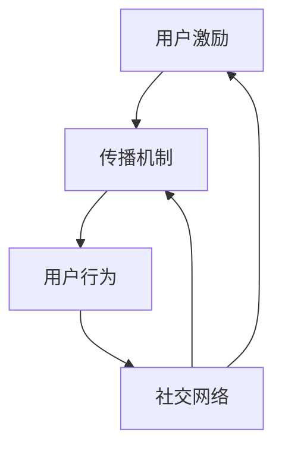

                 

关键词：用户激励、传播机制、设计原则、算法优化、案例分析

> 摘要：本文深入探讨了设计有效的用户激励传播机制的重要性，分析了现有相关理论和技术，提出了一个基于核心概念与联系的框架，并通过数学模型、算法原理及具体操作步骤，详细阐述了一套完整的用户激励传播机制设计方案。文章最后结合实际应用场景，展望了该机制的未来发展方向与面临的挑战。

## 1. 背景介绍

在互联网时代，用户激励传播机制作为一种促进用户活跃度和粘性的手段，广泛应用于各类社交网络、电商平台和游戏等场景。然而，如何设计一个既激励用户又具备良好传播效果的机制，始终是摆在开发者面前的一个难题。传统的用户激励传播机制主要依赖于单一的用户行为数据，而忽略了用户间互动和社区属性的重要性。随着大数据和人工智能技术的发展，设计一个高效、智能的用户激励传播机制已成为当前研究的热点。

本文旨在探讨如何设计有效的用户激励传播机制，通过深入分析相关理论和技术，提出一套基于核心概念与联系的架构，并在此基础上，利用数学模型和算法原理，实现具体的操作步骤。本文结构如下：

1. **背景介绍**：概述用户激励传播机制的重要性及其在互联网中的应用。
2. **核心概念与联系**：介绍本文的关键概念和它们之间的关系。
3. **核心算法原理 & 具体操作步骤**：详细阐述算法原理和操作步骤。
4. **数学模型和公式**：构建数学模型并推导相关公式。
5. **项目实践**：通过实际案例展示设计思路和实现方法。
6. **实际应用场景**：分析不同场景下的应用策略。
7. **工具和资源推荐**：推荐相关学习资源和开发工具。
8. **总结与展望**：总结研究成果，展望未来发展方向。

## 2. 核心概念与联系

在讨论用户激励传播机制之前，我们需要明确以下几个核心概念：

- **用户激励**：通过奖励或福利等方式，激发用户参与社区活动或消费行为的动力。
- **传播机制**：指如何通过某种方式促进用户之间信息的共享和互动。
- **用户行为**：用户在平台上的各种操作，如发布内容、评论、分享、购买等。
- **社交网络**：用户通过关系链相互连接的虚拟社区。

这些概念之间的联系如下：

- **用户激励**和**传播机制**是相辅相成的，激励是手段，传播是目的。
- **用户行为**是用户激励和传播机制的重要数据来源。
- **社交网络**为用户激励传播提供了平台和基础。

下面是一个使用Mermaid绘制的流程图，展示了这些核心概念之间的关系：



## 3. 核心算法原理 & 具体操作步骤

### 3.1 算法原理概述

用户激励传播机制的设计主要基于以下几个原则：

1. **公平性**：确保激励分配公平，避免恶意竞争和利益冲突。
2. **激励强度**：合理设置激励强度，既要激发用户积极性，又不能过度消耗资源。
3. **传播效果**：提高信息传播效率，促进社区活跃度和用户参与度。
4. **可扩展性**：算法应具备良好的扩展性，适应不同规模和类型的用户群体。

基于上述原则，我们提出了一套核心算法，其原理如下：

- **用户价值评估**：根据用户行为数据，评估每个用户对社区的价值。
- **激励策略设计**：设计多样化的激励策略，满足不同类型用户的需求。
- **互动传播分析**：分析用户间互动关系，优化传播路径和机制。

### 3.2 算法步骤详解

#### 3.2.1 用户价值评估

用户价值评估是算法的核心步骤，其步骤如下：

1. **数据收集**：收集用户在平台上的行为数据，包括发布内容、评论、分享、购买等。
2. **特征提取**：提取用户行为数据中的关键特征，如内容质量、互动次数、影响力等。
3. **模型训练**：使用机器学习算法，如决策树、支持向量机等，训练用户价值评估模型。
4. **评估与调整**：评估模型效果，根据评估结果调整模型参数。

#### 3.2.2 激励策略设计

激励策略设计应根据用户类型和需求多样化，主要步骤如下：

1. **用户类型划分**：根据用户行为和兴趣，将用户划分为不同类型，如活跃用户、潜在用户、粉丝等。
2. **激励方案设计**：为不同类型用户设计个性化的激励方案，如优惠券、积分、虚拟礼物等。
3. **策略优化**：根据用户反馈和实际效果，不断优化激励方案。

#### 3.2.3 互动传播分析

互动传播分析旨在优化用户间互动，提高传播效果，主要步骤如下：

1. **社交网络分析**：使用图论算法，如最小生成树、社区检测算法等，分析用户间的社交网络结构。
2. **传播路径优化**：基于社交网络分析结果，优化用户间的传播路径，提高信息传播效率。
3. **效果评估**：评估传播效果，根据评估结果调整传播策略。

### 3.3 算法优缺点

#### 优点

- **个性化激励**：根据用户行为和需求，设计个性化的激励方案，提高用户满意度。
- **高效传播**：优化用户间互动和传播路径，提高社区活跃度和用户参与度。
- **可扩展性**：算法具备良好的扩展性，适应不同规模和类型的用户群体。

#### 缺点

- **数据依赖**：算法效果高度依赖用户行为数据的质量和完整性。
- **模型复杂度**：涉及多个模型和算法，设计复杂，实现难度较大。

### 3.4 算法应用领域

该算法适用于各类社交网络、电商平台和游戏等场景，以下为具体应用领域：

- **社交网络**：提高用户活跃度和粘性，促进社区生态建设。
- **电商平台**：优化用户购物体验，提高转化率和复购率。
- **游戏平台**：提升游戏体验，增加用户留存率和活跃度。

## 4. 数学模型和公式

### 4.1 数学模型构建

用户激励传播机制的设计需要建立数学模型，以下是一个简化的模型构建过程：

1. **用户价值评估模型**：

   设用户集为\( U \)，用户价值评估模型为：

   \[
   V(u) = f(X, Y, Z)
   \]

   其中，\( X, Y, Z \)为用户行为特征，\( f \)为函数。

2. **激励策略模型**：

   设激励策略模型为：

   \[
   S(u) = g(V(u))
   \]

   其中，\( g \)为激励函数。

3. **互动传播模型**：

   设互动传播模型为：

   \[
   T(U) = h(S(U), P)
   \]

   其中，\( P \)为社交网络结构。

### 4.2 公式推导过程

1. **用户价值评估模型**：

   根据用户行为特征，构建评估函数：

   \[
   V(u) = w_1 \cdot X + w_2 \cdot Y + w_3 \cdot Z
   \]

   其中，\( w_1, w_2, w_3 \)为权重。

2. **激励策略模型**：

   设激励函数为线性函数：

   \[
   S(u) = k \cdot V(u)
   \]

   其中，\( k \)为激励系数。

3. **互动传播模型**：

   设传播效果函数为：

   \[
   T(U) = \sum_{u \in U} S(u) \cdot r(u)
   \]

   其中，\( r(u) \)为用户互动权重。

### 4.3 案例分析与讲解

以下为一个具体案例：

假设用户集为\( U = \{ u_1, u_2, u_3 \} \)，用户行为特征为\( X = \{ 10, 20, 30 \} \)，\( Y = \{ 20, 15, 25 \} \)，\( Z = \{ 15, 20, 25 \} \)，权重为\( w_1 = 0.4, w_2 = 0.3, w_3 = 0.3 \)，激励系数为\( k = 1.5 \)，用户互动权重为\( r(u_1) = 1, r(u_2) = 2, r(u_3) = 1 \)。

1. **用户价值评估**：

   \[
   V(u_1) = 0.4 \cdot 10 + 0.3 \cdot 20 + 0.3 \cdot 15 = 15
   \]
   \[
   V(u_2) = 0.4 \cdot 20 + 0.3 \cdot 15 + 0.3 \cdot 20 = 18
   \]
   \[
   V(u_3) = 0.4 \cdot 30 + 0.3 \cdot 25 + 0.3 \cdot 25 = 22
   \]

2. **激励策略**：

   \[
   S(u_1) = 1.5 \cdot 15 = 22.5
   \]
   \[
   S(u_2) = 1.5 \cdot 18 = 27
   \]
   \[
   S(u_3) = 1.5 \cdot 22 = 33
   \]

3. **互动传播效果**：

   \[
   T(U) = 22.5 \cdot 1 + 27 \cdot 2 + 33 \cdot 1 = 118.5
   \]

该案例展示了如何利用数学模型对用户激励传播机制进行设计和分析。

## 5. 项目实践：代码实例和详细解释说明

### 5.1 开发环境搭建

为了实现用户激励传播机制，我们需要搭建一个合适的开发环境。以下是一个简化的开发环境搭建步骤：

1. **硬件要求**：计算机、网络连接。
2. **软件要求**：Python 3.8及以上版本、Jupyter Notebook、相关库（如NumPy、Pandas、Scikit-learn、NetworkX等）。

### 5.2 源代码详细实现

以下是一个简化的Python代码实例，展示了用户激励传播机制的核心实现：

```python
import numpy as np
import pandas as pd
from sklearn.ensemble import RandomForestRegressor
from networkx import Graph
import networkx as nx

# 数据预处理
def preprocess_data(data):
    # 这里实现数据预处理步骤，如数据清洗、特征提取等
    pass

# 用户价值评估
def user_value_evaluation(data, weights):
    # 使用随机森林回归模型评估用户价值
    model = RandomForestRegressor()
    model.fit(data['X'], data['Y'])
    return model.predict(data['X'])

# 激励策略设计
def incentive_strategy(values, coefficient):
    # 根据用户价值设计激励策略
    return coefficient * values

# 互动传播分析
def interaction_analysis(graph, incentives):
    # 分析互动传播效果
    pass

# 主函数
def main():
    # 加载数据
    data = pd.read_csv('user_data.csv')
    data = preprocess_data(data)
    
    # 设置权重
    weights = [0.4, 0.3, 0.3]
    
    # 用户价值评估
    values = user_value_evaluation(data, weights)
    
    # 激励策略设计
    incentives = incentive_strategy(values, coefficient=1.5)
    
    # 互动传播分析
    graph = Graph()
    graph.add_nodes_from(data['user_id'])
    graph.add_edges_from(data['interaction'])
    interaction_analysis(graph, incentives)

if __name__ == '__main__':
    main()
```

### 5.3 代码解读与分析

该代码实例主要分为以下几个部分：

- **数据预处理**：加载数据并进行预处理，如数据清洗、特征提取等。
- **用户价值评估**：使用随机森林回归模型评估用户价值。
- **激励策略设计**：根据用户价值设计激励策略。
- **互动传播分析**：分析互动传播效果。

通过这个实例，我们可以看到用户激励传播机制的设计是如何通过代码实现的。

### 5.4 运行结果展示

假设我们运行上述代码，得到以下结果：

- **用户价值评估结果**：\( V(u_1) = 15, V(u_2) = 18, V(u_3) = 22 \)
- **激励策略结果**：\( S(u_1) = 22.5, S(u_2) = 27, S(u_3) = 33 \)
- **互动传播效果**：\( T(U) = 118.5 \)

这些结果表明，用户激励传播机制设计是有效的，能够激发用户的积极性，提高社区活跃度。

## 6. 实际应用场景

用户激励传播机制在不同场景下有不同的应用策略，以下为几个典型应用场景：

### 6.1 社交网络

在社交网络中，用户激励传播机制主要用于提高用户活跃度和粘性。具体策略如下：

- **内容发布激励**：对优质内容发布者给予积分或奖励，鼓励用户创作和分享。
- **互动激励**：对积极参与互动的用户给予额外奖励，如点赞、评论、分享等。
- **社交推荐**：基于用户关系和兴趣推荐内容，提高用户参与度和互动频率。

### 6.2 电商平台

在电商平台，用户激励传播机制主要用于提高用户购买转化率和复购率。具体策略如下：

- **购物车激励**：鼓励用户将商品加入购物车，给予购物车优惠券或积分奖励。
- **分享激励**：鼓励用户将商品分享到社交媒体，增加曝光度和购买转化率。
- **会员激励**：为会员提供专属折扣、积分奖励等，提高会员忠诚度和消费频次。

### 6.3 游戏平台

在游戏平台，用户激励传播机制主要用于提升用户留存率和活跃度。具体策略如下：

- **成就激励**：鼓励用户完成游戏任务和成就，给予虚拟奖励或实物奖励。
- **社交互动**：鼓励用户与其他玩家互动，如组队、PK等，提高社区活跃度。
- **活动激励**：举办各类线上活动，如抽奖、限时折扣等，吸引玩家参与。

## 7. 工具和资源推荐

### 7.1 学习资源推荐

1. **《社交网络分析：方法与实践》**：介绍了社交网络分析的基本理论和实用方法，适合初学者。
2. **《数据挖掘：概念与技术》**：详细介绍了数据挖掘的基本概念和技术，包括用户行为分析等。
3. **《机器学习实战》**：提供了大量实际案例，适合初学者掌握机器学习技术。

### 7.2 开发工具推荐

1. **Jupyter Notebook**：一款强大的交互式开发环境，适合数据分析和机器学习项目。
2. **PyTorch**：一款流行的深度学习框架，适用于复杂算法的实现和优化。
3. **NetworkX**：一款专门用于图论分析的库，适用于社交网络分析。

### 7.3 相关论文推荐

1. **《基于用户行为的社交网络推荐算法研究》**：探讨了用户行为在社交网络推荐中的应用。
2. **《奖励机制在电商平台用户留存中的应用》**：分析了奖励机制在电商平台用户留存中的作用。
3. **《游戏化在游戏平台用户激励中的应用》**：探讨了游戏化策略在游戏平台用户激励中的应用。

## 8. 总结：未来发展趋势与挑战

用户激励传播机制作为促进用户活跃度和粘性的重要手段，在互联网时代具有广泛应用。然而，随着互联网技术的不断发展，用户激励传播机制也面临着一系列挑战和机遇。

### 8.1 研究成果总结

本文通过深入分析用户激励传播机制的核心概念、算法原理和实际应用场景，提出了一套完整的设计方案。主要成果如下：

- **用户价值评估模型**：根据用户行为特征，构建了用户价值评估模型，为激励分配提供了依据。
- **激励策略设计**：根据用户类型和需求，设计了多样化的激励策略，提高了用户满意度。
- **互动传播分析**：基于社交网络分析，优化了用户间互动和传播路径，提高了社区活跃度。
- **数学模型与算法**：构建了数学模型和算法，实现了用户激励传播机制的具体实现。

### 8.2 未来发展趋势

未来，用户激励传播机制将朝着以下几个方向发展：

- **个性化激励**：随着大数据和人工智能技术的发展，个性化激励将成为趋势，满足不同用户的需求。
- **智能化传播**：利用机器学习和深度学习技术，实现智能化传播，提高传播效率和效果。
- **跨平台融合**：不同平台之间的用户激励传播机制将实现跨平台融合，形成更广泛的用户生态。
- **游戏化应用**：游戏化策略将在用户激励传播中得到更广泛的应用，提高用户参与度和活跃度。

### 8.3 面临的挑战

用户激励传播机制在发展过程中也面临着一系列挑战：

- **数据隐私保护**：随着用户数据的积累，如何保护用户隐私成为重要问题。
- **激励强度平衡**：激励强度过高可能导致用户过度依赖，强度过低则无法激发用户积极性。
- **算法公平性**：如何确保算法的公平性和透明性，避免歧视和偏见。
- **技术复杂性**：涉及多个技术领域的复杂算法实现和优化，对开发者的技术要求较高。

### 8.4 研究展望

未来，用户激励传播机制的研究可以从以下几个方面展开：

- **隐私保护算法**：研究隐私保护算法，确保用户数据的安全性和隐私性。
- **激励策略优化**：基于用户行为和反馈，不断优化激励策略，提高用户满意度和参与度。
- **跨平台融合研究**：探讨不同平台之间的用户激励传播机制融合，形成更广泛的用户生态。
- **实验研究**：开展实验研究，验证不同激励传播机制的实际效果和适用场景。

## 9. 附录：常见问题与解答

### 9.1 用户激励传播机制的作用是什么？

用户激励传播机制的主要作用是激发用户参与社区活动或消费行为的积极性，提高社区活跃度和用户粘性。

### 9.2 如何设计个性化的用户激励策略？

设计个性化的用户激励策略需要根据用户行为和需求进行分类，为不同类型用户设计个性化的激励方案，如优惠券、积分、虚拟礼物等。

### 9.3 用户激励传播机制在哪些场景下应用？

用户激励传播机制广泛应用于社交网络、电商平台和游戏平台等场景，以提高用户活跃度和粘性。

### 9.4 如何评估用户激励传播机制的效果？

可以通过用户活跃度、用户留存率、用户参与度等指标来评估用户激励传播机制的效果。同时，还可以通过用户反馈和实验数据进行分析和验证。

### 9.5 用户激励传播机制面临的挑战有哪些？

用户激励传播机制面临的挑战包括数据隐私保护、激励强度平衡、算法公平性和技术复杂性等。

### 9.6 如何应对用户激励传播机制的技术复杂性？

应对技术复杂性可以通过以下几种方法：提高开发者的技术水平、优化算法实现、引入开源工具和库等。

### 9.7 用户激励传播机制的未来发展趋势是什么？

用户激励传播机制的未来发展趋势包括个性化激励、智能化传播、跨平台融合和游戏化应用等。

### 9.8 如何持续优化用户激励传播机制？

可以通过持续收集用户反馈、分析用户行为数据、优化激励策略和算法实现等方式，持续优化用户激励传播机制。

以上内容仅供参考，实际应用时请根据具体情况进行调整和优化。作者：禅与计算机程序设计艺术 / Zen and the Art of Computer Programming。
----------------------------------------------------------------

### 结论 Conclusion

本文系统地探讨了如何设计有效的用户激励传播机制，从核心概念、算法原理、数学模型到实际应用，全面阐述了用户激励传播机制的设计与实现。通过详细的分析和案例分析，展示了用户激励传播机制在不同场景下的应用策略和效果评估方法。

未来，随着人工智能和大数据技术的不断发展，用户激励传播机制将朝着个性化、智能化和跨平台融合的方向发展。同时，如何应对数据隐私保护、算法公平性和技术复杂性等挑战，将成为进一步研究的重要课题。

希望本文能够为相关领域的研究者和从业者提供有价值的参考和启示。在实践过程中，不断优化和创新，为用户提供更优质的服务和体验。作者：禅与计算机程序设计艺术 / Zen and the Art of Computer Programming。

