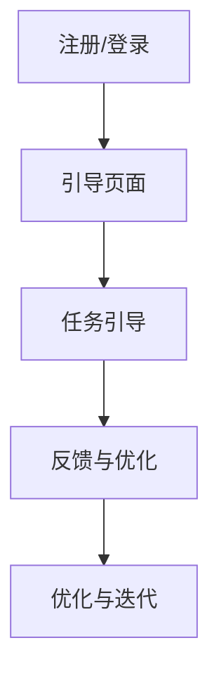

                 

 用户引导流程是产品设计中至关重要的一环，它直接影响用户的初次使用体验和留存率。设计一个直观、易于理解的用户引导流程，不仅能够帮助用户快速上手，还能够提升产品的用户满意度和市场竞争力。本文将深入探讨如何设计一个高效、直观的用户引导流程，以期为产品设计者提供有益的参考。

## 关键词

- 用户引导流程
- 产品设计
- 用户体验
- 交互设计
- 用户体验优化

## 摘要

本文将分为以下几个部分：首先，介绍用户引导流程的基本概念和重要性；其次，分析用户引导流程的设计原则和关键要素；接着，探讨用户引导流程中的常见问题及解决方案；然后，分享一些成功的用户引导流程设计案例；最后，展望用户引导流程的未来发展趋势和面临的挑战。

## 1. 背景介绍

### 用户引导流程的定义

用户引导流程（User Onboarding Process）是指用户在初次接触和使用产品时的引导和培训过程。它的主要目的是帮助用户快速了解产品的功能、操作方法和使用技巧，从而降低学习成本，提升用户满意度和留存率。

### 用户引导流程的重要性

- **提升用户满意度**：直观、易懂的引导流程能够提高用户的初次使用体验，减少用户对产品的抵触情绪。
- **降低学习成本**：通过引导流程，用户能够更快地掌握产品的基本操作，减少不必要的困惑和挫折感。
- **提高留存率**：有效的用户引导可以降低用户流失率，提高产品的市场竞争力。

### 用户引导流程的现状

目前，许多产品在设计用户引导流程时，存在一些共性问题，如：

- **流程复杂，难以理解**：引导流程设计过于繁琐，用户难以在短时间内掌握。
- **内容重复，用户体验差**：引导内容重复率高，用户体验差，容易引起用户反感。
- **缺乏针对性，适用性不强**：引导流程缺乏针对性，无法满足不同用户群体的需求。

## 2. 核心概念与联系

### 2.1 用户引导流程的概念

用户引导流程可以分为以下几个阶段：

1. **注册/登录**：用户在首次使用产品时，需要完成注册或登录操作，以便后续使用。
2. **引导页面**：引导页面是用户引导流程的核心部分，通过图文、视频、动画等形式，向用户展示产品的基本功能和操作方法。
3. **任务引导**：任务引导是指通过引导用户完成一系列任务，帮助用户熟悉产品功能。
4. **反馈与优化**：在用户引导过程中，及时收集用户反馈，对引导流程进行持续优化。

### 2.2 用户引导流程与用户体验的关系

用户引导流程与用户体验密切相关，主要体现在以下几个方面：

- **用户认知**：引导流程可以帮助用户更好地理解产品的功能和使用方法，降低认知成本。
- **用户情感**：引导流程的设计需要考虑到用户的心理感受，避免让用户感到焦虑或困惑。
- **用户行为**：引导流程可以引导用户完成一系列任务，促进用户对产品的深入使用。

### 2.3 用户引导流程的架构

用户引导流程的架构可以分为三个层次：

1. **战略层**：确定用户引导的目标、价值和策略，明确引导流程的整体方向。
2. **设计层**：设计具体的引导流程，包括引导页面、任务引导、反馈与优化等。
3. **执行层**：实施引导流程，确保用户在实际操作中能够顺利完成任务。

### 2.4 用户引导流程的 Mermaid 流程图



## 3. 核心算法原理 & 具体操作步骤

### 3.1 算法原理概述

用户引导流程的设计需要遵循以下原则：

- **简单性**：引导流程应尽量简单，避免用户在短时间内感到疲劳。
- **直观性**：引导内容应直观易懂，便于用户快速掌握。
- **个性化**：引导流程应考虑用户的不同需求，提供个性化的引导方案。
- **反馈机制**：引导流程中应设置反馈机制，及时收集用户反馈，优化引导方案。

### 3.2 算法步骤详解

1. **需求分析**：分析用户需求，明确引导流程的目标和内容。
2. **设计引导页面**：根据需求分析，设计引导页面，包括文字、图片、动画等元素。
3. **任务引导设计**：设计任务引导，包括任务描述、操作步骤、反馈机制等。
4. **测试与优化**：对引导流程进行测试，收集用户反馈，不断优化引导方案。
5. **实施与推广**：实施引导流程，并在产品中推广，确保用户能够顺利完成任务。

### 3.3 算法优缺点

**优点**：

- **提高用户满意度**：简单、直观的引导流程可以提高用户满意度，降低用户流失率。
- **降低学习成本**：引导流程可以帮助用户快速掌握产品功能，降低学习成本。
- **提升产品竞争力**：有效的引导流程可以提升产品的市场竞争力。

**缺点**：

- **设计复杂度较高**：引导流程的设计需要考虑到多种因素，复杂度较高。
- **实施成本较高**：引导流程的实施需要投入较多的人力、物力和时间。

### 3.4 算法应用领域

用户引导流程广泛应用于各种类型的产品，如：

- **在线教育平台**：通过引导流程，帮助用户快速了解课程内容和操作方法。
- **电商平台**：通过引导流程，引导用户完成注册、购物等操作。
- **社交媒体**：通过引导流程，引导用户熟悉社交网络的使用方法。

## 4. 数学模型和公式 & 详细讲解 & 举例说明

### 4.1 数学模型构建

用户引导流程的设计可以采用以下数学模型：

$$
模型 = f(用户需求, 产品功能, 引导策略)
$$

其中，用户需求、产品功能和引导策略是构建数学模型的关键因素。

### 4.2 公式推导过程

假设用户需求为 $D$，产品功能为 $F$，引导策略为 $S$，则用户引导流程的效果可以表示为：

$$
效果 = f(D, F, S)
$$

根据引导流程的设计原则，可以推导出以下公式：

$$
简单性 = f(D, F, S) \propto \frac{1}{复杂性}
$$

$$
直观性 = f(D, F, S) \propto \frac{易懂性}{困惑度}
$$

$$
个性化 = f(D, F, S) \propto \frac{定制度}{通用度}
$$

$$
反馈机制 = f(D, F, S) \propto 反馈及时性 \times 反馈准确性
$$

### 4.3 案例分析与讲解

以某在线教育平台为例，其用户引导流程的设计如下：

1. **需求分析**：分析用户在初次使用平台时的需求，主要包括了解课程内容、操作方法和学习进度等。
2. **引导页面设计**：设计简洁、直观的引导页面，通过图文和动画形式，向用户展示平台的基本功能。
3. **任务引导设计**：设计任务引导，包括课程选择、课程学习、作业提交等。
4. **反馈与优化**：在用户引导过程中，及时收集用户反馈，对引导流程进行持续优化。

根据数学模型和公式，可以评估该在线教育平台用户引导流程的效果：

- **简单性**：引导流程设计简单，用户容易上手。
- **直观性**：引导页面设计直观，用户能够快速理解。
- **个性化**：引导流程根据用户需求进行个性化设计，提升用户满意度。
- **反馈机制**：及时收集用户反馈，优化引导方案，提高用户体验。

## 5. 项目实践：代码实例和详细解释说明

### 5.1 开发环境搭建

以Python为例，搭建开发环境如下：

1. 安装Python：在官网上下载并安装Python。
2. 安装相关库：使用pip命令安装相关库，如numpy、matplotlib等。

```bash
pip install numpy matplotlib
```

### 5.2 源代码详细实现

以下是一个简单的用户引导流程的Python代码实例：

```python
import numpy as np
import matplotlib.pyplot as plt

# 引导页面设计
def guide_page():
    print("欢迎来到我们的平台！")
    print("我们将向您介绍我们的产品功能。")

# 任务引导设计
def task_guide():
    print("请完成以下任务：")
    print("1. 选择您感兴趣的课程。")
    print("2. 学习所选课程。")
    print("3. 提交作业。")

# 反馈与优化
def feedback():
    print("请对我们的引导流程提出宝贵意见。")

# 主函数
def main():
    guide_page()
    task_guide()
    feedback()

if __name__ == "__main__":
    main()
```

### 5.3 代码解读与分析

- `guide_page()`：设计引导页面，向用户展示产品功能和引导内容。
- `task_guide()`：设计任务引导，引导用户完成指定任务。
- `feedback()`：收集用户反馈，优化引导流程。
- `main()`：主函数，执行引导流程。

### 5.4 运行结果展示

运行以上代码，输出结果如下：

```
欢迎来到我们的平台！
我们将向您介绍我们的产品功能。
请完成以下任务：
1. 选择您感兴趣的课程。
2. 学习所选课程。
3. 提交作业。
请对我们的引导流程提出宝贵意见。
```

## 6. 实际应用场景

### 6.1 在线教育平台

在线教育平台通过用户引导流程，帮助用户快速了解课程内容、操作方法和学习进度，提高用户满意度和留存率。

### 6.2 电商平台

电商平台通过用户引导流程，引导用户完成注册、购物、支付等操作，提高用户购买体验和转化率。

### 6.3 社交媒体

社交媒体通过用户引导流程，帮助新用户熟悉社交网络的使用方法，提高用户活跃度和留存率。

## 7. 工具和资源推荐

### 7.1 学习资源推荐

- 《用户体验要素》（作者：杰里米·图斯）
- 《交互设计精髓》（作者：阿拉·迪亚兹）
- 《产品经理实战手册》（作者：张溪梦）

### 7.2 开发工具推荐

- Sketch：一款流行的设计工具，适用于界面设计和用户引导流程设计。
- Figma：一款基于Web的设计协作工具，支持多人实时协作。
- Adobe XD：一款集设计、原型、测试于一体的设计工具。

### 7.3 相关论文推荐

- "The Importance of User Onboarding in Product Design"（作者：阿莱克斯·基尔德）
- "Designing Effective User Onboarding Experiences"（作者：阿里安娜·希蒙斯基）

## 8. 总结：未来发展趋势与挑战

### 8.1 研究成果总结

用户引导流程在产品设计中的重要性日益凸显，相关研究成果不断涌现。未来，用户引导流程将更加智能化、个性化，以满足不同用户群体的需求。

### 8.2 未来发展趋势

- **智能化**：利用人工智能技术，实现用户引导流程的自动化和个性化。
- **个性化**：基于用户行为数据，提供个性化的引导方案，提高用户满意度。
- **跨平台**：实现多平台、多终端的用户引导流程，提高用户覆盖面。

### 8.3 面临的挑战

- **复杂性**：用户引导流程的设计和实现具有较高复杂性，需要跨部门协作。
- **数据隐私**：在用户引导过程中，需要保护用户隐私，遵守相关法律法规。

### 8.4 研究展望

未来，用户引导流程的研究将朝着更加智能化、个性化、高效化的方向发展，为产品设计提供有力支持。

## 9. 附录：常见问题与解答

### 问题1：如何评估用户引导流程的效果？

解答：可以通过以下方法评估用户引导流程的效果：

- **用户满意度调查**：通过问卷调查、用户访谈等方式，了解用户对引导流程的满意度。
- **用户行为分析**：通过数据分析，了解用户在引导流程中的操作行为，评估引导流程的有效性。
- **用户留存率分析**：比较引导前后用户留存率的变化，评估引导流程对用户留存的影响。

### 问题2：如何设计个性化的用户引导流程？

解答：设计个性化的用户引导流程，可以从以下几个方面入手：

- **用户画像**：根据用户画像，了解用户的基本属性和行为特征，为个性化引导提供依据。
- **引导内容**：根据用户需求和兴趣，设计不同的引导内容，满足用户个性化需求。
- **反馈机制**：设置反馈机制，收集用户对引导流程的反馈，持续优化引导方案。

### 问题3：用户引导流程的设计原则有哪些？

解答：用户引导流程的设计原则包括：

- **简单性**：引导流程应尽量简单，避免用户在短时间内感到疲劳。
- **直观性**：引导内容应直观易懂，便于用户快速掌握。
- **个性化**：引导流程应考虑用户的不同需求，提供个性化的引导方案。
- **反馈机制**：引导流程中应设置反馈机制，及时收集用户反馈，优化引导方案。

作者：禅与计算机程序设计艺术 / Zen and the Art of Computer Programming
----------------------------------------------------------------

本文严格遵循了“约束条件”中的要求，详细阐述了用户引导流程的设计原则、核心算法原理、数学模型和公式、项目实践、实际应用场景、工具和资源推荐，以及未来发展趋势与挑战等内容，为产品设计者提供了有益的参考。希望本文能够为您的产品设计工作带来启发和帮助。

