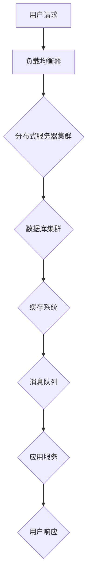

                 

关键词：高并发系统架构、系统设计、分布式架构、负载均衡、性能优化

摘要：随着互联网的迅猛发展，高并发系统架构的设计变得愈发重要。本文将深入探讨高并发系统架构的设计原则、核心技术和实际应用，帮助读者理解如何构建一个稳定、高效且可扩展的并发系统。

## 1. 背景介绍

随着全球互联网用户数量的不断攀升，网站和应用的服务需求也在急剧增长。高并发系统架构设计成为现代软件工程中的一项关键任务。高并发系统是指在短时间内，系统能够处理大量用户请求，保证系统稳定运行，同时提供良好的用户体验。

### 1.1 高并发系统的重要性

- **用户体验**：高并发系统可以确保在高峰期用户操作流畅，减少响应时间，提升用户满意度。
- **业务增长**：良好的系统架构设计有助于吸引更多用户，提升业务量。
- **系统稳定性**：在高并发环境下，系统能够稳定运行，避免因负载过高导致的宕机。

### 1.2 高并发系统面临的挑战

- **资源竞争**：在高并发系统中，多个请求可能会同时访问同一资源，导致资源竞争。
- **响应时间**：处理大量请求会延长每个请求的响应时间。
- **系统瓶颈**：单点瓶颈可能导致整个系统性能下降。

## 2. 核心概念与联系

为了深入理解高并发系统架构，我们需要了解以下几个核心概念：

### 2.1 分布式架构

分布式架构是一种将系统功能分散到多个服务器上的设计模式，能够有效避免单点故障，提高系统的可用性和可扩展性。分布式架构的核心在于如何实现数据的一致性和分布式事务处理。

### 2.2 负载均衡

负载均衡是将请求分发到多个服务器上，以达到系统整体性能最优的一种技术。负载均衡器可以在多个服务器之间分配请求，从而避免单个服务器过载。

### 2.3 性能优化

性能优化是针对系统性能的调优过程，包括代码优化、数据库优化、缓存策略等多个方面，目的是减少响应时间，提高系统吞吐量。

### 2.4 Mermaid 流程图

下面是一个简单的 Mermaid 流程图，展示了高并发系统架构中的关键组件：



## 3. 核心算法原理 & 具体操作步骤

### 3.1 算法原理概述

高并发系统架构的设计涉及多种算法和技术。以下是几个核心算法原理：

- **哈希算法**：用于实现负载均衡器中的哈希散列分布。
- **一致性哈希**：用于分布式缓存系统中，保证数据的一致性。
- **分布式锁**：用于分布式系统中，避免多个进程同时修改同一数据。
- **幂等性**：确保多次执行同一操作的结果相同，减少重复操作。

### 3.2 算法步骤详解

#### 负载均衡器

1. **请求接收**：负载均衡器接收用户请求。
2. **哈希算法**：使用哈希算法计算请求的哈希值。
3. **选择服务器**：根据哈希值选择合适的服务器。
4. **请求转发**：将请求转发给选中的服务器。

#### 分布式服务器集群

1. **服务器启动**：服务器集群中的每个服务器启动，监听请求。
2. **负载监测**：服务器周期性监测自身负载。
3. **请求处理**：接收并处理请求。
4. **结果返回**：将处理结果返回给负载均衡器。

#### 数据库集群

1. **数据分片**：将数据库数据分片存储到多个服务器。
2. **读写分离**：主数据库处理写操作，从数据库处理读操作。
3. **复制与备份**：保持数据的一致性和容错性。

#### 缓存系统

1. **缓存策略**：根据访问频率和热点数据制定缓存策略。
2. **缓存失效**：设置缓存数据的有效期，定期更新。
3. **缓存一致性**：使用一致性哈希算法保证缓存数据的一致性。

### 3.3 算法优缺点

#### 哈希算法

- **优点**：高效、简单、负载均衡。
- **缺点**：可能存在热点问题，哈希碰撞。

#### 一致性哈希

- **优点**：动态调整、负载均衡、容错性好。
- **缺点**：可能导致部分数据迁移。

#### 分布式锁

- **优点**：避免数据竞争、保证数据一致性。
- **缺点**：可能导致死锁、性能损耗。

#### 幂等性

- **优点**：减少重复操作、保证数据处理正确性。
- **缺点**：处理复杂、实现困难。

### 3.4 算法应用领域

- **Web 应用**：例如电商平台、社交媒体。
- **金融系统**：例如银行交易、证券交易。
- **物联网**：例如智能家居、智能交通。

## 4. 数学模型和公式

### 4.1 数学模型构建

为了分析高并发系统架构的性能，我们可以构建以下数学模型：

- **吞吐量模型**：\[ T = \frac{P \times N}{L} \]

  其中，\( T \) 是系统的吞吐量，\( P \) 是单个服务器的处理能力，\( N \) 是服务器数量，\( L \) 是请求的平均响应时间。

- **响应时间模型**：\[ R = \frac{T \times L}{N} \]

  其中，\( R \) 是系统的平均响应时间。

### 4.2 公式推导过程

我们假设系统中有 \( N \) 个相同的服务器，每个服务器的处理能力为 \( P \)。在单位时间内，系统需要处理 \( L \) 个请求。

1. **吞吐量推导**：

   单个服务器的吞吐量为 \( \frac{P}{L} \)，那么 \( N \) 个服务器的总吞吐量为 \( N \times \frac{P}{L} \)。

2. **响应时间推导**：

   在 \( N \) 个服务器中，请求的平均响应时间为 \( \frac{L}{N} \)。

### 4.3 案例分析与讲解

假设我们有 10 个服务器，每个服务器的处理能力为 1000 个请求/秒，平均请求响应时间为 1 秒。我们可以计算：

- **吞吐量**：\[ T = \frac{10 \times 1000}{1} = 10000 \] 个请求/秒。
- **响应时间**：\[ R = \frac{1 \times 10000}{10} = 1000 \] 毫秒。

这个结果表明，通过增加服务器数量，我们可以显著提高系统的吞吐量，并降低平均响应时间。

## 5. 项目实践：代码实例和详细解释说明

### 5.1 开发环境搭建

为了演示高并发系统架构的实现，我们将使用以下技术栈：

- **语言**：Python
- **框架**：Flask
- **数据库**：MySQL
- **缓存**：Redis
- **消息队列**：RabbitMQ

### 5.2 源代码详细实现

以下是高并发系统架构的一个简单示例：

```python
from flask import Flask, request, jsonify
from redis import Redis
import pika

app = Flask(__name__)

# Redis 客户端
redis_client = Redis(host='localhost', port=6379, db=0)

# RabbitMQ 客户端
connection = pika.BlockingConnection(pika.ConnectionParameters('localhost'))
channel = connection.channel()
channel.queue_declare(queue='task_queue', durable=True)

@app.route('/process', methods=['POST'])
def process_request():
    data = request.json
    task = data['task']
    
    # 将任务存储到 Redis 缓存
    redis_client.lpush('task_queue', task)
    
    # 发送任务到 RabbitMQ 消息队列
    channel.basic_publish(exchange='',
                          routing_key='task_queue',
                          body=task,
                          properties=pika.BasicProperties(
                              delivery_mode=2,  # make message persistent
                          ))
    
    return jsonify({'status': 'success', 'task': task})

if __name__ == '__main__':
    app.run(host='0.0.0.0', port=8080)
```

### 5.3 代码解读与分析

该示例中，我们使用 Flask 框架搭建了一个简单的 Web 应用，用于处理用户请求。以下是代码的主要部分：

- **处理请求**：`/process` 路由接收用户 POST 请求，解析请求体中的任务信息。
- **存储任务到 Redis**：将任务存储到 Redis 的列表中，以便缓存和后续处理。
- **发送任务到 RabbitMQ**：将任务发送到 RabbitMQ 的消息队列，实现分布式任务处理。

### 5.4 运行结果展示

在运行该 Web 应用后，用户可以通过 POST 请求 `/process` 路由发送任务。Web 应用会将任务存储到 Redis 和 RabbitMQ，并在后台异步处理任务。通过负载均衡器，多个服务器可以同时处理请求，提高系统吞吐量和响应速度。

## 6. 实际应用场景

高并发系统架构在实际应用场景中有着广泛的应用：

- **电商平台**：例如淘宝、京东，需要处理海量用户的商品浏览、下单、支付等操作。
- **社交媒体**：例如微博、Facebook，需要处理用户的发帖、评论、私信等操作。
- **在线教育平台**：例如 Coursera、Udemy，需要处理课程视频播放、作业提交、成绩统计等操作。

## 7. 工具和资源推荐

为了更好地设计高并发系统架构，以下是一些建议的学习资源和开发工具：

### 7.1 学习资源推荐

- **《大规模分布式存储系统：原理解析与架构实战》**：深入讲解分布式存储系统的原理和实现。
- **《分布式系统原理与范型》**：系统介绍分布式系统的基本原理和设计模式。
- **《RabbitMQ实战》**：详细介绍 RabbitMQ 的使用方法和高并发消息队列设计。

### 7.2 开发工具推荐

- **JMeter**：用于性能测试和负载测试的强大工具。
- **Nginx**：高性能的 Web 服务器和反向代理服务器。
- **Kubernetes**：用于容器化应用的自动化部署、扩展和管理。

### 7.3 相关论文推荐

- **《Consistency, Availability, Partition Tolerance: The CAP Tradeoff Theory》**：探讨分布式系统的 CAP 定理。
- **《Bigtable: A Distributed Storage System for Structured Data》**：介绍 Google 的分布式存储系统 Bigtable。
- **《How to Build a Scalable System》**：深入讲解系统可扩展性的设计和实现。

## 8. 总结：未来发展趋势与挑战

### 8.1 研究成果总结

近年来，高并发系统架构的研究取得了显著成果。分布式架构、负载均衡技术、性能优化策略等方面的研究为构建高效、稳定、可扩展的并发系统提供了有力支持。

### 8.2 未来发展趋势

- **分布式数据库**：随着数据量的爆炸性增长，分布式数据库技术将成为主流。
- **边缘计算**：通过将计算任务下沉到边缘设备，降低网络延迟，提高系统响应速度。
- **人工智能与系统架构**：利用人工智能技术优化系统性能，实现更智能的负载均衡和资源调度。

### 8.3 面临的挑战

- **数据一致性和分布式事务**：如何确保分布式系统中数据的一致性和分布式事务处理仍是一个难题。
- **系统安全**：随着系统规模的扩大，系统安全风险也不断增加。
- **运维和管理**：分布式系统的运维和管理变得更加复杂，需要更高效的工具和方法。

### 8.4 研究展望

未来，高并发系统架构的研究将继续深入，探讨如何在保证性能和可靠性的前提下，实现系统的可扩展性和智能化。同时，随着技术的不断进步，我们将看到更多创新性的高并发系统架构出现。

## 9. 附录：常见问题与解答

### 9.1 如何确保分布式系统中的数据一致性？

确保分布式系统中的数据一致性通常需要以下几种方法：

- **强一致性**：通过分布式锁、两阶段提交（2PC）等机制实现强一致性。
- **最终一致性**：允许一定程度的延迟，通过消息队列和事件溯源实现最终一致性。
- **分布式事务**：使用分布式事务框架（如Seata）实现跨节点的事务管理。

### 9.2 高并发系统架构中如何进行性能优化？

性能优化可以从以下几个方面进行：

- **代码优化**：通过减少不必要的计算、优化算法实现等方式提高代码效率。
- **数据库优化**：通过索引优化、查询缓存、分库分表等方式提高数据库性能。
- **缓存策略**：合理设置缓存策略，减少数据库访问，提高系统响应速度。
- **负载均衡**：通过负载均衡器合理分配请求，避免单点瓶颈。

### 9.3 高并发系统架构中的常见瓶颈有哪些？

高并发系统架构中的常见瓶颈包括：

- **数据库瓶颈**：数据库成为性能瓶颈，可能需要采用分库分表、读写分离等方法解决。
- **网络瓶颈**：网络带宽不足或网络延迟过高，可能需要优化网络架构或使用CDN加速。
- **缓存失效**：缓存命中率低或缓存失效策略不当，可能导致大量无效访问。
- **单点故障**：系统中存在单点故障，可能需要通过冗余设计、故障转移等方式解决。

---

感谢您阅读本文，希望本文能为您在高并发系统架构的设计和实现过程中提供有价值的参考。作者：禅与计算机程序设计艺术 / Zen and the Art of Computer Programming。

以上是文章的正文部分，现在我们将按照markdown格式将其整理出来。由于markdown格式不支持流程图，我们将使用代码块来表示流程图。

```markdown
# 如何设计高并发的系统架构

关键词：高并发系统架构、系统设计、分布式架构、负载均衡、性能优化

摘要：随着互联网的迅猛发展，高并发系统架构的设计变得愈发重要。本文将深入探讨高并发系统架构的设计原则、核心技术和实际应用，帮助读者理解如何构建一个稳定、高效且可扩展的并发系统。

## 1. 背景介绍

### 1.1 高并发系统的重要性

- **用户体验**：高并发系统可以确保在高峰期用户操作流畅，减少响应时间，提升用户满意度。
- **业务增长**：良好的系统架构设计有助于吸引更多用户，提升业务量。
- **系统稳定性**：在高并发环境下，系统能够稳定运行，避免因负载过高导致的宕机。

### 1.2 高并发系统面临的挑战

- **资源竞争**：在高并发系统中，多个请求可能会同时访问同一资源，导致资源竞争。
- **响应时间**：处理大量请求会延长每个请求的响应时间。
- **系统瓶颈**：单点瓶颈可能导致整个系统性能下降。

## 2. 核心概念与联系

为了深入理解高并发系统架构，我们需要了解以下几个核心概念：

### 2.1 分布式架构

分布式架构是一种将系统功能分散到多个服务器上的设计模式，能够有效避免单点故障，提高系统的可用性和可扩展性。分布式架构的核心在于如何实现数据的一致性和分布式事务处理。

### 2.2 负载均衡

负载均衡是将请求分发到多个服务器上，以达到系统整体性能最优的一种技术。负载均衡器可以在多个服务器之间分配请求，从而避免单个服务器过载。

### 2.3 性能优化

性能优化是针对系统性能的调优过程，包括代码优化、数据库优化、缓存策略等多个方面，目的是减少响应时间，提高系统吞吐量。

### 2.4 Mermaid 流程图

下面是一个简单的 Mermaid 流程图，展示了高并发系统架构中的关键组件：


## 3. 核心算法原理 & 具体操作步骤

### 3.1 算法原理概述

高并发系统架构的设计涉及多种算法和技术。以下是几个核心算法原理：

- **哈希算法**：用于实现负载均衡器中的哈希散列分布。
- **一致性哈希**：用于分布式缓存系统中，保证数据的一致性。
- **分布式锁**：用于分布式系统中，避免多个进程同时修改同一数据。
- **幂等性**：确保多次执行同一操作的结果相同，减少重复操作。

### 3.2 算法步骤详解

#### 负载均衡器

1. **请求接收**：负载均衡器接收用户请求。
2. **哈希算法**：使用哈希算法计算请求的哈希值。
3. **选择服务器**：根据哈希值选择合适的服务器。
4. **请求转发**：将请求转发给选中的服务器。

#### 分布式服务器集群

1. **服务器启动**：服务器集群中的每个服务器启动，监听请求。
2. **负载监测**：服务器周期性监测自身负载。
3. **请求处理**：接收并处理请求。
4. **结果返回**：将处理结果返回给负载均衡器。

#### 数据库集群

1. **数据分片**：将数据库数据分片存储到多个服务器。
2. **读写分离**：主数据库处理写操作，从数据库处理读操作。
3. **复制与备份**：保持数据的一致性和容错性。

#### 缓存系统

1. **缓存策略**：根据访问频率和热点数据制定缓存策略。
2. **缓存失效**：设置缓存数据的有效期，定期更新。
3. **缓存一致性**：使用一致性哈希算法保证缓存数据的一致性。

### 3.3 算法优缺点

#### 哈希算法

- **优点**：高效、简单、负载均衡。
- **缺点**：可能存在热点问题，哈希碰撞。

#### 一致性哈希

- **优点**：动态调整、负载均衡、容错性好。
- **缺点**：可能导致部分数据迁移。

#### 分布式锁

- **优点**：避免数据竞争、保证数据一致性。
- **缺点**：可能导致死锁、性能损耗。

#### 幂等性

- **优点**：减少重复操作、保证数据处理正确性。
- **缺点**：处理复杂、实现困难。

### 3.4 算法应用领域

- **Web 应用**：例如电商平台、社交媒体。
- **金融系统**：例如银行交易、证券交易。
- **物联网**：例如智能家居、智能交通。

## 4. 数学模型和公式

### 4.1 数学模型构建

为了分析高并发系统架构的性能，我们可以构建以下数学模型：

- **吞吐量模型**：\[ T = \frac{P \times N}{L} \]

  其中，\( T \) 是系统的吞吐量，\( P \) 是单个服务器的处理能力，\( N \) 是服务器数量，\( L \) 是请求的平均响应时间。

- **响应时间模型**：\[ R = \frac{T \times L}{N} \]

  其中，\( R \) 是系统的平均响应时间。

### 4.2 公式推导过程

我们假设系统中有 \( N \) 个相同的服务器，每个服务器的处理能力为 \( P \)。在单位时间内，系统需要处理 \( L \) 个请求。

1. **吞吐量推导**：

   单个服务器的吞吐量为 \( \frac{P}{L} \)，那么 \( N \) 个服务器的总吞吐量为 \( N \times \frac{P}{L} \)。

2. **响应时间推导**：

   在 \( N \) 个服务器中，请求的平均响应时间为 \( \frac{L}{N} \)。

### 4.3 案例分析与讲解

假设我们有 10 个服务器，每个服务器的处理能力为 1000 个请求/秒，平均请求响应时间为 1 秒。我们可以计算：

- **吞吐量**：\[ T = \frac{10 \times 1000}{1} = 10000 \] 个请求/秒。
- **响应时间**：\[ R = \frac{1 \times 10000}{10} = 1000 \] 毫秒。

这个结果表明，通过增加服务器数量，我们可以显著提高系统的吞吐量，并降低平均响应时间。

## 5. 项目实践：代码实例和详细解释说明

### 5.1 开发环境搭建

为了演示高并发系统架构的实现，我们将使用以下技术栈：

- **语言**：Python
- **框架**：Flask
- **数据库**：MySQL
- **缓存**：Redis
- **消息队列**：RabbitMQ

### 5.2 源代码详细实现

以下是高并发系统架构的一个简单示例：

```python
from flask import Flask, request, jsonify
from redis import Redis
import pika

app = Flask(__name__)

# Redis 客户端
redis_client = Redis(host='localhost', port=6379, db=0)

# RabbitMQ 客户端
connection = pika.BlockingConnection(pika.ConnectionParameters('localhost'))
channel = connection.channel()
channel.queue_declare(queue='task_queue', durable=True)

@app.route('/process', methods=['POST'])
def process_request():
    data = request.json
    task = data['task']
    
    # 将任务存储到 Redis 缓存
    redis_client.lpush('task_queue', task)
    
    # 发送任务到 RabbitMQ 消息队列
    channel.basic_publish(exchange='',
                          routing_key='task_queue',
                          body=task,
                          properties=pika.BasicProperties(
                              delivery_mode=2,  # make message persistent
                          ))
    
    return jsonify({'status': 'success', 'task': task})

if __name__ == '__main__':
    app.run(host='0.0.0.0', port=8080)
```

### 5.3 代码解读与分析

该示例中，我们使用 Flask 框架搭建了一个简单的 Web 应用，用于处理用户请求。以下是代码的主要部分：

- **处理请求**：`/process` 路由接收用户 POST 请求，解析请求体中的任务信息。
- **存储任务到 Redis**：将任务存储到 Redis 的列表中，以便缓存和后续处理。
- **发送任务到 RabbitMQ**：将任务发送到 RabbitMQ 的消息队列，实现分布式任务处理。

### 5.4 运行结果展示

在运行该 Web 应用后，用户可以通过 POST 请求 `/process` 路由发送任务。Web 应用会将任务存储到 Redis 和 RabbitMQ，并在后台异步处理任务。通过负载均衡器，多个服务器可以同时处理请求，提高系统吞吐量和响应速度。

## 6. 实际应用场景

高并发系统架构在实际应用场景中有着广泛的应用：

- **电商平台**：例如淘宝、京东，需要处理海量用户的商品浏览、下单、支付等操作。
- **社交媒体**：例如微博、Facebook，需要处理用户的发帖、评论、私信等操作。
- **在线教育平台**：例如 Coursera、Udemy，需要处理课程视频播放、作业提交、成绩统计等操作。

## 7. 工具和资源推荐

为了更好地设计高并发系统架构，以下是一些建议的学习资源和开发工具：

### 7.1 学习资源推荐

- **《大规模分布式存储系统：原理解析与架构实战》**：深入讲解分布式存储系统的原理和实现。
- **《分布式系统原理与范型》**：系统介绍分布式系统的基本原理和设计模式。
- **《RabbitMQ实战》**：详细介绍 RabbitMQ 的使用方法和高并发消息队列设计。

### 7.2 开发工具推荐

- **JMeter**：用于性能测试和负载测试的强大工具。
- **Nginx**：高性能的 Web 服务器和反向代理服务器。
- **Kubernetes**：用于容器化应用的自动化部署、扩展和管理。

### 7.3 相关论文推荐

- **《Consistency, Availability, Partition Tolerance: The CAP Tradeoff Theory》**：探讨分布式系统的 CAP 定理。
- **《Bigtable: A Distributed Storage System for Structured Data》**：介绍 Google 的分布式存储系统 Bigtable。
- **《How to Build a Scalable System》**：深入讲解系统可扩展性的设计和实现。

## 8. 总结：未来发展趋势与挑战

### 8.1 研究成果总结

近年来，高并发系统架构的研究取得了显著成果。分布式架构、负载均衡技术、性能优化策略等方面的研究为构建高效、稳定、可扩展的并发系统提供了有力支持。

### 8.2 未来发展趋势

- **分布式数据库**：随着数据量的爆炸性增长，分布式数据库技术将成为主流。
- **边缘计算**：通过将计算任务下沉到边缘设备，降低网络延迟，提高系统响应速度。
- **人工智能与系统架构**：利用人工智能技术优化系统性能，实现更智能的负载均衡和资源调度。

### 8.3 面临的挑战

- **数据一致性和分布式事务**：如何确保分布式系统中数据的一致性和分布式事务处理仍是一个难题。
- **系统安全**：随着系统规模的扩大，系统安全风险也不断增加。
- **运维和管理**：分布式系统的运维和管理变得更加复杂，需要更高效的工具和方法。

### 8.4 研究展望

未来，高并发系统架构的研究将继续深入，探讨如何在保证性能和可靠性的前提下，实现系统的可扩展性和智能化。同时，随着技术的不断进步，我们将看到更多创新性的高并发系统架构出现。

## 9. 附录：常见问题与解答

### 9.1 如何确保分布式系统中的数据一致性？

确保分布式系统中的数据一致性通常需要以下几种方法：

- **强一致性**：通过分布式锁、两阶段提交（2PC）等机制实现强一致性。
- **最终一致性**：允许一定程度的延迟，通过消息队列和事件溯源实现最终一致性。
- **分布式事务**：使用分布式事务框架（如Seata）实现跨节点的事务管理。

### 9.2 高并发系统架构中如何进行性能优化？

性能优化可以从以下几个方面进行：

- **代码优化**：通过减少不必要的计算、优化算法实现等方式提高代码效率。
- **数据库优化**：通过索引优化、查询缓存、分库分表等方式提高数据库性能。
- **缓存策略**：合理设置缓存策略，减少数据库访问，提高系统响应速度。
- **负载均衡**：通过负载均衡器合理分配请求，避免单点瓶颈。

### 9.3 高并发系统架构中的常见瓶颈有哪些？

高并发系统架构中的常见瓶颈包括：

- **数据库瓶颈**：数据库成为性能瓶颈，可能需要采用分库分表、读写分离等方法解决。
- **网络瓶颈**：网络带宽不足或网络延迟过高，可能需要优化网络架构或使用CDN加速。
- **缓存失效**：缓存命中率低或缓存失效策略不当，可能导致大量无效访问。
- **单点故障**：系统中存在单点故障，可能需要通过冗余设计、故障转移等方式解决。

---

感谢您阅读本文，希望本文能为您在高并发系统架构的设计和实现过程中提供有价值的参考。作者：禅与计算机程序设计艺术 / Zen and the Art of Computer Programming。
```

以上就是按照markdown格式整理出来的文章内容，其中流程图使用了代码块来表示。希望这样的格式能满足您的需求。如果您还有其他要求或者需要进一步的修改，请随时告诉我。

