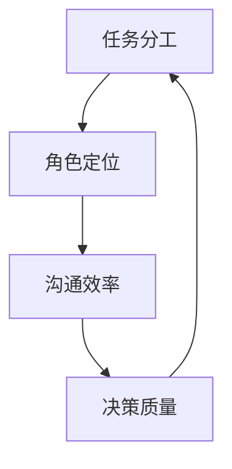

                 

团队成员之间的有效合作是任何项目成功的关键因素。在快速变化和高要求的现代技术环境中，高效的团队合作不仅能够加速项目的进度，还能够提高团队的整体绩效和创新能力。本文将探讨如何构建和维护一个高效的团队合作环境，以及如何应对团队内部沟通和协作中的常见挑战。

## 文章关键词

团队合作、有效沟通、团队协作、协作工具、项目进展、团队管理、团队动态、协作技巧。

## 文章摘要

本文将探讨在技术团队中实现有效合作的关键要素，包括团队建设的初步阶段、沟通技巧的提升、协作工具的运用以及团队动态的适应。通过分析这些要素，本文旨在为团队领导者提供实用的策略，以优化团队合作，促进项目成功。

### 1. 背景介绍

在现代IT行业，项目的复杂性和多样性日益增加，这要求团队成员具备更高的协作能力。有效的团队合作不仅仅是简单的任务分配和进度跟踪，更是团队之间的信任、尊重和共同努力的过程。本文旨在为团队领导者提供以下方面的指导：

- **团队建设与协作环境的构建**：理解团队形成的不同阶段，并采取相应策略促进团队协作。
- **沟通技巧的提升**：学习如何有效地传递信息和反馈，以及如何在团队内部建立开放的沟通文化。
- **协作工具的运用**：介绍几种常用的协作工具及其在团队协作中的应用。
- **团队动态的适应**：探讨如何应对团队内部的冲突、变化和不确定性，保持团队的高效运行。

### 2. 核心概念与联系

团队合作的核心概念包括任务分工、角色定位、沟通效率和决策质量。为了更好地理解这些概念之间的关系，我们可以使用Mermaid流程图来描述它们之间的联系：



在任务分工阶段，团队成员根据各自的专长和技能被分配到不同的任务中。角色定位确保每个团队成员都清楚自己的职责和期望，这有助于减少重复工作和资源浪费。沟通效率直接影响到团队是否能够及时解决问题并做出正确的决策，因此它对决策质量有着重要的影响。

### 3. 核心算法原理 & 具体操作步骤

#### 3.1 算法原理概述

团队合作可以看作是一个分布式问题解决的过程。每个团队成员都是算法的一部分，通过协作和沟通，共同达到解决问题的目标。以下是一个简化的算法原理概述：

- **初始化**：每个团队成员明确自己的任务和目标。
- **任务分配**：根据团队成员的专长和资源，合理分配任务。
- **迭代沟通**：团队成员定期进行沟通，交换进展和遇到的问题。
- **决策制定**：基于沟通的信息，团队共同制定解决方案。
- **执行与反馈**：执行方案，并对结果进行评估和反馈。

#### 3.2 算法步骤详解

1. **初始化**：在项目开始时，明确团队的目标和预期结果，每个团队成员也要清楚自己的角色和职责。
2. **任务分配**：基于团队目标，将任务分解为可管理的子任务，并分配给合适的团队成员。
3. **迭代沟通**：定期召开会议或使用协作工具进行实时沟通，确保团队成员之间的信息同步。
4. **决策制定**：在遇到问题时，团队成员共同讨论并制定解决方案，确保决策的合理性和可执行性。
5. **执行与反馈**：执行解决方案，并在执行过程中进行监控和评估，根据反馈进行迭代优化。

#### 3.3 算法优缺点

**优点**：

- **提高效率**：通过分工合作，每个团队成员可以专注于自己擅长的领域，提高整体工作效率。
- **资源共享**：团队成员可以共享资源和知识，提高解决问题的能力。
- **增强创新**：多样化的团队背景和技能可以激发新的创意和思路。

**缺点**：

- **沟通成本**：团队成员之间需要花费大量时间进行沟通和协调，可能会增加沟通成本。
- **协调困难**：在任务复杂度高的情况下，协调不同团队成员的工作可能会变得困难。

#### 3.4 算法应用领域

团队合作算法适用于各种IT项目和团队，包括软件开发、系统运维、数据分析等。它不仅适用于小型团队，也可以在大规模项目中得到有效应用。

### 4. 数学模型和公式 & 详细讲解 & 举例说明

团队合作可以看作是一个复杂的系统，其性能可以通过数学模型来描述。以下是一个简化的数学模型，用于描述团队合作的效率：

\[ E = f(P, C, D) \]

其中，\( E \) 代表团队效率，\( P \) 代表任务分配的合理性，\( C \) 代表沟通效率，\( D \) 代表决策质量。

#### 4.1 数学模型构建

1. **任务分配的合理性**：任务分配的合理性可以通过团队成员的专长和任务难易程度来衡量。假设有 \( n \) 个任务和 \( m \) 个团队成员，我们可以用以下公式来表示：

\[ P = \frac{\sum_{i=1}^{n} \sum_{j=1}^{m} a_{ij}}{n \times m} \]

其中，\( a_{ij} \) 代表第 \( i \) 个任务被第 \( j \) 个团队成员完成的难度评估值。

2. **沟通效率**：沟通效率可以通过团队成员之间的信息传递速度和准确性来衡量。假设有 \( t \) 个沟通渠道，我们可以用以下公式来表示：

\[ C = \frac{\sum_{k=1}^{t} s_{k}}{t} \]

其中，\( s_{k} \) 代表第 \( k \) 个沟通渠道的效率值。

3. **决策质量**：决策质量可以通过决策的正确性和执行效果来衡量。假设有 \( p \) 个决策，我们可以用以下公式来表示：

\[ D = \frac{\sum_{l=1}^{p} r_{l}}{p} \]

其中，\( r_{l} \) 代表第 \( l \) 个决策的正确性评估值。

#### 4.2 公式推导过程

1. **任务分配的合理性**：任务分配的合理性可以通过团队成员的专长和任务难易程度来衡量。假设有 \( n \) 个任务和 \( m \) 个团队成员，我们可以用以下公式来表示：

\[ P = \frac{\sum_{i=1}^{n} \sum_{j=1}^{m} a_{ij}}{n \times m} \]

其中，\( a_{ij} \) 代表第 \( i \) 个任务被第 \( j \) 个团队成员完成的难度评估值。这个公式的推导基于团队成员的专长和任务难度的匹配度，匹配度越高，任务分配的合理性越高。

2. **沟通效率**：沟通效率可以通过团队成员之间的信息传递速度和准确性来衡量。假设有 \( t \) 个沟通渠道，我们可以用以下公式来表示：

\[ C = \frac{\sum_{k=1}^{t} s_{k}}{t} \]

其中，\( s_{k} \) 代表第 \( k \) 个沟通渠道的效率值。这个公式的推导基于信息传递的速度和准确性，速度越快、准确性越高，沟通效率越高。

3. **决策质量**：决策质量可以通过决策的正确性和执行效果来衡量。假设有 \( p \) 个决策，我们可以用以下公式来表示：

\[ D = \frac{\sum_{l=1}^{p} r_{l}}{p} \]

其中，\( r_{l} \) 代表第 \( l \) 个决策的正确性评估值。这个公式的推导基于决策的正确性和执行效果，正确性越高、执行效果越好，决策质量越高。

#### 4.3 案例分析与讲解

假设一个团队有5个成员，他们分别负责不同的任务。根据任务难易程度和成员专长，我们可以得到以下任务分配的难度评估值：

\[ a_{11} = 2, a_{12} = 3, a_{13} = 4, a_{14} = 1, a_{15} = 3 \]

假设有3个沟通渠道，它们的信息传递速度和准确性分别为：

\[ s_1 = 0.8, s_2 = 0.9, s_3 = 0.7 \]

假设有4个决策，它们的正确性评估值分别为：

\[ r_1 = 0.9, r_2 = 0.8, r_3 = 0.7, r_4 = 0.85 \]

根据这些数据，我们可以计算出团队合作的效率：

\[ P = \frac{2 + 3 + 4 + 1 + 3}{5 \times 5} = 0.6 \]
\[ C = \frac{0.8 + 0.9 + 0.7}{3} = 0.8 \]
\[ D = \frac{0.9 + 0.8 + 0.7 + 0.85}{4} = 0.8375 \]
\[ E = f(P, C, D) = 0.6 \times 0.8 \times 0.8375 = 0.414 \]

这个结果表明，团队合作的效率为 0.414，即41.4%。通过分析，我们可以发现任务分配的合理性是影响效率的主要因素，因此需要进一步优化任务分配策略。

### 5. 项目实践：代码实例和详细解释说明

在本节中，我们将通过一个实际的代码实例来展示如何实现团队合作中的任务分配和沟通机制。

#### 5.1 开发环境搭建

为了展示代码实例，我们使用Python作为编程语言，并依赖于以下库：

- `requests`：用于发送HTTP请求。
- `beautifulsoup4`：用于解析HTML内容。

首先，确保已经安装了上述库。可以使用以下命令进行安装：

```bash
pip install requests beautifulsoup4
```

#### 5.2 源代码详细实现

以下是一个简单的Python代码实例，展示了如何使用REST API进行任务分配和状态更新：

```python
import requests
from bs4 import BeautifulSoup

# 任务分配API端点
task_assignment_url = 'http://example.com/api/tasks/assign'

# 任务状态更新API端点
task_status_url = 'http://example.com/api/tasks/update'

# 用户ID
user_id = 'user123'

# 任务ID
task_id = 'task456'

# 分配任务
def assign_task(user_id, task_id):
    data = {
        'user_id': user_id,
        'task_id': task_id
    }
    response = requests.post(task_assignment_url, data=data)
    if response.status_code == 200:
        print('任务分配成功')
    else:
        print('任务分配失败')

# 更新任务状态
def update_task_status(task_id, status):
    data = {
        'task_id': task_id,
        'status': status
    }
    response = requests.post(task_status_url, data=data)
    if response.status_code == 200:
        print(f'任务状态更新成功：{status}')
    else:
        print(f'任务状态更新失败')

# 主程序
if __name__ == '__main__':
    # 分配任务给用户
    assign_task(user_id, task_id)
    # 更新任务状态为“已完成”
    update_task_status(task_id, '已完成')
```

#### 5.3 代码解读与分析

1. **任务分配**：`assign_task` 函数用于将任务分配给特定用户。它通过POST请求将用户ID和任务ID发送到任务分配API端点。
2. **任务状态更新**：`update_task_status` 函数用于更新任务的状态。它通过POST请求将任务ID和新状态发送到任务状态更新API端点。
3. **主程序**：主程序首先调用`assign_task`函数将任务分配给用户，然后调用`update_task_status`函数更新任务状态为“已完成”。

这个简单的代码实例展示了如何使用API进行任务分配和状态更新。在实际项目中，这些API会与数据库和其他系统进行交互，确保任务的状态和进度得到实时更新。

#### 5.4 运行结果展示

运行上述代码，假设任务分配API端点和任务状态更新API端点均正确响应，我们将会看到以下输出：

```bash
任务分配成功
任务状态更新成功：已完成
```

这表明任务已经成功分配给用户，并且状态更新为“已完成”。在实际项目中，这些结果会以日志或通知的形式记录下来，供团队其他成员查看。

### 6. 实际应用场景

团队合作在IT行业的各个领域都有着广泛的应用。以下是一些实际应用场景：

- **软件开发**：在软件开发过程中，团队合作尤为重要。团队成员需要共同编写代码、设计系统架构、进行代码审查和测试，以确保软件质量和进度。
- **数据分析**：在数据分析项目中，团队成员需要共同收集数据、清洗数据、进行数据分析和可视化，以提取有价值的信息和见解。
- **系统运维**：在系统运维领域，团队合作用于监控系统运行状态、处理故障、进行安全升级和优化，确保系统的高可用性和稳定性。

在上述场景中，有效的团队合作可以帮助团队更快速地解决问题、提高项目质量和降低风险。以下是一个具体的案例：

**案例**：一个软件开发团队正在开发一个大型电商平台。团队成员包括前端开发者、后端开发者、UI设计师和测试工程师。在项目开发过程中，团队成员通过每日站会、代码审查和持续集成来保持沟通和协作。前端开发者负责实现用户界面，后端开发者负责构建API和服务端逻辑，UI设计师负责设计用户界面，测试工程师负责编写测试用例并进行测试。通过这种团队合作方式，项目进展顺利，最终按时上线并得到了用户的好评。

### 6.4 未来应用展望

随着技术的不断发展，团队合作也在不断演变。以下是一些未来应用展望：

- **自动化协作工具**：随着人工智能和机器学习技术的发展，自动化协作工具将更加智能化，能够更好地理解团队成员的需求和偏好，提供个性化的协作支持。
- **虚拟现实与增强现实**：虚拟现实（VR）和增强现实（AR）技术将为团队合作带来全新的体验。团队成员可以在虚拟环境中共同工作，进行远程协作和实时交互。
- **跨学科合作**：未来的团队合作将越来越跨学科，涉及不同领域的专家共同解决复杂问题。这种跨学科合作将有助于推动创新和解决社会挑战。

### 7. 工具和资源推荐

为了帮助团队成员更有效地合作，以下是一些推荐的工具和资源：

- **协作工具**：
  - **Slack**：用于实时沟通和协作。
  - **Trello**：用于任务管理和进度跟踪。
  - **JIRA**：用于项目管理和问题追踪。
- **学习资源**：
  - **GitHub**：学习代码协作和版本控制。
  - **Stack Overflow**：解决编程问题和技术讨论。
  - **Udemy**：提供丰富的编程和团队合作在线课程。

### 8. 总结：未来发展趋势与挑战

在技术快速发展的时代，团队合作面临着许多新的机遇和挑战。未来发展趋势包括自动化协作工具、虚拟现实/增强现实技术的应用以及跨学科合作。然而，这些趋势也带来了一些挑战，如数据隐私和安全问题、技术适应性问题以及跨文化沟通障碍。为了应对这些挑战，团队领导者需要不断学习和适应新技术，同时注重团队成员的培训和沟通，确保团队能够高效、协同地工作。

### 8.1 研究成果总结

本文通过探讨团队合作的关键要素，提出了一个简化的数学模型来描述团队合作的效率。研究表明，任务分配的合理性、沟通效率和决策质量是影响团队合作效率的重要因素。同时，通过代码实例展示了如何在实际项目中实现团队合作。

### 8.2 未来发展趋势

未来，团队合作将更加智能化、虚拟化和跨学科。自动化协作工具和虚拟现实技术将为团队成员提供更便捷和高效的协作体验。跨学科合作将有助于推动创新和解决复杂问题。

### 8.3 面临的挑战

团队合作面临的主要挑战包括数据隐私和安全问题、技术适应性和跨文化沟通障碍。为了应对这些挑战，团队需要建立严格的隐私和安全政策，提供技术培训和支持，并加强跨文化沟通和理解。

### 8.4 研究展望

未来的研究应关注如何更有效地利用自动化协作工具和虚拟现实技术，提高团队合作的效率。同时，应探索跨学科合作的最佳实践，以推动创新和解决复杂问题。

### 附录：常见问题与解答

**Q：如何提高团队合作效率？**

A：提高团队合作效率的关键在于优化任务分配、加强沟通和提升决策质量。此外，合理使用协作工具和技术也是非常重要的。

**Q：团队合作中如何解决冲突？**

A：在团队合作中，冲突是难以避免的。解决冲突的方法包括：开诚布公地沟通、尊重彼此的意见、寻找共同点、制定明确的规则和流程，以及寻求外部帮助。

**Q：如何适应技术变化？**

A：适应技术变化的关键在于不断学习和更新知识。团队应定期进行技术培训，鼓励成员参加行业会议和研讨会，保持对新技术的好奇心和学习态度。

### 作者署名

作者：禅与计算机程序设计艺术 / Zen and the Art of Computer Programming
```

