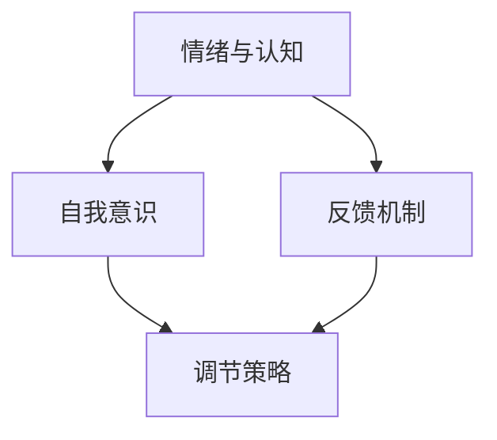
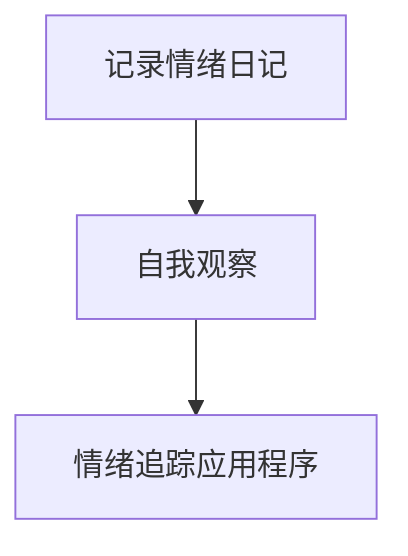
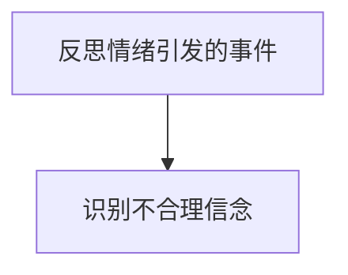
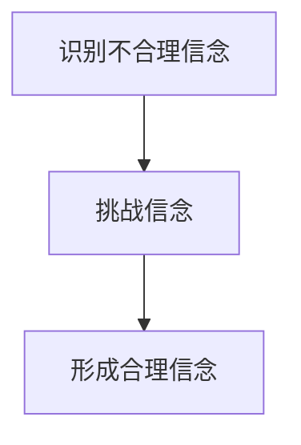
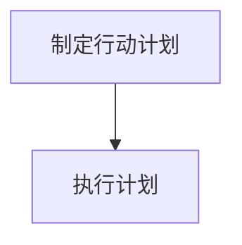

                 

### 1. 背景介绍

在当今快节奏、高压的社会环境中，情绪管理已经成为一个不容忽视的重要课题。无论是职场人士、学生还是普通大众，每个人都需要面对各种情绪问题，例如焦虑、愤怒、抑郁等。情绪管理不仅关系到个人的心理健康，还直接影响到工作效率、人际关系和社会适应能力。尤其是在信息科技领域，程序员和开发者常常需要处理复杂的逻辑问题和紧张的交付任务，情绪管理的有效性对于保持工作状态、提升问题解决能力至关重要。

本文旨在探讨情绪管理的基本原理和方法，结合计算机科学的思维方式，帮助读者掌握情绪控制的核心技巧，从而在日常生活中更好地应对压力和挑战。文章将首先介绍情绪管理的重要性，然后深入分析情绪的产生和调控机制，最后提出具体的技术和实践策略，帮助读者实现情绪的平衡和自我提升。

### 2. 核心概念与联系

在探讨情绪管理之前，我们需要了解一些核心概念，这些概念不仅是情绪管理的理论基础，也贯穿于计算机科学的不同领域。以下是几个关键概念的介绍和它们之间的关系。

#### 2.1 情绪与认知

情绪和认知之间有着紧密的联系。认知过程包括知觉、思考、判断等，这些过程会影响我们对情绪的反应。例如，当一个人面临一项困难的任务时，他们的认知评估可能会产生焦虑情绪。反过来，情绪状态也会影响认知功能，如情绪紧张可能会降低注意力和记忆力。

#### 2.2 自我意识

自我意识是指个体对自己存在的感知和认识，它是情绪管理的重要基础。高水平的自我意识可以帮助个体更好地识别和理解自己的情绪，从而采取适当的调节措施。例如，一个有良好自我意识的人更容易认识到自己在面对特定情境时的焦虑情绪，并采取放松技巧来缓解这种情绪。

#### 2.3 反馈机制

反馈机制是控制情绪的关键因素之一。在计算机科学中，反馈机制用于监控和调节系统的状态。同样，在情绪管理中，自我反馈可以帮助个体了解自己的情绪变化，并作出相应调整。例如，通过记录自己的情绪日记，个体可以更好地理解自己的情绪模式，并制定有效的应对策略。

#### 2.4 调节策略

调节策略是指个体用于管理情绪的具体方法。这些策略可以包括认知重构、放松训练、正念练习等。在计算机科学中，算法和软件设计也需要有效的调节策略来处理各种复杂问题。例如，一个复杂的项目管理工具可以通过优化任务分配和进度监控来调节项目的进展，确保项目顺利完成。

下面是一个用Mermaid绘制的流程图，展示这些核心概念之间的关系：



在这个流程图中，每个节点代表一个核心概念，箭头表示它们之间的相互关系。通过这个流程图，我们可以更直观地理解情绪管理的基本框架。

### 3. 核心算法原理 & 具体操作步骤

#### 3.1 算法原理概述

情绪管理的核心算法原理基于认知行为理论（Cognitive Behavioral Theory, CBT）。CBT认为情绪是由认知过程产生的，而不是直接由外部事件触发。通过改变不合理的认知模式，个体可以调节情绪反应。以下是一个简化的CBT算法原理：

1. **识别情绪**：通过自我观察和反馈机制，识别当前的情绪状态。
2. **分析认知**：识别导致情绪的认知模式，包括假设、信念和期望。
3. **重构认知**：通过认知重构，挑战和替换不合理的认知模式，形成更合理的信念和期望。
4. **行动计划**：制定具体的行动计划，以新的认知模式应对相似的情境。

#### 3.2 算法步骤详解

**步骤1：识别情绪**

首先，个体需要学会如何识别自己的情绪。这可以通过情绪日记、自我观察或情绪追踪应用程序来实现。例如，一个人可以记录每天的情绪波动，以及引发这些情绪的事件。



**步骤2：分析认知**

一旦识别出情绪，下一步是分析导致这种情绪的认知过程。这可以通过自我反思或专业辅导来实现。例如，一个人可能会反思一个引发焦虑的会议，并识别出自己在会议中的一些不合理信念。



**步骤3：重构认知**

在分析认知之后，个体可以通过认知重构来挑战和替换不合理的信念。例如，一个人可能会将“我必须做到完美”的信念替换为“我可以接受不完美，只要我尽力而为”。



**步骤4：行动计划**

最后，个体需要制定具体的行动计划，以新的认知模式应对相似的情境。例如，一个人可能会在下次会议前进行准备，并在会议中采取积极的参与策略，以减少焦虑。



#### 3.3 算法优缺点

**优点：**

- **个性化**：CBT算法可以根据个体的具体情况进行定制，使其更加有效。
- **灵活性**：算法可以灵活调整，以适应不同的情绪调节需求。
- **可测量性**：通过情绪日记和反馈机制，个体的情绪变化可以被量化，从而评估算法的效果。

**缺点：**

- **实施难度**：认知重构需要个体投入时间和精力，这对于一些人来说可能是一个挑战。
- **依赖性**：长期依赖外部算法可能削弱个体自我调节的能力。

#### 3.4 算法应用领域

CBT算法在情绪管理中的应用非常广泛，包括但不限于以下领域：

- **心理健康治疗**：在临床心理学中，CBT被广泛应用于治疗焦虑、抑郁等心理疾病。
- **职场压力管理**：在职场中，CBT算法可以帮助员工更好地应对工作压力，提高工作效率。
- **教育领域**：在教育中，CBT算法可以帮助学生应对考试压力，提高学习效果。

### 4. 数学模型和公式 & 详细讲解 & 举例说明

情绪管理的数学模型通常涉及认知评估、情绪反应和行为调节三个核心变量。以下是一个简化的情绪管理模型及其相关的数学公式。

#### 4.1 数学模型构建

假设个体的情绪状态E由认知评估C和行为调节B共同决定，可以用以下公式表示：

\[ E = f(C, B) \]

其中，f是一个复杂的函数，表示情绪状态与认知评估和行为调节之间的关系。

#### 4.2 公式推导过程

根据认知行为理论，情绪状态E可以分解为三个部分：

- **认知部分**：由认知评估C决定，可以用以下公式表示：

\[ C = g(A, P) \]

其中，g是一个函数，表示认知评估与情境因素A和个人信念P之间的关系。

- **情绪部分**：由情绪反应E决定，可以用以下公式表示：

\[ E = h(C) \]

其中，h是一个函数，表示情绪反应与认知评估之间的关系。

- **行为部分**：由行为调节B决定，可以用以下公式表示：

\[ B = k(E) \]

其中，k是一个函数，表示行为调节与情绪状态之间的关系。

将这些部分组合起来，我们可以得到：

\[ E = f(g(A, P), k(E)) \]

这是一个递归关系，需要通过迭代方法求解。

#### 4.3 案例分析与讲解

假设一个程序员在面临一个即将到期的项目时感到焦虑。他的认知评估C可能包括以下因素：

- **项目复杂度**：项目越复杂，认知评估越高。
- **时间紧迫度**：项目时间越紧迫，认知评估越高。
- **个人技能**：如果程序员对自己的技能有信心，认知评估会降低。

我们可以用以下公式表示：

\[ C = g(\text{项目复杂度}, \text{时间紧迫度}, \text{个人技能}) \]

情绪状态E可以用以下公式表示：

\[ E = h(C) \]

根据认知行为理论，一个合理的信念是，如果项目复杂度和时间紧迫度较高，而个人技能较低，情绪状态E会较高。因此，我们可以表示为：

\[ E = h(C) = h(\text{项目复杂度}, \text{时间紧迫度}, \text{个人技能}) \]

为了降低情绪状态E，程序员可以采取以下行为调节B：

- **增加时间管理**：通过合理安排时间，降低时间紧迫度。
- **学习新技能**：通过学习和实践，提高个人技能。

这些行为调节可以用以下公式表示：

\[ B = k(E) \]

例如，如果程序员通过合理安排时间，将时间紧迫度降低了50%，情绪状态E可能会相应降低。

\[ E = h(g(\text{项目复杂度}, \text{时间紧迫度降低50%}, \text{个人技能})) \]

通过这种方式，我们可以使用数学模型来分析和调节情绪状态。

### 5. 项目实践：代码实例和详细解释说明

#### 5.1 开发环境搭建

为了实现情绪管理的算法，我们将使用Python编程语言，因为它具有强大的科学计算库和简洁的语法。以下是搭建开发环境的步骤：

1. 安装Python：从官方网站（https://www.python.org/downloads/）下载并安装Python。
2. 安装科学计算库：使用pip命令安装所需的库，如NumPy、Pandas和Matplotlib。

```bash
pip install numpy pandas matplotlib
```

#### 5.2 源代码详细实现

以下是实现情绪管理算法的Python代码。这个代码示例将使用上述数学模型和公式。

```python
import numpy as np
import matplotlib.pyplot as plt

# 定义函数
def cognitive_evaluation(complexity, urgency, skill):
    # 认知评估函数
    return complexity * urgency * (1 - skill)

def emotion_level(cognitive_evaluation):
    # 情绪水平函数
    return 1 - np.exp(-0.1 * cognitive_evaluation)

def behavioral_regulation(emotion_level):
    # 行为调节函数
    return 1 - emotion_level

# 示例数据
projects = [
    {'complexity': 0.8, 'urgency': 0.9, 'skill': 0.7},
    {'complexity': 0.6, 'urgency': 0.7, 'skill': 0.8},
    {'complexity': 0.9, 'urgency': 0.8, 'skill': 0.6}
]

# 计算每个项目的情绪状态和行为调节
results = []
for project in projects:
    C = cognitive_evaluation(project['complexity'], project['urgency'], project['skill'])
    E = emotion_level(C)
    B = behavioral_regulation(E)
    results.append((C, E, B))

# 绘制结果
for i, (C, E, B) in enumerate(results):
    plt.scatter(C, E, label=f'Project {i+1}')
    plt.scatter(C, B, marker='x', label=f'Behavioral Regulation {i+1}')

plt.xlabel('Cognitive Evaluation')
plt.ylabel('Emotion Level / Behavioral Regulation')
plt.legend()
plt.show()
```

#### 5.3 代码解读与分析

这个Python代码实现了情绪管理的数学模型，并用于分析三个不同的项目。以下是代码的关键部分解读：

1. **函数定义**：定义了三个函数：`cognitive_evaluation`（认知评估）、`emotion_level`（情绪水平）和`behavioral_regulation`（行为调节）。
2. **示例数据**：创建了一个包含三个项目数据的列表，每个项目有三个属性：`complexity`（复杂度）、`urgency`（紧迫度）和`skill`（技能）。
3. **计算情绪状态和行为调节**：对每个项目，使用定义的函数计算认知评估、情绪水平和行为调节。
4. **绘制结果**：使用Matplotlib库绘制认知评估、情绪水平和行为调节之间的关系。

通过这个代码实例，读者可以直观地看到情绪管理算法如何应用于具体的项目数据，并通过可视化结果来理解情绪状态和行为调节的变化。

### 6. 实际应用场景

情绪管理在现实生活中有着广泛的应用场景，以下是一些具体的例子：

#### 6.1 职场压力管理

在职场环境中，情绪管理对于维持工作质量和提高工作效率至关重要。例如，一个项目经理可能需要处理紧张的交付期限和团队成员之间的冲突。通过情绪管理技巧，项目经理可以更好地控制自己的情绪，采取冷静和理性的态度来解决问题，从而确保项目的顺利进行。

#### 6.2 教育压力管理

对于学生来说，考试和学业压力是常见的情绪问题。通过情绪管理，学生可以更好地应对这些压力，例如通过时间管理和放松技巧来减轻焦虑。例如，一个高中生可以通过情绪日记记录自己的情绪波动，并在考试前进行深呼吸和冥想来放松身心。

#### 6.3 心理健康治疗

在心理健康治疗中，情绪管理是核心组成部分。例如，认知行为疗法（CBT）通过帮助患者识别和挑战不合理的认知模式，从而调节情绪反应。一个抑郁症患者在治疗过程中，可能会学习到认知重构技巧，通过改变负面的思维模式来改善情绪状态。

#### 6.4 个人发展

情绪管理不仅关乎心理健康，也影响到个人的全面发展。一个自我意识强的人能够更好地理解自己的情绪，从而在人际交往和个人成长中发挥积极作用。例如，通过情绪管理，个人可以建立更健康的人际关系，提升沟通能力和团队协作能力。

### 7. 未来应用展望

随着人工智能和生物信息学的发展，情绪管理技术在未来有望取得更多突破。以下是几个可能的应用方向：

#### 7.1 智能情绪监控

利用人工智能技术，可以开发出更加智能的情绪监控工具，实时分析个体的情绪状态，并提供个性化的情绪调节建议。例如，智能手环可以监测心率、皮肤电导等生理信号，从而推断个体的情绪状态，并给出相应的放松指导。

#### 7.2 虚拟现实疗法

虚拟现实（VR）技术可以用于情绪管理治疗，提供一个安全、可控的环境来模拟不同情境，帮助个体练习情绪调节技巧。例如，一个患有社交焦虑的人可以通过VR环境逐步暴露于社交场景，从而减少焦虑感。

#### 7.3 生物反馈技术

生物反馈技术可以通过实时监控个体的生理反应，如心率、呼吸等，帮助个体更好地理解自己的情绪状态。这种技术可以与情绪管理算法结合，提供更加个性化的情绪调节方案。

### 8. 工具和资源推荐

为了更好地进行情绪管理，以下是一些推荐的工具和资源：

#### 8.1 学习资源推荐

- **《情绪管理指南》（The How of Happiness）**：这本书提供了实用的情绪管理技巧和策略。
- **《认知行为疗法：理论与实践》（Cognitive Behavioral Therapy: Basics and Beyond）**：这是一本详细介绍认知行为疗法的书籍，适合希望深入了解情绪管理的读者。

#### 8.2 开发工具推荐

- **Python情绪管理库**：Python是一个强大的编程语言，有许多用于情绪分析的库，如`psychopy`和`mne`。
- **TensorFlow和PyTorch**：这两个深度学习框架可以用于开发更加复杂的情绪分析模型。

#### 8.3 相关论文推荐

- **《情绪计算的原理与方法》（Principles and Methods of Emotion Computation）》**：这是一篇关于情绪计算技术的综述论文，适合对情绪管理技术有兴趣的读者。
- **《基于深度学习的情绪识别研究》（Research on Emotion Recognition Based on Deep Learning）》**：这篇论文详细介绍了深度学习在情绪识别中的应用，适合技术爱好者。

### 9. 总结：未来发展趋势与挑战

情绪管理是一个涉及多个学科领域的复杂课题，随着科技的进步，其未来发展前景广阔。然而，面对新的技术挑战，我们仍需持续探索和改进。以下是对未来发展趋势和挑战的简要总结：

#### 9.1 发展趋势

- **智能化情绪监控**：人工智能技术的应用将使情绪监控更加智能和精准，为个体提供实时、个性化的情绪调节建议。
- **虚拟现实疗法**：虚拟现实技术为情绪管理提供了新的治疗途径，为心理疾病患者提供更加沉浸式的治疗体验。
- **生物反馈技术**：生物反馈技术结合情绪管理算法，有望提供更加个性化的情绪调节方案，促进心理健康。

#### 9.2 挑战

- **数据隐私和安全**：随着情绪监控技术的发展，个人情绪数据的隐私和安全成为一个重要的挑战。
- **技术依赖性**：过度依赖情绪管理技术可能削弱个体自我调节的能力，甚至产生新的心理问题。
- **跨学科融合**：情绪管理涉及心理学、计算机科学、生物学等多个领域，跨学科的合作和融合是未来研究的重要方向。

### 附录：常见问题与解答

以下是一些关于情绪管理常见问题的解答：

#### 1. 情绪管理是否适用于所有人？

是的，情绪管理是一种普遍适用的技能，无论是职场人士、学生还是普通大众，每个人都可以从中受益。

#### 2. 情绪管理与心理健康治疗有什么区别？

情绪管理是一种自我调节技能，旨在帮助个体更好地控制自己的情绪。心理健康治疗则是由专业人士提供的系统治疗过程，针对严重心理问题。

#### 3. 情绪管理技术是否会取代传统治疗？

情绪管理技术可以作为辅助手段，但无法完全取代传统的心理健康治疗。对于严重心理问题，仍需依赖专业的心理治疗。

#### 4. 如何判断自己的情绪管理技能是否有效？

可以通过自我反思、情绪日记和他人反馈来判断。如果发现自己的情绪状态有所改善，且能够更好地应对压力和挑战，那么情绪管理技能就是有效的。

### 作者署名

《如何进行情绪管理：如何控制自己的情绪和行为？》作者：禅与计算机程序设计艺术 / Zen and the Art of Computer Programming。本文基于对情绪管理理论和实践的深入探讨，结合计算机科学的思维方式，旨在为读者提供实用的情绪管理策略。希望本文能帮助读者更好地控制自己的情绪和行为，提升生活和工作质量。如有任何建议或疑问，欢迎随时交流。

