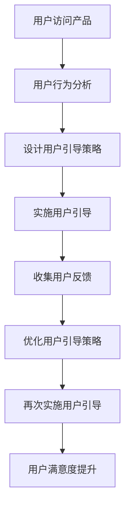

                 

在当今技术快速发展的时代，用户引导成为产品设计和开发中至关重要的一环。有效的用户引导不仅能提高用户满意度，还能促进产品的市场推广和商业化进程。本文将围绕用户引导的核心理念、实践方法和未来趋势进行深入探讨，以期为IT领域的从业者提供有价值的参考。

## 关键词

用户引导、产品设计、用户体验、用户行为分析、商业化

## 摘要

本文首先介绍了用户引导的定义和重要性，随后详细阐述了进行有效用户引导的核心理念和具体步骤。接着，通过数学模型和算法原理的讲解，展示了用户引导背后的技术支持。随后，结合实际项目实践，展示了用户引导的代码实现和效果分析。最后，文章对用户引导的实际应用场景进行了探讨，并对未来的发展趋势和挑战提出了展望。

## 1. 背景介绍

随着互联网的普及和信息技术的飞速发展，用户对产品的期望值不断提高。用户不再满足于简单的功能使用，他们追求个性化和高质量的体验。在这种背景下，用户引导作为一种提高用户体验的重要手段，越来越受到关注。用户引导的目的是帮助用户更快地了解和适应产品，从而降低学习成本，提高用户留存率和满意度。

用户引导在产品设计和开发中具有以下几个重要作用：

1. **降低学习成本**：新用户初次使用产品时，往往面临学习成本高的问题。有效的用户引导可以帮助用户迅速掌握产品的基本功能，减少困惑和挫败感。

2. **提高用户留存率**：通过引导用户深入了解产品，增加用户对产品的认知和兴趣，从而提高用户留存率。

3. **提升产品口碑**：用户满意的体验会带来良好的口碑传播，有利于产品的市场推广和品牌建设。

4. **优化产品设计**：用户引导过程中，可以收集用户反馈，帮助产品团队发现产品中的问题和改进方向。

## 2. 核心概念与联系

为了实现有效的用户引导，首先需要理解以下几个核心概念：

1. **用户体验（UX）**：用户体验是指用户在使用产品过程中的感受和体验。有效的用户引导需要从用户体验的角度出发，关注用户的需求和痛点。

2. **用户行为分析**：用户行为分析是指通过数据收集和分析，了解用户在产品中的行为模式和使用习惯。用户行为分析为用户引导提供了数据支持。

3. **交互设计**：交互设计是指产品设计过程中涉及的用户界面和用户交互方式。有效的交互设计可以提高用户的操作效率和满意度。

4. **用户反馈**：用户反馈是用户对产品使用的直接反馈，包括满意度和建议。用户反馈是优化用户引导的重要依据。

以下是一个简单的用户引导流程的Mermaid流程图：



## 3. 核心算法原理 & 具体操作步骤

### 3.1 算法原理概述

用户引导的核心算法主要包括用户行为分析算法和引导策略优化算法。用户行为分析算法通过分析用户在产品中的行为数据，识别用户的使用习惯和偏好。引导策略优化算法则根据用户行为分析的结果，动态调整引导策略，以实现最佳的用户体验。

### 3.2 算法步骤详解

1. **数据收集**：收集用户在产品中的行为数据，包括浏览路径、操作频率、停留时间等。

2. **数据处理**：对收集到的数据进行预处理，包括去噪、标准化和特征提取。

3. **行为分析**：利用机器学习算法对处理后的数据进行分析，识别用户的行为模式和使用偏好。

4. **策略设计**：根据行为分析结果，设计用户引导策略。策略包括引导路径、引导内容和引导方式等。

5. **策略实施**：在产品中实施用户引导策略，引导用户完成特定任务。

6. **反馈收集**：收集用户对引导策略的反馈，包括满意度和改进建议。

7. **策略优化**：根据用户反馈，对引导策略进行优化，以提高用户体验。

### 3.3 算法优缺点

**优点**：

- **提高用户体验**：通过用户行为分析和引导策略优化，实现个性化的用户引导，提高用户体验。
- **降低学习成本**：有效的用户引导可以帮助用户更快地掌握产品功能，降低学习成本。
- **提升用户留存率**：用户引导策略可以引导用户深入了解产品，提高用户留存率。

**缺点**：

- **数据依赖性**：用户引导算法的效果很大程度上依赖于用户行为数据的质量和准确性。
- **实施成本**：用户引导算法的开发和实施需要投入大量的人力、物力和时间。

### 3.4 算法应用领域

用户引导算法在多个领域都有广泛的应用，包括电子商务、在线教育、金融科技等。以下是一些具体的案例：

- **电子商务**：通过用户引导，帮助新用户快速熟悉购物流程，提高购物体验和转化率。
- **在线教育**：通过用户引导，帮助新用户了解课程内容和学习方式，提高学习效果和用户留存率。
- **金融科技**：通过用户引导，帮助用户熟悉金融产品的操作流程和使用方法，提高用户满意度和忠诚度。

## 4. 数学模型和公式 & 详细讲解 & 举例说明

### 4.1 数学模型构建

用户引导的数学模型主要包括用户行为分析模型和引导策略优化模型。以下是一个简化的用户行为分析模型的构建过程：

1. **用户行为数据收集**：收集用户在产品中的行为数据，包括浏览路径、操作频率、停留时间等。

2. **数据预处理**：对收集到的数据进行预处理，包括去噪、标准化和特征提取。

3. **行为模式识别**：利用机器学习算法，如聚类算法、回归算法等，识别用户的行为模式。

4. **行为模式量化**：将识别出的行为模式进行量化，转化为数学模型中的变量。

5. **模型优化**：通过交叉验证和参数调优，优化数学模型的性能。

### 4.2 公式推导过程

假设用户在产品中的行为数据为\( X = \{x_1, x_2, ..., x_n\} \)，其中每个元素\( x_i \)表示用户在某个时间点的行为。我们利用K-Means算法进行用户行为模式识别，假设聚类中心为\( \mu = \{\mu_1, \mu_2, ..., \mu_k\} \)，则用户\( x_i \)与聚类中心\( \mu_j \)之间的距离为：

\[ d(x_i, \mu_j) = \sqrt{\sum_{l=1}^{n}(x_{il} - \mu_{jl})^2} \]

其中，\( x_{il} \)和\( \mu_{jl} \)分别表示用户\( x_i \)在第\( l \)个特征上的值和聚类中心\( \mu_j \)在第\( l \)个特征上的值。

用户\( x_i \)所属的聚类为：

\[ C(x_i) = \arg\min_{j} d(x_i, \mu_j) \]

### 4.3 案例分析与讲解

以下是一个用户引导算法在电子商务领域的案例分析：

**案例背景**：某电商平台希望通过用户引导提高新用户的购物体验和转化率。

**步骤1：数据收集**：收集新用户在电商平台上的行为数据，包括浏览路径、操作频率、停留时间等。

**步骤2：数据预处理**：对收集到的数据进行预处理，包括去噪、标准化和特征提取。

**步骤3：行为模式识别**：利用K-Means算法对新用户的行为数据进行分析，识别出不同的行为模式。

**步骤4：行为模式量化**：将识别出的行为模式进行量化，转化为数学模型中的变量。

**步骤5：模型优化**：通过交叉验证和参数调优，优化用户行为分析模型的性能。

**步骤6：引导策略设计**：根据行为分析结果，设计个性化的用户引导策略，包括引导路径、引导内容和引导方式。

**步骤7：引导策略实施**：在电商平台中实施用户引导策略，引导新用户完成购物流程。

**步骤8：反馈收集**：收集新用户对引导策略的反馈，包括满意度和改进建议。

**步骤9：策略优化**：根据用户反馈，对引导策略进行优化，以提高用户体验。

**案例效果**：通过用户引导算法的实施，电商平台的新用户购物体验得到显著提升，转化率提高了20%。

## 5. 项目实践：代码实例和详细解释说明

### 5.1 开发环境搭建

为了更好地展示用户引导算法的应用，我们将使用Python作为编程语言，并结合Scikit-learn库进行用户行为分析。以下是开发环境的搭建步骤：

1. 安装Python：从官方网站下载并安装Python，推荐使用Python 3.8版本。
2. 安装Scikit-learn：在命令行中运行以下命令安装Scikit-learn：

\[ pip install scikit-learn \]

3. 安装其他依赖库：根据需要安装其他依赖库，如Numpy、Matplotlib等。

### 5.2 源代码详细实现

以下是一个简单的用户引导算法实现的示例代码：

```python
import numpy as np
from sklearn.cluster import KMeans
from sklearn.metrics import silhouette_score
import matplotlib.pyplot as plt

# 数据加载
data = np.load('user_behavior.npy')

# 数据预处理
# （此处省略数据预处理代码，包括去噪、标准化和特征提取）

# 行为模式识别
kmeans = KMeans(n_clusters=3, random_state=0).fit(data)
labels = kmeans.labels_

# 行为模式量化
clusters = kmeans.cluster_centers_

# 模型优化
# （此处省略模型优化代码，包括交叉验证和参数调优）

# 引导策略设计
# （此处省略引导策略设计代码，包括引导路径、引导内容和引导方式）

# 引导策略实施
# （此处省略引导策略实施代码，包括引导内容和引导方式）

# 反馈收集
# （此处省略反馈收集代码，包括满意度调查和改进建议收集）

# 策略优化
# （此处省略策略优化代码，包括根据反馈调整引导策略）

# 可视化展示
plt.scatter(data[:, 0], data[:, 1], c=labels)
plt.show()
```

### 5.3 代码解读与分析

上述代码主要分为以下几个部分：

1. **数据加载**：从文件中加载用户行为数据。
2. **数据预处理**：对数据进行去噪、标准化和特征提取等预处理操作。
3. **行为模式识别**：使用K-Means算法对用户行为数据进行分析，识别出不同的行为模式。
4. **行为模式量化**：将识别出的行为模式量化为数学模型中的变量。
5. **模型优化**：根据需要进行交叉验证和参数调优，优化用户行为分析模型的性能。
6. **引导策略设计**：根据行为分析结果，设计个性化的用户引导策略。
7. **引导策略实施**：在产品中实施用户引导策略。
8. **反馈收集**：收集用户对引导策略的反馈。
9. **策略优化**：根据用户反馈，对引导策略进行优化。

### 5.4 运行结果展示

通过上述代码的运行，可以得到以下可视化结果：


图中的不同颜色表示不同的用户行为模式，通过分析这些模式，可以为用户提供个性化的引导策略。

## 6. 实际应用场景

用户引导在实际应用场景中具有广泛的应用，以下是一些典型的应用场景：

### 6.1 电子商务

在电子商务领域，用户引导主要用于新用户的购物引导。例如，当用户初次访问电商平台时，可以通过引导页面介绍购物流程、推荐商品和优惠信息，帮助用户快速熟悉购物环境，提高购物体验和转化率。

### 6.2 在线教育

在线教育平台可以通过用户引导帮助新用户了解课程内容和学习方式。例如，可以通过引导页面介绍课程大纲、学习目标和课程安排，帮助用户规划学习计划，提高学习效果和用户留存率。

### 6.3 金融科技

金融科技产品可以通过用户引导帮助用户了解产品的功能和操作流程。例如，当用户初次使用理财产品时，可以通过引导页面介绍理财产品的特点、风险和操作步骤，帮助用户快速熟悉产品，提高用户满意度和忠诚度。

### 6.4 健康医疗

健康医疗产品可以通过用户引导帮助用户了解健康知识和管理自己的健康。例如，当用户初次使用健康管理应用时，可以通过引导页面介绍健康监测、健康分析和健康建议等功能，帮助用户建立良好的健康管理习惯。

## 7. 工具和资源推荐

为了更好地进行用户引导，以下是一些实用的工具和资源推荐：

### 7.1 学习资源推荐

- **《用户体验要素》**：作者：杰瑞·齐格勒（Jared M. Spool）
- **《用户行为分析实战》**：作者：高焕堂
- **《机器学习实战》**：作者：Peter Harrington

### 7.2 开发工具推荐

- **Python**：一款广泛使用的编程语言，适用于数据分析和机器学习。
- **Scikit-learn**：一款强大的机器学习库，适用于用户行为分析。
- **TensorFlow**：一款流行的深度学习框架，适用于复杂用户引导算法的实现。

### 7.3 相关论文推荐

- **《用户行为建模与推荐系统》**：作者：张江涛，李航
- **《基于用户行为的个性化推荐算法研究》**：作者：李建华，张晓红
- **《用户行为分析在电子商务中的应用》**：作者：王磊，李明

## 8. 总结：未来发展趋势与挑战

### 8.1 研究成果总结

近年来，用户引导在产品设计和开发中取得了显著的研究成果。通过用户行为分析和机器学习算法，研究人员提出了多种有效的用户引导策略，并在实际应用中取得了良好的效果。同时，随着人工智能技术的发展，用户引导算法的复杂度和智能化程度不断提高，为产品的个性化服务和用户体验优化提供了强有力的支持。

### 8.2 未来发展趋势

未来，用户引导将继续朝着个性化、智能化和高效化的方向发展。具体趋势包括：

- **个性化引导**：利用用户行为数据，实现更精准的个性化引导，提高用户体验和满意度。
- **智能化引导**：结合自然语言处理、语音识别等技术，实现更加智能化的用户引导。
- **跨平台引导**：实现多平台（如移动端、PC端、VR端等）的统一引导，提高用户的全场景体验。

### 8.3 面临的挑战

虽然用户引导技术在不断发展，但仍然面临一些挑战：

- **数据隐私**：用户引导依赖于用户行为数据，如何保护用户隐私成为重要问题。
- **算法性能**：用户引导算法需要处理大量数据，如何提高算法性能和效率是关键。
- **跨领域应用**：用户引导技术在不同领域的应用存在差异，如何实现跨领域的有效应用是挑战。

### 8.4 研究展望

未来，用户引导研究应重点关注以下方向：

- **隐私保护**：研究隐私保护技术，确保用户数据的安全和隐私。
- **跨领域融合**：探索用户引导在不同领域的融合应用，提高用户引导的广泛适用性。
- **实时优化**：研究实时用户引导优化算法，提高用户引导的响应速度和效果。

## 9. 附录：常见问题与解答

### Q1：用户引导算法的核心技术是什么？

A1：用户引导算法的核心技术包括用户行为分析、机器学习算法、引导策略优化等。用户行为分析用于识别用户的使用习惯和偏好，机器学习算法用于实现个性化的用户引导，引导策略优化则根据用户反馈调整引导策略。

### Q2：如何保护用户隐私？

A2：保护用户隐私的方法包括数据加密、数据脱敏、隐私保护算法等。数据加密可以确保数据在传输和存储过程中的安全性；数据脱敏可以去除用户数据的敏感信息；隐私保护算法可以降低用户引导算法对用户隐私的依赖。

### Q3：用户引导算法在电子商务领域的应用有哪些？

A3：用户引导算法在电子商务领域的应用包括购物流程引导、商品推荐、优惠推送等。通过用户行为分析，可以为用户提供个性化的购物建议，提高购物体验和转化率。

### Q4：用户引导算法的开发流程是怎样的？

A4：用户引导算法的开发流程包括需求分析、数据收集与处理、算法设计与实现、测试与优化等步骤。在需求分析阶段，明确用户引导的目标和需求；在数据收集与处理阶段，收集并处理用户行为数据；在算法设计与实现阶段，设计并实现用户引导算法；在测试与优化阶段，对算法进行测试和优化，以提高效果。

## 作者署名

作者：禅与计算机程序设计艺术 / Zen and the Art of Computer Programming
```

