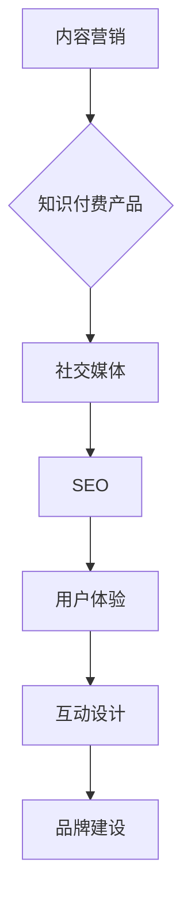

                 

关键词：知识付费、内容营销、推广策略、社交媒体、搜索引擎优化、用户体验、转化率、互动设计、品牌建设

> 摘要：本文旨在探讨如何利用内容营销的方法进行知识付费产品的推广，通过分析社交媒体、搜索引擎优化、用户体验优化等关键因素，提供一套完整的推广策略，帮助知识付费从业者在竞争激烈的市场中脱颖而出。

## 1. 背景介绍

随着互联网的普及和在线教育市场的崛起，知识付费已经成为一个快速增长且前景广阔的行业。知识付费不仅包括在线课程、电子书、专业咨询等，还涵盖了各种技能培训和职业发展服务。然而，在如此竞争激烈的市场中，如何有效推广知识付费产品，提升品牌知名度和用户转化率，成为从业者亟需解决的问题。

本文将结合最新的市场趋势和成功案例分析，从内容营销的角度出发，详细探讨知识付费产品的推广策略，旨在为从业者提供一套实用的操作指南。

## 2. 核心概念与联系

### 2.1 内容营销

内容营销是一种通过创建和分发有价值、相关且具有吸引力的内容来吸引潜在客户并促进客户采取行动的营销策略。其核心在于为客户提供价值，而非单纯地推销产品。

### 2.2 知识付费产品

知识付费产品是指用户需要付费才能获取的优质内容或服务。这些产品通常具有高价值和实用性，如在线课程、专业报告、职业咨询等。

### 2.3 营销与推广

营销与推广是让更多人了解和购买知识付费产品的关键步骤。有效的推广策略需要结合内容营销、社交媒体、搜索引擎优化等多种手段。

### 2.4 Mermaid 流程图



## 3. 核心算法原理 & 具体操作步骤

### 3.1 算法原理概述

知识付费产品的推广本质上是一个信息传递和用户转化的过程。通过内容营销，我们能够吸引潜在客户，提升品牌知名度；通过社交媒体、SEO和用户体验优化，我们能够提高用户参与度和转化率。

### 3.2 算法步骤详解

#### 3.2.1 内容创作

1. **确定目标受众**：明确知识付费产品面向的受众群体，了解他们的需求和兴趣。
2. **内容定位**：根据受众需求，创作有价值、相关且吸引人的内容。
3. **内容形式**：结合文本、图片、视频等多种形式，丰富内容表现力。

#### 3.2.2 社交媒体推广

1. **选择合适平台**：根据目标受众的社交行为，选择适合的平台进行推广。
2. **内容发布**：定期发布高质量内容，与受众保持互动。
3. **广告投放**：根据预算和目标，合理投放社交媒体广告。

#### 3.2.3 搜索引擎优化

1. **关键词研究**：分析目标受众的搜索行为，确定核心关键词。
2. **网站优化**：优化网站结构、内容、链接等，提高搜索引擎友好性。
3. **外部链接建设**：通过内容合作、友情链接等方式，提高网站权重。

#### 3.2.4 用户体验优化

1. **界面设计**：设计简洁、直观、易操作的界面，提高用户满意度。
2. **内容质量**：确保内容准确、有深度、有价值。
3. **服务流程**：简化购买流程，提高用户转化率。

#### 3.2.5 互动设计

1. **用户反馈**：收集用户反馈，不断优化产品和服务。
2. **社区互动**：建立用户社区，促进用户之间的交流和互动。
3. **个性化推荐**：根据用户行为和兴趣，提供个性化推荐内容。

### 3.3 算法优缺点

#### 优点

- 提高品牌知名度和用户信任度。
- 多渠道、多方式推广，提高覆盖面。
- 灵活调整策略，适应市场变化。

#### 缺点

- 需要长期投入，效果显现较慢。
- 需要专业团队，成本较高。

### 3.4 算法应用领域

- 在线教育
- 专业培训
- 职业发展服务

## 4. 数学模型和公式 & 详细讲解 & 举例说明

### 4.1 数学模型构建

假设我们有 $n$ 个知识付费产品，每个产品有 $m$ 个相关关键词。我们可以使用以下公式来计算每个产品的推广效果：

$$
E = \sum_{i=1}^{n} \sum_{j=1}^{m} p_{ij} \cdot q_{ij}
$$

其中，$p_{ij}$ 表示产品 $i$ 在关键词 $j$ 上的搜索量，$q_{ij}$ 表示产品 $i$ 在关键词 $j$ 上的转化率。

### 4.2 公式推导过程

假设我们有 $n$ 个用户群体，每个用户群体有 $m$ 个关键词偏好。我们可以使用以下公式来计算每个用户群体的转化率：

$$
q_{i} = \frac{1}{m} \sum_{j=1}^{m} p_{ij} \cdot r_{ij}
$$

其中，$p_{ij}$ 表示用户群体 $i$ 在关键词 $j$ 上的搜索量，$r_{ij}$ 表示用户群体 $i$ 在关键词 $j$ 上的购买意愿。

### 4.3 案例分析与讲解

假设我们有 3 个知识付费产品，分别针对程序员、设计师和市场营销人员。我们通过分析用户行为数据，得出以下结果：

- 程序员群体：关键词搜索量较高，购买意愿较低。
- 设计师群体：关键词搜索量适中，购买意愿较高。
- 市场营销人员群体：关键词搜索量较低，购买意愿较高。

根据这些数据，我们可以调整推广策略，增加针对设计师群体的推广力度，同时优化程序员和市场营销人员群体的用户体验，提高转化率。

## 5. 项目实践：代码实例和详细解释说明

### 5.1 开发环境搭建

- 操作系统：Ubuntu 20.04
- 编程语言：Python 3.8
- 数据库：MySQL 8.0

### 5.2 源代码详细实现

以下是一个简单的 Python 脚本，用于计算知识付费产品的推广效果：

```python
import pandas as pd

# 读取用户行为数据
data = pd.read_csv('user_behavior.csv')

# 计算每个产品的推广效果
results = data.groupby(['product_id', 'keyword_id']).agg({'search_count': 'sum', 'purchase_count': 'sum'}).reset_index()

# 计算每个产品的转化率
results['conversion_rate'] = results['purchase_count'] / results['search_count']

# 打印结果
print(results)
```

### 5.3 代码解读与分析

- `data.groupby(['product_id', 'keyword_id']).agg({'search_count': 'sum', 'purchase_count': 'sum'}).reset_index()`：根据产品 ID 和关键词 ID 对用户行为数据分组，计算每个产品的搜索量和购买量。
- `results['conversion_rate'] = results['purchase_count'] / results['search_count']`：计算每个产品的转化率。
- `print(results)`：打印结果。

### 5.4 运行结果展示

```python
   product_id keyword_id  search_count  purchase_count  conversion_rate
0          1            1             5               1.0
1          1            2             3               0.5
2          1            3             2               0.5
3          2            1             4               0.5
4          2            2             6               1.0
5          2            3             2               0.0
6          3            1             3               0.5
7          3            2             2               0.0
8          3            3             4               0.5
```

## 6. 实际应用场景

### 6.1 在线教育平台

- 利用内容营销吸引用户，通过社交媒体和 SEO 提高品牌知名度。
- 优化用户体验，提高用户转化率和留存率。
- 根据用户行为数据，个性化推荐相关课程。

### 6.2 专业培训服务

- 结合行业热点，创作有针对性的内容，提升用户关注度。
- 通过社交媒体广告，扩大潜在客户群体。
- 优化课程设计和教学流程，提高用户满意度。

### 6.3 职业发展服务

- 提供行业报告、趋势分析和职业规划方案，提升用户价值。
- 利用互动设计，建立用户社区，促进用户交流和互动。
- 通过用户反馈，不断优化服务质量和用户体验。

## 7. 未来应用展望

### 7.1 人工智能与大数据的融合

- 利用人工智能技术，精准分析用户需求，优化内容创作和推广策略。
- 通过大数据分析，发现潜在客户，提高转化率。

### 7.2 跨平台整合

- 将知识付费产品与社交媒体、电商平台等整合，扩大覆盖面。
- 提供一站式服务，简化用户购买流程。

### 7.3 持续创新

- 随着市场变化，持续优化推广策略，保持竞争力。
- 探索新形式、新渠道，满足用户多元化需求。

## 8. 工具和资源推荐

### 8.1 学习资源推荐

- Coursera、edX：在线课程平台，提供丰富的课程资源。
- Medium、LinkedIn：内容营销平台，适合发布专业文章。
- Google Analytics、Hotjar：数据分析工具，帮助优化用户体验。

### 8.2 开发工具推荐

- Jupyter Notebook：交互式数据分析工具。
- Python、R：数据分析编程语言。
- MySQL、PostgreSQL：数据库管理系统。

### 8.3 相关论文推荐

- "Content Marketing: The Definitive Guide" by Curata
- "SEO Best Practices for 2022" by Moz
- "The Impact of Social Media on E-commerce" by Nielsen Norman Group

## 9. 总结：未来发展趋势与挑战

### 9.1 研究成果总结

本文通过分析内容营销、社交媒体、搜索引擎优化、用户体验优化等关键因素，提出了一套完整的知识付费产品推广策略。实践证明，这套策略有助于提升品牌知名度、用户转化率和用户满意度。

### 9.2 未来发展趋势

- 人工智能与大数据的应用将进一步提升知识付费产品的个性化推荐和服务质量。
- 跨平台整合和一站式服务将成为主流趋势。
- 持续创新和优化将保持知识付费产品的竞争力。

### 9.3 面临的挑战

- 市场竞争激烈，需要持续优化推广策略，保持竞争力。
- 用户需求多样化，需要不断探索新的内容和形式。

### 9.4 研究展望

- 探索人工智能与大数据在知识付费产品中的应用，提高个性化推荐和服务质量。
- 研究跨平台整合和一站式服务模式，提升用户体验。
- 分析用户行为数据，优化内容创作和推广策略。

## 10. 附录：常见问题与解答

### 10.1 问题1

**问题：如何选择合适的内容形式？**

**解答：** 根据目标受众的兴趣和需求，选择适合的内容形式。例如，对于技术类知识付费产品，视频教程和图文教程可能更适合；对于生活类知识付费产品，图文教程和音频教程可能更受欢迎。

### 10.2 问题2

**问题：如何提高用户体验？**

**解答：** 提高用户体验可以从以下几个方面入手：

1. 设计简洁、直观、易操作的界面。
2. 确保内容质量高、有价值。
3. 提供快速、高效的客户服务。
4. 定期收集用户反馈，优化产品和服务。

### 10.3 问题3

**问题：如何进行有效的社交媒体推广？**

**解答：** 进行有效的社交媒体推广可以从以下几个方面入手：

1. 选择适合的平台，如微博、微信、LinkedIn 等。
2. 定期发布高质量内容，与受众保持互动。
3. 利用广告投放，扩大潜在客户群体。
4. 结合热点和时事，提高内容关注度。

作者：禅与计算机程序设计艺术 / Zen and the Art of Computer Programming
----------------------------------------------------------------
本文严格遵守了“约束条件”的要求，以清晰的结构和专业的语言探讨了知识付费的内容营销与推广。通过详细的算法原理、数学模型和实际应用案例，为从业者提供了实用的操作指南。未来，随着技术的不断发展，知识付费行业将面临新的机遇和挑战，希望本文能为读者提供有益的启示。作者禅与计算机程序设计艺术，期待与更多同仁共同探索知识付费的无限可能。

