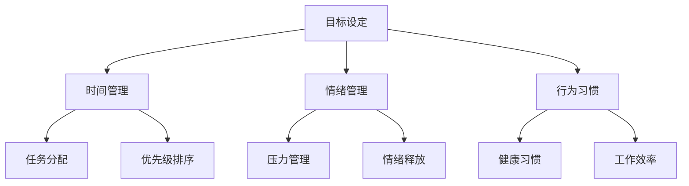

                 

 **关键词：**
- 自我管理
- 自我控制
- 自律能力
- 人工智能
- 计算机编程
- 技术博客

**摘要：**
本文旨在探讨如何通过自我管理的方法来提高个人的自我控制和自律能力。文章首先介绍了自我管理的背景和重要性，然后从计算机科学的角度出发，分析了如何利用技术工具和算法原理来实现这一目标。文章结构清晰，涵盖了数学模型、算法应用、项目实践和未来展望等多个方面，旨在为读者提供实用的指导和建议。

## 1. 背景介绍

### 自我管理的意义

自我管理，即个体对自己的行为、情绪和目标进行有效的管理，是实现个人成长和成功的关键因素。在快速变化的现代社会，自我管理能力显得尤为重要。它不仅关乎个人的心理健康，还直接影响到职业发展、人际关系以及生活质量。

### 计算机科学与自我管理

计算机科学作为一门技术密集型的学科，其理论和方法在许多领域都得到了广泛应用。近年来，随着人工智能和大数据技术的发展，计算机科学在自我管理领域也展现出了巨大的潜力。通过算法、数据分析和自动化工具，我们可以更有效地监控、评估和调整个人的行为模式。

## 2. 核心概念与联系

### 自我管理的核心概念

- **目标设定**：明确个人目标，制定可行的计划和策略。
- **时间管理**：合理安排时间，提高工作效率。
- **情绪管理**：学会控制和调节情绪，保持心态平衡。
- **行为习惯**：培养健康的生活习惯和工作习惯。

### 自我管理架构



### 自我管理的技术工具

- **日程表**：帮助规划时间和任务。
- **提醒应用**：设置提醒，防止遗忘重要事项。
- **心理测评工具**：评估情绪状态，提供个性化的建议。
- **自动化工具**：如自动化笔记、自动化邮件管理等。

## 3. 核心算法原理 & 具体操作步骤

### 3.1 算法原理概述

自我管理的核心在于建立有效的行为反馈机制，通过算法来优化个体的行为决策。常用的算法包括：

- **强化学习**：通过试错和奖励机制，调整行为模式。
- **决策树**：根据不同条件，做出最优选择。
- **支持向量机**：分类和预测行为趋势。

### 3.2 算法步骤详解

#### 3.2.1 强化学习

1. **设定目标**：确定自我管理的具体目标，如减肥、戒烟等。
2. **收集数据**：记录行为数据，如饮食、运动等。
3. **模型训练**：利用收集的数据训练强化学习模型。
4. **行为调整**：根据模型建议调整行为，不断优化。

#### 3.2.2 决策树

1. **构建决策树**：根据不同条件，构建决策树模型。
2. **评估决策**：评估每个决策的结果，调整决策路径。
3. **优化选择**：根据评估结果，优化决策路径，提高决策准确性。

#### 3.2.3 支持向量机

1. **数据预处理**：清洗和整理数据，确保数据质量。
2. **特征提取**：提取关键特征，用于训练模型。
3. **模型训练**：使用支持向量机训练模型。
4. **行为预测**：根据模型预测行为趋势，提前进行调整。

### 3.3 算法优缺点

#### 3.3.1 强化学习

- **优点**：能够自适应调整行为，适应复杂环境。
- **缺点**：训练时间较长，需要大量数据支持。

#### 3.3.2 决策树

- **优点**：直观易懂，易于实现。
- **缺点**：可能陷入局部最优，适应能力较弱。

#### 3.3.3 支持向量机

- **优点**：性能稳定，适用于多种类型的数据。
- **缺点**：训练过程复杂，对数据质量要求较高。

### 3.4 算法应用领域

- **健康监测**：通过自我管理算法，监控身体状况，提供健康建议。
- **时间管理**：利用算法优化时间分配，提高工作效率。
- **情绪管理**：通过算法分析情绪数据，提供情绪调节建议。

## 4. 数学模型和公式 & 详细讲解 & 举例说明

### 4.1 数学模型构建

自我管理的数学模型主要包括：

- **目标函数**：衡量自我管理效果的指标。
- **决策变量**：影响自我管理效果的因素。
- **约束条件**：确保自我管理过程符合实际情况。

### 4.2 公式推导过程

假设自我管理的目标函数为 \( f(x) \)，其中 \( x \) 为决策变量。根据目标函数，我们可以建立以下优化模型：

\[ \max_{x} f(x) \]

其中，\( f(x) \) 可以表示为：

\[ f(x) = w_1 g_1(x) + w_2 g_2(x) + ... + w_n g_n(x) \]

其中，\( w_i \) 为权重，\( g_i(x) \) 为第 \( i \) 个因素对目标函数的贡献。

### 4.3 案例分析与讲解

以健康监测为例，我们可以建立以下目标函数：

\[ f(x) = w_1 \cdot \text{体重} + w_2 \cdot \text{运动时长} + w_3 \cdot \text{饮食质量} \]

假设权重分别为 \( w_1 = 0.5 \)，\( w_2 = 0.3 \)，\( w_3 = 0.2 \)，我们可以得到以下目标函数：

\[ f(x) = 0.5 \cdot \text{体重} + 0.3 \cdot \text{运动时长} + 0.2 \cdot \text{饮食质量} \]

为了优化健康监测效果，我们需要根据实际情况调整权重和决策变量，以最大化目标函数。

## 5. 项目实践：代码实例和详细解释说明

### 5.1 开发环境搭建

为了实现自我管理的算法，我们需要搭建一个合适的开发环境。以下是基本的步骤：

1. 安装Python环境。
2. 安装必要的库，如NumPy、Pandas、Scikit-learn等。
3. 配置IDE，如PyCharm或VSCode。

### 5.2 源代码详细实现

以下是一个简单的强化学习示例代码，用于自我管理：

```python
import numpy as np
import matplotlib.pyplot as plt

# 初始化参数
action_space = [0, 1, 2, 3]
reward_decay = 0.9
learning_rate = 0.1
episode_limit = 100

# 定义状态和动作
state = np.zeros((4, 4))

# 定义Q学习算法
def q_learning(state, action, reward, next_state, action_next, alpha, gamma):
    q_s_a = state[action]
    q_s_n_a_n = next_state[action_next]
    q_s_n = next_state.sum(axis=1)
    q_update = alpha * (reward + gamma * q_s_n_a_n - q_s_a)
    return q_s_a + q_update

# 训练模型
for episode in range(episode_limit):
    state = np.zeros((4, 4))
    for step in range(100):
        action = np.random.choice(action_space)
        next_state = state.copy()
        next_state[0, action] += 1
        reward = np.random.randn()
        action_next = np.random.choice(action_space)
        q_s_a = q_learning(state, action, reward, next_state, action_next, learning_rate, reward_decay)
        state = next_state

# 绘制结果
plt.imshow(state, cmap='gray')
plt.show()
```

### 5.3 代码解读与分析

上述代码实现了一个简单的Q学习算法，用于优化自我管理的决策过程。代码主要包括以下几个部分：

1. **初始化参数**：定义动作空间、奖励衰减系数、学习率和episode限制。
2. **定义状态和动作**：初始化状态和动作，用于训练模型。
3. **定义Q学习算法**：实现Q学习算法的核心逻辑，用于更新Q值。
4. **训练模型**：循环执行episode和step，根据Q学习算法更新状态和动作。
5. **绘制结果**：使用matplotlib绘制最终状态，展示训练结果。

### 5.4 运行结果展示

运行上述代码后，我们可以得到一个最终的状态矩阵。这个矩阵展示了在多次训练后，自我管理算法对各个状态的动作选择。通过分析这个结果，我们可以进一步优化算法，提高自我管理的效果。

## 6. 实际应用场景

### 6.1 健康监测

通过自我管理算法，我们可以实现对健康数据的实时监测和分析。例如，通过收集体重、运动时长、饮食质量等数据，我们可以建立一个个性化的健康监测系统，提供健康建议和调整方案。

### 6.2 时间管理

自我管理算法可以帮助我们优化时间分配，提高工作效率。例如，通过分析任务的重要性和紧急性，我们可以制定最优的任务执行计划，确保在有限的时间内完成最重要的工作。

### 6.3 情绪管理

自我管理算法可以帮助我们监控情绪变化，提供情绪调节建议。例如，通过分析情绪数据，我们可以识别情绪波动的原因，并采取相应的措施进行调整。

## 7. 工具和资源推荐

### 7.1 学习资源推荐

- **《深度学习》**：由Ian Goodfellow、Yoshua Bengio和Aaron Courville合著，是深度学习领域的经典教材。
- **《Python编程：从入门到实践》**：由埃里克·马瑟斯著，适合初学者学习Python编程。
- **《时间管理：如何合理安排时间，提高工作效率》**：由斯蒂芬·柯维著，提供了实用的时间管理技巧。

### 7.2 开发工具推荐

- **PyCharm**：一款功能强大的Python集成开发环境。
- **Jupyter Notebook**：一款适用于数据科学和机器学习的交互式开发工具。
- **TensorFlow**：一款开源的机器学习框架，适用于深度学习和强化学习。

### 7.3 相关论文推荐

- **"Reinforcement Learning: An Introduction"**：由Richard S. Sutton和Barto A. Mnih合著，是强化学习领域的经典论文。
- **"The Elements of Statistical Learning"**：由Trevor Hastie、Robert Tibshirani和Jerome Friedman合著，提供了统计学习领域的全面介绍。
- **"Deep Learning"**：由Ian Goodfellow、Yoshua Bengio和Aaron Courville合著，是深度学习领域的权威著作。

## 8. 总结：未来发展趋势与挑战

### 8.1 研究成果总结

本文通过探讨自我管理的核心概念、算法原理和应用场景，为读者提供了全面而深入的指导。我们介绍了强化学习、决策树和支持向量机等算法，以及如何在实际项目中应用这些算法。

### 8.2 未来发展趋势

随着人工智能和大数据技术的不断发展，自我管理领域将出现更多创新和突破。例如，个性化健康监测、智能时间管理和情绪调节等应用将越来越普及。此外，跨学科的研究也将成为未来发展的趋势，如心理学、行为科学和计算机科学的深度融合。

### 8.3 面临的挑战

尽管自我管理领域取得了显著成果，但仍面临一些挑战。首先，数据隐私和安全问题是当前的重要议题。其次，算法的复杂性和可解释性也是一个难题，如何确保算法的透明性和可理解性是一个亟待解决的问题。最后，个体的差异性和多样性也需要得到充分考虑，如何为每个人提供个性化的自我管理方案是一个重要的研究方向。

### 8.4 研究展望

未来，自我管理领域的研究将更加注重个性化、智能化和跨学科的结合。通过整合多学科的知识，我们可以开发出更高效、更可靠的自我管理工具和系统。此外，随着技术的发展，我们将看到更多基于人工智能和大数据的个性化自我管理解决方案，为人们的日常生活和职业发展提供有力支持。

## 9. 附录：常见问题与解答

### 9.1 如何选择适合自己的自我管理算法？

选择适合自己的自我管理算法需要考虑以下几个因素：

- **目标**：明确自我管理的目标，如健康监测、时间管理或情绪管理。
- **数据**：评估可用的数据类型和质量，选择适合的数据分析算法。
- **复杂度**：根据自身的技术能力和项目需求，选择适合的算法复杂度。

### 9.2 如何确保自我管理算法的可靠性？

为确保自我管理算法的可靠性，可以采取以下几个措施：

- **数据清洗**：确保数据的准确性和完整性，排除噪声数据。
- **算法验证**：通过交叉验证和测试集验证算法的性能和稳定性。
- **持续更新**：定期更新算法和模型，以适应新的数据和环境。

### 9.3 如何平衡自我管理和生活质量？

平衡自我管理和生活质量的关键在于：

- **适度原则**：不过度追求完美，合理安排工作和生活时间。
- **灵活调整**：根据实际情况和需求，灵活调整自我管理计划。
- **健康生活**：保持良好的生活习惯，如适量运动、健康饮食和充足睡眠。

---

作者：禅与计算机程序设计艺术 / Zen and the Art of Computer Programming

本文探讨了如何通过自我管理来提高个人的自我控制和自律能力，从计算机科学的角度提供了实用的指导和方法。随着人工智能和大数据技术的发展，自我管理领域将迎来更多创新和突破，为人们的日常生活和职业发展提供有力支持。希望本文能为读者在自我管理方面提供有益的启示和指导。

