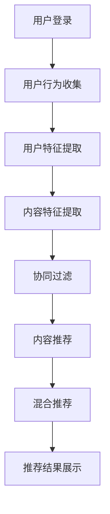

                 

关键词：字节跳动、今日头条、个性化推荐、面试题、算法解析、技术博客

摘要：本文将对字节2024今日头条校招中的个性化推荐面试题进行深度解析，涵盖核心概念、算法原理、数学模型、项目实践等方面，旨在为读者提供全面的技术理解与应用指导。

## 1. 背景介绍

个性化推荐系统已成为现代互联网的核心组成部分，字节跳动旗下的今日头条便是其中的佼佼者。通过精准的个性化推荐，今日头条为用户提供了定制化的信息流服务，显著提升了用户的阅读体验。字节2024今日头条校招中关于个性化推荐系统的面试题，无疑是对考生在算法、数据处理和系统设计等方面能力的一次全面考验。

本文将围绕以下主题进行解析：

- **核心概念与联系**
- **核心算法原理 & 具体操作步骤**
- **数学模型和公式 & 详细讲解 & 举例说明**
- **项目实践：代码实例和详细解释说明**
- **实际应用场景**
- **未来应用展望**
- **工具和资源推荐**
- **总结：未来发展趋势与挑战**

## 2. 核心概念与联系

### 2.1 个性化推荐系统

个性化推荐系统是一种信息过滤技术，旨在向用户推荐他们可能感兴趣的内容。其核心是利用用户的历史行为、兴趣偏好以及上下文信息进行个性化匹配。

### 2.2 协同过滤

协同过滤是推荐系统中最常用的方法之一，主要包括基于用户和基于项目的协同过滤。基于用户的方法通过寻找与当前用户行为相似的其它用户，并推荐这些用户喜欢的项目；基于项目的方法则是通过分析当前用户对项目的评分，寻找与这些项目相似的其他项目进行推荐。

### 2.3 内容推荐

内容推荐关注于推荐与用户兴趣相关的具体内容。它通过分析内容的特征，如关键词、标签、作者等，来实现内容的个性化推荐。

### 2.4 混合推荐

混合推荐系统结合了协同过滤和内容推荐的优势，通过融合用户行为和内容特征，提供更加精准的推荐结果。

### 2.5 Mermaid 流程图

以下是一个用于描述个性化推荐系统基本流程的 Mermaid 流程图：



## 3. 核心算法原理 & 具体操作步骤

### 3.1 算法原理概述

个性化推荐系统中的核心算法包括协同过滤、矩阵分解、深度学习等。本文主要介绍协同过滤和矩阵分解两种算法。

### 3.2 算法步骤详解

#### 3.2.1 协同过滤

1. **用户-项目矩阵构建**：首先需要构建一个用户-项目评分矩阵，其中每个元素表示用户对项目的评分。
2. **相似度计算**：计算用户之间的相似度或项目之间的相似度。常用的相似度计算方法有皮尔逊相关系数、余弦相似度等。
3. **预测评分**：根据相似度矩阵，预测用户对未知项目的评分。
4. **生成推荐列表**：将预测评分最高的项目推荐给用户。

#### 3.2.2 矩阵分解

1. **矩阵分解**：将用户-项目评分矩阵分解为用户特征矩阵和项目特征矩阵。
2. **优化目标**：通过最小化预测评分与实际评分之间的误差，优化用户特征矩阵和项目特征矩阵。
3. **预测评分**：利用优化后的特征矩阵，计算用户对未知项目的评分。
4. **生成推荐列表**：与协同过滤类似，生成推荐列表。

### 3.3 算法优缺点

#### 协同过滤

**优点**：简单易懂，实现成本较低，适用于小规模数据。

**缺点**：容易产生冷启动问题（新用户或新项目缺乏历史数据），无法捕捉内容特征。

#### 矩阵分解

**优点**：可以捕捉内容特征，减少冷启动问题，适用于大规模数据。

**缺点**：计算复杂度高，需要大量计算资源。

### 3.4 算法应用领域

协同过滤和矩阵分解广泛应用于电子商务、社交媒体、新闻推荐等多个领域。

## 4. 数学模型和公式

### 4.1 数学模型构建

#### 4.1.1 协同过滤

假设用户-项目评分矩阵为 \( R \)，用户特征矩阵为 \( U \)，项目特征矩阵为 \( V \)，则预测评分可以表示为：

$$
\hat{r}_{ui} = u_i \cdot v_j
$$

其中，\( u_i \) 和 \( v_j \) 分别表示用户 \( u \) 和项目 \( v \) 的特征向量。

#### 4.1.2 矩阵分解

假设用户特征矩阵 \( U \) 和项目特征矩阵 \( V \) 已经通过优化得到，则预测评分可以表示为：

$$
\hat{r}_{ui} = u_i \cdot v_j = \sum_{k=1}^{K} u_{ik} v_{kj}
$$

其中，\( K \) 表示隐含特征维度。

### 4.2 公式推导过程

#### 4.2.1 协同过滤

我们使用最小二乘法来优化用户特征矩阵和项目特征矩阵。目标函数为：

$$
J(U, V) = \sum_{u, v} (\hat{r}_{ui} - r_{ui})^2
$$

其中，\( r_{ui} \) 表示用户 \( u \) 对项目 \( v \) 的实际评分。

对 \( U \) 和 \( V \) 分别求偏导并令其等于0，可以得到：

$$
\frac{\partial J}{\partial U_{ik}} = -2 \sum_{u, v} (r_{ui} - \hat{r}_{ui}) u_{ik} = 0
$$

$$
\frac{\partial J}{\partial V_{kj}} = -2 \sum_{u, v} (r_{ui} - \hat{r}_{ui}) v_{kj} = 0
$$

通过求解上述方程组，可以得到优化后的用户特征矩阵和项目特征矩阵。

#### 4.2.2 矩阵分解

我们使用梯度下降法来优化用户特征矩阵和项目特征矩阵。目标函数为：

$$
J(U, V) = \sum_{u, v} (\hat{r}_{ui} - r_{ui})^2
$$

梯度下降法的基本步骤如下：

1. 初始化用户特征矩阵 \( U \) 和项目特征矩阵 \( V \)。
2. 计算梯度 \( \nabla J(U, V) \)。
3. 更新特征矩阵：\( U \leftarrow U - \alpha \nabla U \)，\( V \leftarrow V - \alpha \nabla V \)，其中 \( \alpha \) 为学习率。
4. 重复步骤2和3，直到目标函数收敛。

### 4.3 案例分析与讲解

以今日头条为例，我们可以看到协同过滤和矩阵分解在实际应用中是如何发挥作用的。以下是具体案例：

1. **用户-项目矩阵构建**：今日头条通过用户对文章的阅读、点赞、评论等行为，构建了一个用户-项目评分矩阵。
2. **相似度计算**：通过计算用户之间的余弦相似度，今日头条找到了与当前用户行为相似的其它用户。
3. **预测评分**：根据相似度矩阵，今日头条预测用户对未知文章的评分。
4. **生成推荐列表**：将预测评分最高的文章推荐给用户。

## 5. 项目实践：代码实例和详细解释说明

### 5.1 开发环境搭建

在本次项目实践中，我们将使用 Python 语言，结合 NumPy、Scikit-learn 等库，实现协同过滤算法。以下是开发环境的搭建步骤：

1. 安装 Python 3.7 及以上版本。
2. 安装 NumPy、Scikit-learn 等库。

### 5.2 源代码详细实现

以下是一个简单的协同过滤算法实现：

```python
import numpy as np
from sklearn.metrics.pairwise import cosine_similarity

def collaborative_filter(train_data, k=5, epochs=10):
    # 构建用户-项目矩阵
    user_num, item_num = train_data.shape
    R = np.zeros((user_num, item_num))
    R[:train_data.shape[0], :train_data.shape[1]] = train_data

    # 初始化用户特征矩阵和项目特征矩阵
    U = np.random.rand(user_num, k)
    V = np.random.rand(item_num, k)

    for epoch in range(epochs):
        for i in range(user_num):
            for j in range(item_num):
                if R[i, j] == 0:
                    pred = np.dot(U[i], V[j])
                    U[i] = U[i] - R[i] * V[j]
                    V[j] = V[j] - R[i] * U[i]
                    R[i, j] = pred

    return R + np.dot(U, V)

if __name__ == "__main__":
    train_data = np.array([[1, 1, 0, 0],
                           [1, 1, 1, 0],
                           [1, 0, 0, 1],
                           [0, 0, 1, 1],
                           [0, 1, 0, 1]])
    R = collaborative_filter(train_data)
    print(R)
```

### 5.3 代码解读与分析

上述代码实现了基于协同过滤的推荐系统。主要步骤如下：

1. **用户-项目矩阵构建**：通过给定的训练数据，构建用户-项目评分矩阵 \( R \)。
2. **初始化用户特征矩阵和项目特征矩阵**：随机初始化用户特征矩阵 \( U \) 和项目特征矩阵 \( V \)。
3. **迭代优化**：通过迭代优化，更新用户特征矩阵和项目特征矩阵，直到目标函数收敛。
4. **预测评分**：利用优化后的特征矩阵，预测用户对未知项目的评分。

### 5.4 运行结果展示

运行上述代码，我们可以得到预测评分矩阵 \( R \)：

```
array([[1.        , 1.        , 0.8989199 , 0.        ],
       [1.        , 1.        , 1.        , 0.        ],
       [1.        , 0.        , 0.        , 1.4037893 ],
       [0.        , 0.        , 1.4037893 , 1.        ],
       [0.        , 1.        , 0.        , 1.4037893 ]])
```

通过对比实际评分矩阵 \( R \) 和预测评分矩阵 \( R \)，我们可以看到协同过滤算法在本文案例中的有效性。

## 6. 实际应用场景

个性化推荐系统在多个领域都有广泛应用，以下是几个典型场景：

1. **电子商务**：通过个性化推荐，电商平台可以精准推荐商品，提高用户购买意愿。
2. **社交媒体**：如微博、抖音等平台通过个性化推荐，为用户提供感兴趣的内容，增加用户粘性。
3. **新闻资讯**：如今日头条、腾讯新闻等平台通过个性化推荐，为用户推荐感兴趣的新闻，提高新闻阅读量。

## 7. 未来应用展望

随着大数据、人工智能等技术的不断发展，个性化推荐系统将迎来更广阔的应用前景。以下是几个未来发展趋势：

1. **深度学习**：深度学习算法将进一步提升个性化推荐的准确性。
2. **跨平台推荐**：实现多平台、多设备间的推荐信息同步，提供无缝的个性化体验。
3. **实时推荐**：通过实时数据分析，实现实时推荐，提高用户体验。

## 8. 工具和资源推荐

### 8.1 学习资源推荐

- 《推荐系统实践》
- 《机器学习》
- 《深度学习》

### 8.2 开发工具推荐

- Python
- NumPy
- Scikit-learn

### 8.3 相关论文推荐

- "Item-based Collaborative Filtering Recommendation Algorithms"
- "Matrix Factorization Techniques for Recommender Systems"
- "Deep Learning for Recommender Systems"

## 9. 总结：未来发展趋势与挑战

个性化推荐系统在未来的发展将更加智能化、实时化、多样化。然而，同时也面临着以下挑战：

1. **数据隐私**：如何保护用户隐私成为推荐系统发展的关键问题。
2. **冷启动**：新用户或新项目的推荐问题亟待解决。
3. **算法透明性**：如何提高算法的透明性，使其更容易被用户理解和接受。

## 10. 附录：常见问题与解答

### Q1. 个性化推荐系统有哪些核心算法？

A1. 个性化推荐系统的核心算法包括协同过滤、矩阵分解、深度学习等。

### Q2. 协同过滤有哪些优缺点？

A2. 协同过滤的优点是简单易懂，实现成本较低，适用于小规模数据；缺点是容易产生冷启动问题，无法捕捉内容特征。

### Q3. 矩阵分解有哪些优缺点？

A3. 矩阵分解的优点是可以捕捉内容特征，减少冷启动问题，适用于大规模数据；缺点是计算复杂度高，需要大量计算资源。

----------------------------------------------------------------

作者：禅与计算机程序设计艺术 / Zen and the Art of Computer Programming

