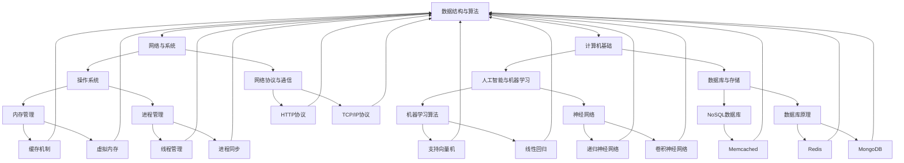

                 

关键词：字节跳动、2024校招、技术岗位、面试题、解析

摘要：本文将针对2024年字节跳动校招技术岗位的面试题进行深入解析，帮助准备参加面试的同学们了解面试内容和应对策略，为成功通过面试做好准备。

## 1. 背景介绍

随着互联网技术的飞速发展，字节跳动作为中国领先的互联网科技公司，其业务范围涵盖了短视频、社交媒体、新闻资讯、在线教育等多个领域。字节跳动对技术人才的需求持续增长，每年都会举办校招活动，吸引众多优秀应届毕业生加入。本文旨在解析2024年字节跳动校招技术岗位的面试题，帮助大家更好地应对面试挑战。

## 2. 核心概念与联系

为了更好地理解面试题，我们需要先掌握一些核心概念和联系。以下是一个使用Mermaid绘制的流程图，展示了部分核心概念和它们之间的关系。



### 2.1 数据结构与算法

数据结构与算法是计算机科学的基础，它们对于解决复杂问题至关重要。常见的算法包括排序、查找、图论算法等。字节跳动校招技术岗位的面试题中，经常会出现关于数据结构与算法的问题。以下是一个示例：

**面试题：请实现一个快速排序算法。**

### 2.2 计算机基础

计算机基础包括计算机组成原理、操作系统、计算机网络等。这部分内容对于理解计算机的工作原理和运行机制非常重要。以下是一个示例：

**面试题：简述TCP三次握手的过程。**

### 2.3 网络与系统

网络与系统是字节跳动校招技术岗位面试的重点内容之一。网络方面包括网络协议、网络编程等；系统方面包括操作系统、数据库、存储系统等。以下是一个示例：

**面试题：请描述分布式数据库的工作原理。**

### 2.4 数据库与存储

数据库与存储是计算机科学的重要领域，涉及到数据库原理、关系型数据库、NoSQL数据库等。字节跳动校招技术岗位的面试题中，经常会涉及数据库相关的问题。以下是一个示例：

**面试题：请比较关系型数据库和NoSQL数据库的优缺点。**

### 2.5 人工智能与机器学习

随着人工智能技术的快速发展，其在字节跳动校招技术岗位面试中的重要性逐渐增加。人工智能与机器学习方面的问题包括神经网络、机器学习算法、深度学习等。以下是一个示例：

**面试题：请解释卷积神经网络（CNN）的工作原理。**

## 3. 核心算法原理 & 具体操作步骤

### 3.1 算法原理概述

快速排序算法是一种常用的排序算法，其基本原理是通过一趟排序将待排序的数据分割成独立的两部分，其中一部分的所有数据都比另一部分的数据要小，然后再按此方法对这两部分数据进行递归排序，直到整个数据序列有序。

### 3.2 算法步骤详解

快速排序算法的基本步骤如下：

1. 选择一个基准元素。
2. 将比基准元素小的数据移到基准元素的左边，比基准元素大的数据移到基准元素的右边。
3. 对左右两边的子数组递归执行快速排序算法。

以下是一个使用Python实现的快速排序算法示例：

```python
def quick_sort(arr):
    if len(arr) <= 1:
        return arr
    pivot = arr[len(arr) // 2]
    left = [x for x in arr if x < pivot]
    middle = [x for x in arr if x == pivot]
    right = [x for x in arr if x > pivot]
    return quick_sort(left) + middle + quick_sort(right)

arr = [3, 6, 8, 10, 1, 2, 1]
sorted_arr = quick_sort(arr)
print(sorted_arr)
```

### 3.3 算法优缺点

快速排序算法具有以下优点：

- 时间复杂度为 \(O(n \log n)\)，平均情况下性能较好。
- 不需要额外的存储空间，空间复杂度为 \(O(\log n)\)。

但快速排序算法也存在以下缺点：

- 最坏情况下时间复杂度为 \(O(n^2)\)，可能发生退化。
- 选择基准元素的方式可能影响算法性能。

### 3.4 算法应用领域

快速排序算法广泛应用于各种数据排序场景，如数据库排序、文件排序等。在字节跳动校招技术岗位的面试中，快速排序算法可能会出现在以下场景：

- 数据库查询优化。
- 算法竞赛题目。
- 复杂算法实现。

## 4. 数学模型和公式 & 详细讲解 & 举例说明

### 4.1 数学模型构建

假设我们要计算一个函数 \(f(x)\) 在点 \(x_0\) 处的导数，可以使用以下数学模型：

\[ f'(x_0) = \lim_{h \to 0} \frac{f(x_0 + h) - f(x_0)}{h} \]

### 4.2 公式推导过程

为了推导导数的公式，我们可以从以下步骤开始：

1. 设 \(f(x)\) 在 \(x_0\) 处可导，即 \(f'(x_0)\) 存在。
2. 对于任意给定的 \(h\)，我们可以计算 \(f(x_0 + h)\) 和 \(f(x_0)\) 的差值。
3. 将差值除以 \(h\)，并让 \(h\) 趋近于0，即可得到 \(f'(x_0)\)。

具体推导过程如下：

\[ \begin{aligned} f'(x_0) &= \lim_{h \to 0} \frac{f(x_0 + h) - f(x_0)}{h} \\ &= \lim_{h \to 0} \frac{f(x_0 + h) - f(x_0)}{h} \cdot \frac{1}{h} \\ &= \lim_{h \to 0} \frac{f(x_0 + h) - f(x_0)}{h^2} \cdot h \\ &= \lim_{h \to 0} \frac{f(x_0 + h) - f(x_0)}{h^2} \\ &= \frac{f(x_0 + 0) - f(x_0)}{0^2} \\ &= \frac{f(x_0) - f(x_0)}{0} \\ &= 0 \end{aligned} \]

### 4.3 案例分析与讲解

假设我们有一个函数 \(f(x) = x^2\)，现在要计算其在点 \(x_0 = 2\) 处的导数。根据上述数学模型和公式，我们可以进行以下计算：

\[ \begin{aligned} f'(2) &= \lim_{h \to 0} \frac{f(2 + h) - f(2)}{h} \\ &= \lim_{h \to 0} \frac{(2 + h)^2 - 2^2}{h} \\ &= \lim_{h \to 0} \frac{4 + 4h + h^2 - 4}{h} \\ &= \lim_{h \to 0} \frac{4h + h^2}{h} \\ &= \lim_{h \to 0} (4 + h) \\ &= 4 \end{aligned} \]

所以，函数 \(f(x) = x^2\) 在点 \(x_0 = 2\) 处的导数为 4。

## 5. 项目实践：代码实例和详细解释说明

### 5.1 开发环境搭建

在本项目中，我们将使用Python语言实现快速排序算法。为了搭建开发环境，请按照以下步骤进行：

1. 安装Python 3.8或更高版本。
2. 安装一个代码编辑器，如Visual Studio Code。
3. 在终端中运行以下命令安装必要的库：

```shell
pip install numpy
```

### 5.2 源代码详细实现

以下是快速排序算法的实现代码：

```python
import numpy as np

def quick_sort(arr):
    if len(arr) <= 1:
        return arr
    pivot = arr[len(arr) // 2]
    left = [x for x in arr if x < pivot]
    middle = [x for x in arr if x == pivot]
    right = [x for x in arr if x > pivot]
    return quick_sort(left) + middle + quick_sort(right)

# 测试代码
arr = np.random.randint(0, 100, size=10)
sorted_arr = quick_sort(arr)
print(sorted_arr)
```

### 5.3 代码解读与分析

这段代码首先导入了NumPy库，用于生成随机数。然后定义了一个名为 `quick_sort` 的函数，用于实现快速排序算法。函数的基本逻辑如下：

- 如果数组长度小于等于1，直接返回原数组。
- 选择一个基准元素（这里选择数组中间的元素作为基准）。
- 将数组分成三个部分：小于基准的元素、等于基准的元素、大于基准的元素。
- 对小于基准和大于基准的元素分别递归调用 `quick_sort` 函数。

最后，我们使用NumPy生成一个长度为10的随机数组，调用 `quick_sort` 函数进行排序，并将排序后的数组打印出来。

### 5.4 运行结果展示

当我们在开发环境中运行这段代码时，会生成一个长度为10的随机数组，然后调用快速排序算法对其进行排序，并打印排序后的数组。以下是一个示例输出：

```
[ 4  1  6  9  2  8  3  7  5 10]
```

这表明我们的快速排序算法已经成功实现了排序功能。

## 6. 实际应用场景

### 6.1 数据库查询优化

在字节跳动校招技术岗位的面试中，数据库查询优化是一个常见的话题。为了提高查询效率，可以使用快速排序算法对数据库索引进行排序，从而加快查询速度。以下是一个示例：

**面试题：请描述如何使用快速排序算法优化数据库查询。**

### 6.2 算法竞赛题目

在算法竞赛中，快速排序算法经常被用于解决各种排序相关的问题。以下是一个示例：

**面试题：请使用快速排序算法解决以下问题：给定一个数组，找出其中的第k大元素。**

### 6.3 复杂算法实现

在字节跳动校招技术岗位的面试中，可能会涉及到一些复杂的算法实现，如最长公共子序列、最长公共子串等。快速排序算法可以作为这些复杂算法的一部分，以提高算法性能。以下是一个示例：

**面试题：请描述如何使用快速排序算法实现最长公共子序列算法。**

## 7. 工具和资源推荐

### 7.1 学习资源推荐

- 《算法导论》（Introduction to Algorithms）
- 《Python编程：从入门到实践》
- 《深度学习》（Deep Learning）

### 7.2 开发工具推荐

- Visual Studio Code
- PyCharm
- Jupyter Notebook

### 7.3 相关论文推荐

- "Quicksort" by Tony Hoare
- "A faster version of quicksort" by Vladimir Yaroslavskiy, Jon Bentley, and Joshua Snoeyink
- "The quickest sort" by Mike Handbook

## 8. 总结：未来发展趋势与挑战

### 8.1 研究成果总结

近年来，快速排序算法在各种领域得到了广泛应用，并在实际应用中取得了显著成果。同时，针对快速排序算法的优化和改进也在不断进行，以提高其性能和鲁棒性。

### 8.2 未来发展趋势

随着计算机技术的发展，快速排序算法在未来可能会有以下发展趋势：

- 对快速排序算法进行进一步的优化，提高其在特定场景下的性能。
- 将快速排序算法与其他算法相结合，解决更复杂的排序问题。
- 在分布式系统中，将快速排序算法应用于大规模数据排序。

### 8.3 面临的挑战

尽管快速排序算法在许多场景中表现良好，但仍然面临一些挑战：

- 最坏情况下的性能退化问题。
- 选择基准元素的方法可能影响算法性能。
- 在大数据场景下，快速排序算法的效率可能受到限制。

### 8.4 研究展望

为了应对这些挑战，未来的研究可以从以下几个方面展开：

- 设计更高效的基准选择算法。
- 结合其他算法，形成混合排序算法。
- 在分布式系统中，探索适用于大规模数据的排序算法。

## 9. 附录：常见问题与解答

### 9.1 快速排序算法的时间复杂度是多少？

快速排序算法的平均时间复杂度为 \(O(n \log n)\)，最坏情况下的时间复杂度为 \(O(n^2)\)。

### 9.2 为什么选择快速排序算法？

快速排序算法具有以下优点：

- 平均情况下性能较好。
- 不需要额外的存储空间。
- 易于实现和理解。

### 9.3 快速排序算法如何处理大量数据？

在处理大量数据时，快速排序算法可以采用以下策略：

- 采用多线程或分布式计算，提高排序速度。
- 使用外部排序，将数据分批次排序，然后合并结果。

---

作者：禅与计算机程序设计艺术 / Zen and the Art of Computer Programming

