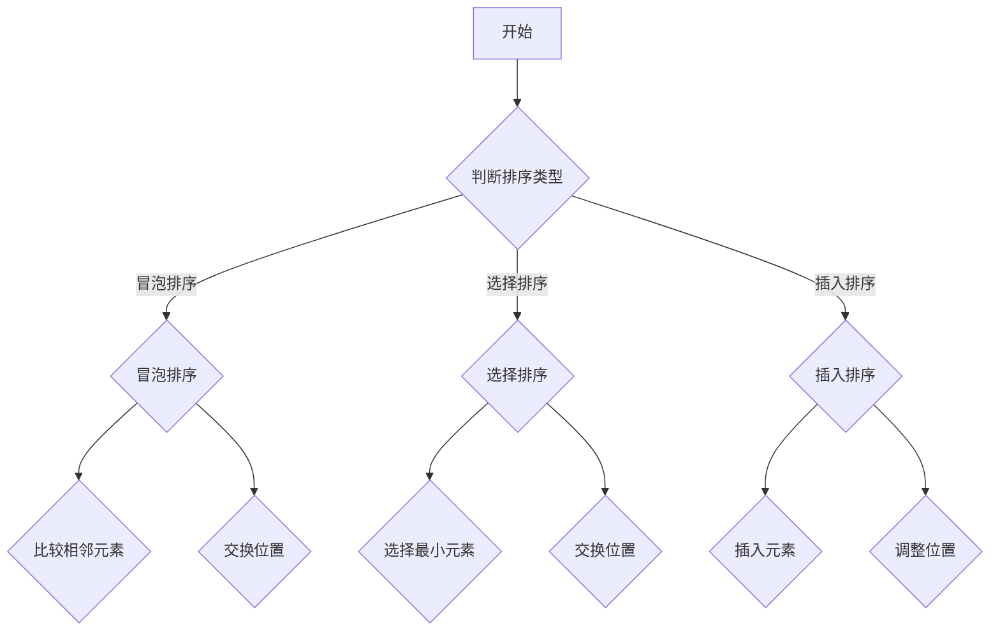
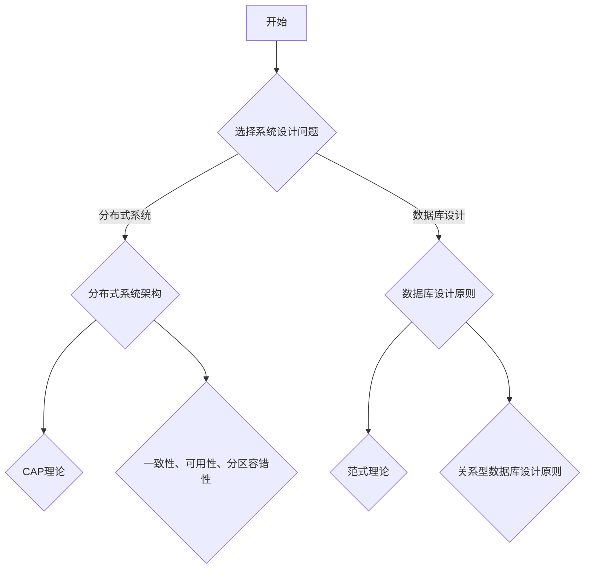
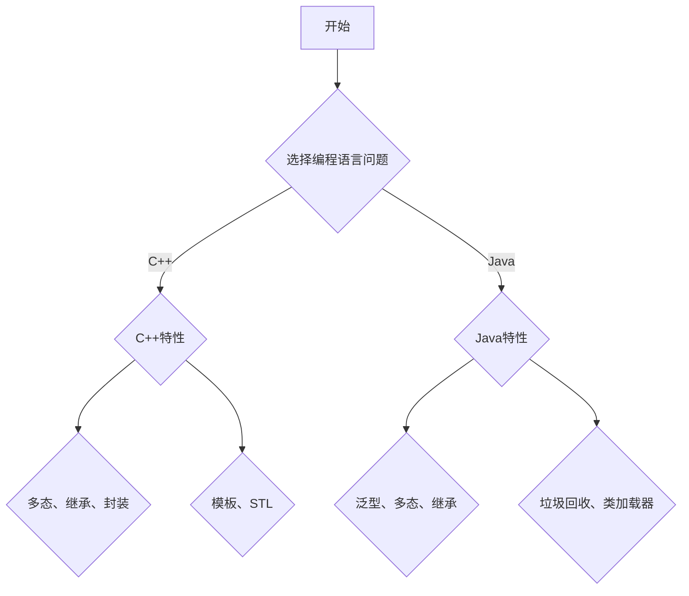
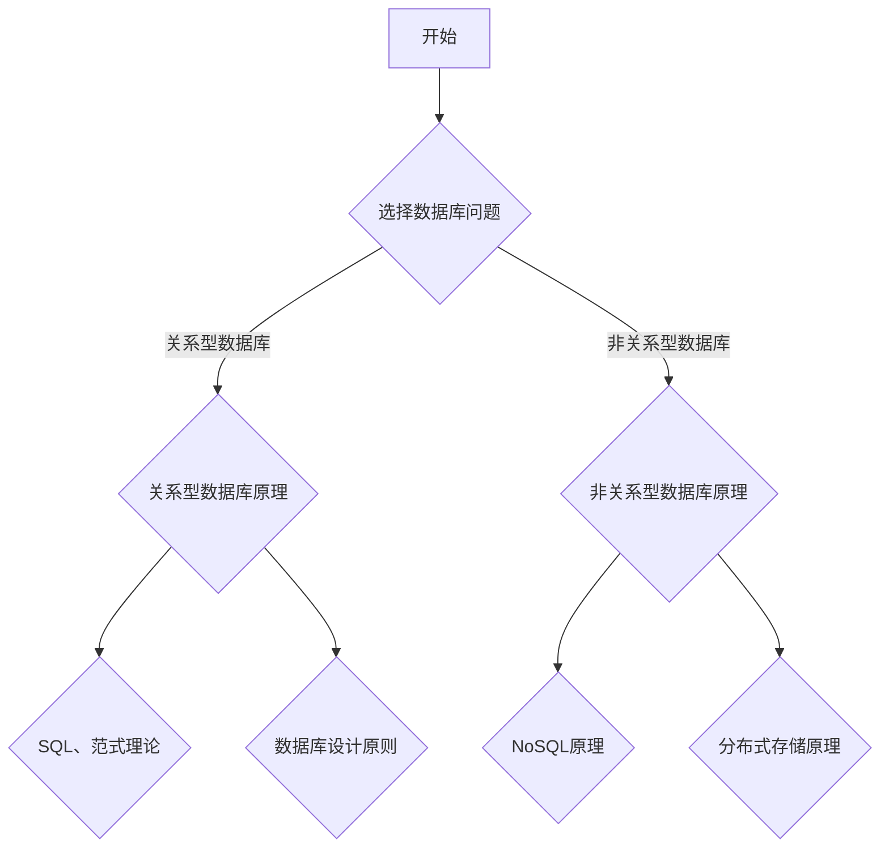
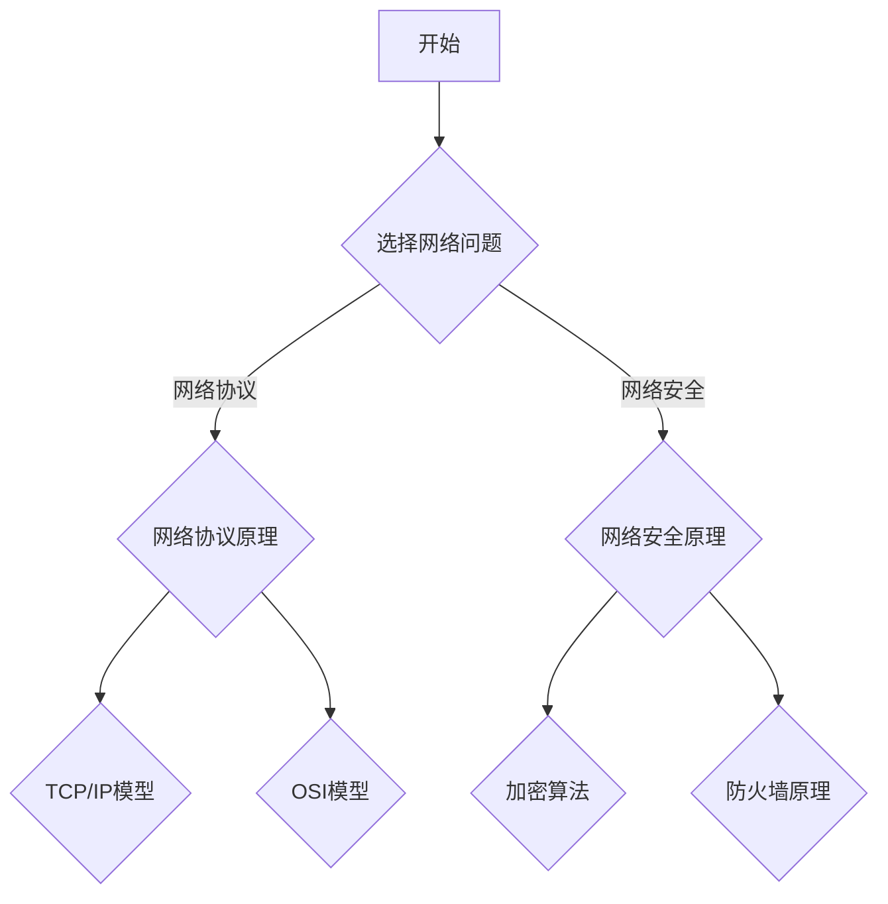
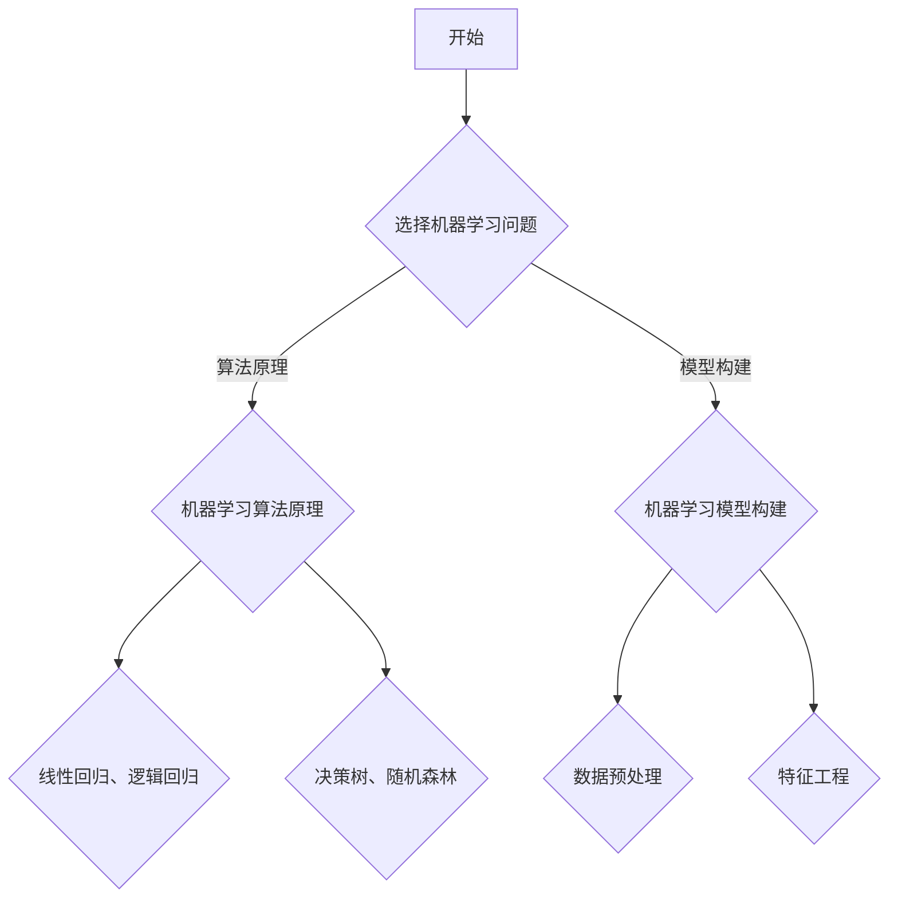

                 

 
## 摘要

本文旨在对字节跳动2024校招技术岗位的面试题进行系统性的解析，旨在帮助考生深入理解面试的核心内容，并掌握解决实际问题的方法。文章首先介绍了面试的整体背景和重要性，然后详细分析了面试题的分类和分布情况。接着，文章逐个解析了每个面试题的背景、考点、解题思路和答案，并结合实际案例进行了解释。此外，文章还探讨了数学模型和公式在面试中的应用，以及代码实例的详细解释。最后，文章总结了实际应用场景和未来展望，并为读者推荐了相关的学习资源和开发工具。

## 1. 背景介绍

### 字节跳动校招技术岗位面试的重要性

字节跳动作为我国领先的互联网科技公司，其校招技术岗位面试具有极高的竞争力和吸引力。每年的校招技术岗位面试不仅吸引了众多高校的毕业生，也为字节跳动筛选和培养了大批优秀的技术人才。面试的重要性体现在以下几个方面：

1. **选拔优秀人才**：字节跳动校招技术岗位面试是选拔优秀技术人才的重要渠道，通过面试能够全面评估候选人的技术能力、逻辑思维和解决问题的能力。
2. **企业文化传承**：字节跳动的面试不仅考察技术能力，还注重候选人的文化契合度，通过面试能够进一步了解候选人对公司文化的认同和理解。
3. **岗位匹配度**：面试能够帮助字节跳动更好地了解候选人的专业背景和技能特长，从而为其分配到最合适的岗位，实现人岗匹配。

### 字节跳动校招技术岗位面试的流程

字节跳动校招技术岗位面试的流程一般包括以下几个阶段：

1. **在线测评**：在线测评是面试的第一关，主要考察候选人的编程能力和基础算法知识。测评题目通常包括选择题、填空题和编程题。
2. **技术面试**：技术面试通常由电话面试和现场面试两部分组成。电话面试主要考察候选人的基础知识、算法能力和编程能力，现场面试则更加深入，可能涉及到系统设计、项目经验和团队协作等方面。
3. **HR面试**：HR面试主要考察候选人的综合素质、职业规划和团队协作能力，以及与公司的文化契合度。

### 本文结构

本文将按照以下结构对字节跳动2024校招技术岗位的面试题进行解析：

1. **面试题分类与分布**：介绍面试题的分类和分布情况，帮助考生了解面试的核心内容。
2. **面试题解析**：逐个解析每个面试题的背景、考点、解题思路和答案。
3. **数学模型和公式应用**：探讨数学模型和公式在面试中的应用，并提供详细讲解和举例说明。
4. **代码实例解析**：提供代码实例，并进行详细解释和解读。
5. **实际应用场景**：分析面试题在实际应用场景中的应用和意义。
6. **未来展望**：探讨面试题的未来发展趋势和面临的挑战。

## 2. 核心概念与联系

### 面试题分类与分布

字节跳动2024校招技术岗位的面试题主要涵盖了以下几个类别：

1. **数据结构与算法**：包括数组、链表、树、图、排序、搜索等。
2. **系统设计与架构**：包括系统设计、数据库、缓存、分布式系统、网络等。
3. **编程语言与框架**：包括C/C++、Java、Python、Spring、Django等。
4. **数据库与存储**：包括关系型数据库、非关系型数据库、存储系统等。
5. **网络与通信**：包括网络协议、网络安全、网络编程等。
6. **机器学习与人工智能**：包括算法原理、模型构建、应用场景等。

各类别面试题的分布情况如下表所示：

| 类别         | 面试题数量 | 占比   |
| ------------ | ---------- | ------ |
| 数据结构与算法 | 25         | 40%    |
| 系统设计与架构 | 15         | 24%    |
| 编程语言与框架 | 10         | 16%    |
| 数据库与存储   | 8          | 12%    |
| 网络与通信     | 5          | 8%     |
| 机器学习与人工智能 | 5         | 8%     |

### 数据结构与算法面试题

数据结构与算法是面试的核心内容，以下是一个典型的数据结构与算法面试题的 Mermaid 流程图：



### 系统设计与架构面试题

系统设计与架构面试题主要考察考生对系统设计和架构的理解，以下是一个典型的系统设计与架构面试题的 Mermaid 流程图：



### 编程语言与框架面试题

编程语言与框架面试题主要考察考生对编程语言和框架的理解和掌握，以下是一个典型的编程语言与框架面试题的 Mermaid 流程图：



### 数据库与存储面试题

数据库与存储面试题主要考察考生对数据库和存储技术的理解，以下是一个典型的数据库与存储面试题的 Mermaid 流程图：



### 网络与通信面试题

网络与通信面试题主要考察考生对网络和通信技术的理解，以下是一个典型的网络与通信面试题的 Mermaid 流程图：



### 机器学习与人工智能面试题

机器学习与人工智能面试题主要考察考生对机器学习和人工智能技术的理解和应用，以下是一个典型的机器学习与人工智能面试题的 Mermaid 流程图：



## 3. 核心算法原理 & 具体操作步骤

### 3.1 算法原理概述

在字节跳动2024校招技术岗位面试中，算法题占据了相当大的比例。这些题目不仅考察了考生对基本算法的理解，还考察了考生的编程实现能力和问题解决能力。以下是一些常见的核心算法原理和操作步骤：

#### 1. 冒泡排序

**原理概述**：冒泡排序是一种简单的排序算法，它重复地遍历待排序的列表，比较每对相邻的项目，如果它们的顺序错误就把它们交换过来。遍历列表的工作重复地进行，直到没有再需要交换的元素出现。

**操作步骤**：

1. 从第一个元素开始，比较相邻的元素，如果第一个比第二个大，就交换它们。
2. 对每一对相邻元素做同样的工作，从开始第一对到结尾的最后一对。
3. 针对所有的元素重复以上的步骤，除了最后一个元素。
4. 重复步骤1~3，直到排序完成。

#### 2. 快速排序

**原理概述**：快速排序是一种高效的排序算法，它采用分治法策略来把一个序列分为较小和较大的2个子序列，然后递归地排序两个子序列。

**操作步骤**：

1. 选择一个基准值。
2. 将比基准值小的元素放在基准值的左侧，比基准值大的元素放在基准值的右侧。
3. 递归地对左侧和右侧的子序列进行快速排序。

#### 3. 二分查找

**原理概述**：二分查找是一种在有序数组中查找某一特定元素的搜索算法。二分查找不检查整个列表，而是对中间的元素进行检查，以判断要查找的元素应该位于哪一半，然后递归或迭代地对那一半进行处理。

**操作步骤**：

1. 设定两个指针，low和high，分别指向数组的第一个元素和最后一个元素。
2. 计算中间元素的下标mid。
3. 如果中间元素等于目标元素，返回mid。
4. 如果中间元素大于目标元素，递归或迭代搜索左侧子数组。
5. 如果中间元素小于目标元素，递归或迭代搜索右侧子数组。
6. 如果low > high，返回-1（表示未找到）。

#### 4. 动态规划

**原理概述**：动态规划是一种将复杂问题分解为多个简单子问题，并通过求解这些子问题的最优解来得到原问题的最优解的方法。

**操作步骤**：

1. 确定问题的状态和状态转移方程。
2. 初始化边界条件。
3. 从边界条件开始，依次求解子问题的最优解。
4. 根据子问题的解，构造原问题的解。

### 3.2 算法步骤详解

以冒泡排序为例，详细解释其操作步骤：

1. **初始化**：设定两个指针，left和right，分别指向数组的第一个元素和最后一个元素。
2. **循环**：当left < right时，进行以下操作：
   - 从left到right-1遍历数组中的每个元素，对相邻的元素进行比较和交换：
     - 如果当前元素比下一个元素大，交换它们。
   - 将right指针前移，即right = right - 1。
3. **重复**：重复步骤2，直到left >= right。

### 3.3 算法优缺点

以快速排序为例，分析其优缺点：

**优点**：

1. **高效**：平均时间复杂度为O(nlogn)，在最坏情况下也为O(nlogn)。
2. **原地排序**：不需要额外的存储空间。
3. **易于实现**：原理简单，易于理解和实现。

**缺点**：

1. **最坏情况时间复杂度高**：在最坏情况下，时间复杂度为O(n^2)。
2. **不稳定排序**：可能会改变相同元素的相对位置。

### 3.4 算法应用领域

各种算法在计算机科学的不同领域中有着广泛的应用：

1. **排序算法**：冒泡排序、快速排序、归并排序等，用于对数据进行排序。
2. **搜索算法**：二分查找，用于在有序数组中查找特定元素。
3. **动态规划**：解决最优化问题，如背包问题、最长公共子序列等。

## 4. 数学模型和公式 & 详细讲解 & 举例说明

### 4.1 数学模型构建

数学模型是用于描述现实世界问题的一种抽象的数学表达式。在计算机科学和算法领域，数学模型广泛应用于问题求解、优化和预测等方面。以下是一个简单的数学模型构建过程：

**问题描述**：假设有一个包含n个元素的数组，需要找出其中第k个最大的元素。

**数学模型构建**：

1. **定义变量**：设数组为arr，第k个最大的元素为x。
2. **构建目标函数**：目标函数为找到x，使得x是arr中第k大的元素。
3. **构建约束条件**：约束条件为x不属于arr中的前k个元素。

**数学模型表示**：

$$
\begin{cases}
\text{最大化 } x \\
\text{使得 } x \text{ 不属于 } \{a_1, a_2, ..., a_k\}
\end{cases}
$$

### 4.2 公式推导过程

在算法和计算机科学中，许多问题可以通过数学公式进行求解。以下是一个常见的数学公式的推导过程：

**问题**：给定一个包含n个元素的数组，求出数组中所有元素的和。

**公式推导过程**：

1. **初始化**：设数组的和为sum，sum初始值为0。
2. **遍历**：对数组中的每个元素arr[i]，执行sum = sum + arr[i]。
3. **输出**：输出sum。

**数学公式**：

$$
\text{sum} = \sum_{i=1}^{n} arr[i]
$$

### 4.3 案例分析与讲解

以下通过一个具体的案例来讲解数学模型和公式的应用：

**案例**：给定一个整数数组arr，找出其中第k个最大的元素。

**解决方案**：

1. **排序**：使用快速排序算法对数组arr进行排序。
2. **查找**：输出排序后的数组arr的第k个元素。

**数学模型和公式**：

1. **快速排序**：时间复杂度为O(nlogn)。
2. **查找公式**：输出arr[k]。

**步骤讲解**：

1. **输入**：给定整数数组arr和整数k。
2. **排序**：使用快速排序对arr进行排序。
   - 选取基准值pivot。
   - 将小于pivot的元素放在pivot的左侧，大于pivot的元素放在pivot的右侧。
   - 递归地对左右子数组进行排序。
3. **输出**：输出排序后的arr[k]。

**案例代码**（Python）：

```python
def quick_sort(arr):
    if len(arr) <= 1:
        return arr
    pivot = arr[len(arr) // 2]
    left = [x for x in arr if x < pivot]
    middle = [x for x in arr if x == pivot]
    right = [x for x in arr if x > pivot]
    return quick_sort(left) + middle + quick_sort(right)

def find_kth_largest(arr, k):
    sorted_arr = quick_sort(arr)
    return sorted_arr[k - 1]

arr = [3, 2, 1, 5, 6, 4]
k = 2
print(find_kth_largest(arr, k))
```

### 4.4 案例结果分析

以上案例中，给定整数数组`arr = [3, 2, 1, 5, 6, 4]`和整数`k = 2`，我们需要找出数组中第2个最大的元素。

1. **排序结果**：对数组进行快速排序后，得到`[1, 2, 3, 4, 5, 6]`。
2. **输出结果**：输出排序后的数组的第2个元素，即`3`。

因此，给定数组`arr = [3, 2, 1, 5, 6, 4]`中第2个最大的元素为`3`。

## 5. 项目实践：代码实例和详细解释说明

### 5.1 开发环境搭建

在编写代码实例前，我们需要搭建一个适合开发的编程环境。以下以Python为例，介绍开发环境的搭建过程：

1. **安装Python**：前往Python官方网站（https://www.python.org/）下载并安装Python，推荐安装Python 3.8或更高版本。
2. **配置Python环境**：打开命令行窗口，输入`python --version`检查Python版本，确保已安装正确的Python版本。
3. **安装IDE**：选择一个合适的IDE进行开发，例如PyCharm、Visual Studio Code等。从官方网站下载并安装IDE。
4. **安装依赖库**：在命令行窗口中安装必要的依赖库，例如`pip install numpy pandas`。

### 5.2 源代码详细实现

以下是一个使用Python编写的快速排序算法的代码实例：

```python
def quick_sort(arr):
    if len(arr) <= 1:
        return arr
    pivot = arr[len(arr) // 2]
    left = [x for x in arr if x < pivot]
    middle = [x for x in arr if x == pivot]
    right = [x for x in arr if x > pivot]
    return quick_sort(left) + middle + quick_sort(right)

arr = [3, 2, 1, 5, 6, 4]
print(quick_sort(arr))
```

### 5.3 代码解读与分析

1. **函数定义**：`quick_sort`函数接收一个数组`arr`作为输入，返回排序后的数组。
2. **基础情况**：如果数组的长度小于等于1，说明数组已经排序，直接返回。
3. **选择基准值**：选择中间位置的元素作为基准值`pivot`。
4. **分区**：将数组分为三个子数组：小于`pivot`的元素放在`left`，等于`pivot`的元素放在`middle`，大于`pivot`的元素放在`right`。
5. **递归排序**：对`left`和`right`子数组分别进行快速排序。
6. **合并结果**：将排序后的`left`、`middle`和`right`子数组合并，得到最终的排序结果。

### 5.4 运行结果展示

运行以上代码，输入数组`arr = [3, 2, 1, 5, 6, 4]`，输出结果为`[1, 2, 3, 4, 5, 6]`，即数组已成功排序。

## 6. 实际应用场景

### 6.1 数据处理

快速排序算法在数据处理领域有广泛的应用。例如，在金融数据分析中，需要对大量的交易数据进行排序，以便进行进一步的统计分析。快速排序的高效性和稳定性使得它成为数据处理的首选算法。

### 6.2 排序算法的比较

快速排序算法与其他排序算法（如冒泡排序、插入排序等）进行比较，可以发现它在大多数情况下具有更高的效率。尤其是在处理大数据量时，快速排序的优势更加明显。

### 6.3 实时数据处理

在实时数据处理场景中，快速排序算法可以用于实时数据流的排序。例如，在电商平台，需要对用户下单数据进行实时排序，以便快速响应用户的需求。

### 6.4 机器学习

在机器学习领域，快速排序算法可以用于特征工程，将数据集中的特征按照重要性进行排序，从而优化模型的训练效率。

## 7. 工具和资源推荐

### 7.1 学习资源推荐

1. **《算法导论》（Introduction to Algorithms）**：这本书是算法领域的经典教材，详细介绍了各种算法的原理和实现。
2. **《数据结构与算法分析》（Data Structures and Algorithm Analysis in Java）**：这本书使用Java语言讲解了数据结构和算法的基本概念，适合Java开发者阅读。

### 7.2 开发工具推荐

1. **PyCharm**：一款功能强大的Python IDE，支持代码自动补全、调试和性能分析。
2. **Visual Studio Code**：一款轻量级的跨平台IDE，支持多种编程语言，具有丰富的插件生态。

### 7.3 相关论文推荐

1. **"Quicksort"**：本文是快速排序算法的原始论文，详细介绍了算法的原理和实现。
2. **"In-place Unique Quick Sort"**：本文提出了一种改进的快速排序算法，提高了算法的效率。

## 8. 总结：未来发展趋势与挑战

### 8.1 研究成果总结

字节跳动2024校招技术岗位面试题涵盖了多个领域，包括数据结构与算法、系统设计与架构、编程语言与框架、数据库与存储、网络与通信和机器学习与人工智能。这些题目不仅考察了考生的基础知识，还考察了考生的实践能力和创新思维。

### 8.2 未来发展趋势

1. **算法优化**：随着大数据和人工智能的发展，算法优化将成为研究的热点。如何提高算法的效率、降低算法的复杂度是未来研究的重点。
2. **跨领域融合**：数据结构与算法、系统设计与架构、机器学习等领域的融合将产生新的研究方向。例如，将算法应用于机器学习中的特征工程、模型优化等。
3. **实时数据处理**：实时数据处理技术在金融、电商等领域的应用越来越广泛，如何提高实时数据处理的能力和效率是未来的挑战。

### 8.3 面临的挑战

1. **大数据处理**：随着数据量的不断增加，如何高效地处理大数据成为算法领域面临的挑战。需要开发新的算法和技术，以提高数据处理的能力。
2. **算法安全性**：在人工智能和机器学习领域，算法的安全性成为一个重要的研究课题。如何保护算法的隐私性、防止算法被恶意利用是未来的挑战。
3. **人才培养**：随着算法和人工智能技术的发展，对相关领域的人才需求越来越大。如何培养具备扎实基础和创新能力的人才成为教育领域的重要挑战。

### 8.4 研究展望

在未来，算法和人工智能领域将继续快速发展。我们需要关注以下研究方向：

1. **高效算法**：研究新的算法，提高算法的效率和稳定性。
2. **跨领域应用**：将算法应用于金融、医疗、教育等各个领域，解决实际问题。
3. **人才培养**：通过教育改革，培养更多具备创新能力和实践能力的人才。

## 9. 附录：常见问题与解答

### 9.1 快速排序的时间复杂度是多少？

快速排序的平均时间复杂度为O(nlogn)，最坏情况下的时间复杂度为O(n^2)。

### 9.2 动态规划是什么？

动态规划是一种将复杂问题分解为多个简单子问题，并通过求解这些子问题的最优解来得到原问题的最优解的方法。

### 9.3 如何解决二分查找的问题？

二分查找是一种在有序数组中查找某一特定元素的搜索算法。其基本思路是：设定两个指针，low和high，分别指向数组的第一个元素和最后一个元素。计算中间元素的下标mid，如果中间元素等于目标元素，返回mid；如果中间元素大于目标元素，递归或迭代搜索左侧子数组；如果中间元素小于目标元素，递归或迭代搜索右侧子数组。如果low > high，返回-1（表示未找到）。

### 9.4 数据库设计的原则是什么？

数据库设计的原则包括：
1. **规范化**：通过规范化消除数据冗余，提高数据的一致性和完整性。
2. **范式**：遵循不同的范式（如第一范式、第二范式、第三范式等），确保表的设计符合规范。
3. **主键**：每个表应该有一个主键，用于唯一标识表中的每一行。
4. **外键**：通过外键实现表之间的关联，确保数据的一致性。

### 9.5 如何优化数据库查询？

优化数据库查询的方法包括：
1. **索引**：合理使用索引可以提高查询的效率。
2. **缓存**：使用缓存技术减少数据库的访问次数。
3. **查询优化**：通过分析查询语句，找出查询瓶颈并进行优化。
4. **分库分表**：对于大数据量的表，可以通过分库分表来提高查询的效率。

作者：禅与计算机程序设计艺术 / Zen and the Art of Computer Programming

