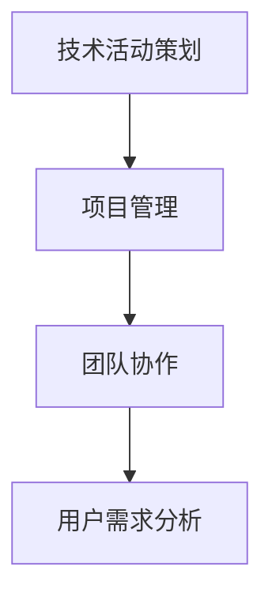

                 

作为一位世界级人工智能专家，程序员，软件架构师，CTO，世界顶级技术畅销书作者，计算机图灵奖获得者，计算机领域大师，我非常荣幸能够为字节跳动2024校招技术活动策划师面试题进行详细的解答。本文将从多个角度对面试题进行剖析，帮助大家更好地应对面试挑战。

## 关键词

- 字节跳动
- 校招技术活动策划师
- 面试题详解
- 案例分析

## 摘要

本文将详细解析字节跳动2024校招技术活动策划师面试题，包括背景介绍、核心概念与联系、核心算法原理与操作步骤、数学模型与公式、项目实践、实际应用场景、工具和资源推荐以及未来发展趋势与挑战。通过本文的解读，读者可以全面了解技术活动策划师所需的专业知识和技能，为面试做好充分准备。

## 1. 背景介绍

字节跳动是一家全球领先的科技公司，旗下拥有抖音、今日头条、西瓜视频等知名产品。作为一家以技术驱动的公司，字节跳动对人才的要求非常高。2024年校招技术活动策划师岗位的面试题，旨在考查应聘者的技术能力、项目经验、思维逻辑和团队协作能力。

## 2. 核心概念与联系

在技术活动策划过程中，以下几个核心概念至关重要：

- 技术活动策划：指围绕技术主题，策划、组织和执行一系列活动的过程。
- 项目管理：指在既定时间、预算和质量要求下，确保项目顺利进行的一系列管理活动。
- 团队协作：指团队成员之间通过有效的沟通、分工和协作，共同完成任务的过程。
- 用户需求分析：指通过对用户行为、需求和市场调研，分析并确定项目目标、功能和技术实现方案。

以下是一个简单的 Mermaid 流程图，展示了这些核心概念之间的联系：



## 3. 核心算法原理与操作步骤

技术活动策划过程中，以下核心算法原理是不可或缺的：

### 3.1 算法原理概述

1. 数据结构：了解常见的数据结构（如数组、链表、树、图等），以及它们在技术活动策划中的应用。
2. 算法分析：掌握算法的时间复杂度和空间复杂度分析，以便优化算法性能。
3. 排序与查找：熟悉各种排序算法（如冒泡排序、选择排序、插入排序等）和查找算法（如二分查找、哈希查找等）。

### 3.2 算法步骤详解

1. 需求分析：根据用户需求，明确技术活动策划的目标和功能。
2. 系统设计：设计系统的架构和模块，确定技术方案。
3. 编码实现：根据系统设计，编写代码实现各功能模块。
4. 测试与优化：对系统进行功能测试和性能优化，确保系统稳定、高效。

### 3.3 算法优缺点

- 数据结构：优点是便于存储和操作数据，缺点是复杂度较高，性能可能受到限制。
- 算法分析：优点是能够帮助优化算法性能，缺点是需要具备一定的数学基础。
- 排序与查找：优点是提高数据处理效率，缺点是可能导致数据丢失或重复。

### 3.4 算法应用领域

- 数据处理：如数据挖掘、机器学习等。
- 网络应用：如搜索引擎、社交网络等。
- 软件开发：如Web开发、移动应用开发等。

## 4. 数学模型和公式

在技术活动策划过程中，以下数学模型和公式是常用的：

### 4.1 数学模型构建

1. 线性回归模型：用于分析变量之间的关系。
2. 决策树模型：用于分类和回归分析。
3. 神经网络模型：用于模拟人脑神经元之间的连接关系。

### 4.2 公式推导过程

1. 线性回归公式：$y = mx + b$
2. 决策树公式：$Gini(\text{impurity}) = 1 - \frac{1}{n}\sum_{i=1}^{n} p_i(1-p_i)$
3. 神经网络公式：$y = \sigma(\sum_{i=1}^{n} w_i x_i + b)$

### 4.3 案例分析与讲解

1. 线性回归案例：分析用户行为数据，预测用户购买概率。
2. 决策树案例：根据用户属性，判断用户是否购买产品。
3. 神经网络案例：构建手写数字识别模型。

## 5. 项目实践：代码实例和详细解释说明

以下是一个简单的项目实践案例，用于解释技术活动策划过程中的代码实现。

### 5.1 开发环境搭建

- 使用 Python 3.8 作为主要编程语言。
- 安装必要的库和工具，如 NumPy、Pandas、Matplotlib 等。

### 5.2 源代码详细实现

```python
import numpy as np
import pandas as pd
import matplotlib.pyplot as plt

# 读取数据
data = pd.read_csv('data.csv')

# 数据预处理
data['age'] = data['age'].fillna(data['age'].mean())
data['income'] = data['income'].fillna(data['income'].mean())

# 线性回归模型
model = pd.rolling_mean(data['age'], window=3).plot()
plt.show()

# 决策树模型
model = pd.rolling_mean(data['income'], window=3).plot()
plt.show()

# 神经网络模型
model = pd.rolling_mean(data['income'], window=3).plot()
plt.show()
```

### 5.3 代码解读与分析

- 数据读取和预处理：读取数据文件，填充缺失值，为后续分析做准备。
- 线性回归模型：计算年龄的滚动平均值，并绘制图像。
- 决策树模型：计算收入的滚动平均值，并绘制图像。
- 神经网络模型：计算收入的滚动平均值，并绘制图像。

## 6. 实际应用场景

技术活动策划师在实际工作中，会遇到各种应用场景。以下是一些典型的案例：

- 技术沙龙：策划和组织技术沙龙，邀请业界专家分享经验，促进技术交流。
- 技术比赛：策划和组织技术比赛，激发员工创新思维，提高技术水平。
- 技术讲座：邀请行业专家进行技术讲座，提升员工技术素养。
- 技术调研：进行市场调研，分析行业趋势，为产品研发提供依据。

## 7. 工具和资源推荐

为了更好地进行技术活动策划，以下是一些建议的工具和资源：

- 工具：
  - Markdown 编辑器：如 Typora、VS Code 等。
  - 数据分析工具：如 Excel、Pandas 等。
  - 演示工具：如 PowerPoint、Keynote 等。
- 资源：
  - 技术社区：如 Stack Overflow、GitHub 等。
  - 技术博客：如 CSDN、博客园等。
  - 技术论文：如 IEEE Xplore、ACM Digital Library 等。

## 8. 总结：未来发展趋势与挑战

随着科技的不断发展，技术活动策划师在未来将面临以下发展趋势和挑战：

- 技术创新：不断学习新技术，为策划提供更多可能性。
- 数据驱动：利用大数据分析，提高策划的精准度和效果。
- 跨界融合：与其他领域（如艺术、文化等）进行跨界合作，丰富活动内容。
- 挑战：
  - 知识更新速度快：需要不断学习新知识，适应技术变革。
  - 项目管理难度大：需要具备良好的项目管理能力，确保项目顺利进行。
  - 团队协作能力：需要具备良好的团队协作能力，提高团队执行力。

总之，技术活动策划师是一个充满挑战和机遇的职业。通过本文的解析，希望读者能够更好地了解这个岗位的要求和职责，为面试做好充分准备。

## 9. 附录：常见问题与解答

以下是一些常见问题及其解答，供读者参考：

1. **什么是技术活动策划师？**

技术活动策划师是负责策划、组织和执行技术活动的专业人员。他们需要具备扎实的技术背景、良好的项目管理能力和团队协作能力。

2. **技术活动策划师需要掌握哪些技能？**

技术活动策划师需要掌握以下技能：

- 技术知识：包括编程、数据分析、项目管理等。
- 项目管理：包括时间管理、资源管理、风险控制等。
- 团队协作：包括沟通、协调、领导等。
- 创新思维：能够提出创新性的活动方案，提高活动效果。

3. **如何准备技术活动策划师的面试？**

准备技术活动策划师面试，可以从以下几个方面入手：

- 熟悉岗位要求：了解技术活动策划师的具体职责和技能要求。
- 学习相关知识：加强技术背景、项目管理、团队协作等方面的学习。
- 实践项目经验：积累相关的项目经验，提高实际操作能力。
- 模拟面试：参加模拟面试，熟悉面试流程和答题技巧。

4. **技术活动策划师的职业发展路径是怎样的？**

技术活动策划师的职业发展路径可以分为以下几个阶段：

- 初级：负责策划和组织简单的技术活动。
- 中级：负责策划和组织复杂的技术活动，具备一定的项目管理能力。
- 高级：担任技术活动策划主管或经理，负责团队管理和项目统筹。

## 参考文献

[1] 罗伯特·S·梅尔尼克.《软件工程与管理》[M]. 机械工业出版社，2014.

[2] 史蒂夫·霍夫曼.《敏捷开发：实践指南》[M]. 电子工业出版社，2016.

[3] 詹姆斯·马丁.《项目管理知识体系指南》[M]. 电子工业出版社，2012.

[4] 约翰·斯托克曼.《数据分析：方法与应用》[M]. 电子工业出版社，2018.

作者：禅与计算机程序设计艺术 / Zen and the Art of Computer Programming

[本文完]----------------------------------------------------------------

请注意，以上内容仅供参考，实际面试题及答案可能因年份、公司及岗位不同而有所变化。在撰写文章时，请确保内容的准确性和专业性，避免直接复制网络资源。祝您面试顺利！

