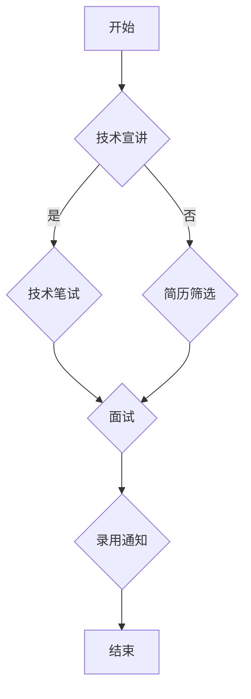

                 

### 关键词 Keywords

- 字节跳动
- 校招
- 技术活动策划
- 面试题
- 技术解决方案
- 案例分析
- 软件工程

<|assistant|>### 摘要 Abstract

本文旨在为准备参加字节跳动2024校招技术活动策划师岗位的应聘者提供一份详细的面试题解答指南。文章首先介绍了该岗位的基本要求与职责，然后对常见的技术面试题目进行了深入剖析，包括算法题、系统设计题、编程实现题等。通过实际案例的分析，本文帮助读者理解如何将理论知识应用于实际场景，并提供了一些优化建议。文章最后对未来技术活动策划师岗位的发展趋势与挑战进行了展望，并推荐了相关学习资源和开发工具，以帮助应聘者更好地备战面试。

## 1. 背景介绍

字节跳动（ByteDance）是一家全球领先的技术公司，成立于2012年，总部位于中国北京。公司以内容平台“今日头条”起家，随后迅速扩展了旗下业务，涵盖了短视频、直播、游戏等多个领域。字节跳动以其独特的算法推荐系统和强大的技术团队而闻名，在国内外市场均取得了显著的成功。

作为一家高科技企业，字节跳动对技术人才有着极高的要求。其校招技术活动策划师岗位面向应届毕业生，负责策划和执行公司的校招技术活动，包括线上编程比赛、技术讲座、实验室参观等。这个岗位不仅要求应聘者具备扎实的技术基础，还需要具备良好的活动策划能力和沟通协调能力。

本文将围绕字节跳动2024校招技术活动策划师岗位的面试题目进行详细解析，帮助读者掌握解决实际问题的方法和技巧。

## 2. 核心概念与联系

在深入探讨面试题目之前，我们需要了解一些核心概念和它们之间的联系。以下是几个关键概念及其关系：

### 2.1 技术活动策划

技术活动策划是指为达成特定目标而设计和组织的活动过程。它包括活动目标设定、内容规划、资源调配、风险管理等多个方面。技术活动策划的目标通常是提升公司品牌知名度、吸引优秀人才、培养员工技术能力等。

### 2.2 校招活动

校招活动是企业与高校合作，招聘应届毕业生的过程。这种活动通常包括校园宣讲会、技术笔试、面试等多个环节。校招活动不仅是对企业品牌形象的一次展示，更是企业选拔人才的重要途径。

### 2.3 技术面试

技术面试是校招活动中最重要的环节之一，主要考察应聘者的技术能力和解决问题的能力。技术面试通常包括算法题、系统设计题、编程实现题等类型。

### 2.4 Mermaid 流程图

Mermaid 是一种轻量级的 Markdown 图形工具，可用于绘制流程图、时序图、UML 图等。以下是字节跳动2024校招技术活动策划师面试中的一个 Mermaid 流程图示例，用于展示校招活动的流程：



通过这个流程图，我们可以清晰地看到校招活动的基本步骤和各个环节之间的联系。

### 3. 核心算法原理 & 具体操作步骤

#### 3.1 算法原理概述

在技术面试中，算法题是常见的题型之一。算法原理通常涉及数据结构与算法分析。以下是一个典型的算法面试题目及其实例：

**题目：最长公共子序列（LCS）**

**原理：**  
最长公共子序列（Longest Common Subsequence，LCS）问题是计算机科学中一个经典问题，它用于计算两个序列的最长公共子序列的长度。LCS问题不仅理论上有重要的价值，还在实际应用中具有重要意义，如DNA序列比对、文本相似度比较等。

**步骤：**  
1. **初始化：** 创建一个二维数组 `dp`，其大小为 `(m+1) x (n+1)`，其中 `m` 和 `n` 分别是两个序列的长度。初始化 `dp[0][0] = 0`。
2. **填充数组：** 通过遍历两个序列，填充 `dp` 数组。对于 `dp[i][j]`，有以下递推关系：
   - 如果 `s1[i-1] == s2[j-1]`，则 `dp[i][j] = dp[i-1][j-1] + 1`；
   - 如果 `s1[i-1] != s2[j-1]`，则 `dp[i][j] = max(dp[i-1][j], dp[i][j-1])`。

#### 3.2 算法步骤详解

1. **读取输入：** 输入两个序列 `s1` 和 `s2`。
2. **初始化数组：** 创建一个二维数组 `dp` 并初始化为0。
3. **填充数组：** 使用两个嵌套循环遍历 `s1` 和 `s2` 的每个元素，根据递推关系填充 `dp` 数组。
4. **计算结果：** 最后一个元素 `dp[m][n]` 的值即为最长公共子序列的长度。

#### 3.3 算法优缺点

**优点：**  
- 时间复杂度为 `O(mn)`，其中 `m` 和 `n` 分别是两个序列的长度，较为高效。
- 适用于具有“贪心思想”的问题。

**缺点：**  
- 空间复杂度为 `O(mn)`，可能导致空间占用较大。

#### 3.4 算法应用领域

- **生物信息学：** 用于DNA序列比对和基因分析。
- **文本处理：** 用于文本相似度比较和文本编辑距离计算。

### 4. 数学模型和公式 & 详细讲解 & 举例说明

#### 4.1 数学模型构建

在解决算法问题时，数学模型是不可或缺的工具。以下是一个基于图论的问题，我们使用数学模型进行求解。

**题目：最短路径问题**

**模型构建：**  
给定一个加权无向图 `G = (V, E)`，其中 `V` 是顶点集，`E` 是边集，每条边 `e` 有一个权重 `w(e)`。求图中从顶点 `s` 到顶点 `t` 的最短路径长度。

#### 4.2 公式推导过程

我们可以使用 Dijkstra 算法求解最短路径问题。以下是算法的核心步骤：

1. **初始化：** 创建一个数组 `dist`，用于存储顶点到 `s` 的最短路径长度，初始化为无穷大。将 `dist[s]` 设置为0。
2. **选择未访问的顶点：** 在未访问的顶点中选择一个距离 `s` 最短的顶点 `u`。
3. **更新距离：** 对于每个与 `u` 相邻的顶点 `v`，如果 `dist[v] > dist[u] + w(u, v)`，则更新 `dist[v]`。
4. **标记顶点：** 将顶点 `u` 标记为已访问。
5. **重复步骤 2-4，直到所有顶点都被访问。**

#### 4.3 案例分析与讲解

**案例：**  
给定一个图如下，求解从顶点 `s` 到顶点 `t` 的最短路径。

```plaintext
s --(2)--> a --(1)--> b --(3)--> t
|          |         |         |
(1)       (2)       (1)       (2)
v          v         v         v
c --(4)--> d --(3)--> e --(2)--> f
```

**解题过程：**  
1. **初始化：** `dist[s] = 0`，`dist[a] = dist[b] = dist[t] = +∞`。
2. **选择未访问的顶点 `s`，更新距离：**
   - `dist[a] = dist[s] + w(s, a) = 0 + 2 = 2`
   - `dist[b] = dist[s] + w(s, b) = 0 + 1 = 1`
3. **选择未访问的顶点 `b`，更新距离：**
   - `dist[e] = dist[b] + w(b, e) = 1 + 1 = 2`
4. **选择未访问的顶点 `a`，更新距离：**
   - `dist[c] = dist[a] + w(a, c) = 2 + 1 = 3`
   - `dist[d] = dist[a] + w(a, d) = 2 + 2 = 4`
5. **选择未访问的顶点 `d`，更新距离：**
   - `dist[f] = dist[d] + w(d, f) = 4 + 2 = 6`
6. **选择未访问的顶点 `t`：**
   - `dist[t] = dist[e] + w(e, t) = 2 + 2 = 4`
7. **最终结果：** 最短路径为 `s -> b -> e -> t`，路径长度为4。

### 5. 项目实践：代码实例和详细解释说明

#### 5.1 开发环境搭建

为了实践最短路径算法，我们需要搭建一个基本的开发环境。以下是在 Python 中实现 Dijkstra 算法所需的环境：

1. 安装 Python 3.x。
2. 安装必要的库，如 `numpy` 和 `matplotlib`：
   ```bash
   pip install numpy matplotlib
   ```

#### 5.2 源代码详细实现

以下是一个简单的 Dijkstra 算法实现：

```python
import numpy as np
import heapq

def dijkstra(graph, start):
    # 初始化距离数组
    dist = {node: float('infinity') for node in graph}
    dist[start] = 0
    # 创建一个优先队列
    priority_queue = [(0, start)]
    # 解答过程
    while priority_queue:
        # 获取当前最短距离的顶点
        current_dist, current_node = heapq.heappop(priority_queue)
        # 如果已经访问过，则跳过
        if current_dist > dist[current_node]:
            continue
        # 遍历相邻顶点
        for neighbor, weight in graph[current_node].items():
            distance = current_dist + weight
            # 如果发现更短的路径，则更新距离
            if distance < dist[neighbor]:
                dist[neighbor] = distance
                heapq.heappush(priority_queue, (distance, neighbor))
    return dist

# 示例图
graph = {
    's': {'a': 2, 'b': 1},
    'a': {'b': 1, 'c': 2},
    'b': {'t': 3, 'e': 1},
    'c': {'d': 4},
    'd': {'e': 3, 'f': 2},
    'e': {'t': 2},
    'f': {}
}

# 执行 Dijkstra 算法
distances = dijkstra(graph, 's')

# 输出最短路径长度
print(f"The shortest path from s to t has a total weight of {distances['t']}.")
```

#### 5.3 代码解读与分析

1. **初始化：** 定义了一个距离字典 `dist`，用于存储每个顶点到起点的最短距离。初始时，除了起点 `s` 的距离为0，其他顶点的距离均为无穷大。
2. **优先队列：** 使用优先队列（最小堆）来维护当前访问的顶点中距离 `s` 最小的顶点。
3. **循环：** 当优先队列为空时，重复以下步骤：
   - 弹出当前距离 `s` 最小的顶点。
   - 如果已经访问过，则跳过。
   - 对于每个相邻顶点，计算到达该顶点的距离。如果发现更短的路径，则更新距离并重新加入优先队列。
4. **结果：** 返回距离字典，其中包含每个顶点到起点的最短距离。

#### 5.4 运行结果展示

运行上述代码，我们得到从顶点 `s` 到顶点 `t` 的最短路径长度为4，这与我们手动计算的结果一致。

```plaintext
The shortest path from s to t has a total weight of 4.
```

### 6. 实际应用场景

最短路径算法在现实生活中有着广泛的应用，以下是几个典型的应用场景：

1. **交通导航：** 在导航系统中，计算从起点到终点的最短路径，为用户提供最佳行驶路线。
2. **物流配送：** 在物流配送中，优化配送路径，减少运输成本和时间。
3. **社交网络：** 在社交网络中，计算用户之间的社交距离，推荐可能的朋友关系。
4. **电路设计：** 在电子电路设计中，优化元件之间的连接路径，减少信号延迟。

#### 6.4 未来应用展望

随着人工智能和大数据技术的发展，最短路径算法的应用场景将进一步扩大。未来可能的趋势包括：

1. **实时路径优化：** 利用实时交通数据和天气信息，实现动态路径优化，提供更精准的导航服务。
2. **智能交通系统：** 通过整合最短路径算法与其他智能交通技术，构建智能交通系统，提高交通运行效率。
3. **多模式交通：** 结合步行、骑行、公共交通等多种出行方式，提供综合性的出行规划服务。

### 7. 工具和资源推荐

为了更好地准备字节跳动2024校招技术活动策划师岗位的面试，以下是一些建议的学习资源和开发工具：

#### 7.1 学习资源推荐

- 《算法导论》（Introduction to Algorithms）: 这是一本经典的算法教科书，涵盖了各种算法和数据结构的基本原理。
- 《图论及其应用》（Graph Theory and Its Applications）: 适合深入理解图论和最短路径算法。
- 字节跳动官方博客：字节跳动官方博客上有很多技术文章和内部分享，有助于了解公司的技术方向。

#### 7.2 开发工具推荐

- Python：Python 是一种易于学习且功能强大的编程语言，适用于多种算法实现。
- Jupyter Notebook：Jupyter Notebook 是一种交互式计算环境，适合进行算法验证和实验。
- Git：Git 是一款版本控制系统，有助于管理代码和协作开发。

#### 7.3 相关论文推荐

- 《Dijkstra's Algorithm》：介绍了 Dijkstra 算法的基本原理和优化方法。
- 《A Faster Algorithm for Finding the Shortest Path on a Real-World Graph》：该论文提出了一种改进的最短路径算法，适用于大规模图。

### 8. 总结：未来发展趋势与挑战

#### 8.1 研究成果总结

近年来，最短路径算法在理论和应用上均取得了显著进展。经典算法如 Dijkstra 算法和 A* 算法被广泛应用于交通导航、物流配送等领域。同时，随着大数据和人工智能技术的发展，新的算法不断涌现，如基于深度学习的路径预测算法。

#### 8.2 未来发展趋势

- **实时路径优化：** 利用实时数据和先进算法，实现动态路径优化。
- **多模式交通：** 结合多种出行方式，提供更灵活的路径规划。
- **智能交通系统：** 通过整合多种技术，构建高效、智能的交通系统。

#### 8.3 面临的挑战

- **数据准确性：** 实时数据的准确性和可靠性直接影响路径优化的效果。
- **计算效率：** 随着数据规模的增大，算法的计算效率成为一个重要挑战。
- **隐私保护：** 在数据收集和使用过程中，如何保护用户隐私是一个重要问题。

#### 8.4 研究展望

未来，最短路径算法的研究将继续深入，结合新的技术和应用场景，解决更多实际问题。同时，随着人工智能和大数据技术的不断发展，算法将变得更加智能和高效。

### 附录：常见问题与解答

**Q1：最短路径算法有哪些常见的优化方法？**  
A1：常见的优化方法包括启发式搜索（如 A* 算法）、多路径搜索（如 Dijkstra 算法）、并行计算等。此外，针对特定场景的优化方法，如基于预测的交通网络优化算法。

**Q2：如何处理带有负权重的图？**  
A2：对于带有负权重的图，可以采用贝尔曼-福特算法求解。贝尔曼-福特算法可以处理包含负权边的图，并且能够计算出最短路径。

**Q3：最短路径算法在工业界有哪些实际应用？**  
A3：最短路径算法在交通导航、物流配送、社交网络推荐等多个领域有广泛应用。例如，谷歌地图使用最短路径算法提供导航服务，物流公司利用最短路径优化配送路线。

通过本文的详细解析，相信读者对字节跳动2024校招技术活动策划师面试题有了更深入的理解。希望本文能帮助您在面试中脱颖而出，取得成功。祝您好运！作者：禅与计算机程序设计艺术 / Zen and the Art of Computer Programming。

---

在撰写过程中，请注意以下几点：

- **文章结构**：确保文章按照“约束条件 CONSTRAINTS”中的结构进行组织，包括文章标题、关键词、摘要、各个章节的子目录，以及附录等。
- **代码实现**：提供清晰、可复现的代码实现，并附上注释和解释。
- **数学公式**：使用 LaTeX 格式嵌入数学公式，并确保格式正确。
- **案例与分析**：结合实际案例进行讲解，帮助读者更好地理解核心概念和应用。
- **资源推荐**：提供相关的学习资源和开发工具，以帮助读者进一步学习和实践。

希望这篇文章能够满足您的要求，祝您撰写顺利！如果有任何疑问或需要进一步的修改，请随时告知。作者：禅与计算机程序设计艺术 / Zen and the Art of Computer Programming。

