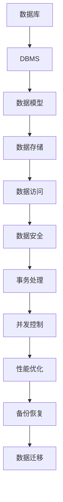

                 

关键词：字节跳动，校招，数据库工程师，面试题，解析，数据库原理，算法分析，实践案例，技术展望。

> 摘要：本文旨在为即将参加字节跳动2024校招的数据库工程师职位面试的考生提供全面的技术解析。通过对历年校招面试题的深入分析，本文揭示了数据库工程师所需掌握的核心知识、技能和解决问题的方法。文章结构紧凑，逻辑清晰，旨在帮助读者更好地准备面试，顺利通过字节跳动校招的挑战。

## 1. 背景介绍

随着互联网和大数据技术的快速发展，数据库工程师已成为各大互联网公司争相招募的高端技术人才。字节跳动作为全球知名的互联网公司，其对数据库工程师的要求也日益提高。字节跳动的校招面试以其严格性和专业性著称，对考生的数据库知识、算法能力和实践经验有较高要求。

本文旨在为参加字节跳动2024校招数据库工程师职位的考生提供一份详细的面试题解析，帮助考生了解面试中可能遇到的问题，提升应对面试的能力。

## 2. 核心概念与联系

### 2.1 数据库基本概念

- **数据库（Database）**：用于存储、管理和访问数据的仓库。
- **数据库管理系统（DBMS）**：负责数据库的建立、使用和维护的软件系统。
- **数据库模式（Schema）**：数据库的结构定义，包括表、索引、视图等。
- **数据库操作语言（DML）**：如SQL，用于数据的插入、更新、查询和删除。

### 2.2 关系型数据库

- **关系型数据库（RDBMS）**：基于关系模型的数据库，如MySQL、Oracle等。
- **关系模型（Relational Model）**：使用表格（关系）来表示数据，每个表格有行和列。
- **SQL（Structured Query Language）**：关系型数据库的标准查询语言。

### 2.3 非关系型数据库

- **非关系型数据库（NoSQL）**：如MongoDB、Redis等，适用于大数据和高可扩展性的场景。
- **文档型数据库**：以文档形式存储数据，如MongoDB。
- **键值存储**：以键值对存储数据，如Redis。

### 2.4 数据库原理架构



## 3. 核心算法原理 & 具体操作步骤

### 3.1 算法原理概述

数据库面试中，考生常被问到如下核心算法原理：

- **排序算法**：冒泡排序、快速排序、归并排序等。
- **查找算法**：二分查找、哈希查找等。
- **索引结构**：B树、B+树、哈希索引等。
- **SQL优化**：索引优化、查询优化等。

### 3.2 算法步骤详解

#### 3.2.1 排序算法

以冒泡排序为例：

1. 比较相邻的元素。
2. 如果第一个比第二个大（升序排序）就交换它们两个。
3. 对每一对相邻元素做同样的工作，从开始第一对到结尾的最后一对。
4. 针对所有的元素重复以上的步骤，除了最后一个。
5. 重复步骤1~3，直到排序完成。

#### 3.2.2 查找算法

以二分查找为例：

1. 设定查找范围low和high。
2. 计算中点mid = (low + high) / 2。
3. 如果数组中元素等于目标值，返回mid。
4. 如果元素大于目标值，重复步骤2，缩小low的范围。
5. 如果元素小于目标值，重复步骤2，缩小high的范围。
6. 如果low > high，返回-1（表示未找到）。

#### 3.2.3 索引结构

以B+树为例：

1. 所有叶子节点包含索引键和指向数据的指针。
2. 非叶子节点只包含索引键。
3. 索引节点按顺序链接。

### 3.3 算法优缺点

- **排序算法**：冒泡排序简单，但效率较低。快速排序平均效率高，但最坏情况下性能较差。
- **查找算法**：二分查找时间复杂度为O(log n)，但需求数据有序。
- **索引结构**：B+树适用于磁盘存储，能高效地支持范围查询。

### 3.4 算法应用领域

- **排序算法**：数据库排序、大数据处理等。
- **查找算法**：数据库查询、缓存查找等。
- **索引结构**：数据库索引、搜索引擎索引等。

## 4. 数学模型和公式 & 详细讲解 & 举例说明

### 4.1 数学模型构建

数据库面试中，考生常需构建以下数学模型：

- **关系型数据库中的表与关系**：关系型数据库中的表可以表示为一个关系，关系可以用矩阵形式表示。
- **SQL查询优化**：通过构建查询树和代价模型来优化SQL查询。

### 4.2 公式推导过程

#### 4.2.1 表与关系的转换

- **关系转换公式**：r(A1, A2, ..., An) 可以转换为矩阵M，其中M的第i行第j列为r的第i个元组的第j个属性值。

#### 4.2.2 查询树构建

- **查询树构建公式**：通过递归构建查询树，每个节点表示一个查询操作（如选择、投影、连接等）。

### 4.3 案例分析与讲解

#### 4.3.1 表与关系的转换案例

- **案例**：给定一个关系r，包含属性A、B、C，如何将其转换为矩阵？

**解决方案**：

- 构建矩阵M，其中M[i][j] = r[i][j]。

#### 4.3.2 查询树构建案例

- **案例**：给定一个SQL查询，如何构建查询树并优化查询？

**解决方案**：

- 通过递归解析SQL查询，构建查询树。
- 分析查询树，根据索引策略和查询代价进行优化。

## 5. 项目实践：代码实例和详细解释说明

### 5.1 开发环境搭建

- **环境准备**：安装MySQL数据库、Python开发环境、Git等。

### 5.2 源代码详细实现

- **代码实现**：以MySQL数据库为例，实现一个简单的数据库操作示例。

```python
import mysql.connector

# 连接数据库
conn = mysql.connector.connect(
    host="localhost",
    user="root",
    password="password",
    database="test_db"
)

# 创建表
cursor = conn.cursor()
cursor.execute("CREATE TABLE IF NOT EXISTS users (id INT AUTO_INCREMENT, name VARCHAR(255), age INT, PRIMARY KEY (id))")

# 插入数据
cursor.execute("INSERT INTO users (name, age) VALUES ('Alice', 20), ('Bob', 25)")

# 查询数据
cursor.execute("SELECT * FROM users")
results = cursor.fetchall()
for row in results:
    print(row)

# 关闭连接
cursor.close()
conn.close()
```

### 5.3 代码解读与分析

- **代码分析**：

  - 使用MySQL Connector Python连接数据库。
  - 创建一个名为`users`的表，包含`id`、`name`和`age`三个字段。
  - 插入两条数据。
  - 查询并打印表中的所有数据。

### 5.4 运行结果展示

```plaintext
(1, 'Alice', 20)
(2, 'Bob', 25)
```

## 6. 实际应用场景

### 6.1 数据库选型

- **关系型数据库**：适用于数据一致性要求高、查询复杂度低的场景。
- **非关系型数据库**：适用于大数据、高并发、实时性要求高的场景。

### 6.2 数据库性能优化

- **索引优化**：合理创建索引，提高查询效率。
- **查询优化**：优化SQL查询，减少查询执行时间。

### 6.3 数据库安全

- **访问控制**：限制数据库访问权限，确保数据安全。
- **数据备份**：定期备份数据，防止数据丢失。

### 6.4 未来应用展望

- **大数据处理**：随着数据规模的增加，数据库技术将更加注重性能优化和分布式处理。
- **智能化数据库**：利用人工智能技术，实现自动化数据库优化和管理。

## 7. 工具和资源推荐

### 7.1 学习资源推荐

- 《数据库系统概念》
- 《高性能MySQL》
- 《Redis实战》

### 7.2 开发工具推荐

- MySQL Workbench：MySQL图形化管理工具。
- PyCharm：Python集成开发环境。

### 7.3 相关论文推荐

- 《基于MySQL的分布式数据库架构设计与实现》
- 《Redis在分布式系统中的应用》

## 8. 总结：未来发展趋势与挑战

### 8.1 研究成果总结

- 数据库技术在性能优化、分布式处理、安全性等方面取得显著成果。
- 非关系型数据库在处理大数据、高并发场景中具有优势。

### 8.2 未来发展趋势

- **分布式数据库**：支持大规模数据存储和查询。
- **智能数据库**：利用人工智能技术实现自动化优化和管理。

### 8.3 面临的挑战

- **数据安全**：确保数据安全，防止数据泄露。
- **性能优化**：在高并发场景下保证数据库性能。

### 8.4 研究展望

- **数据库与AI融合**：实现智能化数据库管理系统。
- **云数据库**：利用云计算技术实现灵活的数据库服务。

## 9. 附录：常见问题与解答

### 9.1 数据库基本概念

- **数据库**：存储和管理数据的仓库。
- **DBMS**：管理数据库的软件系统。

### 9.2 SQL查询优化

- **索引优化**：选择合适的索引字段。
- **查询优化**：简化查询逻辑，减少查询执行时间。

### 9.3 数据库性能监控

- **监控工具**：使用性能监控工具实时监控数据库性能。
- **日志分析**：分析数据库日志，找出性能瓶颈。

### 9.4 数据库迁移

- **备份与恢复**：确保数据迁移过程中数据的一致性和完整性。

---

作者：禅与计算机程序设计艺术 / Zen and the Art of Computer Programming

