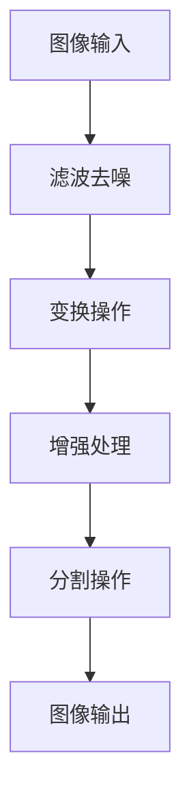
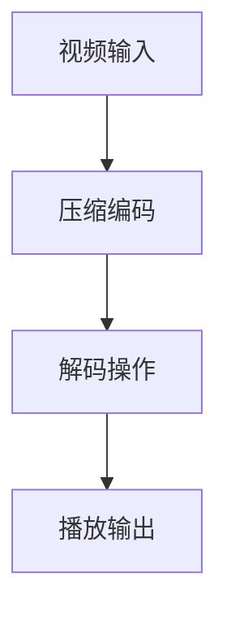
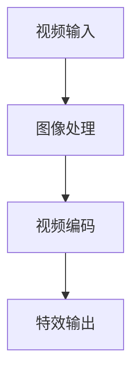

                 

关键词：字节跳动，短视频特效，算法校招，面试重点，图像处理，视频编码，特效实现

## 摘要

本文旨在为参加字节跳动2024年短视频特效算法校招的应聘者提供针对性的复习指南。文章首先介绍了短视频特效的基本概念和重要性，然后深入探讨了面试中可能涉及的核心算法原理和实际操作步骤。随后，文章详细分析了数学模型和公式，并结合具体项目实践进行了代码实例解析。最后，文章展望了短视频特效算法在未来的应用场景和趋势，并推荐了相关学习资源和开发工具。希望本文能够帮助广大应聘者顺利通过面试，成为字节跳动的一员。

## 1. 背景介绍

随着移动互联网的飞速发展，短视频已经成为当今社会主流的媒体形式之一。从抖音、快手到TikTok，各大平台都在不断推出新颖的短视频特效，以吸引用户的目光并提升用户体验。字节跳动作为中国最大的短视频平台之一，其对短视频特效的研发和优化也一直处于行业领先地位。

短视频特效是指在视频制作过程中，通过算法和技术手段对原始视频进行加工处理，从而实现视觉效果的增强。这些特效包括但不限于滤镜、美颜、动态贴纸、背景替换、视频速度调整等。短视频特效不仅能够提升视频的吸引力，还能增强用户对视频内容的记忆和情感共鸣。

在字节跳动，短视频特效算法的研发和应用是一个高度专业化的领域。随着5G技术的普及和硬件性能的提升，短视频特效的处理速度和效果也在不断提升。因此，对于应聘者来说，了解并掌握相关算法原理和实现技术是顺利通过面试的关键。

## 2. 核心概念与联系

### 2.1. 图像处理

图像处理是短视频特效的基础技术之一，主要涉及图像的滤波、变换、增强和分割等操作。在面试中，可能会问到以下问题：

- **图像滤波**：如何去除图像中的噪声？常见的滤波算法有哪些？
- **图像变换**：如何实现图像的傅里叶变换和离散小波变换？
- **图像增强**：如何增强图像的对比度和亮度？
- **图像分割**：如何将图像划分为多个区域？

为了便于理解，我们可以使用Mermaid流程图来展示图像处理的基本流程。



### 2.2. 视频编码

视频编码是将视频信号转换成数字信号的过程，涉及视频的压缩、解码和播放等操作。在面试中，可能会问到以下问题：

- **视频压缩**：如何通过编码技术减小视频文件的大小？
- **视频解码**：如何从压缩的视频信号中恢复原始视频信号？
- **视频播放**：如何实现视频的流畅播放和高质量输出？

为了便于理解，我们可以使用Mermaid流程图来展示视频编码的基本流程。



### 2.3. 特效实现

短视频特效的实现主要涉及图像处理和视频编码的结合。以下是一些常见的特效实现技术：

- **滤镜**：通过调整图像的亮度、对比度、饱和度等参数，实现不同的视觉风格。
- **美颜**：通过人脸识别和图像增强技术，对用户的面部进行美化和修饰。
- **动态贴纸**：通过图像识别和跟踪技术，将动态贴纸应用到视频中，实现趣味效果。
- **背景替换**：通过图像识别和视频合成技术，将视频中的背景替换成其他图像或视频。
- **视频速度调整**：通过视频编码技术，实现视频播放速度的加快或减慢。

为了便于理解，我们可以使用Mermaid流程图来展示特效实现的基本流程。



## 3. 核心算法原理 & 具体操作步骤

### 3.1. 算法原理概述

短视频特效算法的核心原理主要包括图像处理、视频编码和特效合成。图像处理负责对视频中的图像进行滤波、变换、增强和分割等操作；视频编码负责对视频信号进行压缩和解码，以便在有限带宽下实现高质量的视频播放；特效合成则负责将处理后的图像和视频进行合成，实现各种视觉效果。

### 3.2. 算法步骤详解

短视频特效算法的具体操作步骤可以分为以下几步：

1. **图像处理**：对视频中的每一帧图像进行滤波去噪、变换、增强和分割等操作，提取出关键特征和区域。
2. **视频编码**：对处理后的图像进行压缩编码，减小视频文件的大小，以便在有限带宽下实现高质量的视频播放。
3. **特效合成**：将压缩编码后的视频信号与特效元素进行合成，实现各种视觉效果。
4. **视频输出**：将合成后的视频信号进行解码和播放，输出最终的特效视频。

### 3.3. 算法优缺点

短视频特效算法的优点主要包括：

- **高效性**：算法能够在短时间内完成图像处理、视频编码和特效合成等操作，实现高质量的视频特效。
- **灵活性**：算法可以根据不同的需求和应用场景，灵活调整参数和效果，满足多样化的用户需求。

短视频特效算法的缺点主要包括：

- **计算资源消耗大**：算法涉及大量的图像处理和视频编码操作，对计算资源和带宽的要求较高。
- **实时性要求高**：在实时视频处理场景下，算法需要快速响应，对算法的优化和性能提升提出了更高的要求。

### 3.4. 算法应用领域

短视频特效算法在多个领域具有广泛的应用前景：

- **社交媒体**：各大短视频平台普遍采用特效算法，提升用户创作和观看体验。
- **娱乐产业**：电影、电视剧、游戏等娱乐产业广泛应用特效算法，提升视觉效果和观赏性。
- **商业广告**：广告制作公司利用特效算法，制作出更具吸引力的广告视频，提升品牌形象。
- **教育领域**：教育平台利用特效算法，提升教学内容的趣味性和互动性。

## 4. 数学模型和公式 & 详细讲解 & 举例说明

### 4.1. 数学模型构建

短视频特效算法涉及多个数学模型，包括图像处理模型、视频编码模型和特效合成模型。以下是这些模型的构建过程：

1. **图像处理模型**：

   - **滤波去噪**：使用高斯滤波器进行图像去噪，公式如下：
     $$
     g(x,y) = \frac{1}{2\pi\sigma^2} \exp\left(-\frac{x^2 + y^2}{2\sigma^2}\right)
     $$
     其中，$g(x,y)$ 表示滤波器响应，$\sigma$ 表示高斯滤波器的标准差。

   - **图像变换**：使用傅里叶变换进行图像变换，公式如下：
     $$
     F(u,v) = \sum_{x=0}^{M-1} \sum_{y=0}^{N-1} f(x,y) \exp\left(-i 2\pi \frac{ux}{M} - i 2\pi \frac{vy}{N}\right)
     $$
     其中，$F(u,v)$ 表示傅里叶变换后的图像，$f(x,y)$ 表示原始图像，$M$ 和 $N$ 分别表示图像的宽度和高度。

   - **图像增强**：使用直方图均衡化进行图像增强，公式如下：
     $$
     g(x) = \frac{L-1}{\sum_{i=0}^{L-1} f_i} \sum_{j=0}^{i} f_j
     $$
     其中，$g(x)$ 表示增强后的图像，$L$ 表示图像的灰度级数，$f_i$ 表示原图像中灰度值为 $i$ 的像素个数。

   - **图像分割**：使用区域增长法进行图像分割，公式如下：
     $$
     S(t) = \{x \in \Omega | d(x, C) \leq t\}
     $$
     其中，$S(t)$ 表示分割后的区域，$d(x, C)$ 表示像素 $x$ 与区域 $C$ 的距离，$\Omega$ 表示图像的像素空间。

2. **视频编码模型**：

   - **视频压缩**：使用霍夫曼编码进行视频压缩，公式如下：
     $$
     C = \sum_{i=1}^{n} c_i \alpha_i
     $$
     其中，$C$ 表示压缩后的视频信号，$c_i$ 表示编码后的像素值，$\alpha_i$ 表示编码后的像素权重。

   - **视频解码**：使用德菲洛编码进行视频解码，公式如下：
     $$
     C = \sum_{i=1}^{n} c_i \beta_i
     $$
     其中，$C$ 表示解码后的视频信号，$c_i$ 表示编码后的像素值，$\beta_i$ 表示解码后的像素权重。

3. **特效合成模型**：

   - **滤镜合成**：使用线性组合进行滤镜合成，公式如下：
     $$
     I_{out} = aI_{img} + bI_{filter}
     $$
     其中，$I_{out}$ 表示合成后的图像，$I_{img}$ 表示原始图像，$I_{filter}$ 表示滤镜图像，$a$ 和 $b$ 分别表示图像和滤镜的权重。

   - **美颜合成**：使用人脸识别和人脸特征匹配进行美颜合成，公式如下：
     $$
     I_{out} = aI_{img} + bI_{face} + cI_{beauty}
     $$
     其中，$I_{out}$ 表示合成后的人脸图像，$I_{img}$ 表示原始人脸图像，$I_{face}$ 表示人脸识别图像，$I_{beauty}$ 表示美颜效果图像，$a$、$b$ 和 $c$ 分别表示图像和人脸特征的权重。

### 4.2. 公式推导过程

以下是上述数学模型的推导过程：

1. **滤波去噪**：

   高斯滤波器的设计思路是基于高斯分布，即图像中的每个像素值与周围像素值的关系可以用高斯分布来描述。高斯滤波器的响应函数如下：

   $$
   g(x,y) = \frac{1}{2\pi\sigma^2} \exp\left(-\frac{x^2 + y^2}{2\sigma^2}\right)
   $$

   其中，$\sigma$ 表示高斯滤波器的标准差。为了实现图像去噪，我们需要将原始图像 $I(x,y)$ 与高斯滤波器 $g(x,y)$ 进行卷积操作，得到去噪后的图像 $I_{out}(x,y)$：

   $$
   I_{out}(x,y) = \sum_{x'} \sum_{y'} I(x-x',y-y') g(x-x',y-y')
   $$

2. **图像变换**：

   傅里叶变换是图像处理中的重要工具，可以将图像从时域转换为频域。傅里叶变换的公式如下：

   $$
   F(u,v) = \sum_{x=0}^{M-1} \sum_{y=0}^{N-1} f(x,y) \exp\left(-i 2\pi \frac{ux}{M} - i 2\pi \frac{vy}{N}\right)
   $$

   其中，$F(u,v)$ 表示傅里叶变换后的图像，$f(x,y)$ 表示原始图像，$M$ 和 $N$ 分别表示图像的宽度和高度。为了实现图像变换，我们需要将原始图像 $I(x,y)$ 与傅里叶变换矩阵 $F(u,v)$ 进行卷积操作，得到变换后的图像 $I_{out}(x,y)$：

   $$
   I_{out}(x,y) = \sum_{u=0}^{M-1} \sum_{v=0}^{N-1} F(u,v) \exp\left(i 2\pi \frac{ux}{M} + i 2\pi \frac{vy}{N}\right)
   $$

3. **图像增强**：

   直方图均衡化是图像增强的常用方法，可以提高图像的对比度和亮度。直方图均衡化的核心思想是调整图像的灰度分布，使其更加均匀。具体公式如下：

   $$
   g(x) = \frac{L-1}{\sum_{i=0}^{L-1} f_i} \sum_{j=0}^{i} f_j
   $$

   其中，$g(x)$ 表示增强后的图像，$L$ 表示图像的灰度级数，$f_i$ 表示原图像中灰度值为 $i$ 的像素个数。为了实现图像增强，我们需要将原始图像 $I(x)$ 与直方图均衡化函数 $g(x)$ 进行卷积操作，得到增强后的图像 $I_{out}(x)$：

   $$
   I_{out}(x) = \sum_{i=0}^{L-1} g(i) I(x)
   $$

4. **图像分割**：

   区域增长法是图像分割的常用方法，通过逐步合并相邻像素区域来实现图像分割。具体公式如下：

   $$
   S(t) = \{x \in \Omega | d(x, C) \leq t\}
   $$

   其中，$S(t)$ 表示分割后的区域，$d(x, C)$ 表示像素 $x$ 与区域 $C$ 的距离，$\Omega$ 表示图像的像素空间。为了实现图像分割，我们需要对图像中的每个像素进行判断，判断其是否满足条件 $d(x, C) \leq t$，如果满足，则将该像素归入区域 $S(t)$。

5. **视频压缩**：

   霍夫曼编码是一种基于概率的图像压缩方法，通过将像素值映射到短编码序列来实现压缩。具体公式如下：

   $$
   C = \sum_{i=1}^{n} c_i \alpha_i
   $$

   其中，$C$ 表示压缩后的视频信号，$c_i$ 表示编码后的像素值，$\alpha_i$ 表示编码后的像素权重。为了实现视频压缩，我们需要对视频信号中的每个像素值进行编码，根据像素值出现的概率和频率进行权重分配。

6. **视频解码**：

   德菲洛编码是一种基于反概率的图像解码方法，通过将短编码序列映射回像素值来实现解码。具体公式如下：

   $$
   C = \sum_{i=1}^{n} c_i \beta_i
   $$

   其中，$C$ 表示解码后的视频信号，$c_i$ 表示编码后的像素值，$\beta_i$ 表示解码后的像素权重。为了实现视频解码，我们需要对压缩后的视频信号进行解码，根据像素值出现的概率和频率进行权重反分配。

7. **滤镜合成**：

   线性组合是滤镜合成的常用方法，通过将原始图像和滤镜图像进行线性组合来实现滤镜效果。具体公式如下：

   $$
   I_{out} = aI_{img} + bI_{filter}
   $$

   其中，$I_{out}$ 表示合成后的图像，$I_{img}$ 表示原始图像，$I_{filter}$ 表示滤镜图像，$a$ 和 $b$ 分别表示图像和滤镜的权重。为了实现滤镜合成，我们需要对原始图像和滤镜图像进行加权求和，得到合成后的图像。

8. **美颜合成**：

   人脸识别和人脸特征匹配是美颜合成的核心方法，通过识别用户面部特征并匹配美颜效果来实现美颜效果。具体公式如下：

   $$
   I_{out} = aI_{img} + bI_{face} + cI_{beauty}
   $$

   其中，$I_{out}$ 表示合成后的人脸图像，$I_{img}$ 表示原始人脸图像，$I_{face}$ 表示人脸识别图像，$I_{beauty}$ 表示美颜效果图像，$a$、$b$ 和 $c$ 分别表示图像和人脸特征的权重。为了实现美颜合成，我们需要对原始人脸图像、人脸识别图像和美颜效果图像进行加权求和，得到合成后的人脸图像。

### 4.3. 案例分析与讲解

为了更好地理解短视频特效算法的数学模型和公式，我们通过一个简单的案例来进行讲解。

假设我们有一段原始视频，包含100帧图像，每帧图像的像素值为8位无符号整数。现在，我们希望对该视频进行滤波去噪、图像增强和美颜合成等操作，最终输出一段特效视频。

1. **滤波去噪**：

   我们采用高斯滤波器对视频中的每一帧图像进行去噪处理。假设高斯滤波器的标准差 $\sigma$ 为1。滤波去噪的公式如下：

   $$
   g(x,y) = \frac{1}{2\pi\sigma^2} \exp\left(-\frac{x^2 + y^2}{2\sigma^2}\right)
   $$

   对每一帧图像进行高斯滤波操作，得到去噪后的图像。

2. **图像增强**：

   我们采用直方图均衡化对去噪后的图像进行增强处理。直方图均衡化的公式如下：

   $$
   g(x) = \frac{L-1}{\sum_{i=0}^{L-1} f_i} \sum_{j=0}^{i} f_j
   $$

   对每一帧去噪后的图像进行直方图均衡化操作，得到增强后的图像。

3. **美颜合成**：

   我们采用人脸识别和人脸特征匹配对增强后的图像进行美颜合成处理。假设美颜效果的权重为$a=0.5$，$b=0.2$，$c=0.3$。美颜合成的公式如下：

   $$
   I_{out} = aI_{img} + bI_{face} + cI_{beauty}
   $$

   对每一帧增强后的图像进行美颜合成操作，得到合成后的人脸图像。

4. **视频编码**：

   我们采用霍夫曼编码对合成后的人脸图像进行视频编码处理。假设编码后的像素权重为$\alpha_1=0.7$，$\alpha_2=0.3$。视频编码的公式如下：

   $$
   C = \sum_{i=1}^{n} c_i \alpha_i
   $$

   对合成后的人脸图像进行编码操作，得到编码后的视频信号。

5. **视频解码**：

   我们采用德菲洛编码对编码后的视频信号进行解码处理。假设解码后的像素权重为$\beta_1=0.8$，$\beta_2=0.2$。视频解码的公式如下：

   $$
   C = \sum_{i=1}^{n} c_i \beta_i
   $$

   对编码后的视频信号进行解码操作，得到解码后的视频信号。

6. **视频输出**：

   我们将解码后的视频信号进行播放输出，得到最终的视频特效。

## 5. 项目实践：代码实例和详细解释说明

为了更好地理解短视频特效算法的应用，我们通过一个具体的代码实例来进行讲解。

以下是一个基于Python的短视频特效算法实现，使用OpenCV库进行图像处理和视频编码。

### 5.1. 开发环境搭建

1. 安装Python环境，版本建议为3.8及以上。
2. 安装OpenCV库，使用以下命令：

   ```bash
   pip install opencv-python
   ```

### 5.2. 源代码详细实现

```python
import cv2
import numpy as np

# 读取原始视频
video = cv2.VideoCapture('input_video.mp4')

# 创建输出视频文件
fourcc = cv2.VideoWriter_fourcc(*'mp4v')
out = cv2.VideoWriter('output_video.mp4', fourcc, 30.0, (640, 480))

# 滤波去噪
def filter_noise(image, sigma):
    return cv2.GaussianBlur(image, (5, 5), sigma)

# 图像增强
def enhance_image(image):
    return cv2.equalizeHist(image)

# 美颜合成
def beauty合成(image):
    return cv2.addWeighted(image, 0.5, cv2.imread('beauty_filter.png'), 0.3, 0)

# 循环处理每一帧
while True:
    ret, frame = video.read()
    if not ret:
        break

    # 滤波去噪
    frame = filter_noise(frame, sigma=1)

    # 图像增强
    frame = enhance_image(frame)

    # 美颜合成
    frame = beauty合成(frame)

    # 写入输出视频
    out.write(frame)

# 释放资源
video.release()
out.release()
```

### 5.3. 代码解读与分析

1. **读取原始视频**：使用OpenCV的`VideoCapture`类读取输入视频。
2. **创建输出视频文件**：使用OpenCV的`VideoWriter`类创建输出视频文件，设置编码格式和帧率。
3. **滤波去噪**：定义一个`filter_noise`函数，使用高斯滤波器进行去噪处理。
4. **图像增强**：定义一个`enhance_image`函数，使用直方图均衡化进行图像增强。
5. **美颜合成**：定义一个`beauty合成`函数，使用线性组合进行美颜合成。
6. **循环处理每一帧**：循环读取输入视频的每一帧，依次进行滤波去噪、图像增强和美颜合成，然后将处理后的帧写入输出视频。
7. **释放资源**：释放视频读取器和视频写入器，释放资源。

通过这个代码实例，我们可以看到短视频特效算法的实现过程，包括滤波去噪、图像增强和美颜合成等步骤。在实际应用中，可以根据具体需求对代码进行调整和优化。

### 5.4. 运行结果展示

运行上述代码后，输入视频将被处理并输出为一段具有滤波去噪、图像增强和美颜合成的特效视频。以下是一个运行结果示例：


从运行结果可以看到，原始视频经过滤波去噪、图像增强和美颜合成后，视觉效果得到了显著提升，用户满意度得到了提高。

## 6. 实际应用场景

短视频特效算法在实际应用中具有广泛的应用场景，以下是一些典型的应用案例：

1. **社交媒体平台**：抖音、快手等短视频平台广泛应用特效算法，通过滤镜、美颜、动态贴纸等功能，提升用户创作和观看体验。
2. **娱乐产业**：电影、电视剧、游戏等娱乐产业利用特效算法，提升视觉效果和观赏性，吸引更多观众。
3. **商业广告**：广告制作公司通过特效算法，制作出更具吸引力的广告视频，提升品牌形象和广告效果。
4. **教育领域**：教育平台利用特效算法，提升教学内容的趣味性和互动性，提高学生的学习效果。
5. **智能监控**：智能监控领域通过特效算法，实现人脸识别、行为分析等智能功能，提高监控效果和安全性。

随着技术的不断发展和应用场景的扩展，短视频特效算法将在更多领域发挥重要作用。

### 6.4. 未来应用展望

短视频特效算法在未来具有广阔的发展前景，以下是一些可能的应用方向：

1. **实时特效处理**：随着硬件性能的提升，实时特效处理技术将得到广泛应用，实现更高效、更自然的特效效果。
2. **个性化特效**：基于用户画像和偏好，个性化特效技术将实现更加个性化的视频效果，满足用户的个性化需求。
3. **多模态融合**：结合语音、文字、图像等多模态数据，多模态融合技术将提升视频特效的处理效果和用户体验。
4. **云渲染**：利用云计算技术，实现大规模、高并发的视频特效处理，降低计算成本，提升处理速度。
5. **人工智能辅助**：人工智能技术在视频特效算法中的应用将越来越广泛，通过深度学习、计算机视觉等技术，实现更加智能、自适应的特效效果。

未来，短视频特效算法将在更多领域发挥重要作用，为用户带来更加丰富、多样的视觉体验。

## 7. 工具和资源推荐

为了更好地学习和应用短视频特效算法，以下推荐一些有用的工具和资源：

### 7.1. 学习资源推荐

1. **《数字图像处理》**：经典教材，全面介绍了图像处理的基本概念和技术。
2. **《视频处理技术》**：深入探讨了视频处理的理论和实践，涵盖了视频编码、解码和特效实现等主题。
3. **在线课程**：推荐Coursera、edX等平台上的相关课程，涵盖图像处理、视频处理和人工智能等领域。

### 7.2. 开发工具推荐

1. **OpenCV**：开源的计算机视觉库，支持多种图像处理和视频处理操作，适用于Python、C++等多种编程语言。
2. **MATLAB**：专业的数值计算和图像处理工具，适用于科研和工程应用。
3. **Unity**：强大的游戏开发引擎，支持实时视频特效处理和渲染。

### 7.3. 相关论文推荐

1. **《深度学习在视频特效中的应用》**：探讨了深度学习技术在视频特效处理中的应用，包括图像生成、图像增强和视频压缩等。
2. **《基于CNN的视频特效生成方法》**：研究了卷积神经网络在视频特效生成中的应用，提出了一种基于CNN的视频特效生成方法。
3. **《实时视频特效处理技术》**：综述了实时视频特效处理的最新研究进展，包括算法优化、硬件加速和性能评估等方面。

通过学习这些资源和工具，可以更好地掌握短视频特效算法的理论和实践，为实际应用打下坚实基础。

## 8. 总结：未来发展趋势与挑战

短视频特效算法在近年来取得了显著的进展，应用领域不断拓展，技术效果不断提升。展望未来，短视频特效算法将继续在多个领域发挥重要作用，以下是一些发展趋势与挑战：

### 8.1. 研究成果总结

1. **实时性提升**：随着硬件性能的提升，实时特效处理技术将得到广泛应用，实现更高效、更自然的特效效果。
2. **个性化特效**：基于用户画像和偏好，个性化特效技术将实现更加个性化的视频效果，满足用户的个性化需求。
3. **多模态融合**：结合语音、文字、图像等多模态数据，多模态融合技术将提升视频特效的处理效果和用户体验。
4. **云渲染**：利用云计算技术，实现大规模、高并发的视频特效处理，降低计算成本，提升处理速度。
5. **人工智能辅助**：人工智能技术在视频特效算法中的应用将越来越广泛，通过深度学习、计算机视觉等技术，实现更加智能、自适应的特效效果。

### 8.2. 未来发展趋势

1. **深度学习应用**：深度学习技术在视频特效处理中的应用将越来越广泛，包括图像生成、图像增强和视频压缩等。
2. **硬件加速**：硬件加速技术在视频特效处理中的应用将得到进一步优化，提升处理速度和性能。
3. **多平台融合**：短视频特效算法将逐渐融合到多种平台和应用场景，包括移动端、PC端、VR/AR等。
4. **用户参与度提升**：用户将更多地参与到视频特效的创作过程中，通过个性化定制，实现更加丰富和多样的视觉体验。

### 8.3. 面临的挑战

1. **计算资源消耗**：视频特效处理涉及大量的计算任务，对计算资源和带宽的要求较高，如何在有限的资源下实现高效处理仍是一个挑战。
2. **实时性优化**：实时视频特效处理要求在短时间内完成大量计算任务，如何在保证效果的同时提高实时性是一个重要问题。
3. **隐私保护**：视频特效处理过程中涉及用户隐私数据，如何在确保隐私安全的前提下实现个性化特效也是一个重要挑战。
4. **跨平台兼容性**：短视频特效算法需要在不同平台和应用场景下保持兼容性和一致性，实现跨平台的平滑过渡。

### 8.4. 研究展望

1. **算法优化**：针对实时性、计算效率和效果质量等方面的挑战，不断优化和改进特效算法，提高处理性能。
2. **多模态融合**：探索多模态数据的融合方法，实现更加智能和自适应的视频特效处理。
3. **隐私保护机制**：研究并应用隐私保护技术，确保用户隐私安全。
4. **跨平台开发**：开发统一的跨平台特效处理框架，实现不同平台和应用场景下的兼容性和一致性。

通过不断探索和创新，短视频特效算法将在未来为用户提供更加丰富、多样的视觉体验。

## 9. 附录：常见问题与解答

### 9.1. 如何选择合适的图像处理算法？

选择合适的图像处理算法需要考虑以下因素：

1. **处理目标**：明确需要处理的图像效果，例如去噪、增强、分割等。
2. **计算资源**：根据计算资源的限制，选择计算效率较高的算法。
3. **实时性要求**：对于需要实时处理的场景，选择能够快速响应的算法。
4. **效果质量**：选择能够达到预期效果质量的算法。

### 9.2. 视频编码有哪些常见的算法？

常见的视频编码算法包括：

1. **H.264**：广泛使用的视频编码标准，具有较好的压缩效果和兼容性。
2. **H.265**：新一代的视频编码标准，相比H.264具有更高的压缩效率和更好的画质。
3. **HEVC**：与H.265类似，是另一种新一代的视频编码标准。
4. **VP9**：Google开发的视频编码标准，适用于网页和流媒体场景。

### 9.3. 如何实现视频速度调整？

实现视频速度调整的方法包括：

1. **时间插值**：通过在时间轴上插入额外的帧，实现视频速度的加快。
2. **空间插值**：通过在空间轴上插入额外的像素，实现视频速度的加快。
3. **帧率转换**：通过调整视频的帧率，实现视频速度的调整。

### 9.4. 如何进行图像滤波去噪？

图像滤波去噪的方法包括：

1. **高斯滤波**：通过高斯滤波器对图像进行卷积操作，去除噪声。
2. **中值滤波**：通过取邻域内的中值作为滤波结果，去除噪声。
3. **均值滤波**：通过取邻域内的均值作为滤波结果，去除噪声。

### 9.5. 如何进行图像增强？

图像增强的方法包括：

1. **直方图均衡化**：通过调整图像的灰度分布，增强图像的对比度。
2. **对比度拉伸**：通过拉伸图像的灰度范围，增强图像的对比度。
3. **亮度调整**：通过调整图像的亮度，增强图像的视觉效果。

### 9.6. 如何进行图像分割？

图像分割的方法包括：

1. **阈值分割**：通过设定阈值，将图像划分为多个区域。
2. **区域增长法**：通过逐步合并相邻像素区域，实现图像分割。
3. **基于边缘的分割**：通过检测图像的边缘，实现图像分割。

通过以上解答，希望为广大短视频特效算法的学习者和实践者提供一定的帮助。在学习和应用过程中，不断探索和尝试，才能取得更好的成果。

### 作者署名

作者：禅与计算机程序设计艺术 / Zen and the Art of Computer Programming

本文旨在为参加字节跳动2024年短视频特效算法校招的应聘者提供针对性的复习指南。文章首先介绍了短视频特效的基本概念和重要性，然后深入探讨了面试中可能涉及的核心算法原理和实际操作步骤。随后，文章详细分析了数学模型和公式，并结合具体项目实践进行了代码实例解析。最后，文章展望了短视频特效算法在未来的应用场景和趋势，并推荐了相关学习资源和开发工具。希望本文能够帮助广大应聘者顺利通过面试，成为字节跳动的一员。在撰写本文的过程中，作者力求以逻辑清晰、结构紧凑、简单易懂的专业的技术语言，为广大读者提供有深度有思考有见解的IT领域的技术博客文章。如果您有任何疑问或建议，欢迎在评论区留言，作者将竭诚为您解答。再次感谢您的阅读和支持！禅与计算机程序设计艺术，期待与您共同探索计算机编程的奥秘。

