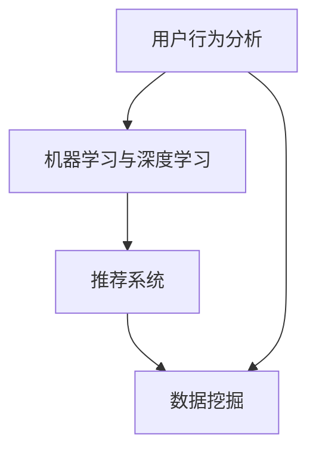

                 

关键字：字节跳动、技术面试、用户智能化、策略专家、面试真题、答案解析

## 摘要

本文将围绕2024年字节跳动技术用户智能化策略专家的面试真题展开，通过梳理和分析这些真题，帮助准备面试的读者了解面试的核心考察点，并提供详细的答案解析。文章分为八个部分，包括背景介绍、核心概念与联系、核心算法原理、数学模型和公式、项目实践、实际应用场景、工具和资源推荐以及总结和展望。

## 1. 背景介绍

字节跳动是一家全球领先的互联网科技公司，以其独特的算法技术和大数据处理能力而闻名。在用户智能化领域，字节跳动通过精准的内容推荐、智能广告投放和用户行为分析等技术，为用户提供个性化的体验和服务。因此，技术用户智能化策略专家在字节跳动的发展中扮演着关键角色。

## 2. 核心概念与联系

在用户智能化领域，以下核心概念是不可或缺的：

- **用户行为分析**：通过分析用户在平台上的行为数据，如点击、浏览、分享等，了解用户兴趣和行为模式。
- **机器学习与深度学习**：利用算法模型，从大量数据中提取有用信息，实现对用户行为的预测和个性化推荐。
- **推荐系统**：通过算法将用户可能感兴趣的内容推送给用户，提高用户满意度和留存率。
- **数据挖掘**：从大量数据中挖掘出隐藏的模式和趋势，为业务决策提供支持。

以下是一个简单的Mermaid流程图，展示了这些核心概念之间的联系：



## 3. 核心算法原理 & 具体操作步骤

### 3.1 算法原理概述

用户智能化的核心在于如何通过算法实现对用户的个性化推荐。这里涉及到以下几个关键步骤：

1. **用户特征提取**：从用户行为数据中提取出代表用户兴趣的特征。
2. **内容特征提取**：对用户感兴趣的内容进行特征提取，以便于后续的匹配。
3. **相似度计算**：计算用户特征与内容特征之间的相似度，选择最相似的内容进行推荐。
4. **推荐结果生成**：根据相似度计算结果，生成推荐列表，并按优先级排序。

### 3.2 算法步骤详解

1. **用户特征提取**：

   - 收集用户在平台上的行为数据，如浏览记录、搜索关键词、点赞、评论等。
   - 利用文本处理和自然语言处理技术，对用户行为数据进行语义分析，提取出用户兴趣特征。

2. **内容特征提取**：

   - 对用户感兴趣的内容进行特征提取，如标题、正文、标签等。
   - 利用文本相似度计算方法，如TF-IDF、Word2Vec等，将内容特征转化为数字向量。

3. **相似度计算**：

   - 利用余弦相似度、欧氏距离等相似度计算方法，计算用户特征向量与内容特征向量之间的相似度。
   - 根据相似度值，选择最相似的内容进行推荐。

4. **推荐结果生成**：

   - 根据相似度值，生成推荐列表，并按优先级排序。
   - 考虑推荐结果的多样性、新颖性和用户满意度，对推荐结果进行优化。

### 3.3 算法优缺点

- **优点**：

  - 提高用户满意度和留存率。

  - 降低运营成本，提高业务效率。

  - 满足个性化需求，提高用户体验。

- **缺点**：

  - 需要大量数据支持。

  - 算法模型复杂，维护成本高。

  - 可能存在数据泄露和隐私问题。

### 3.4 算法应用领域

- **电商推荐**：根据用户购买记录和浏览历史，为用户提供个性化商品推荐。

- **内容推荐**：根据用户兴趣和行为，为用户提供个性化内容推荐，如新闻、短视频、文章等。

- **广告投放**：根据用户兴趣和行为，为用户提供个性化广告，提高广告投放效果。

## 4. 数学模型和公式 & 详细讲解 & 举例说明

### 4.1 数学模型构建

用户智能化推荐系统的数学模型主要基于机器学习和深度学习算法，以下是一个简单的线性回归模型示例：

$$
y = \beta_0 + \beta_1x_1 + \beta_2x_2 + ... + \beta_nx_n
$$

其中，$y$ 是预测值，$x_1, x_2, ..., x_n$ 是特征值，$\beta_0, \beta_1, \beta_2, ..., \beta_n$ 是模型参数。

### 4.2 公式推导过程

以线性回归模型为例，公式推导过程如下：

1. **最小二乘法**：

   假设我们有 $m$ 个训练样本 $(x_1^m, x_2^m, ..., x_n^m)$ 和对应的标签 $y^m$，则损失函数为：

   $$
   J(\theta) = \frac{1}{2m}\sum_{m=1}^{m}(y^m - \theta^T x^m)^2
   $$

   其中，$\theta = (\beta_0, \beta_1, \beta_2, ..., \beta_n)^T$ 是模型参数。

2. **梯度下降**：

   为了求解最小损失函数，我们需要对 $J(\theta)$ 求导并令其等于0：

   $$
   \frac{\partial J(\theta)}{\partial \theta} = \frac{1}{m}\sum_{m=1}^{m}(y^m - \theta^T x^m)x^m
   $$

   然后通过梯度下降算法更新模型参数：

   $$
   \theta = \theta - \alpha \frac{\partial J(\theta)}{\partial \theta}
   $$

   其中，$\alpha$ 是学习率。

### 4.3 案例分析与讲解

假设我们有一个简单的用户推荐系统，用户兴趣特征为浏览历史（$x_1$）和搜索关键词（$x_2$），预测值为推荐概率（$y$）。则数学模型可以表示为：

$$
y = \beta_0 + \beta_1x_1 + \beta_2x_2
$$

根据用户行为数据，我们可以通过梯度下降算法求解模型参数 $\beta_0, \beta_1, \beta_2$。具体步骤如下：

1. **数据预处理**：

   - 对用户兴趣特征和浏览历史进行归一化处理，使数据分布均匀。

   - 对搜索关键词进行词频统计，转换为向量表示。

2. **模型训练**：

   - 初始化模型参数 $\beta_0, \beta_1, \beta_2$。

   - 通过梯度下降算法迭代更新模型参数，直到损失函数收敛。

3. **模型评估**：

   - 使用交叉验证方法评估模型性能。

   - 根据评估结果调整模型参数，优化推荐效果。

## 5. 项目实践：代码实例和详细解释说明

### 5.1 开发环境搭建

- **Python环境**：安装Python 3.8及以上版本。
- **依赖库**：安装NumPy、Pandas、Scikit-learn等常用库。

### 5.2 源代码详细实现

以下是一个简单的线性回归模型实现，用于预测用户推荐概率。

```python
import numpy as np
import pandas as pd
from sklearn.linear_model import LinearRegression
from sklearn.model_selection import train_test_split
from sklearn.metrics import mean_squared_error

# 加载数据集
data = pd.read_csv('user_data.csv')
X = data[['browse_history', 'search_keywords']]
y = data['recommend_probability']

# 数据预处理
X = (X - X.mean()) / X.std()

# 划分训练集和测试集
X_train, X_test, y_train, y_test = train_test_split(X, y, test_size=0.2, random_state=42)

# 模型训练
model = LinearRegression()
model.fit(X_train, y_train)

# 模型评估
y_pred = model.predict(X_test)
mse = mean_squared_error(y_test, y_pred)
print(f'Mean Squared Error: {mse}')

# 模型参数
print(f'Model Parameters: {model.coef_}')
```

### 5.3 代码解读与分析

- **数据加载**：使用Pandas库加载用户行为数据。
- **数据预处理**：对用户兴趣特征和浏览历史进行归一化处理。
- **模型训练**：使用Scikit-learn库的线性回归模型进行训练。
- **模型评估**：使用均方误差（MSE）评估模型性能。
- **模型参数**：输出模型参数，用于后续分析。

## 6. 实际应用场景

用户智能化策略在字节跳动平台上的实际应用场景包括：

- **内容推荐**：根据用户兴趣和行为，为用户提供个性化内容推荐，如新闻、短视频、文章等。
- **广告投放**：根据用户兴趣和行为，为用户提供个性化广告，提高广告投放效果。
- **用户画像**：通过用户行为数据，构建用户画像，用于精准营销和用户画像分析。

## 7. 工具和资源推荐

- **学习资源**：

  - 《机器学习实战》

  - 《深度学习》

  - 《Python数据分析》

- **开发工具**：

  - Jupyter Notebook

  - PyCharm

  - VSCode

- **相关论文**：

  - 《Recommender Systems Handbook》

  - 《User Modeling and User-Adapted Interaction》

## 8. 总结：未来发展趋势与挑战

### 8.1 研究成果总结

用户智能化技术在字节跳动等互联网公司中得到了广泛应用，取得了显著的效果。未来，随着人工智能技术的不断发展，用户智能化技术将更加成熟和普及。

### 8.2 未来发展趋势

- **深度学习与推荐系统结合**：利用深度学习算法，提高推荐系统的准确性和效果。
- **用户行为预测**：通过用户行为数据，预测用户下一步操作，实现更精准的推荐。
- **隐私保护与伦理**：在用户数据保护和隐私保护方面，制定更加严格的规范和标准。

### 8.3 面临的挑战

- **数据质量和多样性**：高质量和多样性的用户数据是推荐系统的基础，如何获取和处理这些数据是当前面临的挑战。
- **算法公平性与透明性**：如何保证推荐算法的公平性和透明性，避免歧视和偏见，是未来需要关注的问题。
- **实时性与可扩展性**：如何实现实时推荐和系统的高可扩展性，以应对大规模用户和数据的挑战。

### 8.4 研究展望

未来，用户智能化技术将在互联网、金融、医疗等领域得到更广泛的应用。通过不断优化算法模型和提升数据处理能力，用户智能化技术将更好地满足用户需求，提升用户体验。

## 9. 附录：常见问题与解答

### Q1：用户智能化策略的核心是什么？

用户智能化策略的核心是通过对用户行为数据的分析和挖掘，实现个性化推荐和精准营销，提高用户满意度和留存率。

### Q2：推荐系统有哪些常见算法？

常见的推荐系统算法包括基于内容的推荐、协同过滤推荐、基于模型的推荐等。

### Q3：如何提高推荐系统的准确性和效果？

提高推荐系统的准确性和效果可以从以下几个方面入手：

- 提高数据质量，确保用户数据的真实性和多样性。
- 优化算法模型，选择合适的推荐算法，并不断迭代和优化。
- 考虑推荐结果的多样性、新颖性和用户满意度，进行多目标优化。
- 利用深度学习等先进技术，提高推荐系统的预测能力和效果。

## 参考文献

- 《机器学习实战》
- 《深度学习》
- 《Python数据分析》
- 《Recommender Systems Handbook》
- 《User Modeling and User-Adapted Interaction》

---

作者：禅与计算机程序设计艺术 / Zen and the Art of Computer Programming

