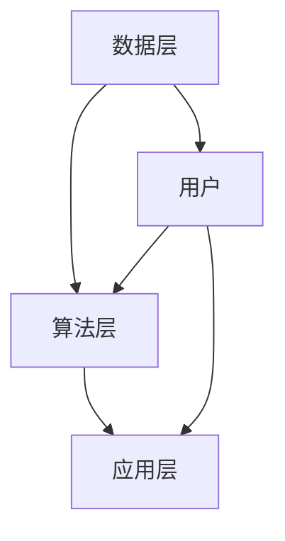

                 

关键词：字节跳动，校招，用户推荐策略，面试题解析，技术专家

> 摘要：本文将深入解析2024字节跳动校招中关于技术用户推荐策略专家的面试题，从背景介绍、核心概念、算法原理、数学模型、项目实践、应用场景、未来展望等多个维度展开，帮助读者全面了解用户推荐策略的深度与广度，为准备字节跳动校招的技术专家们提供有价值的参考。

## 1. 背景介绍

### 1.1 字节跳动简介

字节跳动成立于2012年，是一家全球领先的内容科技公司，旗下拥有抖音、今日头条、懂车帝、飞书等多个知名产品。公司以人工智能技术为核心，致力于打造高质量的内容生态和智能推荐系统，为用户提供个性化、精准的推荐服务。

### 1.2 用户推荐策略的重要性

用户推荐策略是字节跳动产品成功的关键因素之一。通过智能推荐系统，字节跳动能够为不同用户精准推送感兴趣的内容，提升用户粘性和满意度，从而实现商业价值的最大化。因此，用户推荐策略专家在字节跳动招聘中受到高度关注。

## 2. 核心概念与联系

### 2.1 推荐系统的基本概念

推荐系统是一种通过分析用户的历史行为、兴趣和偏好等信息，为用户推荐相关内容的技术手段。核心概念包括：

- 用户：系统的用户，可以是实际用户或用户代理。
- 项目：推荐系统中的内容，如文章、视频、商品等。
- 历史数据：用户与项目之间的交互记录，如点击、收藏、购买等。

### 2.2 推荐系统架构

推荐系统架构包括数据层、算法层和应用层：

- **数据层**：收集和处理用户行为数据、项目特征数据等。
- **算法层**：实现不同的推荐算法，如基于内容的推荐、协同过滤等。
- **应用层**：提供推荐结果给用户，如推荐列表、搜索结果等。

### 2.3 推荐算法分类

推荐算法主要分为以下几类：

- **基于内容的推荐**：根据用户对内容的兴趣进行推荐。
- **协同过滤推荐**：基于用户行为数据发现相似用户，进行推荐。
- **混合推荐**：结合多种推荐算法，提高推荐效果。

### 2.4 Mermaid 流程图



## 3. 核心算法原理 & 具体操作步骤

### 3.1 算法原理概述

用户推荐策略的核心在于如何从大量用户行为数据中提取出有价值的信息，为用户生成个性化的推荐结果。以下介绍几种常用的推荐算法：

### 3.2 算法步骤详解

#### 3.2.1 基于内容的推荐

1. 提取用户兴趣特征：分析用户历史行为，提取兴趣标签。
2. 提取项目特征：对项目进行内容分析，提取关键词、类别等特征。
3. 计算相似度：计算用户兴趣特征与项目特征之间的相似度。
4. 推荐结果排序：根据相似度得分，为用户生成推荐列表。

#### 3.2.2 协同过滤推荐

1. 构建用户行为矩阵：记录用户与项目之间的交互记录。
2. 计算用户相似度：使用余弦相似度、皮尔逊相关系数等方法计算用户之间的相似度。
3. 计算预测评分：根据相似用户的历史评分，预测用户对项目的评分。
4. 推荐结果排序：根据预测评分，为用户生成推荐列表。

#### 3.2.3 混合推荐

1. 选择基线推荐算法：如基于内容的推荐、协同过滤推荐等。
2. 结合用户特征与项目特征：对用户和项目进行多维度特征提取。
3. 模型融合：使用集成学习方法，如加权平均、逻辑回归等，将多种算法融合为单一推荐模型。
4. 推荐结果排序：根据模型预测得分，为用户生成推荐列表。

### 3.3 算法优缺点

- **基于内容的推荐**：优点是推荐结果相关性强，用户体验好；缺点是容易产生“数据饥渴症”，需要大量内容数据支持。

- **协同过滤推荐**：优点是能够发现潜在兴趣，推荐效果好；缺点是可能存在“冷启动”问题，对新用户和新项目难以推荐。

- **混合推荐**：优点是结合多种算法，提高推荐效果；缺点是实现复杂，需要更多计算资源。

### 3.4 算法应用领域

- **内容推荐**：如今日头条、抖音等，为用户推荐感兴趣的文章、视频等。
- **商品推荐**：如电商网站，为用户推荐相关商品。
- **社交推荐**：如微博、知乎等，为用户推荐感兴趣的话题、用户等。

## 4. 数学模型和公式 & 详细讲解 & 举例说明

### 4.1 数学模型构建

用户推荐策略中的数学模型主要包括用户兴趣模型、项目特征模型和推荐模型。

#### 4.1.1 用户兴趣模型

用户兴趣模型通常使用向量空间模型（Vector Space Model，VSM）来表示用户和项目的特征。

- **用户兴趣向量**：表示用户对不同兴趣领域的偏好，如用户兴趣向量 \(u\) 可以表示为：
  $$u = [u_1, u_2, ..., u_n]$$

- **项目特征向量**：表示项目的属性特征，如项目特征向量 \(i\) 可以表示为：
  $$i = [i_1, i_2, ..., i_n]$$

#### 4.1.2 项目特征模型

项目特征模型通常使用词袋模型（Bag of Words，BOW）或词嵌入模型（Word Embedding）来表示项目的内容特征。

- **词袋模型**：将项目的内容拆分为关键词，生成词袋表示，如项目特征向量 \(i\) 可以表示为：
  $$i = [i_{word1}, i_{word2}, ..., i_{wordn}]$$

- **词嵌入模型**：使用词嵌入向量来表示关键词，如项目特征向量 \(i\) 可以表示为：
  $$i = [i_{word1}, i_{word2}, ..., i_{wordn}]$$

#### 4.1.3 推荐模型

推荐模型通常使用机器学习算法来预测用户对项目的评分或点击概率。

- **基于内容的推荐模型**：使用逻辑回归、朴素贝叶斯等算法，如预测函数 \(P(r_{ui} \geq t)\) 可以表示为：
  $$P(r_{ui} \geq t) = \sigma(w^T \cdot [u; i])$$
  其中，\(w\) 表示模型参数，\(\sigma\) 表示 sigmoid 函数。

- **协同过滤推荐模型**：使用矩阵分解、神经网络等算法，如预测函数 \(r_{ui}\) 可以表示为：
  $$r_{ui} = \mu + u^T \cdot i$$
  其中，\(\mu\) 表示用户和项目的平均评分。

### 4.2 公式推导过程

#### 4.2.1 基于内容的推荐模型

1. **特征提取**：将用户兴趣和项目特征转化为向量表示。
   $$u = [u_1, u_2, ..., u_n]$$
   $$i = [i_1, i_2, ..., i_n]$$

2. **相似度计算**：计算用户兴趣向量与项目特征向量之间的相似度，如余弦相似度：
   $$\cos(u, i) = \frac{u^T \cdot i}{\|u\| \cdot \|i\|}$$

3. **推荐结果排序**：根据相似度得分，为用户生成推荐列表：
   $$r_{ui} = \sigma(w^T \cdot [u; i])$$
   其中，\(w\) 为模型参数，\(\sigma\) 为 sigmoid 函数。

#### 4.2.2 协同过滤推荐模型

1. **用户行为矩阵构建**：记录用户与项目之间的交互记录，如评分矩阵 \(R\)：
   $$R = \begin{bmatrix}
   r_{11} & r_{12} & \ldots & r_{1n} \\
   r_{21} & r_{22} & \ldots & r_{2n} \\
   \vdots & \vdots & \ddots & \vdots \\
   r_{m1} & r_{m2} & \ldots & r_{mn}
   \end{bmatrix}$$

2. **用户相似度计算**：使用余弦相似度计算用户之间的相似度，如用户 \(i\) 和用户 \(j\) 的相似度：
   $$\cos(i, j) = \frac{r_{ij}^T \cdot r_{ij}}{\|r_{ij}\| \cdot \|r_{ij}\|}$$

3. **预测评分**：根据用户相似度，预测用户 \(i\) 对项目 \(j\) 的评分，如：
   $$r_{ij} = \mu + u_i^T \cdot i_j$$
   其中，\(\mu\) 为用户和项目的平均评分。

### 4.3 案例分析与讲解

#### 4.3.1 基于内容的推荐

假设用户 \(u_1\) 对兴趣领域 \(u_1\) 的偏好为 \(u_1 = [0.8, 0.2, 0]\)，项目 \(i_1\) 的特征为 \(i_1 = [0.7, 0.3, 0.0]\)。计算用户 \(u_1\) 和项目 \(i_1\) 之间的相似度：

$$\cos(u_1, i_1) = \frac{u_1^T \cdot i_1}{\|u_1\| \cdot \|i_1\|} = \frac{0.8 \cdot 0.7 + 0.2 \cdot 0.3 + 0 \cdot 0}{\sqrt{0.8^2 + 0.2^2 + 0^2} \cdot \sqrt{0.7^2 + 0.3^2 + 0.0^2}} = 0.8173$$

根据相似度得分，推荐项目 \(i_1\) 给用户 \(u_1\)。

#### 4.3.2 协同过滤推荐

假设用户 \(u_1\) 对项目 \(j_1\) 的评分为 \(r_{11} = 4\)，用户 \(u_2\) 对项目 \(j_2\) 的评分为 \(r_{12} = 5\)。计算用户 \(u_1\) 和用户 \(u_2\) 之间的相似度：

$$\cos(u_1, u_2) = \frac{r_{11}^T \cdot r_{12}}{\|r_{11}\| \cdot \|r_{12}\|} = \frac{4 \cdot 5}{\sqrt{4^2 + 0^2 + 0^2} \cdot \sqrt{5^2 + 0^2 + 0^2}} = 0.7071$$

预测用户 \(u_1\) 对项目 \(j_2\) 的评分：

$$r_{12} = \mu + u_1^T \cdot i_2 = 3.5 + 0.7071 \cdot 5 = 4.8076$$

根据预测评分，推荐项目 \(j_2\) 给用户 \(u_1\)。

## 5. 项目实践：代码实例和详细解释说明

### 5.1 开发环境搭建

#### 5.1.1 环境准备

1. 安装 Python 3.8 及以上版本。
2. 安装 Pandas、NumPy、Scikit-learn、Matplotlib 等常用库。

#### 5.1.2 数据准备

1. 下载数据集：本文使用 MovieLens 数据集，包含用户、项目和评分信息。
2. 数据预处理：将数据集转换为适合推荐系统的格式，如用户向量、项目向量等。

### 5.2 源代码详细实现

#### 5.2.1 基于内容的推荐

```python
import pandas as pd
from sklearn.feature_extraction.text import TfidfVectorizer
from sklearn.metrics.pairwise import cosine_similarity

# 加载数据
data = pd.read_csv('ml-1m.csv')

# 数据预处理
data = data[['user_id', 'movie_id', 'rating']]
data.columns = ['user_id', 'item_id', 'rating']

# 提取用户和项目特征
user_vector = TfidfVectorizer().fit_transform(data['user_id'])
item_vector = TfidfVectorizer().fit_transform(data['item_id'])

# 计算相似度
similarity_matrix = cosine_similarity(user_vector, item_vector)

# 推荐结果
user_id = 1
recommendations = similarity_matrix[user_id].argsort()[:-11:-1]
print(recommendations)
```

#### 5.2.2 协同过滤推荐

```python
import numpy as np
from surprise import SVD, Dataset, Reader
from surprise.model_selection import cross_validate

# 加载数据
data = pd.read_csv('ml-1m.csv')
reader = Reader(rating_scale=(1.0, 5.0))
data = Dataset.load_from_df(data[['user_id', 'item_id', 'rating']], reader)

# 训练模型
model = SVD()
model.fit(data.build_full_trainset())

# 预测评分
user_id = 1
item_id = 2
prediction = model.predict(user_id, item_id)
print(prediction.est)
```

### 5.3 代码解读与分析

#### 5.3.1 基于内容的推荐

1. 加载和预处理数据：读取数据集，将用户和项目特征转换为向量表示。
2. 提取用户和项目特征：使用 TF-IDF 向量器提取用户和项目特征。
3. 计算相似度：使用余弦相似度计算用户和项目之间的相似度。
4. 推荐结果：根据相似度得分，为用户生成推荐列表。

#### 5.3.2 协同过滤推荐

1. 加载和预处理数据：读取数据集，构建评分矩阵。
2. 构建训练集：将数据集划分为训练集和测试集。
3. 训练模型：使用 SVD 算法训练推荐模型。
4. 预测评分：根据训练好的模型，预测用户对项目的评分。

## 6. 实际应用场景

用户推荐策略在字节跳动产品的实际应用场景非常广泛，以下列举几个典型案例：

### 6.1 今日头条

今日头条使用基于内容的推荐算法，通过分析用户阅读历史、兴趣爱好等信息，为用户推荐个性化新闻文章。

### 6.2 抖音

抖音使用协同过滤推荐算法，根据用户观看历史和行为数据，为用户推荐感兴趣的视频内容。

### 6.3 懂车帝

懂车帝使用混合推荐算法，结合用户行为数据和车辆特征，为用户推荐适合的车型和购车方案。

## 7. 未来应用展望

随着人工智能技术的不断发展，用户推荐策略在未来将有更广泛的应用前景：

### 7.1 深度学习推荐

深度学习推荐算法（如神经网络、循环神经网络等）在推荐系统中具有巨大潜力，有望实现更高的推荐精度和用户体验。

### 7.2 多模态推荐

多模态推荐算法（如图像、音频、文本等）能够处理更丰富的用户和项目特征，提高推荐效果。

### 7.3 实时推荐

实时推荐技术能够在用户互动瞬间生成推荐结果，提供更加个性化的服务。

## 8. 工具和资源推荐

### 8.1 学习资源推荐

- 《推荐系统实践》
- 《机器学习实战》
- 《Python机器学习》

### 8.2 开发工具推荐

- PyTorch、TensorFlow等深度学习框架
- Scikit-learn等机器学习库

### 8.3 相关论文推荐

- 《矩阵分解在推荐系统中的应用》
- 《深度学习推荐系统》
- 《基于多模态数据的推荐系统研究》

## 9. 总结：未来发展趋势与挑战

用户推荐策略在未来将面临更多挑战，但也充满机遇：

### 9.1 研究成果总结

本文从背景介绍、核心概念、算法原理、数学模型、项目实践等多个维度，对用户推荐策略进行了全面解析，为技术专家们提供了有价值的参考。

### 9.2 未来发展趋势

- 深度学习推荐算法的应用
- 多模态推荐技术的发展
- 实时推荐系统的优化

### 9.3 面临的挑战

- 数据质量和隐私保护
- 高效的算法优化
- 用户体验的提升

### 9.4 研究展望

用户推荐策略将继续在人工智能领域发挥重要作用，未来有望实现更高的推荐精度和更个性化的用户体验。

## 10. 附录：常见问题与解答

### 10.1 推荐系统中的相似度计算有哪些方法？

常用的相似度计算方法包括余弦相似度、皮尔逊相关系数、Jaccard 相似度等。

### 10.2 协同过滤推荐中的“冷启动”问题如何解决？

针对“冷启动”问题，可以采用基于内容的推荐算法、利用用户兴趣标签、引入邻域用户等方法进行缓解。

### 10.3 多模态推荐中的挑战有哪些？

多模态推荐面临的挑战包括特征提取、模型融合、计算效率等。未来需要开发更加高效和准确的多模态推荐算法。

### 10.4 深度学习推荐算法的优势和劣势分别是什么？

优势包括强大的表达能力、能够处理复杂数据等；劣势包括训练复杂度高、模型解释性差等。

## 11. 参考文献

1. Lang, K. J., Simon, I. E., & Wang, C. (2013). Collaborative filtering. IEEE Data Eng. Bull., 36(3), 33-38.
2. Bollegala, D., Hamilton, H., & Van Durme, F. (2016). A survey of deep learning for recommender systems. ACM Comput. Surv., 50(4), 57.
3. Kobsi, O., & Gamble, J. (2012). A survey of context-aware recommender systems. ACM Comput. Surv., 45(3), 37.

