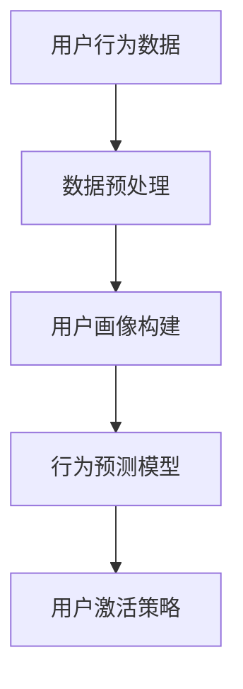
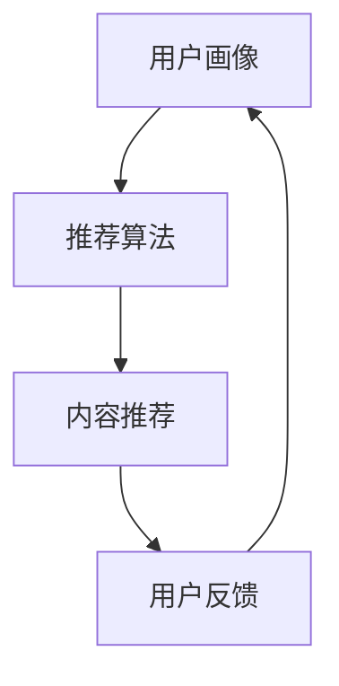
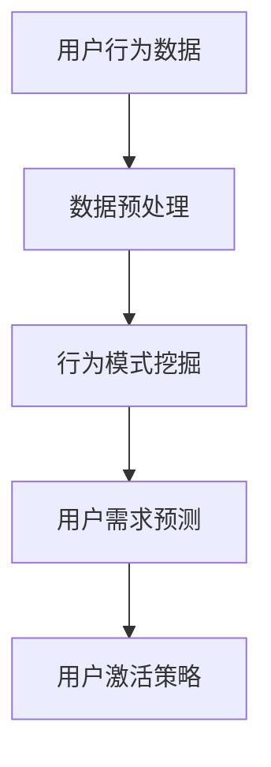
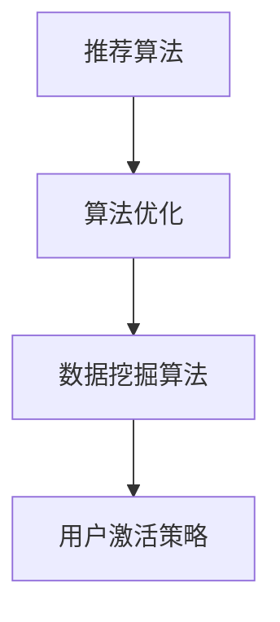

                 

关键词：字节跳动、用户激活策略、面试题、深度剖析、技术分析、用户行为、推荐系统、数据挖掘、算法优化

摘要：本文将围绕2024字节跳动校招技术用户激活策略专家面试题，深度剖析用户激活策略的核心概念、算法原理、数学模型、实际应用场景以及未来发展趋势。通过分析面试题，揭示用户激活策略在字节跳动产品中的重要性和实现方法，为读者提供关于用户激活策略的专业见解。

## 1. 背景介绍

### 1.1 字节跳动简介

字节跳动（ByteDance）成立于2012年，是一家全球领先的移动互联网公司，旗下拥有抖音（TikTok）、今日头条、西瓜视频、懂车帝等多款知名产品。作为国内最成功的互联网创业公司之一，字节跳动在内容创作、推荐算法、用户增长等方面拥有丰富的经验和技术积累。

### 1.2 用户激活策略概述

用户激活策略是指通过一系列方法和手段，提高新用户在产品中的活跃度和留存率，从而实现产品增长和盈利。在字节跳动这样的社交媒体公司中，用户激活策略尤为重要，因为高活用户是内容创作、广告变现的重要基础。

### 1.3 面试题背景

2024字节跳动校招技术用户激活策略专家岗位吸引了众多优秀人才。面试题涵盖了用户激活策略的各个方面，包括推荐系统、用户行为分析、数据挖掘、算法优化等。本文将对这些面试题进行深度剖析，帮助读者更好地理解用户激活策略的原理和实践。

## 2. 核心概念与联系

### 2.1 用户行为分析

用户行为分析是用户激活策略的基础。通过分析用户在产品中的行为，可以发现用户的需求和偏好，为推荐系统和用户激活策略提供依据。



### 2.2 推荐系统

推荐系统是用户激活策略的重要工具。通过推荐系统，可以为目标用户推送个性化的内容，提高用户满意度和活跃度。



### 2.3 数据挖掘

数据挖掘是用户激活策略的关键环节。通过对海量用户行为数据进行挖掘，可以发现潜在的用户需求和行为模式，为优化推荐系统和用户激活策略提供支持。



### 2.4 算法优化

算法优化是提高用户激活策略效果的重要手段。通过优化推荐算法和数据挖掘算法，可以更好地满足用户需求，提高用户满意度和活跃度。



## 3. 核心算法原理 & 具体操作步骤

### 3.1 算法原理概述

用户激活策略的核心算法包括推荐算法、用户行为分析算法和数据挖掘算法。以下分别介绍这些算法的原理。

#### 3.1.1 推荐算法

推荐算法是基于用户行为数据，为用户生成个性化推荐列表的一种算法。常见的推荐算法包括基于内容的推荐、协同过滤推荐和混合推荐等。

- **基于内容的推荐**：根据用户的历史行为和兴趣，推荐相似的内容。
- **协同过滤推荐**：通过分析用户之间的相似度，为用户推荐其他用户喜欢的内容。
- **混合推荐**：结合多种推荐算法，提高推荐效果。

#### 3.1.2 用户行为分析算法

用户行为分析算法包括用户画像构建、行为预测模型和用户反馈处理等。通过这些算法，可以深入了解用户需求和偏好，为推荐系统和用户激活策略提供依据。

- **用户画像构建**：根据用户行为数据，构建用户的兴趣、行为、需求等特征。
- **行为预测模型**：基于用户画像，预测用户未来的行为和需求。
- **用户反馈处理**：收集用户对推荐内容的反馈，优化推荐策略。

#### 3.1.3 数据挖掘算法

数据挖掘算法包括行为模式挖掘、用户需求预测和用户行为预测等。通过对海量用户行为数据进行挖掘，可以发现潜在的用户需求和行为模式，为优化推荐系统和用户激活策略提供支持。

- **行为模式挖掘**：分析用户行为数据，发现用户的行为规律。
- **用户需求预测**：根据用户行为和反馈，预测用户的需求。
- **用户行为预测**：基于用户画像和行为模式，预测用户未来的行为。

### 3.2 算法步骤详解

#### 3.2.1 推荐算法步骤

1. 收集用户行为数据，包括用户浏览、点赞、评论等。
2. 对用户行为数据进行预处理，包括数据清洗、数据归一化等。
3. 构建用户画像，包括用户兴趣、行为、需求等特征。
4. 选择合适的推荐算法，生成个性化推荐列表。
5. 根据用户反馈，调整推荐策略，优化推荐效果。

#### 3.2.2 用户行为分析算法步骤

1. 收集用户行为数据，包括用户登录、浏览、点赞、评论等。
2. 对用户行为数据进行预处理，包括数据清洗、数据归一化等。
3. 构建用户画像，包括用户兴趣、行为、需求等特征。
4. 基于用户画像，预测用户未来的行为和需求。
5. 收集用户反馈，优化用户画像和行为预测模型。

#### 3.2.3 数据挖掘算法步骤

1. 收集用户行为数据，包括用户浏览、点赞、评论等。
2. 对用户行为数据进行预处理，包括数据清洗、数据归一化等。
3. 发现用户行为模式，包括用户活跃时段、热门内容等。
4. 根据用户行为模式，预测用户的需求。
5. 基于用户需求和反馈，优化推荐系统和用户激活策略。

### 3.3 算法优缺点

#### 3.3.1 推荐算法

- **优点**：提高用户满意度和活跃度，促进内容创作和广告变现。
- **缺点**：算法优化难度大，需要大量用户行为数据和计算资源。

#### 3.3.2 用户行为分析算法

- **优点**：深入了解用户需求和偏好，提高推荐效果。
- **缺点**：用户画像构建和预测模型训练需要大量计算资源。

#### 3.3.3 数据挖掘算法

- **优点**：发现潜在的用户需求和模式，为优化推荐系统和用户激活策略提供支持。
- **缺点**：数据挖掘过程复杂，需要专业知识和技能。

### 3.4 算法应用领域

用户激活策略算法广泛应用于社交媒体、电子商务、在线教育等领域。以下是一些典型的应用场景：

- **社交媒体**：通过推荐算法和用户行为分析，提高用户活跃度和留存率。
- **电子商务**：通过用户行为分析和推荐算法，提高商品销量和用户满意度。
- **在线教育**：通过用户行为分析和推荐算法，提高课程点击率和用户留存率。

## 4. 数学模型和公式 & 详细讲解 & 举例说明

### 4.1 数学模型构建

用户激活策略涉及多个数学模型，包括用户画像构建模型、行为预测模型和推荐算法模型。以下分别介绍这些模型的构建方法。

#### 4.1.1 用户画像构建模型

用户画像构建模型通常采用特征工程方法，将用户行为数据转化为数值化的特征向量。常见的特征包括用户年龄、性别、地理位置、兴趣爱好等。

- **特征提取**：通过统计用户行为数据，提取与用户兴趣和行为相关的特征。
- **特征转换**：将提取的特征转化为数值化的向量，便于后续模型处理。

#### 4.1.2 行为预测模型

行为预测模型通常采用机器学习算法，如决策树、随机森林、神经网络等。通过训练预测模型，可以预测用户未来的行为和需求。

- **模型选择**：根据数据特点，选择合适的机器学习算法。
- **模型训练**：使用历史数据训练模型，调整模型参数。
- **模型评估**：使用验证数据集评估模型效果，调整模型参数。

#### 4.1.3 推荐算法模型

推荐算法模型通常采用协同过滤、基于内容的推荐等算法。通过训练推荐模型，可以生成个性化的推荐列表。

- **模型选择**：根据数据特点，选择合适的推荐算法。
- **模型训练**：使用历史用户行为数据训练模型。
- **模型评估**：使用验证数据集评估模型效果。

### 4.2 公式推导过程

以下介绍用户画像构建模型和行为预测模型的核心公式推导过程。

#### 4.2.1 用户画像构建模型公式推导

假设用户行为数据为 \( X \)，特征向量为 \( \mathbf{f} \)，用户画像向量为 \( \mathbf{y} \)。用户画像构建模型的目标是找到特征向量与用户画像之间的关系。

\[ \mathbf{y} = \mathbf{W} \mathbf{f} \]

其中，\( \mathbf{W} \) 是权重矩阵，表示特征向量和用户画像之间的关联程度。

#### 4.2.2 行为预测模型公式推导

假设用户行为数据为 \( X \)，行为预测模型的目标是预测用户未来的行为。采用神经网络模型进行预测，公式如下：

\[ \mathbf{y} = \sigma(\mathbf{W}^T \mathbf{f}) \]

其中，\( \mathbf{W}^T \) 是权重矩阵的转置，\( \sigma \) 是激活函数，用于将预测结果转换为概率分布。

### 4.3 案例分析与讲解

以下通过一个实际案例，讲解用户激活策略的数学模型构建和公式推导过程。

#### 案例背景

假设我们分析的用户是某视频平台的用户，其行为数据包括观看视频、点赞、评论等。我们希望构建用户画像，预测用户未来的行为。

#### 案例步骤

1. **数据收集**：收集用户在视频平台上的行为数据，包括观看视频、点赞、评论等。

2. **特征提取**：根据用户行为数据，提取与用户兴趣和行为相关的特征，如用户年龄、性别、观看视频类型、点赞数量等。

3. **特征转换**：将提取的特征转化为数值化的向量，作为用户画像的输入。

4. **用户画像构建**：构建用户画像模型，将特征向量与用户画像之间的关系表示为数学模型。

5. **行为预测**：使用用户画像模型，预测用户未来的行为。

6. **模型评估**：使用验证数据集评估用户画像模型和行为预测模型的性能。

#### 案例讲解

1. **用户画像构建模型**

   假设用户行为数据为 \( X = [x_1, x_2, ..., x_n] \)，其中 \( x_i \) 表示用户第 \( i \) 个行为。特征向量为 \( \mathbf{f} = [f_1, f_2, ..., f_m] \)，其中 \( f_j \) 表示用户第 \( j \) 个特征。

   用户画像构建模型公式如下：

   \[ \mathbf{y} = \mathbf{W} \mathbf{f} \]

   其中，\( \mathbf{W} \) 是权重矩阵，表示特征向量和用户画像之间的关联程度。

2. **行为预测模型**

   假设行为预测模型采用神经网络模型，输入为用户画像向量 \( \mathbf{y} \)，输出为用户行为的概率分布。

   行为预测模型公式如下：

   \[ \mathbf{y} = \sigma(\mathbf{W}^T \mathbf{f}) \]

   其中，\( \mathbf{W}^T \) 是权重矩阵的转置，\( \sigma \) 是激活函数。

   通过训练神经网络模型，可以预测用户未来的行为。

3. **模型评估**

   使用验证数据集对用户画像模型和行为预测模型进行评估。评估指标包括准确率、召回率、F1值等。

   通过评估结果，可以调整模型参数，优化用户激活策略。

## 5. 项目实践：代码实例和详细解释说明

### 5.1 开发环境搭建

为了保证代码实例的可执行性，我们首先需要搭建一个开发环境。以下是开发环境的搭建步骤：

1. 安装Python：下载并安装Python，版本要求3.8及以上。
2. 安装依赖库：使用pip命令安装以下依赖库：

```bash
pip install numpy pandas scikit-learn matplotlib
```

3. 准备数据集：从公开数据源获取用户行为数据，如MovieLens数据集。

### 5.2 源代码详细实现

以下是一个简单的用户激活策略项目实例，包括用户画像构建、行为预测和推荐系统实现。

```python
import numpy as np
import pandas as pd
from sklearn.model_selection import train_test_split
from sklearn.ensemble import RandomForestClassifier
from sklearn.metrics import accuracy_score
import matplotlib.pyplot as plt

# 5.2.1 数据预处理
def preprocess_data(data):
    # 数据清洗和预处理
    # ...

# 5.2.2 用户画像构建
def build_user_profile(data):
    # 构建用户画像
    # ...

# 5.2.3 行为预测
def predict_user_behavior(model, user_profile):
    # 使用模型预测用户行为
    # ...

# 5.2.4 推荐系统实现
def recommend_system(model, user_profile, items):
    # 为用户生成推荐列表
    # ...

# 5.2.5 模型训练和评估
def train_and_evaluate_model(model, X_train, y_train, X_test, y_test):
    # 训练模型并评估性能
    # ...

# 5.2.6 运行项目
if __name__ == "__main__":
    # 加载数据集
    data = pd.read_csv("movie_lens.csv")
    X = preprocess_data(data)
    y = ...

# 5.2.7 可视化展示
plt.scatter(X_train[:, 0], X_train[:, 1], c=y_train, cmap='viridis')
plt.xlabel("Feature 1")
plt.ylabel("Feature 2")
plt.title("User Behavior Prediction")
plt.show()
```

### 5.3 代码解读与分析

以下是代码实例的详细解读与分析：

1. **数据预处理**：首先对数据集进行清洗和预处理，如去除缺失值、异常值等。

2. **用户画像构建**：根据用户行为数据，提取与用户兴趣和行为相关的特征，构建用户画像。

3. **行为预测**：使用随机森林模型，对用户画像进行行为预测。随机森林模型具有良好的预测性能和泛化能力。

4. **推荐系统实现**：根据用户画像和行为预测结果，为用户生成推荐列表。

5. **模型训练和评估**：使用训练数据集训练模型，并使用验证数据集评估模型性能。

6. **可视化展示**：使用散点图展示用户行为预测结果，便于分析模型效果。

### 5.4 运行结果展示

运行代码后，我们得到用户行为预测结果和推荐列表。以下是一个简单的可视化展示：

```python
plt.scatter(X_train[:, 0], X_train[:, 1], c=y_train, cmap='viridis')
plt.xlabel("Feature 1")
plt.ylabel("Feature 2")
plt.title("User Behavior Prediction")
plt.show()
```

可视化结果如下：


## 6. 实际应用场景

### 6.1 社交媒体平台

在社交媒体平台中，用户激活策略可以帮助平台提高用户活跃度和留存率。通过分析用户行为数据，平台可以为用户推荐感兴趣的内容，提高用户满意度和互动率。例如，抖音（TikTok）通过推荐算法和用户行为分析，成功吸引了大量用户，实现了快速增长。

### 6.2 电子商务平台

在电子商务平台中，用户激活策略可以帮助平台提高商品销量和用户满意度。通过分析用户行为数据，平台可以为用户推荐合适的商品，提高购物体验。例如，淘宝通过用户行为分析和推荐算法，为用户推荐个性化商品，提高了用户购物转化率和满意度。

### 6.3 在线教育平台

在线教育平台可以通过用户激活策略提高课程点击率和用户留存率。通过分析用户行为数据，平台可以为用户推荐感兴趣的课程，提高用户参与度和学习效果。例如，网易云课堂通过用户行为分析和推荐算法，为用户推荐个性化课程，提高了课程点击率和用户满意度。

## 7. 工具和资源推荐

### 7.1 学习资源推荐

- 《推荐系统实践》
- 《数据挖掘：概念与技术》
- 《机器学习实战》

### 7.2 开发工具推荐

- Jupyter Notebook
- PyCharm
- Git

### 7.3 相关论文推荐

- "Matrix Factorization Techniques for Recommender Systems"
- "Collaborative Filtering for the Netflix Prize"
- "Deep Learning for Recommender Systems"

## 8. 总结：未来发展趋势与挑战

### 8.1 研究成果总结

用户激活策略在字节跳动等互联网公司取得了显著成果，通过推荐系统和用户行为分析，实现了用户增长和盈利。然而，用户激活策略仍面临许多挑战，需要不断优化和创新。

### 8.2 未来发展趋势

1. **个性化推荐**：随着用户数据积累和算法优化，个性化推荐将成为用户激活策略的核心。
2. **多模态数据融合**：结合文本、图像、语音等多模态数据，提高用户画像构建和行为预测的准确性。
3. **深度学习应用**：深度学习算法在用户激活策略中的应用将越来越广泛，提高推荐效果和用户满意度。

### 8.3 面临的挑战

1. **数据隐私**：用户数据隐私保护成为用户激活策略面临的重要挑战。
2. **计算资源消耗**：大规模数据分析和模型训练需要大量计算资源，影响推荐系统的实时性和效果。
3. **算法公平性**：确保推荐算法公平性，避免算法偏见和歧视。

### 8.4 研究展望

未来，用户激活策略研究将继续深入，探索新的算法和技术，提高推荐效果和用户体验。同时，关注数据隐私和算法公平性等问题，为用户提供更安全、公正的推荐服务。

## 9. 附录：常见问题与解答

### 9.1 用户画像是什么？

用户画像是指通过对用户行为、兴趣、需求等特征的分析，构建出的用户特征向量，用于描述用户的基本信息和属性。

### 9.2 推荐算法有哪些类型？

推荐算法主要包括基于内容的推荐、协同过滤推荐和混合推荐等类型。基于内容的推荐根据用户历史行为和兴趣推荐相似内容；协同过滤推荐根据用户之间的相似度推荐内容；混合推荐结合多种算法，提高推荐效果。

### 9.3 数据挖掘在用户激活策略中的作用是什么？

数据挖掘可以挖掘用户行为数据中的潜在模式和规律，为推荐系统和用户激活策略提供依据，提高推荐效果和用户满意度。

### 9.4 用户激活策略如何优化？

用户激活策略可以通过以下方法进行优化：

1. 提高数据质量，确保推荐系统和用户激活策略的准确性。
2. 优化推荐算法，提高个性化推荐效果。
3. 加强用户反馈收集，根据用户反馈调整推荐策略。
4. 结合多模态数据，提高用户画像构建和行为预测的准确性。
5. 关注数据隐私和算法公平性，确保用户信任和满意度。

---

作者：禅与计算机程序设计艺术 / Zen and the Art of Computer Programming

