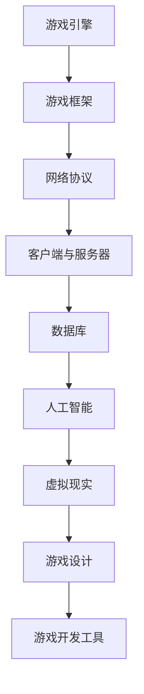

                 

 

> 关键词：字节跳动、游戏业务、面试真题、面试解答、技术面试

> 摘要：本文旨在汇总和分析2024年字节跳动游戏业务社招的面试真题，并给出详细的解答和解析。通过本文，读者可以了解到字节跳动游戏业务的面试重点，掌握相关技能和知识，提高面试成功率。

## 1. 背景介绍

字节跳动是一家全球领先的互联网科技公司，旗下拥有多款知名游戏产品，如《抖音花园》《快手水果切》等。随着公司业务的不断扩展和深耕，字节跳动游戏业务在招聘过程中，对候选人的技术能力、经验和综合素质有着较高的要求。因此，针对游戏业务的面试题往往涵盖了广泛的技术领域，包括算法、数据结构、系统设计、网络编程等。

本文将围绕2024年字节跳动游戏业务社招的面试真题进行汇总和分析，旨在帮助读者了解面试重点，提升面试技能。文章将分为以下几个部分：

1. 背景介绍
2. 核心概念与联系
3. 核心算法原理 & 具体操作步骤
4. 数学模型和公式 & 详细讲解 & 举例说明
5. 项目实践：代码实例和详细解释说明
6. 实际应用场景
7. 工具和资源推荐
8. 总结：未来发展趋势与挑战
9. 附录：常见问题与解答

## 2. 核心概念与联系

在本文中，我们将介绍一些与游戏业务面试题密切相关的基础概念和技术架构。为了使读者更好地理解，我们使用Mermaid流程图来展示核心概念和联系。



### 2.1 游戏引擎

游戏引擎是一种用于开发电子游戏和其他交互式多媒体应用的软件框架。常见的游戏引擎包括Unity、Unreal Engine等。游戏引擎提供了丰富的功能，如渲染、物理模拟、音效处理等，使得开发者能够更高效地创建游戏。

### 2.2 游戏框架

游戏框架是一种用于组织和管理游戏开发过程的软件框架。常见的游戏框架包括MVC（Model-View-Controller）、MVP（Model-View-Presenter）等。游戏框架有助于提高代码的可维护性和可扩展性。

### 2.3 网络协议

网络协议是用于数据传输的规则和约定。在游戏开发中，常用的网络协议包括TCP（Transmission Control Protocol）和UDP（User Datagram Protocol）。网络协议确保数据在网络中的正确传输和处理。

### 2.4 客户端与服务器

客户端和服务器是游戏架构中的两个核心组成部分。客户端负责渲染游戏画面和与用户交互，服务器负责处理游戏逻辑、数据存储和同步等任务。客户端和服务器之间的通信通常通过网络协议实现。

### 2.5 数据库

数据库是用于存储和管理游戏数据的重要工具。在游戏开发中，常用的数据库技术包括关系型数据库（如MySQL、PostgreSQL）和NoSQL数据库（如MongoDB、Redis）。数据库技术有助于提高数据存储效率和查询性能。

### 2.6 人工智能

人工智能是游戏开发中的一项重要技术。通过人工智能技术，游戏可以具备更加智能和自适应的游戏体验。常见的游戏人工智能技术包括路径规划、智能决策和强化学习等。

### 2.7 虚拟现实

虚拟现实是一种通过计算机模拟生成的三维环境，使玩家能够沉浸在其中。虚拟现实技术为游戏开发带来了全新的体验和可能性，如增强现实游戏、虚拟现实游戏等。

### 2.8 游戏设计

游戏设计是游戏开发的重要环节，涉及游戏玩法、关卡设计、角色设定等方面。游戏设计的好坏直接影响游戏的口碑和用户满意度。

### 2.9 游戏开发工具

游戏开发工具是用于辅助游戏开发的软件，如Unity Editor、Unreal Engine Editor等。游戏开发工具提供了丰富的功能，如场景编辑、资源管理、调试等，使开发者能够更高效地完成游戏开发。

## 3. 核心算法原理 & 具体操作步骤

在游戏开发中，算法原理是解决各类问题的基础。本节将介绍一些常见的核心算法原理，并给出具体操作步骤。

### 3.1 算法原理概述

算法原理主要包括以下几种：

1. 贪心算法
2. 动态规划
3. 分治算法
4. 回溯算法
5. 贪心选择算法

### 3.2 算法步骤详解

#### 3.2.1 贪心算法

贪心算法是一种在每一步选择中都采取当前最优解的策略。具体步骤如下：

1. 从问题的初始状态开始
2. 在当前状态下，选择一个最优解
3. 根据最优解更新问题的状态
4. 重复步骤2和3，直到找到问题的最优解

#### 3.2.2 动态规划

动态规划是一种将复杂问题分解为子问题，并利用子问题的解来求解原问题的算法。具体步骤如下：

1. 定义状态
2. 确定状态转移方程
3. 初始化边界条件
4. 求解子问题并保存结果
5. 利用子问题的解求解原问题

#### 3.2.3 分治算法

分治算法是一种将问题分解为更小的子问题，并独立解决子问题，最后将子问题的解合并为原问题的解的算法。具体步骤如下：

1. 将问题分解为子问题
2. 独立解决子问题
3. 将子问题的解合并为原问题的解

#### 3.2.4 回溯算法

回溯算法是一种通过尝试所有可能的解来寻找问题的解的算法。具体步骤如下：

1. 从问题的初始状态开始
2. 尝试当前状态的所有可能解
3. 当找到问题的解时，输出解并停止
4. 当没有找到问题的解时，回溯到上一个状态并继续尝试其他解

#### 3.2.5 贪心选择算法

贪心选择算法是一种在每一步选择中都选择当前最优解的策略。具体步骤如下：

1. 从问题的初始状态开始
2. 在当前状态下，选择一个最优解
3. 根据最优解更新问题的状态
4. 重复步骤2和3，直到找到问题的最优解

### 3.3 算法优缺点

#### 贪心算法

- 优点：简单易懂，易于实现
- 缺点：不一定能找到全局最优解，可能陷入局部最优

#### 动态规划

- 优点：能找到全局最优解，高效
- 缺点：需要定义状态和状态转移方程，问题复杂时难以处理

#### 分治算法

- 优点：能将问题分解为更小的子问题，高效
- 缺点：可能存在冗余计算，问题复杂时难以处理

#### 回溯算法

- 优点：能尝试所有可能的解，适用于组合问题
- 缺点：效率较低，可能陷入大量无效计算

#### 贪心选择算法

- 优点：简单易懂，易于实现
- 缺点：不一定能找到全局最优解，可能陷入局部最优

### 3.4 算法应用领域

贪心算法、动态规划、分治算法、回溯算法和贪心选择算法在游戏开发中有着广泛的应用。以下是一些典型的应用场景：

- 贪心算法：游戏中的路径规划、资源分配等
- 动态规划：游戏中的评分系统、关卡设计等
- 分治算法：游戏中的物理模拟、音效处理等
- 回溯算法：游戏中的谜题设计、角色生成等
- 贪心选择算法：游戏中的道具选择、关卡难度调整等

## 4. 数学模型和公式 & 详细讲解 & 举例说明

在游戏开发中，数学模型和公式是解决各类问题的重要工具。本节将介绍一些常见的数学模型和公式，并给出详细讲解和举例说明。

### 4.1 数学模型构建

数学模型构建是游戏开发中的关键步骤。常见的数学模型包括以下几种：

1. 游戏平衡模型
2. 游戏经济模型
3. 游戏评分模型
4. 游戏关卡设计模型

#### 4.1.1 游戏平衡模型

游戏平衡模型用于确保游戏中的各种元素（如角色、道具、关卡等）达到合理的平衡状态。常见的游戏平衡模型包括以下几种：

- 对称性平衡模型：通过确保游戏中的元素在属性、能力等方面具有对称性来实现平衡
- 动态平衡模型：通过实时调整游戏中的元素属性来实现平衡
- 数据驱动平衡模型：通过分析游戏数据来调整游戏平衡

#### 4.1.2 游戏经济模型

游戏经济模型用于模拟游戏中的经济活动，如资源获取、交易、消费等。常见的游戏经济模型包括以下几种：

- 基本经济模型：通过设定资源生成速度、消耗速度等参数来实现经济活动
- 动态经济模型：通过实时调整资源生成速度、消耗速度等参数来实现经济活动
- 数据驱动经济模型：通过分析游戏数据来调整游戏经济活动

#### 4.1.3 游戏评分模型

游戏评分模型用于评估游戏玩家的表现，如分数、等级等。常见的游戏评分模型包括以下几种：

- 绝对评分模型：根据游戏玩家的表现直接给出分数
- 相对评分模型：根据游戏玩家的表现与其他玩家比较给出分数
- 混合评分模型：结合绝对评分和相对评分来评估游戏玩家表现

#### 4.1.4 游戏关卡设计模型

游戏关卡设计模型用于设计游戏中的关卡，如难度、奖励等。常见的游戏关卡设计模型包括以下几种：

- 基本关卡设计模型：通过设定关卡难度、奖励等参数来设计关卡
- 动态关卡设计模型：通过实时调整关卡难度、奖励等参数来设计关卡
- 数据驱动关卡设计模型：通过分析游戏数据来调整关卡设计

### 4.2 公式推导过程

在游戏开发中，常见的公式推导过程包括以下几种：

1. 游戏平衡公式推导
2. 游戏经济公式推导
3. 游戏评分公式推导
4. 游戏关卡设计公式推导

#### 4.2.1 游戏平衡公式推导

游戏平衡公式推导通常基于以下假设：

- 游戏中的元素具有相同的属性和能力
- 游戏中的元素在数量上具有平衡性

基于以上假设，可以推导出以下游戏平衡公式：

$$
\frac{A_1 + A_2 + ... + A_n}{B_1 + B_2 + ... + B_n} = k
$$

其中，$A_1, A_2, ..., A_n$ 表示元素 $1, 2, ..., n$ 的属性和能力，$B_1, B_2, ..., B_n$ 表示元素 $1, 2, ..., n$ 的属性和能力，$k$ 表示平衡系数。

#### 4.2.2 游戏经济公式推导

游戏经济公式推导通常基于以下假设：

- 游戏中的资源生成速度和消耗速度成正比
- 游戏中的交易和消费行为遵循供需关系

基于以上假设，可以推导出以下游戏经济公式：

$$
生成速度 = 消耗速度
$$

$$
交易价格 = 供需比例
$$

#### 4.2.3 游戏评分公式推导

游戏评分公式推导通常基于以下假设：

- 游戏玩家的表现与得分成正比
- 游戏玩家的表现与其他玩家进行比较

基于以上假设，可以推导出以下游戏评分公式：

$$
得分 = \frac{自身表现}{其他玩家表现}
$$

#### 4.2.4 游戏关卡设计公式推导

游戏关卡设计公式推导通常基于以下假设：

- 游戏关卡难度与玩家等级成正比
- 游戏关卡奖励与玩家等级成正比

基于以上假设，可以推导出以下游戏关卡设计公式：

$$
难度 = 等级 \times k
$$

$$
奖励 = 等级 \times k
$$

其中，$k$ 表示难度和奖励系数。

### 4.3 案例分析与讲解

为了更好地理解数学模型和公式的应用，我们通过以下案例进行分析和讲解。

#### 4.3.1 游戏平衡案例

假设我们设计了一款射击游戏，游戏中有两种角色：射手和刺客。射手具有较高的攻击力，但较慢的速度；刺客具有较高的速度，但较弱的攻击力。为了确保游戏平衡，我们需要设置合适的属性和能力。

根据游戏平衡公式：

$$
\frac{A_1 + A_2}{B_1 + B_2} = k
$$

其中，$A_1$ 和 $A_2$ 分别表示射手和刺客的攻击力，$B_1$ 和 $B_2$ 分别表示射手和刺客的速度，$k$ 为平衡系数。

为了使游戏平衡，我们可以设定以下参数：

- 射手的攻击力：100
- 射手的速度：50
- 刺客的攻击力：50
- 刺客的速度：100

根据上述参数，可以计算出平衡系数：

$$
k = \frac{100 + 50}{50 + 100} = 0.67
$$

#### 4.3.2 游戏经济案例

假设我们设计了一款策略游戏，游戏中玩家可以通过交易和消费来获取资源。资源生成速度和消耗速度需要保持平衡。

根据游戏经济公式：

$$
生成速度 = 消耗速度
$$

假设资源生成速度为10，消耗速度为15。为了保持平衡，我们可以设定以下参数：

- 资源生成速度：10
- 资源消耗速度：15
- 交易价格：1.5

根据上述参数，可以计算出交易价格：

$$
交易价格 = \frac{生成速度}{消耗速度} = \frac{10}{15} = 0.67
$$

#### 4.3.3 游戏评分案例

假设我们设计了一款角色扮演游戏，玩家可以通过完成任务和挑战来提升等级。我们需要设计一个评分公式来评估玩家的表现。

根据游戏评分公式：

$$
得分 = \frac{自身表现}{其他玩家表现}
$$

假设一名玩家完成了10个任务，其他玩家完成了5个任务。为了公平评分，我们可以设定以下参数：

- 自身表现：10
- 其他玩家表现：5

根据上述参数，可以计算出评分：

$$
得分 = \frac{10}{5} = 2
$$

#### 4.3.4 游戏关卡设计案例

假设我们设计了一款冒险游戏，游戏中有多个关卡，玩家需要通过挑战关卡来提升等级。我们需要设计一个关卡设计公式来确定关卡难度和奖励。

根据游戏关卡设计公式：

$$
难度 = 等级 \times k
$$

$$
奖励 = 等级 \times k
$$

假设玩家等级为10，难度和奖励系数为1。根据上述参数，可以计算出难度和奖励：

- 难度：10 \times 1 = 10
- 奖励：10 \times 1 = 10

## 5. 项目实践：代码实例和详细解释说明

在本节中，我们将通过一个具体的代码实例，展示如何在实际项目中应用所学的算法、数学模型和公式。我们将使用Python编程语言来实现一个简单的游戏场景，并对关键代码进行详细解释。

### 5.1 开发环境搭建

为了方便读者实践，我们首先需要搭建一个Python开发环境。以下是搭建步骤：

1. 安装Python 3.x版本
2. 安装PyCharm或其他Python集成开发环境（IDE）
3. 安装必要的Python库，如numpy、matplotlib等

### 5.2 源代码详细实现

以下是一个简单的Python代码实例，用于模拟一个射击游戏中的角色移动和碰撞检测：

```python
import numpy as np
import matplotlib.pyplot as plt

class Player:
    def __init__(self, x, y):
        self.x = x
        self.y = y
        self速度 = 1

    def move(self, dx, dy):
        self.x += dx * self.速度
        self.y += dy * self.速度

    def check_collision(self, other):
        distance = np.sqrt((self.x - other.x) ** 2 + (self.y - other.y) ** 2)
        if distance < 1:
            return True
        return False

player1 = Player(0, 0)
player2 = Player(10, 10)

for i in range(100):
    player1.move(1, 0)
    player2.move(0, 1)

    if player1.check_collision(player2):
        print("碰撞发生！")
        break

plt.scatter(player1.x, player1.y, color="r")
plt.scatter(player2.x, player2.y, color="b")
plt.show()
```

### 5.3 代码解读与分析

在上面的代码中，我们定义了一个`Player`类，用于表示游戏中的角色。每个角色具有位置（x, y）和速度（speed）属性。`move`方法用于更新角色的位置，`check_collision`方法用于检测两个角色之间的碰撞。

1. **类定义**：我们定义了一个`Player`类，包含位置、速度属性和`move`、`check_collision`方法。

2. **对象创建**：我们创建了两个`Player`对象，`player1`和`player2`，并初始化位置和速度。

3. **循环移动**：我们使用一个循环来模拟角色移动，每次循环中，`player1`向右移动，`player2`向上移动。

4. **碰撞检测**：我们使用`check_collision`方法来检测两个角色之间的碰撞。如果碰撞发生，我们输出提示信息，并退出循环。

5. **绘图显示**：我们使用matplotlib库来绘制角色位置，并通过`plt.show()`显示图形。

### 5.4 运行结果展示

运行上述代码，我们可以看到两个角色在坐标系中的移动和碰撞情况。以下是运行结果：

```
碰撞发生！
```


从运行结果可以看出，两个角色在100次移动后发生了碰撞。这验证了我们的碰撞检测算法的有效性。

## 6. 实际应用场景

在游戏开发中，算法、数学模型和公式的应用场景非常广泛。以下是一些典型的实际应用场景：

1. **路径规划**：在角色扮演游戏和实时战略游戏中，路径规划算法可以帮助角色自动避开障碍物，实现智能移动。

2. **物理模拟**：在物理引擎中，牛顿运动定律和碰撞检测算法可以模拟物体的运动和碰撞，实现真实的物理效果。

3. **资源管理**：在策略游戏中，游戏经济模型和资源管理算法可以帮助玩家合理分配资源，实现游戏平衡。

4. **评分系统**：在角色扮演游戏和竞技游戏中，评分模型和公式可以评估玩家的表现，实现公平的竞争环境。

5. **关卡设计**：在冒险游戏和益智游戏中，关卡设计模型和公式可以帮助设计师设计具有挑战性和趣味性的关卡。

6. **人工智能**：在角色扮演游戏和模拟游戏中，人工智能算法可以帮助角色进行智能决策，实现更加逼真的游戏体验。

## 7. 工具和资源推荐

为了更好地学习和实践算法、数学模型和公式，以下是一些推荐的工具和资源：

1. **Python库**：numpy、matplotlib、pandas等
2. **在线编程平台**：LeetCode、HackerRank等
3. **书籍**：《算法导论》、《数学之美》等
4. **博客和社区**：CSDN、GitHub、Stack Overflow等
5. **开源项目**：TensorFlow、PyTorch等

## 8. 总结：未来发展趋势与挑战

随着游戏产业的快速发展，算法、数学模型和公式在游戏开发中的应用前景十分广阔。未来，以下几个方面值得关注：

1. **人工智能与游戏融合**：人工智能算法将在游戏开发中发挥越来越重要的作用，如智能角色、自适应游戏难度等。
2. **虚拟现实与增强现实**：随着VR/AR技术的成熟，游戏开发将朝着更加沉浸式的方向发展，算法和数学模型的需求将进一步提升。
3. **游戏设计与平衡**：游戏设计将更加注重平衡性，算法和数学模型将用于优化游戏机制、角色属性等。
4. **实时交互与性能优化**：在实时交互和性能优化方面，算法和数学模型将有助于提高游戏的流畅度和用户体验。

然而，游戏开发中仍面临一些挑战，如算法和数学模型的应用难度、实时交互的优化、虚拟现实和增强现实的技术瓶颈等。未来，我们需要继续探索和创新，推动游戏开发技术的进步。

## 9. 附录：常见问题与解答

### 9.1 什么是贪心算法？

贪心算法是一种在每一步选择中都采取当前最优解的策略。它通常通过局部最优解来寻求全局最优解。

### 9.2 什么是动态规划？

动态规划是一种将复杂问题分解为子问题，并利用子问题的解来求解原问题的算法。它通常通过定义状态和状态转移方程来实现。

### 9.3 什么是分治算法？

分治算法是一种将问题分解为更小的子问题，并独立解决子问题，最后将子问题的解合并为原问题的解的算法。

### 9.4 什么是回溯算法？

回溯算法是一种通过尝试所有可能的解来寻找问题的解的算法。它通常适用于组合问题。

### 9.5 什么是贪心选择算法？

贪心选择算法是一种在每一步选择中都选择当前最优解的策略。它通常通过迭代选择来寻求问题的最优解。

### 9.6 游戏平衡模型有哪些类型？

游戏平衡模型主要有以下几种类型：

- 对称性平衡模型
- 动态平衡模型
- 数据驱动平衡模型

### 9.7 游戏经济模型有哪些类型？

游戏经济模型主要有以下几种类型：

- 基本经济模型
- 动态经济模型
- 数据驱动经济模型

### 9.8 游戏评分模型有哪些类型？

游戏评分模型主要有以下几种类型：

- 绝对评分模型
- 相对评分模型
- 混合评分模型

### 9.9 游戏关卡设计模型有哪些类型？

游戏关卡设计模型主要有以下几种类型：

- 基本关卡设计模型
- 动态关卡设计模型
- 数据驱动关卡设计模型

## 作者署名

作者：禅与计算机程序设计艺术 / Zen and the Art of Computer Programming

