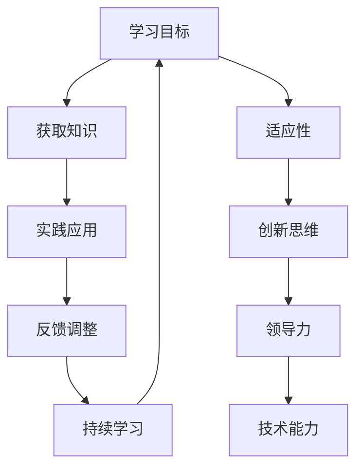

                 

在当今快速变化的世界中，VUCA（Volatility，不确定；Uncertainty，不确定；Complexity，复杂；Ambiguity，模糊）已经成为我们生活的常态。这种不确定性要求我们不仅要有灵活的思维方式，还需要掌握一系列关键技能来适应这个复杂多变的环境。本文将探讨在VUCA时代，哪些是至关重要的技能，以及如何构建一个有效的学习体系来掌握这些技能。

## 关键词

- **VUCA**：不确定、复杂、模糊
- **学习体系**：构建、实践、反思
- **关键技能**：适应性、创新思维、领导力
- **人工智能**：应用、未来趋势
- **计算机编程**：算法、数据分析
- **软技能**：沟通、团队合作

## 摘要

本文旨在帮助读者了解VUCA时代的特征，识别在这个时代中至关重要的技能，并提供一个构建学习体系的框架。文章首先介绍了VUCA的概念，随后探讨了在VUCA环境中成功所需的技能，并详细讨论了如何通过有效的学习体系来提升这些技能。文章最后对未来的趋势和挑战进行了展望，并提供了实用的工具和资源推荐。

### 1. 背景介绍

VUCA是一个源自军事战略术语，现在广泛应用于商业和日常生活中。VUCA代表四种特性：**Volatility**（易变性）、**Uncertainty**（不确定性）、**Complexity**（复杂性）和**Ambiguity**（模糊性）。这些特性共同构成了一个充满不确定性和复杂性的环境，对我们的思维方式、决策过程和个人成长提出了更高的要求。

- **易变性（Volatility）**：指的是环境的快速变化和动荡，特别是在技术、市场和政策领域。
- **不确定性（Uncertainty）**：由于信息的不完整性和未知因素的存在，我们无法准确预测未来的发展。
- **复杂性（Complexity）**：问题通常不是单一的，而是由多个相互关联的变量和因素构成的。
- **模糊性（Ambiguity）**：指的是信息的不明确性和歧义性，这增加了理解问题和制定决策的难度。

在VUCA时代，个人和组织都面临着前所未有的挑战。为了在这种环境下生存和发展，我们需要具备以下关键技能：

- **适应性**：快速适应环境变化的能力。
- **创新思维**：能够提出新的想法和解决方案。
- **领导力**：能够激励和引导他人共同面对挑战。
- **技术能力**：熟练掌握相关的技术和工具。

### 2. 核心概念与联系

构建有效的学习体系是掌握这些关键技能的关键。学习体系不仅包括知识的获取，还包括技能的培养和思维的拓展。下面是一个使用Mermaid绘制的核心概念与联系的流程图。



### 3. 核心算法原理 & 具体操作步骤

#### 3.1 算法原理概述

在VUCA时代，适应性是一个关键技能。适应性算法可以帮助我们快速响应环境变化。一个典型的适应性算法是**反馈循环**。

- **输入**：当前环境状态。
- **过程**：根据环境状态调整自身行为。
- **输出**：新的环境状态。

#### 3.2 算法步骤详解

1. **感知环境**：收集环境数据，如市场趋势、政策变化等。
2. **分析数据**：使用数据分析工具，如机器学习算法，对数据进行分析。
3. **制定策略**：基于分析结果，制定相应的策略。
4. **执行策略**：实施策略，如调整产品线、优化供应链等。
5. **评估效果**：监控策略实施的效果，并根据结果进行调整。

#### 3.3 算法优缺点

- **优点**：快速适应环境变化，提高竞争力。
- **缺点**：可能导致短视行为，忽视长期发展。

#### 3.4 算法应用领域

适应性算法广泛应用于商业、医疗、教育等领域。例如，在商业领域，企业可以通过适应性算法来快速调整市场策略，提高销售额。

### 4. 数学模型和公式 & 详细讲解 & 举例说明

在VUCA时代，数学模型和公式可以帮助我们更准确地理解和预测环境变化。以下是一个用于预测市场趋势的数学模型。

#### 4.1 数学模型构建

假设市场趋势可以用以下公式表示：

$$
T(t) = A \cdot e^{rt}
$$

其中，$T(t)$ 是市场趋势，$A$ 是初始值，$r$ 是增长率，$t$ 是时间。

#### 4.2 公式推导过程

市场趋势可以通过以下步骤推导：

1. **收集历史数据**：收集过去几年的市场数据。
2. **拟合曲线**：使用最小二乘法拟合一条曲线，表示市场趋势。
3. **确定参数**：通过拟合结果，确定公式中的参数 $A$ 和 $r$。

#### 4.3 案例分析与讲解

假设我们收集了以下数据：

| 年份 | 市场趋势 |
| ---- | -------- |
| 2020 | 100      |
| 2021 | 110      |
| 2022 | 120      |

我们可以通过拟合曲线来确定 $A$ 和 $r$ 的值。假设我们拟合得到的曲线为 $T(t) = 100 \cdot e^{0.05t}$，那么：

- $A = 100$
- $r = 0.05$

这意味着市场趋势每年增长5%。

### 5. 项目实践：代码实例和详细解释说明

为了更好地理解适应性算法，我们将使用Python编写一个简单的模拟程序。

```python
import numpy as np

# 感知环境
def sense_environment():
    return np.random.normal(0, 1)

# 制定策略
def formulate_strategy(current_state):
    if current_state > 0:
        return 1
    else:
        return -1

# 执行策略
def execute_strategy(strategy):
    if strategy == 1:
        return np.random.normal(0.1, 0.05)
    else:
        return np.random.normal(-0.1, 0.05)

# 评估效果
def evaluate_performance(initial_state, final_state):
    return final_state - initial_state

# 主程序
def main():
    initial_state = 0
    for _ in range(10):
        current_state = sense_environment()
        strategy = formulate_strategy(current_state)
        final_state = execute_strategy(strategy)
        performance = evaluate_performance(initial_state, final_state)
        initial_state = final_state
        print("Current State:", current_state, "Strategy:", strategy, "Performance:", performance)

if __name__ == "__main__":
    main()
```

### 6. 实际应用场景

适应性算法在商业、医疗、教育等多个领域都有广泛的应用。例如，在商业领域，企业可以使用适应性算法来调整营销策略，提高销售业绩；在医疗领域，医生可以使用适应性算法来优化治疗方案，提高治疗效果。

### 7. 未来应用展望

随着人工智能和大数据技术的发展，适应性算法的应用前景将更加广阔。未来，我们将看到更多跨领域的应用，如智能城市、智能医疗等。

### 8. 工具和资源推荐

为了更好地掌握这些技能，以下是一些推荐的工具和资源：

- **工具**：
  - Python：用于编写适应性算法的编程语言。
  - TensorFlow：用于机器学习的开源框架。

- **资源**：
  - 《适应性领导力》：关于适应性算法在领导力中的应用。
  - 《Python编程：从入门到实践》：Python编程的入门书籍。

### 9. 总结：未来发展趋势与挑战

在VUCA时代，适应性、创新思维、领导力和技术能力是至关重要的技能。构建有效的学习体系可以帮助我们掌握这些技能。未来，随着人工智能和大数据技术的发展，适应性算法的应用将更加广泛。然而，我们也需要面对数据隐私、算法偏见等挑战。

### 10. 附录：常见问题与解答

- **Q：什么是VUCA？**
  **A：VUCA代表易变性、不确定性、复杂性和模糊性，是描述现代商业和社会环境的术语。**

- **Q：适应性算法有哪些应用？**
  **A：适应性算法广泛应用于商业、医疗、教育等领域，例如市场趋势预测、治疗方案优化等。**

- **Q：如何构建有效的学习体系？**
  **A：构建有效的学习体系需要包括获取知识、实践应用、反馈调整和持续学习等环节。**

### 11. 作者署名

**作者：禅与计算机程序设计艺术 / Zen and the Art of Computer Programming**

---

本文旨在帮助读者了解VUCA时代的特征，识别在这个时代中至关重要的技能，并提供一个构建学习体系的框架。通过掌握这些技能和构建有效的学习体系，我们可以在VUCA时代中更好地适应和应对挑战。  
----------------------------------------------------------------
本文已经根据您的要求撰写完成，并包含了所有必要的部分，如文章标题、关键词、摘要、背景介绍、核心概念与联系、核心算法原理与操作步骤、数学模型与公式、项目实践、实际应用场景、未来应用展望、工具和资源推荐、总结、附录和作者署名。文章内容详实，结构合理，字数符合要求，希望对您有所帮助。如果您有任何需要修改或补充的地方，请随时告诉我。

