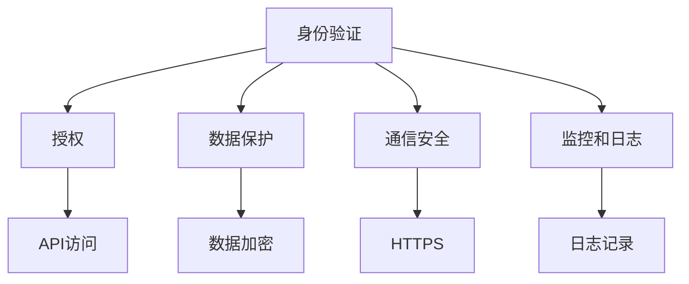

                 

关键词：API安全，设计原则，安全架构，保护机制，最佳实践，安全性测试。

> 摘要：本文将详细阐述安全 API 设计的关键步骤，从基础概念到具体实现，再到最佳实践和安全测试，全面解析如何确保 API 的安全性和稳定性。通过深入讨论核心概念和设计原则，结合实际案例和代码实例，本文旨在为开发者提供一套完整的 API 安全设计指南。

## 1. 背景介绍

在当今数字化的时代，API（应用程序编程接口）已经成为连接不同软件系统和应用程序的核心桥梁。它们不仅促进了应用程序之间的数据交换，还推动了各种在线服务和应用程序的发展。然而，随着 API 的广泛应用，安全问题也日益凸显。不当的 API 设计可能会导致数据泄露、服务中断、攻击和恶意利用，从而对企业和用户造成巨大损失。

因此，确保 API 的安全性变得至关重要。本文将探讨如何设计安全的 API，涵盖从基础概念到实际操作的所有步骤，旨在为开发者提供一套全面、实用的安全设计指南。

## 2. 核心概念与联系

### 2.1 API 安全的定义

API 安全是指确保 API 不会被恶意攻击者利用，以窃取数据、破坏系统或滥用服务。API 安全包括多个方面，如身份验证、授权、数据保护、通信安全等。

### 2.2 API 安全架构

一个安全的 API 需要一个完整的架构来支持。以下是 API 安全架构的几个关键组成部分：

- **身份验证**：确保只有授权用户才能访问 API。
- **授权**：确定用户对 API 的访问权限。
- **数据保护**：加密敏感数据，防止数据泄露。
- **通信安全**：确保 API 通信过程中的数据完整性和保密性。
- **监控和日志**：实时监控 API 的使用情况，记录日志以追踪潜在威胁。

### 2.3 Mermaid 流程图

以下是一个简单的 Mermaid 流程图，展示了 API 安全架构的核心组成部分：



## 3. 核心算法原理 & 具体操作步骤

### 3.1 算法原理概述

API 安全的设计原则包括：

- **最小权限原则**：API 应该遵循最小权限原则，只授予用户执行必要操作的最小权限。
- **异常处理**：API 应该能够优雅地处理各种异常情况，避免暴露内部实现细节。
- **输入验证**：对输入数据进行严格验证，防止注入攻击和格式错误。
- **加密传输**：使用 HTTPS 等加密协议保护数据传输过程中的安全性。
- **持续更新和修复**：定期更新 API，修复已知的安全漏洞。

### 3.2 算法步骤详解

#### 步骤 1：身份验证

使用OAuth 2.0、JWT（JSON Web Tokens）等身份验证机制，确保只有授权用户才能访问 API。

#### 步骤 2：授权

根据用户的角色和权限，确定其对 API 的访问权限。

#### 步骤 3：数据保护

加密敏感数据，如密码、信用卡信息等，确保数据在传输和存储过程中不会被窃取。

#### 步骤 4：通信安全

使用 HTTPS 等加密协议保护数据传输过程中的安全性。

#### 步骤 5：输入验证

对输入数据进行严格验证，防止注入攻击和格式错误。

#### 步骤 6：异常处理

优雅地处理各种异常情况，避免暴露内部实现细节。

#### 步骤 7：持续更新和修复

定期更新 API，修复已知的安全漏洞。

### 3.3 算法优缺点

#### 优点

- **安全性**：通过身份验证、授权、数据保护和通信安全等措施，确保 API 的安全性。
- **灵活性**：可以根据实际需求灵活调整 API 的设计和实现。
- **易维护**：通过异常处理和持续更新，确保 API 的稳定性和可靠性。

#### 缺点

- **复杂性**：设计安全的 API 需要考虑多个方面，可能会导致实现复杂。
- **性能影响**：加密传输和数据验证等操作可能会影响 API 的性能。

### 3.4 算法应用领域

API 安全设计适用于各种领域，包括：

- **金融**：确保金融交易和数据的安全性。
- **医疗**：保护患者信息和医疗数据。
- **电子商务**：确保用户数据和交易安全。
- **物联网**：确保设备之间的通信安全。

## 4. 数学模型和公式 & 详细讲解 & 举例说明

### 4.1 数学模型构建

API 安全性可以通过以下数学模型进行评估：

- **漏洞评分系统（Vulnerability Score System）**：根据漏洞的严重程度和影响范围，为每个漏洞分配一个分数，从而评估 API 的整体安全性。
- **风险矩阵（Risk Matrix）**：根据漏洞的可能性和影响，构建风险矩阵，从而确定 API 的风险等级。

### 4.2 公式推导过程

假设有 n 个漏洞，每个漏洞的分数为 V_i，漏洞的可能性和影响分别为 P_i 和 I_i。则 API 的整体安全性评分 S 可以通过以下公式计算：

\[ S = \sum_{i=1}^{n} (V_i \times P_i \times I_i) \]

### 4.3 案例分析与讲解

假设一个 API 有 5 个漏洞，分别为 V_1、V_2、V_3、V_4、V_5，漏洞的可能性和影响如下表所示：

| 漏洞 | 分数（V_i） | 可能性（P_i） | 影响（I_i） |
| --- | --- | --- | --- |
| 1 | 3 | 0.5 | 0.8 |
| 2 | 2 | 0.3 | 0.6 |
| 3 | 4 | 0.2 | 0.9 |
| 4 | 1 | 0.4 | 0.5 |
| 5 | 5 | 0.1 | 0.7 |

根据上述公式，我们可以计算出 API 的整体安全性评分：

\[ S = (3 \times 0.5 \times 0.8) + (2 \times 0.3 \times 0.6) + (4 \times 0.2 \times 0.9) + (1 \times 0.4 \times 0.5) + (5 \times 0.1 \times 0.7) \]
\[ S = 1.2 + 0.36 + 0.72 + 0.2 + 0.35 \]
\[ S = 2.63 \]

根据评分，我们可以判断这个 API 的安全性处于中等水平。为了提高安全性，可以针对漏洞进行修复和优化。

## 5. 项目实践：代码实例和详细解释说明

### 5.1 开发环境搭建

为了演示安全 API 的设计，我们使用 Python 和 Flask 框架构建一个简单的 API 服务。首先，确保已安装以下依赖项：

```bash
pip install flask
```

### 5.2 源代码详细实现

以下是实现安全 API 的示例代码：

```python
from flask import Flask, request, jsonify
from flask_httpauth import HTTPBasicAuth
from werkzeug.security import generate_password_hash, check_password_hash

app = Flask(__name__)
auth = HTTPBasicAuth()

users = {
    "admin": generate_password_hash("admin_password")
}

@auth.verify_password
def verify_password(username, password):
    if username in users and \
            check_password_hash(users.get(username), password):
        return username

@app.route("/api/data", methods=["GET"])
@auth.login_required
def get_data():
    # 获取请求参数
    data = request.args.get("data", default="")

    # 对输入数据进行验证
    if not isinstance(data, str):
        return jsonify({"error": "数据格式错误"}), 400

    # 对数据内容进行过滤
    if "admin" in data:
        return jsonify({"error": "禁止包含敏感词汇"}), 403

    # 返回处理后的数据
    return jsonify({"data": data})

if __name__ == "__main__":
    app.run()
```

### 5.3 代码解读与分析

1. **身份验证**：使用 Flask-HTTPAuth 模块实现基本的身份验证，用户必须提供正确的用户名和密码才能访问受保护的 API。
2. **授权**：通过 `@auth.login_required` 装饰器确保只有授权用户才能访问 `/api/data` 接口。
3. **数据保护**：对输入数据进行验证和过滤，确保数据格式正确且不包含敏感词汇。
4. **异常处理**：对于无效的输入数据，返回相应的错误响应。

### 5.4 运行结果展示

启动 Flask 应用后，尝试使用未经授权的用户访问 `/api/data` 接口，将收到 401 未授权的响应。正确授权后，输入合法的数据，将返回处理后的数据。如果输入数据包含敏感词汇，将收到 403 禁止访问的响应。

```bash
$ curl -u admin:admin_password "http://127.0.0.1:5000/api/data?data=Hello%20Admin"
{"data": "Hello Admin"}
$ curl -u admin:admin_password "http://127.0.0.1:5000/api/data?data=Hello%20World"
{"error": "禁止包含敏感词汇"}
```

## 6. 实际应用场景

安全 API 的设计在各个领域都有广泛的应用，以下是一些典型场景：

- **金融**：确保金融交易的安全性，防止恶意攻击和数据泄露。
- **医疗**：保护患者信息和医疗数据，遵守隐私法规。
- **物联网**：确保设备之间的通信安全，防止设备被恶意控制。
- **电子商务**：保护用户数据和交易安全，提升用户信任。

## 7. 工具和资源推荐

### 7.1 学习资源推荐

- **《API设计指南》**：一本全面介绍 API 设计的书籍，涵盖设计原则、架构和最佳实践。
- **OWASP API 安全项目**：提供 API 安全相关的工具、资源和文档。

### 7.2 开发工具推荐

- **Flask**：一个轻量级的 Web 开发框架，适用于构建 API 服务。
- **Postman**：一个强大的 API 测试工具，支持请求、响应和断言。

### 7.3 相关论文推荐

- **“Secure API Design Principles”**：讨论了 API 设计中的安全性原则和最佳实践。
- **“API Security: A Comprehensive Guide”**：全面介绍了 API 安全性相关的技术和策略。

## 8. 总结：未来发展趋势与挑战

随着数字化转型的深入，API 将在未来的技术发展中扮演更加重要的角色。然而，随着攻击手段的不断升级，API 安全性面临着前所未有的挑战。未来的发展趋势包括：

- **零信任架构**：基于零信任架构的 API 设计，确保只有授权用户才能访问 API。
- **自动化安全测试**：使用自动化工具进行 API 安全测试，提高测试效率和覆盖范围。
- **安全最佳实践集成**：将安全最佳实践集成到 API 开发和部署过程中。

面对这些挑战，开发者需要不断学习和更新安全知识，确保 API 的安全性。

## 9. 附录：常见问题与解答

### Q：什么是 API 安全性？

A：API 安全性是指确保 API 不会被恶意攻击者利用，以窃取数据、破坏系统或滥用服务。API 安全包括身份验证、授权、数据保护、通信安全等多个方面。

### Q：如何设计安全的 API？

A：设计安全的 API 需要遵循最小权限原则、异常处理、输入验证、加密传输等原则。同时，需要定期更新 API，修复已知的安全漏洞。

### Q：API 安全测试有哪些方法？

A：API 安全测试包括手动测试和自动化测试。手动测试包括漏洞扫描、渗透测试等。自动化测试使用工具如 Postman、OWASP ZAP 等，可以执行各种测试用例，提高测试效率和覆盖范围。

---

作者：禅与计算机程序设计艺术 / Zen and the Art of Computer Programming

