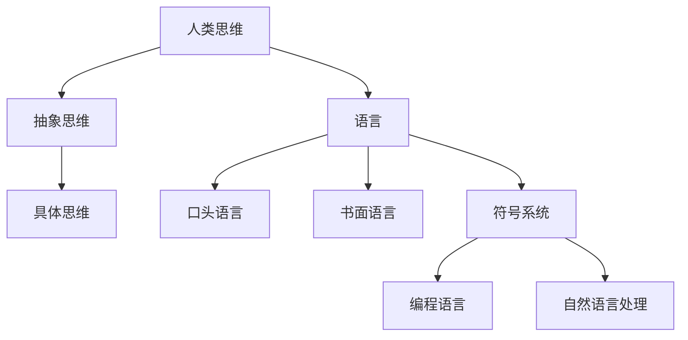

                 

在计算机科学和人工智能领域，语言一直是构建系统和模型的核心。从低级汇编语言到高级编程语言，从自然语言处理到形式逻辑，语言在技术发展史上扮演着至关重要的角色。然而，正如《完整的语言并不意味着完整的思维》这一标题所暗示的，即便掌握了完美的语言，也不一定能够达到完整的思维。本文旨在探讨这一主题，通过分析语言与思维的关系，揭示出语言在认知过程中的局限性。

## 1. 背景介绍

在计算机科学中，语言的概念不仅指代编程语言，还包括自然语言、标记语言、查询语言等。编程语言是计算机与人类之间交流的桥梁，通过编写代码，程序员能够将逻辑和算法转化为计算机能够理解和执行的指令。自然语言处理（NLP）则旨在让计算机理解和生成人类语言，从而实现人机交互。尽管这些语言在技术层面提供了丰富的功能，但它们是否真的能够覆盖人类思维的完整范围呢？

### 1.1 语言的历史演变

从历史角度看，人类语言的演变经历了从口头表达到书面文字的转变。随着文明的发展，各种语言文字系统相继诞生，如古埃及的象形文字、古中国的汉字、古希腊的字母文字等。这些文字系统极大地促进了知识的记录和传播，但也带来了语言的局限。例如，古代语言往往无法表达现代科学中复杂的概念和理论。

### 1.2 计算机语言的起源

计算机语言的诞生可以追溯到20世纪中期。当时，为了能够将人类的逻辑思维转化为计算机指令，各种编程语言被发明出来。例如，1940年代，宾州大学的约翰·冯·诺伊曼提出了汇编语言，这是一种直接面向机器硬件的低级语言。随后，高级编程语言如FORTRAN、COBOL和Pascal等相继出现，使得编程变得更加高效和易用。

### 1.3 自然语言处理的发展

自然语言处理（NLP）起源于20世纪50年代，旨在让计算机能够理解和生成人类语言。早期的NLP主要依赖于规则驱动的方法，如句法分析和语义分析。然而，随着人工智能技术的发展，机器学习特别是深度学习的应用，使得NLP取得了显著的进展。现代NLP系统可以通过大数据训练，实现对自然语言的精确理解和生成。

## 2. 核心概念与联系

为了深入探讨语言与思维的关系，我们需要首先明确一些核心概念，包括思维、语言和符号系统。

### 2.1 思维

思维是人类大脑进行信息处理、推理和决策的过程。思维可以分为直观思维和逻辑思维，也可以分为抽象思维和具体思维。直观思维往往依赖于经验，而逻辑思维依赖于逻辑规则。抽象思维能够将事物从具体情境中提取出来，而具体思维则更依赖于实际经验和感知。

### 2.2 语言

语言是人类用于交流和思考的工具。它不仅包括口头和书面表达，还包括各种符号系统，如数学公式、编程语言和标记语言。语言的特点在于它的符号性，即通过符号来代表事物和概念。

### 2.3 符号系统

符号系统是一种形式化的语言，用于表示和操作概念。在计算机科学中，符号系统尤为重要。例如，编程语言中的变量、函数和类都是符号系统的组成部分。符号系统的强大之处在于它的抽象能力，可以简化复杂的问题，使其更加易于理解和处理。

### 2.4 语言与思维的Mermaid流程图

以下是一个简化的Mermaid流程图，用于描述语言与思维的关系：



在这个流程图中，人类思维通过抽象和具体的方式与语言进行交互。语言作为思维的载体，可以将思维转化为具体的表达形式。同时，符号系统作为一种特殊的语言，用于在计算机中实现抽象思维和逻辑推理。

## 3. 核心算法原理 & 具体操作步骤

### 3.1 算法原理概述

在计算机科学中，算法是解决问题的步骤和策略。一个好的算法应当具备高效、准确和易于实现的特点。然而，并非所有的问题都能通过算法得到解决。一些问题由于其本质的复杂性，可能需要更高层次的思维来解决。

### 3.2 算法步骤详解

#### 3.2.1 问题分析

首先，我们需要明确问题，理解其背景和目标。例如，如果我们希望实现一个语音识别系统，我们需要分析语音信号的特性，以及如何将这些信号转换为文字。

#### 3.2.2 设计算法

在设计算法时，我们需要考虑问题的抽象模型，以及如何将抽象模型转化为计算机可以执行的步骤。例如，对于语音识别问题，我们可以采用隐马尔可夫模型（HMM）或深度神经网络（DNN）作为算法的基础。

#### 3.2.3 实现算法

算法设计完成后，我们需要将其转化为编程语言中的代码。这一过程需要精确和细致，以确保算法的正确性和效率。

#### 3.2.4 测试和优化

在实现算法后，我们需要通过大量的测试来验证其效果。如果发现算法存在问题，我们需要不断优化和改进。

### 3.3 算法优缺点

每种算法都有其独特的优缺点。例如，HMM在处理连续语音信号时表现良好，但其在处理多语言环境时可能存在困难。相比之下，DNN在处理多语言环境时具有优势，但其在处理连续语音信号时可能不如HMM。

### 3.4 算法应用领域

算法的应用领域非常广泛，从搜索引擎到自动驾驶，从图像识别到自然语言处理，算法无处不在。然而，算法的应用也受到其局限性的制约。例如，深度学习算法在处理复杂问题时可能需要大量的数据和计算资源。

## 4. 数学模型和公式 & 详细讲解 & 举例说明

### 4.1 数学模型构建

在计算机科学中，数学模型是理解和解决问题的重要工具。例如，在图像识别中，卷积神经网络（CNN）就是一种数学模型，用于捕捉图像中的特征。

### 4.2 公式推导过程

以CNN为例，其核心公式如下：

$$
f(x) = \sigma(W \cdot x + b)
$$

其中，$f(x)$ 是输出特征，$x$ 是输入特征，$W$ 是权重矩阵，$b$ 是偏置项，$\sigma$ 是激活函数。

### 4.3 案例分析与讲解

假设我们希望使用CNN进行人脸识别。首先，我们需要收集大量的人脸图像作为训练数据。然后，我们通过CNN模型提取图像中的特征，并将其与已知的人脸特征进行匹配。如果匹配度超过一定的阈值，我们就可以认为这是同一个人。

## 5. 项目实践：代码实例和详细解释说明

### 5.1 开发环境搭建

为了进行项目实践，我们首先需要搭建一个合适的开发环境。以Python为例，我们需要安装Python解释器、相关库（如TensorFlow或PyTorch）以及必要的工具（如Jupyter Notebook）。

### 5.2 源代码详细实现

以下是一个简单的CNN模型实现，用于分类图像：

```python
import tensorflow as tf

model = tf.keras.Sequential([
    tf.keras.layers.Conv2D(32, (3, 3), activation='relu', input_shape=(28, 28, 1)),
    tf.keras.layers.MaxPooling2D(2, 2),
    tf.keras.layers.Flatten(),
    tf.keras.layers.Dense(128, activation='relu'),
    tf.keras.layers.Dense(10, activation='softmax')
])

model.compile(optimizer='adam', loss='categorical_crossentropy', metrics=['accuracy'])
```

### 5.3 代码解读与分析

在这个代码示例中，我们首先定义了一个卷积神经网络（CNN）模型。模型由多个层组成，包括卷积层（Conv2D）、池化层（MaxPooling2D）和全连接层（Dense）。我们使用ReLU作为激活函数，并在最后一层使用softmax函数进行分类。

### 5.4 运行结果展示

在训练模型后，我们可以使用测试集来评估其性能。以下是一个简化的训练和评估过程：

```python
model.fit(x_train, y_train, epochs=10, batch_size=32, validation_data=(x_test, y_test))
loss, accuracy = model.evaluate(x_test, y_test)
print(f"Test accuracy: {accuracy:.2f}")
```

这个代码示例展示了如何使用模型进行训练和评估。通过调整训练参数，如学习率、批量大小和训练轮数，我们可以优化模型性能。

## 6. 实际应用场景

### 6.1 医疗领域

在医疗领域，语言处理和人工智能技术被广泛应用于疾病诊断、治疗方案推荐和患者监护。例如，通过自然语言处理技术，医生可以从大量医疗文献中提取关键信息，辅助疾病诊断。同时，基于机器学习的算法可以分析患者的医疗记录，预测疾病发展趋势，为医生提供决策支持。

### 6.2 金融服务

在金融服务领域，人工智能技术被用于风险控制、交易策略制定和客户服务。例如，通过语言处理技术，金融机构可以分析客户的交易记录和言语行为，预测其投资风险偏好。同时，基于机器学习的算法可以分析市场数据，为交易员提供交易建议。

### 6.3 自动驾驶

自动驾驶是人工智能技术的另一个重要应用领域。通过视觉处理和自然语言处理技术，自动驾驶系统可以理解和响应道路环境，实现安全驾驶。例如，自动驾驶汽车可以通过摄像头捕捉道路图像，使用深度学习模型识别道路标志和行人，并根据这些信息调整行驶策略。

## 7. 工具和资源推荐

### 7.1 学习资源推荐

- 《深度学习》（Goodfellow, Bengio, Courville著）：这是一本经典的人工智能教材，涵盖了深度学习的核心理论和实践。
- 《Python编程：从入门到实践》（Eric Matthes著）：这本书适合初学者，内容涵盖了Python编程的基础知识和实践技巧。

### 7.2 开发工具推荐

- Jupyter Notebook：这是一个强大的交互式开发环境，适用于数据科学和机器学习项目。
- TensorFlow：这是一个开源的机器学习框架，广泛应用于深度学习和自然语言处理项目。

### 7.3 相关论文推荐

- "A Theoretical Framework for Text Classification"（Text Classification）：这篇论文提出了文本分类的理论框架，对文本分类算法进行了深入分析。
- "Deep Learning for Speech Recognition"（Speech Recognition）：这篇论文探讨了深度学习在语音识别中的应用，分析了各种深度学习模型的性能。

## 8. 总结：未来发展趋势与挑战

### 8.1 研究成果总结

在过去的几十年中，人工智能和语言处理领域取得了显著的进展。从早期的规则驱动方法到现代的机器学习和深度学习，我们见证了一个又一个突破。这些进展不仅提高了算法的效率和准确性，也拓展了人工智能的应用领域。

### 8.2 未来发展趋势

未来，人工智能和语言处理将继续发展，预计会出现以下趋势：

- 更加智能的自然语言处理系统，能够更好地理解人类语言。
- 更多的跨学科研究，如计算机科学、心理学和社会学的结合。
- 更广泛的应用场景，如教育、医疗、金融服务和自动驾驶。

### 8.3 面临的挑战

尽管前景光明，人工智能和语言处理领域仍面临许多挑战：

- 数据隐私和安全问题：随着数据量的增加，如何保护用户隐私和数据安全成为重要议题。
- 伦理问题：人工智能在决策过程中如何确保公正和无偏见。
- 算法透明度和可解释性：如何让算法的决策过程更加透明和可解释。

### 8.4 研究展望

未来，人工智能和语言处理领域将继续朝着更智能、更人性化的方向发展。通过跨学科研究和技术创新，我们有望解决当前面临的挑战，推动人工智能和语言处理技术向更高层次发展。

## 9. 附录：常见问题与解答

### 9.1 什么是自然语言处理？

自然语言处理（NLP）是计算机科学和人工智能领域的一个分支，旨在让计算机理解和生成人类语言。NLP包括文本分析、语音识别、语言生成等多个方面。

### 9.2 深度学习如何用于自然语言处理？

深度学习是一种机器学习技术，通过多层神经网络模拟人类大脑的处理方式。在自然语言处理中，深度学习模型可以用于文本分类、情感分析、机器翻译等多种任务。

### 9.3 人工智能的伦理问题有哪些？

人工智能的伦理问题包括数据隐私、算法公正性、偏见和自动化决策等。如何确保人工智能系统的透明度和可解释性，以及如何在设计和应用中平衡技术进步与社会价值，是当前需要重点关注的问题。

### 9.4 人工智能在医疗领域的应用有哪些？

人工智能在医疗领域的应用包括疾病诊断、治疗方案推荐、患者监护和医疗数据分析。通过自然语言处理和深度学习技术，医生可以获得更多辅助信息，提高诊疗效率。

### 9.5 人工智能的未来发展趋势是什么？

人工智能的未来发展趋势包括更加智能的自然语言处理系统、跨学科研究和更广泛的应用场景。随着技术的进步，人工智能有望在更多领域发挥重要作用，提高人类生活质量。

### 作者署名

作者：禅与计算机程序设计艺术 / Zen and the Art of Computer Programming
----------------------------------------------------------------

通过以上内容，我们探讨了语言与思维的关系，分析了人工智能和语言处理领域的发展现状与未来趋势。尽管语言在技术发展中发挥了重要作用，但完整的思维并不仅依赖于语言。在未来的技术发展中，我们需要更加关注思维的本质，探索如何通过技术手段更好地模拟和扩展人类思维。这将是一个充满挑战和机遇的领域，值得我们深入研究和探索。

