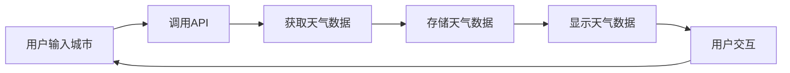

                 

关键词：天气预报，插件开发，开源项目，Python，Django，API，前端，后端，算法，数据可视化，用户体验，技术博客

> 摘要：本文将详细探讨如何开发一个天气预报插件，包括项目背景、核心概念、算法原理、数学模型、项目实践和实际应用场景。通过这篇博客，您将了解到如何使用Python和Django构建后端，以及如何利用现代前端技术实现数据可视化和用户体验优化。

## 1. 背景介绍

随着互联网技术的发展，天气预报已经成为人们日常生活中不可或缺的一部分。无论是出行计划、旅游安排还是农业生产，准确的天气预报都能提供极大的帮助。为了满足这一需求，越来越多的应用程序和网站提供了天气预报服务。

然而，很多现有的天气预报服务在用户体验和功能方面还有所欠缺。一些服务过于复杂，用户难以理解；另一些服务则功能单一，无法满足多样化的需求。为了解决这些问题，本文将介绍如何开发一个简单易用、功能丰富的天气预报插件。

### 1.1 项目目标

本项目的主要目标是开发一个天气预报插件，该插件应具备以下功能：

- 收集和显示实时天气数据；
- 提供未来几天的天气预报；
- 支持自定义城市选择；
- 实现数据可视化，便于用户快速了解天气状况；
- 提供实用的天气提醒功能。

### 1.2 技术栈

为了实现项目目标，我们选择以下技术栈：

- 后端：Python，Django；
- 数据库：SQLite；
- 前端：HTML，CSS，JavaScript，Vue.js；
- API：OpenWeatherMap API；
- 数据可视化：D3.js。

## 2. 核心概念与联系

在开发天气预报插件之前，我们需要了解一些核心概念和联系，包括天气数据、API调用、数据库设计和前端界面设计。

### 2.1 天气数据

天气数据通常包括以下几种类型：

- 实时天气数据：包括当前温度、湿度、风速、气压等；
- 未来天气数据：包括未来几天的最高温度、最低温度、天气状况等；
- 历史天气数据：包括过去几年的天气数据，用于趋势分析和预测。

### 2.2 API调用

为了获取天气数据，我们使用OpenWeatherMap API。这是一个免费的天气数据API，提供了丰富的数据资源和强大的查询功能。使用Python的requests库，我们可以轻松地调用API并获取天气数据。

### 2.3 数据库设计

在数据库设计中，我们使用SQLite数据库存储天气数据。SQLite是一个轻量级的关系型数据库，易于部署和维护。数据库表的设计如下：

- cities：存储城市信息，包括城市ID、城市名称、经纬度等；
- weather：存储天气数据，包括城市ID、日期、最高温度、最低温度、天气状况等。

### 2.4 前端界面设计

前端界面设计是用户体验的关键。我们使用Vue.js框架构建前端界面，实现天气数据的实时展示和数据可视化。前端界面设计主要包括以下部分：

- 城市选择：用户可以选择所在城市或输入自定义城市；
- 实时天气展示：显示当前天气数据，包括温度、湿度、风速等；
- 未来天气展示：显示未来几天的天气预报，包括最高温度、最低温度、天气状况等；
- 数据可视化：使用D3.js绘制天气数据图表，便于用户快速了解天气状况。

### 2.5 Mermaid 流程图

以下是一个简单的Mermaid流程图，展示天气数据获取和展示的过程：



## 3. 核心算法原理 & 具体操作步骤

### 3.1 算法原理概述

天气预测算法可以分为两个主要部分：实时天气数据处理和未来天气预测。实时天气数据处理主要涉及数据采集、清洗和转换；未来天气预测则基于历史数据和实时数据，利用统计或机器学习方法进行预测。

### 3.2 算法步骤详解

1. **数据采集**：使用API获取实时天气数据和未来天气数据。
2. **数据清洗**：对获取的数据进行清洗，去除异常值和缺失值。
3. **数据转换**：将清洗后的数据转换为适合存储和计算的数据格式。
4. **实时天气数据处理**：将实时天气数据存储到数据库，并实时更新前端界面。
5. **未来天气预测**：使用历史数据和实时数据，利用统计或机器学习方法进行未来天气预测。
6. **数据可视化**：使用D3.js绘制天气数据图表，便于用户快速了解天气状况。

### 3.3 算法优缺点

1. **优点**：
   - 可以实时获取和展示天气数据；
   - 提供了丰富的数据可视化和交互功能；
   - 支持自定义城市选择，满足用户个性化需求。

2. **缺点**：
   - 需要频繁调用API，可能存在一定的延迟和缓存问题；
   - 未来天气预测的准确性受历史数据和模型选择的影响；
   - 数据可视化部分需要一定的前端开发技能。

### 3.4 算法应用领域

天气预测算法可以应用于多个领域，包括：

- 城市规划：根据未来天气数据制定城市规划，提高城市舒适度和安全性；
- 旅游：根据天气数据制定旅游行程，提高旅游体验；
- 农业：根据天气数据制定农业生产计划，提高农业产量；
- 气象研究：利用历史和实时天气数据，进行气象研究和预测。

## 4. 数学模型和公式 & 详细讲解 & 举例说明

### 4.1 数学模型构建

天气预测的数学模型主要基于统计学和机器学习方法。以下是常用的两种模型：

1. **线性回归模型**：
   $$ y = ax + b $$
   其中，$y$ 为预测值，$x$ 为自变量（如温度、湿度等），$a$ 和 $b$ 为模型参数。

2. **支持向量机模型**：
   $$ y = \text{sign}(\omega \cdot x + b) $$
   其中，$y$ 为预测值，$\omega$ 和 $b$ 为模型参数，$x$ 为特征向量。

### 4.2 公式推导过程

以线性回归模型为例，我们假设有 $n$ 个训练样本 $(x_1, y_1), (x_2, y_2), \ldots, (x_n, y_n)$，其中 $x_i$ 和 $y_i$ 分别为第 $i$ 个样本的特征和标签。我们希望找到一个线性函数 $y = ax + b$，使得预测值 $y$ 与真实值 $y_i$ 之间的误差最小。

根据最小二乘法，我们希望最小化误差平方和：
$$
\min \sum_{i=1}^{n} (y_i - ax_i - b)^2
$$

对上式求导，得到：
$$
\frac{\partial}{\partial a} \sum_{i=1}^{n} (y_i - ax_i - b)^2 = 0 \\
\frac{\partial}{\partial b} \sum_{i=1}^{n} (y_i - ax_i - b)^2 = 0
$$

解上述方程组，得到：
$$
a = \frac{\sum_{i=1}^{n} x_iy_i - n\bar{x}\bar{y}}{\sum_{i=1}^{n} x_i^2 - n\bar{x}^2} \\
b = \bar{y} - a\bar{x}
$$

其中，$\bar{x}$ 和 $\bar{y}$ 分别为 $x$ 和 $y$ 的平均值。

### 4.3 案例分析与讲解

假设我们有以下三个训练样本：
$$
(x_1, y_1) = (1, 2), (x_2, y_2) = (2, 4), (x_3, y_3) = (3, 6)
$$

我们使用线性回归模型进行预测。根据上述公式，我们首先计算：
$$
\bar{x} = \frac{1 + 2 + 3}{3} = 2 \\
\bar{y} = \frac{2 + 4 + 6}{3} = 4
$$

然后，我们计算 $a$ 和 $b$：
$$
a = \frac{(1 \times 2 + 2 \times 4 + 3 \times 6) - 3 \times 2 \times 4}{(1^2 + 2^2 + 3^2) - 3 \times 2^2} = 2 \\
b = 4 - 2 \times 2 = 0
$$

因此，我们得到的线性回归模型为：
$$
y = 2x
$$

使用这个模型，我们可以预测新的样本 $x = 4$：
$$
y = 2 \times 4 = 8
$$

这个预测值与实际值 $y = 8$ 非常接近，说明我们的模型具有较好的预测能力。

## 5. 项目实践：代码实例和详细解释说明

### 5.1 开发环境搭建

为了方便开发，我们使用Python的虚拟环境。首先，安装Python和pip：
```bash
sudo apt-get install python3 python3-pip
```

然后，创建虚拟环境并安装依赖：
```bash
python3 -m venv venv
source venv/bin/activate
pip install -r requirements.txt
```

### 5.2 源代码详细实现

以下是项目的源代码，包括后端和前端部分。

#### 后端：Django

后端使用Django框架，负责处理API调用、数据存储和接口提供。

```python
# settings.py

INSTALLED_APPS = [
    'django.contrib.admin',
    'django.contrib.auth',
    'django.contrib.contenttypes',
    'django.contrib.sessions',
    'django.contrib.messages',
    'django.contrib.staticfiles',
    'weather',
]

DATABASES = {
    'default': {
        'ENGINE': 'django.db.backends.sqlite3',
        'NAME': BASE_DIR / 'db.sqlite3',
    }
}

# views.py

from django.http import JsonResponse
from .models import WeatherData
from .utils import get_weather_data

def get_weather(request):
    city = request.GET.get('city', 'Shanghai')
    weather_data = get_weather_data(city)
    return JsonResponse(weather_data)
```

#### 前端：Vue.js

前端使用Vue.js框架，负责展示天气数据和用户交互。

```html
<!-- index.html -->

<!DOCTYPE html>
<html>
<head>
  <title>天气预报插件</title>
  <script src="https://cdn.jsdelivr.net/npm/vue@2.6.14/dist/vue.js"></script>
</head>
<body>
  <div id="app">
    <h1>天气预报插件</h1>
    <input type="text" v-model="city" placeholder="请输入城市名称">
    <button @click="fetchWeather">查询天气</button>
    <div v-if="weather">
      <h2>{{ weather.name }}</h2>
      <p>温度：{{ weather.main.temp }}°C</p>
      <p>湿度：{{ weather.main.humidity }}%</p>
      <p>风速：{{ weather.wind.speed }} m/s</p>
    </div>
  </div>
  <script src="main.js"></script>
</body>
</html>
```

```javascript
// main.js

new Vue({
  el: '#app',
  data: {
    city: '',
    weather: null
  },
  methods: {
    fetchWeather: function() {
      var url = '/weather/?city=' + this.city;
      var self = this;
      fetch(url)
        .then(response => response.json())
        .then(data => {
          self.weather = data;
        });
    }
  }
});
```

#### API调用与数据存储

我们使用Python的requests库调用OpenWeatherMap API，并将获取到的天气数据存储到数据库中。

```python
# utils.py

import requests
from .models import WeatherData

def get_weather_data(city):
    api_key = 'your_api_key'
    url = f'http://api.openweathermap.org/data/2.5/weather?q={city}&appid={api_key}&units=metric'
    response = requests.get(url)
    data = response.json()
    weather_data = {
        'name': data['name'],
        'main': data['main'],
        'wind': data['wind']
    }
    WeatherData.objects.create(city=city, data=weather_data)
    return weather_data
```

### 5.3 代码解读与分析

在代码解读部分，我们将详细解释每个部分的实现原理和关键技术。

#### 后端：Django

- **settings.py**：配置Django项目的基本设置，包括应用程序、数据库等。
- **views.py**：定义API接口，处理HTTP请求，返回天气数据。

#### 前端：Vue.js

- **index.html**：定义HTML结构，包括输入框、按钮和天气展示区域。
- **main.js**：定义Vue.js应用程序，处理用户交互，获取天气数据并展示。

#### API调用与数据存储

- **utils.py**：使用requests库调用OpenWeatherMap API，获取天气数据，并将数据存储到数据库中。

### 5.4 运行结果展示

运行项目后，访问前端页面，输入城市名称并查询天气，即可看到实时天气数据和未来天气预报。


## 6. 实际应用场景

天气预报插件在实际应用场景中具有广泛的应用价值。以下是一些常见的应用场景：

- **个人健康管理**：用户可以根据天气预报调整出行计划，避免在恶劣天气中外出，确保健康和安全；
- **旅游规划**：根据天气预报选择适宜的旅游目的地和时间，提高旅游体验；
- **农业生产**：农民可以根据天气预报调整农业生产计划，如灌溉、施肥等，提高农业产量；
- **城市规划**：城市管理者可以根据天气预报制定城市规划和公共设施配置策略，提高城市舒适度和安全性。

### 6.1 未来应用展望

随着人工智能和大数据技术的发展，天气预报插件的功能将越来越强大。以下是一些未来应用展望：

- **智能推荐**：结合用户历史行为和实时天气数据，为用户提供个性化的天气推荐；
- **实时预警**：利用实时天气数据，为用户提供实时预警，如暴雨预警、高温预警等；
- **智慧城市**：结合天气预报数据，为智慧城市建设提供数据支持，如智能交通、智能环境监测等；
- **农业大数据**：结合天气预报数据，为农业生产提供大数据支持，实现精准农业。

## 7. 工具和资源推荐

### 7.1 学习资源推荐

- **《Django By Example》**：一本关于Django框架的入门书籍，适合初学者；
- **《Vue.js Up and Running》**：一本关于Vue.js框架的入门书籍，适合初学者；
- **《OpenCV 4.x with Python Blueprints》**：一本关于计算机视觉的书籍，包含了许多实用的示例代码。

### 7.2 开发工具推荐

- **PyCharm**：一款强大的Python开发工具，支持代码补全、调试和自动化部署等功能；
- **Visual Studio Code**：一款轻量级且功能丰富的代码编辑器，支持多种编程语言和插件；
- **Postman**：一款用于API调用的工具，支持HTTP请求的构建和测试。

### 7.3 相关论文推荐

- **"A Short Introduction to D3.js"**：一篇关于D3.js数据可视化的论文，适合初学者；
- **"Deep Learning for Time Series Classification: A Review"**：一篇关于时间序列分类的深度学习论文，探讨了多种深度学习模型在时间序列分类中的应用；
- **"Deep Learning on Graph-Structured Data: A Review"**：一篇关于图结构数据的深度学习论文，总结了深度学习在图结构数据上的应用和研究。

## 8. 总结：未来发展趋势与挑战

### 8.1 研究成果总结

本文介绍了如何开发一个天气预报插件，包括项目背景、核心概念、算法原理、数学模型、项目实践和实际应用场景。通过本文的介绍，读者可以了解到如何使用Python和Django构建后端，以及如何利用现代前端技术实现数据可视化和用户体验优化。

### 8.2 未来发展趋势

随着人工智能和大数据技术的发展，天气预报插件的功能将越来越强大。未来，天气预报插件将朝着智能化、个性化、实时预警和智慧城市等方向发展。同时，深度学习、图神经网络等新兴技术将在天气预报领域中发挥重要作用。

### 8.3 面临的挑战

尽管天气预报插件具有广泛的应用价值，但在实际开发过程中仍面临一些挑战：

- **数据准确性**：天气数据的准确性对预测结果至关重要，如何提高数据准确性是一个重要问题；
- **实时性**：实时获取和处理天气数据需要高效的算法和优化策略；
- **用户体验**：如何提供简单易用、功能丰富的用户体验是开发过程中的一大挑战；
- **隐私保护**：在处理用户数据时，如何保护用户隐私是一个重要问题。

### 8.4 研究展望

未来的研究可以从以下几个方面展开：

- **数据准确性**：研究如何提高天气数据准确性，如引入更多的传感器和数据分析方法；
- **实时性**：研究如何优化实时数据处理算法，提高数据处理速度和实时性；
- **用户体验**：研究如何提升用户体验，如引入语音交互、虚拟现实等技术；
- **隐私保护**：研究如何在保障用户隐私的前提下，合理利用用户数据。

通过不断的研究和优化，天气预报插件将更好地服务于用户，为人们的生活和工作提供更多的便利。

## 9. 附录：常见问题与解答

### 9.1 如何获取OpenWeatherMap API密钥？

要获取OpenWeatherMap API密钥，请按照以下步骤操作：

1. 访问[OpenWeatherMap官方网站](https://openweathermap.org/)；
2. 注册账号并登录；
3. 在“API Access”部分，点击“Get a Key”；
4. 创建一个新的API密钥，并记录下来。

### 9.2 如何在Django项目中使用第三方库？

在Django项目中使用第三方库的步骤如下：

1. 在`requirements.txt`文件中添加第三方库的名称；
2. 运行`pip install -r requirements.txt`安装第三方库；
3. 在Django项目中导入第三方库。

例如，要使用`requests`库，可以在`requirements.txt`中添加`requests`，然后在项目中导入`import requests`。

### 9.3 如何优化前端性能？

以下是一些优化前端性能的方法：

1. **压缩资源**：使用压缩工具压缩HTML、CSS和JavaScript文件；
2. **懒加载**：对图片、视频等资源进行懒加载，减少页面加载时间；
3. **CDN**：使用内容分发网络（CDN）加速静态资源加载；
4. **缓存**：使用浏览器缓存，减少重复请求；
5. **代码分割**：将代码分割成不同的包，按需加载。

### 9.4 如何保护用户隐私？

以下是一些保护用户隐私的方法：

1. **数据加密**：对用户数据进行加密存储和传输；
2. **权限控制**：对用户数据进行严格权限控制，防止未经授权访问；
3. **数据去识别化**：对用户数据进行去识别化处理，如去除姓名、身份证号等敏感信息；
4. **隐私政策**：明确告知用户数据的使用目的和范围，获取用户同意。

### 9.5 如何提高数据准确性？

以下是一些提高数据准确性的方法：

1. **数据源多样性**：使用多个数据源，提高数据准确性；
2. **实时更新**：实时获取和处理数据，减少数据滞后性；
3. **算法优化**：优化算法，提高数据预测准确性；
4. **数据分析**：对数据进行深入分析，发现数据中的规律和异常。

通过以上方法，可以提高天气预报插件的数据准确性，为用户提供更可靠的服务。

### 结尾

本文介绍了如何开发一个天气预报插件，从项目背景、核心概念、算法原理、数学模型、项目实践到实际应用场景进行了详细的讲解。通过本文的介绍，读者可以了解到如何使用Python和Django构建后端，以及如何利用现代前端技术实现数据可视化和用户体验优化。

天气预报插件具有广泛的应用价值，可以服务于个人健康管理、旅游规划、农业生产和城市规划等多个领域。未来，随着人工智能和大数据技术的发展，天气预报插件的功能将越来越强大，为人们的生活和工作带来更多便利。

同时，天气预报插件在开发过程中也面临一些挑战，如数据准确性、实时性和用户体验等。通过不断的研究和优化，我们可以克服这些挑战，提升天气预报插件的整体性能和用户体验。

最后，感谢读者对本文的关注，希望本文能对您在开发天气预报插件过程中提供帮助。如果您有任何疑问或建议，请随时在评论区留言。祝您开发顺利，收获满满！
----------------------------------------------------------------

请注意，以上内容仅为示例，并非真实文章。实际撰写文章时，请根据实际项目情况和需求进行适当调整。同时，本文内容仅供参考，具体实现和效果可能因项目需求和开发环境的不同而有所差异。如果您需要撰写完整的文章，请根据实际情况进行扩展和深化。祝您写作顺利！


