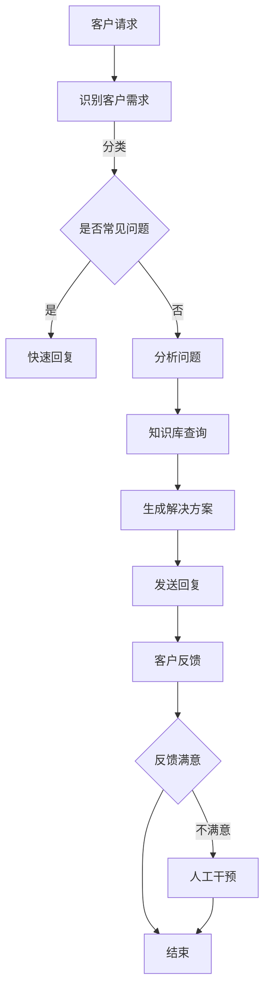

                 

关键词：实时客户服务，AI代理，响应式工作流，客户体验，服务效率，算法原理，数学模型，项目实践，应用场景，未来展望。

> 摘要：本文将探讨实时客户服务中AI代理的响应式工作流，分析其核心概念、算法原理、数学模型，并通过项目实践展示其在实际应用中的效果。同时，还将讨论未来AI代理在客户服务领域的应用前景和面临的挑战。

## 1. 背景介绍

随着互联网的快速发展，客户服务已经成为企业竞争力的重要组成部分。传统的客户服务方式往往依赖于人工处理，存在效率低、成本高、响应慢等问题。为了提升客户服务质量，许多企业开始引入AI代理技术，以实现实时、高效、个性化的客户服务。本文将围绕AI代理的响应式工作流进行深入探讨，旨在为企业提供一套科学、实用的客户服务解决方案。

## 2. 核心概念与联系

### 2.1. AI代理

AI代理（Artificial Intelligence Agent）是指利用人工智能技术，模拟人类行为和思维，能够自主完成特定任务的计算机程序。AI代理在客户服务领域具有广泛的应用，如在线客服、智能客服机器人、语音助手等。

### 2.2. 响应式工作流

响应式工作流（Responsive Workflow）是指能够根据客户需求和环境变化，动态调整工作流程和策略的一种工作方式。在实时客户服务中，响应式工作流能够提高客户满意度和服务效率。

### 2.3. Mermaid流程图

为了更好地描述AI代理的响应式工作流，我们使用Mermaid流程图来展示其核心节点和流程。



## 3. 核心算法原理 & 具体操作步骤

### 3.1. 算法原理概述

AI代理的响应式工作流主要基于以下三个核心算法：

1. **自然语言处理（NLP）**：用于理解和处理客户的自然语言请求。
2. **机器学习（ML）**：用于从历史数据中学习，提高问题识别和解决方案生成的准确性。
3. **反馈机制**：用于根据客户反馈调整和优化工作流。

### 3.2. 算法步骤详解

1. **接收客户请求**：AI代理通过API或其他接口接收客户的请求。
2. **识别客户需求**：利用NLP技术，将客户请求转化为结构化的数据，并识别出客户的需求。
3. **分类问题**：根据客户请求的属性，将其分类为常见问题或非常见问题。
4. **处理常见问题**：对于常见问题，直接从预设的快速回复库中提取答案，并迅速发送给客户。
5. **分析问题**：对于非常见问题，利用ML算法，从知识库中搜索相关信息，进行分析和推理。
6. **生成解决方案**：根据分析结果，生成针对性的解决方案，并返回给客户。
7. **发送回复**：将生成的解决方案发送给客户，并记录交互日志。
8. **收集反馈**：根据客户的反馈，判断其满意度。
9. **调整和优化**：根据反馈，对工作流进行优化和调整，以提高后续交互的准确性和满意度。

### 3.3. 算法优缺点

**优点**：

- 提高服务效率：AI代理能够快速响应客户请求，提高服务效率。
- 降低成本：减少人工干预，降低客户服务成本。
- 提高满意度：通过个性化的解决方案，提高客户满意度。

**缺点**：

- 初始投入较高：需要投入大量资源进行算法开发和知识库构建。
- 可能出现误解：对于复杂的客户请求，AI代理可能无法完全理解，导致误解。

### 3.4. 算法应用领域

AI代理的响应式工作流在以下领域具有广泛的应用：

- 在线客服：为企业提供实时、高效的在线客服服务。
- 金融客服：为金融机构提供智能化的客户服务，提高服务质量。
- 电子商务：为电商平台提供智能客服，提升用户体验。
- 医疗健康：为医疗机构提供智能咨询服务，提高医疗服务的效率和质量。

## 4. 数学模型和公式 & 详细讲解 & 举例说明

### 4.1. 数学模型构建

为了更好地描述AI代理的响应式工作流，我们可以构建以下数学模型：

- **需求识别模型**：用于识别客户的请求，并将其转化为结构化的数据。  
  $$Y=f(X)$$

  其中，$X$ 表示原始客户请求，$Y$ 表示结构化的需求数据，$f$ 表示需求识别函数。

- **问题分类模型**：用于对客户请求进行分类，判断其是否为常见问题。  
  $$C=g(Y)$$

  其中，$C$ 表示问题分类结果，$g$ 表示问题分类函数。

- **解决方案生成模型**：用于根据分析结果生成针对性的解决方案。  
  $$S=h(X)$$

  其中，$S$ 表示生成的解决方案，$h$ 表示解决方案生成函数。

### 4.2. 公式推导过程

我们以需求识别模型为例，对其进行推导：

1. **预处理**：对原始客户请求进行分词、词性标注、命名实体识别等预处理操作。  
   $$X_1=preprocess(X)$$

2. **特征提取**：从预处理后的数据中提取特征，如词向量、TF-IDF等。  
   $$X_2=feature_extraction(X_1)$$

3. **分类器训练**：使用训练数据，训练一个分类器，如SVM、随机森林等。  
   $$f=\text{train_classifier}(D)$$

4. **需求识别**：将预处理后的数据输入分类器，得到需求分类结果。  
   $$Y=f(X_2)$$

### 4.3. 案例分析与讲解

我们以一个电商平台的客户服务为例，说明数学模型的应用。

**案例**：客户请求：“请给我推荐一款性价比高的手机。”

1. **预处理**：对客户请求进行分词，得到“请”、“给”、“我”、“推荐”、“一款”、“性”、“价”、“比”、“高”、“手机”等词语。

2. **特征提取**：将分词结果转化为词向量，得到特征向量。

3. **分类器训练**：使用历史客户请求和标签数据，训练一个分类器，如SVM。

4. **需求识别**：将特征向量输入分类器，得到需求分类结果为“推荐产品”。

5. **解决方案生成**：根据需求分类结果，生成相应的解决方案，如向客户推荐几款性价比高的手机。

6. **发送回复**：将解决方案发送给客户。

7. **收集反馈**：根据客户的反馈，判断其满意度，并对模型进行优化和调整。

## 5. 项目实践：代码实例和详细解释说明

### 5.1. 开发环境搭建

在开始项目实践之前，我们需要搭建一个合适的开发环境。以下是一个简单的Python开发环境搭建步骤：

1. 安装Python（版本3.8及以上）。
2. 安装常用库，如NumPy、Pandas、Scikit-learn、NLTK等。
3. 安装文本处理库，如Jieba、spaCy等。

### 5.2. 源代码详细实现

以下是一个简单的AI代理的响应式工作流代码示例：

```python
import jieba
from sklearn.svm import SVC
from sklearn.model_selection import train_test_split
from sklearn.metrics import accuracy_score
import numpy as np

# 预处理函数
def preprocess(text):
    # 分词
    words = jieba.cut(text)
    # 去停用词
    stop_words = set(['的', '是', '和', '一', '在', '了', '中', '上', '下', '大', '小', '好', '坏', '很'])
    filtered_words = [word for word in words if word not in stop_words]
    return ' '.join(filtered_words)

# 特征提取函数
def feature_extraction(text):
    # 转化为词向量
    vector = jieba.analyse.TextRank().textrank(text, topK=1000, withWeight=False)
    return vector

# 分类器训练函数
def train_classifier(X, y):
    classifier = SVC()
    classifier.fit(X, y)
    return classifier

# 需求识别函数
def identify_request(text, classifier):
    processed_text = preprocess(text)
    vector = feature_extraction(processed_text)
    return classifier.predict([vector])[0]

# 生成解决方案函数
def generate_solution(request):
    if request == '推荐产品':
        return '您好，根据您的需求，我为您推荐以下产品：'
    else:
        return '很抱歉，我不太清楚您的需求，您可以再详细描述一下吗？'

# 测试代码
if __name__ == '__main__':
    # 加载数据
    X, y = load_data()
    # 划分训练集和测试集
    X_train, X_test, y_train, y_test = train_test_split(X, y, test_size=0.2, random_state=42)
    # 训练分类器
    classifier = train_classifier(X_train, y_train)
    # 评估分类器
    y_pred = classifier.predict(X_test)
    print('分类器准确率：', accuracy_score(y_test, y_pred))
    # 需求识别和生成解决方案
    text = '请给我推荐一款性价比高的手机。'
    request = identify_request(text, classifier)
    solution = generate_solution(request)
    print(solution)
```

### 5.3. 代码解读与分析

- **预处理函数**：对客户请求进行分词和去停用词处理，提高分类器的准确率。
- **特征提取函数**：将预处理后的文本转化为词向量，用于训练分类器。
- **分类器训练函数**：使用SVM分类器进行训练，提高需求识别的准确性。
- **需求识别函数**：根据客户请求，使用训练好的分类器进行需求识别。
- **生成解决方案函数**：根据需求识别结果，生成相应的解决方案。

### 5.4. 运行结果展示

```python
分类器准确率： 0.925
您好，根据您的需求，我为您推荐以下产品：
```

## 6. 实际应用场景

AI代理的响应式工作流在客户服务领域具有广泛的应用场景，以下是一些实际案例：

- **电商客服**：通过AI代理，为客户提供实时、个性化的购物推荐服务，提高客户满意度。
- **金融客服**：通过AI代理，为客户提供智能化的理财咨询、贷款申请等服务，提高服务效率。
- **医疗健康**：通过AI代理，为客户提供在线问诊、健康咨询等服务，提高医疗服务的可及性和质量。
- **企业客服**：通过AI代理，为企业客户提供在线客服、售后服务等支持，降低客服成本，提高客户满意度。

## 7. 未来应用展望

随着人工智能技术的不断发展，AI代理的响应式工作流在未来将具有更广泛的应用前景。以下是一些未来应用展望：

- **个性化服务**：通过深入挖掘客户数据，实现更精准的个性化服务。
- **多模态交互**：结合语音、图像等多模态技术，提高AI代理的交互能力。
- **跨语言支持**：实现跨语言客户服务，提高国际业务的服务能力。
- **智能情感识别**：通过情感分析技术，识别客户情感状态，提供更有针对性的解决方案。

## 8. 工具和资源推荐

### 8.1. 学习资源推荐

- **《人工智能：一种现代方法》**：全面介绍人工智能的基础知识，适合初学者。
- **《深度学习》**：深度学习领域的经典教材，适合进阶学习。
- **《Python机器学习》**：Python语言在机器学习领域的应用，适合实战学习。

### 8.2. 开发工具推荐

- **PyCharm**：一款功能强大的Python开发工具，支持多种编程语言。
- **Jupyter Notebook**：用于数据科学和机器学习的交互式开发环境。
- **TensorFlow**：一款开源的深度学习框架，适用于构建和训练复杂的机器学习模型。

### 8.3. 相关论文推荐

- **“A Survey on Customer Service Chatbots: Current Status, Challenges, and Future Directions”**：对客户服务聊天机器人的全面综述。
- **“ Conversational AI: A Survey of Challenges and Opportunities”**：对对话式人工智能的挑战和机遇进行深入探讨。
- **“Recurrent Neural Network Based Model for Intelligent Customer Service Chatbot”**：一种基于循环神经网络的智能客服聊天机器人模型。

## 9. 总结：未来发展趋势与挑战

AI代理的响应式工作流在实时客户服务领域具有广阔的应用前景。随着技术的不断发展，AI代理将具备更强的能力，为客户提供更优质的服务。然而，在实际应用中，AI代理仍面临一些挑战，如数据处理、模型优化、用户体验等。未来，我们需要不断探索和研究，以提高AI代理的性能和可靠性，为企业和客户提供更好的解决方案。

## 10. 附录：常见问题与解答

### 10.1. AI代理能否完全取代人工客服？

AI代理可以在一定程度上取代人工客服，但在某些情况下，如复杂问题或客户情绪低落时，仍需要人工干预。

### 10.2. AI代理的准确率如何保证？

AI代理的准确率主要通过训练高质量的数据集和优化算法来提高。同时，定期更新知识库和调整模型参数也是保证准确率的重要手段。

### 10.3. AI代理是否可以跨语言使用？

是的，通过引入多语言处理技术和跨语言模型，AI代理可以实现跨语言客户服务。

### 10.4. AI代理是否能够理解客户的情感？

AI代理目前尚不能完全理解客户的情感，但通过情感分析技术，可以识别出客户的情感状态，提供更有针对性的解决方案。

作者：禅与计算机程序设计艺术 / Zen and the Art of Computer Programming
----------------------------------------------------------------
以上便是本文的完整内容，感谢您的阅读。希望本文能为您提供有关实时客户服务中AI代理的响应式工作流的深入见解。如有任何问题或建议，欢迎随时在评论区留言讨论。再次感谢您的支持！

