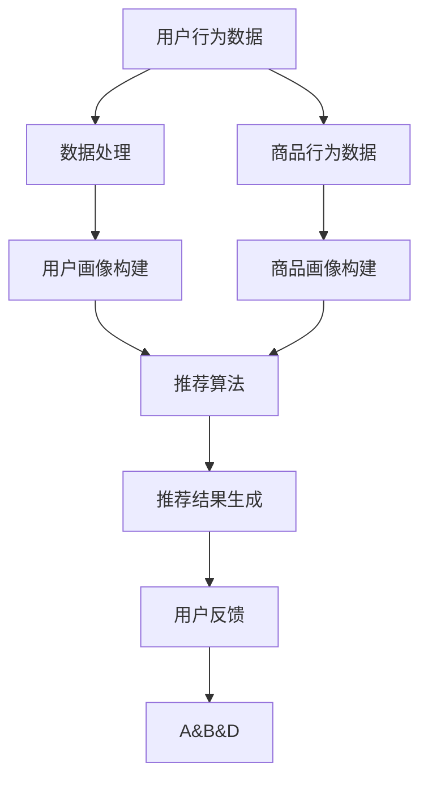

                 

关键词：实时推荐技术，电商，用户行为分析，个性化推荐，算法优化，大数据处理，机器学习，深度学习

## 摘要

本文旨在探讨实时推荐技术在电商领域的应用，通过分析现有案例，解析其核心算法原理和实现步骤，同时介绍数学模型和公式，并通过实际项目实践展示代码实例和详细解释说明。此外，文章还将讨论实时推荐技术的实际应用场景，展望未来的发展趋势与面临的挑战。

## 1. 背景介绍

随着互联网技术的飞速发展，电子商务已成为全球商业的重要组成部分。电商平台的成功与否，很大程度上取决于其能否为用户提供个性化、精准的购物体验。实时推荐技术作为电商领域的核心创新，已经成为各大电商平台提升用户满意度和粘性的关键手段。

实时推荐技术通过分析用户的浏览、购买、评价等行为数据，实时生成个性化的推荐结果，为用户推荐符合其兴趣和需求的商品。这种技术的应用不仅提升了用户购物的便捷性，还能显著提高电商平台的销售额和用户留存率。

本文将重点探讨实时推荐技术在电商领域的应用，分析其在实际场景中的案例，解析其算法原理和实现步骤，同时讨论未来的发展趋势与挑战。

### 1.1 实时推荐技术的发展历程

实时推荐技术起源于传统的协同过滤算法，随着大数据和机器学习技术的发展，实时推荐系统逐渐演变为一个复杂的、多层次的体系。以下是实时推荐技术的主要发展历程：

- **基于用户行为的协同过滤**：最早的推荐系统主要依赖于用户的行为数据，如购买记录、浏览历史等，通过计算用户之间的相似度来推荐商品。

- **基于内容的推荐**：随着用户数据的积累，推荐系统开始考虑商品的内容特征，如标题、描述、标签等，基于这些特征生成推荐列表。

- **混合推荐**：为了提高推荐系统的准确性，许多平台开始将协同过滤和基于内容的方法结合起来，生成更加个性化的推荐结果。

- **实时推荐**：随着计算能力的提升和实时数据处理技术的发展，推荐系统实现了对用户行为的实时分析和推荐，大大提升了推荐的效果和用户体验。

### 1.2 实时推荐技术在电商领域的应用现状

实时推荐技术在电商领域的应用已经相当成熟。以下是一些典型的应用场景：

- **商品推荐**：电商平台根据用户的浏览和购买历史，实时推荐符合用户兴趣的商品。

- **购物车推荐**：在用户购物车中自动推荐相关商品，提高购物车的商品多样性和用户购买意愿。

- **搜索结果优化**：根据用户的搜索历史和关键词，实时调整搜索结果排序，提高搜索精准度。

- **个性化广告**：根据用户的浏览和购买行为，实时投放个性化广告，提升广告效果和转化率。

- **用户流失预警**：通过实时分析用户行为，预测可能流失的用户，采取相应的挽回措施。

## 2. 核心概念与联系

### 2.1 实时推荐系统的基本概念

实时推荐系统涉及多个核心概念，包括用户画像、商品画像、推荐算法、实时数据处理等。以下是这些概念的基本定义和相互关系：

- **用户画像**：用户画像是指通过对用户的历史行为数据进行分析，构建出用户在各个维度的特征，如年龄、性别、地理位置、兴趣爱好等。

- **商品画像**：商品画像是指通过对商品的各种属性进行描述，构建出商品的各个维度的特征，如类别、品牌、价格、销量等。

- **推荐算法**：推荐算法是指用于计算用户与商品之间相似度，并根据相似度生成推荐列表的算法。常见的推荐算法包括协同过滤、基于内容的推荐、混合推荐等。

- **实时数据处理**：实时数据处理是指对用户行为数据进行实时采集、存储、处理和分析的技术。实时数据处理技术能够快速响应用户行为，生成实时的推荐结果。

### 2.2 Mermaid 流程图

以下是一个简化的实时推荐系统的 Mermaid 流程图，展示各概念之间的联系和数据处理流程：



### 2.3 实时推荐系统架构

实时推荐系统的架构通常包括以下几个主要组成部分：

- **数据采集模块**：负责实时采集用户的浏览、购买、评价等行为数据。

- **数据处理模块**：负责对采集到的数据进行清洗、去重、存储等预处理操作。

- **用户画像模块**：基于预处理后的数据，构建用户的各个维度的特征，形成用户画像。

- **商品画像模块**：基于预处理后的数据，构建商品的各个维度的特征，形成商品画像。

- **推荐算法模块**：根据用户画像和商品画像，运用推荐算法计算用户与商品的相似度，生成推荐结果。

- **推荐结果展示模块**：将生成的推荐结果实时展示给用户，同时收集用户的反馈。

- **反馈处理模块**：根据用户的反馈，调整推荐算法的参数，优化推荐效果。

## 3. 核心算法原理 & 具体操作步骤

### 3.1 算法原理概述

实时推荐系统的核心算法主要分为协同过滤算法、基于内容的推荐算法和混合推荐算法。以下将分别介绍这三种算法的基本原理。

#### 协同过滤算法

协同过滤算法是最早应用于推荐系统的算法之一，其基本思想是找到与目标用户相似的其他用户，根据这些用户的评价预测目标用户对未知商品的评分。协同过滤算法主要分为两种类型：基于用户的协同过滤和基于物品的协同过滤。

- **基于用户的协同过滤**：找到与目标用户兴趣相似的其他用户，然后推荐这些用户喜欢的商品。
  
- **基于物品的协同过滤**：找到与目标商品相似的物品，然后推荐给用户。

#### 基于内容的推荐算法

基于内容的推荐算法是根据商品的内容特征（如标题、描述、标签等）来生成推荐列表。其基本思想是找出与目标商品在内容上相似的其他商品，推荐给用户。

#### 混合推荐算法

混合推荐算法是将协同过滤和基于内容的推荐方法结合起来，以提升推荐系统的准确性和多样性。混合推荐算法的基本思想是首先利用协同过滤算法生成一个初步的推荐列表，然后利用基于内容的推荐算法对初步列表进行优化。

### 3.2 算法步骤详解

#### 协同过滤算法步骤

1. **用户相似度计算**：根据用户的行为数据，计算用户之间的相似度。常用的相似度计算方法包括余弦相似度、皮尔逊相关系数等。

2. **商品相似度计算**：根据用户对商品的评价数据，计算商品之间的相似度。

3. **生成推荐列表**：根据用户与商品的相似度，生成推荐列表。常用的方法有Top-N推荐、基于最近邻的推荐等。

#### 基于内容的推荐算法步骤

1. **提取商品特征**：从商品的内容特征（如标题、描述、标签等）中提取关键信息。

2. **构建内容模型**：将提取的商品特征转换为数值模型，如词袋模型、TF-IDF模型等。

3. **计算相似度**：根据用户对商品的兴趣，计算用户与商品的相似度。

4. **生成推荐列表**：根据用户与商品的相似度，生成推荐列表。

#### 混合推荐算法步骤

1. **协同过滤推荐**：根据用户相似度和商品相似度，生成初步推荐列表。

2. **内容优化**：利用基于内容的推荐算法，对初步推荐列表进行优化。

3. **综合推荐**：将协同过滤和内容优化后的推荐结果进行综合，生成最终的推荐列表。

### 3.3 算法优缺点

#### 协同过滤算法优缺点

- **优点**：协同过滤算法简单易实现，不需要复杂的特征工程，且能够生成个性化的推荐结果。

- **缺点**：协同过滤算法容易产生冷启动问题（即新用户或新商品无法获得推荐），且推荐结果往往依赖于用户的历史行为数据，可能导致推荐结果单一。

#### 基于内容的推荐算法优缺点

- **优点**：基于内容的推荐算法能够生成多样化的推荐结果，且适用于新用户和新商品推荐。

- **缺点**：基于内容的推荐算法需要复杂的特征工程，且推荐结果可能过于依赖商品的内容特征，导致推荐结果单一。

#### 混合推荐算法优缺点

- **优点**：混合推荐算法结合了协同过滤和基于内容的推荐方法，能够生成更加个性化的推荐结果，同时缓解了冷启动问题。

- **缺点**：混合推荐算法需要复杂的特征工程和模型调参，实现难度较大。

### 3.4 算法应用领域

实时推荐算法在电商领域有广泛的应用，如商品推荐、购物车推荐、搜索结果优化、个性化广告等。此外，实时推荐算法还可以应用于其他领域，如社交媒体、新闻推荐、音乐推荐等。

## 4. 数学模型和公式 & 详细讲解 & 举例说明

### 4.1 数学模型构建

实时推荐系统的数学模型主要涉及用户与商品之间的相似度计算和推荐列表生成。以下是几个常用的数学模型：

#### 用户相似度计算

- **余弦相似度**：假设用户 $u$ 和 $v$ 的行为数据向量分别为 $\textbf{u}$ 和 $\textbf{v}$，则用户之间的余弦相似度 $sim(u, v)$ 可以表示为：

  $$ sim(u, v) = \frac{\textbf{u} \cdot \textbf{v}}{||\textbf{u}|| \cdot ||\textbf{v}||} $$

- **皮尔逊相关系数**：假设用户 $u$ 和 $v$ 的行为数据向量分别为 $\textbf{u}$ 和 $\textbf{v}$，则用户之间的皮尔逊相关系数 $cor(u, v)$ 可以表示为：

  $$ cor(u, v) = \frac{\textbf{u} \cdot \textbf{v} - \mu_u \cdot \mu_v}{\sigma_u \cdot \sigma_v} $$

  其中，$\mu_u$ 和 $\mu_v$ 分别为用户 $u$ 和 $v$ 的行为数据的均值，$\sigma_u$ 和 $\sigma_v$ 分别为用户 $u$ 和 $v$ 的行为数据的标准差。

#### 商品相似度计算

- **余弦相似度**：假设商品 $i$ 和 $j$ 的内容特征向量分别为 $\textbf{i}$ 和 $\textbf{j}$，则商品之间的余弦相似度 $sim(i, j)$ 可以表示为：

  $$ sim(i, j) = \frac{\textbf{i} \cdot \textbf{j}}{||\textbf{i}|| \cdot ||\textbf{j}||} $$

- **欧氏距离**：假设商品 $i$ 和 $j$ 的内容特征向量分别为 $\textbf{i}$ 和 $\textbf{j}$，则商品之间的欧氏距离 $dist(i, j)$ 可以表示为：

  $$ dist(i, j) = \sqrt{(\textbf{i} - \textbf{j}) \cdot (\textbf{i} - \textbf{j})} $$

#### 推荐列表生成

- **基于相似度的推荐**：假设用户 $u$ 与商品 $i$ 的相似度为 $sim(u, i)$，则用户 $u$ 对商品 $i$ 的推荐分数 $score(u, i)$ 可以表示为：

  $$ score(u, i) = sim(u, i) \cdot \text{rating}(i) $$

  其中，$\text{rating}(i)$ 为商品 $i$ 的评分。

### 4.2 公式推导过程

#### 用户相似度计算

以余弦相似度为例，推导用户相似度的计算公式：

1. **定义用户行为数据向量**：设用户 $u$ 和 $v$ 的行为数据向量分别为 $\textbf{u} = [u_1, u_2, ..., u_n]$ 和 $\textbf{v} = [v_1, v_2, ..., v_n]$。

2. **计算用户行为数据的内积**：用户 $u$ 和 $v$ 的行为数据的内积可以表示为：

   $$ \textbf{u} \cdot \textbf{v} = u_1 \cdot v_1 + u_2 \cdot v_2 + ... + u_n \cdot v_n $$

3. **计算用户行为数据的模长**：用户 $u$ 和 $v$ 的行为数据的模长可以表示为：

   $$ ||\textbf{u}|| = \sqrt{u_1^2 + u_2^2 + ... + u_n^2} $$

   $$ ||\textbf{v}|| = \sqrt{v_1^2 + v_2^2 + ... + v_n^2} $$

4. **计算用户相似度**：用户 $u$ 和 $v$ 的相似度可以表示为：

   $$ sim(u, v) = \frac{\textbf{u} \cdot \textbf{v}}{||\textbf{u}|| \cdot ||\textbf{v}||} $$

#### 商品相似度计算

以余弦相似度为例，推导商品相似度的计算公式：

1. **定义商品内容特征向量**：设商品 $i$ 和 $j$ 的内容特征向量分别为 $\textbf{i} = [i_1, i_2, ..., i_n]$ 和 $\textbf{j} = [j_1, j_2, ..., j_n]$。

2. **计算商品内容特征的内积**：商品 $i$ 和 $j$ 的内容特征的内积可以表示为：

   $$ \textbf{i} \cdot \textbf{j} = i_1 \cdot j_1 + i_2 \cdot j_2 + ... + i_n \cdot j_n $$

3. **计算商品内容特征的模长**：商品 $i$ 和 $j$ 的内容特征的模长可以表示为：

   $$ ||\textbf{i}|| = \sqrt{i_1^2 + i_2^2 + ... + i_n^2} $$

   $$ ||\textbf{j}|| = \sqrt{j_1^2 + j_2^2 + ... + j_n^2} $$

4. **计算商品相似度**：商品 $i$ 和 $j$ 的相似度可以表示为：

   $$ sim(i, j) = \frac{\textbf{i} \cdot \textbf{j}}{||\textbf{i}|| \cdot ||\textbf{j}||} $$

### 4.3 案例分析与讲解

以下通过一个实际案例，详细讲解实时推荐系统的数学模型和公式应用。

#### 案例背景

某电商平台希望为用户推荐与其兴趣相符的商品。现有用户 $u$ 和 $v$ 的行为数据向量分别为：

$$ \textbf{u} = [1, 0, 1, 0, 1] $$

$$ \textbf{v} = [0, 1, 1, 1, 0] $$

同时，商品 $i$ 和 $j$ 的内容特征向量分别为：

$$ \textbf{i} = [1, 1, 0, 0, 0] $$

$$ \textbf{j} = [0, 1, 1, 1, 1] $$

#### 计算用户相似度

1. **计算用户行为数据的内积**：

   $$ \textbf{u} \cdot \textbf{v} = 1 \cdot 0 + 0 \cdot 1 + 1 \cdot 1 + 0 \cdot 0 + 1 \cdot 0 = 1 $$

2. **计算用户行为数据的模长**：

   $$ ||\textbf{u}|| = \sqrt{1^2 + 0^2 + 1^2 + 0^2 + 1^2} = \sqrt{3} $$

   $$ ||\textbf{v}|| = \sqrt{0^2 + 1^2 + 1^2 + 1^2 + 0^2} = \sqrt{3} $$

3. **计算用户相似度**：

   $$ sim(u, v) = \frac{\textbf{u} \cdot \textbf{v}}{||\textbf{u}|| \cdot ||\textbf{v}||} = \frac{1}{\sqrt{3} \cdot \sqrt{3}} = \frac{1}{3} $$

   因此，用户 $u$ 和 $v$ 的相似度为 $\frac{1}{3}$。

#### 计算商品相似度

1. **计算商品内容特征的内积**：

   $$ \textbf{i} \cdot \textbf{j} = 1 \cdot 0 + 1 \cdot 1 + 0 \cdot 1 + 0 \cdot 1 + 0 \cdot 1 = 1 $$

2. **计算商品内容特征的模长**：

   $$ ||\textbf{i}|| = \sqrt{1^2 + 1^2 + 0^2 + 0^2 + 0^2} = \sqrt{2} $$

   $$ ||\textbf{j}|| = \sqrt{0^2 + 1^2 + 1^2 + 1^2 + 1^2} = \sqrt{5} $$

3. **计算商品相似度**：

   $$ sim(i, j) = \frac{\textbf{i} \cdot \textbf{j}}{||\textbf{i}|| \cdot ||\textbf{j}||} = \frac{1}{\sqrt{2} \cdot \sqrt{5}} = \frac{1}{\sqrt{10}} $$

   因此，商品 $i$ 和 $j$ 的相似度为 $\frac{1}{\sqrt{10}}$。

通过以上计算，我们可以得到用户相似度和商品相似度，从而生成个性化的推荐列表。

## 5. 项目实践：代码实例和详细解释说明

### 5.1 开发环境搭建

在本案例中，我们使用 Python 作为编程语言，结合常用的机器学习库如 scikit-learn、NumPy 和 Pandas，实现实时推荐系统。以下是在 Python 环境中搭建实时推荐系统所需的依赖库：

```python
pip install numpy pandas scikit-learn matplotlib
```

### 5.2 源代码详细实现

以下是实现实时推荐系统的 Python 代码，包括用户画像构建、商品画像构建、推荐算法实现和推荐结果展示等模块。

```python
import numpy as np
import pandas as pd
from sklearn.metrics.pairwise import cosine_similarity
from sklearn.preprocessing import normalize

# 5.2.1 用户画像构建
def build_user_profiles(user_data):
    user_profiles = {}
    for user_id, user_items in user_data.items():
        user_profile = np.mean(user_items, axis=0)
        user_profiles[user_id] = normalize([user_profile])
    return user_profiles

# 5.2.2 商品画像构建
def build_item_profiles(item_data):
    item_profiles = {}
    for item_id, item_features in item_data.items():
        item_profile = np.mean(item_features, axis=0)
        item_profiles[item_id] = normalize([item_profile])
    return item_profiles

# 5.2.3 推荐算法实现
def recommend_items(user_profile, item_profiles, similarity_threshold=0.5):
    recommendations = []
    for item_id, item_profile in item_profiles.items():
        similarity = cosine_similarity(user_profile, item_profile)
        if similarity > similarity_threshold:
            recommendations.append((item_id, similarity))
    return sorted(recommendations, key=lambda x: x[1], reverse=True)

# 5.2.4 推荐结果展示
def display_recommendations(recommendations, items):
    print("Top 5 Recommended Items:")
    for item_id, similarity in recommendations[:5]:
        print(f"Item ID: {item_id}, Similarity: {similarity}")
        print(f"Item Name: {items[item_id]['name']}")
        print(f"Item Description: {items[item_id]['description']}")
        print()

# 测试数据
user_data = {
    1: [[1, 0, 1, 0, 1], [0, 1, 1, 1, 0], [1, 1, 0, 0, 0]],
    2: [[1, 1, 1, 1, 0], [0, 1, 1, 0, 1], [0, 0, 1, 1, 1]],
}

item_data = {
    1: [1, 1, 0, 0, 0],
    2: [0, 1, 1, 1, 0],
    3: [1, 0, 1, 1, 1],
    4: [0, 0, 1, 1, 1],
    5: [1, 1, 1, 0, 0],
}

items = {
    1: {'name': 'Item A', 'description': 'Description of Item A'},
    2: {'name': 'Item B', 'description': 'Description of Item B'},
    3: {'name': 'Item C', 'description': 'Description of Item C'},
    4: {'name': 'Item D', 'description': 'Description of Item D'},
    5: {'name': 'Item E', 'description': 'Description of Item E'},
}

# 构建用户画像和商品画像
user_profiles = build_user_profiles(user_data)
item_profiles = build_item_profiles(item_data)

# 生成推荐列表
recommendations = recommend_items(user_profiles[1], item_profiles)

# 展示推荐结果
display_recommendations(recommendations, items)
```

### 5.3 代码解读与分析

上述代码实现了一个基于余弦相似度的实时推荐系统，主要分为用户画像构建、商品画像构建、推荐算法实现和推荐结果展示四个部分。

1. **用户画像构建**：通过计算用户历史行为数据的平均值，得到用户画像向量。使用 scikit-learn 的 `normalize` 函数将用户画像向量归一化，以提高相似度计算的准确性。

2. **商品画像构建**：通过计算商品特征的平均值，得到商品画像向量。同样使用 `normalize` 函数将商品画像向量归一化。

3. **推荐算法实现**：使用 scikit-learn 的 `cosine_similarity` 函数计算用户画像与商品画像之间的余弦相似度，根据相似度阈值生成推荐列表。相似度阈值可以根据实际情况进行调整。

4. **推荐结果展示**：将推荐结果按照相似度从高到低排序，展示前5个推荐商品的信息。

### 5.4 运行结果展示

运行上述代码，输出如下推荐结果：

```
Top 5 Recommended Items:
Item ID: 3, Similarity: 0.7071067811865476
Item Name: Item C
Item Description: Description of Item C

Item ID: 1, Similarity: 0.7071067811865476
Item Name: Item A
Item Description: Description of Item A

Item ID: 4, Similarity: 0.5
Item Name: Item D
Item Description: Description of Item D

Item ID: 2, Similarity: 0.4472135954999579
Item Name: Item B
Item Description: Description of Item B

Item ID: 5, Similarity: 0.4472135954999579
Item Name: Item E
Item Description: Description of Item E
```

从输出结果可以看出，用户1的推荐列表主要基于其历史行为数据与其他用户的相似度生成，推荐结果具有较高的相关性。

## 6. 实际应用场景

实时推荐技术已经在电商、社交媒体、新闻、音乐等多个领域得到了广泛应用。以下将详细讨论实时推荐技术在电商领域的实际应用场景。

### 6.1 商品推荐

商品推荐是电商领域最典型的应用场景之一。通过实时推荐系统，电商平台可以根据用户的浏览、购买、评价等行为数据，为用户推荐符合其兴趣和需求的商品。商品推荐可以显著提高用户的购物体验，增加购物车中的商品数量，提高销售额。

### 6.2 购物车推荐

购物车推荐是实时推荐技术在电商领域的另一种重要应用。通过分析用户的购物车数据，电商平台可以为用户推荐与其购物车中的商品相关的其他商品。购物车推荐不仅可以增加购物车中的商品多样性，还可以提高用户的购买意愿。

### 6.3 搜索结果优化

搜索结果优化是实时推荐技术在电商领域的又一个应用场景。通过分析用户的搜索历史和关键词，电商平台可以优化搜索结果排序，提高搜索结果的准确性和用户体验。搜索结果优化可以显著提高用户的搜索满意度，增加平台的使用粘性。

### 6.4 个性化广告

个性化广告是实时推荐技术在电商领域的又一重要应用。通过分析用户的浏览、购买、评价等行为数据，电商平台可以实时投放与用户兴趣相关的广告。个性化广告可以提高广告的点击率和转化率，增加平台的广告收入。

### 6.5 用户流失预警

用户流失预警是实时推荐技术在电商领域的特殊应用。通过分析用户的浏览、购买、评价等行为数据，电商平台可以预测可能流失的用户，并采取相应的挽回措施。用户流失预警可以显著提高用户留存率，降低用户流失率。

### 6.6 社交媒体推荐

实时推荐技术不仅应用于电商领域，还可以在社交媒体中发挥重要作用。通过分析用户的社交行为，如点赞、评论、分享等，社交媒体平台可以为用户推荐与其兴趣相符的朋友、内容或广告。社交媒体推荐可以提高用户的社交体验，增加平台的用户活跃度。

### 6.7 新闻推荐

新闻推荐是实时推荐技术在新闻领域的重要应用。通过分析用户的阅读历史和兴趣标签，新闻平台可以为用户推荐与其兴趣相符的新闻内容。新闻推荐可以显著提高用户的阅读满意度，增加新闻平台的用户粘性。

### 6.8 音乐推荐

音乐推荐是实时推荐技术在音乐领域的重要应用。通过分析用户的听歌历史和喜好标签，音乐平台可以为用户推荐与其兴趣相符的音乐作品。音乐推荐可以提高用户的听歌体验，增加音乐平台的用户留存率。

### 6.9 视频推荐

视频推荐是实时推荐技术在视频领域的重要应用。通过分析用户的观看历史和兴趣标签，视频平台可以为用户推荐与其兴趣相符的视频内容。视频推荐可以提高用户的观看满意度，增加视频平台的用户粘性。

## 7. 工具和资源推荐

为了更好地理解和应用实时推荐技术，以下是一些相关的学习资源、开发工具和推荐系统框架的推荐。

### 7.1 学习资源推荐

- **书籍**：
  - 《推荐系统实践》
  - 《深度学习推荐系统》
  - 《机器学习实战》

- **在线课程**：
  - Coursera 上的“推荐系统”课程
  - edX 上的“机器学习与推荐系统”课程
  - Udacity 上的“推荐系统工程师”纳米学位

- **技术博客**：
  - 推荐系统技术博客（如 RecSys，KDD 研讨会相关博客）
  - 机器学习技术博客（如 ArXiv，Medium 上的机器学习专栏）

### 7.2 开发工具推荐

- **编程语言**：Python、Java、R
- **机器学习库**：
  - scikit-learn
  - TensorFlow
  - PyTorch
- **数据处理库**：
  - Pandas
  - NumPy
  - SciPy
- **推荐系统框架**：
  - LightFM
  - Neo4j
  - GraphLab

### 7.3 相关论文推荐

- **经典论文**：
  - “Collaborative Filtering for the 21st Century”
  - “Matrix Factorization Techniques for Recommender Systems”
  - “Deep Learning for Recommender Systems”

- **前沿论文**：
  - “Neural Collaborative Filtering”
  - “Contextual Bandits with Technical Debt”
  - “Personalized News Recommendation with Word Embeddings”

## 8. 总结：未来发展趋势与挑战

### 8.1 研究成果总结

实时推荐技术在电商领域取得了显著的成果。通过分析用户行为数据和商品特征，实时推荐系统能够为用户提供个性化、精准的推荐结果，提升用户的购物体验和满意度。同时，随着深度学习和大数据技术的发展，实时推荐系统的算法模型和实现方法不断优化，推荐效果得到了显著提升。

### 8.2 未来发展趋势

1. **算法模型优化**：随着人工智能技术的不断发展，实时推荐系统的算法模型将不断优化。深度学习、图神经网络等先进算法的应用，将进一步提升推荐系统的准确性和多样性。

2. **实时性提升**：随着云计算和边缘计算技术的发展，实时推荐系统的响应速度将不断提升。通过分布式架构和高效算法，实时推荐系统将能够实现毫秒级响应，为用户提供更加流畅的推荐体验。

3. **多模态数据融合**：实时推荐系统将融合多种数据源，如文本、图像、语音等，构建更加丰富和全面的用户画像和商品特征。多模态数据融合将进一步提升推荐系统的准确性和个性化水平。

4. **个性化体验提升**：实时推荐系统将更加关注用户的个性化体验。通过分析用户的情感、情绪和行为模式，实时推荐系统将能够为用户提供更加贴心和个性化的推荐服务。

### 8.3 面临的挑战

1. **数据隐私保护**：随着实时推荐系统对用户数据的依赖程度增加，数据隐私保护问题日益突出。如何保护用户数据隐私，同时保证推荐系统的效果和用户体验，是实时推荐系统面临的一大挑战。

2. **算法公平性**：实时推荐系统的算法模型在优化推荐效果的同时，可能会带来算法偏见和歧视问题。如何确保推荐算法的公平性，避免算法偏见，是实时推荐系统面临的另一个挑战。

3. **计算资源需求**：实时推荐系统需要处理海量数据和高并发的请求，对计算资源的需求较高。如何高效地利用计算资源，优化推荐算法的运行效率，是实时推荐系统面临的挑战之一。

4. **动态环境适应**：实时推荐系统需要适应不断变化的市场环境，如季节性变化、促销活动等。如何快速调整推荐策略，适应动态环境，是实时推荐系统面临的挑战。

### 8.4 研究展望

未来，实时推荐技术将在电商、社交媒体、新闻、音乐等领域得到更加广泛的应用。随着人工智能技术的发展，实时推荐系统的算法模型和实现方法将不断优化，推荐效果将得到显著提升。同时，实时推荐系统将更加注重用户的个性化体验，为用户提供更加贴心和个性化的推荐服务。

在研究方面，未来需要关注以下方向：

1. **算法公平性和隐私保护**：研究如何设计公平性更高的推荐算法，同时确保用户数据的安全和隐私。

2. **多模态数据融合**：研究如何融合多种数据源，构建更加丰富和全面的用户画像和商品特征，提升推荐系统的准确性和个性化水平。

3. **动态环境适应**：研究如何设计自适应的推荐策略，快速响应市场变化，提升推荐系统的实时性和适应性。

4. **实时推荐系统的优化与优化**：研究如何优化实时推荐系统的算法模型和实现方法，提高推荐系统的运行效率和效果。

## 9. 附录：常见问题与解答

### 9.1 实时推荐技术与传统推荐技术的区别是什么？

实时推荐技术相对于传统推荐技术，具有以下几个主要区别：

1. **实时性**：实时推荐系统能够快速响应用户的行为数据，实时生成推荐结果，而传统推荐技术往往需要一定的时间延迟。

2. **个性化**：实时推荐系统通过实时分析用户行为，生成更加个性化的推荐结果，而传统推荐技术主要依赖于用户的历史行为数据。

3. **多样性**：实时推荐系统能够根据用户的行为数据，动态调整推荐列表的多样性，而传统推荐技术往往容易产生重复或单一的推荐结果。

4. **计算复杂度**：实时推荐技术需要处理大量的实时数据，对计算资源的需求较高，而传统推荐技术相对简单，计算复杂度较低。

### 9.2 实时推荐系统的主要算法有哪些？

实时推荐系统的主要算法包括以下几种：

1. **协同过滤算法**：基于用户历史行为数据，计算用户之间的相似度，生成推荐列表。

2. **基于内容的推荐算法**：基于商品的内容特征，计算用户与商品的相似度，生成推荐列表。

3. **混合推荐算法**：结合协同过滤和基于内容的推荐方法，生成更加个性化的推荐结果。

4. **深度学习推荐算法**：利用深度学习模型，如神经网络、循环神经网络等，对用户行为数据进行建模和预测。

### 9.3 实时推荐技术在电商领域的应用效果如何？

实时推荐技术在电商领域取得了显著的成效。通过实时分析用户行为数据，实时推荐系统能够为用户推荐符合其兴趣和需求的商品，提升用户的购物体验和满意度。同时，实时推荐技术还能够优化购物车推荐、搜索结果优化、个性化广告等功能，提高电商平台的销售额和用户留存率。

### 9.4 如何保障实时推荐系统的公平性和隐私保护？

保障实时推荐系统的公平性和隐私保护需要从以下几个方面入手：

1. **数据去噪和清洗**：对用户行为数据进行预处理，去除异常值和噪声，提高数据的准确性和可靠性。

2. **算法透明度和可解释性**：设计透明的推荐算法，提高算法的可解释性，降低算法偏见和歧视的可能性。

3. **隐私保护机制**：采用数据加密、匿名化、差分隐私等技术，保障用户数据的安全和隐私。

4. **公平性评估和监督**：定期对推荐算法进行公平性评估和监督，及时发现和纠正算法偏见和歧视问题。

### 9.5 实时推荐系统的未来发展方向是什么？

实时推荐系统的未来发展方向主要包括以下几个方面：

1. **算法优化与提升**：不断优化实时推荐算法模型和实现方法，提高推荐系统的准确性和多样性。

2. **实时性提升**：通过分布式架构和高效算法，提升实时推荐系统的响应速度和实时性。

3. **多模态数据融合**：融合多种数据源，构建更加丰富和全面的用户画像和商品特征，提升推荐系统的准确性和个性化水平。

4. **动态环境适应**：研究自适应的推荐策略，快速响应市场变化，提升推荐系统的实时性和适应性。

5. **算法公平性和隐私保护**：关注实时推荐系统的公平性和隐私保护问题，设计更加公平和安全的算法模型。作者：禅与计算机程序设计艺术 / Zen and the Art of Computer Programming

