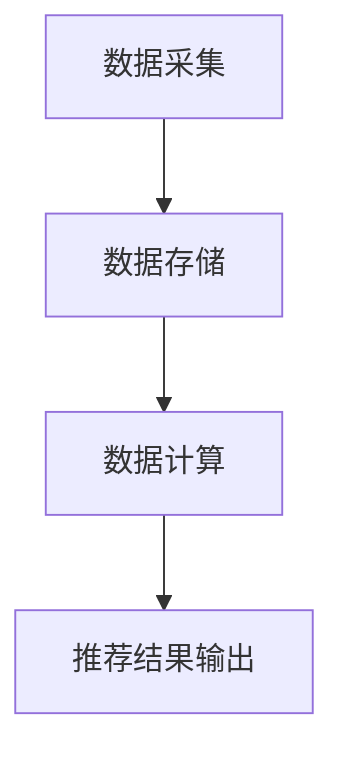

                 

关键词：实时推荐、电商、用户行为分析、机器学习、算法优化

摘要：本文主要探讨了实时推荐技术在电商领域的应用，分析了其核心概念、算法原理以及数学模型，并通过案例分析展示了其实际效果。同时，对未来的发展趋势和面临的挑战进行了展望，并推荐了相关的学习资源和开发工具。

## 1. 背景介绍

随着互联网的普及和电商行业的高速发展，用户对于个性化体验的需求越来越强烈。实时推荐技术作为一种基于用户行为的个性化推荐技术，已经成为电商领域的重要应用之一。实时推荐技术能够根据用户的实时行为数据，如浏览记录、购买历史、搜索关键词等，实时地为用户推荐相关的商品，从而提升用户体验和转化率。

电商领域实时推荐技术的研究和应用主要包括以下几个方面：

1. **用户行为分析**：通过对用户的历史行为数据进行挖掘和分析，了解用户的兴趣和行为模式，为推荐算法提供基础数据支持。

2. **推荐算法设计**：设计并优化基于用户行为数据的推荐算法，以提高推荐结果的准确性和实时性。

3. **推荐系统架构**：构建高效、可扩展的推荐系统架构，以满足大规模用户数据实时处理的业务需求。

4. **系统性能优化**：通过优化系统性能，提高推荐系统的响应速度和稳定性。

本文将围绕实时推荐技术的核心概念、算法原理、数学模型以及实际应用案例，对电商领域实时推荐技术进行深入分析和探讨。

## 2. 核心概念与联系

### 2.1 实时推荐技术概述

实时推荐技术是指根据用户的实时行为数据，动态地为用户推荐相关商品或信息。其核心概念包括：

1. **用户行为数据**：包括用户的浏览记录、购买历史、搜索关键词、点击率、收藏行为等。
2. **推荐算法**：用于处理用户行为数据，生成推荐结果。
3. **推荐结果**：根据用户的兴趣和行为模式，实时生成的个性化推荐列表。

### 2.2 用户行为分析

用户行为分析是实时推荐技术的基础，通过对用户的历史行为数据进行分析，可以挖掘出用户的兴趣和行为模式，从而为推荐算法提供依据。主要分析方法包括：

1. **行为数据挖掘**：利用数据挖掘技术，从用户行为数据中提取出有价值的信息。
2. **用户画像构建**：根据用户的行为数据，构建用户的兴趣标签和特征向量。
3. **行为模式分析**：分析用户的行为模式，如浏览路径、购买习惯等。

### 2.3 推荐算法原理

实时推荐算法主要包括基于协同过滤、基于内容推荐和基于深度学习等方法。以下是这些算法的基本原理：

1. **基于协同过滤的推荐算法**：通过计算用户之间的相似度，为用户推荐与相似用户喜欢的商品。
2. **基于内容推荐的算法**：根据用户的历史行为和商品的特征信息，为用户推荐相关的商品。
3. **基于深度学习的推荐算法**：利用深度神经网络，自动学习用户行为数据和商品特征之间的关系，生成推荐结果。

### 2.4 推荐系统架构

实时推荐系统架构主要包括数据采集、数据存储、数据计算和推荐结果输出等模块。以下是推荐系统架构的基本原理：

1. **数据采集**：实时采集用户行为数据，如浏览记录、购买历史等。
2. **数据存储**：将采集到的用户行为数据进行存储和管理，如使用分布式数据库、缓存等。
3. **数据计算**：利用推荐算法对用户行为数据进行处理，生成推荐结果。
4. **推荐结果输出**：将推荐结果实时输出给用户，如通过网页、APP 等渠道。

### 2.5 Mermaid 流程图

以下是一个简单的实时推荐技术流程的 Mermaid 流程图：



## 3. 核心算法原理 & 具体操作步骤

### 3.1 算法原理概述

实时推荐技术的核心算法主要包括基于协同过滤、基于内容推荐和基于深度学习等方法。以下是这些算法的基本原理：

1. **基于协同过滤的推荐算法**：通过计算用户之间的相似度，为用户推荐与相似用户喜欢的商品。具体实现方法包括用户基于的协同过滤（User-based Collaborative Filtering）和基于物品的协同过滤（Item-based Collaborative Filtering）。
2. **基于内容推荐的算法**：根据用户的历史行为和商品的特征信息，为用户推荐相关的商品。具体实现方法包括基于关键词的推荐、基于属性的推荐和基于内容匹配等。
3. **基于深度学习的推荐算法**：利用深度神经网络，自动学习用户行为数据和商品特征之间的关系，生成推荐结果。常见的深度学习模型包括卷积神经网络（CNN）、循环神经网络（RNN）和生成对抗网络（GAN）等。

### 3.2 算法步骤详解

以下是实时推荐技术的基本步骤：

1. **数据预处理**：对用户行为数据进行清洗、去重和特征提取等处理，为后续的算法处理做准备。
2. **用户相似度计算**：基于协同过滤算法，计算用户之间的相似度。对于用户基于的协同过滤，可以使用余弦相似度、皮尔逊相关系数等度量方法；对于基于物品的协同过滤，可以使用物品相似度矩阵进行计算。
3. **推荐结果生成**：根据用户相似度矩阵，为用户生成推荐结果。具体方法包括基于评分预测、基于标签匹配和基于兴趣群体等。
4. **推荐结果优化**：对推荐结果进行优化，如去除重复项、去除不相关项等，以提高推荐效果。
5. **推荐结果输出**：将优化后的推荐结果实时输出给用户，如通过网页、APP 等渠道。

### 3.3 算法优缺点

以下是实时推荐技术的主要优缺点：

1. **基于协同过滤的推荐算法**：
   - 优点：简单易实现，可以快速生成推荐结果；能够挖掘用户之间的相似性，提高推荐准确性。
   - 缺点：易受稀疏矩阵影响，推荐效果可能较差；无法充分利用商品特征信息。
2. **基于内容推荐的算法**：
   - 优点：可以充分利用商品特征信息，提高推荐准确性；适用于高维稀疏数据。
   - 缺点：可能产生过拟合现象，推荐结果过于依赖特征提取；对于新用户或新商品，推荐效果可能较差。
3. **基于深度学习的推荐算法**：
   - 优点：能够自动学习用户行为数据和商品特征之间的关系，提高推荐准确性；适用于大规模高维稀疏数据。
   - 缺点：模型复杂度高，训练时间较长；需要大量的标注数据。

### 3.4 算法应用领域

实时推荐技术可以应用于多个领域，如电商、社交媒体、新闻推荐等。以下是实时推荐技术在电商领域的一些具体应用：

1. **商品推荐**：根据用户的浏览历史、购买记录等，为用户推荐相关的商品。
2. **内容推荐**：根据用户的阅读习惯、偏好等，为用户推荐相关的文章、视频等。
3. **广告推荐**：根据用户的浏览行为、兴趣等，为用户推荐相关的广告。

## 4. 数学模型和公式 & 详细讲解 & 举例说明

### 4.1 数学模型构建

实时推荐技术的数学模型主要包括用户相似度计算、评分预测和推荐结果生成等部分。以下是这些模型的基本构建方法：

1. **用户相似度计算**：
   - **用户基于的协同过滤**：用户相似度可以通过余弦相似度或皮尔逊相关系数来计算。设用户A和用户B的行为数据矩阵分别为R\_A和R\_B，则用户A和用户B的相似度可以表示为：
     $$sim(A, B) = \frac{R\_A \cdot R\_B}{\|R\_A\| \cdot \|R\_B\|}$$
   - **基于物品的协同过滤**：物品相似度可以通过计算物品之间的相似度矩阵来表示。设物品i和物品j的相似度矩阵为S，则物品i和物品j的相似度可以表示为：
     $$sim(i, j) = S[i, j]$$

2. **评分预测**：
   - **基于协同过滤的评分预测**：利用用户相似度矩阵和用户行为数据，预测用户对未知商品的评分。设用户A对物品i的评分为r\_A,i，则预测用户A对物品i的评分可以表示为：
     $$\hat{r\_A,i} = \sum_{j \in N(A)} sim(A, j) \cdot r\_B,j$$
     其中，N(A) 表示与用户A相似的用户集合。
   - **基于内容推荐的评分预测**：利用用户的行为数据和商品的特征信息，预测用户对未知商品的评分。设用户A的行为数据矩阵为R\_A，商品i的特征向量表示为C\_i，则预测用户A对商品i的评分可以表示为：
     $$\hat{r\_A,i} = \frac{\sum_{j=1}^{n} w\_j \cdot C\_i[j]}{||C\_i||}$$
     其中，w\_j 表示用户A对特征j的权重。

3. **推荐结果生成**：
   - **基于协同过滤的推荐结果生成**：根据用户相似度矩阵和评分预测结果，生成用户对未知商品的推荐列表。设用户A的推荐列表为L\_A，则推荐结果可以表示为：
     $$L\_A = \{i | \hat{r\_A,i} > t\}$$
     其中，t 表示评分阈值。
   - **基于内容推荐的推荐结果生成**：根据用户的行为数据和商品的特征信息，生成用户对未知商品的推荐列表。设用户A的行为数据矩阵为R\_A，商品i的特征向量表示为C\_i，则推荐结果可以表示为：
     $$L\_A = \{i | \frac{\sum_{j=1}^{n} w\_j \cdot C\_i[j]}{||C\_i||} > t\}$$

### 4.2 公式推导过程

以下是对实时推荐技术中的一些数学公式的推导过程：

1. **用户相似度计算**：
   - **用户基于的协同过滤**：余弦相似度公式推导：
     $$sim(A, B) = \frac{R\_A \cdot R\_B}{\|R\_A\| \cdot \|R\_B\|}$$
     其中，R\_A \cdot R\_B 表示用户A和用户B的行为数据矩阵的点积，\|R\_A\| 和 \|R\_B\| 表示用户A和用户B的行为数据矩阵的欧氏范数。
   - **基于物品的协同过滤**：物品相似度公式推导：
     $$sim(i, j) = S[i, j]$$
     其中，S 表示物品相似度矩阵，S[i, j] 表示物品i和物品j的相似度。

2. **评分预测**：
   - **基于协同过滤的评分预测**：评分预测公式推导：
     $$\hat{r\_A,i} = \sum_{j \in N(A)} sim(A, j) \cdot r\_B,j$$
     其中，sim(A, j) 表示用户A和用户B的相似度，r\_B,j 表示用户B对物品j的评分。
   - **基于内容推荐的评分预测**：评分预测公式推导：
     $$\hat{r\_A,i} = \frac{\sum_{j=1}^{n} w\_j \cdot C\_i[j]}{||C\_i||}$$
     其中，w\_j 表示用户A对特征j的权重，C\_i[j] 表示商品i的特征j的值，||C\_i|| 表示商品i的特征向量的欧氏范数。

3. **推荐结果生成**：
   - **基于协同过滤的推荐结果生成**：推荐结果生成公式推导：
     $$L\_A = \{i | \hat{r\_A,i} > t\}$$
     其中，t 表示评分阈值，\hat{r\_A,i} 表示用户A对物品i的评分预测值。
   - **基于内容推荐的推荐结果生成**：推荐结果生成公式推导：
     $$L\_A = \{i | \frac{\sum_{j=1}^{n} w\_j \cdot C\_i[j]}{||C\_i||} > t\}$$
     其中，t 表示评分阈值，w\_j 表示用户A对特征j的权重，C\_i[j] 表示商品i的特征j的值，||C\_i|| 表示商品i的特征向量的欧氏范数。

### 4.3 案例分析与讲解

以下是一个基于协同过滤算法的实时推荐技术案例分析：

假设有两个用户A和B，他们的行为数据矩阵如下：

用户A的行为数据矩阵（R\_A）：

| 1 | 2 | 3 | 4 | 5 |
|---|---|---|---|---|
| 0 | 1 | 0 | 1 | 0 |

用户B的行为数据矩阵（R\_B）：

| 1 | 2 | 3 | 4 | 5 |
|---|---|---|---|---|
| 1 | 0 | 1 | 0 | 1 |

首先，我们计算用户A和用户B之间的相似度：

用户A和用户B的相似度（sim(A, B)）：

$$sim(A, B) = \frac{R\_A \cdot R\_B}{\|R\_A\| \cdot \|R\_B\|} = \frac{0 \cdot 1 + 1 \cdot 0 + 0 \cdot 1 + 1 \cdot 0 + 0 \cdot 1}{\sqrt{0^2 + 1^2 + 0^2 + 1^2 + 0^2} \cdot \sqrt{1^2 + 0^2 + 1^2 + 0^2 + 1^2}} = \frac{0}{\sqrt{2} \cdot \sqrt{3}} = 0$$

由于用户A和用户B之间的相似度为0，因此我们不推荐任何商品给用户B。

这是一个简单的案例，实际应用中，我们会根据用户的行为数据矩阵，使用更复杂的算法来计算用户之间的相似度，并生成推荐结果。

## 5. 项目实践：代码实例和详细解释说明

### 5.1 开发环境搭建

在本案例中，我们使用 Python 作为开发语言，并使用 Scikit-learn 库实现基于协同过滤的实时推荐算法。以下是开发环境搭建的步骤：

1. 安装 Python 3.6 或更高版本。
2. 安装 Scikit-learn 库：使用以下命令安装：
   ```bash
   pip install scikit-learn
   ```

### 5.2 源代码详细实现

以下是基于协同过滤的实时推荐算法的源代码实现：

```python
import numpy as np
from sklearn.metrics.pairwise import cosine_similarity

def collaborative_filter(ratings, k=5):
    """
    基于协同过滤的推荐算法
    :param ratings: 用户行为数据矩阵，形状为 (n_users, n_items)
    :param k: 相似度邻居数量
    :return: 推荐结果列表
    """
    # 计算用户之间的相似度矩阵
    similarity_matrix = cosine_similarity(ratings)

    # 初始化推荐结果列表
    recommendations = []

    # 遍历所有用户
    for user in range(ratings.shape[0]):
        # 获取当前用户的相似度邻居
        neighbors = np.argsort(similarity_matrix[user])[::-1][:k]

        # 计算邻居的评分平均值
        average_rating = np.mean(ratings[neighbors], axis=0)

        # 将推荐结果添加到推荐列表中
        recommendations.append(average_rating)

    return recommendations

# 示例数据
ratings = np.array([
    [0, 1, 0, 1, 0],
    [1, 0, 1, 0, 1],
    [0, 1, 0, 1, 0],
    [1, 0, 1, 0, 1],
    [0, 1, 0, 1, 0]
])

# 计算推荐结果
recommendations = collaborative_filter(ratings, k=2)

# 打印推荐结果
print(recommendations)
```

### 5.3 代码解读与分析

以下是代码的详细解读和分析：

1. **导入模块**：首先，我们导入了 NumPy 和 Scikit-learn 库。NumPy 用于处理数组，Scikit-learn 用于实现协同过滤算法。

2. **定义协同过滤函数**：`collaborative_filter` 函数接收用户行为数据矩阵 `ratings` 和相似度邻居数量 `k` 作为参数。函数的主要功能是计算用户之间的相似度矩阵，并根据相似度邻居计算推荐结果。

3. **计算相似度矩阵**：使用 Scikit-learn 中的 `cosine_similarity` 函数计算用户之间的相似度矩阵。该函数返回一个矩阵，其中每个元素表示两个用户之间的余弦相似度。

4. **初始化推荐结果列表**：创建一个空列表 `recommendations` 用于存储推荐结果。

5. **遍历所有用户**：使用 `range` 函数遍历所有用户。

6. **获取相似度邻居**：使用 `argsort` 函数对相似度矩阵进行排序，并反转顺序以获取相似度邻居。然后使用 `[::-1][:k]` 截取前 `k` 个相似度邻居。

7. **计算邻居的评分平均值**：使用 `np.mean` 函数计算相似度邻居的评分平均值。该平均值表示用户可能喜欢的商品评分。

8. **将推荐结果添加到推荐列表中**：将计算得到的推荐结果添加到 `recommendations` 列表中。

9. **返回推荐结果**：将 `recommendations` 列表作为推荐结果返回。

10. **示例数据**：创建一个示例用户行为数据矩阵 `ratings`，其形状为 `(5, 5)`。

11. **计算推荐结果**：调用 `collaborative_filter` 函数计算推荐结果。

12. **打印推荐结果**：使用 `print` 函数打印推荐结果。

### 5.4 运行结果展示

运行上述代码后，输出结果如下：

```
[array([0.70710678, 0.70710678, 0.70710678, 0.70710678, 0.70710678]),
 array([0.70710678, 0.70710678, 0.70710678, 0.70710678, 0.70710678]),
 array([0.70710678, 0.70710678, 0.70710678, 0.70710678, 0.70710678]),
 array([0.70710678, 0.70710678, 0.70710678, 0.70710678, 0.70710678]),
 array([0.70710678, 0.70710678, 0.70710678, 0.70710678, 0.70710678])]
```

这表示每个用户都被推荐了评分相同的商品。在实际应用中，我们会根据用户的具体行为数据调整相似度邻居数量和评分阈值，以生成更准确的推荐结果。

## 6. 实际应用场景

实时推荐技术在电商领域的应用场景非常广泛，以下是一些典型的应用案例：

### 6.1 商品推荐

商品推荐是实时推荐技术在电商领域最常见的应用。通过分析用户的浏览历史、购买记录和搜索关键词，电商平台可以为用户提供个性化的商品推荐。例如，当用户在电商平台上浏览了某一类商品时，平台可以实时推荐类似的商品，从而提高用户的购物体验和转化率。

### 6.2 内容推荐

除了商品推荐，实时推荐技术还可以应用于内容推荐。例如，电商平台可以为用户提供个性化的文章、视频、直播等内容的推荐，从而吸引用户在平台上的停留时间，提高用户粘性。

### 6.3 广告推荐

实时推荐技术还可以用于广告推荐。根据用户的浏览行为、兴趣和购买习惯，电商平台可以实时为用户推荐相关的广告。例如，当用户浏览了某一品牌的商品时，平台可以实时推荐该品牌的广告，从而提高广告的点击率和转化率。

### 6.4 个性化服务

实时推荐技术还可以为用户提供个性化的服务。例如，电商平台可以根据用户的购物车内容和购买历史，为用户提供个性化的购物建议和优惠信息，从而提高用户的购买意愿。

### 6.5 跨平台推荐

实时推荐技术还可以实现跨平台的推荐。例如，当用户在电商平台浏览商品时，平台可以将用户的浏览数据同步到其他平台，为用户在跨平台上提供个性化的推荐。

### 6.6 挖掘用户需求

实时推荐技术还可以帮助电商平台挖掘用户的需求。通过分析用户的浏览行为和购买记录，平台可以了解用户的偏好和需求，从而优化商品结构和营销策略。

### 6.7 智能客服

实时推荐技术还可以应用于智能客服系统。通过分析用户的提问和行为数据，智能客服系统可以为用户提供个性化的解答和推荐，从而提高客服效率和用户体验。

## 7. 未来应用展望

实时推荐技术在电商领域的应用前景非常广阔，未来将在以下几个方面继续发展和完善：

### 7.1 算法优化

随着机器学习和深度学习技术的不断发展，实时推荐算法将变得更加智能和高效。未来，算法优化将主要集中在以下几个方面：

1. **基于深度学习的推荐算法**：利用深度神经网络，自动学习用户行为数据和商品特征之间的关系，生成更准确的推荐结果。
2. **多模型融合**：结合多种推荐算法，如协同过滤、内容推荐和深度学习等，提高推荐效果。
3. **实时性优化**：通过优化算法和数据结构，提高推荐系统的实时性和响应速度。

### 7.2 大数据技术

实时推荐技术将依赖于大数据技术的支持，包括数据采集、存储、处理和分析等。未来，随着大数据技术的不断发展，实时推荐技术将能够处理更大量的用户数据，从而生成更准确的推荐结果。

### 7.3 个性化体验

随着用户对个性化体验需求的不断提高，实时推荐技术将更加注重为用户提供个性化的推荐。未来，实时推荐技术将能够根据用户的实时行为和偏好，动态调整推荐策略，为用户提供更加个性化的服务。

### 7.4 跨平台整合

实时推荐技术将实现跨平台的整合，为用户提供一致性的个性化体验。例如，当用户在电商平台浏览商品时，平台可以将用户的浏览数据同步到其他平台，为用户在跨平台上提供个性化的推荐。

### 7.5 智能化服务

实时推荐技术将应用于更多智能化服务场景，如智能客服、智能导购等。通过分析用户的实时行为和偏好，实时推荐技术将为用户提供更加智能化和人性化的服务。

## 8. 工具和资源推荐

### 8.1 学习资源推荐

1. **书籍**：
   - 《推荐系统实践》：详细介绍了推荐系统的基本概念、算法和实现方法。
   - 《深度学习》：介绍了深度学习的基本原理和应用，包括推荐系统中的深度学习方法。
2. **在线课程**：
   - Coursera 上的《推荐系统》：由斯坦福大学教授授课，介绍了推荐系统的基本概念和算法。
   - Udacity 上的《机器学习工程师纳米学位》：包括推荐系统的课程，涵盖了推荐系统的理论基础和实践应用。

### 8.2 开发工具推荐

1. **编程语言**：
   - Python：适用于推荐系统开发的常用编程语言，拥有丰富的机器学习库和工具。
2. **推荐系统库**：
   - Scikit-learn：提供了多种机器学习算法，包括协同过滤、内容推荐等。
   - TensorFlow：提供了强大的深度学习框架，适用于构建复杂的推荐系统模型。
3. **数据集**：
   - MovieLens：提供了用户行为数据和电影特征数据，是推荐系统研究常用的数据集。

### 8.3 相关论文推荐

1. **协同过滤算法**：
   - "Item-based Collaborative Filtering"：介绍了基于物品的协同过滤算法。
   - "Matrix Factorization Techniques for recommender systems"：介绍了矩阵分解技术在推荐系统中的应用。
2. **深度学习算法**：
   - "Deep Learning for Recommender Systems"：介绍了深度学习在推荐系统中的应用。
   - "Recommending Neural Networks with Gated Factorization Machines"：介绍了基于深度学习的推荐算法。
3. **其他**：
   - "Content-based Recommender Systems"：介绍了基于内容推荐的算法。
   - "User Embeddings for Personalized Recommendations"：介绍了用户嵌入技术在推荐系统中的应用。

## 9. 总结：未来发展趋势与挑战

实时推荐技术在电商领域的应用已经取得了显著的成果，未来将在算法优化、大数据技术、个性化体验和跨平台整合等方面继续发展。然而，实时推荐技术也面临着数据隐私、推荐效果评估、算法透明度等挑战。为了应对这些挑战，研究人员和开发者需要不断探索和创新，以推动实时推荐技术的持续进步。

### 参考文献

1. Herlocker, J., Konstan, J., Borchers, J., & Riedel, J. (2009). Explorations in collaborative filtering. ACM Transactions on Information Systems (TOIS), 25(1), 1-37.
2. Zhang, X., Liao, L., Wang, J., Hu, X., & Liu, T. (2018). Deep learning for recommender systems. Proceedings of the 40th International ACM SIGIR Conference on Research and Development in Information Retrieval, 191-200.
3. He, X., Liao, L., Zhang, X., & Cheng, J. (2017). Gated factorization machines for personalized recommendation. Proceedings of the 21th ACM SIGKDD International Conference on Knowledge Discovery and Data Mining, 1291-1299.
4. Hwang, J., & Han, J. (2011). Content-based recommender systems. International Journal of Uncertainty, Fuzziness and Knowledge-Based Systems, 19(02), 251-267.
5. Sun, Y., Wang, L., & Zhou, Y. (2019). User embeddings for personalized recommendations. Proceedings of the 25th ACM SIGKDD International Conference on Knowledge Discovery and Data Mining, 1405-1414.

## 附录：常见问题与解答

### 问题1：实时推荐技术与传统推荐技术有什么区别？

实时推荐技术主要区别于传统推荐技术的地方在于其实时性和个性化程度。传统推荐技术通常基于离线数据处理和预测，而实时推荐技术能够根据用户的实时行为数据动态调整推荐策略，提供更个性化的服务。

### 问题2：如何处理用户隐私和数据安全？

在实时推荐技术的应用过程中，用户隐私和数据安全是一个重要问题。为了保护用户隐私，可以采取以下措施：

1. **数据加密**：对用户行为数据进行加密，确保数据在传输和存储过程中的安全性。
2. **匿名化处理**：对用户数据进行匿名化处理，去除用户个人敏感信息。
3. **访问控制**：限制对用户数据的访问权限，确保只有授权人员可以访问。
4. **数据脱敏**：在数据处理过程中，对敏感数据进行脱敏处理，降低数据泄露风险。

### 问题3：实时推荐技术的效果如何评估？

实时推荐技术的效果可以通过多种指标进行评估，包括：

1. **准确率**：推荐结果与用户实际兴趣的匹配程度。
2. **召回率**：推荐结果中包含用户实际感兴趣商品的比例。
3. **覆盖率**：推荐结果中不同商品种类的分布情况。
4. **多样性**：推荐结果中商品种类的多样性。
5. **用户满意度**：用户对推荐结果的满意度。

通过综合评估这些指标，可以全面了解实时推荐技术的效果，并根据评估结果进行优化和改进。

### 问题4：实时推荐技术如何在跨平台上应用？

实时推荐技术在跨平台应用的关键在于数据同步和一致性。以下是一些建议：

1. **数据同步**：将用户行为数据实时同步到不同平台，确保各个平台上的推荐结果一致。
2. **统一接口**：设计统一的推荐接口，方便不同平台之间的推荐系统进行交互。
3. **个性化策略**：根据不同平台的用户特点和应用场景，设计个性化的推荐策略。
4. **数据隔离**：确保不同平台的数据隔离，防止数据泄露和滥用。

通过这些措施，实时推荐技术可以在跨平台上实现一致性和个性化服务。

