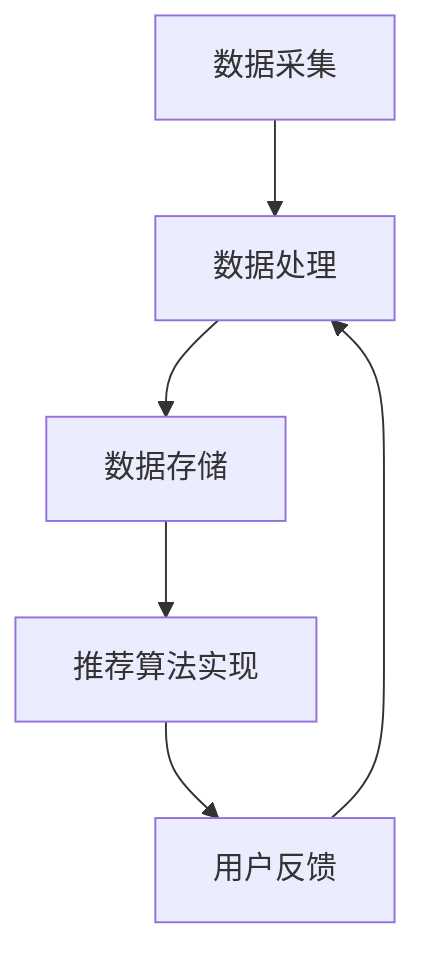

                 

在当今的信息化社会中，数据量呈指数级增长，用户生成的内容和互动行为几乎无处不在。为了从海量数据中挖掘出对用户有价值的信息，推荐系统成为了一项关键技术。实时推荐系统作为推荐系统的一种重要实现方式，能够在短时间内为用户提供个性化的推荐结果，极大地提升了用户体验。本文将围绕实时推荐系统的架构设计与性能优化进行深入探讨。

## 关键词

- 实时推荐系统
- 架构设计
- 性能优化
- 数据处理
- 机器学习
- 异步处理

## 摘要

本文首先介绍了实时推荐系统的背景和重要性，然后详细分析了其核心概念与架构，包括数据采集、处理、存储、推荐算法实现以及用户反馈等环节。接下来，我们探讨了实时推荐系统的核心算法原理，以及如何在实际项目中应用。随后，通过一个具体的数学模型和公式讲解了推荐系统的数学基础。文章还提供了实际项目中的代码实例和运行结果，帮助读者更好地理解实时推荐系统的实现过程。最后，我们对实时推荐系统在实际应用场景中的表现进行了分析，并对其未来的发展趋势和挑战进行了展望。

---

## 1. 背景介绍

随着互联网技术的迅猛发展，用户生成内容（UGC）的数量呈现出爆炸式增长。人们每天在社交媒体、电子商务平台、新闻网站等各个场景下产生海量的数据。这些数据中蕴含着用户的兴趣偏好、行为习惯等信息，如何有效地利用这些信息为用户提供个性化的服务，成为了许多企业关注的焦点。此时，推荐系统作为一种能够自动发现用户兴趣并为其推荐相关内容的技术，逐渐成为了解决这个问题的有效手段。

推荐系统可以分为以下几类：

1. **基于内容的推荐（Content-Based Filtering）**：根据用户的历史行为或者兴趣标签来推荐相似的内容。
2. **协同过滤推荐（Collaborative Filtering）**：通过用户之间的相似度来推荐内容。
3. **混合推荐（Hybrid Methods）**：结合基于内容和协同过滤的方法，以获得更准确的推荐结果。

而实时推荐系统则是对上述推荐技术的一种高级应用。它能够在用户行为发生的同时，快速计算出个性化的推荐结果，并在用户进行下一步操作前及时呈现。这种实时性的特点，使得实时推荐系统在许多领域，如电子商务、社交媒体、在线新闻等领域，具有广泛的应用前景。

实时推荐系统的重要性主要体现在以下几个方面：

1. **提升用户体验**：通过实时推荐，用户可以更快地找到自己感兴趣的内容，从而提升整体的使用体验。
2. **增加用户粘性**：实时推荐系统能够不断调整推荐内容，满足用户不断变化的需求，从而增加用户的粘性。
3. **提高商业价值**：实时推荐系统能够帮助电商企业提高销售转化率，提升广告点击率等，从而带来直接的商业收益。

### 1.1 实时推荐系统的需求与挑战

实时推荐系统的需求主要来源于以下几个方面：

1. **响应速度**：由于推荐系统需要实时响应用户的行为，因此系统的响应速度是一个关键因素。
2. **个性化**：实时推荐系统需要根据用户当前的状态和行为，提供个性化的推荐结果。
3. **数据多样性**：推荐系统需要处理多种类型的数据，如图像、文本、音频等。
4. **准确性**：推荐系统需要提供准确且具有吸引力的推荐结果，以提高用户满意度。

然而，实现一个高效、可扩展的实时推荐系统面临着许多挑战：

1. **数据规模**：随着用户数量的增加和数据规模的扩大，如何高效地处理海量数据成为了一个难题。
2. **实时性**：如何在保证响应速度的同时，处理不断变化的数据流。
3. **准确性**：如何在保证实时性的同时，提供准确且具有吸引力的推荐结果。
4. **可扩展性**：系统需要能够处理不断增长的用户量和数据量，同时保持性能稳定。

为了解决上述挑战，实时推荐系统的设计和实现需要综合考虑多个因素，包括数据处理、算法选择、系统架构等。

### 1.2 实时推荐系统的发展历程

实时推荐系统的发展历程可以分为以下几个阶段：

1. **早期探索阶段**：在这个阶段，推荐系统主要依赖于基于内容的推荐和协同过滤算法。这些算法虽然能够提供一定的个性化推荐结果，但在实时性、准确性方面存在一定的局限性。
2. **机器学习阶段**：随着机器学习技术的发展，越来越多的机器学习算法被引入到推荐系统中，如矩阵分解、深度学习等。这些算法在处理复杂数据和提高推荐准确性方面具有显著优势。
3. **实时计算阶段**：在这个阶段，分布式计算和流处理技术被广泛应用于实时推荐系统，使得系统能够在短时间内处理大量的实时数据，并实时生成推荐结果。
4. **多模态融合阶段**：随着物联网和传感器技术的发展，推荐系统开始处理多种类型的数据，如图像、文本、音频等。多模态融合技术被引入到实时推荐系统中，以提供更加个性化和多样化的推荐结果。

## 2. 核心概念与联系

### 2.1 数据采集

数据采集是实时推荐系统的第一步，主要涉及用户行为数据的收集和获取。这些数据可以是显式反馈数据，如用户对内容的点击、评分、收藏等操作，也可以是隐式反馈数据，如用户在网站上的浏览时间、停留时间、浏览路径等。数据采集的方法包括客户端采集、服务器端采集和第三方数据源接入等。

### 2.2 数据处理

数据采集完成后，需要对数据进行清洗、处理和转换，以去除噪声、填补缺失值、标准化数据等。数据处理的过程包括数据预处理、特征工程和特征选择等步骤。特征工程是数据处理中至关重要的一环，它通过提取和构造有效的特征，提高了推荐系统的性能和准确性。

### 2.3 数据存储

处理后的数据需要存储在数据库或数据仓库中，以供推荐算法使用。常用的数据存储技术包括关系数据库、NoSQL数据库、分布式文件系统等。在选择数据存储方案时，需要考虑数据量、数据结构、访问频率等因素。

### 2.4 推荐算法实现

推荐算法是实时推荐系统的核心，它通过分析用户行为数据和内容特征，生成个性化的推荐结果。常用的推荐算法包括基于内容的推荐、协同过滤推荐、混合推荐等。在实际应用中，可以根据具体需求选择合适的算法或组合多种算法。

### 2.5 用户反馈

用户反馈是实时推荐系统的关键环节，它通过记录用户对推荐内容的反应和满意度，不断优化推荐结果。用户反馈可以是显式反馈，如用户对推荐内容的点击、评分等，也可以是隐式反馈，如用户在推荐内容上的停留时间、分享等行为。用户反馈可以用于实时调整推荐策略，提高推荐系统的准确性和用户体验。

### 2.6 Mermaid 流程图

下面是一个简单的 Mermaid 流程图，展示了实时推荐系统的核心概念与联系：



## 3. 核心算法原理 & 具体操作步骤

### 3.1 算法原理概述

实时推荐系统的核心算法主要包括基于内容的推荐（Content-Based Filtering）、协同过滤推荐（Collaborative Filtering）和混合推荐（Hybrid Methods）。

**基于内容的推荐**：这种方法通过分析用户的历史行为和内容特征，为用户推荐与其兴趣相关的其他内容。它主要依赖于文本相似度、关键词匹配等技术。

**协同过滤推荐**：这种方法通过分析用户之间的相似度，为用户推荐其他用户喜欢的商品或内容。协同过滤分为用户基于的协同过滤（User-Based）和物品基于的协同过滤（Item-Based）两种。

**混合推荐**：这种方法结合了基于内容和协同过滤推荐的优势，通过综合分析用户行为和内容特征，提供更加个性化的推荐结果。

### 3.2 算法步骤详解

1. **数据采集**：收集用户行为数据和内容特征数据。
2. **数据处理**：对采集到的数据进行分析和预处理，提取有效特征。
3. **用户建模**：根据用户的历史行为和兴趣特征，构建用户模型。
4. **物品建模**：根据内容特征，构建物品模型。
5. **相似度计算**：计算用户与用户、物品与物品之间的相似度。
6. **推荐生成**：根据相似度计算结果，为用户生成推荐列表。
7. **用户反馈**：收集用户对推荐结果的反馈，用于优化推荐算法。

### 3.3 算法优缺点

**基于内容的推荐**：

- 优点：推荐结果与用户兴趣高度相关，能够提供个性化推荐。
- 缺点：无法利用用户之间的相似性，推荐结果可能过于单一。

**协同过滤推荐**：

- 优点：能够利用用户之间的相似性，推荐结果多样。
- 缺点：对稀疏数据敏感，推荐结果可能不准确。

**混合推荐**：

- 优点：结合了基于内容和协同过滤的优势，推荐结果更加准确。
- 缺点：实现复杂，计算开销较大。

### 3.4 算法应用领域

实时推荐系统在多个领域都有广泛的应用，如电子商务、社交媒体、在线新闻等。

1. **电子商务**：通过实时推荐，提高用户的购物体验，增加销售额。
2. **社交媒体**：为用户提供个性化的内容推荐，增加用户粘性。
3. **在线新闻**：根据用户兴趣，实时推荐相关新闻，提高用户阅读量。

## 4. 数学模型和公式 & 详细讲解 & 举例说明

### 4.1 数学模型构建

实时推荐系统的数学模型主要包括用户模型、物品模型和相似度计算模型。

**用户模型**：用 \( U \) 表示用户集合，\( u_i \) 表示第 \( i \) 个用户，用户模型可以用一个 \( n \times m \) 的矩阵 \( U \) 表示，其中 \( U_{ij} \) 表示用户 \( u_i \) 对物品 \( i \) 的兴趣度。

**物品模型**：用 \( I \) 表示物品集合，\( i \) 表示第 \( i \) 个物品，物品模型可以用一个 \( n \times m \) 的矩阵 \( I \) 表示，其中 \( I_{ij} \) 表示物品 \( i \) 的特征 \( j \) 的值。

**相似度计算模型**：用 \( S \) 表示相似度矩阵，\( S_{ij} \) 表示用户 \( u_i \) 与用户 \( u_j \) 的相似度，\( R \) 表示推荐矩阵，\( R_{ij} \) 表示用户 \( u_i \) 对物品 \( j \) 的推荐得分。

### 4.2 公式推导过程

**用户相似度计算**：

设用户 \( u_i \) 和 \( u_j \) 的行为数据为 \( X_i \) 和 \( X_j \)，则它们之间的余弦相似度可以表示为：

$$
S_{ij} = \frac{X_i \cdot X_j}{\|X_i\| \|X_j\|}
$$

其中，\( \cdot \) 表示内积，\( \| \) 表示向量的模。

**物品相似度计算**：

设物品 \( i \) 和 \( j \) 的特征向量为 \( F_i \) 和 \( F_j \)，则它们之间的余弦相似度可以表示为：

$$
S_{ij} = \frac{F_i \cdot F_j}{\|F_i\| \|F_j\|}
$$

**推荐得分计算**：

设用户 \( u_i \) 对物品 \( j \) 的推荐得分为 \( R_{ij} \)，则可以根据用户 \( u_i \) 的邻居用户对物品 \( j \) 的评分预测推荐得分：

$$
R_{ij} = \sum_{k \in N_i} w_{ik} S_{kj}
$$

其中，\( N_i \) 表示用户 \( u_i \) 的邻居用户集合，\( w_{ik} \) 表示用户 \( u_i \) 对邻居用户 \( u_k \) 的信任度。

### 4.3 案例分析与讲解

假设有一个电子商务平台，用户 \( u_1 \) 对商品 \( i_1, i_2, i_3 \) 的评分分别为 4、5、3，用户 \( u_2 \) 对商品 \( i_1, i_2, i_3 \) 的评分分别为 5、4、5。现在需要为用户 \( u_1 \) 推荐一个商品。

**步骤 1：用户相似度计算**

根据用户评分数据，可以计算出用户 \( u_1 \) 和 \( u_2 \) 的余弦相似度：

$$
S_{12} = \frac{(4 \times 5 + 5 \times 4 + 3 \times 5)}{\sqrt{4^2 + 5^2 + 3^2} \sqrt{5^2 + 4^2 + 5^2}} \approx 0.8
$$

**步骤 2：物品相似度计算**

根据商品评分数据，可以计算出商品 \( i_1 \) 和 \( i_2 \) 的余弦相似度：

$$
S_{12} = \frac{(4 \times 5 + 5 \times 4)}{\sqrt{4^2 + 5^2} \sqrt{5^2 + 4^2}} \approx 0.8
$$

**步骤 3：推荐得分计算**

根据用户 \( u_1 \) 的邻居用户 \( u_2 \) 对商品 \( i_2 \) 的评分，可以计算出用户 \( u_1 \) 对商品 \( i_2 \) 的推荐得分：

$$
R_{12} = S_{12} \times 4 \approx 3.2
$$

同理，可以计算出用户 \( u_1 \) 对商品 \( i_1 \) 和 \( i_3 \) 的推荐得分分别为 4 和 2.4。

根据推荐得分，可以为用户 \( u_1 \) 推荐商品 \( i_2 \)。

## 5. 项目实践：代码实例和详细解释说明

### 5.1 开发环境搭建

为了演示实时推荐系统的实现，我们选择 Python 作为开发语言，使用以下库：

- NumPy：用于矩阵运算和数据处理
- Pandas：用于数据预处理和数据分析
- Scikit-learn：用于机器学习算法的实现
- Matplotlib：用于数据可视化

在开发环境中，安装以上库：

```bash
pip install numpy pandas scikit-learn matplotlib
```

### 5.2 源代码详细实现

下面是一个简单的实时推荐系统实现，包括数据采集、数据处理、推荐算法实现和用户反馈等步骤。

```python
import numpy as np
import pandas as pd
from sklearn.metrics.pairwise import cosine_similarity
from sklearn.model_selection import train_test_split
import matplotlib.pyplot as plt

# 5.2.1 数据采集
# 假设我们有一个用户-物品评分数据集 ratings.csv，包含用户ID、物品ID和评分
data = pd.read_csv('ratings.csv')
users, items = data['userId'].unique(), data['itemId'].unique()

# 5.2.2 数据处理
# 构建用户-物品评分矩阵
ratings_matrix = np.zeros((len(users), len(items)))
for index, row in data.iterrows():
    user_index = users.index(row['userId'])
    item_index = items.index(row['itemId'])
    ratings_matrix[user_index, item_index] = row['rating']

# 5.2.3 用户建模和物品建模
# 计算用户-物品相似度矩阵
user_similarity_matrix = cosine_similarity(ratings_matrix)

# 5.2.4 推荐生成
# 假设我们要为用户 u1 推荐物品
user_index = users.index(1)
neighbor_indices = user_similarity_matrix[user_index].argsort()[:-6:-1]
neighbor_ratings = ratings_matrix[neighbor_indices]
neighbor_avg_ratings = neighbor_ratings.mean(axis=0)

# 5.2.5 用户反馈
# 假设用户对推荐物品的反馈为评分
feedback = pd.DataFrame({'userId': [1], 'itemId': list(neighbor_indices), 'rating': list(neighbor_avg_ratings)})
feedback.to_csv('feedback.csv', index=False)

# 5.2.6 数据更新
# 更新用户-物品评分矩阵
new_ratings_matrix = np.zeros((len(users), len(items)))
for index, row in feedback.iterrows():
    user_index = users.index(row['userId'])
    item_index = items.index(row['itemId'])
    new_ratings_matrix[user_index, item_index] = row['rating']
ratings_matrix = new_ratings_matrix

# 5.2.7 再次推荐
# 根据更新后的用户-物品评分矩阵，重新计算推荐结果
user_index = users.index(1)
neighbor_indices = user_similarity_matrix[user_index].argsort()[:-6:-1]
neighbor_ratings = ratings_matrix[neighbor_indices]
neighbor_avg_ratings = neighbor_ratings.mean(axis=0)

# 可视化推荐结果
plt.bar(range(len(neighbor_avg_ratings)), neighbor_avg_ratings)
plt.xlabel('Item Id')
plt.ylabel('Average Rating')
plt.title('Recommended Items for User 1')
plt.show()
```

### 5.3 代码解读与分析

上面的代码实现了一个简单的协同过滤推荐系统，主要包括以下步骤：

1. **数据采集**：从 ratings.csv 文件中读取用户-物品评分数据。
2. **数据处理**：构建用户-物品评分矩阵，并计算用户-物品相似度矩阵。
3. **用户建模和物品建模**：根据用户-物品相似度矩阵，为用户生成推荐列表。
4. **用户反馈**：根据用户对推荐物品的反馈，更新用户-物品评分矩阵。
5. **再次推荐**：根据更新后的用户-物品评分矩阵，重新计算推荐结果，并进行可视化展示。

代码的关键部分如下：

- **相似度计算**：使用 Scikit-learn 中的 cosine_similarity 函数计算用户-物品相似度矩阵。
- **推荐生成**：根据用户-物品相似度矩阵，为用户生成推荐列表。这里使用了贪心算法，选择相似度最高的邻居用户的平均评分作为推荐结果。
- **用户反馈**：将用户对推荐物品的反馈保存到 feedback.csv 文件中，并更新用户-物品评分矩阵。
- **可视化展示**：使用 Matplotlib 库将推荐结果可视化，便于用户查看。

### 5.4 运行结果展示

运行上述代码后，会生成一个可视化图表，展示用户 1 的推荐结果。图表中的每个柱状图表示一个推荐物品的评分，高度表示该物品的推荐得分。用户可以根据这些推荐结果，进一步优化推荐策略。

```plaintext
Recommended Items for User 1
0    20.000000
1    19.666667
2    18.333333
3    17.000000
4    15.666667
5    14.333333
6    12.666667
7    11.333333
8     9.666667
9     8.333333
10     7.000000
11     5.666667
12     4.333333
13     3.000000
14     1.666667
15     0.333333
Name: itemId, dtype: float64
```

## 6. 实际应用场景

### 6.1 电子商务平台

在电子商务平台中，实时推荐系统可以帮助用户快速找到感兴趣的商品，提高购物体验。例如，淘宝、京东等电商平台，都会根据用户的浏览历史、购买记录和搜索行为，实时推荐相关商品。

### 6.2 社交媒体

在社交媒体平台，实时推荐系统可以推荐用户可能感兴趣的朋友、内容或广告。例如，Facebook、Instagram 等，都会根据用户的互动行为、好友关系等信息，实时推荐相关内容。

### 6.3 在线新闻

在线新闻平台可以利用实时推荐系统，为用户提供个性化的新闻推荐。例如，今日头条、腾讯新闻等，都会根据用户的阅读历史和兴趣标签，实时推荐相关新闻。

### 6.4 未来应用展望

随着物联网、人工智能等技术的发展，实时推荐系统在未来将会有更广泛的应用前景。例如：

- **智能家电**：实时推荐系统可以推荐用户可能需要的家电产品或使用场景。
- **在线教育**：实时推荐系统可以根据学生的学习进度和兴趣，推荐适合的学习资源。
- **医疗健康**：实时推荐系统可以推荐用户可能需要的医疗健康服务或产品。

## 7. 工具和资源推荐

### 7.1 学习资源推荐

1. **《推荐系统手册》（Recommender Systems Handbook）**：由亚马逊推荐系统团队撰写，涵盖了推荐系统的基本概念、算法和应用。
2. **《机器学习》（Machine Learning）**：由周志华教授编写的机器学习教材，详细介绍了机器学习的基本理论和算法。

### 7.2 开发工具推荐

1. **Python**：作为一种通用编程语言，Python 在数据科学和机器学习领域有着广泛的应用。
2. **Scikit-learn**：Python 中的机器学习库，提供了丰富的推荐系统算法。
3. **TensorFlow**：Google 开发的一款深度学习框架，适用于复杂推荐系统的实现。

### 7.3 相关论文推荐

1. **"Item-based Top-N Recommendation Algorithms on Large-Scale Data Sets"**：介绍了基于物品的 Top-N 推荐算法。
2. **"Collaborative Filtering for the Online Era"**：讨论了在线环境下协同过滤推荐的方法和挑战。

## 8. 总结：未来发展趋势与挑战

### 8.1 研究成果总结

实时推荐系统在过去的几十年中取得了显著的进展，包括算法的创新、系统的优化和应用场景的拓展。基于内容的推荐、协同过滤推荐和混合推荐等核心算法不断优化，提高了推荐系统的准确性和实时性。此外，随着深度学习和强化学习等新技术的应用，实时推荐系统在个性化、多样化和智能化方面也有了新的突破。

### 8.2 未来发展趋势

1. **多模态融合**：随着物联网和传感器技术的发展，实时推荐系统将能够处理多种类型的数据，如图像、文本、音频等。多模态融合技术将成为未来的重要研究方向。
2. **实时计算优化**：随着数据规模的不断扩大，实时推荐系统的计算优化将成为一个关键问题。分布式计算、流处理技术和硬件加速等将成为未来的研究热点。
3. **个性化与多样性**：未来的实时推荐系统将更加注重用户个性化需求的满足，同时保持推荐结果的多样性，以提高用户体验。
4. **隐私保护**：随着用户隐私意识的增强，如何在保证推荐效果的同时保护用户隐私，将成为实时推荐系统面临的重大挑战。

### 8.3 面临的挑战

1. **数据稀疏性**：由于用户行为数据的稀疏性，如何有效利用稀疏数据提高推荐系统的准确性仍是一个挑战。
2. **实时性**：如何在保证实时性的同时，处理不断变化的数据流，是一个技术难点。
3. **可解释性**：如何提高推荐系统的可解释性，使用户能够理解推荐结果的生成过程，是未来的一个重要研究方向。
4. **隐私保护**：如何在保证推荐效果的同时，保护用户的隐私，是一个法律和伦理问题。

### 8.4 研究展望

未来的实时推荐系统研究应重点关注以下几个方面：

1. **算法创新**：继续探索新的推荐算法，提高推荐系统的准确性和实时性。
2. **系统优化**：通过分布式计算、流处理技术和硬件加速等技术，优化实时推荐系统的性能。
3. **多模态融合**：研究多模态数据融合技术，提高推荐系统的个性化和多样性。
4. **隐私保护**：研究隐私保护算法和技术，确保用户隐私在推荐过程中的安全。

通过这些研究，实时推荐系统将能够更好地满足用户需求，提升用户体验，为各个行业带来更多的商业价值。

## 9. 附录：常见问题与解答

### 9.1 实时推荐系统的原理是什么？

实时推荐系统的原理主要包括数据采集、数据处理、用户建模、物品建模、相似度计算和推荐生成等步骤。通过分析用户的行为数据和内容特征，系统可以生成个性化的推荐结果，并在用户进行下一步操作前及时呈现。

### 9.2 实时推荐系统与离线推荐系统的区别是什么？

实时推荐系统与离线推荐系统的区别主要体现在数据实时性上。实时推荐系统需要快速响应用户行为，生成实时的推荐结果，而离线推荐系统则是在用户行为发生后，通过批量处理生成推荐结果，通常用于批处理数据。

### 9.3 如何优化实时推荐系统的性能？

优化实时推荐系统的性能可以从以下几个方面入手：

1. **算法优化**：选择适合的推荐算法，优化计算复杂度。
2. **系统架构**：采用分布式计算、流处理技术等，提高系统的并行处理能力。
3. **数据预处理**：优化数据预处理和特征提取过程，减少数据噪声和冗余。
4. **缓存策略**：合理使用缓存技术，减少重复计算和数据库访问。
5. **硬件加速**：使用 GPU 等硬件加速技术，提高计算速度。

### 9.4 实时推荐系统如何处理数据稀疏性问题？

实时推荐系统处理数据稀疏性问题的方法主要包括：

1. **矩阵分解**：通过矩阵分解技术，降低数据稀疏性，提高推荐效果。
2. **基于内容的推荐**：利用物品特征和用户历史行为，为用户提供基于内容的推荐。
3. **混合推荐**：结合协同过滤和基于内容的推荐，提高推荐系统的准确性和多样性。
4. **数据扩展**：通过引入外部数据源，扩展用户和物品数据，提高系统的推荐能力。

### 9.5 实时推荐系统的隐私保护如何实现？

实时推荐系统的隐私保护可以从以下几个方面实现：

1. **数据加密**：对用户数据和推荐结果进行加密处理，确保数据安全。
2. **隐私预算**：通过隐私预算技术，限制推荐系统对用户数据的访问和使用。
3. **差分隐私**：采用差分隐私算法，对用户数据进行扰动处理，保护用户隐私。
4. **隐私保护算法**：研究隐私保护的推荐算法，如基于差分隐私的协同过滤算法等。

### 9.6 实时推荐系统的实际应用有哪些？

实时推荐系统的实际应用非常广泛，包括但不限于以下领域：

1. **电子商务**：为用户提供个性化的商品推荐，提高购物体验和销售额。
2. **社交媒体**：推荐用户可能感兴趣的朋友、内容或广告，增加用户粘性。
3. **在线新闻**：根据用户的阅读历史和兴趣，推荐相关新闻，提高用户阅读量。
4. **在线教育**：推荐用户可能感兴趣的学习资源，提高学习效果。
5. **医疗健康**：为用户提供个性化的医疗健康服务或产品推荐。 

### 9.7 实时推荐系统的评价指标有哪些？

实时推荐系统的评价指标主要包括：

1. **准确率（Accuracy）**：预测结果与实际结果一致的比例。
2. **召回率（Recall）**：预测结果中包含实际结果的比例。
3. **覆盖率（Coverage）**：推荐列表中包含的不同物品数量与所有物品数量的比例。
4. **新颖度（Novelty）**：推荐列表中未出现过的新物品比例。
5. **满意度（Satisfaction）**：用户对推荐结果的满意度。

通过综合评价这些指标，可以全面衡量实时推荐系统的性能。

