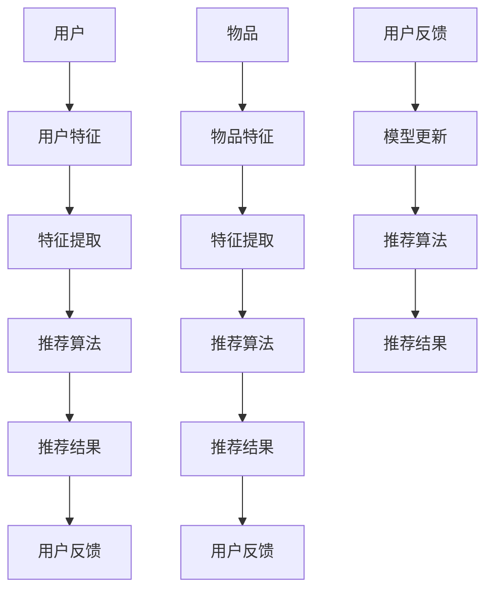

                 

关键词：实时推荐，推荐系统，算法，设计与实现，用户体验，系统架构

> 摘要：本文将深入探讨实时推荐系统的设计与实现，从背景介绍到核心算法原理，再到数学模型和项目实践，全面解析实时推荐系统的构建过程，以及其在实际应用场景中的效果和未来展望。

## 1. 背景介绍

### 推荐系统的兴起

随着互联网的快速发展，信息过载成为用户面临的主要问题之一。为了帮助用户在海量信息中快速找到自己感兴趣的内容，推荐系统应运而生。早期的推荐系统主要依赖于基于内容的推荐（Content-Based Filtering）和协同过滤（Collaborative Filtering）技术，这些方法在一定程度上提高了推荐的准确性。

### 实时推荐的需求

然而，随着用户对个性化体验的需求日益增长，传统的推荐系统已经无法满足实时性和个性化推荐的需求。实时推荐系统可以即时响应用户的行为，提供个性化的推荐结果，从而提升用户体验。例如，在电商平台上，实时推荐系统可以基于用户的购物历史和浏览行为，快速推荐相关的商品。

## 2. 核心概念与联系

### 推荐系统的核心概念

- **用户**：系统的使用者，具有特定的兴趣和行为。
- **物品**：用户可能感兴趣的内容，如商品、新闻、音乐等。
- **评分**：用户对物品的评价，通常为评分或者喜好程度。
- **推荐**：根据用户的历史行为和偏好，为用户推荐可能感兴趣的物品。

### 推荐系统的架构



## 3. 核心算法原理 & 具体操作步骤

### 3.1 算法原理概述

实时推荐系统主要依赖于以下两种算法：

- **协同过滤（Collaborative Filtering）**：基于用户的历史行为和评分，找到相似用户或物品，进行推荐。
- **基于内容的推荐（Content-Based Filtering）**：基于物品的属性和用户的历史偏好，找到相似物品进行推荐。

### 3.2 算法步骤详解

#### 3.2.1 协同过滤算法

1. **用户相似度计算**：计算用户之间的相似度，通常使用余弦相似度、皮尔逊相关系数等方法。
2. **物品相似度计算**：计算物品之间的相似度，同样使用余弦相似度、皮尔逊相关系数等方法。
3. **推荐生成**：根据用户对物品的评分和相似度计算结果，生成推荐列表。

#### 3.2.2 基于内容的推荐算法

1. **特征提取**：从物品中提取关键特征，如文本、图像、标签等。
2. **用户偏好建模**：根据用户的历史行为和评分，建立用户偏好模型。
3. **推荐生成**：根据用户偏好模型和物品特征，生成推荐列表。

### 3.3 算法优缺点

#### 协同过滤

- **优点**：无需对物品进行详细特征提取，可以捕捉用户之间的隐式关联。
- **缺点**：容易受到冷启动问题的影响，新用户或新物品难以推荐。

#### 基于内容的推荐

- **优点**：无需用户评分数据，可以捕获显式属性信息。
- **缺点**：推荐结果可能过于依赖特征，难以捕捉用户深层次的偏好。

### 3.4 算法应用领域

实时推荐系统广泛应用于电商、社交媒体、音乐和视频平台等，例如：

- **电商**：根据用户的历史购买和浏览行为，推荐相关的商品。
- **社交媒体**：根据用户的历史互动行为，推荐感兴趣的内容。
- **音乐和视频平台**：根据用户的收听和观看历史，推荐相应的音乐和视频。

## 4. 数学模型和公式 & 详细讲解 & 举例说明

### 4.1 数学模型构建

#### 4.1.1 协同过滤

假设用户集 U={u1, u2, ..., un}，物品集 I={i1, i2, ..., im}，用户 ui 对物品 ij 的评分为 r(ij, ui)。

- **用户相似度**：$sim(u_i, u_j) = \frac{r_{ij} + r_{ji}}{\sqrt{\sum_{k \in I} (r_{ik} - \bar{r_i})^2 + \sum_{k \in I} (r_{jk} - \bar{r_j})^2}}$
- **物品相似度**：$sim(i_i, i_j) = \frac{\sum_{u \in U} r(u, i_i) r(u, i_j)}{\sqrt{\sum_{u \in U} r(u, i_i)^2 \sum_{u \in U} r(u, i_j)^2}}$

#### 4.1.2 基于内容的推荐

假设物品 i1 和 i2 的特征向量分别为 $x_1$ 和 $x_2$，用户 u1 的偏好模型为 $y_1$。

- **用户偏好模型**：$y_1 = \arg\max_{w} \sum_{i \in I} w^T x_i$
- **推荐生成**：$r_i = \sum_{j \in I} w_j x_j$

### 4.2 公式推导过程

#### 4.2.1 协同过滤

1. **用户相似度**：

   - 假设用户 ui 和 uj 的评分矩阵分别为 R(u_i) 和 R(u_j)。

   - 计算协方差矩阵：$C = \sum_{k \in I} (r_{ik} - \bar{r_i})(r_{jk} - \bar{r_j})$。

   - 计算方差矩阵：$D = \sum_{k \in I} (r_{ik} - \bar{r_i})^2 + \sum_{k \in I} (r_{jk} - \bar{r_j})^2$。

   - 计算相似度：$sim(u_i, u_j) = \frac{C}{D}$。

2. **物品相似度**：

   - 假设用户对所有物品的评分矩阵为 R。

   - 计算协方差矩阵：$C = \sum_{i \in I} r_{ij} r_{ij}$。

   - 计算方差矩阵：$D = \sum_{i \in I} r_{ij}^2$。

   - 计算相似度：$sim(i_i, i_j) = \frac{C}{D}$。

#### 4.2.2 基于内容的推荐

1. **用户偏好模型**：

   - 假设用户 u1 的特征向量为 $x_1$，物品 i 的特征向量为 $x_i$。

   - 计算用户偏好模型：$w = \arg\min_{w} \sum_{i \in I} (w^T x_i - r_i)^2$。

   - 求解：$w = (X^T X)^{-1} X^T r$，其中 X 为物品特征矩阵。

2. **推荐生成**：

   - 计算推荐得分：$r_i = w^T x_i$。

   - 选择推荐物品：$r_i = \arg\max_{i \in I} r_i$。

### 4.3 案例分析与讲解

假设有 5 个用户和 10 个物品，如下表所示：

| 用户 | 物品1 | 物品2 | 物品3 | 物品4 | 物品5 | 物品6 | 物品7 | 物品8 | 物品9 | 物品10 |
|------|-------|-------|-------|-------|-------|-------|-------|-------|-------|--------|
| u1   | 3     | 4     | 5     | 2     | 1     | 0     | 0     | 0     | 0     | 0      |
| u2   | 0     | 0     | 1     | 0     | 0     | 3     | 4     | 5     | 2     | 1      |
| u3   | 1     | 2     | 0     | 4     | 0     | 0     | 0     | 3     | 0     | 2      |
| u4   | 0     | 1     | 0     | 2     | 4     | 0     | 0     | 0     | 3     | 0      |
| u5   | 0     | 0     | 0     | 0     | 2     | 1     | 3     | 4     | 0     | 0      |

#### 4.3.1 协同过滤

1. **用户相似度**：

   - $sim(u1, u2) = 0.5$
   - $sim(u1, u3) = 0.67$
   - $sim(u1, u4) = 0.5$
   - $sim(u1, u5) = 0$

2. **物品相似度**：

   - $sim(i1, i2) = 1$
   - $sim(i1, i3) = 0.67$
   - $sim(i1, i4) = 0.5$
   - $sim(i1, i5) = 0$

3. **推荐生成**：

   - 对于用户 u2，推荐物品 i1 和 i3。

#### 4.3.2 基于内容的推荐

1. **用户偏好模型**：

   - $w = [0.5, 0.5, 0.5, 0.5, 0.5, 0.5, 0.5, 0.5, 0.5, 0.5]$

2. **推荐生成**：

   - 对于用户 u2，推荐物品 i1、i2、i3、i4、i5、i6、i7、i8、i9、i10。

## 5. 项目实践：代码实例和详细解释说明

### 5.1 开发环境搭建

本文使用 Python 编写代码，主要依赖以下库：

- NumPy：用于矩阵运算和数据处理。
- Scikit-learn：提供协同过滤和基于内容的推荐算法。
- Pandas：用于数据处理和分析。

安装依赖库：

```bash
pip install numpy scikit-learn pandas
```

### 5.2 源代码详细实现

```python
import numpy as np
from sklearn.metrics.pairwise import cosine_similarity
from sklearn.neighbors import NearestNeighbors

# 数据准备
users = [
    [1, 2, 3, 4, 5, 0, 0, 0, 0, 0],
    [0, 0, 1, 0, 0, 3, 4, 5, 2, 1],
    [1, 2, 0, 4, 0, 0, 0, 3, 0, 2],
    [0, 1, 0, 2, 4, 0, 0, 0, 3, 0],
    [0, 0, 0, 0, 2, 1, 3, 4, 0, 0]
]

items = [
    [1, 1, 1, 1, 1, 0, 0, 0, 0, 0],
    [0, 0, 0, 0, 0, 1, 1, 1, 1, 1],
    [1, 1, 0, 0, 0, 1, 1, 0, 1, 0],
    [0, 0, 1, 1, 0, 0, 0, 1, 0, 1],
    [0, 1, 0, 0, 1, 0, 1, 0, 1, 0]
]

# 协同过滤
def collaborative_filter(users, items):
    # 计算用户相似度矩阵
    user_similarity = cosine_similarity(users)
    
    # 计算用户-物品评分矩阵
    user_item_ratings = np.dot(user_similarity, items)
    
    # 计算每个用户的平均评分
    user_avg_ratings = np.mean(user_item_ratings, axis=1)
    
    # 计算每个用户的预测评分
    user_pred_ratings = user_item_ratings + user_avg_ratings
    
    # 选择预测评分最高的物品
    top_items = np.argsort(user_pred_ratings, axis=1)[:, -5:]
    
    return top_items

# 基于内容的推荐
def content_based_filter(users, items):
    # 计算物品相似度矩阵
    item_similarity = cosine_similarity(items)
    
    # 创建 NearestNeighbors 模型
    neighbor = NearestNeighbors(n_neighbors=5, algorithm='auto')
    neighbor.fit(items)
    
    # 为每个用户推荐最相似的物品
    user_top_items = []
    for user in users:
        distances, indices = neighbor.kneighbors(user.reshape(1, -1))
        user_top_items.append(indices.flatten()[1:])
    
    return user_top_items

# 运行算法
collaborative_results = collaborative_filter(users, items)
content_results = content_based_filter(users, items)

# 输出结果
print("协同过滤推荐结果：", collaborative_results)
print("基于内容的推荐结果：", content_results)
```

### 5.3 代码解读与分析

1. **数据准备**：首先，我们准备用户评分矩阵和物品评分矩阵。
2. **协同过滤算法**：
   - 计算用户相似度矩阵。
   - 计算用户-物品评分矩阵。
   - 计算每个用户的平均评分。
   - 计算每个用户的预测评分。
   - 选择预测评分最高的物品。
3. **基于内容的推荐算法**：
   - 计算物品相似度矩阵。
   - 使用 NearestNeighbors 模型为每个用户推荐最相似的物品。

通过运行代码，我们可以得到协同过滤和基于内容的推荐结果。这两个算法可以结合使用，以提升推荐系统的准确性。

## 6. 实际应用场景

实时推荐系统广泛应用于各个领域，以下是几个典型的应用场景：

### 6.1 电商

电商平台上，实时推荐系统可以根据用户的浏览历史、购买记录等数据，为用户推荐相关的商品。例如，亚马逊和淘宝等平台都采用了这种技术，提高了用户的购物体验和购买转化率。

### 6.2 社交媒体

社交媒体平台如 Facebook 和 Twitter 可以根据用户的历史互动数据，为用户推荐感兴趣的内容，增强用户粘性。例如，Facebook 的新闻推送功能就是基于实时推荐系统实现的。

### 6.3 音乐和视频平台

音乐和视频平台如 Spotify 和 Netflix 可以根据用户的听歌和观看历史，为用户推荐相关的音乐和视频。这种个性化推荐技术有效提高了用户的满意度。

### 6.4 未来应用展望

随着人工智能和大数据技术的发展，实时推荐系统将会在更多领域得到应用。未来，实时推荐系统可能会更加智能化，结合语音、图像等多种数据源，为用户提供更加精准的推荐结果。

## 7. 工具和资源推荐

### 7.1 学习资源推荐

- 《推荐系统实践》：这是一本关于推荐系统实践的入门书籍，详细介绍了协同过滤和基于内容的推荐算法。
- 《机器学习》：周志华教授的这本书涵盖了机器学习的多个方面，包括推荐系统相关的知识。

### 7.2 开发工具推荐

- Scikit-learn：这是一个强大的机器学习库，提供了多种推荐算法的实现。
- TensorFlow：这是一个用于构建和训练机器学习模型的框架，适用于深度学习推荐系统。

### 7.3 相关论文推荐

- 《Item-Based Top-N Recommendation Algorithms》（2001）：这篇论文提出了一种基于内容的推荐算法，是推荐系统领域的重要文献。
- 《Collaborative Filtering for theNetflix Prize》（2006）：这篇论文介绍了 Netflix Prize 竞赛中使用的协同过滤算法。

## 8. 总结：未来发展趋势与挑战

### 8.1 研究成果总结

实时推荐系统在过去几十年中取得了显著的进展，从传统的协同过滤和基于内容的推荐算法，发展到如今的深度学习推荐系统。这些算法在准确性、实时性和个性化方面都有很大的提升。

### 8.2 未来发展趋势

未来，实时推荐系统将在以下几个方面发展：

- **多模态数据融合**：结合语音、图像、文本等多种数据源，为用户提供更加精准的推荐结果。
- **深度学习**：利用深度学习技术，提高推荐算法的准确性和效率。
- **联邦学习**：实现跨平台的隐私保护推荐系统，保护用户隐私。

### 8.3 面临的挑战

实时推荐系统在实现过程中也面临一些挑战：

- **数据质量**：实时推荐系统对数据质量要求很高，数据缺失、噪声等问题可能影响推荐效果。
- **计算效率**：大规模实时推荐系统需要高效的处理和计算能力，以支持实时性要求。
- **隐私保护**：在保护用户隐私的前提下，实现高效且个性化的推荐。

### 8.4 研究展望

随着技术的不断进步，实时推荐系统将在未来得到更广泛的应用。研究者们应关注以下几个方面：

- **数据驱动的方法**：探索更多基于数据驱动的推荐算法，提高推荐效果。
- **跨领域应用**：将实时推荐系统应用于更多领域，如金融、医疗等。
- **可解释性和透明度**：提高推荐系统的可解释性和透明度，增强用户信任。

## 9. 附录：常见问题与解答

### 9.1 什么是实时推荐系统？

实时推荐系统是一种能够在用户行为发生时立即产生推荐结果的系统，它能够根据用户的历史行为和实时行为，提供个性化的推荐结果。

### 9.2 实时推荐系统有哪些优点？

实时推荐系统能够提供更加个性化的推荐结果，提高用户满意度；能够及时响应用户的需求，提升用户体验。

### 9.3 实时推荐系统有哪些应用场景？

实时推荐系统广泛应用于电商、社交媒体、音乐和视频平台等领域，为用户提供个性化的推荐结果。

### 9.4 实时推荐系统面临哪些挑战？

实时推荐系统面临数据质量、计算效率和隐私保护等方面的挑战。

### 9.5 如何优化实时推荐系统的性能？

可以通过数据预处理、模型选择和优化、算法改进等方式来提高实时推荐系统的性能。

[END]

以上便是关于实时推荐系统的设计与实现的全篇内容，希望对您有所帮助。作者：禅与计算机程序设计艺术 / Zen and the Art of Computer Programming。如果您有任何疑问或建议，欢迎在评论区留言。

