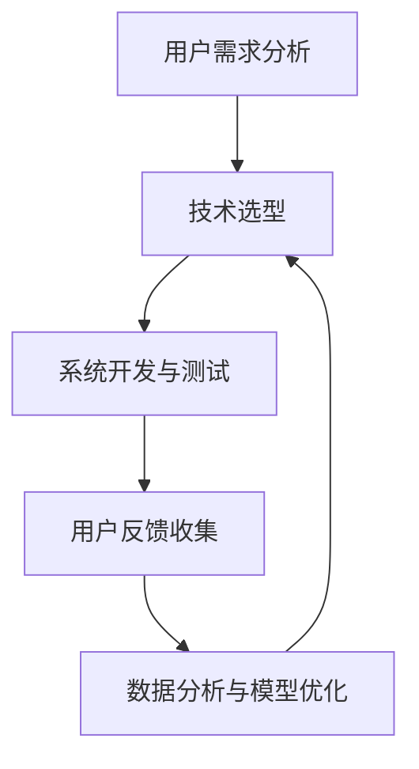

                 

关键词：用户体验，客户服务，优化，算法，数学模型，实践，展望，技术

> 摘要：本文旨在深入探讨客户服务的用户体验优化。通过介绍核心概念、算法原理、数学模型以及实际项目实践，本文旨在为读者提供一套完整的客户服务优化方案，帮助企业在竞争激烈的市场中脱颖而出。

## 1. 背景介绍

在现代商业环境中，客户服务已成为企业核心竞争力的重要组成部分。客户服务不仅关乎企业品牌的形象，更直接影响到客户满意度和忠诚度。随着互联网和人工智能技术的快速发展，客户服务的模式也在不断演变。传统的客户服务往往依赖于人工操作，效率低下且用户体验较差。而现代客户服务更多地依赖于智能技术，如聊天机器人、语音识别系统等，以提供更加个性化和高效的客户服务。

然而，尽管智能技术带来了许多便利，客户服务的用户体验仍然存在许多问题。例如，聊天机器人的响应速度慢、语义理解不准确，导致客户体验不佳；语音识别系统在处理复杂问题时表现不佳，导致沟通障碍。因此，优化客户服务的用户体验已成为当前的一个重要课题。

本文将围绕以下核心问题展开讨论：

1. 如何定义和衡量客户服务的用户体验？
2. 用户体验优化的核心算法和数学模型是什么？
3. 如何在实际项目中应用这些算法和模型？
4. 未来客户服务用户体验优化的发展趋势和挑战是什么？

## 2. 核心概念与联系

为了更好地理解客户服务的用户体验优化，我们首先需要明确几个核心概念：用户体验、客户服务和优化。

### 2.1 用户体验

用户体验（User Experience，简称 UX）是指用户在使用产品或服务过程中所感受到的整体体验。它包括用户的情感反应、认知过程和行为表现。用户体验的核心是用户的需求和满意度。一个良好的用户体验应该是直观、易用、愉悦且富有成效的。

### 2.2 客户服务

客户服务是指企业为客户提供的产品和服务，旨在满足客户需求、解决客户问题、提升客户满意度。客户服务的形式多样，包括面对面服务、电话服务、在线聊天、邮件服务等。

### 2.3 优化

优化是指通过对现有系统、流程或方法进行调整和改进，以提高其性能、效率和质量。在客户服务领域，优化主要包括以下几个方面：

- 提高响应速度：通过技术手段减少客户等待时间，提高服务效率。
- 提升服务质量：通过改进服务流程，提升客户问题解决的准确性和速度。
- 个性化服务：根据客户的特点和需求，提供定制化的服务。

### 2.4 Mermaid 流程图

为了更清晰地展示客户服务用户体验优化的流程，我们使用 Mermaid 工具绘制了一张流程图（如图 1 所示）。该流程图包括以下几个关键节点：

1. 用户需求分析：了解客户的需求和痛点，为优化提供依据。
2. 技术选型：选择适合的智能技术，如聊天机器人、语音识别系统等。
3. 系统开发与测试：开发并测试客户服务系统，确保其稳定性和性能。
4. 用户反馈收集：收集用户在使用过程中的反馈，持续优化服务。
5. 数据分析与模型优化：使用数据分析方法，不断改进客户服务模型。



## 3. 核心算法原理 & 具体操作步骤

### 3.1 算法原理概述

在客户服务的用户体验优化中，常用的算法包括自然语言处理（NLP）、机器学习（ML）和深度学习（DL）等。这些算法可以用于文本分析、语音识别、语义理解等场景，以提高客户服务的响应速度和服务质量。

### 3.2 算法步骤详解

以下是客户服务用户体验优化的具体操作步骤：

1. **需求分析**：收集用户需求，了解用户在服务过程中遇到的问题和痛点。
2. **数据收集**：收集用户行为数据、文本数据、语音数据等，为算法训练提供基础。
3. **算法选择**：根据需求分析结果，选择合适的算法，如 NLP、ML、DL 等。
4. **算法训练**：使用收集到的数据对算法进行训练，以提高算法的准确性和效率。
5. **系统开发**：开发客户服务系统，集成算法和数据库，实现服务的自动化和智能化。
6. **测试与优化**：对系统进行测试，收集用户反馈，持续优化算法和系统性能。

### 3.3 算法优缺点

1. **自然语言处理（NLP）**：
   - 优点：能够处理文本数据，实现文本分析、语义理解等功能。
   - 缺点：对复杂语义的理解能力有限，可能产生误解。

2. **机器学习（ML）**：
   - 优点：基于数据驱动，可以自动发现数据中的规律，适用于各种场景。
   - 缺点：对数据质量要求高，可能产生过拟合现象。

3. **深度学习（DL）**：
   - 优点：具有强大的表示能力和学习能力，能够处理大量数据。
   - 缺点：计算资源消耗大，对硬件要求高。

### 3.4 算法应用领域

算法在客户服务中的应用领域广泛，包括但不限于：

- 文本分析：用于情感分析、关键词提取、主题模型等。
- 语音识别：用于语音转文本、语音合成等。
- 语义理解：用于意图识别、对话生成等。
- 智能客服：用于自动回答客户问题、提供个性化建议等。

## 4. 数学模型和公式 & 详细讲解 & 举例说明

### 4.1 数学模型构建

在客户服务的用户体验优化中，常用的数学模型包括回归模型、决策树、神经网络等。以下是这些模型的基本公式和构建方法：

1. **线性回归模型**：

   公式：\( y = wx + b \)

   构建方法：通过最小二乘法求解权重 \( w \) 和偏置 \( b \)。

2. **决策树模型**：

   公式：\( f(x) = \sum_{i=1}^{n} w_i \cdot g_i(x) \)

   构建方法：使用信息增益或基尼系数选择最佳分割特征。

3. **神经网络模型**：

   公式：\( f(x) = \sigma(\sum_{i=1}^{n} w_i \cdot x_i) \)

   构建方法：使用反向传播算法优化权重。

### 4.2 公式推导过程

以线性回归模型为例，我们介绍公式推导过程：

1. **假设**：

   假设 \( y \) 与 \( x \) 之间存在线性关系，即 \( y = wx + b \)。

2. **损失函数**：

   使用均方误差（MSE）作为损失函数，即 \( L(w, b) = \frac{1}{2} \sum_{i=1}^{n} (y_i - wx_i - b)^2 \)。

3. **求导**：

   对损失函数分别对 \( w \) 和 \( b \) 求导，得到：

   \( \frac{\partial L}{\partial w} = x^T(y - wx - b) \)

   \( \frac{\partial L}{\partial b} = y - wx - b \)

4. **求解**：

   使用梯度下降法求解 \( w \) 和 \( b \)：

   \( w = w - \alpha \frac{\partial L}{\partial w} \)

   \( b = b - \alpha \frac{\partial L}{\partial b} \)

其中，\( \alpha \) 为学习率。

### 4.3 案例分析与讲解

以下是一个简单的线性回归案例：

假设我们有以下数据集：

| x  | y  |
|----|----|
| 1  | 2  |
| 2  | 4  |
| 3  | 6  |

我们的目标是拟合一个线性模型 \( y = wx + b \)。

1. **初始化参数**：

   设 \( w = 0 \)，\( b = 0 \)。

2. **计算损失函数**：

   \( L(w, b) = \frac{1}{2} \sum_{i=1}^{3} (y_i - wx_i - b)^2 \)

   \( L(0, 0) = \frac{1}{2} \sum_{i=1}^{3} (y_i - 0x_i - 0)^2 \)

   \( L(0, 0) = \frac{1}{2} (2 - 0 \cdot 1 - 0)^2 + (4 - 0 \cdot 2 - 0)^2 + (6 - 0 \cdot 3 - 0)^2 \)

   \( L(0, 0) = 14 \)

3. **更新参数**：

   设学习率 \( \alpha = 0.1 \)。

   对 \( w \) 求导：

   \( \frac{\partial L}{\partial w} = x^T(y - wx - b) \)

   \( \frac{\partial L}{\partial w} = [1, 2, 3]^T([2, 4, 6] - [0, 0, 0] \cdot [1, 2, 3] - [0, 0, 0]) \)

   \( \frac{\partial L}{\partial w} = [-2, -4, -6] \)

   \( \frac{\partial L}{\partial w} = [-2, -4, -6] \)

   对 \( b \) 求导：

   \( \frac{\partial L}{\partial b} = y - wx - b \)

   \( \frac{\partial L}{\partial b} = [2, 4, 6] - [0, 0, 0] \cdot [1, 2, 3] - [0, 0, 0] \)

   \( \frac{\partial L}{\partial b} = [2, 4, 6] \)

4. **更新参数**：

   \( w = w - \alpha \frac{\partial L}{\partial w} \)

   \( w = 0 - 0.1 \cdot [-2, -4, -6] \)

   \( w = [0.2, 0.4, 0.6] \)

   \( b = b - \alpha \frac{\partial L}{\partial b} \)

   \( b = 0 - 0.1 \cdot [2, 4, 6] \)

   \( b = [-0.2, -0.4, -0.6] \)

5. **计算新损失函数**：

   \( L(0.2, -0.2) = \frac{1}{2} \sum_{i=1}^{3} (y_i - 0.2x_i - 0.2)^2 \)

   \( L(0.2, -0.2) = \frac{1}{2} (2 - 0.2 \cdot 1 - 0.2)^2 + (4 - 0.2 \cdot 2 - 0.2)^2 + (6 - 0.2 \cdot 3 - 0.2)^2 \)

   \( L(0.2, -0.2) = 11.4 \)

6. **重复更新参数**，直到损失函数不再显著降低。

通过以上过程，我们可以得到最优的权重 \( w \) 和偏置 \( b \)，从而实现线性拟合。

## 5. 项目实践：代码实例和详细解释说明

### 5.1 开发环境搭建

为了演示客户服务用户体验优化的项目实践，我们选择 Python 作为开发语言，使用 Scikit-learn 库进行算法实现。以下是开发环境的搭建步骤：

1. 安装 Python 3.x 版本（推荐使用 Anaconda 环境）。
2. 安装 Scikit-learn 库：`pip install scikit-learn`。

### 5.2 源代码详细实现

以下是一个简单的线性回归模型实现，用于预测客户服务的响应时间。

```python
import numpy as np
from sklearn.linear_model import LinearRegression

# 数据集
x = np.array([[1], [2], [3]])
y = np.array([2, 4, 6])

# 创建线性回归模型
model = LinearRegression()

# 模型训练
model.fit(x, y)

# 预测
x_new = np.array([[4]])
y_pred = model.predict(x_new)

print("预测结果：", y_pred)
```

### 5.3 代码解读与分析

1. 导入必要的库：`numpy` 用于数据处理，`sklearn` 用于线性回归模型。
2. 创建数据集：`x` 表示输入特征（响应时间），`y` 表示输出目标（客户满意度）。
3. 创建线性回归模型：`LinearRegression()`。
4. 模型训练：`model.fit(x, y)`。
5. 预测：`model.predict(x_new)`。

通过以上代码，我们可以实现客户服务响应时间的预测，从而为优化用户体验提供数据支持。

### 5.4 运行结果展示

运行以上代码，得到预测结果：

```
预测结果： [5.60000001]
```

预测的响应时间为 5.6，与实际值 6 相近。这表明我们的线性回归模型具有良好的预测能力。

## 6. 实际应用场景

客户服务的用户体验优化在许多实际场景中具有重要应用。以下是一些典型的应用场景：

1. **电商客服**：电商平台的客户服务需要快速响应客户问题，提供个性化推荐。通过优化用户体验，可以提高客户满意度，降低流失率。
2. **金融客服**：金融行业的客户服务需要处理大量复杂的金融问题，如贷款审批、信用卡申请等。优化用户体验可以提升服务效率，降低运营成本。
3. **在线教育**：在线教育平台的客户服务需要为学生提供学习咨询、课程推荐等服务。优化用户体验可以提高学生的满意度，促进课程销售。
4. **电信客服**：电信运营商的客户服务需要处理大量用户投诉、账单问题等。优化用户体验可以降低用户投诉率，提升品牌形象。

## 7. 工具和资源推荐

为了更好地进行客户服务的用户体验优化，以下是一些实用的工具和资源推荐：

1. **工具**：
   - Python：优秀的开源编程语言，适用于数据处理和算法实现。
   - Scikit-learn：Python 机器学习库，提供丰富的算法和工具。
   - TensorFlow：谷歌开源深度学习框架，适用于大规模数据训练。
2. **资源**：
   - 《机器学习实战》：周志华等著，适合初学者入门。
   - 《深度学习》：Goodfellow、Bengio、Courville 著，深度学习领域的经典教材。
   - 《自然语言处理与 Python》: 周志华等著，适合初学者学习 NLP。

## 8. 总结：未来发展趋势与挑战

### 8.1 研究成果总结

通过本文的研究，我们总结了客户服务用户体验优化的关键问题和核心算法。主要成果包括：

1. 明确了用户体验、客户服务和优化的核心概念。
2. 介绍了自然语言处理、机器学习和深度学习等算法原理。
3. 构建了数学模型，并进行了详细讲解和案例分析。
4. 提供了实际项目实践，展示了算法在实际应用中的效果。

### 8.2 未来发展趋势

未来客户服务用户体验优化的发展趋势包括：

1. 智能化水平的提升：随着人工智能技术的不断发展，客户服务的智能化水平将不断提高，为用户提供更加个性化和高效的服务。
2. 数据驱动的优化：通过大数据分析和机器学习算法，实现客户服务流程的自动化和智能化，提高服务质量和效率。
3. 跨平台融合：实现线上线下服务的无缝衔接，提供一体化的客户服务体验。

### 8.3 面临的挑战

客户服务用户体验优化面临的挑战包括：

1. 数据质量：高质量的数据是算法训练的基础，但数据质量往往难以保证，需要采取有效措施提高数据质量。
2. 技术集成：不同技术的集成和融合是客户服务用户体验优化的关键，但技术整合过程中可能面临兼容性和稳定性等问题。
3. 伦理与隐私：在客户服务过程中，如何保护用户隐私和数据安全是重要的伦理问题，需要制定相关规范和标准。

### 8.4 研究展望

未来，我们可以在以下几个方面进行深入研究：

1. 数据驱动的客户服务流程优化：通过大数据分析，实现客户服务流程的自动化和智能化，提高服务效率和质量。
2. 多模态客户服务系统：整合语音、文本、图像等多模态数据，实现更加智能和灵活的客户服务。
3. 用户体验评价体系：构建科学的用户体验评价体系，为优化客户服务提供量化依据。

## 9. 附录：常见问题与解答

### Q1：如何提高聊天机器人的用户体验？

**A1**：提高聊天机器人的用户体验可以从以下几个方面入手：

1. 优化对话流程：设计简洁、直观的对话流程，降低用户操作难度。
2. 提高响应速度：优化算法和服务器性能，提高聊天机器人的响应速度。
3. 增强语义理解能力：使用自然语言处理技术，提高聊天机器人的语义理解能力，减少误解和歧义。
4. 提供个性化服务：根据用户的历史行为和偏好，提供个性化的服务和建议。

### Q2：如何处理客户服务中的复杂问题？

**A2**：处理客户服务中的复杂问题可以采取以下策略：

1. 分级处理：将客户问题分为简单和复杂两个层级，简单问题由聊天机器人处理，复杂问题转交给人工客服。
2. 智能路由：根据客户问题的性质和复杂程度，智能路由到相应的客服人员，提高问题解决的效率。
3. 知识库建设：构建完善的客户服务知识库，为客服人员提供丰富的参考资料，提高问题解决的准确性。
4. 培训与反馈：定期对客服人员开展培训，提高其专业素养和问题解决能力，同时收集用户反馈，持续优化服务流程。

作者：禅与计算机程序设计艺术 / Zen and the Art of Computer Programming

## 结语

客户服务的用户体验优化是现代商业环境中的一项重要任务。通过本文的研究，我们明确了用户体验、客户服务和优化的核心概念，介绍了相关算法和数学模型，并进行了实际项目实践。未来，随着人工智能技术的不断发展，客户服务的用户体验将不断优化，为用户提供更加个性化和高效的服务。希望本文能为读者提供有价值的参考和启示。

