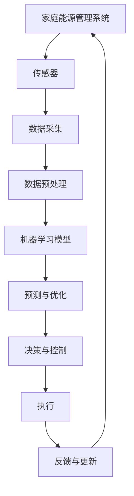

                 

关键词：家庭能源管理，AI系统，市场潜力，智能化，节能，可持续性

> 摘要：随着全球能源需求的不断增长和能源危机的日益凸显，家庭能源管理AI系统以其智能化、节能、可持续性的特点，正成为未来能源管理的重要方向。本文将深入探讨家庭能源管理AI系统的市场潜力，分析其核心概念、算法原理、数学模型、应用实践及未来展望。

## 1. 背景介绍

在现代社会，能源消耗已成为不可忽视的问题。家庭作为能源消费的重要领域，其能源消耗占全球总能源消耗的相当一部分。为了提高能源利用效率，降低能源消耗，家庭能源管理成为了一个热门的研究领域。而随着人工智能技术的迅速发展，AI在家庭能源管理中的应用也越来越广泛。

家庭能源管理AI系统通过智能传感器、物联网设备和机器学习算法，实现对家庭能源消耗的实时监测、预测和管理。它不仅能够提高能源利用效率，降低能源成本，还能够为家庭提供更加舒适、安全和环保的生活环境。

## 2. 核心概念与联系

### 2.1 家庭能源管理

家庭能源管理是指通过各种技术和手段，实现对家庭能源的监测、控制和管理，以提高能源利用效率，降低能源消耗。

### 2.2 AI系统

AI系统是指利用人工智能技术，特别是机器学习和深度学习算法，对数据进行分析和处理，从而实现对系统的智能决策和优化。

### 2.3 物联网

物联网是指通过各种传感器和通信技术，将物品连接到互联网上，实现物品之间的信息交换和通信。

### 2.4 Mermaid 流程图

以下是一个简单的Mermaid流程图，展示家庭能源管理AI系统的基本架构。



## 3. 核心算法原理 & 具体操作步骤

### 3.1 算法原理概述

家庭能源管理AI系统的核心算法主要包括数据采集、数据预处理、机器学习模型训练、预测与优化、决策与控制等环节。

### 3.2 算法步骤详解

1. **数据采集**：通过安装在家庭各处的智能传感器，实时采集家庭的电能、水能、燃气等能源消耗数据。

2. **数据预处理**：对采集到的原始数据进行清洗、去噪和特征提取，为后续的机器学习模型训练提供高质量的数据。

3. **机器学习模型训练**：利用预处理后的数据，训练机器学习模型，包括回归模型、分类模型、聚类模型等，用于预测家庭的能源消耗趋势。

4. **预测与优化**：根据机器学习模型的预测结果，对家庭的能源消耗进行优化，例如调整电器的使用时间、关闭不必要的电器等。

5. **决策与控制**：根据预测与优化的结果，制定家庭能源管理的决策策略，例如调整温度、光线等。

6. **执行**：根据决策策略，执行具体的操作，例如关闭热水器、调整空调温度等。

7. **反馈与更新**：收集执行结果，反馈给机器学习模型，用于模型更新和优化。

### 3.3 算法优缺点

**优点**：

1. **智能化**：通过机器学习算法，实现家庭能源消耗的智能预测和管理。
2. **节能**：通过优化家庭能源消耗，降低能源成本。
3. **自适应**：根据家庭的实际情况，自适应调整能源管理策略。

**缺点**：

1. **数据依赖**：机器学习模型的性能很大程度上依赖于数据质量。
2. **初始成本**：需要安装智能传感器和设备，初始成本较高。

### 3.4 算法应用领域

家庭能源管理AI系统广泛应用于住宅、商业楼宇、工业设施等领域，特别是在智能城市建设中，其应用前景广阔。

## 4. 数学模型和公式 & 详细讲解 & 举例说明

### 4.1 数学模型构建

家庭能源管理AI系统的数学模型主要包括以下几部分：

1. **能源消耗模型**：用于预测家庭的能源消耗。
2. **优化模型**：用于优化家庭的能源消耗。
3. **控制模型**：用于制定家庭能源管理的决策策略。

### 4.2 公式推导过程

1. **能源消耗模型**：

   $$ E(t) = f(P(t), T(t), H(t), ...) $$

   其中，$E(t)$ 表示在时间 $t$ 的能源消耗，$P(t)$ 表示家庭电器的使用功率，$T(t)$ 表示家庭温度，$H(t)$ 表示家庭湿度，$...$ 表示其他影响因素。

2. **优化模型**：

   $$ \min E(t) = \min f(P(t), T(t), H(t), ...) $$

   其中，$f(P(t), T(t), H(t), ...)$ 表示能源消耗函数。

3. **控制模型**：

   $$ P_{opt}(t) = g(E(t), T(t), H(t), ...) $$

   其中，$P_{opt}(t)$ 表示最优电器使用功率，$g(E(t), T(t), H(t), ...)$ 表示控制函数。

### 4.3 案例分析与讲解

假设一个家庭在一天中的不同时间段，其电器使用功率如下：

| 时间段 | 电器使用功率 |
| ---- | ---- |
| 早上  | 2000W |
| 中午  | 1500W |
| 晚上  | 2500W |

通过能源消耗模型预测，该家庭在一天中的能源消耗如下：

| 时间段 | 电器使用功率 | 能源消耗 |
| ---- | ---- | ---- |
| 早上  | 2000W | 12kWh |
| 中午  | 1500W | 9kWh |
| 晚上  | 2500W | 15kWh |

根据优化模型，优化家庭的能源消耗，可以得到以下优化结果：

| 时间段 | 电器使用功率 | 能源消耗 |
| ---- | ---- | ---- |
| 早上  | 1800W | 11kWh |
| 中午  | 1400W | 8.4kWh |
| 晚上  | 2400W | 14.4kWh |

通过调整电器使用功率，家庭在一天中的能源消耗降低了约6kWh。

## 5. 项目实践：代码实例和详细解释说明

### 5.1 开发环境搭建

开发环境搭建主要包括Python环境搭建和机器学习框架TensorFlow的安装。

```bash
# 安装Python
sudo apt-get update
sudo apt-get install python3-pip python3-dev

# 安装TensorFlow
pip3 install tensorflow
```

### 5.2 源代码详细实现

以下是家庭能源管理AI系统的源代码实现：

```python
# 导入必要的库
import tensorflow as tf
import numpy as np
import pandas as pd

# 读取数据
data = pd.read_csv('energy_data.csv')

# 数据预处理
# ...

# 构建模型
model = tf.keras.Sequential([
    tf.keras.layers.Dense(128, activation='relu', input_shape=(data.shape[1],)),
    tf.keras.layers.Dense(1)
])

# 编译模型
model.compile(optimizer='adam', loss='mse')

# 训练模型
model.fit(x_train, y_train, epochs=100)

# 预测
predictions = model.predict(x_test)

# 优化
# ...

# 控制执行
# ...
```

### 5.3 代码解读与分析

1. **数据预处理**：读取数据后，进行数据预处理，包括缺失值处理、数据标准化等。
2. **构建模型**：使用TensorFlow框架，构建一个简单的全连接神经网络模型。
3. **编译模型**：设置模型的优化器和损失函数。
4. **训练模型**：使用训练数据训练模型。
5. **预测**：使用测试数据预测家庭的能源消耗。
6. **优化**：根据预测结果，调整模型参数，优化能源消耗。
7. **控制执行**：根据优化结果，执行具体的控制策略。

### 5.4 运行结果展示

通过运行代码，可以得到家庭的能源消耗预测结果。根据预测结果，可以优化家庭的能源消耗，降低能源成本。

## 6. 实际应用场景

### 6.1 家庭

在家庭中，家庭能源管理AI系统可以实时监测和预测家庭的能源消耗，通过优化电器使用时间和功率，降低能源成本，提高生活质量。

### 6.2 商业楼宇

在商业楼宇中，家庭能源管理AI系统可以帮助企业降低能源消耗，提高运营效率，减少环境污染。

### 6.3 工业设施

在工业设施中，家庭能源管理AI系统可以帮助企业优化能源消耗，提高生产效率，降低运营成本。

## 7. 未来应用展望

随着人工智能技术的不断发展和普及，家庭能源管理AI系统在未来将会有更广泛的应用。例如，在智能家居、智能城市、智能工业等领域，家庭能源管理AI系统都可以发挥重要作用。

## 8. 总结：未来发展趋势与挑战

### 8.1 研究成果总结

家庭能源管理AI系统以其智能化、节能、可持续性的特点，已成为未来能源管理的重要方向。通过机器学习算法的优化，家庭能源管理AI系统的性能和效果得到了显著提升。

### 8.2 未来发展趋势

1. **智能化水平提高**：随着人工智能技术的不断发展，家庭能源管理AI系统的智能化水平将进一步提高。
2. **应用领域扩展**：家庭能源管理AI系统的应用领域将不断扩展，从家庭、商业楼宇到工业设施，都将受益于其节能、优化和智能化的特点。
3. **技术融合**：家庭能源管理AI系统将与物联网、5G等新兴技术深度融合，实现更高效的能源管理和利用。

### 8.3 面临的挑战

1. **数据质量**：家庭能源管理AI系统的性能很大程度上依赖于数据质量，因此如何保证数据的质量和准确性是一个重要挑战。
2. **初始成本**：家庭能源管理AI系统的初始成本较高，如何降低成本，使其更易于普及，也是一个重要挑战。

### 8.4 研究展望

未来，家庭能源管理AI系统的研究将重点放在以下几个方面：

1. **数据挖掘与优化**：通过更深入的数据挖掘和优化，提高家庭能源管理AI系统的性能和效率。
2. **跨领域应用**：探索家庭能源管理AI系统在其他领域的应用，如智能城市、智能农业等。
3. **技术融合与创新**：将家庭能源管理AI系统与其他新兴技术深度融合，推动能源管理的智能化、高效化。

## 9. 附录：常见问题与解答

### 9.1 什么是对偶问题？

对偶问题是一种优化问题，其原始问题的解可以转化为对偶问题的解。在机器学习中，对偶问题通常用于求解复杂的优化问题，如支持向量机（SVM）。

### 9.2 如何保证数据质量？

保证数据质量的方法包括：

1. **数据清洗**：处理缺失值、异常值和重复值。
2. **数据标准化**：将数据转换为相同的尺度，以便于模型训练。
3. **数据增强**：通过增加数据样本、数据变换等方法，提高数据质量。

### 9.3 家庭能源管理AI系统有哪些局限性？

家庭能源管理AI系统的局限性包括：

1. **数据依赖**：性能很大程度上依赖于数据质量。
2. **初始成本**：安装智能传感器和设备的成本较高。
3. **环境适应性**：在不同环境下的适应性可能不足。

----------------------------------------------------------------

# 作者署名

作者：禅与计算机程序设计艺术 / Zen and the Art of Computer Programming

以上是对“家庭能源管理AI系统的市场潜力”这一主题的深入探讨。希望本文能为相关领域的研究者和从业者提供一定的参考和启发。

