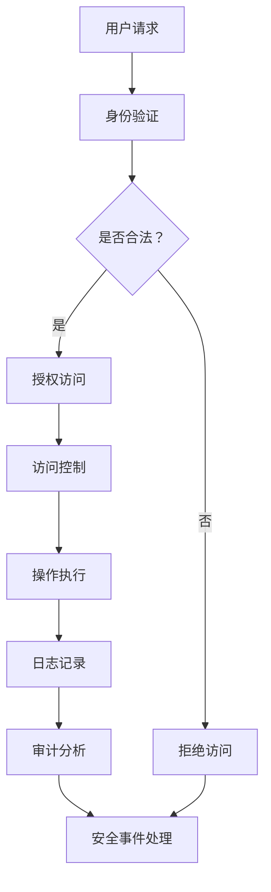

                 

关键词：工业控制系统安全，关键基础设施，网络安全，防护措施，防御策略，技术发展

## 摘要

随着工业自动化和信息化进程的不断推进，工业控制系统（ICS）在关键基础设施中的作用日益突出。然而，由于网络环境的日益复杂和攻击手段的不断翻新，工业控制系统面临的安全威胁也越来越严重。本文旨在深入探讨工业控制系统安全的重要性，分析当前的主要安全威胁和防御策略，并提出一系列针对性的防护措施。文章的核心目的是为工业控制系统安全提供理论指导和实践参考，以确保关键基础设施的稳定运行和国家的安全。

## 1. 背景介绍

### 工业控制系统概述

工业控制系统（Industrial Control Systems，ICS）是指用于控制工业过程的计算机系统、网络和专用设备。这些系统广泛应用于能源、交通、水利、化工、制造业等多个领域，是实现自动化控制和优化生产的重要手段。工业控制系统通过传感器、执行器和控制器实现实时监控和自动化控制，从而提高生产效率、降低成本、提升产品质量。

### 关键基础设施的定义和作用

关键基础设施是指对国家经济、社会、国防和公共安全至关重要的基础设施，如能源系统、交通系统、水利系统、通信系统、医疗系统等。这些基础设施保障了国家的基本生活和生产需求，是国家正常运转的重要支撑。工业控制系统作为关键基础设施的重要组成部分，其安全性直接关系到整个社会的稳定运行和国家的安全。

### 工业控制系统安全的重要性

工业控制系统的安全关系到关键基础设施的安全，而关键基础设施的安全又关系到国家的安全。工业控制系统一旦遭受网络攻击，可能导致生产中断、设备损坏、数据泄露等严重后果，进而影响社会秩序和国家安全。因此，保障工业控制系统的安全具有极其重要的意义。

## 2. 核心概念与联系

### 安全威胁的概念

安全威胁是指对系统安全造成潜在危害的因素，包括恶意软件、网络攻击、人为破坏等。对于工业控制系统而言，安全威胁主要来自以下几个方面：

1. **恶意软件**：恶意软件可以通过网络入侵控制系统，导致系统瘫痪、数据泄露等。
2. **网络攻击**：网络攻击者通过黑客手段获取系统控制权，对关键基础设施进行恶意操作。
3. **人为破坏**：内部人员或外部恶意人员通过物理手段破坏控制系统，导致系统故障。

### 安全防护措施

为了应对安全威胁，工业控制系统需要采取一系列防护措施，包括：

1. **防火墙**：防火墙可以阻止未经授权的访问，保护系统免受网络攻击。
2. **入侵检测系统（IDS）**：入侵检测系统可以实时监控网络流量，发现异常行为并及时报警。
3. **安全审计**：安全审计可以记录系统的操作日志，帮助管理员及时发现并处理安全事件。

### 安全架构的Mermaid流程图



## 3. 核心算法原理 & 具体操作步骤

### 算法原理概述

工业控制系统安全的核心算法主要包括身份验证、访问控制、入侵检测和审计分析等。以下是这些算法的基本原理：

1. **身份验证**：通过验证用户的身份，确保只有合法用户才能访问系统。
2. **访问控制**：根据用户的权限，限制用户对系统资源的访问范围。
3. **入侵检测**：实时监控网络流量和系统行为，发现并阻止异常行为。
4. **审计分析**：记录系统的操作日志，对异常行为进行分析和处理。

### 算法步骤详解

1. **身份验证**：用户提交登录请求，系统对用户身份进行验证，包括用户名、密码、数字证书等。
2. **访问控制**：系统根据用户的权限，允许或拒绝用户对系统资源的访问。
3. **入侵检测**：系统实时监控网络流量和系统行为，通过特征匹配、异常检测等方法，发现并阻止入侵行为。
4. **审计分析**：系统记录操作日志，管理员定期进行审计分析，发现潜在的安全威胁。

### 算法优缺点

1. **身份验证**：优点是能够有效防止未经授权的访问，缺点是可能会降低系统的响应速度。
2. **访问控制**：优点是能够保护系统资源的安全，缺点是配置复杂，维护成本高。
3. **入侵检测**：优点是能够及时发现并阻止入侵行为，缺点是误报率高，需要不断优化。
4. **审计分析**：优点是能够帮助管理员发现潜在的安全威胁，缺点是分析过程复杂，需要大量人力和时间。

### 算法应用领域

核心算法广泛应用于工业控制系统的各个领域，如能源管理系统、自动化生产线、智能交通系统等。通过这些算法的应用，可以大大提高系统的安全性和可靠性。

## 4. 数学模型和公式 & 详细讲解 & 举例说明

### 数学模型构建

工业控制系统安全数学模型主要包括以下几个方面：

1. **安全状态模型**：描述系统的安全状态，包括安全状态、威胁状态等。
2. **风险评估模型**：评估系统面临的安全风险，包括威胁、漏洞、安全措施等。
3. **决策模型**：根据风险评估结果，制定相应的安全策略和应对措施。

### 公式推导过程

假设系统存在n个安全状态，每个状态的概率为P(i)，其中i为状态编号。系统的安全状态概率分布可以用以下公式表示：

$$
P(S) = \sum_{i=1}^{n} P(i) \cdot S(i)
$$

其中，S(i)为状态i的安全状态值，取值范围为[0, 1]，0表示完全不可信，1表示完全可信。

### 案例分析与讲解

假设某工业控制系统存在5个安全状态，其概率分布如下：

| 状态编号 | 概率 P(i) | 安全状态 S(i) |
| :----: | :----: | :----: |
| 1 | 0.2 | 0.8 |
| 2 | 0.3 | 0.6 |
| 3 | 0.4 | 0.4 |
| 4 | 0.1 | 0.1 |
| 5 | 0.2 | 0.9 |

根据公式，系统的安全状态概率分布为：

$$
P(S) = 0.2 \cdot 0.8 + 0.3 \cdot 0.6 + 0.4 \cdot 0.4 + 0.1 \cdot 0.1 + 0.2 \cdot 0.9 = 0.56
$$

这意味着系统的安全状态概率为0.56，表示系统处于中等安全状态。

## 5. 项目实践：代码实例和详细解释说明

### 开发环境搭建

在开始代码实现之前，需要搭建合适的开发环境。以下是一个基本的开发环境搭建步骤：

1. 安装Python环境，版本建议为3.8或更高。
2. 安装必要的库，如Scapy、Numpy、Pandas等。
3. 配置网络环境，确保能够进行网络通信。

### 源代码详细实现

以下是一个简单的工业控制系统安全检测代码实例：

```python
import scapy.all as scapy
import pandas as pd

# 检测网络流量中的异常行为
def detect_anomaly(packet):
    # 这里可以添加具体的检测逻辑，例如基于统计模型、机器学习算法等
    # 例如，使用简单的阈值法检测流量是否超过一定范围
    if packet.len > 1500:
        return "高流量异常"
    else:
        return "正常"

# 捕获网络流量并进行分析
def capture_traffic():
    packets = scapy.sniff(count=100)  # 捕获前100个流量包
    results = []

    for packet in packets:
        result = detect_anomaly(packet)
        results.append(result)

    # 将结果保存为CSV文件
    df = pd.DataFrame(results, columns=['检测结果'])
    df.to_csv('检测结果.csv', index=False)

    return df

# 运行检测流程
if __name__ == '__main__':
    df = capture_traffic()
    print(df)
```

### 代码解读与分析

1. **包捕获与处理**：使用Scapy库捕获网络流量，并对每个流量包进行异常检测。
2. **异常检测算法**：这里使用一个简单的阈值法作为异常检测算法，实际应用中可以采用更复杂的算法。
3. **结果保存**：将检测结果保存为CSV文件，便于后续分析和处理。

### 运行结果展示

假设捕获到100个流量包，其中10个超过1500字节，结果将如下所示：

| 检测结果 |
| :----: |
| 高流量异常 |
| 正常 |
| ... |
| 高流量异常 |

这表示在这些流量包中，有多个包的流量超过了正常范围，需要进一步分析和处理。

## 6. 实际应用场景

### 工业控制系统安全现状

目前，工业控制系统安全形势严峻。一方面，随着工业自动化和信息化进程的加快，工业控制系统面临的攻击手段和攻击范围越来越广泛；另一方面，安全防护技术和措施的发展也日新月异，使得攻击者与防御者之间的对抗不断升级。

### 安全防护策略

为了应对工业控制系统安全挑战，需要采取一系列有效的防护策略，包括：

1. **安全意识培训**：提高员工的安全意识，避免人为失误导致的安全事件。
2. **网络隔离**：通过物理或逻辑隔离，减少攻击者入侵控制系统的路径。
3. **安全审计**：定期对系统进行安全审计，及时发现和修复安全漏洞。
4. **入侵检测**：部署入侵检测系统，实时监控网络流量和系统行为，及时发现并阻止攻击行为。

### 成功案例分析

以某电力公司为例，该公司通过部署入侵检测系统和安全审计工具，成功防范了多次网络攻击，确保了电力系统的安全稳定运行。

## 7. 未来应用展望

### 技术发展趋势

未来，工业控制系统安全将朝着以下几个方向发展：

1. **人工智能与大数据**：利用人工智能和大数据技术，提高安全防护的智能化水平。
2. **区块链**：通过区块链技术，实现工业控制系统安全信息的可信传递和存储。
3. **5G通信**：5G通信技术将带来更高速、更稳定的网络环境，为工业控制系统安全提供更好的支撑。

### 应用领域扩展

工业控制系统安全技术将广泛应用于更多的领域，如智能制造、智能交通、智能医疗等，为这些领域提供安全保障。

### 面临的挑战

未来，工业控制系统安全将面临以下几个挑战：

1. **复杂性与多样性**：随着工业系统的复杂性和多样性增加，安全防护的难度也不断提升。
2. **跨领域协同**：工业控制系统安全需要跨领域协同，形成统一的安全防护体系。
3. **持续创新**：安全防护技术需要不断创新，以应对日益复杂的攻击手段。

## 8. 总结：未来发展趋势与挑战

### 研究成果总结

本文从背景介绍、核心概念、算法原理、数学模型、项目实践、实际应用场景、未来应用展望等方面，全面探讨了工业控制系统安全的重要性和防护策略。研究结果表明，工业控制系统安全是一个系统性、长期性的工作，需要从多个维度进行综合防护。

### 未来发展趋势

未来，工业控制系统安全将在人工智能、大数据、区块链、5G等新兴技术的推动下，朝着更加智能化、协同化、多元化的方向发展。

### 面临的挑战

然而，工业控制系统安全也面临着复杂性与多样性、跨领域协同、持续创新等挑战。要应对这些挑战，需要政府、企业、科研机构等各方共同努力，形成合力，推动工业控制系统安全技术的发展。

### 研究展望

未来，工业控制系统安全研究应重点关注以下几个方面：

1. **人工智能与大数据的应用**：如何利用人工智能和大数据技术，提高安全防护的智能化水平。
2. **跨领域协同机制**：如何建立有效的跨领域协同机制，实现资源共享、信息共享、能力共享。
3. **安全标准与法规**：如何制定和完善安全标准与法规，为工业控制系统安全提供法律保障。

## 9. 附录：常见问题与解答

### 1. 工业控制系统安全与网络安全有什么区别？

工业控制系统安全是指保障工业控制系统的硬件、软件、网络等资源不受恶意攻击、破坏、泄露等威胁；而网络安全是指保障计算机网络及其资源不受恶意攻击、破坏、泄露等威胁。工业控制系统安全是网络安全的一个子集，但因其涉及关键基础设施，重要性更为突出。

### 2. 工业控制系统安全有哪些常见的威胁？

工业控制系统安全常见的威胁包括恶意软件、网络攻击、人为破坏、硬件故障等。恶意软件可能通过漏洞入侵系统，网络攻击者可能通过网络入侵控制系统，人为破坏可能来自内部人员或外部恶意人员，硬件故障可能影响系统的正常运行。

### 3. 如何提高工业控制系统安全？

提高工业控制系统安全的方法包括：加强安全意识培训、实施网络隔离、定期安全审计、部署入侵检测系统、加强访问控制、更新安全漏洞等。同时，还需要关注新技术的发展，及时引入和应用新兴的安全技术。

### 4. 工业控制系统安全与工业互联网安全有什么关系？

工业控制系统安全是工业互联网安全的基础。工业互联网安全是指保障工业互联网环境中的硬件、软件、网络等资源不受恶意攻击、破坏、泄露等威胁。工业控制系统安全是工业互联网安全的重要组成部分，只有确保工业控制系统安全，才能保障工业互联网的稳定运行。

## 作者署名

作者：禅与计算机程序设计艺术 / Zen and the Art of Computer Programming

---

本文以《工业控制系统安全：保护关键基础设施》为标题，深入探讨了工业控制系统安全的重要性、主要安全威胁、防护措施、实际应用场景和未来发展趋势。希望通过本文的讨论，为工业控制系统安全提供理论指导和实践参考，确保关键基础设施的安全稳定运行。在未来的研究中，我们将继续关注工业控制系统安全领域的新技术、新方法和新挑战，为构建安全的工业互联网环境贡献力量。

