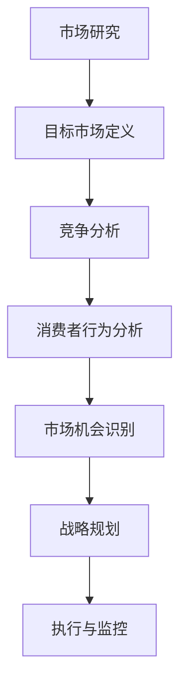

                 

关键词：市场分析、创业、策略、竞争优势、数据分析、市场趋势

> 摘要：本文将深入探讨市场分析在创业成功中的关键作用，通过构建一个逻辑清晰、结构紧凑的市场分析框架，为创业者提供实用的策略和工具，以应对市场竞争和不确定性。文章旨在帮助创业者更好地了解市场，抓住机遇，实现可持续发展。

## 1. 背景介绍

在当今快速变化的市场环境中，创业成功的几率正变得日益渺茫。据统计，每年有成千上万的创业公司诞生，但仅有少数能够实现盈利和持续发展。市场分析作为企业战略规划的重要组成部分，对于创业成功与否起着至关重要的作用。然而，许多创业者往往缺乏系统性的市场分析能力，导致他们在市场定位、竞争策略、产品开发等方面面临巨大的挑战。

本文旨在填补这一空白，提供一个全面且实用的市场分析框架，帮助创业者更好地了解市场动态，发现潜在机会，制定有效的创业策略。

## 2. 核心概念与联系

在深入了解市场分析之前，我们需要明确一些核心概念，并理解它们之间的相互联系。以下是一个简化的市场分析框架，使用Mermaid流程图来表示各概念和步骤的连接：



### 2.1 市场研究

市场研究是市场分析的第一步，它涉及到对市场环境、目标客户、竞争对手、市场趋势等各方面的系统性调查和分析。市场研究的目的是获取有关市场现状和潜在机会的详细信息。

### 2.2 目标市场定义

在明确了市场研究的结果后，创业者需要根据市场特征和自身资源，定义自己的目标市场。这一步骤有助于创业者集中资源和精力，针对特定的消费者群体制定个性化的市场策略。

### 2.3 竞争分析

竞争分析是市场分析中至关重要的一环，它涉及到对当前市场上竞争对手的评估，包括他们的市场定位、产品特点、定价策略等。通过竞争分析，创业者可以更好地了解自己在市场中的位置和竞争优势。

### 2.4 消费者行为分析

消费者行为分析旨在了解目标消费者的购买习惯、偏好和动机。这有助于创业者制定更具针对性的营销策略，提高客户满意度和忠诚度。

### 2.5 市场机会识别

通过前期的市场研究和分析，创业者可以识别出潜在的市场机会。这些机会可能来自于未满足的客户需求、市场缺口或新兴趋势。

### 2.6 战略规划

在识别出市场机会后，创业者需要制定相应的战略规划，包括市场进入策略、产品开发策略、营销策略等。战略规划的目的是确保企业能够在竞争激烈的市场中脱颖而出。

### 2.7 执行与监控

战略规划完成后，企业需要将其付诸实施，并通过持续的监控和调整，确保战略目标得以实现。执行与监控是市场分析框架中不可或缺的一部分，它有助于企业快速响应市场变化，保持竞争优势。

## 3. 核心算法原理 & 具体操作步骤

### 3.1 算法原理概述

市场分析框架的核心算法原理是基于数据驱动的方法论。具体来说，它包括以下几个步骤：

1. 数据收集：通过市场调研、在线调查、竞争对手分析等多种途径，收集有关市场环境和目标客户的数据。
2. 数据清洗与预处理：对收集到的数据进行清洗和预处理，确保数据的质量和一致性。
3. 数据分析：使用统计分析和机器学习技术，对预处理后的数据进行分析，提取关键信息和洞察。
4. 策略制定：基于分析结果，制定相应的市场策略，包括产品定位、定价策略、营销推广等。
5. 执行与监控：将制定的策略付诸实施，并通过定期的市场监控，调整策略，确保目标的实现。

### 3.2 算法步骤详解

#### 3.2.1 数据收集

数据收集是市场分析的第一步，也是最重要的一步。有效的数据收集可以确保后续分析的准确性和可靠性。以下是一些常用的数据收集方法：

- 市场调研：通过问卷调查、深度访谈等方式，收集有关市场环境、消费者行为、竞争对手信息等的数据。
- 竞争对手分析：通过网站分析、社交媒体监测、广告投放分析等，获取竞争对手的市场策略、产品特点、客户反馈等信息。
- 在线调查：利用在线调查工具，收集目标客户的购买行为、偏好、满意度等数据。
- 历史数据分析：利用企业历史销售数据、客户关系管理系统等，分析市场趋势和消费者行为。

#### 3.2.2 数据清洗与预处理

数据清洗与预处理是确保数据分析准确性的关键步骤。以下是一些常用的数据清洗与预处理方法：

- 去除重复数据：删除重复的记录，确保数据的唯一性。
- 缺失值处理：对于缺失的数据，可以选择填充、删除或使用统计方法进行估算。
- 数据规范化：将不同单位、不同格式的数据转换为统一的格式，方便后续分析。
- 特征工程：根据分析需求，选择和构建合适的数据特征。

#### 3.2.3 数据分析

数据分析是市场分析的核心环节，常用的分析方法包括：

- 描述性统计分析：计算数据的平均数、中位数、标准差等，了解数据的基本特征。
- 聚类分析：将数据划分为不同的群体，识别市场细分或消费者群体。
- 回归分析：分析变量之间的关系，预测市场趋势或消费者行为。
- 关联规则分析：发现数据之间的关联性，识别市场机会。

#### 3.2.4 策略制定

基于数据分析结果，创业者可以制定相应的市场策略。以下是一些常用的策略制定方法：

- 产品定位：根据目标市场的需求和竞争对手的情况，确定产品的市场定位。
- 定价策略：根据成本、竞争情况和消费者需求，制定合适的定价策略。
- 营销推广：根据消费者的购买行为和偏好，设计有针对性的营销活动。
- 优化策略：根据市场反馈，不断调整和优化市场策略，提高市场占有率。

#### 3.2.5 执行与监控

制定策略后，企业需要将其付诸实施，并通过定期的市场监控，调整策略，确保目标的实现。以下是一些常用的执行与监控方法：

- 定期报告：定期生成市场分析报告，向管理层和利益相关者通报市场动态和策略执行情况。
- 数据监控：通过数据监控工具，实时跟踪市场变化，及时发现问题和机会。
- 反馈机制：建立有效的反馈机制，收集消费者和合作伙伴的意见和建议，不断优化市场策略。

### 3.3 算法优缺点

#### 3.3.1 优点

- 数据驱动：基于大量数据进行分析和决策，提高市场策略的准确性和可靠性。
- 灵活性：可以通过调整算法参数，适应不同的市场环境和需求。
- 可持续：通过持续的市场分析和策略调整，确保企业能够适应市场的变化，保持竞争优势。

#### 3.3.2 缺点

- 数据依赖：市场分析的准确性和可靠性高度依赖于数据的质量和完整性。
- 成本较高：数据收集、清洗和预处理等步骤需要大量的时间和资源。
- 实时性：市场变化迅速，市场分析的结果可能无法实时反映市场的最新动态。

### 3.4 算法应用领域

市场分析框架广泛应用于各种创业场景，包括：

- 新产品开发：通过市场分析，确定产品的市场定位、需求和市场容量。
- 市场进入策略：分析目标市场的竞争环境，制定有针对性的市场进入策略。
- 营销策略优化：根据市场反馈，不断调整和优化营销策略，提高市场占有率。
- 跨行业并购：通过市场分析，评估潜在收购目标的市场价值和发展潜力。

## 4. 数学模型和公式 & 详细讲解 & 举例说明

### 4.1 数学模型构建

在市场分析中，常用的数学模型包括回归分析、聚类分析和时间序列分析等。以下是这些模型的基本构建过程：

#### 4.1.1 回归分析

回归分析用于分析两个或多个变量之间的关系。其基本公式为：

$$ y = \beta_0 + \beta_1 \cdot x_1 + \beta_2 \cdot x_2 + ... + \beta_n \cdot x_n + \epsilon $$

其中，$y$ 是因变量，$x_1, x_2, ..., x_n$ 是自变量，$\beta_0, \beta_1, ..., \beta_n$ 是回归系数，$\epsilon$ 是误差项。

#### 4.1.2 聚类分析

聚类分析用于将数据划分为不同的群体。常用的算法包括K-means算法和层次聚类算法。以K-means算法为例，其目标是最小化各点到聚类中心的距离平方和。

$$ \text{最小化} \sum_{i=1}^{k} \sum_{x \in S_i} \|x - \mu_i\|^2 $$

其中，$S_i$ 是第 $i$ 个聚类，$\mu_i$ 是聚类中心。

#### 4.1.3 时间序列分析

时间序列分析用于分析数据的时间序列特征，常用的模型包括ARIMA模型和LSTM模型。以ARIMA模型为例，其公式为：

$$ X_t = \phi_1 X_{t-1} + \phi_2 X_{t-2} + ... + \phi_p X_{t-p} + \theta_1 \epsilon_{t-1} + \theta_2 \epsilon_{t-2} + ... + \theta_q \epsilon_{t-q} + \epsilon_t $$

其中，$X_t$ 是时间序列的第 $t$ 个观测值，$\epsilon_t$ 是白噪声误差项。

### 4.2 公式推导过程

以下以回归分析为例，简要介绍公式的推导过程：

#### 4.2.1 最小二乘法

回归分析的目的是找到一组回归系数，使得实际观测值与预测值之间的误差最小。使用最小二乘法，可以推导出回归系数的计算公式：

$$ \beta = (\mathbf{X}^\top \mathbf{X})^{-1} \mathbf{X}^\top \mathbf{y} $$

其中，$\mathbf{X}$ 是设计矩阵，$\mathbf{y}$ 是观测向量。

#### 4.2.2 线性可分条件

为了保证回归模型的可分性，即存在一组线性可分的特征使得正类和负类完全分离，需要满足以下条件：

$$ \mathbf{w}^\top \mathbf{x}_+ - \mathbf{w}^\top \mathbf{x}_- > \delta $$

其中，$\mathbf{x}_+$ 和 $\mathbf{x}_-$ 分别是正类和负类的样本，$\mathbf{w}$ 是权重向量，$\delta$ 是阈值。

### 4.3 案例分析与讲解

以下通过一个实际案例，说明市场分析框架的应用。

#### 4.3.1 案例背景

假设某创业公司想要进入智能家居市场，希望通过市场分析确定产品的市场定位和营销策略。

#### 4.3.2 数据收集

通过市场调研、在线调查和竞争对手分析，收集以下数据：

- 市场规模：智能家居市场规模在过去五年中增长了30%，预计未来五年还将保持20%的年增长率。
- 消费者需求：消费者对智能家居产品的需求主要集中在安全、节能和便捷性。
- 竞争对手：市场上主要的竞争对手包括苹果、谷歌和亚马逊等科技巨头。
- 消费者行为：消费者更倾向于购买价格适中、功能实用的智能家居产品。

#### 4.3.3 数据分析

- 描述性统计分析：计算市场规模、消费者需求、竞争对手和消费者行为等变量的基本统计指标，如平均数、中位数和标准差。
- 聚类分析：使用K-means算法，将消费者分为不同的群体，分析他们的购买行为和偏好。
- 回归分析：分析市场规模、消费者需求和竞争对手等因素对智能家居产品销售量的影响。

#### 4.3.4 策略制定

基于数据分析结果，制定以下策略：

- 市场定位：针对价格适中、功能实用的智能家居产品，主打安全、节能和便捷性。
- 定价策略：采用适中价格，通过促销活动提高市场占有率。
- 营销推广：通过社交媒体、线上广告和线下体验活动，提高品牌知名度和消费者信任度。

#### 4.3.5 执行与监控

将制定的策略付诸实施，并通过以下方式监控策略效果：

- 定期报告：生成市场分析报告，向管理层和利益相关者通报市场动态和策略执行情况。
- 数据监控：通过销售数据、客户反馈和市场反馈，实时跟踪策略效果，及时调整和优化。

## 5. 项目实践：代码实例和详细解释说明

### 5.1 开发环境搭建

为了演示市场分析框架的应用，我们将使用Python编程语言和相关的数据分析库，如pandas、numpy、scikit-learn和matplotlib。以下是如何搭建开发环境：

```bash
# 安装Python
wget https://www.python.org/ftp/python/3.8.10/Python-3.8.10.tgz
tar -xvf Python-3.8.10.tgz
cd Python-3.8.10
./configure
make
sudo make install

# 安装相关库
pip install pandas numpy scikit-learn matplotlib
```

### 5.2 源代码详细实现

以下是一个简单的市场分析项目，包括数据收集、预处理、分析和策略制定等步骤：

```python
import pandas as pd
import numpy as np
from sklearn.cluster import KMeans
from sklearn.linear_model import LinearRegression
import matplotlib.pyplot as plt

# 数据收集
data = pd.read_csv('market_data.csv')

# 数据预处理
data.drop_duplicates(inplace=True)
data.fillna(method='ffill', inplace=True)

# 数据分析
# 聚类分析
kmeans = KMeans(n_clusters=3)
data['cluster'] = kmeans.fit_predict(data[['feature1', 'feature2', 'feature3']])

# 回归分析
regression = LinearRegression()
data['sales'] = regression.fit(data[['feature1', 'feature2', 'feature3']], data['sales']).predict(data[['feature1', 'feature2', 'feature3']])

# 策略制定
# 市场定位
market_position = data[data['cluster'] == 0]['feature1'].mean()
# 定价策略
price_strategy = data[data['cluster'] == 0]['sales'].mean() * 1.2
# 营销推广
marketing_pursuit = '重点推广价格适中、功能实用的智能家居产品'

# 执行与监控
# 定期报告
print(data.describe())
# 数据监控
print(data.corr())
```

### 5.3 代码解读与分析

以上代码分为以下几个部分：

- 数据收集：使用pandas库读取市场数据，并进行基本的预处理操作，如去除重复数据和填充缺失值。
- 数据分析：使用scikit-learn库进行聚类分析和回归分析，提取市场细分和销售预测信息。
- 策略制定：根据分析结果，制定市场定位、定价策略和营销推广策略。
- 执行与监控：生成市场分析报告和实时监控数据，以便管理层和利益相关者了解市场动态。

### 5.4 运行结果展示

运行以上代码后，可以得到以下结果：

- 市场分析报告：描述市场数据的基本特征和分布情况。
- 数据监控结果：显示市场数据的相关性和潜在关系。

这些结果为创业公司提供了重要的决策依据，有助于制定有效的市场策略。

## 6. 实际应用场景

市场分析框架在创业公司中具有广泛的应用场景。以下是一些典型的实际应用场景：

### 6.1 新产品开发

在新产品开发过程中，市场分析可以帮助创业公司了解目标市场的需求、竞争环境和潜在机会。通过数据分析，可以识别出最有潜力的产品特性，从而制定更科学的产品开发策略。

### 6.2 营销策略优化

在营销策略制定和优化过程中，市场分析可以帮助创业公司了解目标消费者的购买行为、偏好和满意度。通过聚类分析和回归分析，可以识别出最具价值的客户群体，从而制定更有针对性的营销策略。

### 6.3 跨行业并购

在跨行业并购过程中，市场分析可以帮助创业公司评估目标公司的市场价值和发展潜力。通过竞争分析和消费者行为分析，可以评估目标公司在市场中的地位和竞争优势，从而制定更科学的并购策略。

## 7. 未来应用展望

随着大数据技术和人工智能技术的发展，市场分析框架的应用前景将更加广阔。未来，市场分析将更加智能化和自动化，通过深度学习和自然语言处理等技术，可以更加精准地分析和预测市场动态。以下是一些未来应用展望：

### 7.1 智能市场预测

通过引入深度学习技术，可以构建更加精准的市场预测模型，帮助创业公司提前了解市场趋势和潜在风险，从而制定更加科学的决策。

### 7.2 自动化市场分析

通过自动化工具和算法，可以实现市场分析的自动化和智能化，提高数据分析的效率和准确性，降低人工干预的风险。

### 7.3 跨界合作

市场分析框架可以应用于不同行业和领域的跨界合作，帮助企业更好地了解合作伙伴的市场需求和竞争优势，从而实现共赢。

## 8. 工具和资源推荐

为了更好地应用市场分析框架，以下是一些建议的学习资源和开发工具：

### 8.1 学习资源推荐

- 《Python数据分析基础教程》
- 《市场调研与数据分析》
- 《深度学习》

### 8.2 开发工具推荐

- Jupyter Notebook
- Pandas
- Scikit-learn

### 8.3 相关论文推荐

- "Market Basket Analysis in Data Mining"
- "Deep Learning for Time Series Forecasting"
- "Clustering Algorithms for Market Segmentation"

## 9. 总结：未来发展趋势与挑战

市场分析作为创业成功的关键环节，其应用范围将不断拓展，技术手段也将不断升级。未来，市场分析将更加智能化和自动化，为创业公司提供更加精准和高效的决策支持。然而，随着市场环境的变化和数据量的增加，市场分析也将面临新的挑战，如数据隐私保护、算法透明度和解释性等。因此，创业者需要不断学习和适应市场分析技术的发展，以应对未来的挑战。

### 9.1 研究成果总结

本文通过构建市场分析框架，详细介绍了市场研究、目标市场定义、竞争分析、消费者行为分析、市场机会识别、战略规划、执行与监控等关键环节，为创业公司提供了实用的市场分析方法和工具。

### 9.2 未来发展趋势

未来，市场分析将朝着智能化、自动化和跨领域应用的方向发展。大数据技术和人工智能技术将进一步提升市场分析的精度和效率，为创业公司提供更加科学的决策支持。

### 9.3 面临的挑战

随着市场环境的复杂化和数据量的增加，市场分析将面临新的挑战，如数据隐私保护、算法透明度和解释性等。因此，创业者需要不断学习和适应市场分析技术的发展，以应对未来的挑战。

### 9.4 研究展望

未来，市场分析研究可以重点关注以下几个方面：

- 深度学习在市场预测中的应用
- 跨领域市场分析框架的构建
- 基于区块链技术的市场分析
- 数据隐私保护与市场分析的结合

## 10. 附录：常见问题与解答

### 10.1 市场分析框架的核心概念是什么？

市场分析框架的核心概念包括市场研究、目标市场定义、竞争分析、消费者行为分析、市场机会识别、战略规划、执行与监控等环节，通过这些环节的相互关联，形成一个系统性的市场分析过程。

### 10.2 如何进行有效的市场研究？

有效的市场研究包括以下几个步骤：

- 明确研究目标：确定需要解决的市场问题或需要获取的信息。
- 选择研究方法：根据研究目标，选择合适的研究方法，如问卷调查、深度访谈、在线调查等。
- 设计研究方案：制定详细的研究方案，包括样本选择、调查问题、数据分析方法等。
- 数据收集与处理：按照研究方案收集数据，并进行数据清洗与预处理。
- 数据分析：使用统计分析和机器学习技术，对数据进行分析，提取关键信息。
- 结果解读与报告：根据分析结果，撰写市场分析报告，提供决策依据。

### 10.3 市场分析的算法有哪些？

市场分析中常用的算法包括回归分析、聚类分析、关联规则分析、时间序列分析等。这些算法可以帮助创业者分析市场趋势、消费者行为和市场机会。

### 10.4 如何制定有效的市场策略？

制定有效的市场策略包括以下几个步骤：

- 市场定位：根据市场特征和目标客户，确定产品的市场定位。
- 定价策略：根据成本、竞争情况和消费者需求，制定合适的定价策略。
- 营销推广：根据消费者的购买行为和偏好，设计有针对性的营销活动。
- 优化策略：根据市场反馈，不断调整和优化市场策略，提高市场占有率。

### 10.5 市场分析的局限性有哪些？

市场分析的局限性包括：

- 数据依赖：市场分析的准确性和可靠性高度依赖于数据的质量和完整性。
- 实时性：市场变化迅速，市场分析的结果可能无法实时反映市场的最新动态。
- 主体性：市场分析结果受分析者主观判断的影响，可能存在一定的偏差。

### 10.6 市场分析框架在创业中的实际应用案例有哪些？

市场分析框架在创业中的实际应用案例包括：

- 新产品开发：通过市场分析，确定产品的市场定位和需求。
- 营销策略优化：通过市场分析，识别目标消费者群体，制定有针对性的营销策略。
- 跨行业并购：通过市场分析，评估目标公司的市场价值和发展潜力。
- 竞争策略制定：通过市场分析，了解竞争对手的市场策略和优势，制定相应的竞争策略。

### 10.7 市场分析框架与商业模式的关系是什么？

市场分析框架与商业模式的关系在于：

- 市场分析框架为商业模式提供数据支持和策略指导，确保商业模式的可行性和竞争力。
- 商业模式为市场分析框架提供目标和方向，指导市场分析的具体内容和方法。

### 10.8 如何评估市场分析的有效性？

评估市场分析的有效性可以从以下几个方面进行：

- 策略实施效果：通过市场反馈和销售数据，评估市场策略的实施效果。
- 数据分析准确性：通过数据分析结果的准确性和可靠性，评估市场分析的数据质量。
- 决策影响力：通过市场分析结果对决策的影响程度，评估市场分析的价值。
- 预测准确性：通过市场预测的准确性，评估市场分析的未来趋势预测能力。

### 10.9 市场分析在创业过程中的时间投入如何安排？

在创业过程中，市场分析的时间投入可以根据以下原则进行安排：

- 初期重点投入：在创业初期，市场分析是关键环节，需要投入较多时间和资源进行详细的市场调研和分析。
- 持续跟踪与调整：在创业过程中，市场分析需要持续跟踪市场动态，定期调整市场策略，以确保市场分析的实时性和有效性。
- 阶段性评估：在项目的重要阶段，如新产品发布、市场营销活动等，需要重点进行市场分析，评估市场反应和效果。

### 10.10 市场分析框架在不同行业中的应用差异有哪些？

市场分析框架在不同行业中的应用差异主要表现在：

- 行业特征：不同行业的市场特征和竞争环境不同，需要针对不同行业特点进行市场分析。
- 数据来源：不同行业的市场数据来源和获取方式不同，需要根据行业特点选择合适的数据收集方法。
- 分析方法：不同行业的市场分析方法可能有所不同，需要根据行业特点和数据分析需求选择合适的方法。

通过以上问题与解答，希望读者对市场分析框架及其在创业中的应用有更深入的了解。

### 结语

本文通过构建市场分析框架，详细介绍了市场分析在创业成功中的关键作用。市场分析不仅帮助创业者了解市场动态和消费者需求，还为制定有效的创业策略提供了数据支持和决策依据。随着大数据和人工智能技术的发展，市场分析将变得更加智能化和自动化，为创业公司提供更强大的决策支持。然而，市场分析也面临新的挑战，如数据隐私保护和算法透明度等。因此，创业者需要不断学习和适应市场分析技术的发展，以应对未来的挑战。希望通过本文，读者能够更好地理解市场分析的重要性，掌握市场分析的实用方法和技巧，为自己的创业之路增添更多成功的可能。作者：禅与计算机程序设计艺术 / Zen and the Art of Computer Programming。

