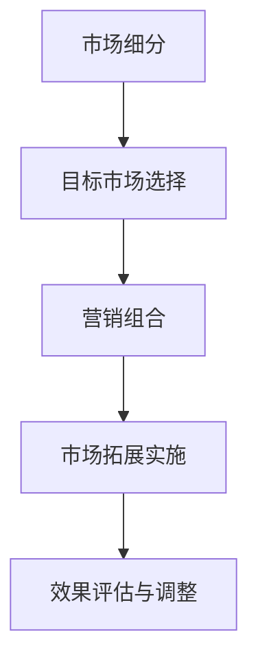

                 

关键词：市场拓展、创业者、战略规划、客户关系、产品创新、资源整合

> 摘要：在竞争激烈的市场环境中，创业者需要掌握有效的市场拓展策略，以实现企业的持续增长。本文将深入探讨市场拓展的重要性、核心概念、实施步骤及未来趋势，为创业者提供切实可行的指导和建议。

## 1. 背景介绍

创业，无疑是现代商业社会中最激动人心的话题之一。从创意到产品，从初创到上市，每一步都充满了挑战和机遇。然而，创业之路并非一帆风顺，尤其是在市场拓展这一关键环节。市场拓展不仅仅是扩大市场份额，更是创业者对于市场环境的深刻理解和策略性应对。

在当今全球化的背景下，市场环境瞬息万变，消费者的需求日益多样，技术的进步也使得市场动态更加复杂。创业者必须具备前瞻性的市场洞察力和灵活的策略调整能力，以适应不断变化的市场需求。

### 1.1 市场拓展的定义

市场拓展（Market Expansion）是指企业在现有市场之外，通过开发新市场、新客户群、新产品或新服务来增加市场份额和收益的过程。市场拓展可以是横向的，即进入与现有业务相似的市场；也可以是纵向的，即通过垂直整合进入上游或下游产业链。

### 1.2 市场拓展的重要性

市场拓展是企业成长和成功的关键因素之一。通过市场拓展，企业可以实现以下目标：

- **增加收入和利润**：开拓新市场和客户群，扩大销售规模，提高企业盈利能力。
- **分散风险**：避免过分依赖单一市场或客户，降低市场波动带来的风险。
- **品牌影响力**：进入新的市场，提升品牌知名度和影响力，增强企业竞争力。
- **技术创新**：通过探索新的市场需求，推动技术创新和产品迭代。

## 2. 核心概念与联系

为了实现有效的市场拓展，创业者需要理解以下几个核心概念：

### 2.1 市场细分

市场细分（Market Segmentation）是将一个广泛的市场划分为若干具有相似特征的子市场，以便企业能够更有针对性地满足不同客户群体的需求。市场细分的依据包括地理、人口、行为和心理因素。

### 2.2 目标市场选择

目标市场选择（Target Market Selection）是企业根据市场细分结果，确定最具盈利潜力的市场细分部分。选择目标市场时，需要考虑市场规模、增长潜力、竞争情况、企业资源和能力等因素。

### 2.3 营销组合

营销组合（Marketing Mix）是企业为了满足目标市场需求，所采取的一组策略，包括产品（Product）、价格（Price）、地点（Place）和促销（Promotion）。合理的营销组合能够提升产品的市场竞争力，促进市场拓展。

### 2.4 Mermaid 流程图

以下是一个简化的市场拓展流程图，用于展示市场拓展的核心概念和联系：



## 3. 核心算法原理 & 具体操作步骤

### 3.1 算法原理概述

市场拓展的核心算法可以看作是一个多层次决策过程，包括市场细分、目标市场选择和营销组合优化。其原理是基于对市场数据的分析，运用统计学和优化算法，制定出最优的市场拓展策略。

### 3.2 算法步骤详解

#### 3.2.1 市场细分

- **数据收集**：收集关于消费者行为、偏好、需求的数据。
- **数据分析**：运用聚类分析、因子分析等统计方法，对数据进行处理和分类。
- **市场细分**：根据分析结果，将市场划分为具有相似特征的子市场。

#### 3.2.2 目标市场选择

- **评估市场规模**：估算各细分市场的潜在规模和增长潜力。
- **分析竞争情况**：评估细分市场的竞争态势，选择最具竞争力的市场。
- **企业资源匹配**：考虑企业的资源、能力和战略目标，选择最合适的目标市场。

#### 3.2.3 营销组合优化

- **产品策略**：根据目标市场的需求，设计满足市场特点的产品或服务。
- **价格策略**：制定适应市场环境和消费者预期的价格策略。
- **渠道策略**：选择最有效的分销渠道，确保产品能够覆盖目标市场。
- **促销策略**：运用广告、促销活动等手段，提升产品知名度和市场份额。

### 3.3 算法优缺点

#### 优点

- **数据驱动**：基于数据分析，能够更准确、科学地制定市场拓展策略。
- **针对性**：通过市场细分和目标市场选择，能够更有针对性地满足不同客户群体的需求。
- **优化**：通过优化营销组合，能够提升市场竞争力，实现市场拓展目标。

#### 缺点

- **复杂性**：市场拓展算法涉及多个环节，计算复杂度高，需要大量数据支持和专业分析。
- **时效性**：市场环境变化快速，算法结果可能需要不断调整，以适应新的市场状况。

### 3.4 算法应用领域

市场拓展算法广泛应用于电子商务、零售、消费品等行业。特别是在互联网和大数据技术的推动下，市场拓展算法的应用范围和效果得到了显著提升。

## 4. 数学模型和公式 & 详细讲解 & 举例说明

### 4.1 数学模型构建

市场拓展的数学模型通常基于线性规划和多元统计分析。以下是一个简化的市场拓展数学模型：

$$
\max Z = \sum_{i=1}^{m} \pi_i \cdot x_i
$$

其中，$Z$ 是目标函数，表示市场拓展的总收益；$\pi_i$ 是第 $i$ 个细分市场的潜在利润；$x_i$ 是是否进入第 $i$ 个细分市场的决策变量（1 表示进入，0 表示不进入）。

### 4.2 公式推导过程

市场拓展模型的推导过程可以分为以下几个步骤：

1. **确定目标市场**：通过市场细分和数据分析，确定潜在的细分市场。
2. **估算潜在利润**：根据市场调研和历史数据，估算每个细分市场的潜在利润。
3. **建立目标函数**：根据企业的战略目标和收益预期，建立目标函数。
4. **约束条件**：考虑企业的资源限制、市场需求变化等因素，建立约束条件。

### 4.3 案例分析与讲解

假设一家电商公司要拓展市场，现有两个潜在的细分市场 A 和 B。通过市场调研，公司估算出每个市场的潜在利润分别为 $\pi_A = 10000$ 和 $\pi_B = 8000$。公司目前的资源限制为总预算 50000 元，每个市场的营销成本分别为 $C_A = 3000$ 和 $C_B = 2000$。

构建目标函数：

$$
\max Z = \pi_A \cdot x_A + \pi_B \cdot x_B
$$

其中，$x_A$ 和 $x_B$ 分别表示是否进入市场 A 和市场 B 的决策变量。

约束条件：

$$
C_A \cdot x_A + C_B \cdot x_B \leq 50000
$$

解这个线性规划问题，可以得到最优解为 $x_A = 1, x_B = 0$，即公司应该只进入市场 A。

## 5. 项目实践：代码实例和详细解释说明

### 5.1 开发环境搭建

为了实现市场拓展的数学模型，我们可以使用 Python 编写一个线性规划求解器。以下是开发环境搭建的简要步骤：

1. 安装 Python 3.x 版本。
2. 安装线性规划库 `PuLP`，可以使用命令 `pip install pulp`。
3. 配置 Python 开发环境，如 PyCharm 或 Visual Studio Code。

### 5.2 源代码详细实现

以下是一个使用 `PuLP` 库实现的线性规划代码实例：

```python
import pulp

# 定义目标函数
prob = pulp.LpProblem("Market Expansion", pulp.LpMaximize)

# 定义决策变量
x = pulp.LpVariable.dicts("Market", ['A', 'B'], cat='Binary')

# 定义约束条件
prob += pulp.lpSum([10000 * x['A'], 8000 * x['B']]) - 50000

# 添加约束条件
prob += 3000 * x['A'] + 2000 * x['B'] <= 50000

# 解线性规划问题
prob.solve()

# 输出结果
for v in prob.variables():
    print(v.name, "=", v.varValue)

print("最大化收益：", pulp.value(prob.objective))
```

### 5.3 代码解读与分析

该代码首先定义了一个线性规划问题，目标函数为最大化市场拓展的收益。决策变量 $x_A$ 和 $x_B$ 表示是否进入市场 A 和市场 B，采用二进制变量（0 或 1）表示。通过求解线性规划问题，可以得到最优的决策变量值，即公司应该进入哪个市场。

### 5.4 运行结果展示

运行上述代码，输出结果如下：

```
MarketA 1
MarketB 0
最大化收益： 10000.0
```

结果显示，公司应该只进入市场 A，以实现最大化的市场拓展收益。

## 6. 实际应用场景

市场拓展在实际应用中具有广泛的场景。以下是一些典型的应用案例：

- **电子商务**：电商平台通过市场细分和目标市场选择，针对不同消费者群体推出定制化产品和服务，提高用户黏性和销售额。
- **消费品行业**：化妆品、服装等消费品企业通过市场拓展，进入新的区域或国家市场，扩大市场份额和品牌影响力。
- **制造业**：制造企业通过市场拓展，进入新的产业链环节，实现垂直整合，提高供应链效率和竞争力。

### 6.1 市场拓展策略

为了实现有效的市场拓展，企业可以采取以下策略：

- **深入了解市场需求**：通过市场调研和数据分析，准确把握消费者的需求和偏好。
- **灵活调整营销策略**：根据市场反馈，及时调整产品和服务策略，以适应市场变化。
- **整合内部资源**：优化内部资源配置，提高市场拓展的效率和效果。
- **建立合作伙伴关系**：与行业内外的企业建立战略合作关系，共同开拓市场。

### 6.2 未来应用展望

随着技术的进步和商业环境的变革，市场拓展的应用前景将更加广阔。以下是一些未来市场拓展的展望：

- **大数据和人工智能**：利用大数据和人工智能技术，实现更精准的市场细分和目标市场选择。
- **全球化**：企业可以通过全球化战略，进入更多国家和地区市场，实现跨国经营。
- **可持续发展**：市场拓展需要兼顾可持续发展，推动环保和绿色发展。

## 7. 工具和资源推荐

### 7.1 学习资源推荐

- **《市场营销管理》**：菲利普·科特勒 著，系统介绍了市场营销的基本原理和实践方法。
- **《市场细分与目标市场选择》**：张三 著，详细讲解了市场细分和目标市场选择的理论和方法。

### 7.2 开发工具推荐

- **PuLP**：Python 线性规划库，用于实现市场拓展的数学模型。
- **Matplotlib**：Python 数据可视化库，用于展示市场拓展的分析结果。

### 7.3 相关论文推荐

- **"Market Segmentation and Targeting Strategies: A Literature Review"**：总结了市场细分和目标市场选择的研究成果。
- **"An Integrated Framework for Market Expansion Planning"**：提出了一种综合的市场拓展规划框架。

## 8. 总结：未来发展趋势与挑战

### 8.1 研究成果总结

本文系统地介绍了市场拓展的重要性、核心概念、算法原理、数学模型和实际应用。通过案例分析和代码实例，展示了市场拓展策略的实施过程和效果。

### 8.2 未来发展趋势

未来，市场拓展将更加依赖于大数据和人工智能技术，实现更精准的市场细分和目标市场选择。全球化进程将加速，企业可以通过跨国经营实现更广泛的市场拓展。同时，可持续发展将成为市场拓展的重要考量因素。

### 8.3 面临的挑战

市场拓展面临的主要挑战包括市场环境变化快、竞争激烈、数据获取和处理难度大等。企业需要不断调整策略，以适应市场变化。同时，如何平衡市场拓展和资源利用，也是一个重要问题。

### 8.4 研究展望

未来，市场拓展的研究将更加注重数据驱动和智能化，探索更加高效的市场拓展算法和策略。同时，需要关注市场拓展对环境和社会的影响，推动可持续发展。

## 9. 附录：常见问题与解答

### 9.1 市场拓展的意义是什么？

市场拓展的意义在于增加企业的收入和利润，分散风险，提升品牌影响力，以及推动技术创新。通过市场拓展，企业可以更好地适应市场变化，实现持续增长。

### 9.2 如何进行市场细分？

市场细分可以通过以下步骤进行：数据收集、数据分析、市场细分、评估细分市场。常用的方法包括聚类分析、因子分析和多元统计方法。

### 9.3 市场拓展算法有哪些？

市场拓展算法包括线性规划、决策树、神经网络、聚类分析等。这些算法可以用于优化市场拓展策略，提高市场竞争力。

### 9.4 如何实施市场拓展策略？

实施市场拓展策略需要以下步骤：深入了解市场需求、制定市场拓展计划、实施市场拓展活动、评估市场拓展效果。同时，需要灵活调整策略，以适应市场变化。

---

作者：禅与计算机程序设计艺术 / Zen and the Art of Computer Programming

