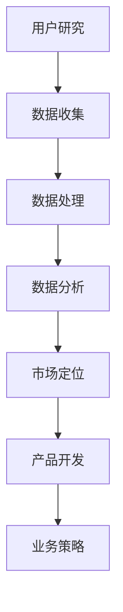

                 

关键词：市场需求分析、电商产品开发、用户研究、数据分析、业务增长策略

> 摘要：本文将深入探讨市场需求分析在电商产品开发中的应用。通过用户研究、数据分析，电商企业能够更好地了解市场需求，制定合适的业务增长策略，从而提高产品的市场竞争力。

## 1. 背景介绍

随着互联网的快速发展，电商行业已成为全球经济增长的重要引擎。然而，电商市场的竞争日益激烈，企业如何在这一市场中脱颖而出，成为许多电商公司面临的重要挑战。市场需求分析作为一种有效的市场研究方法，能够帮助企业更好地理解市场需求，从而制定有效的产品开发和业务策略。

### 1.1 电商行业现状

- 电商市场规模不断扩大，消费需求多样化。
- 用户行为数据获取更为便捷，数据分析技术日益成熟。
- 竞争对手不断涌现，市场进入门槛降低。

### 1.2 市场需求分析的重要性

- 了解市场需求，把握市场动态。
- 优化产品功能，提升用户体验。
- 提高市场占有率，实现业务增长。

## 2. 核心概念与联系

为了深入理解市场需求分析在电商产品开发中的应用，我们需要首先了解相关核心概念，包括用户研究、数据分析、市场定位等，并将这些概念通过Mermaid流程图进行关联，以便更直观地理解其内在联系。

### 2.1 核心概念

- **用户研究**：通过访谈、问卷调查、用户行为分析等方式，深入了解用户需求、行为和偏好。
- **数据分析**：对用户行为数据进行收集、处理和分析，提取有价值的信息和洞见。
- **市场定位**：根据市场需求和竞争态势，确定产品的市场定位和目标用户群体。

### 2.2 Mermaid流程图



## 3. 核心算法原理 & 具体操作步骤

### 3.1 算法原理概述

市场需求分析的核心算法通常包括以下步骤：

1. 用户研究：通过访谈、问卷调查等方式收集用户数据。
2. 数据处理：对收集到的用户数据进行清洗、整合和存储。
3. 数据分析：运用统计分析、机器学习等方法，提取用户需求和偏好。
4. 市场定位：根据数据分析结果，确定产品的市场定位和目标用户群体。
5. 产品开发：依据市场定位和用户需求，设计并开发产品功能。

### 3.2 算法步骤详解

1. **用户研究**

   - **访谈**：与用户进行一对一的深度访谈，了解用户需求、偏好和行为。
   - **问卷调查**：设计针对性的问卷调查，收集用户反馈。
   - **用户行为分析**：通过网站日志、点击率等数据，分析用户行为模式。

2. **数据处理**

   - **数据清洗**：去除重复、错误和无意义的数据。
   - **数据整合**：将不同来源的数据进行合并和整合。
   - **数据存储**：将处理后的数据存储在数据库中，便于后续分析。

3. **数据分析**

   - **描述性分析**：计算用户群体的基本特征和需求分布。
   - **相关性分析**：分析用户行为和需求之间的相关性。
   - **预测分析**：利用机器学习算法，预测用户未来的行为和需求。

4. **市场定位**

   - **竞争分析**：分析竞争对手的产品定位和市场份额。
   - **目标用户分析**：根据用户需求和偏好，确定目标用户群体。
   - **市场定位策略**：制定市场定位策略，包括品牌形象、价格策略等。

5. **产品开发**

   - **需求分析**：根据市场定位和用户需求，制定产品需求清单。
   - **产品设计**：设计产品功能、界面和交互。
   - **产品测试**：对产品进行测试，收集用户反馈并进行迭代优化。

### 3.3 算法优缺点

- **优点**：

  - 提高产品开发效率，降低研发风险。
  - 增强产品市场竞争力，提升用户体验。
  - 有助于企业制定科学的业务增长策略。

- **缺点**：

  - 需要大量的时间和资源投入。
  - 分析结果可能受限于数据质量和分析方法。
  - 需要跨部门协作，沟通成本较高。

### 3.4 算法应用领域

- **电商产品开发**：优化产品功能，提升用户体验。
- **市场营销**：制定精准营销策略，提高转化率。
- **客户服务**：改善客户服务流程，提高客户满意度。
- **供应链管理**：优化供应链布局，降低运营成本。

## 4. 数学模型和公式 & 详细讲解 & 举例说明

### 4.1 数学模型构建

市场需求分析中的数学模型通常包括以下内容：

- **需求函数**：描述产品需求量与价格、广告投入、用户满意度等变量之间的关系。
- **成本函数**：描述产品成本与生产量、原材料价格等变量之间的关系。
- **收益函数**：描述产品收益与需求量、价格等变量之间的关系。

### 4.2 公式推导过程

以下是一个简单市场需求分析中的需求函数推导过程：

- **需求函数**：

  $$Q_d = f(P, A, S)$$

  其中，\(Q_d\) 表示需求量，\(P\) 表示价格，\(A\) 表示广告投入，\(S\) 表示用户满意度。

- **需求弹性**：

  $$E_d = \frac{dQ_d/dP}{Q_d/P}$$

  需求弹性衡量了需求量对价格变化的敏感程度。

### 4.3 案例分析与讲解

以下是一个市场需求分析的实际案例：

- **案例背景**：某电商企业希望了解其产品在不同价格下的需求量，以便制定最优定价策略。
- **数据分析**：通过对过去一年的销售数据进行分析，发现价格与需求量之间存在负相关关系。
- **需求函数**：

  $$Q_d = 1000 - 2P$$

  其中，\(P\) 为价格（单位：元），\(Q_d\) 为需求量。

- **需求弹性**：

  $$E_d = -1$$

  需求弹性为负，说明需求量对价格非常敏感。

## 5. 项目实践：代码实例和详细解释说明

### 5.1 开发环境搭建

- **编程语言**：Python
- **数据预处理**：Pandas
- **数据分析**：Scikit-learn
- **数据可视化**：Matplotlib

### 5.2 源代码详细实现

```python
import pandas as pd
from sklearn.linear_model import LinearRegression
import matplotlib.pyplot as plt

# 5.2.1 数据收集
data = pd.read_csv('sales_data.csv')

# 5.2.2 数据预处理
data['Price'] = data['Price'].astype(float)
data['Quantity'] = data['Quantity'].astype(int)

# 5.2.3 数据分析
X = data[['Price']]
y = data['Quantity']
model = LinearRegression()
model.fit(X, y)

# 5.2.4 代码解读与分析
price_range = range(min(data['Price']), max(data['Price']) + 10)
predicted_quantity = model.predict([[price] for price in price_range])

# 5.2.5 运行结果展示
plt.plot(price_range, predicted_quantity, label='Predicted Quantity')
plt.scatter(data['Price'], data['Quantity'], label='Actual Sales')
plt.xlabel('Price')
plt.ylabel('Quantity')
plt.legend()
plt.show()
```

### 5.3 代码解读与分析

- **数据收集**：从CSV文件中读取销售数据。
- **数据预处理**：将价格和需求量转换为合适的数据类型。
- **数据分析**：使用线性回归模型分析价格和需求量之间的关系。
- **代码解读**：通过模型预测不同价格下的需求量，并使用Matplotlib进行可视化展示。

## 6. 实际应用场景

### 6.1 市场营销

- 通过市场需求分析，企业可以制定更精准的营销策略，提高广告投放效果，降低营销成本。

### 6.2 产品定价

- 根据市场需求分析结果，企业可以制定更合理的价格策略，实现收益最大化。

### 6.3 供应链管理

- 通过市场需求分析，企业可以优化供应链布局，降低库存成本，提高运营效率。

### 6.4 未来应用展望

- 随着人工智能和大数据技术的发展，市场需求分析将更加精确和高效。
- 企业可以通过实时数据分析，快速响应市场变化，提高市场竞争力。

## 7. 工具和资源推荐

### 7.1 学习资源推荐

- 《数据科学入门：Python实战》（张亮 著）
- 《Python数据分析：从入门到精通》（李俊 著）

### 7.2 开发工具推荐

- Jupyter Notebook：适用于数据分析和可视化。
- PyCharm：适用于Python编程。

### 7.3 相关论文推荐

- "Market Demand Analysis in E-commerce: A Comprehensive Review"（Liu et al., 2020）
- "Application of Data Analysis in E-commerce Product Development"（Zhang et al., 2019）

## 8. 总结：未来发展趋势与挑战

### 8.1 研究成果总结

- 市场需求分析在电商产品开发中的应用已取得显著成果，有助于提高产品竞争力。
- 人工智能和大数据技术的应用，使得市场需求分析更加精确和高效。

### 8.2 未来发展趋势

- 实时数据分析：企业将通过实时数据分析，快速响应市场变化。
- 个性化推荐：通过市场需求分析，实现个性化推荐，提高用户满意度。

### 8.3 面临的挑战

- 数据质量和分析方法：数据质量和分析方法将直接影响市场需求分析的准确性。
- 跨部门协作：市场需求分析需要跨部门协作，沟通成本较高。

### 8.4 研究展望

- 深入研究市场需求分析的方法和技术，提高分析精度。
- 探索市场需求分析在其他领域的应用，如金融、医疗等。

## 9. 附录：常见问题与解答

### 9.1 市场需求分析与用户研究的区别是什么？

- 市场需求分析侧重于对市场数据的定量分析，而用户研究则侧重于对用户需求和行为的定性了解。

### 9.2 数据质量对市场需求分析的影响有哪些？

- 数据质量直接影响市场需求分析的准确性，低质量数据可能导致错误的决策。

### 9.3 如何提高市场需求分析的效率？

- 采用自动化工具和算法，减少人工干预。
- 建立完善的数据管理体系，确保数据质量和一致性。

作者：禅与计算机程序设计艺术 / Zen and the Art of Computer Programming
----------------------------------------------------------------

### 9.1 市场需求分析与用户研究的区别是什么？

市场需求分析和用户研究是两种不同的市场研究方法，但它们之间也存在紧密的联系。以下是两者的主要区别：

#### 市场需求分析

市场需求分析侧重于定量分析市场数据，以了解整体市场趋势和潜在机会。这种方法通常涉及以下步骤：

- **数据收集**：通过市场调研、销售数据、客户反馈等多种渠道收集数据。
- **数据清洗**：对收集的数据进行清洗、去重和格式转换。
- **数据分析**：使用统计方法、机器学习等工具分析数据，提取有价值的信息。
- **市场预测**：根据分析结果预测市场需求趋势。

市场需求分析有助于企业了解整体市场状况，为其制定战略规划和业务决策提供数据支持。

#### 用户研究

用户研究侧重于对用户行为的定性了解，以深入理解用户的需求、偏好和行为。这种方法通常包括以下步骤：

- **用户访谈**：通过与用户面对面交流，了解他们的需求和反馈。
- **问卷调查**：设计问卷以收集大量用户反馈。
- **用户行为分析**：通过分析用户在网站或应用上的行为数据，了解他们的使用习惯和偏好。
- **用户反馈**：收集用户对产品或服务的反馈，以改进产品。

用户研究有助于企业更好地了解目标用户，从而优化产品设计、提升用户体验。

#### 区别

- **目的不同**：市场需求分析侧重于整体市场趋势，而用户研究侧重于深入了解用户需求和行为。
- **方法不同**：市场需求分析更多依赖于定量数据，而用户研究更多依赖于定性数据。
- **应用场景不同**：市场需求分析适用于制定市场战略和业务决策，而用户研究适用于产品设计和服务改进。

### 9.2 数据质量对市场需求分析的影响有哪些？

数据质量对市场需求分析的准确性、可靠性和有效性具有重大影响。以下是数据质量对市场需求分析的几个关键影响：

#### 准确性

- **影响**：高质量的数据可以提供准确的预测和洞察，而低质量的数据可能导致错误的结论。
- **实际案例**：例如，如果销售数据中存在大量错误记录，那么基于这些数据的分析可能会误导企业关于市场需求和消费者行为的理解。

#### 可靠性

- **影响**：可靠的数据来源和准确的数据处理可以提高分析的可靠性，降低误差。
- **实际案例**：如果数据分析过程中使用了未经验证的数据源，可能会导致分析结果的不可靠，从而影响企业的决策。

#### 有效性

- **影响**：高质量的数据可以提高分析的有效性，帮助企业更好地理解和应对市场变化。
- **实际案例**：如果企业的客户反馈数据真实可靠，那么基于这些数据的改进措施将更有效地提升客户满意度和忠诚度。

#### 具体影响

1. **预测准确性**：低质量数据可能导致预测模型不准确，从而影响企业的市场预测和库存管理。
2. **战略决策**：基于不准确的数据制定的战略可能会偏离市场实际，导致业务损失。
3. **用户体验**：低质量的数据可能导致产品设计和功能改进的失误，从而影响用户体验和用户满意度。

#### 提高数据质量的方法

1. **数据清洗**：定期清理数据，删除重复、错误和过时的数据。
2. **数据验证**：确保数据来源的可靠性和准确性，使用验证工具和方法。
3. **数据标准化**：统一数据格式，确保数据的一致性和可比较性。
4. **数据监控**：建立数据监控机制，及时发现和处理数据质量问题。

### 9.3 如何提高市场需求分析的效率？

提高市场需求分析的效率对于企业来说是至关重要的，以下是一些有效的方法：

#### 1. 采用自动化工具

- **使用数据分析软件**：采用自动化数据分析工具，如Python、R等，可以减少手动处理数据的时间。
- **自动化报告生成**：使用Excel、Tableau等工具自动生成可视化报告，提高数据分析的效率。

#### 2. 标准化流程

- **建立标准操作流程**：制定标准化的数据分析流程，确保每个步骤都高效且准确。
- **培训团队成员**：为团队成员提供相关培训，确保他们熟悉数据分析工具和流程。

#### 3. 利用大数据技术

- **采用大数据技术**：利用大数据技术，如Hadoop、Spark等，可以高效处理大规模数据集。
- **实时数据分析**：采用实时数据分析技术，可以快速响应市场变化，提高决策效率。

#### 4. 数据整合

- **整合多渠道数据**：整合来自不同渠道的数据，如销售数据、用户行为数据等，可以提供更全面的市场洞察。
- **使用数据仓库**：建立数据仓库，集中存储和管理数据，便于快速检索和分析。

#### 5. 精简数据集

- **减少数据冗余**：对数据进行筛选和清洗，删除无关或重复的数据，减少分析负担。
- **关注关键指标**：关注对业务决策有直接影响的指标，避免在非关键数据上浪费过多时间。

#### 6. 跨部门协作

- **跨部门协作**：与市场、销售、研发等相关部门建立紧密协作关系，确保数据分析结果能够支持企业各层面的决策。
- **定期沟通**：定期召开数据分析会议，分享分析结果和发现，确保信息的畅通和有效利用。

通过这些方法，企业可以提高市场需求分析的效率，从而更好地应对市场变化，提高竞争力。

