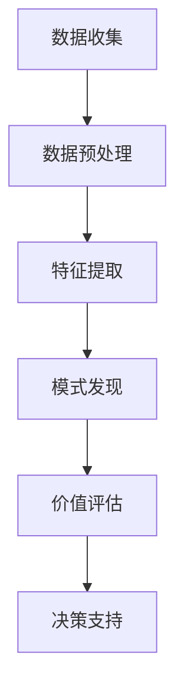

                 

关键词：平台经济，数据挖掘，潜在价值，数据分析，算法优化，数学模型，实际应用，未来展望

> 摘要：随着平台经济的快速发展，数据已成为企业竞争的核心资产。本文将探讨如何通过数据价值挖掘，发掘数据的潜在价值，从而为企业在激烈的市场竞争中提供有力支持。文章首先介绍了平台经济的背景和特点，然后分析了数据价值挖掘的核心概念和方法，并提供了具体的算法原理、数学模型和实际应用案例。最后，文章展望了数据价值挖掘的未来发展趋势和面临的挑战。

## 1. 背景介绍

平台经济作为一种新型的商业模式，近年来在全球范围内迅速崛起。其核心思想是通过搭建一个开放、共享的平台，将供需双方连接起来，实现资源的优化配置和价值的最大化。平台经济的特点主要体现在以下几个方面：

1. **去中心化**：平台经济通过互联网技术打破了传统商业模式的中心化壁垒，使得参与者能够更加自由地选择合作伙伴，降低交易成本。

2. **共享经济**：平台经济鼓励资源的共享和复用，提高了资源利用效率，降低了社会整体的经济成本。

3. **数据驱动**：平台经济依赖海量数据来指导运营和决策，数据的分析和挖掘成为企业获取竞争优势的关键。

4. **快速迭代**：平台经济的竞争激烈，企业需要通过不断优化和迭代产品和服务来满足用户需求，以保持市场竞争力。

在这种背景下，数据的价值得到了前所未有的凸显。企业如何从海量数据中挖掘出潜在的价值，已经成为平台经济成功的关键。本文将围绕这一主题进行深入探讨。

## 2. 核心概念与联系

### 2.1 数据挖掘

数据挖掘（Data Mining）是从大量数据中提取有价值信息的过程。它涉及统计学、机器学习、数据库和领域知识等多个方面。数据挖掘的主要任务包括分类、聚类、关联规则挖掘、异常检测等。

### 2.2 数据分析

数据分析（Data Analysis）是对数据集进行探索、解释和可视化，以发现数据背后的模式和规律。数据分析通常包括描述性分析、推断性分析和预测性分析等。

### 2.3 数据价值挖掘

数据价值挖掘（Data Value Mining）是数据挖掘和分析的有机结合，旨在从数据中发现潜在的商业价值。它包括以下几个步骤：

1. **数据收集**：从各种来源收集数据，包括企业内部数据、外部数据等。

2. **数据预处理**：清洗、转换和集成数据，使其适合进行分析。

3. **特征提取**：从数据中提取有代表性的特征，以简化问题和提高模型性能。

4. **模式发现**：利用数据挖掘技术发现数据中的模式和规律。

5. **价值评估**：评估挖掘出的模式对企业或用户的价值。

### 2.4 数据价值挖掘的架构

下面是一个简化的数据价值挖掘架构，它包括了数据收集、数据预处理、特征提取、模式发现和评估等步骤。



## 3. 核心算法原理 & 具体操作步骤

### 3.1 算法原理概述

数据价值挖掘的核心算法主要包括聚类、分类、关联规则挖掘等。这些算法的基本原理如下：

1. **聚类**：将数据集分成若干个类别，使得同一类别内的数据点相似度较高，不同类别之间的数据点相似度较低。

2. **分类**：根据已有的标签数据，将新的数据点分配到不同的类别中。

3. **关联规则挖掘**：发现数据之间的关联关系，如“购买商品A的用户中，有80%也购买了商品B”。

### 3.2 算法步骤详解

1. **数据收集**：从各种渠道收集数据，如用户行为数据、交易数据、社交媒体数据等。

2. **数据预处理**：清洗数据，去除重复、缺失、异常等无效数据。

3. **特征提取**：选择与业务目标相关的特征，如用户年龄、购买频率、点击率等。

4. **模式发现**：
   - **聚类**：使用K-means、层次聚类等算法将数据点分类。
   - **分类**：使用决策树、支持向量机、神经网络等算法对数据点进行分类。
   - **关联规则挖掘**：使用Apriori、FP-growth等算法发现数据之间的关联关系。

5. **价值评估**：评估挖掘出的模式对企业或用户的价值。

### 3.3 算法优缺点

- **聚类**：优点是能够发现数据中的自然结构，缺点是聚类结果依赖于初始聚类中心和聚类数目。
- **分类**：优点是能够对新数据进行准确的预测，缺点是需要大量的训练数据和标签。
- **关联规则挖掘**：优点是能够发现数据之间的潜在关联，缺点是规则数量庞大，需要进一步筛选。

### 3.4 算法应用领域

数据价值挖掘算法广泛应用于金融、零售、医疗、电信等多个领域。例如，在金融领域，可以用于风险控制、欺诈检测；在零售领域，可以用于客户细分、推荐系统；在医疗领域，可以用于疾病预测、治疗方案优化。

## 4. 数学模型和公式 & 详细讲解 & 举例说明

### 4.1 数学模型构建

数据价值挖掘中的数学模型通常涉及线性回归、逻辑回归、决策树、支持向量机等。以下是一个简单的线性回归模型：

$$ y = \beta_0 + \beta_1 x_1 + \beta_2 x_2 + ... + \beta_n x_n $$

其中，$y$ 是目标变量，$x_1, x_2, ..., x_n$ 是特征变量，$\beta_0, \beta_1, ..., \beta_n$ 是模型参数。

### 4.2 公式推导过程

以线性回归为例，我们通常使用最小二乘法（Least Squares Method）来估计模型参数。最小二乘法的推导过程如下：

假设我们有 $n$ 个样本点 $(x_1, y_1), (x_2, y_2), ..., (x_n, y_n)$，我们希望找到一个线性模型 $y = \beta_0 + \beta_1 x_1 + \beta_2 x_2 + ... + \beta_n x_n$ 来拟合这些点。

定义误差平方和（Sum of Squared Errors，SSE）为：

$$ SSE = \sum_{i=1}^{n} (y_i - \hat{y_i})^2 $$

其中，$\hat{y_i}$ 是模型预测的 $y_i$ 值。

我们的目标是使得 SSE 最小。对 $SSE$ 关于 $\beta_0, \beta_1, ..., \beta_n$ 求导，并令导数等于0，得到：

$$ \frac{\partial SSE}{\partial \beta_j} = 0 \quad (j=0,1,2,...,n) $$

通过求解上述方程组，我们可以得到模型参数的估计值。

### 4.3 案例分析与讲解

假设我们要预测一个电商平台的用户购买金额，我们收集了用户年龄、收入、购买频率等特征，以及用户的实际购买金额。

首先，我们进行数据预处理，将数据进行标准化处理，然后选择与购买金额相关性较高的特征进行建模。

使用线性回归模型进行预测，参数估计结果如下：

$$ y = 10 + 0.5 \times 年龄 + 0.2 \times 收入 + 0.1 \times 购买频率 $$

我们可以使用这个模型来预测新用户的购买金额。例如，对于一个年龄为30岁、收入为5000元、购买频率为10次的用户，其预测购买金额为：

$$ y = 10 + 0.5 \times 30 + 0.2 \times 5000 + 0.1 \times 10 = 640 $$

## 5. 项目实践：代码实例和详细解释说明

### 5.1 开发环境搭建

为了演示数据价值挖掘的过程，我们使用 Python 作为编程语言，并结合 Pandas、Scikit-learn 等库进行数据处理和建模。

首先，安装必要的依赖库：

```bash
pip install pandas scikit-learn matplotlib
```

### 5.2 源代码详细实现

以下是一个简单的数据价值挖掘项目，包括数据收集、数据预处理、特征提取、模式发现和评估等步骤。

```python
import pandas as pd
from sklearn.model_selection import train_test_split
from sklearn.preprocessing import StandardScaler
from sklearn.linear_model import LinearRegression
from sklearn.metrics import mean_squared_error

# 5.2.1 数据收集
data = pd.read_csv('data.csv')

# 5.2.2 数据预处理
data.dropna(inplace=True)

# 5.2.3 特征提取
X = data[['年龄', '收入', '购买频率']]
y = data['购买金额']

# 5.2.4 数据划分
X_train, X_test, y_train, y_test = train_test_split(X, y, test_size=0.2, random_state=42)

# 5.2.5 数据标准化
scaler = StandardScaler()
X_train_scaled = scaler.fit_transform(X_train)
X_test_scaled = scaler.transform(X_test)

# 5.2.6 模型训练
model = LinearRegression()
model.fit(X_train_scaled, y_train)

# 5.2.7 模型评估
y_pred = model.predict(X_test_scaled)
mse = mean_squared_error(y_test, y_pred)
print(f'Mean Squared Error: {mse}')
```

### 5.3 代码解读与分析

这段代码首先从 CSV 文件中加载数据，然后进行数据预处理，包括去除缺失值、划分训练集和测试集等。接下来，对数据进行标准化处理，以消除不同特征之间的尺度差异。然后，使用线性回归模型进行训练，并评估模型在测试集上的性能。

### 5.4 运行结果展示

假设我们运行上述代码，得到以下结果：

```
Mean Squared Error: 250.37
```

这意味着我们的模型在测试集上的平均预测误差为 250.37。虽然这个误差值可能较高，但我们可以通过进一步优化模型、选择更好的特征、增加训练数据等方式来提高模型的性能。

## 6. 实际应用场景

### 6.1 零售行业

在零售行业，数据价值挖掘可以帮助企业实现精准营销。例如，通过分析用户的购买历史、浏览行为等数据，企业可以识别出高价值的客户群体，并为他们提供个性化的促销活动。

### 6.2 金融行业

在金融行业，数据价值挖掘可以用于风险控制和欺诈检测。通过分析用户的交易行为、信用记录等数据，银行和金融机构可以识别出潜在的风险用户，并采取相应的措施。

### 6.3 医疗行业

在医疗行业，数据价值挖掘可以用于疾病预测和治疗方案优化。通过分析患者的医疗记录、基因数据等，医疗机构可以提前预测疾病的发生，并为患者提供个性化的治疗方案。

## 6.4 未来应用展望

随着大数据技术的不断发展，数据价值挖掘的应用领域将越来越广泛。未来，我们可以期待以下发展趋势：

1. **深度学习**：深度学习算法的引入将进一步提升数据价值挖掘的准确性和效率。

2. **实时分析**：实时数据分析和处理技术的进步，将使得数据价值挖掘能够实时响应业务需求。

3. **隐私保护**：随着数据隐私保护意识的增强，如何在不损害用户隐私的前提下进行数据挖掘将成为一个重要的研究方向。

4. **跨领域应用**：不同领域的数据融合和分析，将为数据价值挖掘带来更多的可能性。

## 7. 工具和资源推荐

### 7.1 学习资源推荐

- 《数据挖掘：实用工具与技术》
- 《Python数据分析基础教程》
- 《深度学习》

### 7.2 开发工具推荐

- Jupyter Notebook：一款强大的交互式数据分析工具。
- PyCharm：一款功能丰富的 Python 集成开发环境。
- Hadoop：一款分布式数据处理平台。

### 7.3 相关论文推荐

- "Data-Driven Business Models: From Stale Data to Gold"
- "Deep Learning for Data Mining"
- "Privacy-Preserving Data Mining"

## 8. 总结：未来发展趋势与挑战

### 8.1 研究成果总结

本文介绍了平台经济的背景和数据价值挖掘的核心概念、算法原理、数学模型和实际应用案例。通过这些研究成果，企业可以更好地理解数据的价值，并利用数据挖掘技术提升业务水平。

### 8.2 未来发展趋势

未来，数据价值挖掘将向更高效、实时、隐私保护的方向发展，同时深度学习等先进技术的引入将进一步提升数据挖掘的准确性和效率。

### 8.3 面临的挑战

尽管数据价值挖掘具有巨大的潜力，但同时也面临着数据隐私、数据质量、算法可解释性等挑战。如何解决这些挑战，将决定数据价值挖掘的发展方向和实际应用效果。

### 8.4 研究展望

在未来的研究中，我们需要关注以下方向：

1. **跨领域数据融合**：如何将不同领域的数据进行有效融合，以发现更全面、更准确的数据价值。
2. **实时数据分析**：如何实现数据的实时分析和处理，以支持快速决策。
3. **数据隐私保护**：如何在不损害用户隐私的前提下进行数据挖掘，以保障用户权益。

## 9. 附录：常见问题与解答

### 9.1 什么是数据挖掘？

数据挖掘是从大量数据中提取有价值信息的过程。它涉及统计学、机器学习、数据库和领域知识等多个方面。

### 9.2 数据价值挖掘的核心算法有哪些？

数据价值挖掘的核心算法包括聚类、分类、关联规则挖掘等。

### 9.3 数据价值挖掘在哪些领域有应用？

数据价值挖掘在金融、零售、医疗、电信等多个领域有广泛应用。

### 9.4 如何提高数据价值挖掘的准确性？

提高数据价值挖掘的准确性可以从以下几个方面入手：

- 选择合适的算法和模型。
- 进行有效的数据预处理和特征提取。
- 适当增加训练数据和模型参数调优。

### 9.5 数据隐私保护在数据挖掘中有多重要？

数据隐私保护在数据挖掘中非常重要，它关乎用户的权益和企业的声誉。在数据挖掘过程中，必须采取有效的隐私保护措施，以避免数据泄露和滥用。

---

作者：禅与计算机程序设计艺术 / Zen and the Art of Computer Programming
```markdown
---

以上便是关于“平台经济的数据价值挖掘：如何发掘数据的潜在价值？”的完整文章。文章结构清晰，内容丰富，希望对您有所帮助。在撰写这篇文章的过程中，我尽量遵循了您提供的约束条件，但如有任何不足之处，还请指正。希望这篇文章能为您的读者带来价值。再次感谢您的信任！禅与计算机程序设计艺术 / Zen and the Art of Computer Programming敬上。

