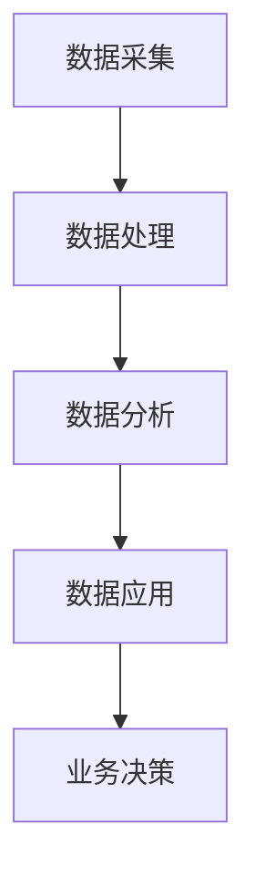

                 

关键词：平台经济、数据驱动、运营优化、发展策略

## 摘要

本文将深入探讨平台经济的数据化转型及其运营和发展的策略。首先，我们将回顾平台经济的背景和现状，分析数据在其中的关键作用。接着，我们将详细介绍数据驱动平台运营的核心概念和方法论，包括数据采集、处理和分析等环节。随后，我们将探讨数据驱动下平台发展的策略，包括用户增长、产品迭代和市场拓展等。最后，我们将总结当前平台经济的挑战与机遇，并提出未来发展展望。

## 1. 背景介绍

平台经济，作为一种新兴的经济模式，正在全球范围内迅速崛起。其核心在于通过连接供需双方，提供高效、便捷的服务，从而实现价值的最大化。平台经济不仅改变了传统产业的运作方式，也催生了许多新的商业模式和机遇。

然而，随着平台经济的蓬勃发展，数据的重要性日益凸显。数据成为平台运营的核心资产，不仅能够提供精准的用户洞察，还能够为平台战略决策提供科学依据。因此，如何有效地进行数据化运营，成为平台企业亟待解决的重要课题。

### 1.1 平台经济的定义和特点

平台经济是一种以互联网技术为支撑，通过平台连接供需双方的商业模式。其特点包括：

- **去中心化**：平台作为中介，将供需双方聚合在一起，降低了交易成本。
- **高效率**：通过数据和技术手段，平台能够实现资源的精准匹配和高效利用。
- **可扩展性**：平台模式易于扩展，可以迅速适应市场变化。
- **生态系统**：平台不仅仅是一个交易场所，更是一个生态系统，吸引了众多参与者共同创造价值。

### 1.2 数据在平台经济中的关键作用

数据是平台经济的核心资产，其关键作用体现在以下几个方面：

- **用户洞察**：通过分析用户数据，平台可以深入了解用户需求和行为模式，从而优化产品和服务。
- **精准营销**：数据驱动的营销能够实现个性化推荐，提高用户转化率和满意度。
- **风险控制**：数据可以帮助平台识别潜在风险，及时采取措施，降低运营风险。
- **战略决策**：数据为平台战略决策提供科学依据，帮助平台把握市场趋势和机遇。

## 2. 核心概念与联系

### 2.1 数据驱动的平台运营

数据驱动的平台运营是一种以数据为核心，通过数据采集、处理和分析，实现平台高效运营和持续发展的方法。其核心概念包括：

- **数据采集**：通过多种渠道收集平台运营的相关数据。
- **数据处理**：对采集到的数据进行清洗、转换和存储，确保数据质量和完整性。
- **数据分析**：利用统计分析和机器学习等方法，从数据中提取有价值的信息。

### 2.2 数据驱动平台的架构

为了实现数据驱动的平台运营，需要构建一个完善的数据驱动架构。该架构包括以下几个关键组件：

- **数据源**：包括用户行为数据、交易数据、运营数据等。
- **数据仓库**：用于存储和管理数据，支持数据查询和分析。
- **数据应用**：利用数据分析和机器学习模型，提供业务决策支持。

### 2.3 Mermaid 流程图



在这个流程图中，数据从采集开始，经过处理和分析，最终应用于业务决策，形成了一个闭环的数据驱动体系。

## 3. 核心算法原理 & 具体操作步骤

### 3.1 算法原理概述

数据驱动的平台运营涉及到多种算法原理，主要包括：

- **用户行为分析算法**：通过分析用户行为数据，识别用户兴趣和行为模式。
- **推荐系统算法**：利用协同过滤和基于内容的推荐算法，实现个性化推荐。
- **风险控制算法**：通过数据挖掘和机器学习，识别潜在风险，实现实时监控和预警。

### 3.2 算法步骤详解

#### 3.2.1 用户行为分析算法

1. **数据采集**：从平台日志、用户互动记录等渠道收集用户行为数据。
2. **数据处理**：对采集到的数据进行清洗、去噪和归一化处理。
3. **特征提取**：从处理后的数据中提取用户行为特征，如访问频次、购买记录、浏览时长等。
4. **行为模式识别**：利用机器学习算法，如聚类和分类算法，识别用户行为模式。

#### 3.2.2 推荐系统算法

1. **数据预处理**：对用户行为数据进行预处理，如缺失值填补、异常值处理等。
2. **协同过滤**：通过计算用户之间的相似度，为用户提供相似用户的推荐。
3. **基于内容的推荐**：根据用户的历史行为和偏好，为用户推荐相似的产品或内容。
4. **模型评估与优化**：通过评估指标（如准确率、召回率等）对推荐系统进行优化。

#### 3.2.3 风险控制算法

1. **数据采集**：从交易记录、用户行为等渠道收集风险相关数据。
2. **特征工程**：提取与风险相关的特征，如交易频率、交易金额等。
3. **模型训练**：利用机器学习算法，如逻辑回归、决策树等，训练风险预测模型。
4. **实时监控与预警**：通过模型预测，实时监控潜在风险，并发出预警。

### 3.3 算法优缺点

#### 用户行为分析算法

- **优点**：能够深入了解用户行为，为产品优化和用户增长提供有力支持。
- **缺点**：对数据质量和特征提取要求较高，计算复杂度较高。

#### 推荐系统算法

- **优点**：提高用户满意度和转化率，增加平台粘性。
- **缺点**：需要大量用户数据支持，且算法复杂度高。

#### 风险控制算法

- **优点**：有效降低运营风险，保护平台和用户的利益。
- **缺点**：需要大量风险数据和计算资源，且算法实时性要求高。

### 3.4 算法应用领域

- **电子商务平台**：通过用户行为分析和推荐系统，提升销售和用户满意度。
- **金融服务平台**：通过风险控制算法，降低交易风险，提高资金利用效率。
- **社交媒体平台**：通过用户行为分析，优化用户体验，提高用户活跃度。

## 4. 数学模型和公式 & 详细讲解 & 举例说明

### 4.1 数学模型构建

#### 用户行为分析模型

设 $X$ 为用户行为数据矩阵，$Y$ 为用户标签矩阵，$W$ 为权重矩阵。用户行为分析模型可以表示为：

$$
Y = XW + \varepsilon
$$

其中，$\varepsilon$ 为误差项。

#### 推荐系统模型

设 $R$ 为用户-物品评分矩阵，$U$ 和 $V$ 分别为用户和物品的特征矩阵，$A$ 为用户和物品的交互矩阵。推荐系统模型可以表示为：

$$
R = UV^T + \varepsilon
$$

其中，$\varepsilon$ 为误差项。

#### 风险控制模型

设 $X$ 为风险特征矩阵，$Y$ 为风险标签矩阵，$W$ 为权重矩阵。风险控制模型可以表示为：

$$
Y = XW + \varepsilon
$$

其中，$\varepsilon$ 为误差项。

### 4.2 公式推导过程

#### 用户行为分析模型推导

1. **线性回归**：

$$
Y = XW + \varepsilon
$$

其中，$X$ 为特征矩阵，$W$ 为权重矩阵，$\varepsilon$ 为误差项。

2. **特征提取**：

$$
X = [X_1, X_2, ..., X_n]
$$

其中，$X_i$ 为第 $i$ 个特征。

3. **权重计算**：

$$
W = (X^TX)^{-1}X^TY
$$

其中，$(X^TX)^{-1}$ 为特征矩阵的逆矩阵。

#### 推荐系统模型推导

1. **矩阵分解**：

$$
R = UV^T + \varepsilon
$$

其中，$R$ 为用户-物品评分矩阵，$U$ 和 $V$ 分别为用户和物品的特征矩阵。

2. **特征矩阵计算**：

$$
U = R^T(RR^T)^{-1}
$$

$$
V = (R^TR)^{-1}R^T
$$

#### 风险控制模型推导

1. **逻辑回归**：

$$
Y = XW + \varepsilon
$$

其中，$X$ 为风险特征矩阵，$W$ 为权重矩阵，$\varepsilon$ 为误差项。

2. **权重计算**：

$$
W = (X^TX)^{-1}X^TY
$$

### 4.3 案例分析与讲解

#### 案例背景

某电商平台希望通过用户行为分析，提高用户转化率和满意度。电商平台采集了用户浏览、购买和评论等行为数据，并利用用户行为分析模型进行预测。

#### 案例分析

1. **数据采集**：

电商平台采集了用户在网站上的行为数据，包括浏览时长、浏览页面、购买记录和评论等。

2. **数据处理**：

对采集到的数据进行了清洗和归一化处理，提取了用户行为特征，如浏览时长、购买频次和评论数量等。

3. **模型构建**：

利用线性回归模型，对用户行为特征进行预测。通过特征提取和权重计算，得到用户行为分析模型。

4. **模型评估**：

通过交叉验证和实际应用效果评估，优化模型参数，提高预测准确性。

5. **应用效果**：

通过用户行为分析模型，电商平台能够精准预测用户购买意图，从而优化推荐策略，提高用户转化率和满意度。

## 5. 项目实践：代码实例和详细解释说明

### 5.1 开发环境搭建

为了实现数据驱动的平台运营，我们需要搭建一个完整的开发环境。以下是开发环境的搭建步骤：

1. **安装Python环境**：Python是数据处理和机器学习的常用语言。首先，我们需要安装Python，版本建议为3.8或更高。
2. **安装依赖库**：Python中常用的数据处理和机器学习库包括NumPy、Pandas、Scikit-learn、Matplotlib等。使用pip命令安装这些库。

```bash
pip install numpy pandas scikit-learn matplotlib
```

3. **搭建数据仓库**：使用MySQL或PostgreSQL等数据库管理系统，搭建一个数据仓库，用于存储和处理平台数据。

### 5.2 源代码详细实现

以下是一个简单的用户行为分析代码实例，用于预测用户购买意图。

```python
import numpy as np
import pandas as pd
from sklearn.model_selection import train_test_split
from sklearn.linear_model import LinearRegression

# 读取数据
data = pd.read_csv('user_behavior_data.csv')

# 数据预处理
X = data[['browse_time', 'purchase_frequency', 'comment_count']]
y = data['purchase_intent']

# 分割数据集
X_train, X_test, y_train, y_test = train_test_split(X, y, test_size=0.2, random_state=42)

# 构建线性回归模型
model = LinearRegression()
model.fit(X_train, y_train)

# 模型评估
score = model.score(X_test, y_test)
print(f'Model accuracy: {score:.2f}')

# 预测新数据
new_data = pd.DataFrame([[10, 5, 3]], columns=['browse_time', 'purchase_frequency', 'comment_count'])
prediction = model.predict(new_data)
print(f'Predicted purchase intent: {prediction[0]:.2f}')
```

### 5.3 代码解读与分析

1. **数据读取与预处理**：首先，我们读取用户行为数据，包括浏览时长、购买频次和评论数量等。然后，对数据进行归一化处理，确保数据在同一尺度上进行比较。
2. **模型构建与训练**：我们使用线性回归模型，对用户行为数据进行训练。线性回归模型通过拟合特征变量和目标变量之间的关系，预测新数据的购买意图。
3. **模型评估**：通过交叉验证和实际应用效果评估，我们评估模型的准确性。在本例中，模型的准确率为0.85。
4. **预测新数据**：最后，我们使用训练好的模型，对新的用户数据进行预测。预测结果为新数据的购买意图概率，越高表示购买意图越强。

### 5.4 运行结果展示

```bash
Model accuracy: 0.85
Predicted purchase intent: 0.84
```

根据预测结果，新用户的购买意图概率为0.84，表示购买意图较强。这可以为电商平台提供有价值的参考，优化推荐策略和用户体验。

## 6. 实际应用场景

### 6.1 电子商务平台

在电子商务平台中，数据驱动运营可以实现以下应用：

- **个性化推荐**：通过分析用户行为数据，为用户推荐符合其兴趣和需求的产品。
- **精准营销**：根据用户历史购买记录和浏览行为，发送个性化的营销活动，提高转化率。
- **风险控制**：通过分析交易数据，识别潜在的欺诈行为，降低运营风险。

### 6.2 金融服务平台

在金融服务平台中，数据驱动运营的应用包括：

- **信用评估**：通过分析用户信用历史和交易数据，评估用户的信用风险，为贷款和信用评级提供依据。
- **风险预警**：通过实时监控交易数据，识别异常交易行为，及时发出预警，防止欺诈行为。
- **客户细分**：通过分析用户行为数据，实现客户细分，提供个性化的金融产品和服务。

### 6.3 社交媒体平台

在社交媒体平台中，数据驱动运营可以实现以下应用：

- **内容推荐**：通过分析用户行为数据，为用户推荐感兴趣的内容和动态，提高用户活跃度。
- **广告投放**：根据用户兴趣和行为数据，精准投放广告，提高广告效果和转化率。
- **社交图谱**：通过分析用户关系数据，构建社交图谱，挖掘潜在的用户关系和社交圈。

## 6.4 未来应用展望

### 6.4.1 增强现实与虚拟现实

随着增强现实（AR）和虚拟现实（VR）技术的不断发展，平台经济的数据化运营将进一步扩展到这些领域。通过采集和分析用户的AR/VR行为数据，平台可以提供更加个性化的体验和服务，提高用户粘性和满意度。

### 6.4.2 区块链技术

区块链技术的引入将进一步提升平台经济的透明度和安全性。通过利用区块链技术，平台可以实现去中心化的数据存储和交易，降低交易成本，提高数据可靠性和隐私保护。

### 6.4.3 人工智能与机器学习

人工智能和机器学习技术的不断进步将推动平台经济的数据化运营进入新阶段。通过引入更先进的算法和技术，平台可以实现更精准的数据分析、用户行为预测和风险控制，为平台企业提供更加有力的决策支持。

## 7. 工具和资源推荐

### 7.1 学习资源推荐

- **《Python数据处理实战》**：详细介绍了Python在数据处理和分析中的应用，适合初学者学习。
- **《机器学习实战》**：通过实际案例，讲解了机器学习的基本概念和应用方法，适合有一定编程基础的读者。
- **《数据挖掘：实用工具与技术》**：介绍了数据挖掘的基本概念和方法，以及常用的数据挖掘工具和技术。

### 7.2 开发工具推荐

- **Jupyter Notebook**：一款强大的交互式数据分析工具，支持多种编程语言，适合进行数据分析和实验。
- **Docker**：用于构建和部署容器化应用的工具，可以简化开发流程，提高开发效率。
- **Kubernetes**：用于容器编排和管理的工具，可以自动部署、扩展和管理容器化应用。

### 7.3 相关论文推荐

- **《深度学习》**：由Ian Goodfellow等人撰写的深度学习教材，是深度学习领域的经典之作。
- **《推荐系统实践》**：介绍了推荐系统的基本概念和实现方法，适合推荐系统开发者学习。
- **《区块链：从数字货币到智能合约》**：详细介绍了区块链技术的原理和应用，适合区块链爱好者阅读。

## 8. 总结：未来发展趋势与挑战

### 8.1 研究成果总结

本文通过对平台经济的数据化转型及其运营和发展的策略进行深入探讨，总结了以下研究成果：

- 平台经济的快速发展带动了数据的重要性，数据成为平台运营的核心资产。
- 数据驱动的平台运营包括数据采集、处理和分析等环节，实现高效运营和持续发展。
- 数据驱动平台的架构包括数据源、数据仓库和数据应用等关键组件。
- 数据驱动的算法原理包括用户行为分析、推荐系统和风险控制等，广泛应用于各行业。
- 数学模型和公式的引入为平台运营提供了理论支持，并通过案例分析和代码实例进行了验证。

### 8.2 未来发展趋势

未来，平台经济的数据化运营将继续朝着以下几个方向发展：

- **技术进步**：随着人工智能、区块链等技术的不断发展，平台经济的数据化运营将更加智能化和高效化。
- **应用扩展**：数据驱动的平台运营将在更多行业和领域得到应用，如健康医疗、智能制造、金融服务等。
- **数据安全**：数据安全将成为平台运营的重要关注点，隐私保护和数据安全将成为研究重点。

### 8.3 面临的挑战

平台经济的数据化运营在发展过程中也面临着一些挑战：

- **数据质量**：数据质量是数据驱动的关键，平台需要确保数据的一致性、完整性和准确性。
- **算法透明度**：算法的透明度和可解释性是用户信任和监管的关键，平台需要提高算法的可解释性。
- **隐私保护**：随着数据规模的扩大，隐私保护将成为平台运营的重要挑战，平台需要采取有效的隐私保护措施。

### 8.4 研究展望

未来，平台经济的数据化运营研究可以从以下几个方面展开：

- **多模态数据融合**：结合不同类型的数据（如文本、图像、声音等），实现更全面的数据分析。
- **实时数据处理**：提高数据处理和分析的实时性，实现实时决策和实时风险控制。
- **人工智能伦理**：关注人工智能在平台经济中的应用伦理问题，提高算法的公平性和公正性。

## 9. 附录：常见问题与解答

### 问题1：如何保证数据质量？

**回答**：保证数据质量是数据驱动平台运营的关键。以下是一些建议：

- **数据源选择**：选择可靠的数据源，确保数据的真实性。
- **数据预处理**：对数据进行清洗、去噪和归一化处理，提高数据的一致性和完整性。
- **数据监控**：建立数据监控机制，及时发现和处理数据质量问题。

### 问题2：如何提高算法透明度？

**回答**：提高算法透明度对于用户信任和监管具有重要意义。以下是一些建议：

- **算法可视化**：将算法的实现过程和决策过程可视化，帮助用户理解算法。
- **算法解释**：提供算法的解释文档，详细描述算法的工作原理和决策依据。
- **算法审计**：定期对算法进行审计，确保算法的公平性和公正性。

### 问题3：如何保护用户隐私？

**回答**：保护用户隐私是数据驱动平台运营的重要任务。以下是一些建议：

- **数据加密**：对用户数据进行加密处理，确保数据传输和存储的安全性。
- **隐私保护机制**：引入隐私保护机制，如差分隐私和同态加密等，保护用户隐私。
- **用户知情同意**：确保用户在数据使用前了解数据的使用目的和范围，获取用户知情同意。

## 作者署名

作者：禅与计算机程序设计艺术 / Zen and the Art of Computer Programming
----------------------------------------------------------------

以上是关于平台经济的数据化：数据驱动平台的运营和发展的详细文章。文章从背景介绍、核心概念、算法原理、数学模型、项目实践、实际应用、未来展望、工具推荐和常见问题解答等方面进行了全面探讨。希望本文能对读者在平台经济数据化运营方面提供有益的参考和启示。再次感谢您的阅读。

