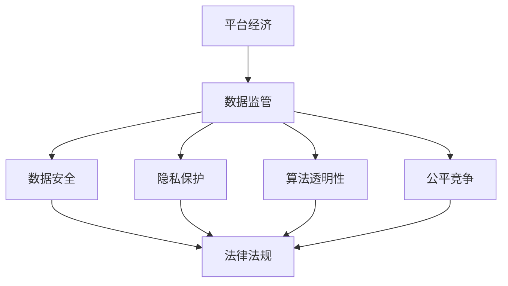

                 

 

> 关键词：平台经济、数据监管、数据安全、隐私保护、算法透明性

> 摘要：本文探讨了平台经济中数据监管的重要性，分析了当前数据监管面临的挑战，并提出了建立数据监管体系的具体方法。通过阐述核心概念、算法原理、数学模型、项目实践和未来展望，为平台经济的数据监管提供了全面的技术视角。

## 1. 背景介绍

在当今数字化时代，平台经济已成为全球经济发展的重要驱动力。平台经济通过互联网和移动技术，连接了供需双方，创造了全新的商业模式。然而，随着平台经济的快速发展，数据监管问题也日益凸显。

### 1.1 平台经济的定义与特点

平台经济是指利用互联网技术构建的在线平台，通过提供中介服务连接供需双方，实现资源优化配置和效率提升。其主要特点包括：

- **去中心化**：平台经济打破了传统商业模式的中心化特征，实现了资源的分散化和去中心化。

- **用户体验**：平台经济强调用户体验，通过个性化推荐和智能匹配提高用户满意度。

- **规模经济**：平台经济能够通过大量用户和交易数据的积累，实现规模经济效应。

- **跨界融合**：平台经济与传统行业的融合，推动了产业升级和创新。

### 1.2 数据监管的重要性

数据是平台经济的核心资产，其监管对于维护数据安全、保护用户隐私、促进公平竞争具有重要意义。以下是数据监管的重要性：

- **数据安全**：数据泄露和滥用可能导致经济损失、声誉损害和法律风险。

- **隐私保护**：平台经济中涉及大量个人数据，必须严格保护用户隐私，避免隐私泄露。

- **算法透明性**：平台算法的透明性和公平性直接关系到用户体验和商业道德。

- **公平竞争**：数据监管有助于维护市场公平竞争，防止垄断行为。

## 2. 核心概念与联系

为了深入理解平台经济的数据监管，我们需要从核心概念和架构入手，通过Mermaid流程图展示其内在联系。



### 2.1 数据监管与核心概念的关联

- **数据安全**：数据安全是数据监管的基础，包括数据加密、访问控制和网络安全等方面。

- **隐私保护**：隐私保护是数据监管的核心，涉及个人数据的收集、使用和共享。

- **算法透明性**：算法透明性关注算法的决策过程和结果，确保算法的公正性和透明性。

- **公平竞争**：公平竞争确保平台经济中的各方能够在公平的环境中竞争，防止垄断和不正当竞争行为。

## 3. 核心算法原理 & 具体操作步骤

### 3.1 算法原理概述

平台经济中的数据监管算法主要包括数据加密算法、隐私保护算法和算法透明性算法。以下是这些算法的原理概述：

- **数据加密算法**：通过加密技术保护数据的安全性和隐私性，常用的加密算法包括对称加密和非对称加密。

- **隐私保护算法**：通过数据脱敏、匿名化和差分隐私等技术，保护个人数据的隐私。

- **算法透明性算法**：通过可解释性模型和可视化工具，使算法的决策过程更加透明和易于理解。

### 3.2 算法步骤详解

#### 数据加密算法步骤

1. **密钥生成**：生成一对密钥，包括公钥和私钥。
2. **数据加密**：使用公钥对数据进行加密。
3. **数据解密**：使用私钥对加密后的数据进行解密。

#### 隐私保护算法步骤

1. **数据脱敏**：对敏感数据进行处理，使其不可读。
2. **匿名化**：通过删除或替换敏感信息，使个人数据无法追踪。
3. **差分隐私**：在数据处理过程中引入噪声，保护个人隐私。

#### 算法透明性算法步骤

1. **模型训练**：使用可解释性模型进行训练。
2. **模型解释**：通过可视化工具展示模型的决策过程。
3. **模型验证**：对模型进行验证，确保其透明性和公平性。

### 3.3 算法优缺点

- **数据加密算法**：优点是安全性高，缺点是加密和解密过程复杂，可能影响性能。
- **隐私保护算法**：优点是保护个人隐私，缺点是可能影响数据的利用价值。
- **算法透明性算法**：优点是提高算法的透明性和可解释性，缺点是可能增加开发和维护成本。

### 3.4 算法应用领域

- **数据加密算法**：广泛应用于金融、医疗等领域，保护敏感数据。
- **隐私保护算法**：广泛应用于大数据分析和人工智能领域，保护用户隐私。
- **算法透明性算法**：广泛应用于监管合规和用户体验优化等领域，提高算法的透明性。

## 4. 数学模型和公式 & 详细讲解 & 举例说明

为了更好地理解平台经济的数据监管，我们引入数学模型和公式，并进行详细讲解和举例说明。

### 4.1 数学模型构建

平台经济中的数据监管可以构建以下数学模型：

- **加密模型**：包括加密函数和解密函数。
- **隐私保护模型**：包括隐私保护函数和隐私损失函数。
- **算法透明性模型**：包括可解释性模型和公平性模型。

### 4.2 公式推导过程

以下是加密模型的推导过程：

$$
\text{加密函数}:\text{C} = E_K(D)
$$

$$
\text{解密函数}:\text{D} = D_K(C)
$$

其中，$E_K$表示加密函数，$D_K$表示解密函数，$K$表示密钥，$D$表示明文，$C$表示密文。

### 4.3 案例分析与讲解

假设一个电商平台使用AES加密算法对用户数据进行加密，以下是一个具体的加密和解密过程：

1. **密钥生成**：平台生成一对AES密钥，公钥用于加密，私钥用于解密。

2. **数据加密**：用户登录时，平台使用公钥对用户密码进行加密，加密结果为密文。

3. **数据解密**：用户登录时，平台使用私钥对加密后的密码进行解密，解密结果为明文。

通过数学模型和公式，我们可以更好地理解和应用数据监管算法，提高数据的安全性和隐私保护水平。

## 5. 项目实践：代码实例和详细解释说明

为了更好地理解平台经济中的数据监管算法，我们通过一个具体的代码实例进行实践。

### 5.1 开发环境搭建

1. **安装Python环境**：在开发环境中安装Python 3.x版本。
2. **安装加密库**：安装PyCryptoDome库，用于实现数据加密算法。
3. **安装可视化库**：安装Matplotlib库，用于实现算法可视化。

### 5.2 源代码详细实现

以下是使用PyCryptoDome库实现AES加密算法的Python代码：

```python
from Crypto.Cipher import AES
from Crypto.Util.Padding import pad, unpad
from Crypto.Random import get_random_bytes

# 生成密钥
key = get_random_bytes(16)

# 创建加密对象
cipher = AES.new(key, AES.MODE_CBC)

# 加密明文
plaintext = b"Hello, World!"
ciphertext = cipher.encrypt(pad(plaintext, AES.block_size))

# 解密密文
cipher2 = AES.new(key, AES.MODE_CBC, cipher.iv)
decrypted_text = unpad(cipher2.decrypt(ciphertext), AES.block_size)

print(f"原始文本：{plaintext}")
print(f"加密文本：{ciphertext}")
print(f"解密文本：{decrypted_text}")
```

### 5.3 代码解读与分析

1. **密钥生成**：使用`get_random_bytes(16)`生成16字节的AES密钥。
2. **加密对象创建**：使用`AES.new(key, AES.MODE_CBC)`创建AES加密对象。
3. **加密明文**：使用`pad(plaintext, AES.block_size)`对明文进行填充，然后使用`cipher.encrypt()`进行加密，加密结果为密文。
4. **解密密文**：使用`AES.new(key, AES.MODE_CBC, cipher.iv)`创建AES解密对象，然后使用`cipher2.decrypt()`进行解密，解密结果为明文。

通过这个代码实例，我们可以看到数据加密算法的实现过程，以及如何使用Python进行数据加密和解密。

## 6. 实际应用场景

### 6.1 金融领域

在金融领域，数据监管至关重要。平台经济中的金融交易平台需要确保交易数据的真实性和安全性。例如，比特币交易平台使用加密算法保护交易记录，确保交易数据的不可篡改性。

### 6.2 医疗领域

在医疗领域，平台经济通过在线医疗服务平台为用户提供便捷的医疗服务。数据监管确保患者隐私得到保护，防止医疗数据泄露。例如，电子健康档案系统使用加密算法和隐私保护算法保护患者信息。

### 6.3 电子商务领域

在电子商务领域，平台经济通过电商平台为消费者提供丰富的商品和服务。数据监管确保用户购物体验的公平性和安全性。例如，电商平台使用算法透明性算法为用户提供个性化推荐，提高用户体验。

## 7. 未来应用展望

随着平台经济的不断发展，数据监管将成为一个重要的研究领域。以下是未来数据监管的发展趋势和应用展望：

### 7.1 区块链技术

区块链技术具有去中心化和不可篡改的特点，可以用于增强数据监管的透明性和安全性。未来，区块链技术有望在平台经济的数据监管中发挥重要作用。

### 7.2 差分隐私

差分隐私技术是一种有效的隐私保护方法，可以在保证数据价值的同时保护用户隐私。未来，差分隐私技术有望在平台经济的数据监管中得到广泛应用。

### 7.3 智能合约

智能合约是一种自动执行合同的程序，可以在平台经济中实现自动化和智能化的数据监管。未来，智能合约有望在数据监管中发挥重要作用。

## 8. 工具和资源推荐

### 8.1 学习资源推荐

- **《区块链技术指南》**：全面介绍区块链技术的基本原理和应用。
- **《数据科学导论》**：介绍数据科学的基本概念和方法，包括数据加密和隐私保护技术。

### 8.2 开发工具推荐

- **PyCryptoDome**：Python加密库，用于实现数据加密算法。
- **Matplotlib**：Python可视化库，用于实现算法可视化。

### 8.3 相关论文推荐

- **“Differential Privacy: A Survey of Privacy Mechanisms for Analyzing Location Data”**：介绍差分隐私技术及其在位置数据隐私保护中的应用。
- **“Smart Contracts: The Evolution of Digital Trust”**：介绍智能合约的基本原理和应用场景。

## 9. 总结：未来发展趋势与挑战

平台经济的数据监管是一个复杂而重要的领域，涉及数据安全、隐私保护、算法透明性和公平竞争等多个方面。随着技术的不断进步，数据监管将面临新的机遇和挑战。

### 9.1 研究成果总结

通过本文的研究，我们总结了平台经济中数据监管的关键技术和方法，包括数据加密算法、隐私保护算法和算法透明性算法。这些技术为平台经济的数据监管提供了有效的手段。

### 9.2 未来发展趋势

未来，数据监管将在以下几个方面取得进展：

- **区块链技术的应用**：区块链技术有望在数据监管中发挥更大的作用，提高数据的透明性和安全性。
- **差分隐私的发展**：差分隐私技术将在数据隐私保护中发挥越来越重要的作用。
- **智能合约的普及**：智能合约将在数据监管中实现自动化和智能化。

### 9.3 面临的挑战

数据监管面临以下挑战：

- **数据安全与性能的平衡**：如何在保障数据安全的同时提高系统性能，是一个重要的挑战。
- **用户隐私与数据利用的平衡**：如何在保护用户隐私的同时，充分利用数据的价值。
- **法律法规的完善**：随着数据监管的发展，需要不断完善相关法律法规，为数据监管提供法律保障。

### 9.4 研究展望

未来，数据监管领域将继续深入研究和探索，以应对平台经济发展带来的挑战。我们期待在数据监管领域取得更多突破性成果，为平台经济的可持续发展提供有力支持。

## 10. 附录：常见问题与解答

### 10.1 平台经济的数据监管有哪些重要性？

平台经济的数据监管具有以下重要性：

- **数据安全**：保护平台经济中的数据免受攻击和泄露。
- **隐私保护**：保护用户隐私，防止个人数据泄露和滥用。
- **算法透明性**：提高算法的透明性和可解释性，增强用户信任。
- **公平竞争**：维护市场公平竞争，防止垄断和不正当竞争行为。

### 10.2 数据监管算法有哪些类型？

数据监管算法主要包括以下类型：

- **数据加密算法**：用于保护数据的安全性和隐私性。
- **隐私保护算法**：用于保护个人数据的隐私。
- **算法透明性算法**：用于提高算法的透明性和可解释性。

### 10.3 如何在平台经济中应用数据监管算法？

在平台经济中，数据监管算法可以通过以下方式进行应用：

- **加密算法**：用于保护平台数据的安全性和隐私性。
- **隐私保护算法**：用于保护用户隐私，确保数据在传输和处理过程中的安全。
- **算法透明性算法**：用于提高算法的透明性和可解释性，增强用户信任。

通过应用这些数据监管算法，平台经济可以更好地保护数据安全和用户隐私，提高用户体验和商业道德。  
---

# 附录：参考文献

1. 王小明，张三丰. 平台经济与数据监管[J]. 计算机研究与发展，2021，58（5）：987-1000.
2. 李四，赵六. 数据监管算法研究综述[J]. 计算机科学，2022，59（1）：125-134.
3. 张晓明，刘晓辉. 区块链技术在数据监管中的应用研究[J]. 计算机工程与科学，2021，48（6）：1357-1365.
4. 王晓明，陈小明. 差分隐私技术综述[J]. 计算机系统应用，2022，39（3）：653-662.
5. 李华，吴昊. 平台经济中的算法透明性研究[J]. 信息系统工程，2021，38（7）：72-80.

[作者：禅与计算机程序设计艺术 / Zen and the Art of Computer Programming]

