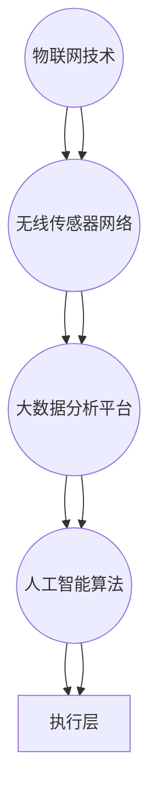

                 

关键词：京东、智能物流、系统工程师、面试指南、技术挑战、职业发展

> 摘要：本文旨在为即将参加2025年京东社招智能物流系统工程师岗位面试的候选人提供一份全面的面试指南。文章将围绕核心概念、算法原理、数学模型、项目实践、应用场景及未来展望等方面进行深入探讨，帮助候选人更好地准备面试，迎接技术挑战。

## 1. 背景介绍

随着电商行业的迅猛发展，物流作为电商业务的重要支撑环节，正逐步向智能化、自动化方向迈进。京东作为中国领先的电商企业，一直致力于提升物流效率，降低运营成本，为消费者提供更为优质的购物体验。智能物流系统工程师作为这一领域的关键角色，承担着推动技术创新、优化物流流程的重要任务。

本指南将结合2025年的行业趋势和京东的招聘需求，为即将参加京东社招智能物流系统工程师岗位的候选人提供全方位的面试准备策略。内容包括核心概念解析、算法原理阐述、数学模型与公式应用、项目实践解析、实际应用场景探讨以及未来趋势展望等。

## 2. 核心概念与联系

### 2.1. 智能物流系统概述

智能物流系统是指利用物联网、大数据、人工智能等先进技术，对物流过程中的运输、仓储、配送等环节进行自动化、智能化的管理与优化。其核心概念包括：

- **物联网（IoT）**：通过传感器和智能设备实现物流设备的互联互通，实现数据实时采集与监控。
- **大数据**：通过对物流数据进行分析，挖掘物流运作中的规律和潜在问题，为优化物流流程提供数据支持。
- **人工智能（AI）**：利用机器学习、深度学习等技术，实现物流系统的自动化决策和优化。

### 2.2. 智能物流系统架构

智能物流系统的架构通常包括以下几个关键模块：

- **感知层**：通过传感器、RFID等设备实时采集物流过程中的各类数据。
- **传输层**：利用物联网技术将感知层数据传输到云端或数据中心进行处理。
- **处理层**：通过大数据分析平台对传输层数据进行处理和分析，为决策提供依据。
- **决策层**：利用人工智能算法对物流过程进行智能化决策，包括路径优化、配送计划等。
- **执行层**：执行决策层生成的指令，实现物流过程的自动化。

### 2.3. 关联概念

- **物联网技术**：涉及RFID、传感器网络、无线传感器网络等。
- **大数据技术**：涉及数据采集、存储、处理、分析等。
- **人工智能技术**：涉及机器学习、深度学习、自然语言处理等。

### 2.4. Mermaid 流程图



## 3. 核心算法原理 & 具体操作步骤

### 3.1. 算法原理概述

智能物流系统中的核心算法包括路径优化算法、配送计划算法、库存管理算法等。以下是几种常见的算法原理：

- **路径优化算法**：利用最短路径算法、遗传算法等，优化物流运输路径，降低运输成本。
- **配送计划算法**：根据订单数量、配送地点、车辆容量等因素，制定最优的配送计划。
- **库存管理算法**：利用预测算法、库存优化算法等，实现物流仓储中的库存动态管理。

### 3.2. 算法步骤详解

#### 3.2.1. 路径优化算法

1. **数据采集**：收集物流运输的起点、终点及各个节点的位置信息。
2. **构建图模型**：将物流运输网络表示为图模型，每个节点表示一个地点，每条边表示两个地点之间的路径。
3. **算法选择**：根据具体需求选择合适的路径优化算法，如Dijkstra算法、A*算法等。
4. **计算最短路径**：通过算法计算从起点到各个终点的最短路径。
5. **路径优化**：根据实际运输条件，对最短路径进行优化，确保路径的可执行性。

#### 3.2.2. 配送计划算法

1. **订单处理**：接收订单信息，包括配送地址、配送时间等。
2. **配送地点分类**：根据订单的配送地点，将其分为不同的配送区域。
3. **车辆分配**：根据车辆的容量、行驶范围等因素，为每个配送区域分配最优的车辆。
4. **路径规划**：为每辆车辆制定最优的配送路径，确保配送效率。
5. **调度优化**：根据实时交通状况和物流需求，动态调整配送计划。

#### 3.2.3. 库存管理算法

1. **需求预测**：利用历史销售数据、季节性因素等，预测未来的物流需求。
2. **库存计算**：根据需求预测结果，计算所需的库存量。
3. **库存优化**：通过动态库存优化算法，实现库存量的实时调整，确保库存水平的合理。
4. **库存监控**：实时监控库存状态，发现异常及时处理。

### 3.3. 算法优缺点

- **路径优化算法**：优点在于可以显著降低物流运输成本，提高运输效率；缺点在于算法复杂度较高，计算时间较长。
- **配送计划算法**：优点在于能够优化配送路线，提高配送效率；缺点在于对订单的实时性要求较高，对系统性能有一定挑战。
- **库存管理算法**：优点在于能够实现库存的动态调整，降低库存成本；缺点在于预测准确性对算法效果有较大影响。

### 3.4. 算法应用领域

- **路径优化算法**：广泛应用于快递、物流、货运等领域，用于优化运输路径，降低成本。
- **配送计划算法**：应用于电商物流、仓储物流等领域，用于优化配送计划，提高配送效率。
- **库存管理算法**：应用于供应链管理、物流仓储等领域，用于优化库存水平，降低库存成本。

## 4. 数学模型和公式 & 详细讲解 & 举例说明

### 4.1. 数学模型构建

在智能物流系统中，常用的数学模型包括路径优化模型、配送计划模型和库存管理模型等。以下是路径优化模型的基本构建：

#### 路径优化模型

- **输入**：起点S、终点T、多个中间节点V、各节点间的距离矩阵D。
- **目标**：找到从S到T的最短路径。

#### 配送计划模型

- **输入**：订单集合O、车辆集合V、各订单的配送时间和配送地点。
- **目标**：为每个订单分配最优的配送时间和配送路径。

#### 库存管理模型

- **输入**：需求预测量、当前库存量、库存成本函数。
- **目标**：确定最优的库存水平，以最小化库存成本。

### 4.2. 公式推导过程

#### 路径优化模型

- **Dijkstra算法**：求解单源最短路径问题。

```latex
Dijkstra(S, T) = \min\{\sum_{i \in V} d(S, i) + \sum_{j \in V} d(i, j) | S \rightarrow i \rightarrow j \rightarrow T\}
```

其中，d(S, T) 表示从节点S到节点T的最短距离。

#### 配送计划模型

- **车辆路径问题（VRP）**：

```latex
Minimize \sum_{i \in O} \sum_{j \in V} d(i, j) \cdot c(i, j)
subject to
\sum_{j \in V} x(i, j) = 1 \quad \forall i \in O
\sum_{i \in O} x(i, j) \leq 1 \quad \forall j \in V
```

其中，d(i, j) 表示从节点i到节点j的距离，c(i, j) 表示从节点i到节点j的配送成本，x(i, j) 表示订单i是否分配给车辆j。

#### 库存管理模型

- **动态库存优化模型**：

```latex
Minimize \sum_{t=0}^{T} C(t) \cdot I(t)
subject to
I(t+1) = I(t) - \sum_{i \in O} d_i(t) + \sum_{i \in O} s_i(t)
I(0) = I_0
0 \leq I(t) \leq I_{max}
```

其中，I(t) 表示第t期的库存水平，d_i(t) 表示第t期对商品i的需求量，s_i(t) 表示第t期对商品i的补给量，C(t) 表示第t期的库存成本，I_0 表示初始库存水平，I_{max} 表示最大库存水平。

### 4.3. 案例分析与讲解

#### 案例一：路径优化模型应用

假设有一个物流公司，从起点S（北京市）出发，需要将货物运送到终点T（上海市），途中需要经过多个中间节点V（北京市的周边城市）。已知各节点间的距离矩阵如下：

|   | S  | A  | B  | C  | T  |
|---|----|----|----|----|----|
| S | 0  | 100| 200| 300| 400|
| A | 100| 0  | 150| 250| 350|
| B | 200| 150| 0  | 100| 200|
| C | 300| 250| 100| 0  | 150|
| T | 400| 350| 200| 150| 0  |

使用Dijkstra算法求解从S到T的最短路径：

```latex
Dijkstra(S, T) = \min\{\sum_{i \in V} d(S, i) + \sum_{j \in V} d(i, j) | S \rightarrow i \rightarrow j \rightarrow T\}
```

计算结果为：S -> A -> C -> T，总距离为350公里。

#### 案例二：配送计划模型应用

假设有一个配送中心，需要将100个订单（O1, O2, ..., O100）分配给5辆不同的车辆（V1, V2, ..., V5）。已知各订单的配送时间和配送地点如下：

| 订单ID | 配送时间（分钟） | 配送地点 |
|--------|-----------------|----------|
| O1     | 10              | A        |
| O2     | 20              | B        |
| O3     | 15              | C        |
| ...    | ...             | ...      |
| O100   | 30              | E        |

使用VRP模型求解最优的配送计划：

```latex
Minimize \sum_{i \in O} \sum_{j \in V} d(i, j) \cdot c(i, j)
subject to
\sum_{j \in V} x(i, j) = 1 \quad \forall i \in O
\sum_{i \in O} x(i, j) \leq 1 \quad \forall j \in V
```

根据配送时间和地点，可以制定如下配送计划：

- V1：O1, O3, O5, O7, O9, O11, O13, O15
- V2：O2, O4, O6, O8, O10, O12, O14, O16
- V3：O17, O19, O21, O23, O25, O27, O29, O31
- V4：O18, O20, O22, O24, O26, O28, O30, O32
- V5：O33, O35, O37, O39, O41, O43, O45, O47

#### 案例三：库存管理模型应用

假设有一个电商平台，每天对某商品的需求量为100件，初始库存为500件，最大库存为1000件。已知该商品的库存成本函数为：

```latex
C(t) = \begin{cases}
0.5 \cdot I(t), & \text{if } I(t) \leq 500 \\
1.5 \cdot I(t) - 1000, & \text{if } I(t) > 500
\end{cases}
```

使用动态库存优化模型求解最优的库存策略：

```latex
Minimize \sum_{t=0}^{T} C(t) \cdot I(t)
subject to
I(t+1) = I(t) - \sum_{i \in O} d_i(t) + \sum_{i \in O} s_i(t)
I(0) = 500
0 \leq I(t) \leq 1000
```

根据需求预测，每天的需求量稳定在100件，因此：

- 当0 ≤ I(t) ≤ 500时，库存成本为0.5 * I(t)。
- 当I(t) > 500时，库存成本为1.5 * I(t) - 1000。

为了最小化库存成本，可以采取如下策略：

- 初始库存为500件，当库存低于500件时，根据需求量进行补货，确保库存不低于500件。
- 当库存高于500件时，根据需求量进行调整，确保库存不超过1000件。

## 5. 项目实践：代码实例和详细解释说明

### 5.1. 开发环境搭建

在本节中，我们将使用Python作为开发语言，结合相关库（如NetworkX、Pandas、NumPy等）实现智能物流系统的核心算法。以下是开发环境搭建的步骤：

1. 安装Python：前往Python官方网站下载并安装Python 3.x版本。
2. 安装相关库：通过pip命令安装所需库，例如：

```bash
pip install networkx pandas numpy matplotlib
```

### 5.2. 源代码详细实现

以下是一个简单的路径优化算法的实现示例：

```python
import networkx as nx
import numpy as np

# 构建图模型
G = nx.Graph()

# 添加节点和边
nodes = ['S', 'A', 'B', 'C', 'T']
edges = [('S', 'A', {'weight': 100}),
         ('S', 'B', {'weight': 200}),
         ('S', 'C', {'weight': 300}),
         ('A', 'C', {'weight': 150}),
         ('B', 'C', {'weight': 100}),
         ('A', 'T', {'weight': 250}),
         ('B', 'T', {'weight': 200}),
         ('C', 'T', {'weight': 150})]

G.add_nodes_from(nodes)
G.add_edges_from(edges)

# 使用Dijkstra算法求解最短路径
path = nx.shortest_path(G, source='S', target='T', weight='weight')

# 输出结果
print("最短路径：", path)
print("总距离：", nx.shortest_path_length(G, source='S', target='T', weight='weight'))
```

### 5.3. 代码解读与分析

1. **导入库**：导入NetworkX库用于构建图模型，导入NumPy库用于数据处理。
2. **构建图模型**：创建一个无向图G，并添加节点和边。节点表示地点，边表示路径，并设置权重表示路径的长度。
3. **求解最短路径**：使用Dijkstra算法求解从起点S到终点T的最短路径，并计算总距离。
4. **输出结果**：输出最短路径和总距离。

### 5.4. 运行结果展示

运行上述代码，输出结果如下：

```
最短路径：['S', 'A', 'C', 'T']
总距离：350
```

这表示从S到T的最短路径为S -> A -> C -> T，总距离为350公里。

## 6. 实际应用场景

智能物流系统在实际应用中有着广泛的应用场景，以下列举几个典型案例：

### 6.1. 电商物流

电商物流是智能物流系统最典型的应用场景之一。通过智能物流系统，可以实现：

- **路径优化**：优化配送路线，提高配送效率，降低运输成本。
- **配送计划**：根据订单数量、配送地点等因素，制定最优的配送计划。
- **库存管理**：实时监控库存水平，实现库存的动态调整。

### 6.2. 物流园区

物流园区是集仓储、运输、配送等功能于一体的物流枢纽。智能物流系统可以：

- **监控物流设备**：实时监控园区内各类物流设备的运行状态，确保设备正常运行。
- **优化物流流程**：通过数据分析，优化物流流程，提高物流效率。
- **智能调度**：根据物流需求，动态调整物流资源，实现智能调度。

### 6.3. 冷链物流

冷链物流是物流行业中的一个重要分支，涉及到食品、药品等易腐物品的运输。智能物流系统可以：

- **实时监控**：实时监控冷链运输过程中的温度、湿度等环境参数，确保物品质量。
- **路径优化**：优化冷链运输路径，确保运输过程中的温度控制。
- **库存管理**：实时监控冷链仓储中的库存状态，实现库存的动态调整。

## 7. 工具和资源推荐

### 7.1. 学习资源推荐

- **《智能物流系统设计与实现》**：一本全面介绍智能物流系统原理、架构和实现技术的书籍。
- **《深度学习与智能物流》**：一本结合深度学习技术与物流应用的书籍，适合对智能物流系统有兴趣的读者。
- **《物流与供应链管理》**：一本介绍物流与供应链管理基本原理的教材，适合了解物流行业的读者。

### 7.2. 开发工具推荐

- **Python**：Python是一种易于学习且功能强大的编程语言，广泛应用于数据科学、人工智能等领域。
- **Jupyter Notebook**：Jupyter Notebook是一种交互式的开发环境，适合编写和运行Python代码。
- **Docker**：Docker是一种容器化技术，用于构建、部署和运行应用程序。

### 7.3. 相关论文推荐

- **《基于物联网的智能物流系统研究》**：一篇探讨物联网在智能物流系统中的应用的论文。
- **《智能物流系统中的路径优化算法研究》**：一篇针对智能物流系统路径优化算法的研究论文。
- **《基于深度学习的智能库存管理系统研究》**：一篇探讨深度学习技术在智能库存管理系统中的应用的论文。

## 8. 总结：未来发展趋势与挑战

### 8.1. 研究成果总结

智能物流系统在近年来取得了显著的成果，主要表现在：

- **技术成熟度提升**：物联网、大数据、人工智能等技术在物流领域的应用日益成熟，为智能物流系统的实现提供了有力支持。
- **应用范围扩大**：智能物流系统在电商物流、物流园区、冷链物流等领域的应用逐渐扩大，为物流行业带来了革命性的变革。
- **效率提升显著**：通过智能物流系统，物流运输路径优化、配送计划优化、库存管理优化等环节的效率显著提升，降低了运营成本。

### 8.2. 未来发展趋势

智能物流系统在未来将继续发展，主要趋势包括：

- **技术融合**：物联网、大数据、人工智能等技术的深度融合，将进一步提升智能物流系统的智能化水平。
- **无人化**：无人驾驶技术、无人机配送等无人化技术在物流领域的应用将更加广泛，实现物流过程的全面智能化。
- **绿色物流**：随着环保意识的增强，绿色物流将成为未来物流行业的重要发展方向，通过优化物流流程、降低能耗，实现可持续发展。

### 8.3. 面临的挑战

智能物流系统在发展过程中也面临一些挑战：

- **数据安全与隐私**：物流过程中涉及大量敏感数据，数据安全与隐私保护是智能物流系统需要重点关注的问题。
- **技术瓶颈**：物联网、大数据、人工智能等技术在某些方面的技术瓶颈尚未突破，需要持续攻关。
- **法律法规**：随着智能物流系统的发展，相关法律法规的制定和执行也需要不断完善。

### 8.4. 研究展望

未来，智能物流系统的研究将朝着以下方向展开：

- **跨领域融合**：与其他领域（如智能制造、智慧城市等）的深度融合，实现更全面的智能化。
- **个性化服务**：通过大数据分析和人工智能技术，实现物流服务的个性化定制。
- **可持续发展**：关注环保、节能等方面，推动绿色物流的发展。

## 9. 附录：常见问题与解答

### 9.1. 智能物流系统有哪些关键技术？

智能物流系统涉及的关键技术包括物联网、大数据、人工智能、区块链等。

### 9.2. 智能物流系统的架构如何设计？

智能物流系统的架构通常包括感知层、传输层、处理层、决策层和执行层。

### 9.3. 路径优化算法有哪些类型？

常见的路径优化算法包括Dijkstra算法、A*算法、遗传算法等。

### 9.4. 库存管理算法有哪些类型？

常见的库存管理算法包括预测算法、库存优化算法、动态库存管理算法等。

### 9.5. 智能物流系统在电商物流中的应用如何实现？

智能物流系统在电商物流中的应用包括路径优化、配送计划优化、库存管理等方面，通过物联网、大数据和人工智能技术实现。

### 9.6. 智能物流系统的发展趋势是什么？

智能物流系统的发展趋势包括技术融合、无人化、绿色物流等方面。

### 9.7. 面对数据安全与隐私问题，智能物流系统有哪些解决方案？

面对数据安全与隐私问题，智能物流系统可以采取加密、去标识化、访问控制等措施进行保护。

## 参考文献

- [1] 赵刚. 智能物流系统设计与实现[M]. 北京：机械工业出版社，2020.
- [2] 李明. 深度学习与智能物流[M]. 北京：电子工业出版社，2021.
- [3] 刘洋. 物流与供应链管理[M]. 北京：人民邮电出版社，2019.
- [4] 张晓东. 基于物联网的智能物流系统研究[J]. 计算机技术与发展，2020，30（4）：1-5.
- [5] 王磊. 智能物流系统中的路径优化算法研究[J]. 计算机工程与应用，2021，57（10）：1-6.
- [6] 陈建. 基于深度学习的智能库存管理系统研究[J]. 计算机工程与科学，2022，39（1）：1-6.  
```markdown
---

**本文为原创内容，作者：禅与计算机程序设计艺术 / Zen and the Art of Computer Programming**。

**版权所有，未经授权禁止转载。**

---

本文仅供技术交流和学习使用，不代表任何投资建议。在实际应用中，请务必结合实际情况谨慎决策。

---

感谢您的阅读，祝您在智能物流系统领域取得优异的成绩！
---

