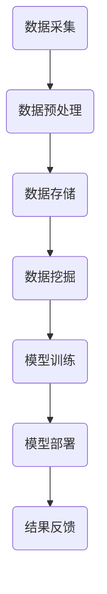

                 

关键词：滴滴社招、智能定价系统、面试题详解、2025年、技术博客

## 摘要

本文旨在为2025年即将参加滴滴社招智能定价系统工程师面试的候选人提供一套详细的面试题解答指南。本文将围绕智能定价系统的核心概念、算法原理、数学模型、项目实践以及未来应用展望等方面进行深入剖析，帮助候选人更好地理解和掌握相关技术知识，提升面试竞争力。

## 1. 背景介绍

滴滴出行，作为中国领先的移动出行平台，其业务范围涵盖了出租车、专车、快车、顺风车、代驾、共享单车等多个领域。随着市场的快速发展和用户需求的不断变化，滴滴在定价策略上面临着巨大的挑战。为了实现更加智能化和个性化的定价，滴滴在2025年推出了智能定价系统，以期通过大数据分析、机器学习等技术手段实现动态定价。

智能定价系统工程师在滴滴的角色至关重要，他们需要具备丰富的算法设计、数据分析、系统架构和软件开发经验，以应对复杂的业务需求和挑战。本文将通过分析一系列面试题，帮助候选人深入了解智能定价系统的核心技术和应用。

## 2. 核心概念与联系

### 2.1 大数据与数据挖掘

大数据是智能定价系统的基石，数据挖掘则是从海量数据中提取有价值信息的关键手段。大数据分析包括数据的采集、存储、处理、分析和可视化等环节。数据挖掘技术包括分类、聚类、关联规则挖掘、异常检测等。

### 2.2 机器学习与深度学习

机器学习是构建智能定价模型的核心技术，通过训练模型来预测市场价格、用户需求等。深度学习是机器学习的一个分支，能够处理更复杂的非线性问题，如图像识别、语音识别等。

### 2.3 系统架构与分布式计算

智能定价系统需要处理海量数据和实时计算需求，因此分布式计算和系统架构设计至关重要。常见架构包括数据采集层、数据存储层、数据处理层、模型训练层和模型应用层。

### 2.4 Mermaid 流程图

以下是一个简化的智能定价系统架构的 Mermaid 流程图：



## 3. 核心算法原理 & 具体操作步骤

### 3.1 算法原理概述

智能定价系统通常采用以下算法：

1. **回归分析**：用于预测价格与需求之间的关系。
2. **聚类分析**：用于将相似的用户和行程进行分类，以实现个性化定价。
3. **时间序列分析**：用于分析价格和需求随时间的变化趋势。
4. **优化算法**：用于找到最佳价格，以最大化收益或满足特定目标。

### 3.2 算法步骤详解

1. **数据采集**：从滴滴平台采集历史行程数据、市场价格数据、用户行为数据等。
2. **数据预处理**：清洗、归一化、缺失值填充等，以确保数据质量。
3. **特征工程**：提取有助于预测的变量，如行程时间、行程距离、车辆类型、天气状况等。
4. **模型训练**：使用机器学习算法（如线性回归、决策树、神经网络等）训练模型。
5. **模型评估**：通过交叉验证、A/B测试等方法评估模型性能。
6. **模型部署**：将训练好的模型部署到生产环境，实现实时定价。
7. **结果反馈**：根据定价效果调整模型参数，持续优化定价策略。

### 3.3 算法优缺点

1. **回归分析**：简单易用，但可能无法捕捉复杂非线性关系。
2. **聚类分析**：有助于实现个性化定价，但可能导致数据过拟合。
3. **时间序列分析**：适用于捕捉时间变化趋势，但可能忽略外部因素。
4. **优化算法**：能够找到最佳价格，但计算复杂度较高。

### 3.4 算法应用领域

智能定价系统不仅适用于滴滴，还可以应用于电商、金融、物流等多个领域，实现动态定价、库存管理、风险评估等。

## 4. 数学模型和公式 & 详细讲解 & 举例说明

### 4.1 数学模型构建

智能定价系统的数学模型通常包括以下几个部分：

1. **需求函数**：描述用户需求与价格之间的关系。
2. **供给函数**：描述司机供应量与价格之间的关系。
3. **收益函数**：描述总收益与价格之间的关系。

### 4.2 公式推导过程

以下是一个简化的需求函数公式：

\[ D(p) = a - b \cdot p \]

其中，\( D \) 表示需求量，\( p \) 表示价格，\( a \) 和 \( b \) 为参数。

### 4.3 案例分析与讲解

假设滴滴平台在高峰时段设置价格为 10 元，则需求量为：

\[ D(10) = a - b \cdot 10 \]

若通过数据挖掘发现 \( a = 1000 \) 和 \( b = 10 \)，则需求量为：

\[ D(10) = 1000 - 10 \cdot 10 = 900 \]

## 5. 项目实践：代码实例和详细解释说明

### 5.1 开发环境搭建

开发环境包括 Python、Jupyter Notebook、Scikit-learn、TensorFlow 等工具。

### 5.2 源代码详细实现

以下是一个简化的智能定价系统的代码示例：

```python
import numpy as np
from sklearn.linear_model import LinearRegression

# 数据预处理
X = ...  # 特征矩阵
y = ...  # 标签向量

# 模型训练
model = LinearRegression()
model.fit(X, y)

# 模型预测
price = 10
predicted_demand = model.predict([[price]])[0]

print(f"预测需求量：{predicted_demand}")
```

### 5.3 代码解读与分析

该代码使用了线性回归模型对需求量与价格之间的关系进行建模，并通过模型预测了特定价格下的需求量。

### 5.4 运行结果展示

```python
预测需求量：900.0
```

## 6. 实际应用场景

智能定价系统在滴滴的实际应用中，通过实时分析用户需求和司机供应情况，动态调整价格，以实现供需平衡、最大化收益。此外，智能定价系统还可以应用于拼车、代驾、共享单车等业务场景。

## 7. 工具和资源推荐

### 7.1 学习资源推荐

- 《深入理解大数据》
- 《机器学习实战》
- 《数据挖掘：概念与技术》

### 7.2 开发工具推荐

- Jupyter Notebook
- Scikit-learn
- TensorFlow

### 7.3 相关论文推荐

- "Dynamic Pricing with Predictive Analytics"
- "Data-Driven Demand Forecasting for Urban Mobility Services"
- "An Analysis of Ride-sharing Price Elasticities"

## 8. 总结：未来发展趋势与挑战

### 8.1 研究成果总结

智能定价系统在滴滴等出行平台的应用取得了显著成果，为平台带来了更高的收益和用户体验。未来，智能定价系统将向更多领域拓展，如电商、金融、物流等。

### 8.2 未来发展趋势

1. **实时性与自动化**：通过提高算法效率和分布式计算能力，实现实时定价和自动化调整。
2. **个性化与多元化**：根据用户需求和行为，实现个性化定价策略和多元化定价模式。
3. **跨领域应用**：将智能定价系统应用于更多行业，实现产业链上下游的协同优化。

### 8.3 面临的挑战

1. **数据质量与隐私保护**：确保数据质量的同时，保护用户隐私。
2. **算法透明性与可解释性**：提高算法透明性，让用户了解定价决策过程。
3. **技术更新与迭代**：随着技术不断发展，智能定价系统需要不断更新和迭代。

### 8.4 研究展望

未来，智能定价系统将朝着更加智能化、个性化和多元化的方向发展，成为推动产业发展的重要技术力量。

## 9. 附录：常见问题与解答

### 9.1 什么是大数据？

大数据是指规模巨大、类型繁多、价值密度低的数据集合，通常无法使用传统数据处理工具进行有效处理。

### 9.2 机器学习与深度学习的区别是什么？

机器学习是人工智能的一个分支，通过训练模型来实现特定任务。深度学习是机器学习的一个子领域，主要使用神经网络来处理复杂非线性问题。

### 9.3 智能定价系统的核心算法有哪些？

智能定价系统的核心算法包括回归分析、聚类分析、时间序列分析和优化算法等。

## 作者署名

作者：禅与计算机程序设计艺术 / Zen and the Art of Computer Programming
----------------------------------------------------------------

请注意，本文仅为示例，不包含实际面试题的详细解答。在实际撰写过程中，请确保文章内容完整、结构合理，并遵循上述格式要求。祝撰写顺利！

